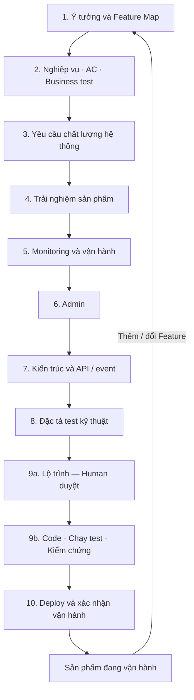

# Kidea — Thiết kế cách hoạt động

Trạng thái: `CĂN CỨ THIẾT KẾ VÒNG TRƯỚC — ĐANG XÁC NHẬN TỪNG PHẦN Ở VÒNG R2 — CHƯA TRIỂN KHAI`

Ngày cập nhật: 2026-09-08

Phạm vi: thiết kế hoạt động Kidea từ ý tưởng đến vận hành và thay đổi. Lộ trình xây dựng chính Kidea được quản lý riêng tại [KIDEA_ROADMAP.md](KIDEA_ROADMAP.md); chưa tạo/cài skill hoặc triển khai code.

Human đã đồng ý với thiết kế tổng thể và các đề xuất bổ sung, gồm giao diện tiến độ, quy tắc code theo môi trường, gate ở bước con, truy xuất xuyên tầng và ba bản đồ liên thông. Bản này hợp nhất các quyết định đó. Định dạng dữ liệu, runtime, bộ công cụ và phạm vi hỗ trợ cụ thể vẫn cần thiết kế, thử nghiệm và Human duyệt theo lộ trình; không coi đồng ý định hướng là duyệt trước mọi chi tiết triển khai.

Tài liệu này là nguồn thiết kế; roadmap là nguồn trạng thái xây dựng Kidea; tài liệu tham khảo là đầu vào; `answer.md` là bản sao câu trả lời để đọc từ xa. Human yêu cầu bắt đầu vòng rà soát R2 từ đầu ngày 2026-09-08: lựa chọn đã duyệt là căn cứ để xác nhận/điều chỉnh từng phần, không tự chuyển DONE/APPROVED của vòng trước sang vòng mới. [Chỉ đọc gói hiện tại](KIDEA_ROADMAP.md#review-current); [đối chiếu lộ trình cũ → mới](KIDEA_ROADMAP.md#coverage). Các mã gói P01 còn giữ dưới đây là nhận diện bằng chứng lịch sử, không phải task đang chạy.

Ranh giới hồ sơ project `PROJECT-FILES-r1` đã được Human duyệt ngày 2026-09-07: [tài liệu sản phẩm ngoài `.kidea`, hồ sơ điều phối trong `.kidea`](#files-view), cùng một Git repo. [Bằng chứng và phạm vi cập nhật](KIDEA_ROADMAP.md#project-files-review). Đề xuất thay đổi quyền Git/branch/release G1–G6 vẫn chưa được duyệt; không suy approval thư mục thành approval Git hoặc tiêu chí chất lượng.

[Phạm vi bản đầu](#first-release-scope) đã được Human đồng ý cùng các điều chỉnh ngày 2026-09-07. [Ma trận công nghệ](#platform-matrix) đã được Human duyệt tại `P01-T02`; Human đã chốt SvelteKit + TypeScript với prerender/SSR và realtime cho web. Human đã duyệt Kotlin + Jetpack Compose, Swift + SwiftUI và [cách tích hợp SEO vào gate quy trình](#seo-proposal); ma trận phiên bản/môi trường r3 đã được duyệt; chưa phải năng lực đã được triển khai hoặc kiểm chứng.

<a id="scope"></a>

## 1. Mục tiêu và ranh giới

Kidea là một skill hướng dẫn một người cùng AI biến ý tưởng thành sản phẩm có thể triển khai, vận hành và thay đổi lâu dài. Kết quả cần đạt không phải số lượng tài liệu, mà là sự thống nhất có thể kiểm tra giữa ý định của Human, đặc tả, thiết kế, code, test và sản phẩm đang vận hành.

Kidea dùng file để lưu sự thật về công việc, không dựa vào việc AI còn nhớ cuộc hội thoại. File không loại bỏ hoàn toàn sai sót của AI: cần thêm kiểm tra, bằng chứng thực thi và Human review.

Yêu cầu Human đã nêu:

- Một người + AI, mặc định một việc đang thực hiện tại mỗi thời điểm; không thiết kế quanh nhiều nhánh công việc song song.
- Đi từng bước, cập nhật trạng thái khi làm; mỗi bước lớn có Human approval.
- Quản lý Feature theo `MVP / Future / Idea`.
- Tài liệu rõ, hiện hành, gọn và đầy đủ; thay đổi phải xử lý trọn vẹn các phần liên quan.
- Resume được qua phiên làm việc hoặc máy khác khi có đủ file cần thiết.
- Trong project được Kidea quản lý, không tự commit, push hoặc tạo branch; chỉ thực hiện khi Human yêu cầu rõ.
- Thêm Feature giữa MVP hoặc sau production đều quay lại chốt Feature rồi đi qua các bước tiếp theo.
- Chốt thiết kế hoạt động Kidea trước, sau đó lập kế hoạch và xây dựng skill theo các gate đã duyệt.
- Khi cần, có giao diện tổng quan và chi tiết trạng thái project, các bước/task, MVP hoặc bổ sung Feature cho sản phẩm đã chạy production.
- Có quy tắc code phù hợp ngôn ngữ, thành phần và môi trường chạy; có cách kiểm tra việc tuân thủ và chất lượng thực tế.
- Các bước con quan trọng cũng phải có Human approval, không chỉ bước lớn.
- Tinh gọn, mạnh mẽ, chỉn chu; truy được ảnh hưởng xuyên suốt tài liệu, thiết kế, test, code và vận hành.

Phân biệt hai phạm vi Git: quy tắc không tự thao tác Git ở trên là hành vi của skill trong project được quản lý. Tại repository xây dựng Kidea này, Human yêu cầu tiếp tục lưu toàn bộ câu trả lời cuối vào `answer.md`, commit và push để đọc trên GitHub; quy tắc đó còn hiệu lực đến khi Human yêu cầu dừng. Không đưa ngoại lệ riêng của repo này thành hành vi mặc định của skill.

Thiết kế tổng thể được chấp thuận không có nghĩa skill đã tồn tại, đã được test hoặc đủ tin cậy để quản lý sản phẩm thật. Các tiêu chí kiểm chứng và quyết định triển khai còn mở nằm ở mục 12 và roadmap.

<a id="first-release-scope"></a>

### 1.1. Phạm vi bản đầu — căn cứ đã duyệt ở vòng trước

Căn cứ `P01-T01-SCOPE-r2`, được Human duyệt ngày 2026-09-07 cùng các điều chỉnh trong phản hồi. [Bằng chứng vòng trước](KIDEA_ROADMAP.md#p01-t01-review). Vòng R2: Human đã xác nhận D1–D2 của gói `R01-T01-S01-r1` — năng lực đầy đủ và ranh giới bản đầu; [bằng chứng đúng phạm vi](KIDEA_ROADMAP.md#r01-t01-result). Xác nhận này không duyệt lại toàn bộ chi tiết trong mục 1.1, công nghệ, pilot, Git hoặc tiêu chí chất lượng.

**Mục tiêu:** một bản Kidea dùng được trọn chu trình đã thống nhất cho một người cùng AI, trên phạm vi công nghệ đã kiểm chứng. Giữ đủ các năng lực cốt lõi, giới hạn bề rộng hỗ trợ; không gọi một bộ prompt hoặc vài helper chạy được là bản Kidea hoàn chỉnh.

<a id="first-release-audience"></a>

#### Người dùng và loại project

- Người dùng chính của bản đầu là Human đang xây dựng Kidea, dùng cùng AI để phát triển và vận hành các project của mình. Hướng dẫn sử dụng bằng tiếng Việt; phương pháp không gắn cứng với một ngành nghiệp vụ hoặc sản phẩm pilot.
- Luồng chính bắt đầu từ ý tưởng của một project mới; tiếp tục/resume, thêm Feature giữa MVP và thay đổi sau một bản đã phát hành đều thuộc phạm vi.
- Resume và change áp dụng cho project đã có hồ sơ Kidea hợp lệ, với source, bằng chứng và phiên bản công cụ cần thiết. Có source hoặc quy ước sẵn vẫn phải đối chiếu và tôn trọng chúng; không tự ghi đè để ép project theo template.
- Dự án cũ chưa có hồ sơ Kidea vẫn bắt đầu từ bước 1 và đi đầy đủ quy trình/gate. AI được đọc tài liệu và code hiện có làm context ở từng bước, giảm nhập lại; không coi hành vi đang có là nghiệp vụ đúng hoặc bằng chứng Human đã duyệt. Không tự suy ngược rồi chứng nhận toàn bộ đặc tả/trạng thái để bỏ qua quy trình. Việc này khác với resume một project đã có hồ sơ Kidea hợp lệ.

<a id="first-release-capabilities"></a>

#### Các năng lực bắt buộc khi nghiệm thu bản đầu

| Nhóm năng lực | Phạm vi bản đầu | Căn cứ chi tiết |
|---|---|---|
| Điều phối | Đủ `init`, `resume`, `status`, `approve`, `change`, `visualize`; trao đổi tự nhiên trong công việc, một task hiện hành và đúng ranh giới quyền | [Cách gọi](#commands), [approval](#state-approval) |
| Quy trình sản phẩm | Đủ mười bước, gồm nghiệp vụ/AC/test, chất lượng, UX, monitoring/admin, kiến trúc, kế hoạch/code và triển khai; từng gate vẫn riêng | [Quy trình](#workflow) |
| Hồ sơ và tiếp tục công việc | Một nguồn có hiệu lực cho mỗi dữ kiện; checkpoint, điểm quay lại, approval theo nội dung, task đã hoàn thành còn truy được; resume qua phiên/máy khi đủ đầu vào | [Hồ sơ](#files-view), [resume](#resume) |
| Truy xuất và thay đổi | Đủ ba bản đồ, đối chiếu hai chiều; tìm ảnh hưởng theo ngữ nghĩa, kể cả event/dữ liệu/cấu hình và trường hợp không có diff trung gian; không coi thiếu mapping là không ảnh hưởng | [Ba bản đồ](#three-maps), [change](#change) |
| Code và kiểm chứng | Profile rule theo tổ hợp đã chốt; test specification, test chạy được và bằng chứng gắn phiên bản/môi trường; có kiểm tra hành vi Kidea và pilot chạy thật | [Coding rules](#code-rules), [test](#testing), [cấu tạo skill](#skill-structure) |
| Xem tiến độ | HTML offline, chỉ đọc, tổng quan/chi tiết task, gate/blocker và nguồn; thể hiện đúng dữ liệu chưa biết hoặc snapshot cũ | [Giao diện tiến độ](#files-view) |
| Dùng và bàn giao | Có bản cài, hướng dẫn, giới hạn hỗ trợ, kiểm tra tương thích/nâng cấp và bằng chứng nghiệm thu trong phạm vi được Human cho phép | [R10](KIDEA_ROADMAP.md#r10) |

Một hạng mục không áp dụng cho sản phẩm cụ thể có thể được Human duyệt `N/A` theo thiết kế; điều đó không xóa năng lực hướng dẫn hạng mục ấy khỏi Kidea. Ví dụ pilot không cần mobile không có nghĩa Kidea bỏ bước xác định nền tảng hoặc mặc nhiên đã hỗ trợ triển khai mobile.

#### Mức hỗ trợ được cam kết

- Phương pháp tổng thể dùng lại được cho nhiều project; mức hỗ trợ thực thi chỉ được công bố cho các tổ hợp host/OS/ngôn ngữ/thành phần đã được chọn và kiểm chứng.
- Human đã chọn định hướng bản đầu: Kidea chạy trên Windows; backend sản phẩm dùng C++20, triển khai Ubuntu; Android/iOS native với code độc lập; web ưu tiên khả năng được tìm thấy trên công cụ tìm kiếm và AI search, đồng thời nhẹ/mượt. Đây là yêu cầu đích, chưa phải tuyên bố đã hỗ trợ. [Ma trận vòng trước](#platform-matrix) được rà tại R01-T03; runtime/schema thuộc R02, profile rule thuộc R05 và bản đồ thuộc R06.
- Với tổ hợp chưa hỗ trợ, Kidea phải nêu phần thiếu, chưa xác minh hoặc cần Human quyết định; không tự tuyên bố tương thích, tối ưu hoặc đầy đủ chỉ vì AI vẫn có thể đọc/viết code của ngôn ngữ đó.
- Bản đầu phải chứng minh luồng trọn vẹn và những tình huống gián đoạn/thay đổi đã chốt; một test helper hoặc một đường chạy thuận lợi chưa đủ nghiệm thu. Bộ case và phương pháp đo được rà theo gói nhỏ ở R01-T08/T09; chỉ áp dụng ngưỡng sau đúng approval, không kế thừa số đề xuất thành chuẩn.

<a id="first-release-exclusions"></a>

#### Những việc chưa làm trong bản đầu

- Nền tảng cộng tác nhiều người: Human không có định hướng xây chức năng này; không ghi thành cam kết tương lai. Cụm nhiều agent cho một Human là ý tưởng riêng, ngoài bản đầu, chưa có kế hoạch triển khai.
- Server Kidea, graph database, dịch vụ đồng bộ riêng hoặc dashboard tiến độ online có thao tác approve/deploy: Human chưa có ý định xây dịch vụ Kidea online. Chuyển hồ sơ/source giữa các máy dùng Git theo [quy tắc resume](#resume), không cần một dịch vụ đồng bộ Kidea.
- Kho coding rules/adapter bao phủ mọi ngôn ngữ, hệ điều hành và framework; hoặc tự động nhập/chứng nhận mọi dự án cũ chưa có hồ sơ.
- Tự quyết định nghiệp vụ, tự duyệt nội dung, tự thao tác Git/production; bảo đảm tuyệt đối không còn lỗi, không sót dependency hoặc đạt hiệu năng tốt nhất trong mọi môi trường.

Những giới hạn này không loại bỏ monitoring/admin của sản phẩm, hướng dẫn deploy/khôi phục, hay yêu cầu xử lý thay đổi sau release. Kidea vẫn hướng dẫn và kiểm chứng các phần đó trong phạm vi đã chốt; thao tác có tác dụng phụ chỉ được làm khi có quyền tương ứng.

Phạm vi này không duyệt trước ma trận phiên bản/công cụ, lựa chọn framework, pilot, runtime hoặc schema. Các đề xuất mới tiếp tục ở đúng gate của chúng.

<a id="platform-matrix"></a>

### 1.2. Ma trận nền tảng — căn cứ đã duyệt ở vòng trước

Gói review: `P01-T02-PLATFORM-r3`, ngày 2026-09-07, `APPROVED` toàn ma trận theo xác nhận Human “ok mình duyệt gói này”, đối với gói được trình tại commit `9f73940`. Tổ hợp phiên bản, phạm vi kiểm chứng và cách xử lý phần chờ dưới đây đã được duyệt làm nền thiết kế, không phải bằng chứng đã triển khai. [Đối chiếu nguồn và môi trường](exa-results/p01-t02-platform-baseline-2026-09-07.md) là bằng chứng nghiên cứu, không phải nguồn quyết định hoặc tracker khác. Các báo cáo cũ chỉ giữ vai trò tham khảo theo thời điểm.

| Thành phần | Hướng đã duyệt | Cấu hình nền đã duyệt để kiểm chứng | Môi trường thực thi dự kiến |
|---|---|---|---|
| Host Kidea | Windows, một Human + AI | Windows 11 x64; máy kiểm chứng đầu tiên là Windows 11 Pro 25H2 hiện có. Dùng phiên AI desktop hiện tại để thử hướng dẫn theo file; kiểm chứng khả năng nạp/gọi skill, chọn runtime/helper và cách đóng gói ở R02-T01 | Hồ sơ/source local, Git theo quyền đã chốt; không cần server Kidea. Không suy ra đã hỗ trợ mọi ứng dụng AI hoặc host Mac |
| Backend sản phẩm | C++20 → Ubuntu | Ubuntu 24.04 LTS amd64; GCC/G++ 13.3, CMake 3.28.3, Ninja; chuẩn C++20, không mặc định dùng modules/extension chưa kiểm chứng. Patch bảo mật distro được cập nhật có ghi nhận | Soạn source trên Windows; build/test Linux trong WSL2 Ubuntu đúng phiên bản hoặc môi trường Linux riêng được duyệt. Release phải build/test lại trên Ubuntu đích, không lấy binary Windows hoặc WSL PASS thay bằng chứng release |
| Android | Kotlin + Jetpack Compose; native, code độc lập | Android Studio Quail 1 (2026.1.1) hoặc stable tương thích AGP 9.2.1; Gradle 9.4.1, JDK 17; Kotlin tích hợp của AGP (2.3.10), Compose compiler khớp Kotlin; Compose BOM 2026.06.01. compileSdk 36.1, targetSdk 36, minSdk 26 là cấu hình nền đề xuất | Build trên Windows, Gradle Wrapper; một emulator khi cần và điện thoại thật để đo hiệu năng. Không thêm KMP/NDK mặc định; không áp lại kotlin-android plugin khi dùng Kotlin tích hợp của AGP 9 |
| iOS | Swift + SwiftUI; native, code độc lập; tận dụng Mac/iPhone hiện có | Khi đến bước iOS: ứng viên Xcode 26.6 + Swift compiler 6.3, Swift 6 language mode, iOS SDK 26.5; deployment target iOS 16.0 là nền đề xuất. Xcode này cần Tahoe 26.2–26.x | MacBook Pro 16 inch 2019 Intel, RAM 16 GB, hiện Sonoma và khoảng 512 GB trống; iPhone 12 Pro Max. Chỉ kiểm tra/nâng macOS nếu cần khi làm iOS; không cài/nâng ngay. UIKit/Metal chỉ bổ sung khi có nhu cầu và bằng chứng |
| Web | SvelteKit + TypeScript; prerender/SSR + realtime; SEO và hiệu năng xuyên suốt | Node.js 24 LTS (mốc 24.20.0), npm 11.19.0; SvelteKit 2.70.3, Svelte 5.57.0, TypeScript 6.0.3, Vite 8.2.2, vite-plugin-svelte 7.3.0, adapter-node 5.5.7. Đây là mốc tương thích metadata, chưa chạy build | Dev trên Windows; build/SSR trên Ubuntu 24.04 amd64, Node cùng dòng. Nội dung prerender/assets qua CDN khi triển khai; không ghép Astro mặc định, không chuyển nghiệp vụ C++ sang Node |

**Ý nghĩa cấu hình nền:** đây là tổ hợp đầu tiên để viết hướng dẫn và kiểm chứng Kidea, không phải giới hạn cố định cho mọi sản phẩm hoặc tuyên bố máy đã chạy được. Android 8/API 26 và iOS 16 là mức OS tối thiểu đề xuất cho tổ hợp này, không phải bằng chứng mượt trên mọi máy cũ; sản phẩm có nhu cầu khác phải chốt lại phạm vi ở đúng gate. Điện thoại là phạm vi kiểm chứng mobile đầu tiên; tablet/watch/TV/XR chưa được công bố hỗ trợ. Chưa chọn backend framework, database, CDN vendor hoặc thư viện đồ họa khi nghiệp vụ pilot chưa yêu cầu.

#### Chính sách phiên bản và khả năng tái tạo

- Dùng bản stable/LTS còn được hỗ trợ tại thời điểm thực hiện; không dùng beta/RC làm nền nghiệm thu. Các mốc ở bảng là snapshot ngày 2026-09-07, không phải lệnh cài hoặc đóng băng vô thời hạn. Trước khi tạo môi trường, kiểm tra lại bản vá, cảnh báo bảo mật, registry/release chính thức và tương thích toàn tổ hợp; khóa phiên bản thực vào lockfile/Gradle Wrapper, cấu hình build và evidence của project.
- Không lấy từng gói `latest` rồi giả định chúng tương thích: metadata SvelteKit được kiểm tra nhận TypeScript 5/6, không nhận TypeScript 7 đang là latest ở registry. Tương tự, Compose BOM không khóa Compose compiler; compiler phải theo phiên bản Kotlin thực tế của build.
- Đổi major, deployment target, host, adapter hoặc hợp đồng/runtime phải mở review ảnh hưởng trước phần việc phụ thuộc. Thay patch cũng cần test hồi quy và cập nhật evidence; nếu có breaking change/cảnh báo ảnh hưởng phạm vi thì xin Human quyết định, không giữ approval cũ cho nội dung đã đổi.
- Runtime/helper của **Kidea** vẫn quyết định ở R02-T01; Node trong dòng web là runtime **sản phẩm**, không tự quyết định ngôn ngữ helper. Trên Windows hiện có Node 22.18.0/npm 10.9.3 không có nghĩa đã cài Node 24 hoặc cần thay global ngay.

#### Môi trường và bằng chứng cần có trước khi công bố hỗ trợ

| Phạm vi | Môi trường/test cần có | Phần chưa kiểm chứng và điểm phải xử lý |
|---|---|---|
| Host/file/Git | Windows 11 x64; hồ sơ UTF-8, đường dẫn có dấu/khoảng trắng, CRLF/LF; init/resume/change, đổi checkout qua Git, conflict và approval cũ | Host đã quan sát read-only; hành vi skill/helper chưa tồn tại. R02/R06/R09/R10 kiểm chứng theo bản được phép cài |
| C++/Ubuntu | Build sạch Debug/Release với toolchain đã khóa; unit/integration và sanitizer phù hợp; artifact chạy trên Ubuntu đích có cấu hình/version rõ | WSL2 có distro tên Ubuntu nhưng chưa xác minh release bên trong, chưa khởi động/cài/sửa distro. R05 chốt rule/test và thử mẫu nhỏ; R08 chuẩn bị build/môi trường, R09 thực thi trước khi tuyên bố hỗ trợ |
| Android | Emulator API 26 và API 36 để kiểm tra hành vi; máy thật hạng thấp khoảng 3–4 GB RAM, màn hình 60 Hz để đo release build; ghi model/OS/chip thực | Chưa có model Android được Human cung cấp; emulator không chứng minh hiệu năng máy yếu. Chọn thiết bị khi lập kế hoạch thử trước R09; nếu chưa có thì mục hiệu năng là chưa kiểm chứng, không PASS. Chưa xác minh SDK/JDK/ảo hóa/GPU |
| iOS | iPhone 12 Pro Max hiện có và simulator OS tối thiểu khi runtime khả dụng; release build, unit/UI/integration và đo frame/bộ nhớ/pin trên máy thật | Chưa kiểm tra phiên bản iOS/Xcode/Mac thực, signing hoặc simulator. Nếu không có môi trường cho iOS tối thiểu thì nêu thiếu và bổ sung thiết bị hoặc xin đổi phạm vi; iPhone hiện có không đại diện mọi máy yếu |
| Web sản phẩm | Chromium/Firefox/WebKit để hồi quy; Chrome/Edge desktop stable, Safari trên iPhone và Chrome trên Android thật khi chuẩn bị release; route tĩnh, SSR động, private/admin, realtime mất/kết nối lại, cấu hình CDN/proxy khi áp dụng | Ghi phiên bản browser/test runner, viewport, mạng và CPU của phép đo khi chạy. WebKit tự động không thay Safari thật; chưa chọn thư viện test/đồ họa hoặc tuyên bố benchmark. Không nhầm với ma trận HTML offline Kidea ở R07 |

Ngân sách đo cụ thể (tải, độ trễ, khung hình, bộ nhớ, pin, dung lượng, độ tươi cache) phải gắn workload và tiêu chí được duyệt: R01-T04 rà pilot; R01-T08/T09 chốt case/phương pháp đo nghiệm thu Kidea theo từng gói; R04/R05/R08 xây hướng dẫn sản phẩm; R09 đo thật. Không đặt một cấu hình server hoặc số người dùng giả làm cam kết hiệu năng của mọi sản phẩm lớn.

#### Quyền, công cụ còn thiếu và thời điểm xin

| Hành động sau này | Ranh giới hiện tại | Khi nào cần xin/chốt |
|---|---|---|
| Cài thử skill/helper, đổi runtime host | Chưa được cấp bởi việc duyệt ma trận; vị trí cài/dependency còn thuộc R02-T01 | Trước thao tác cài thử ở phase phù hợp |
| Cài Node/JDK/SDK/Android Studio; bật ảo hóa hoặc sửa WSL | Chưa cài, không đổi global hoặc distro hiện có; ưu tiên môi trường tách biệt | Trước khi chuẩn bị môi trường build/test trong kế hoạch đã duyệt |
| Nâng macOS/cài Xcode, dùng thiết bị/signing | Chưa thực hiện; phải kiểm tra phần mềm đang dùng, backup và phiên bản iOS trước | Khi bắt đầu phần iOS; không đòi cài/nâng ngay trong review tài liệu R01-T03 |
| Mua/thuê thiết bị, Mac CI, server/CDN hoặc tài khoản trả phí | Không có ngân sách/nhà cung cấp nào được duyệt từ ma trận | Chỉ xin khi thiếu nguồn lực thực và đã nêu lựa chọn/chi phí |
| Đăng nhập, chứng chỉ, phát hành store, deploy công khai, DNS/production | Không được suy ra từ quyền nghiên cứu/tài liệu; không đưa secret vào Git | Trước đúng thao tác môi trường đích, theo gate release R08/R09/R10 |

Giới hạn release cần kiểm tra lại lúc thực hiện: Google Play hiện yêu cầu app điện thoại mới/update target API 36 trở lên; Apple hiện yêu cầu Xcode 26+/SDK iOS 26+ khi upload. Xcode 16.2 trên Sonoma chỉ là khả năng dùng công cụ cũ, không phải nền phát hành hiện hành. Xcode 27 beta chỉ chạy trên Apple Silicon; nếu sau này bắt buộc dùng toolchain đó, quay lại Human chọn mua/thuê/mượn nguồn lực phù hợp, không tự mua máy hoặc bỏ yêu cầu iOS. Nguồn và ngày đối chiếu nằm trong báo cáo liên kết ở đầu mục.

SSG/prerender là tạo sẵn HTML; SSR là tạo HTML phía máy chủ khi cần. Trang tĩnh dùng prerender/CDN, trang động cần SEO có nội dung chính, metadata và dữ liệu ban đầu trong HTML; realtime/hiệu ứng cập nhật phía trình duyệt sau lần tải đầu, tải phần nặng khi cần và không render lại toàn trang mỗi tick. Runtime/adapter SSR đề xuất ở bảng trên; nghiệp vụ vẫn thuộc backend C++20. Không công bố nhanh nhất khi chưa benchmark đúng workload.

Kiến trúc web đã chốt phải bao gồm URL/canonical/liên kết nội bộ/sitemap/phân trang và đa ngôn ngữ khi áp dụng; chọn tổ hợp bộ lọc đáng index; nội dung hữu ích và dữ liệu có cấu trúc khớp hiển thị. Dữ liệu giá có thời điểm, giới hạn độ cũ của cache và trạng thái mất kết nối. Kiểm chứng HTML thực nhận, crawl/index, tốc độ và tương tác trên thiết bị thật; theo dõi sau phát hành. Không bảo đảm thứ hạng hoặc được AI trích dẫn chỉ từ tên framework. Việc tổ chức thêm gate quy trình vẫn riêng tại mục 2.5.

Nguồn lực iOS Human xác nhận: MacBook Pro 16 inch 2019 Intel, RAM 16 GB, macOS Sonoma, còn trống khoảng 512 GB; iPhone 12 Pro Max hiện có. Đây là thông tin Human cung cấp, chưa kiểm tra máy/build thực. Chưa rõ bản Sonoma 14.x cụ thể, iOS hiện tại và Xcode đã cài. Theo [ma trận Apple](https://developer.apple.com/xcode/system-requirements/) kiểm tra ngày 2026-09-07, Xcode 16.2 chạy từ Sonoma 14.5, còn Xcode 26.6 cần Tahoe 26.2–26.x. Model Mac này có trong [danh sách Tahoe](https://support.apple.com/en-us/122867); khả năng nâng cấp không đồng nghĩa đã nâng hoặc được phép cài. Ưu tiên tận dụng máy để kiểm chứng trước; chưa chốt mua/thuê Mac hoặc nâng macOS.

Human đã chốt cách chuẩn bị Mac: hiện tại chỉ chốt giải pháp; đến khi làm iOS mới kiểm tra và cập nhật macOS nếu cần. Ma trận vòng trước ghi môi trường dự kiến, phần chưa kiểm chứng và thời điểm cần quyền; không lấy việc chưa nâng macOS/cài Xcode làm điều kiện bắt buộc để đóng task thiết kế. Không ghi tương thích thực tế là PASS trước khi kiểm tra.

Yêu cầu SEO áp dụng cho nội dung được phép công khai. Không dùng mục tiêu được tìm thấy để mở dữ liệu riêng tư, admin hoặc nội dung cần xác thực. Quyền riêng tư, an toàn và tính đúng không bị hạ ưu tiên để lấy SEO. Cách đưa SEO thành đầu ra/gate cụ thể đã được duyệt ở [mục 2.5](#seo-proposal).

#### Ý tưởng ngoài bản đầu: một Human, nhiều agent

Ý tưởng chi tiết được lưu riêng, nguyên văn tại [Điều phối nhiều AI agent bằng subscription](ideas/multi-agent-subscription.md). Human yêu cầu chỉ xem xét sau khi Kidea bản đầu hoàn thiện; phân loại `Idea`, ngoài MVP và lộ trình hiện hành. Chưa duyệt thiết kế điều phối, chọn/xác minh model, tạo worker, cài công cụ hoặc tích hợp. Khi xem xét lại phải đối chiếu phạm vi/quyền/Human gate và khả năng công cụ lúc đó, rồi xin duyệt riêng.

<a id="pilot-scope"></a>

### 1.3. Pilot đề xuất — Đăng ký workshop thử nghiệm

Gói `P01-T03-PILOT-r1`, ngày 2026-09-07: **APPROVED, Human duyệt ngày 2026-09-07**. [Bằng chứng vòng trước](KIDEA_ROADMAP.md#p01-t03-review); phạm vi này được rà lại tại R01-T04. Đây là phạm vi sản phẩm dùng để kiểm chứng Kidea, không phải yêu cầu xây ứng dụng ngay.

**Mục tiêu:** một người dùng xem workshop, đăng ký/hủy một chỗ; quản trị viên quản lý số chỗ và trạng thái mở đăng ký. Chọn bài toán này vì nhỏ nhưng có rule dùng chung giữa các client, tranh chấp chỗ cuối và dependency qua event/dữ liệu, không chỉ lời gọi hàm.

#### Phạm vi MVP ban đầu

| Nhóm | Phạm vi đề xuất |
|---|---|
| PIL-F01 — Xem workshop | Danh sách và chi tiết workshop đã xuất bản; mô tả, lịch hiển thị, sức chứa, số chỗ còn và thời điểm cập nhật. Trang giới thiệu tĩnh để kiểm tra prerender; danh sách/chi tiết kiểm tra SSR và nội dung có thể đọc khi chưa chạy JavaScript |
| PIL-F02 — Đăng ký/hủy | Mỗi người có tối đa một đăng ký ACTIVE trên mỗi workshop; hủy rồi được đăng ký lại. MVP ban đầu chỉ đăng ký/hủy khi workshop OPEN. Có danh sách đăng ký của mình. Backend kiểm tra quyền sở hữu, trạng thái và sức chứa; không vượt sức chứa khi tranh chỗ cuối; retry cùng yêu cầu không tạo tác dụng phụ lần hai |
| PIL-F03 — Quản trị | Tạo/sửa mô tả, sức chứa; xuất bản từ DRAFT sang OPEN, tạm dừng PAUSED và mở lại. Không giảm sức chứa dưới số đăng ký ACTIVE. Không có xóa workshop hoặc tự chuyển trạng thái theo thời gian trong pilot |
| PIL-F04 — Cập nhật và vận hành | Thay đổi đăng ký/sức chứa phát event; xử lý bất đồng bộ tạo số chỗ hiển thị, đẩy cập nhật tới client. Theo dõi event chờ/lỗi, độ trễ, lần xử lý thành công gần nhất; có tình huống gián đoạn rồi phục hồi |

- Dữ liệu seed: 3 workshop, 10 tài khoản người tham gia giả và 1 tài khoản admin giả; sức chứa ban đầu 10 chỗ/workshop, fixture riêng có 1 chỗ để thử tranh chấp. Không dữ liệu cá nhân thật. Khách chỉ xem; người tham gia chỉ sửa đăng ký của mình; admin quản lý workshop. Cơ chế tài khoản thử vẫn phải kiểm tra quyền ở server, không tin role do UI gửi lên.
- Backend C++ trên Ubuntu sở hữu rule và dữ liệu có thẩm quyền. Web SvelteKit + TypeScript theo ma trận đã duyệt; lớp SSR không sở hữu bản rule nghiệp vụ thứ hai. Android Kotlin/Compose và iOS Swift/SwiftUI dùng cùng backend, mỗi app giới hạn hai màn hình: danh sách (có lọc đăng ký của mình) và chi tiết/đăng ký/hủy. Admin và monitoring chỉ trên web.
- Các nhóm trang web: giới thiệu, danh sách, chi tiết, đăng ký của tôi, admin, vận hành. Đây là phạm vi chức năng, chưa chốt wireframe hoặc cấu trúc route.
- Chuỗi dependency bắt buộc: **rule đăng ký → dữ liệu đăng ký → event → số chỗ dẫn xuất → SSR/realtime/native và monitoring**. Quyết định nhận đăng ký luôn dùng dữ liệu có thẩm quyền, không dùng số chỗ cache. Event lặp không đếm hai lần; event trễ/đảo thứ tự không làm lùi trạng thái; sau gián đoạn phải khôi phục và đối chiếu đúng. Giao thức, lưu trữ, cơ chế bảo đảm và test chi tiết chốt ở các bước nghiệp vụ/kiến trúc, không mặc định cần một hệ thống broker riêng.

#### Kịch bản dùng để thử Kidea

| Thời điểm | Tình huống cần kiểm chứng |
|---|---|
| Luồng đầu-cuối R09 | Đi đủ mười bước và gate; xây, kiểm thử, triển khai phi production, quan sát và khôi phục. Đối chiếu đủ ba bản đồ, gồm chuỗi event/dữ liệu ở trên |
| Thêm Feature giữa MVP — R09-T04 | Đề xuất giới hạn mỗi người tối đa 2 đăng ký ACTIVE trên toàn bộ workshop; chưa thuộc MVP ban đầu, phải đi qua change và Human gate trước khi bổ sung |
| Đổi yêu cầu sau release thử — R09-T09 | Cho phép hủy cả khi PAUSED, vẫn cấm đăng ký mới khi PAUSED. Truy ảnh hưởng đến dữ liệu, event, số chỗ, client và test kể cả consumer không đổi code |
| Sửa lỗi — R09-T10 | Một fixture lỗi kiểm tra sức chứa làm nhận vượt chỗ; sửa về đặc tả hiện hành, phân biệt với đổi yêu cầu. Chỉ đưa lỗi vào fixture/môi trường cô lập, không cố ý làm hỏng bản đang dùng |
| Gián đoạn và bằng chứng — R09-T11–T13 | Ngắt phiên rồi resume; Human từ chối gate; test fail/skip phải được thể hiện đúng; thử Git/resume theo quyền đã cho, không tự commit/push trong project pilot |

#### Môi trường, chi phí và giới hạn

- Chỉ lab phi production, tài khoản và dữ liệu giả; không public release, người dùng thật, thanh toán, email/SMS, danh sách chờ, thông báo push hoặc cộng tác nhiều agent. Không tự thuê server/domain hay dùng dịch vụ tính phí.
- Ngân sách phát sinh được đề xuất: **0 đồng**; tận dụng thiết bị/tài nguyên sẵn có nếu được phép. Không coi tài nguyên đang có là đã được kiểm tra hoặc đã cấp quyền dùng. Nếu thiếu máy Mac, thiết bị, quyền ký/build, tài nguyên Ubuntu hoặc kết nối cần thiết, ghi blocker và xin quyết định; không âm thầm bỏ mobile hoặc ghi PASS.
- Vòng mới đưa quyết định nơi giữ hồ sơ pilot về R01-T04-S03, kiểm tra lại ở R03-T01 trước khi ghi tài liệu; chưa chọn root/tạo repo trong lần tái lập. R09-T01 chốt máy đích, cô lập, tài khoản/kết nối, quyền cài/chạy/deploy và khôi phục trước thực thi. Quyết định cụ thể vẫn cần Human, không suy quyền tạo hồ sơ thành quyền chạy ứng dụng.
- SEO trong lab: kiểm tra HTML prerender/SSR, metadata/canonical, khả năng đọc nội dung và ranh giới public/private; không cho lập chỉ mục lab. Không có bằng chứng được search engine/AI search lập chỉ mục hoặc xếp hạng thật; phần đó cần Human duyệt N/A cho pilot nếu không xuất bản công khai, không bỏ năng lực hướng dẫn SEO của Kidea.
- Phạm vi OS/toolchain và máy thật/mô phỏng lấy [ma trận vòng trước](#platform-matrix) làm căn cứ rà R01-T03. R01-T08/T09 rà case/cách đo Kidea; R03–R05 xây hướng dẫn đặc tả/rule/test; R08/R09 chốt và đo workload/chất lượng sản phẩm thật. Seed nhỏ không phải cam kết tải hoặc hiệu năng. Framework backend, database, event transport và schema chưa được chọn tại gate này.

## 2. Nguyên tắc tổ chức quy trình

### 2.1. Làm rõ monitoring/admin trước kiến trúc

Ngay bước chốt Feature phải nhận diện nhu cầu vận hành và quản trị. Những thao tác như khóa tài khoản, tạm dừng nhận đơn hoặc sửa hạn mức là nghiệp vụ: phải có quyền, điều kiện và kết quả ở bước đặc tả nghiệp vụ.

Đặt thiết kế chi tiết monitoring/admin trước kiến trúc để kiến trúc tính đủ dữ liệu, quyền, API và các đường điều khiển. Các bước dashboard xác định cần xem/làm gì, dữ liệu có ý nghĩa gì; kiến trúc mới chốt component, giao thức và cấu trúc request/response.

Nếu thiết kế dashboard phát hiện nghiệp vụ chưa có, quay lại phần nghiệp vụ liên quan để bổ sung và duyệt. Không âm thầm tạo nghiệp vụ chỉ tồn tại trong màn hình hoặc API.

### 2.2. Chuẩn bị triển khai sớm, xác nhận phát hành ở cuối

Môi trường đích, chi phí, nền tảng được hỗ trợ và hạn chế triển khai là đầu vào sớm cho thiết kế. Trong bước code cần dựng sớm build, chạy test tự động và một môi trường kiểm thử có thể tái tạo.

Bước cuối vẫn riêng biệt: kiểm chứng toàn bộ quy trình triển khai, cấu hình, nâng cấp dữ liệu, khôi phục, monitoring và thao tác vận hành. Chạy local được chưa phải sẵn sàng production.

### 2.3. Tách duyệt kế hoạch khỏi thực hiện kế hoạch

Trong bước “lên kế hoạch + code”, Human duyệt lộ trình trước khi AI bắt đầu code theo lộ trình đó. Task/phase có điều kiện hoàn thành rõ; không chờ đến khi viết xong toàn sản phẩm mới kiểm tra chéo.

### 2.4. Mức độ tài liệu theo nhu cầu, không bỏ điều kiện chất lượng

Không mặc định mọi sản phẩm phải có mobile, nhiều service, dashboard tự xây hoặc một cụm triển khai phức tạp. Nếu một hạng mục không áp dụng, ghi lý do và để Human xác nhận; không tạo nội dung giả cho đủ biểu mẫu.

Future giúp nhận diện hướng mở rộng và những quyết định khó đảo ngược; không phải giấy phép xây trước mọi thứ. Với một người, đề xuất ban đầu nên xem xét một ứng dụng chia module rõ trước khi cân nhắc nhiều service, rồi quyết định theo yêu cầu thực tế.

Tinh gọn nghĩa là mỗi file, trường dữ liệu, rule và bước kiểm tra có công dụng rõ, một nơi định nghĩa có hiệu lực; mạnh mẽ nghĩa là có thể kiểm chứng và tiếp tục an toàn khi bị ngắt; chỉn chu nghĩa là thông tin đúng, rõ, đồng bộ và kết quả được kiểm tra. Không lấy việc ít file hoặc ít bước làm thước đo duy nhất của sự đơn giản.

<a id="seo-proposal"></a>

### 2.5. SEO và khả năng được tìm thấy — tích hợp đã duyệt

Yêu cầu Human đã chốt: ưu tiên khả năng tìm thấy nội dung/sản phẩm công khai qua Google, Bing và AI search như ChatGPT, Perplexity; vẫn cần trải nghiệm nhẹ/mượt. Gói `SEO-WORKFLOW-r1` đã được Human duyệt ngày 2026-09-07 qua phản hồi “mình đồng ý” gắn với hai nhóm quyết định mobile và SEO trong câu trả lời tại commit `4235774`. Bảng mười bước và các task liên quan đã tích hợp yêu cầu; chưa phải bằng chứng triển khai.

Giữ mười bước và bổ sung một nhánh yêu cầu xuyên suốt tên **SEO & khả năng được tìm thấy**, với hai gate bước con: **duyệt thiết kế SEO** trong bước 4 trước kiến trúc và **duyệt sẵn sàng SEO** trong bước 10 trước phát hành công khai. Không dồn SEO thành bước cuối; không tạo bước 11 chỉ để sửa hậu quả URL/rendering/nội dung đã xây.

| Nơi tích hợp trong quy trình sản phẩm | Đầu ra/điều kiện đã duyệt | Task xây hướng dẫn chịu trách nhiệm |
|---|---|---|
| Bước 1–2: phạm vi, nghiệp vụ | Nội dung công khai/riêng tư, khách cần tìm gì, trang/sản phẩm mục tiêu, nguồn nội dung và người chịu trách nhiệm; nghiệp vụ xuất bản/cập nhật/gỡ nội dung khi có | R03-T02/T03 |
| Bước 3–4: chất lượng, UX/nội dung | Tiêu chí kiểm tra được; cấu trúc nội dung/URL/internal link, tiêu đề/mô tả, kế hoạch nội dung hữu ích; Human duyệt thiết kế SEO trước kiến trúc | R04-T01/T02 |
| Bước 5–7: monitoring, admin, kiến trúc | Theo dõi crawler/indexing và kết quả tìm kiếm; quyền biên tập nếu cần; SSG/SSR, HTTP/canonical/redirect, cache và độ tươi, robots/sitemap/structured data; policy search bot và training bot tách biệt | R04-T03–T06 |
| Bước 8–9: test và code | Test HTML/URL/nội dung có thể đọc, metadata/structured data nhất quán, link/status, thiết bị/mạng và hiệu năng; đưa yêu cầu SEO vào ba bản đồ như yêu cầu khác | R05-T06/T07, R06-T06/T11, R08-T01/T02 |
| Bước 10 và vận hành sau release | Duyệt cấu hình phát hành; kiểm tra website thật, không rò dữ liệu riêng; xác minh truy cập crawler và gửi sitemap/IndexNow khi phù hợp, theo dõi kết quả sau đó | R08-T03–T05, R09-T02–T08/T14, R10-T05–T07 |

Gate trước phát hành kiểm tra mức sẵn sàng kỹ thuật/nội dung, không đòi kết quả index vốn chỉ quan sát được sau khi công khai. Kiểm tra sau deploy và theo dõi tìm kiếm không được đánh dấu đạt khi chưa có dữ liệu; không coi crawler được phép vào, test PASS hoặc đã gửi sitemap là bảo đảm được index, lên hạng hay được AI trích dẫn. Search bot được phép truy cập không đồng nghĩa phải cho phép bot huấn luyện.

Yêu cầu được tích hợp tại bảng mười bước và các task tương ứng trong roadmap. Không tạo phase mới, map thứ tư hoặc tracker SEO riêng. Với sản phẩm không có nội dung công khai cần SEO, ghi lý do và xin Human duyệt N/A; không bỏ gate ngầm.

<a id="workflow"></a>

## 3. Quy trình cho mỗi đợt phát triển

“Đợt phát triển” là bản MVP đầu tiên hoặc một gói thay đổi được Human chốt. Bảng này mô tả cách skill sẽ dẫn dắt sản phẩm sử dụng Kidea; không phải kế hoạch task để xây dựng chính skill Kidea.

| Bước | Công việc và đầu ra để Human duyệt |
|---|---|
| 1. Ý tưởng và phạm vi | Mục tiêu, người dùng, vấn đề cần giải quyết, tiêu chí thành công, ràng buộc đã biết; Feature Map `MVP / Future / Idea`, bao gồm nhu cầu admin/vận hành. Từng Feature có quyết định rõ về phạm vi/phân loại. Xác định nội dung công khai/riêng tư, nhu cầu tìm kiếm và trang mục tiêu. |
| 2. Nghiệp vụ + AC + business test | Cụm Feature đang làm; phần dùng chung và phần riêng; dữ liệu, rule, state, flow, lỗi, dependency; AC; tình huống kiểm tra nghiệp vụ và phạm vi bao phủ. Không còn điểm mơ hồ làm thay đổi kết quả trong phạm vi cần duyệt. Đặc tả nghiệp vụ xuất bản/cập nhật/gỡ nội dung và nguồn nội dung khi áp dụng. |
| 3. Yêu cầu chất lượng hệ thống | Tải, độ trễ, tính sẵn sàng, bảo mật, quyền riêng tư, lưu giữ dữ liệu, mất dữ liệu cho phép, thời gian khôi phục, giới hạn chi phí; cách đo và kịch bản kiểm chứng tương ứng. Chốt tiêu chí SEO/hiệu năng có thể kiểm tra và cách đo. |
| 4. Trải nghiệm sản phẩm | Web/mobile và nền tảng hỗ trợ; hành trình sử dụng, màn hình, dữ liệu và thao tác; trạng thái đang tải/rỗng/lỗi/thiếu quyền; phác thảo giao diện, yêu cầu khả năng sử dụng và test liên quan. Human duyệt thiết kế SEO (cấu trúc nội dung, URL, liên kết, metadata) trước kiến trúc khi áp dụng. |
| 5. Monitoring và điều khiển vận hành | Cần biết hệ thống đang ra sao, đo ở đâu, dữ liệu mới đến mức nào; dashboard, ngưỡng và kênh cảnh báo, cách xử lý; thao tác vận hành và quyền; kịch bản kiểm tra cả đường thu thập/cảnh báo/điều khiển. Theo dõi crawler/indexing và kết quả tìm kiếm sau phát hành; thiếu dữ liệu không phải PASS. |
| 6. Admin | Màn hình và thao tác quản trị, phạm vi quyền, xác nhận thao tác nhạy cảm, ghi nhận ai làm gì, kiểm tra tính đúng và an toàn. Tái sử dụng nghiệp vụ đã chốt, không định nghĩa lại trong UI. Quyền biên tập/xuất bản phải có nguồn nghiệp vụ khi áp dụng. |
| 7. Kiến trúc và hợp đồng kỹ thuật | Mapping nghiệp vụ → module/service; công nghệ và lý do; dữ liệu và bên sở hữu; API/event input-output, lỗi, dependency; frontend, dashboard, bảo mật, môi trường triển khai, backup/khôi phục và chiến lược nâng cấp. Chọn và Human duyệt bộ quy tắc code hiệu lực cho từng thành phần/môi trường. Thiết kế rendering/cache/độ tươi, HTTP/canonical/redirect, robots/sitemap/structured data và policy bot theo mục 2.5. |
| 8. Đặc tả kiểm thử kỹ thuật | Cụ thể hóa business/quality/UI/operations tests thành kiểm thử hợp đồng, tích hợp, luồng đầu-cuối, tải, bảo mật, lỗi và khôi phục khi áp dụng. Nêu cái nào chạy được ngay và cái nào phải chờ code/hạ tầng. Đặc tả test HTML/URL/metadata/nội dung, quyền riêng tư và hiệu năng khi áp dụng. |
| 9. Lộ trình và triển khai | Human duyệt phase/task trước; sau đó thực hiện từng task, bổ sung test chạy được, chạy và lưu bằng chứng. Bao phủ toàn bộ thành phần trong phạm vi phát hành. Task, phase và toàn bản phát hành có bộ kiểm tra tương ứng. Triển khai, kiểm thử và truy xuất yêu cầu SEO qua ba bản đồ như yêu cầu khác. |
| 10. Triển khai và xác nhận vận hành | Kiểm tra môi trường, diễn tập deploy/nâng cấp/khôi phục; Human cho phép triển khai đích cụ thể; kiểm tra sau deploy, cảnh báo, dữ liệu và thao tác vận hành; xác nhận bản thực sự đang chạy. Human duyệt sẵn sàng SEO trước phát hành công khai; kiểm tra crawler và theo dõi kết quả sau deploy, không đòi index trước phát hành. |



Mỗi bước lớn kết thúc bằng Human review và approval, không phải tự động đi qua các mũi tên. Nếu phát hiện đầu vào sai ở bước trước, quay lại bước sớm nhất bị ảnh hưởng, sửa và duyệt lại các phần liên quan. Đây là quy trình có thứ tự nhưng cho phép sửa sai, không ép thực tế đi theo đường thẳng bất chấp bằng chứng.

Trong lúc đang xây MVP, yêu cầu thêm Feature cũng quay về bước 1; lưu điểm công việc bị ngắt trước khi đổi bước. Không tự chuyển yêu cầu mới sang Idea để né việc phân tích, cũng không triển khai ngay vì Human vừa nhắc đến nó: làm rõ Human đang muốn đưa vào đợt hiện tại hay chỉ ghi nhận để sau.

Chốt một Feature vào Future/Idea chỉ là chốt phân loại và mô tả cần thiết, không có nghĩa phải đặc tả đầy đủ hoặc cam kết triển khai nó. Bước 1 hoàn tất khi Human duyệt phạm vi đợt hiện tại và Feature Map, không cần biến mọi Idea thành quyết định xây sản phẩm.

<a id="state-approval"></a>

## 4. Trạng thái, approval và điều kiện dừng

### 4.1. Một việc hiện hành

Mỗi thời điểm có một đợt phát triển hiện hành và một mục công việc đang làm. AI có thể kiểm tra nhiều file liên quan để hoàn thành mục đó; điều này không có nghĩa mở thêm nhiều task triển khai song song.

Khi tạm chuyển sang làm dependency, ghi cả đường đi và điểm quay lại. Nếu có nhiều cấp dependency, lưu danh sách điểm quay lại theo thứ tự, không chỉ nhớ “đang làm Feature nào”.

### 4.2. Trạng thái vừa đủ

- Bước lớn: `PENDING → IN_PROGRESS → IN_REVIEW → APPROVED`.
- Tài liệu: giữ `DRAFT → IN_REVIEW → APPROVED` như phương pháp nghiệp vụ; trạng thái điều phối và căn cứ duyệt được quản lý trong `.kidea/reviews/`, trỏ tới nội dung sản phẩm ở `docs/` hoặc vị trí nguồn của project. Không giữ trạng thái nhập tay có hiệu lực thứ hai trong tài liệu sản phẩm.
- Task thực hiện: `TODO → IN_PROGRESS → DONE`.
- Nếu bị chặn, ghi lý do và điều cần giải quyết bên cạnh trạng thái hiện tại; không coi bị chặn là hoàn thành.
- Bước không áp dụng phải có kết luận `N/A` với lý do được Human xác nhận.

`APPROVED` của tài liệu nghĩa là Human chấp nhận nội dung; không có nghĩa code đã tồn tại hoặc hệ thống đã được test. `DONE` của task nghĩa là đáp ứng điều kiện và có bằng chứng của task; không có nghĩa cả Feature hay bản phát hành hoàn tất.

### 4.3. Approval có phạm vi và căn cứ

Theo yêu cầu đọc/duyệt nhỏ ngày 2026-09-08, mỗi gói review chỉ có tối đa 3 quyết định, thường 2; kèm đề xuất, hệ quả và link đúng mục. Nếu vẫn phải đọc nhiều đoạn dài để quyết định thì chia thêm subtask, không lược mất rủi ro. AI vẫn đọc đủ nguồn và dependency. Gói nêu phiên bản/phạm vi, thay đổi, kiểm tra, giới hạn và bước kế tiếp; không duyệt ngầm những quyết định không được trình. Human duyệt đúng bước/gói nội dung hiện tại; góp ý hoặc nói “tiếp tục phân tích” không tự động được coi là approval.

Lưu phạm vi, thời điểm, xác nhận của Human và phiên bản nội dung được duyệt trong `.kidea/reviews/`. Nội dung sản phẩm được duyệt và bằng chứng sản phẩm ở nguồn tương ứng bên ngoài `.kidea`; nội dung điều phối được duyệt (như kế hoạch) vẫn ở nguồn trong `.kidea`. Bản ghi review chỉ tham chiếu đúng nội dung/phiên bản, không chép lại rule/test/kết quả hoặc kế hoạch. Phiên bản có thể nhận diện bằng dấu vân tay nội dung file; không cần tạo Git commit. Khi đầu vào hoặc nội dung liên quan thay đổi, đánh giá lại hiệu lực approval và bằng chứng test. Không giữ nhãn “đã đạt” chỉ vì từng đạt ở một bản cũ.

Với thay đổi làm sai căn cứ đã duyệt, đưa nội dung đó về nháp và đánh dấu phần phụ thuộc cần kiểm tra lại. Không bắt duyệt lại mọi trang chỉ vì một lỗi chính tả.

Gate bên trong bước 9: Human duyệt kế hoạch; từng task chỉ DONE khi đạt các kiểm tra đã chốt; cuối mỗi phase có gói review và Human duyệt trước phase tiếp. Không yêu cầu thêm một lần approve cho mọi chỉnh sửa nhỏ ngoài các gate đã thống nhất.

#### Gate ở bước con

Không để AI tự quyết định tùy hứng bước nào “đủ quan trọng”. Khi phân rã một bước lớn, AI phải nêu bước con nào cần Human duyệt, duyệt điều gì, dựa trên đầu ra nào và lý do. Human chốt các điểm dừng này trước khi thực hiện phần phụ thuộc vào quyết định đó.

Các nhóm quyết định bắt buộc trình Human, dù nằm ở bước con:

- Thay đổi phạm vi, hành vi nghiệp vụ, rule hoặc thứ tự/ý nghĩa lỗi mà người sử dụng quan sát được.
- Ranh giới nghiệp vụ dùng chung, quyền sở hữu dữ liệu và hợp đồng API/event có ảnh hưởng bên sử dụng.
- Tiêu chí chấp nhận, mức bao phủ test, yêu cầu bảo mật/hiệu năng/khôi phục hoặc đề xuất giảm một kiểm tra bắt buộc.
- Lựa chọn công nghệ, môi trường, chi phí hoặc tối ưu chuyên biệt làm thay đổi khả năng tương thích và độ phức tạp đáng kể.
- Thay đổi bộ quy tắc code đang có hiệu lực hoặc xin ngoại lệ có ảnh hưởng tới chất lượng/kiến trúc.

Chỉnh format, bổ sung test theo đặc tả đã chốt hoặc code theo thiết kế và quyền thực hiện đã được cấp không tự phát sinh một gate mới. Nếu phát hiện quyết định quan trọng chưa nằm trong danh sách gate, AI ghi nhận và dừng đúng nhánh bị phụ thuộc để Human quyết định, không tự bỏ gate hoặc tự nới điều kiện.

Hồ sơ bước con cần nêu phần việc, kết quả kiểm tra và trạng thái Human review riêng. Kiểm tra đạt chưa tự biến thành approval. `$kidea approve <mã-bước-hoặc-gói-review>` phải chỉ rõ mục đang duyệt; duyệt một bước con không tự duyệt bước lớn hoặc những thay đổi khác.

### 4.4. Quyền thao tác không đi kèm approval nội dung

Quy tắc dưới đây áp dụng khi Kidea làm việc trong project được quản lý, không thay thế yêu cầu lưu/push câu trả lời tại repo xây dựng Kidea.

Approve thiết kế, phase hoặc bản sẵn sàng phát hành không mặc nhiên cho phép commit/push/tạo branch, triển khai production, sửa dữ liệu thật hoặc tắt hệ thống. Các thao tác này cần yêu cầu rõ cho đúng phạm vi và môi trường.

Không tự chạy thử phá hỏng hệ thống trên production. Kịch bản sự cố được diễn tập trong môi trường được phép; nếu cần kiểm chứng ở production phải có kế hoạch và quyền riêng.

<a id="files-view"></a>

## 5. Cấu trúc hồ sơ và giao diện tiến độ

<a id="project-storage-boundary"></a>

Vòng R2: Human xác nhận lại ranh giới dưới đây qua D1–D2 của `R01-T02-S01-r1`; [bằng chứng](KIDEA_ROADMAP.md#r01-t02-s01-result). Chỉ duyệt vị trí hai nhóm hồ sơ; cơ chế nguồn duy nhất/đọc ghi ở S02, schema và quyền Git vẫn riêng.

Ranh giới `PROJECT-FILES-r1` đã được Human duyệt: **mô tả sản phẩm nằm ngoài `.kidea`; điều phối quá trình làm sản phẩm nằm trong `.kidea`; code/test thực thi nằm ở vị trí chuẩn của project.** Một project dùng một Git repo cho các phần này. Tên file/thư mục dưới đây là bố cục mặc định để thiết kế tiếp ở R02, không yêu cầu đổi cấu trúc hợp lý sẵn có hoặc sinh cả cây ngay khi init.

```text
project/
├── .kidea/
│   ├── INDEX.md         # Điểm vào, trạng thái tổng quan và link nguồn
│   ├── work.md          # Việc hiện hành, blocker, điểm quay lại, impact đang xử lý
│   ├── plans/           # Big-step, phase, task, dependency và tiến trình khi cần tách
│   ├── reviews/         # Trạng thái/gói review, xác nhận Human, bản được duyệt
│   └── views/           # HTML tiến độ dẫn xuất, chỉ đọc
├── docs/
│   ├── features.md      # Mục tiêu, phạm vi, Feature Map MVP / Future / Idea
│   ├── business/        # Nghiệp vụ, rule/state/flow, AC và business test specification
│   ├── requirements/    # Yêu cầu chất lượng sản phẩm và cách đo
│   ├── experience/      # UX và luồng màn hình
│   ├── architecture/    # Kiến trúc, API/event/dữ liệu, coding rules, mapping sản phẩm
│   ├── testing/         # Technical test specification, chỉ mục kết quả/bằng chứng
│   └── operations/      # Monitoring/admin, runbook, hồ sơ phát hành và triển khai
├── backend/             # Ví dụ thành phần; code/test theo quy ước công nghệ
├── web/
├── android/
├── ios/
├── tests/               # Test tích hợp/toàn hệ thống khi phù hợp
└── deploy/              # Cấu hình/script triển khai, không phải bản sao runbook
```

Init tối thiểu chỉ cần `.kidea/INDEX.md`, `.kidea/work.md` và `docs/features.md` (hoặc link tới Feature Map đã tồn tại ở vị trí được đối chiếu). `plans/`, `reviews/` và các tài liệu khác chỉ tạo khi có nội dung cần lưu; không tạo sẵn cây rỗng. Chưa có hồ sơ Kidea không cho phép ghi đè `docs/` hiện có: đọc và xác định nguồn có hiệu lực trước khi dùng hoặc sửa.

### INDEX.md

Dùng tên `INDEX.md` vì bản thân thư mục `.kidea` đã cho biết ngữ cảnh. File này chứa:

- Link tới mục tiêu/phạm vi/Feature Map nguồn; đợt phát triển hiện hành và phiên bản định dạng Kidea. Không chép một bản mục tiêu/phạm vi có hiệu lực thứ hai.
- Danh sách toàn bộ bước lớn, trạng thái từng bước, đầu ra và gate liên quan.
- Bước đang làm và link chính xác đến công việc đang dở.
- Link đến danh sách bước con đã xong/chưa xong, phase/task khi đã có kế hoạch.
- Link tới bản sản phẩm đang phát triển và hồ sơ bản được ghi nhận triển khai, nếu đã có; không tự tạo bản ghi triển khai độc lập trong INDEX.

Chi tiết trạng thái task chỉ có một nơi quản lý trong `.kidea/work.md` hoặc file kế hoạch được nó trỏ tới trong `.kidea/plans/` khi kế hoạch lớn. INDEX là điểm điều hướng/tóm tắt, không phải bản chép thứ hai của toàn bộ checklist. Trạng thái/gate tài liệu có nguồn trong `.kidea/reviews/`; nhãn hiển thị trong `docs/`, INDEX hoặc view phải tham chiếu hay được sinh/kiểm tra từ nguồn đó. Không có record phù hợp thì chưa đủ căn cứ coi tài liệu APPROVED, dù tài liệu có ghi một nhãn cũ. Schema/nhận diện nội dung và phép kiểm tra tính nhất quán cụ thể được chốt ở R02, không dùng đường dẫn đơn thuần làm bằng chứng phiên bản.

### work.md

Chứa việc hiện hành, bước con, danh sách việc đã xong/còn lại hoặc link kế hoạch, file cần đọc, câu hỏi/blocker, chuỗi điểm quay lại khi xử lý dependency và impact đang xử lý. Quyết định đã duyệt, gói review và bằng chứng ở nguồn tương ứng được tham chiếu bằng link/phiên bản; không chép nội dung sản phẩm hoặc giữ thêm trạng thái duyệt độc lập trong work.md.

Ghi trước một thao tác quan trọng là định làm gì; ghi sau là đã xảy ra gì và kiểm tra bằng cách nào. Khi bị ngắt giữa chừng, trạng thái phải cho phép AI nhận biết “chưa xác nhận kết quả” thay vì tự đoán hoàn thành hoặc chạy lại thao tác có tác dụng phụ.

File tạm phải có đường dẫn, đơn vị sở hữu và điều kiện xóa. Khi đóng subtask/task/phase, giữ hoặc chuyển bằng chứng cần thiết vào nguồn chính thức, kiểm tra link/phụ thuộc rồi xóa đúng scratch đã xác định; không xóa hồ sơ quản lý, fixture dùng lại, checkpoint, log lỗi hoặc bản khôi phục cần giữ. Chưa rõ thì hỏi, không dọn theo tên folder. Quy tắc này được cụ thể hóa ở [roadmap](KIDEA_ROADMAP.md#cleanup).

Không ghi suy nghĩ dài dòng của AI, toàn bộ hội thoại hoặc log thô không cần thiết vào file này. Giữ quyết định hiện hành, căn cứ cần thiết và việc chưa xử lý; thu gọn công việc đã đóng sau khi kết quả cần thiết đã nằm ở đúng tài liệu.

Thu gọn không có nghĩa xóa cây task cần hiển thị: với các task đã xác định trong phạm vi theo dõi hiện hành, kể cả đã hoàn thành, giữ tối thiểu ID, tên, quan hệ cha-con, trạng thái và link kết quả/bằng chứng. Chỉ bỏ log hoặc diễn giải không còn cần, để INDEX và giao diện vẫn liệt kê đúng phần đã làm/chưa làm.

<a id="source-authority-and-write-boundary"></a>

### Nguồn có hiệu lực và ranh giới ghi

Vòng R2: D1–D2 của `R01-T02-S02-r1` đã được Human duyệt; [bằng chứng và kết quả đồng bộ](KIDEA_ROADMAP.md#r01-t02-result). Chỉ xác nhận nguyên tắc nguồn chính và phạm vi đọc/ghi dưới đây, không duyệt schema, fingerprint hoặc quyền Git/cài/deploy.

| Loại thông tin | Nguồn có hiệu lực |
|---|---|
| Mục tiêu, Feature Map, nghiệp vụ, kiến trúc, quy tắc code và đặc tả test sản phẩm | `docs/` hoặc vị trí tài liệu sản phẩm đã được project xác định; mỗi nội dung chỉ một nguồn |
| Tiến trình big-step/phase/task, checkpoint, blocker, điểm quay lại và impact đang xử lý | `.kidea/work.md` hoặc `.kidea/plans/` được chỉ định, không nhập hai checklist song song |
| Trạng thái review, gate, xác nhận Human và bản nội dung được duyệt | `.kidea/reviews/`, trỏ về đúng nguồn/bản; tài liệu nguồn có thể hiện link hoặc nhãn dẫn xuất |
| Mapping đặc tả–triển khai/test đã xác lập | Hồ sơ sản phẩm, mặc định `docs/architecture/`; chỉ mục ngược/graph là dẫn xuất hoặc được kiểm tra đối xứng. Không tạo map thứ tư để theo dõi tiến trình |
| Test chạy được, cấu hình build/CI/deploy | Vị trí chuẩn trong source; tài liệu và review link tới chúng, không sao chép |
| Kết quả test, hồ sơ release/deploy và bằng chứng sản phẩm | Chỉ mục ở `docs/testing/` hoặc `docs/operations/`, trỏ tới bằng chứng thật đúng phiên bản. `.kidea` chỉ ghi trạng thái công việc và tham chiếu kết quả; không là bản sao lịch sử triển khai |

Ví dụ: rule “không vượt sức chứa” ở tài liệu nghiệp vụ; record review tham chiếu đúng bản rule, còn tiến trình tham chiếu record review. INDEX/HTML có thể hiển thị tóm tắt nhưng không tạo một bản rule hoặc approval độc lập; nguồn đổi phải được đối chiếu trước khi tiếp tục phần phụ thuộc.

Một repo chứa tài liệu, hồ sơ điều phối và source/test/config cần quản lý phiên bản; không có repo `.kidea` riêng cho cùng sản phẩm. Các clone/worktree của cùng repo không phải project hoặc nguồn đặc tả độc lập. Quyền tạo/đổi/push Git vẫn theo chính sách đã có; đề xuất G1–G6 chưa được duyệt. Repository xây chính Kidea này chưa là project mẫu do skill quản lý: các file `KIDEA_*` ở root vẫn là nguồn thiết kế/lộ trình hiện hành, không tự di chuyển chúng sang cây pilot.

Tách thư mục không tách quyền kiểm tra: Kidea phải đọc đủ nguồn liên quan ở cả `.kidea`, `docs/`, source/test/config. Helper chỉ được ghi đúng file/đường dẫn đã xác định cho hành động hiện tại; không coi “nằm trong repo” là quyền sửa toàn repo. Các link sang tài liệu sản phẩm là bình thường, nhưng link sai root/thoát phạm vi không được tự trở thành quyền đọc/ghi ngoài project.

Không lưu mật khẩu, token, dữ liệu cá nhân hoặc log sản xuất nhạy cảm trong hồ sơ public. Bằng chứng lớn/nhạy cảm hoặc artifact có thể nằm ở nơi được phép, với chỉ mục/nhận diện trong hồ sơ sản phẩm; không cần thêm Git repo tài liệu. `.kidea` là dữ liệu quản lý cần giữ và chuyển cùng project, không phải cache được phép xóa tùy ý. Xóa/gỡ skill không mặc nhiên xóa `.kidea` hoặc tài liệu sản phẩm.

### Giao diện trạng thái project

Mục tiêu đã được Human yêu cầu: một flowchart tổng quan các bước lớn, mở được chi tiết tên/trạng thái bước con và task, nhìn rõ đang làm MVP hay bổ sung tính năng nào cho hệ thống đã chạy production.

`$kidea visualize` gọi một script đọc dữ liệu điều phối có cấu trúc trong `.kidea` và các nguồn sản phẩm cần để đối chiếu link/phiên bản theo schema, kiểm tra tính hợp lệ rồi sinh `.kidea/views/progress.html`. Không cần đọc toàn bộ code để dựng tiến độ, nhưng cũng không bỏ qua việc nguồn `docs/` mà approval viện dẫn đã thay đổi. Một file HTML mở trực tiếp bằng trình duyệt, hoạt động offline, không cần server hay tải thư viện từ mạng. Có thể dùng các khối HTML/SVG và mở/thu gọn chi tiết; không cần kéo cả framework frontend vào bản đầu. Chọn Python hoặc Node.js ở bước thiết kế triển khai Kidea dựa trên môi trường cài đặt được hỗ trợ, không buộc sản phẩm sử dụng Kidea phải viết bằng cùng ngôn ngữ.

Đường dữ liệu: hồ sơ nguồn → kiểm tra/đọc cấu trúc → HTML. Không để AI vẽ lại tiến độ theo trí nhớ, không đọc ngược HTML để xác định trạng thái và không thêm bản trạng thái JSON được sửa độc lập với Markdown. Metadata/bảng trạng thái trong các file nguồn cần có định dạng cố định, ID, quan hệ cha-con, nhãn và trạng thái hợp lệ; schema cụ thể sẽ được thiết kế tiếp. Các câu giải thích tự do vẫn là Markdown, không phải đầu vào để script tự suy diễn trạng thái.

Giao diện cần hiển thị:

- Tên project; trạng thái sản phẩm đã phát hành hay chưa, bản production được ghi nhận và thời điểm xác nhận gần nhất nếu có.
- Đợt phát triển hiện hành: MVP hay thay đổi Feature nào; tách khỏi bản đang vận hành.
- Các bước lớn cùng tên/trạng thái; chọn một bước để xem tên, trạng thái bước con/task, kết quả kiểm tra và điểm chờ Human duyệt.
- Việc đang làm, điểm bị chặn và việc kế tiếp đã biết; link tới nguồn tài liệu/gói review/bằng chứng liên quan.
- Thời điểm sinh HTML và nhận diện phiên bản dữ liệu đầu vào. Trạng thái chưa có bằng chứng hoặc dữ liệu mâu thuẫn phải được báo rõ.

Đây là bản chụp tại lúc sinh, không phải màn hình theo dõi trực tiếp. Mở lại HTML cũ không làm dữ liệu mới lên; file offline không tự biết hồ sơ nguồn đã đổi. Muốn xem mới nhất thì sinh lại. Khi sinh, nếu dữ liệu thiếu, sai hoặc thay đổi giữa lượt đọc, phải báo lỗi/không đủ căn cứ, không tự hiện “đã xong”. Không biến tình trạng “đã được ghi nhận chạy production” thành xác nhận sức khỏe production hiện tại.

Không hiển thị một tỷ lệ phần trăm như thể đó là thời gian còn lại. Có thể hiển thị số task đã xong/tổng task đã xác định, ghi rõ phạm vi; bước chưa được phân rã phải ghi “chưa phân rã”, không diễn giải không có task là đã hoàn tất.

Bản đầu chỉ xem: không approve, sửa trạng thái, commit/push, deploy hoặc bật/tắt sản phẩm từ HTML. Đây là giao diện tiến độ Kidea, khác dashboard monitoring/admin của sản phẩm ở bước 5–6. Sinh lại file view chỉ ảnh hưởng đầu ra dẫn xuất, không thay hồ sơ gốc. Script chỉ được ghi đúng file đầu ra do nó quản lý; lỗi sinh không được phá file nguồn hoặc giả báo đã cập nhật view.

Nội dung đọc từ hồ sơ phải được chèn vào HTML như dữ liệu an toàn, không được thực thi thành script. Không tự upload/host giao diện; khi mang riêng HTML sang máy khác vẫn đọc được phần tiến độ đã nhúng, nhưng link tới tài liệu nguồn cần các file tương ứng. Chỉ đưa dữ liệu đã được phép chia sẻ vào file xuất.

<a id="resume"></a>

## 6. Resume qua phiên hoặc máy khác

1. Tìm root project và `.kidea/INDEX.md`; không tự init lại nếu đã có trạng thái.
2. Đọc điểm vào, phiên bản định dạng, bước hiện hành và `.kidea/work.md`; theo link tới mục tiêu/phạm vi nguồn.
3. Đọc đầy đủ tài liệu sản phẩm trong `docs/` hoặc vị trí nguồn được chỉ định, hồ sơ review trong `.kidea` và các dependency cần cho mục đang xử lý; không lấy bản tóm tắt thay cho nội dung cần phân tích.
4. Kiểm tra file có tồn tại, có thay đổi chưa xử lý, approval và bằng chứng còn đúng với bản hiện tại không; kiểm tra repo đang ở đúng vị trí/trạng thái, chỉ đọc, không tự chuyển branch.
5. Với thao tác dang dở, kiểm tra thực tế trước khi thử lại. Nếu trạng thái thiếu hoặc mâu thuẫn, ghi rõ và đối chiếu bằng chứng; không tự chữa bằng cách đánh dấu hoàn thành.
6. Thông báo ngắn đang ở đâu, chờ Human duyệt gì nếu có, và tiếp tục đúng việc chưa hoàn thành được phép làm.

Resume không cần đọc toàn bộ project mỗi lần, nhưng khi phân tích ảnh hưởng vẫn phải tìm đủ nơi liên quan và đọc đầy đủ chúng. Context không đủ thì chia lượt đọc, lưu kết quả có căn cứ và tiếp tục; không kết luận không ảnh hưởng chỉ vì chưa đọc hết.

Human chọn Git để chuyển công việc giữa máy: lưu `.kidea`, tài liệu sản phẩm (`docs/` hoặc nguồn được chỉ định), source/test/config và các file cần để khôi phục công việc trong cùng repo; sau khi máy đích pull, `resume` tự đọc hồ sơ trên đĩa để xác định việc đang dở và quyền tiếp tục. Chỉ chuyển `.kidea` là không đủ. Không yêu cầu một dịch vụ đồng bộ Kidea. Không đưa secret, dữ liệu riêng tư hoặc đầu ra không được phép chia sẻ vào Git.

Máy đích vẫn cần Kidea khả dụng và đúng phiên bản công cụ/profile. Resume kiểm tra source/hồ sơ có khớp nhau, thiếu file hoặc conflict, thay đổi ngoài luồng và hiệu lực approval; không tin riêng một dòng trạng thái đã được push. Checkpoint local không phụ thuộc việc đã commit; phần chưa push không có ở máy khác. Resume không tự clone/pull/push, không tự giải quyết conflict, chuyển branch hoặc khôi phục file chưa được chuyển sang. Quyền thao tác Git vẫn tách khỏi quyền đọc/tiếp tục công việc.

<a id="change"></a>

## 7. Thay đổi và đồng bộ toàn chuỗi

### 7.1. Thêm Feature

Ghi checkpoint công việc cũ → lập gói thay đổi hiện hành → quay về bước 1 → duyệt Feature → đi tiếp qua các gate của đợt thay đổi.

Mỗi bước phía sau phải có kết luận: cần sửa gì hoặc đã kiểm tra và không cần sửa vì sao. Không nhất thiết viết lại toàn bộ tài liệu, nhưng không được bỏ qua một bước chỉ vì đoán rằng thay đổi nhỏ.

Sửa bug đúng theo đặc tả đã duyệt có thể bắt đầu ở bước sớm nhất thực sự bị ảnh hưởng; phải xác minh đây là sửa triển khai lệch đặc tả, không phải thêm/đổi hành vi được ngụy trang thành bugfix. Không dùng đường này để bỏ vòng chốt Feature.

### 7.2. Phân tích ảnh hưởng đến khi xử lý trọn vẹn

Giữ cách đã thống nhất: link đến mục cụ thể và backlink, không thêm loại quan hệ `USES / READS_STATE / CHANGES_STATE`.

Mở rộng việc tìm kiếm từ tài liệu nghiệp vụ sang yêu cầu hệ thống, màn hình, thiết kế, code, test và vận hành. Không cần nhét backlink vào mọi dòng code: hồ sơ mapping trỏ đến module/file/symbol và test tương ứng, hỗ trợ tìm ngược từ đường dẫn đó.

Khi B đổi:

1. Đọc đầy đủ B, nơi B phụ thuộc, mọi nơi phụ thuộc B; tìm thêm theo ID/link và cấu trúc thực tế để bắt cả mapping thiếu.
2. Mỗi nơi phải có kết luận cần sửa hoặc không cần sửa cùng lý do.
3. Nếu hành vi, giả định hoặc căn cứ kiểm chứng của A/C đổi, tiếp tục từ A/C đến các bên liên quan, dù câu chữ hoặc code của A/C không cần sửa. Ví dụ B đổi cách làm tròn, A vẫn ghi “dùng công thức B” nhưng đầu ra đã khác; D sử dụng đầu ra A vẫn phải được kiểm tra. Không dùng việc file có diff hay không làm điều kiện duy nhất để lan truyền ảnh hưởng.
4. Nếu một nơi đã kiểm tra nhưng đầu vào của nó lại thay đổi trong vòng xử lý, đưa nó vào kiểm tra lại. Không dùng “đã đọc một lần” để bỏ qua một phiên bản mới.
5. Dừng khi không còn thay đổi nào chưa được đánh giá, không còn mục cần sửa chưa xử lý và mọi kiểm tra/approval cần thiết đã hoàn tất.

ID chỉ cần đúng nghĩa, duy nhất và nhất quán trong bộ tài liệu hiện hành. Khi thay hoặc bỏ nghiệp vụ, cập nhật/xóa đủ tham chiếu rồi bỏ nội dung cũ; không tạo kho mã cũ bị cấm tái sử dụng.

#### Truy xuất xuyên tầng

Không chỉ truy được “A gọi B” trong tài liệu nghiệp vụ. Một rule/flow/AC cần lần được tới thiết kế, test specification, code và bằng chứng tương ứng khi những phần này đã đến bước được tạo; đồng thời tìm ngược được từ nơi triển khai/test đến căn cứ nguồn.

Ví dụ đổi `ORD-CANCEL` từ “chỉ hủy đơn chưa xử lý” sang “được hủy cả phần chưa xử lý của đơn xử lý một phần” có thể ảnh hưởng state/flow đơn, nghiệp vụ giải phóng tiền, AC/business test, UI, API, service xử lý, test tích hợp và monitoring/admin liên quan. Đây là danh sách cần xác minh từ dependency thực tế, không mặc định tất cả đều phải sửa.

Hồ sơ mapping ghi mục nguồn, mục liên quan, mục đích và vị trí chính xác. Với code dùng file + module/symbol khi phù hợp; không chỉ lưu số dòng dễ thay đổi. Ghi một quan hệ chuẩn ở một nơi; backlink/chỉ mục tổng hợp nếu lặp lại phải là góc nhìn được sinh hoặc kiểm tra đối xứng, không thành nguồn sự thật thứ hai. Mở rộng trên cơ chế link đã thống nhất, chưa cần graph database hoặc file mapping cho từng dòng code.

Script kiểm tra được link đích, ID, mapping thiếu theo danh sách bắt buộc và bằng chứng không khớp phiên bản. Nó không thể chứng minh không còn quan hệ ngầm chỉ bằng việc graph hết lỗi. AI vẫn phải tìm kiếm trong toàn bộ phạm vi hồ sơ và source liên quan, đọc nội dung thực tế và ghi kết luận; có bằng chứng mới làm thay đổi kết luận thì mở lại đánh giá.

Ở đầu dự án, chưa có code/test chạy được không phải lỗi đồng bộ: mapping cần ghi trạng thái “chưa đến bước triển khai” và việc cần tạo. Khi gate tương ứng yêu cầu có thì thiếu mapping hoặc bằng chứng trở thành điều kiện chưa đạt, không được để trống rồi tuyên bố hoàn tất. Giao diện tiến độ chỉ hiển thị các kết luận này, không tự quyết định chúng.

### 7.3. Không nhầm bản đang làm với bản đang chạy

Không thể yêu cầu code luôn đã theo tài liệu mới ngay tại thời điểm đang sửa tài liệu trước code. Điều có thể và phải bảo đảm là **mọi độ lệch tạm thời được nhận diện, có việc xử lý, và không bị công bố là đã đồng bộ**.

Ví dụ: tài liệu của bản kế tiếp cho phép hủy thêm một trạng thái đơn, nhưng production vẫn chạy bản trước. Kidea phải ghi rõ target mới, phần code/test còn thiếu và bản đang triển khai; không nói production đã có hành vi mới.

Giữ một bộ đặc tả làm việc hiện hành, phân biệt trạng thái duyệt nội dung với tình trạng đã triển khai. Bản đang chạy được nhận diện bằng mã bản phát hành và gói triển khai có thể truy xuất, chứa căn cứ cấu hình/đặc tả và bằng chứng của bản đó. Gói này chỉ cần tạo khi thực sự phát hành, không sao chép toàn bộ tài liệu sau mỗi lần sửa và không đòi Kidea tự commit.

Tài liệu làm việc sạch không đồng nghĩa xóa dữ liệu cần khôi phục production. Bản triển khai trước, backup và bằng chứng vận hành có thời hạn giữ được chốt riêng; không trộn chúng thành các rule cũ còn hiệu lực trong tài liệu hiện hành.

<a id="three-maps"></a>

### 7.4. Ba bản đồ liên thông

Kidea tổ chức thông tin thành đúng ba góc nhìn dưới đây, không tạo ba kho phải cập nhật thủ công độc lập. Kiến trúc, dữ liệu, test và vận hành là các phần hoặc bộ lọc bên trong; không cần thêm một hệ thống bản đồ riêng cho mỗi loại.

| Bản đồ | Phạm vi | Nguồn có hiệu lực và cách tạo |
|---|---|---|
| 1. Hồ sơ đặc tả | Feature, rule, state, flow, AC, đặc tả test; yêu cầu chất lượng, UI, thiết kế vận hành, kiến trúc và hợp đồng API/event/dữ liệu | Nội dung hồ sơ được Human duyệt mô tả điều sản phẩm phải đạt. Quan hệ lấy từ ID/link và mục đích liên kết trong tài liệu nguồn. |
| 2. Triển khai | Module, class/struct, hàm, lời gọi, include, dữ liệu dùng chung, API/event thực tế, cấu hình build/deploy và test chạy được | Source/cấu hình mô tả điều thực sự được xây, có thể đang sai đặc tả. Công cụ trích xuất quan hệ khi hỗ trợ; quan hệ còn thiếu được bổ sung có căn cứ hoặc ghi rõ chưa biết. |
| 3. Đối chiếu đặc tả ↔ triển khai | Mục đặc tả được thực hiện ở đâu, test nào kiểm tra yêu cầu nào, chiều ngược từ code/test về căn cứ | Mapping nhiều–nhiều do AI đề xuất, kiểm tra nội dung thực tế và Human review ý nghĩa tại gate liên quan; chỉ mục ngược được sinh hoặc kiểm tra đối xứng. |

Không thêm bản đồ test thứ tư: đặc tả test ở bản đồ 1; test thực thi ở bản đồ 2; quan hệ giữa chúng ở bản đồ 3. Bằng chứng chạy gắn với test thực thi, đúng phiên bản code/cấu hình, đặc tả và môi trường đã kiểm tra.

#### Ranh giới nguồn dữ liệu

- Quan hệ cơ học lấy được từ source không chép tay từng caller/callee vào Markdown. Nếu lưu kết quả sinh hoặc cache thì phải tái tạo được và không được sửa như một nguồn độc lập.
- Mapping trực tiếp tập trung vào nơi mang trách nhiệm nghiệp vụ/kỹ thuật: mục đặc tả, module/file/symbol, contract và test. Không ép mỗi hàm tiện ích có một ID nghiệp vụ riêng; lần qua quan hệ triển khai để tìm bên dùng nó.
- Mỗi quan hệ có một nơi định nghĩa có hiệu lực. Khi cần bổ sung quan hệ event/dữ liệu/cấu hình mà công cụ không lấy được, ghi vị trí và lý do thực tế; không suy ra từ tên gần giống.
- Mỗi bản đồ dẫn xuất cần nhận diện phiên bản hồ sơ/source, phạm vi quét, phiên bản công cụ, cấu hình phân tích và giới hạn. Thiếu công cụ, file sinh, đường dẫn hoặc loại quan hệ không được hỗ trợ phải báo rõ, không biến graph rỗng thành “không có dependency”.
- Di chuyển/đổi tên/xóa symbol hoặc thay cấu hình build phải kiểm tra lại mapping và bằng chứng liên quan. ID tài liệu ổn định theo ý nghĩa; vị trí code dùng file/module/symbol phù hợp, không dựa riêng vào số dòng.

Định dạng lưu và giao diện giữa công cụ trích xuất với Kidea sẽ được chốt theo roadmap. Không cần graph database hoặc một file riêng cho từng quan hệ.

#### Doxygen là một công cụ đầu vào, không phải toàn bộ bản đồ triển khai

Với C++, Doxygen có thể cung cấp cấu trúc class, kế thừa, include, call/caller graph và đầu ra XML máy đọc. Nhưng độ đầy đủ/chính xác của call graph phụ thuộc bộ phân tích, không phải bảo đảm mọi dependency đã được tìm. [Doxygen — Diagrams](https://www.doxygen.nl/manual/diagrams.html), [Call graph](https://www.doxygen.nl/manual/commands.html#cmdcallgraph), [XML output](https://www.doxygen.nl/manual/config.html#cfg_generate_xml).

Chữ ký hàm chỉ cho biết một phần input/output; chưa nói đủ đơn vị, điều kiện, thứ tự lỗi, làm tròn, tác dụng lên state hay invariant. Event giữa hai tiến trình, callback, dữ liệu dùng chung và cấu hình cũng có thể tạo ảnh hưởng ngoài đường gọi hàm trực tiếp. Công cụ theo ngôn ngữ là phần thay được; không bắt mọi project dùng Doxygen hoặc coi một adapter C++ là hỗ trợ mọi ngôn ngữ.

#### Cách dùng ba bản đồ khi thay đổi

1. Từ mục đặc tả đổi, lần quan hệ trong bản đồ 1 để xác định rule/flow/AC/contract/test specification và các yêu cầu khác liên quan.
2. Qua bản đồ 3 đến phần code, cấu hình và test thực thi tương ứng.
3. Qua bản đồ 2 đến bên gọi, bên được gọi, bên nhận event, bên dùng dữ liệu/cấu hình và test liên quan.
4. Quay qua bản đồ 3 để kiểm tra các đặc tả khác mà phần triển khai đó phục vụ; tiếp tục vòng đánh giá theo mục 7.2, kể cả khi không có diff văn bản.
5. Ghi `CẦN SỬA` hoặc `ĐÃ KIỂM TRA — KHÔNG CẦN SỬA` kèm lý do, phiên bản đầu vào và bằng chứng. Chỉ đóng khi toàn bộ ảnh hưởng được xử lý và đủ gate, không chỉ vì đã duyệt hết các cạnh hiện có.

Ví dụ: code hủy đơn phát `OrderCancelled`; một tiến trình khác nhận event để hoàn tiền. Đổi sang hủy phần còn lại của đơn xử lý một phần có thể ảnh hưởng số tiền hoàn dù hai bên không gọi hàm trực tiếp. Phải kiểm tra payload, state, rule, bên nhận và test tích hợp xác nhận số tiền thực tế. Test chỉ gọi hàm hủy rồi kiểm tra “không crash” chưa chứng minh hoàn tiền đúng.

Đi từ code về đặc tả cũng áp dụng cùng cơ chế. Nếu code lệch yêu cầu đã duyệt, sửa code; không tự sửa đặc tả để hợp thức hóa triển khai. Có link đúng chưa chứng minh đúng trách nhiệm; chạy qua code chưa chứng minh test có assertion cho hành vi cần kiểm tra. Bản đồ giúp tìm nơi cần đọc, không thay thế phân tích ngữ nghĩa, tìm kiếm bổ sung hoặc Human quyết định.

<a id="testing"></a>

## 8. Từ yêu cầu đến test và bằng chứng

Đề xuất thước đo nghiệm thu Kidea: [KIDEA_QUALITY.md](KIDEA_QUALITY.md), gói `P01-T05-QUALITY-r2` **chưa duyệt**. Ngân sách công cụ local tách khỏi thời gian AI và hiệu năng sản phẩm; không phải kết quả đo thực tế. Các vấn đề Git, bằng chứng và pilot được nêu tại [rà soát tổng quan](KIDEA_ROADMAP.md#overall-review), chưa tự coi đề xuất sửa là đã duyệt.

Danh mục nghiệm thu **chính Kidea**, tách khỏi test sản phẩm: [KIDEA_ACCEPTANCE.md](KIDEA_ACCEPTANCE.md). Danh mục vòng trước chưa chạy, nay rà từng nhóm R01-T08/T09; ngưỡng/mức bằng chứng chỉ có hiệu lực sau đúng gate, không phải approval mặc định của cả file.

Mối liên hệ cần truy được hai chiều:

```text
Feature / yêu cầu chất lượng
↔ rule, flow, AC hoặc tiêu chí đo
↔ đặc tả test có input, điều kiện và expected result
↔ module / API / phần triển khai
↔ test chạy được và kết quả trên phiên bản cụ thể
```

Đây không phải quan hệ một-một. Một AC có thể dựa vào nhiều rule; một test có thể kiểm tra nhiều rule/AC. Chi tiết cách sinh AC và chọn test sẽ tiếp tục được làm rõ ở bước nghiệp vụ dựa trên tài liệu tham khảo, không tự coi phần còn đang thảo luận là đã chốt.

Phân biệt ba lớp:

- **Đặc tả test:** mô tả cần kiểm tra điều gì và kết quả đúng là gì.
- **Test thực thi:** code hoặc quy trình cụ thể để thực hiện kiểm tra.
- **Bằng chứng:** đã chạy kiểm tra nào, trên code/cấu hình nào, môi trường nào và kết quả gì.

Ở bước 8, có thể có test cụ thể chạy được với thành phần đã tồn tại. Test chạy trên mô phỏng chỉ chứng minh phần mô phỏng/phạm vi được kiểm tra, không thay cho tích hợp với triển khai thật. Những case còn chờ code/hạ tầng phải có nơi và thời điểm hoàn thiện trong kế hoạch.

Task chỉ DONE khi phạm vi đã chốt được triển khai, tài liệu/mapping đồng bộ và mọi kiểm tra bắt buộc cho task đạt. Cuối phase chạy kiểm tra tích hợp/hồi quy cần thiết; cuối bản phát hành chạy bộ kiểm tra đủ phạm vi phát hành, không chỉ cộng kết quả test của từng task.

Test chưa chạy, thiếu môi trường, thất bại hoặc bị skip không được báo là PASS. Nếu muốn thay đổi tiêu chí chấp nhận, phải đưa tiêu chí về review; không xóa test lỗi chỉ để xanh. Với kiểm tra thủ công, lưu quy trình và kết quả thực tế; chưa có xác nhận thì vẫn chưa đủ bằng chứng.

Ví dụ yêu cầu tải chỉ để minh họa: “Trong môi trường X, với dữ liệu Y, duy trì 200 yêu cầu đặt đơn mỗi giây trong 30 phút; ít nhất 95% phản hồi trong 300 ms; lỗi hệ thống không quá 0,1%; không tạo trùng đơn.” Các giá trị này chưa phải yêu cầu cho bất kỳ sản phẩm nào. Số người đang đăng nhập và số yêu cầu đang được xử lý không phải cùng một đại lượng.

Yêu cầu sự cố cần phân biệt **mất tối đa bao nhiêu dữ liệu** và **mất tối đa bao lâu để phục hồi**. “Có backup” chưa chứng minh khôi phục được: cần diễn tập phục hồi và kiểm tra tính đúng của dữ liệu trong mô hình sự cố đã chốt.

Không cam kết test mọi giá trị/chuỗi vô hạn hoặc phần mềm chắc chắn không còn lỗi. Cam kết kiểm tra đủ mô hình/phạm vi/rủi ro đã thống nhất, chỉ rõ khoảng trống và không giả mạo kết quả.

<a id="business-method"></a>

### 8.1. Tích hợp phương pháp nghiệp vụ

Phương pháp chi tiết được phát triển từ [tài liệu tham khảo nghiệp vụ](references/business-spec/README.md), nhưng phải điều chỉnh theo phạm vi Kidea hiện hành. Các nguyên tắc cần giữ khi hoàn thiện hướng dẫn bước 2:

- Nhìn Feature Map để nhận diện phần có thể dùng chung; chỉ đi sâu cụm MVP/Feature đang được làm. Không đặc tả hết Future hoặc tự tách một module chung chỉ vì đoán có thể tái sử dụng.
- Làm rõ phần dùng chung và quyền sở hữu state trước phần riêng phụ thuộc nó; lưu điểm quay lại khi đi sâu dependency. Thêm một bên dùng mới là dịp kiểm tra ranh giới chung, không tự động tách kiến trúc hoặc đổi nghiệp vụ.
- Mỗi rule/flow/state/đặc tả test cần mục tham chiếu rõ, ID hiện hành duy nhất và link/backlink có mục đích. Không thêm các loại quan hệ `USES / READS_STATE / CHANGES_STATE`; không dùng tham chiếu mơ hồ `ALL / NEXT` thay cho đích cụ thể.
- Nội dung cần đủ dữ liệu đầu vào, đơn vị, điều kiện, kết quả, thay đổi state, lỗi, quy tắc làm tròn/biên và invariant khi áp dụng. Điểm mở có thể làm khác kết quả trong phạm vi đang duyệt phải được giải quyết trước approval.
- Bảng flow là nguồn quy định trình tự; Mermaid chỉ là hình dẫn xuất. Thứ tự trả lỗi phải xuất phát từ hành vi đã chốt, không được AI tự đặt để đơn giản hóa test.
- AC diễn tả kết quả quan sát được cần chấp nhận; business test có trạng thái đầu, input/sự kiện, kết quả mong đợi, trạng thái cuối và invariant. Không sinh AC bằng cách tổ hợp tùy tiện mọi rule.
- Chọn test theo phân lớp giá trị, biên, bảng quyết định, chuyển trạng thái, chuỗi hợp lệ/không hợp lệ, dependency và rủi ro về lặp request, đồng thời hoặc thất bại khi có. Vét cạn chỉ trong mô hình hữu hạn được chốt; các mức bao phủ phải giải thích được và Human duyệt.

Cách phân rã chính xác, mẫu AC, thuật toán chọn tập test và ví dụ đầy đủ còn phải thử ở phase nghiệp vụ. Ví dụ “n điều kiện kiểm tra lần lượt thì n + 1 nhánh” chỉ có ý nghĩa trong flow dừng ở lỗi đầu tiên đã được đặc tả như vậy; không là công thức bao phủ mọi nghiệp vụ.

<a id="operations"></a>

## 9. Monitoring và admin: mapping thế nào?

Nên có mapping đến nguồn nhu cầu, nhưng không ép mọi chỉ số phải thuộc một Feature nghiệp vụ.

| Nguồn nhu cầu | Thứ cần quan sát/điều khiển | Kiểm chứng |
|---|---|---|
| Rule đặt đơn không tạo trùng khi gửi lại | Phát hiện nhiều đơn sinh ra từ cùng một yêu cầu nghiệp vụ; truy vết để điều tra | Gửi lại yêu cầu và kiểm tra cả dữ liệu sản phẩm lẫn tín hiệu quan sát |
| Yêu cầu xử lý đơn đúng thời hạn | Số đơn chưa xử lý và tuổi đơn chờ lâu nhất; cảnh báo vượt ngưỡng đã chốt | Tạo tình huống xử lý bị chậm trong môi trường test, kiểm tra dashboard và cảnh báo |
| Yêu cầu duy trì khả năng ghi dữ liệu | Dung lượng ổ đĩa, lỗi ghi, cảnh báo trước khi hết khả năng phục vụ | Mô phỏng điều kiện giới hạn an toàn và xác nhận cảnh báo tới đúng nơi |
| Chức năng tạm dừng nhận đơn | Quyền thao tác, lý do, trạng thái thật và phản hồi khi thao tác thất bại | Kiểm tra người không đủ quyền, request bị lặp, lỗi giữa chừng và hành vi nhận đơn sau thao tác |

Một thao tác chỉ có một nơi định nghĩa nghiệp vụ, dù được mở từ dashboard admin hay monitoring. Hai dashboard có thể dùng chung giao diện/nền tảng/API nếu phù hợp; không mặc định cần hai ứng dụng hoặc hai service độc lập.

“Ngay lập tức” cần chuyển thành thời gian chấp nhận được: sau sự kiện bao lâu dashboard cập nhật, sau khi vượt ngưỡng bao lâu người vận hành nhận cảnh báo. Dữ liệu phải có thời điểm cập nhật; mất đường thu thập phải hiển thị không biết/lỗi thu thập, không giữ màu xanh như đang khỏe.

Cần kiểm tra cả việc hệ thống hoặc chính dashboard bị lỗi. Đường phát hiện/cảnh báo sự cố quan trọng không nên chỉ phụ thuộc đúng thành phần đang bị theo dõi. Với một người, cảnh báo cần kèm việc có thể làm, tránh quá nhiều thông báo không có hành động rõ.

Nút “tắt hệ thống” phải được định nghĩa cụ thể: dừng nhận việc mới hay dừng tiến trình, xử lý việc đang dở ra sao, bảo toàn dữ liệu thế nào, xác nhận trạng thái thành công từ đâu và làm sao bật lại. Đây không chỉ là một nút UI.

<a id="commands"></a>

## 10. Giao diện gọi skill

Tên hiển thị dự kiến: **Kidea**; tên skill: `kidea`.

Bộ cách gọi mục tiêu gồm sáu hành động:

| Cách gọi dự kiến | Ý nghĩa |
|---|---|
| `$kidea init <ý tưởng>` | Tạo hồ sơ ban đầu nếu chưa có; giữ riêng ý tưởng Human và gợi ý chưa duyệt của AI. |
| `$kidea resume` | Đối chiếu trạng thái/thực tế, tiếp tục công việc được phép đang dở. |
| `$kidea status` | Chỉ đọc và báo đang ở đâu, còn gì, đang chờ gì; không tự sửa hoặc triển khai. |
| `$kidea approve <mã-bước-hoặc-gói-review>` | Duyệt đúng gói review hiện hành của bước lớn/bước con được chỉ định, sau khi kiểm tra điều kiện. |
| `$kidea change <yêu cầu>` | Ghi nhận thay đổi, phân tích phạm vi và dẫn qua quy trình phù hợp. |
| `$kidea visualize` | Đọc hồ sơ, kiểm tra dữ liệu và sinh HTML tiến độ chỉ để xem; không tự thay trạng thái, approve hoặc publish. |

Sau khi init/resume, Human và AI trao đổi bằng ngôn ngữ bình thường; không cần biến mọi phản hồi thành một command. Các args trên do Kidea quy ước, chưa phải lệnh đã cài trong Codex.

Về ký hiệu: tài liệu chính thức mô tả Codex CLI/IDE dùng `$` để nhắc skill hoặc `/skills` để chọn. Vì vậy thiết kế không nên giả định tạo skill tên `kidea` là tự đăng ký được slash command `/kidea`; cần kiểm tra hỗ trợ trên ứng dụng đích khi triển khai. [OpenAI — Build skills](https://learn.chatgpt.com/docs/build-skills).

Không thêm command Git tự động vào luồng. Thiếu args hoặc lệnh không hợp lệ thì giải thích ngắn và yêu cầu thông tin cần thiết; không tự chọn một hành động có tác dụng phụ khác.

<a id="skill-structure"></a>

## 11. Cấu tạo skill: hướng tối giản

Một skill Kidea, không tạo một skill riêng cho mỗi bước:

- `SKILL.md` ngắn: phạm vi, cách gọi, cách đọc trạng thái, một việc hiện hành, gate Human và quy tắc không tự thao tác Git/production.
- Tài liệu hướng dẫn theo bước: chỉ tải phần cần cho công việc hiện tại và quy tắc nền liên quan.
- Template tối thiểu cho hồ sơ khởi đầu; thêm template khi đã thử và thấy hữu ích.
- Script nhỏ cho việc có thể thực hiện xác định được: kiểm tra trạng thái, file/link, phiên bản approval và mục bắt buộc; sinh HTML tiến độ từ hồ sơ hợp lệ. Script không thay Human quyết định đúng sai nghiệp vụ và không thể bảo đảm phát hiện mọi quan hệ bị bỏ sót.

Không cần server Kidea, graph database, hệ thống điều phối nhiều agent hay cơ chế tự chia branch cho bản đầu. Việc kiểm tra bằng script cụ thể đến đâu sẽ chốt khi thiết kế định dạng trạng thái và thử workflow, chưa xây ngay ở lượt này.

Trước khi coi Kidea đáng tin, cần thử một project nhỏ đi hết chu trình; thử resume giữa chừng, reject tại gate, test fail, mất môi trường, thêm Feature giữa MVP và đổi Feature sau một bản đã phát hành. Test helper phải có từ lúc xây helper; thử hành vi của skill trong phiên AI mới để bắt lỗi điều phối mà test script không thấy. Tách bằng chứng kiểm tra chính Kidea khỏi test mà Kidea tạo cho sản phẩm thử nghiệm. Có một project mẫu chưa chứng minh mọi ngôn ngữ/nền tảng đều được hỗ trợ.

<a id="code-rules"></a>

### 11.1. Quy tắc code theo thành phần và môi trường

Yêu cầu Human: Kidea có sẵn hướng dẫn lập trình phù hợp từng ngôn ngữ và nơi chạy code, dùng cho backend/web/mobile; chú trọng hiệu năng, quản lý bộ nhớ/tài nguyên và môi trường đích.

Tổ chức theo các lớp, chỉ đọc phần áp dụng cho task hiện hành:

| Lớp | Nội dung |
|---|---|
| Nguyên tắc chung cần thiết | Cấu trúc trách nhiệm, xử lý lỗi, kiểm tra đầu vào, test, bảo mật và truy xuất tới thiết kế; không chép lại mọi lời khuyên lập trình phổ thông. |
| Ngôn ngữ | Phiên bản, style/formatter, kiểu dữ liệu, quản lý tài nguyên, lỗi, concurrency và công cụ kiểm tra phù hợp. |
| Thành phần/môi trường | Backend, web, mobile; compiler/runtime/framework, hệ điều hành, CPU/thiết bị hỗ trợ, thư viện, cấu hình build và giới hạn tài nguyên. |
| Quyết định của project | Quy tắc thực sự áp dụng, phạm vi đường dẫn/module, mức hiệu năng phải đạt, ngoại lệ được duyệt và cách kiểm chứng. |

Kidea cung cấp bộ rule nền có phạm vi rõ; sau khi chốt công nghệ ở bước 7, AI đối chiếu với quy ước thực tế của project, đề xuất bộ rule hiệu lực cho từng thành phần để Human duyệt trước code. Nếu gặp project đã có quy tắc, không âm thầm áp chuẩn mặc định của Kidea đè lên; nêu xung đột và chốt cách giải quyết. Không tạo một ma trận đầy đủ mọi ngôn ngữ × hệ điều hành × framework ngay từ đầu; hỗ trợ sâu những tổ hợp đã chọn và kiểm chứng, nói rõ tổ hợp nào chưa được hỗ trợ/duyệt.

Hồ sơ rule hiệu lực là tài liệu sản phẩm, mặc định ở `docs/architecture/`, chỉ chứa các rule áp dụng, tham chiếu bộ nền ở phiên bản cố định và quyết định riêng; căn cứ Human duyệt nằm ở `.kidea/reviews/`. Nếu quy tắc nền được viện dẫn là thiết yếu để resume, phải bảo đảm máy mới truy được đúng phiên bản đó; có thể lưu phần đã chọn vào gói hồ sơ hiệu lực. Không phụ thuộc ngầm vào bản skill mới nhất hoặc trí nhớ AI. Cấu hình formatter/linter/build/test thực thi nằm ở vị trí chuẩn trong source và được mapping tới hồ sơ, không sao chép hai cấu hình cùng có hiệu lực.

Mỗi rule cần rõ phạm vi, yêu cầu cụ thể, cách kiểm tra tự động hoặc review thủ công và ngoại lệ nếu có. Những lời như “code tốt nhất”, “luôn tối ưu” không đủ để kiểm tra. Rule mới hoặc nâng phiên bản bộ nền không tự áp vào project đang chạy: phân tích ảnh hưởng, Human duyệt và kiểm tra lại code/test/môi trường liên quan.

Ví dụ cho C++ backend, chưa phải bộ rule hoàn chỉnh:

- Chốt phiên bản C++, compiler, cấu trúc module, quy ước kiểu dữ liệu và xử lý lỗi phù hợp contract.
- Quản lý vòng đời tài nguyên bằng RAII: gắn bộ nhớ/file/khóa với đối tượng quản lý để việc giải phóng đi theo vòng đời đối tượng, giảm việc nhớ giải phóng thủ công ở từng nhánh. Làm rõ quyền sở hữu và vòng đời; không coi dùng smart pointer là tự bảo đảm không còn leak hoặc lỗi concurrency. [C++ Core Guidelines — R.1](https://isocpp.github.io/CppCoreGuidelines/CppCoreGuidelines#Rr-raii).
- Formatter và phân tích tĩnh kiểm tra phần có thể tự động hóa; test phát hiện lỗi bộ nhớ và test đồng thời khi áp dụng; có bằng chứng đo bộ nhớ, độ trễ và thông lượng với tải đại diện. Công cụ và cấu hình cụ thể phải phù hợp compiler/môi trường đã chốt.

Ma trận vòng trước đã chọn Ubuntu 24.04 LTS amd64 và toolchain nền; xem [ma trận](#platform-matrix) để tránh duy trì một cấu hình thứ hai. Workload, thư viện/cấu hình thực và khả năng chạy trên máy đích vẫn cần kiểm chứng, không suy từ tên Ubuntu. Ví dụ với GCC trên x86, `-march=native` lấy đặc điểm CPU máy build và có thể sinh chương trình không chạy trên CPU máy khác; không được mặc định bật chỉ vì cùng dùng Ubuntu. [GCC — x86 Options](https://gcc.gnu.org/onlinedocs/gcc/x86-Options.html).

Mục tiêu hiệu năng là đáp ứng ngân sách độ trễ/thông lượng/bộ nhớ đã chốt và cải thiện phần quan trọng bằng số đo trên môi trường đại diện. Không có một bộ style/cú pháp tự bảo đảm “tốt nhất” cho mọi tải. Tối ưu phải giữ đúng nghiệp vụ, an toàn và khả năng triển khai; đánh giá trade-off trước khi thêm kỹ thuật chuyên biệt. [C++ Core Guidelines — Per.6](https://isocpp.github.io/CppCoreGuidelines/CppCoreGuidelines#Rper-measure).

Với web/mobile, giữ cùng cơ chế nhưng thay tiêu chí theo nơi chạy: nền tảng hỗ trợ, thời gian tải/phản hồi, tính đúng của state UI, khả năng sử dụng, quản lý tài nguyên; với mobile có thể thêm pin, vòng đời ứng dụng và chế độ mạng khi yêu cầu thực tế cần. Không áp nguyên xi tối ưu của backend vào UI.

Điểm nối quy trình: bước 3 chốt mục tiêu chất lượng → bước 7 chọn và duyệt rule hiệu lực → bước 8 xác định kiểm tra tương ứng → bước 9 áp dụng/chạy kiểm tra cho task và phase → bước 10 xác nhận đúng môi trường/cấu hình phát hành. Task không thể DONE nếu vi phạm một rule bắt buộc chưa được xử lý hoặc chưa có ngoại lệ đã duyệt.

<a id="open-decisions"></a>

## 12. Tài liệu liên quan, quyết định còn mở và lộ trình

Tài liệu về nghiệp vụ được giữ nguyên trong [references/business-spec/](references/business-spec/README.md). Đây là tài sản tham khảo cho bước 2, không phải đặc tả đã duyệt cho toàn Kidea. Không bỏ những quyết định đã được Human thống nhất; khi tích hợp phải đối chiếu với cuộc trao đổi và giải quyết phần chưa chốt.

Những lựa chọn dưới đây còn mở; roadmap xác định nơi phải chốt trước phần triển khai phụ thuộc. Đây không phải thiếu sót được phép bỏ qua khi nghiệm thu.

| Quyết định cần chốt | Nơi xử lý trong roadmap mới |
|---|---|
| Xác nhận mục tiêu/ranh giới và nguồn tài liệu từng phần; không coi approval vòng trước là đã qua vòng mới | [R01-T01/T02](KIDEA_ROADMAP.md#r01) |
| Nền tảng và pilot, gồm nơi giữ hồ sơ trước khi ghi | [R01-T03/T04](KIDEA_ROADMAP.md#r01) |
| Git G1–G6 còn là đề xuất: bản làm việc/tích hợp, quyền/checkpoint, version/release | Ba task riêng [R01-T05/T06/T07](KIDEA_ROADMAP.md#r01); không tự mở quyền |
| Case, tiêu chí đúng/an toàn, evidence và cách chốt số đo | [R01-T08/T09](KIDEA_ROADMAP.md#r01); số cũ trong QUALITY vẫn chưa duyệt |
| Runtime, schema, approval/checkpoint/quyền ghi/phiên bản và lõi tối thiểu | [R02](KIDEA_ROADMAP.md#r02), chốt hợp đồng nhỏ trước lát cắt phụ thuộc |
| Phân rã nghiệp vụ, AC và chọn business test | [R03](KIDEA_ROADMAP.md#r03) |
| Chất lượng/UX/SEO/ops/admin và kiến trúc sản phẩm | [R04](KIDEA_ROADMAP.md#r04) |
| Coding rules từng nền tảng và technical test | [R05](KIDEA_ROADMAP.md#r05) |
| Ba bản đồ, adapter/giới hạn và change/impact/resume sâu | [R06](KIDEA_ROADMAP.md#r06) |
| HTML offline, trình duyệt và phép đo | [R07](KIDEA_ROADMAP.md#r07) |
| Kế hoạch/code/release/vận hành, pilot thật và nghiệm thu | [R08](KIDEA_ROADMAP.md#r08), [R09](KIDEA_ROADMAP.md#r09), [R10](KIDEA_ROADMAP.md#r10) |

Lộ trình duy nhất theo dõi phase/task/subtask: [KIDEA_ROADMAP.md](KIDEA_ROADMAP.md). Mọi thay đổi thiết kế phải cập nhật mục nguồn, đánh giá đủ phần phụ thuộc kể cả không có diff và chốt đúng gate; không tạo thiết kế thứ hai trong roadmap. Human chỉ cần đọc gói nhỏ được trỏ chính xác ở lượt hiện hành, không phải tự dò toàn file.
