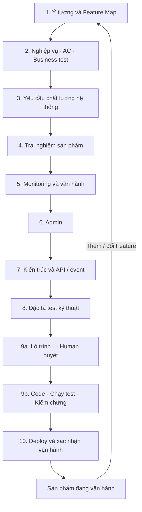

# Kidea — Thiết kế cách hoạt động

Trạng thái: `CĂN CỨ R01 ĐÃ DUYỆT — ĐÃ CÓ KHUNG THỬ R02-T01, CHƯA CÓ LÕI KIDEA`

Ngày cập nhật: 2026-09-12

Phạm vi: thiết kế hoạt động Kidea từ ý tưởng đến vận hành và thay đổi. Lộ trình xây dựng chính Kidea được quản lý riêng tại [KIDEA_ROADMAP.md](KIDEA_ROADMAP.md); đã tạo khung skill/helper để thử, chưa triển khai sáu chức năng sản phẩm hoặc pilot.

Human đã duyệt kết quả tích hợp R01 và cho mở R02 từng phần tại [gate khép căn cứ](KIDEA_ROADMAP.md#r01-result). Không coi đây là duyệt mọi chi tiết còn đề xuất, số đo/fixture, runtime/schema hoặc quyền cài/chạy pilot/deploy.

Human đã đồng ý với thiết kế tổng thể và các đề xuất bổ sung, gồm giao diện tiến độ, quy tắc code theo môi trường, gate ở bước con, truy xuất xuyên tầng và ba bản đồ liên thông. Bản này hợp nhất các quyết định đó. Định dạng dữ liệu, runtime, bộ công cụ và phạm vi hỗ trợ cụ thể vẫn cần thiết kế, thử nghiệm và Human duyệt theo lộ trình; không coi đồng ý định hướng là duyệt trước mọi chi tiết triển khai.

Tài liệu này là nguồn thiết kế; roadmap là nguồn trạng thái xây dựng Kidea; tài liệu tham khảo là đầu vào; `answer.md` là bản sao câu trả lời để đọc từ xa. Human yêu cầu bắt đầu vòng rà soát R2 từ đầu ngày 2026-09-08: lựa chọn đã duyệt là căn cứ để xác nhận/điều chỉnh từng phần, không tự chuyển DONE/APPROVED của vòng trước sang vòng mới. [Chỉ đọc gói hiện tại](KIDEA_ROADMAP.md#review-current); [đối chiếu lộ trình cũ → mới](KIDEA_ROADMAP.md#coverage). Các mã gói P01 còn giữ dưới đây là nhận diện bằng chứng lịch sử, không phải task đang chạy.

Ranh giới hồ sơ project `PROJECT-FILES-r1` đã được Human duyệt ngày 2026-09-07: [tài liệu sản phẩm ngoài `.kidea`, hồ sơ điều phối trong `.kidea`](#files-view), cùng một Git repo. [Bằng chứng và phạm vi cập nhật](KIDEA_ROADMAP.md#project-files-review). [G1](#git-working-layout), vị trí kiểm chứng/tích hợp [G2](#git-integration-gate) và chính sách [G3](#git-permissions) đã đồng bộ theo [approval ngày 2026-09-11](KIDEA_ROADMAP.md#r01-t06-s01-result); nghĩa vụ kiểm tra cuối G2 theo [kết quả T05](KIDEA_ROADMAP.md#r01-t05-result) giữ nguyên. [G4 lưu/khôi phục việc dở](#git-checkpoint) đã được duyệt theo [kết quả T06](KIDEA_ROADMAP.md#r01-t06-result); [cách đánh số sản phẩm](#product-version) đã chốt theo [T07-S01](KIDEA_ROADMAP.md#r01-t07-s01-result); [version thành phần/tag](#component-version-tags) đã chốt theo [T07-S02](KIDEA_ROADMAP.md#r01-t07-s02-result); [hồ sơ release và từng lần triển khai G6](#release-records) đã chốt theo [kết quả T07](KIDEA_ROADMAP.md#r01-t07-result). Approval thiết kế không cấp quyền thực thi cho project/pilot cụ thể.

[Phạm vi bản đầu](#first-release-scope) đã được Human đồng ý cùng các điều chỉnh ngày 2026-09-07. [Ma trận công nghệ](#platform-matrix) đã được Human duyệt tại `P01-T02`; Human đã chốt SvelteKit + TypeScript với prerender/SSR và realtime cho web. Human đã duyệt Kotlin + Jetpack Compose, Swift + SwiftUI và [cách tích hợp SEO vào gate quy trình](#seo-proposal); ma trận phiên bản/môi trường r3 đã được duyệt; chưa phải năng lực đã được triển khai hoặc kiểm chứng.

Bổ sung ngày 2026-09-10: Human đã duyệt [phạm vi phát hành/vận hành và ba nhóm ưu tiên](#production-capabilities), theo [bằng chứng](KIDEA_ROADMAP.md#production-scope-result). Đây là yêu cầu đích được bổ sung, không phải approval G3–G6, schema/công cụ, QUALITY hoặc quyền chạy pilot/production.

<a id="scope"></a>

## 1. Mục tiêu và ranh giới

Kidea là một skill hướng dẫn một người cùng AI biến ý tưởng thành sản phẩm có thể triển khai, vận hành và thay đổi lâu dài. Kết quả cần đạt không phải số lượng tài liệu, mà là sự thống nhất có thể kiểm tra giữa ý định của Human, đặc tả, thiết kế, code, test và sản phẩm đang vận hành.

Kidea dùng file để lưu sự thật về công việc, không dựa vào việc AI còn nhớ cuộc hội thoại. File không loại bỏ hoàn toàn sai sót của AI: cần thêm kiểm tra, bằng chứng thực thi và Human review.

Yêu cầu Human đã nêu:

- Một người + AI, mặc định một việc đang thực hiện tại mỗi thời điểm; không thiết kế quanh nhiều nhánh công việc song song.
- Đi từng bước, cập nhật trạng thái khi làm; mỗi bước lớn có Human approval.
- Quản lý Feature theo `MVP / Future / Idea`.
- Tài liệu rõ, hiện hành, gọn và đầy đủ; thay đổi phải xử lý trọn vẹn các phần liên quan.
- Resume được qua phiên làm việc hoặc máy khác khi có đủ file cần thiết.
- Trong project được Kidea quản lý, Human chốt phạm vi quyền một lần cho công việc thường lệ; khi được giao triển khai, AI sửa/commit/push và deploy dev trong phạm vi đó, không xin lại từng thao tác. Thiếu quyền, đổi phạm vi hoặc thao tác production thì xử lý theo [G3](#git-permissions).
- Thêm Feature giữa MVP hoặc sau production đều quay lại chốt Feature rồi đi qua các bước tiếp theo.
- Chốt thiết kế hoạt động Kidea trước, sau đó lập kế hoạch và xây dựng skill theo các gate đã duyệt.
- Khi cần, có giao diện tổng quan và chi tiết trạng thái project, các bước/task, MVP hoặc bổ sung Feature cho sản phẩm đã chạy production.
- Có quy tắc code phù hợp ngôn ngữ, thành phần và môi trường chạy; có cách kiểm tra việc tuân thủ và chất lượng thực tế.
- Các bước con quan trọng cũng phải có Human approval, không chỉ bước lớn.
- Tinh gọn, mạnh mẽ, chỉn chu; truy được ảnh hưởng xuyên suốt tài liệu, thiết kế, test, code và vận hành.

Phân biệt hai phạm vi Git: chính sách quyền project ở trên là hành vi của skill trong project được quản lý. Tại repository xây dựng Kidea này, Human yêu cầu tiếp tục lưu toàn bộ câu trả lời cuối vào `answer.md`, commit và push để đọc trên GitHub; quy tắc đó còn hiệu lực đến khi Human yêu cầu dừng. Không đưa yêu cầu phản chiếu câu trả lời riêng của repo này thành hành vi mặc định của skill.

Thiết kế tổng thể được chấp thuận không có nghĩa skill đã tồn tại, đã được test hoặc đủ tin cậy để quản lý sản phẩm thật. Các tiêu chí kiểm chứng và quyết định triển khai còn mở nằm ở mục 12 và roadmap.

<a id="first-release-scope"></a>

### 1.1. Phạm vi bản đầu — căn cứ đã duyệt ở vòng trước

Căn cứ `P01-T01-SCOPE-r2`, được Human duyệt ngày 2026-09-07 cùng các điều chỉnh trong phản hồi. [Bằng chứng vòng trước](KIDEA_ROADMAP.md#p01-t01-review). Vòng R2: Human đã xác nhận D1–D2 của gói `R01-T01-S01-r1` — năng lực đầy đủ và ranh giới bản đầu; [bằng chứng đúng phạm vi](KIDEA_ROADMAP.md#r01-t01-result). Xác nhận này không duyệt lại toàn bộ chi tiết trong mục 1.1, công nghệ, pilot, Git hoặc tiêu chí chất lượng.

**Mục tiêu:** một bản Kidea dùng được trọn chu trình đã thống nhất cho một người cùng AI, trên phạm vi công nghệ đã kiểm chứng. Giữ đủ các năng lực cốt lõi, giới hạn bề rộng hỗ trợ; không gọi một bộ prompt hoặc vài helper chạy được là bản Kidea hoàn chỉnh.

<a id="first-release-audience"></a>

#### Người dùng và loại project

- Người dùng chính của bản đầu là Human đang xây dựng Kidea, dùng cùng AI để phát triển và vận hành các project của mình. Hướng dẫn sử dụng bằng tiếng Việt; phương pháp không gắn cứng với một ngành nghiệp vụ hoặc sản phẩm pilot.
- Luồng chính bắt đầu từ ý tưởng của một project mới; tiếp tục/resume, thêm Feature giữa MVP và thay đổi sau một bản đã phát hành đều thuộc phạm vi.
- Resume và change áp dụng cho project đã có hồ sơ Kidea hợp lệ, với source, bằng chứng và phiên bản công cụ cần thiết. Có source hoặc quy ước sẵn vẫn phải đối chiếu và tôn trọng chúng; không tự ghi đè để ép project theo template.
- Dự án cũ chưa có hồ sơ Kidea vẫn bắt đầu từ bước 1 và đi đầy đủ quy trình/gate. AI được đọc tài liệu và code hiện có làm context ở từng bước, giảm nhập lại; không coi hành vi đang có là nghiệp vụ đúng hoặc bằng chứng Human đã duyệt. Không tự suy ngược rồi chứng nhận toàn bộ đặc tả/trạng thái để bỏ qua quy trình. Việc này khác với resume một project đã có hồ sơ Kidea hợp lệ.

<a id="first-release-capabilities"></a>

#### Các năng lực bắt buộc khi nghiệm thu bản đầu

| Nhóm năng lực | Phạm vi bản đầu | Căn cứ chi tiết |
|---|---|---|
| Điều phối | Đủ `init`, `resume`, `status`, `approve`, `change`, `visualize`; trao đổi tự nhiên trong công việc, một task hiện hành và đúng ranh giới quyền | [Cách gọi](#commands), [approval](#state-approval) |
| Quy trình sản phẩm | Đủ mười bước, gồm nghiệp vụ/AC/test, chất lượng, UX, monitoring/admin, kiến trúc, kế hoạch/code và triển khai; từng gate vẫn riêng | [Quy trình](#workflow) |
| Hồ sơ và tiếp tục công việc | Một nguồn có hiệu lực cho mỗi dữ kiện; checkpoint, điểm quay lại, approval theo nội dung, task đã hoàn thành còn truy được; resume qua phiên/máy khi đủ đầu vào | [Hồ sơ](#files-view), [resume](#resume) |
| Truy xuất và thay đổi | Đủ ba bản đồ, đối chiếu hai chiều; tìm ảnh hưởng theo ngữ nghĩa, kể cả event/dữ liệu/cấu hình và trường hợp không có diff trung gian; không coi thiếu mapping là không ảnh hưởng | [Ba bản đồ](#three-maps), [change](#change) |
| Code và kiểm chứng | Profile rule theo tổ hợp đã chốt; test specification, test chạy được và bằng chứng gắn phiên bản/môi trường; có kiểm tra hành vi Kidea và pilot chạy thật | [Coding rules](#code-rules), [test](#testing), [cấu tạo skill](#skill-structure) |
| Xem tiến độ | HTML offline, chỉ đọc, tổng quan/chi tiết task, gate/blocker và nguồn; thể hiện đúng dữ liệu chưa biết hoặc snapshot cũ | [Giao diện tiến độ](#files-view) |
| Phát hành và vận hành | Hồ sơ release đa thành phần, lựa chọn deploy theo thành phần, sẵn sàng vận hành, xử lý lỗi, trạng thái/bằng chứng thật và vòng change sau release; định hướng A/B theo nhu cầu | [Bổ sung đã duyệt 2026-09-10](#production-capabilities) |
| Dùng và bàn giao | Có bản cài, hướng dẫn, giới hạn hỗ trợ, kiểm tra tương thích/nâng cấp và bằng chứng nghiệm thu trong phạm vi được Human cho phép | [R10](KIDEA_ROADMAP.md#r10) |

Một hạng mục không áp dụng cho sản phẩm cụ thể có thể được Human duyệt `N/A` theo thiết kế; điều đó không xóa năng lực hướng dẫn hạng mục ấy khỏi Kidea. Ví dụ pilot không cần mobile không có nghĩa Kidea bỏ bước xác định nền tảng hoặc mặc nhiên đã hỗ trợ triển khai mobile.

#### Mức hỗ trợ được cam kết

- Phương pháp tổng thể dùng lại được cho nhiều project; mức hỗ trợ thực thi chỉ được công bố cho các tổ hợp host/OS/ngôn ngữ/thành phần đã được chọn và kiểm chứng.
- Human đã chọn định hướng bản đầu: Kidea chạy trên Windows; backend sản phẩm dùng C++20, triển khai Ubuntu; Android/iOS native với code độc lập; web ưu tiên khả năng được tìm thấy trên công cụ tìm kiếm và AI search, đồng thời nhẹ/mượt. Đây là yêu cầu đích, chưa phải tuyên bố đã hỗ trợ. [Ma trận vòng trước](#platform-matrix) được rà tại R01-T03; runtime/schema thuộc R02, profile rule thuộc R05 và bản đồ thuộc R06.
- Với tổ hợp chưa hỗ trợ, Kidea phải nêu phần thiếu, chưa xác minh hoặc cần Human quyết định; không tự tuyên bố tương thích, tối ưu hoặc đầy đủ chỉ vì AI vẫn có thể đọc/viết code của ngôn ngữ đó.
- Bản đầu phải chứng minh luồng trọn vẹn và những tình huống gián đoạn/thay đổi đã chốt; một test helper hoặc một đường chạy thuận lợi chưa đủ nghiệm thu. Bộ case và phương pháp đo được rà theo gói nhỏ ở R01-T08/T09; chỉ áp dụng ngưỡng sau đúng approval, không kế thừa số đề xuất thành chuẩn.

<a id="first-release-exclusions"></a>

#### Những việc chưa làm trong bản đầu

- Nền tảng cộng tác nhiều người: Human không có định hướng xây chức năng này; không ghi thành cam kết tương lai. Cụm nhiều agent cho một Human là ý tưởng riêng, ngoài bản đầu, chưa có kế hoạch triển khai.
- Bản đầu không có server Kidea, graph database hoặc dịch vụ đồng bộ riêng; chuyển hồ sơ/source giữa các máy dùng Git theo [quy tắc resume](#resume). Giao diện online điều khiển tập trung được xếp nhóm triển khai có điều kiện ở [phạm vi bổ sung](#production-capabilities), chưa duyệt xây hoặc thay HTML offline thành cổng có quyền production.
- Kho coding rules/adapter bao phủ mọi ngôn ngữ, hệ điều hành và framework; hoặc tự động nhập/chứng nhận mọi dự án cũ chưa có hồ sơ.
- Tự quyết định nghiệp vụ, tự duyệt nội dung, thao tác Git ngoài quyền project hoặc tự thực thi production trong phương án Human chạy PROD; bảo đảm tuyệt đối không còn lỗi, không sót dependency hoặc đạt hiệu năng tốt nhất trong mọi môi trường.

Những giới hạn này không loại bỏ monitoring/admin của sản phẩm, hướng dẫn deploy/khôi phục, hay yêu cầu xử lý thay đổi sau release. Kidea vẫn hướng dẫn và kiểm chứng các phần đó trong phạm vi đã chốt; thao tác có tác dụng phụ chỉ được làm khi có quyền tương ứng.

Phạm vi này không duyệt trước ma trận phiên bản/công cụ, lựa chọn framework, pilot, runtime hoặc schema. Các đề xuất mới tiếp tục ở đúng gate của chúng.

<a id="production-capabilities"></a>

### 1.1a. Phát hành/vận hành — phạm vi bổ sung đã duyệt ngày 2026-09-10

Human đồng ý với ba nhóm ưu tiên và thứ tự trong câu trả lời ngày 2026-09-10; [căn cứ đúng bản và kết quả đồng bộ](KIDEA_ROADMAP.md#production-scope-result). Kidea phải quản lý toàn chuỗi từ bản đầu, nhưng chỉ công bố thực thi trên tổ hợp đã chọn và kiểm chứng. Phần đã có được cụ thể hóa, không bỏ mười bước, G2, ba bản đồ, resume/change hoặc web/native/backend đã chốt.

| Năng lực phải có trong bản đầu | Nội dung và ranh giới | Nơi thiết kế/kiểm chứng |
|---|---|---|
| Release đa thành phần | Một hồ sơ release liên kết đúng bản web/backend/mobile, dữ liệu và cấu hình; thứ tự triển khai, tương thích cũ–mới và phương án khi chỉ một phần thành công. Không đồng nhất merge/build/deploy/mở tính năng; không hứa mọi mobile cập nhật hoặc rollback nguyên tử. | R01-T07; R08-T04/T05; KA-28 |
| Deploy theo sản phẩm/thành phần | Chọn cách đóng gói, nơi chạy và cách quản lý riêng, có căn cứ; ghi khởi động/dừng, sức khỏe, scaling, dữ liệu và phục hồi. Có thể hỗn hợp hoặc đổi theo quy mô, nhưng đổi nền chạy phải phân tích ảnh hưởng và kiểm chứng lại. Không chọn sẵn VM/container/Kubernetes hay nhà cung cấp cho mọi project. | R04-T05; R05; R08-T03; KA-23/28 |
| Sẵn sàng vận hành | Chốt mục tiêu dịch vụ và cách đo, tải/công suất/chi phí, bảo mật, cảnh báo, người xử lý sự cố và giới hạn mất dữ liệu/thời gian phục hồi; chuẩn bị từ thiết kế và kiểm tra thực tế trước phát hành. | Bước 3/5/7/8/10; R04/R05/R08; KA-23/28 |
| Phát hành có kiểm soát | Chọn chiến lược phù hợp sản phẩm, điều kiện tiếp tục/dừng và giảm tác hại; phân biệt pause, tắt tính năng, rollback, phát hành bản sửa. Cần xử lý việc đang dở/dữ liệu/tác động bên ngoài; thiếu quan sát hoặc rollback lỗi không được báo an toàn. Không bắt mọi project dùng canary/flag. | R01-T07; R08-T04–T06; R09-T08; KA-28 |
| Thực thi và bằng chứng | Kidea điều phối theo quyền; hệ thống thực thi phù hợp duy trì job/cảnh báo cần chạy dài khi phiên AI đóng. Nhận diện yêu cầu/thao tác, bản và môi trường; tra lại kết quả khi mất kết nối, không replay mù. Tách mong muốn, thực tế quan sát và thời điểm/độ mới dữ liệu. Không cần portal online để thực hiện nghĩa vụ này. | R02-T02/T04/T09; R07; R08; KA-13/25/28 |
| Khép vòng sau release | Sự cố, thay đổi cấu hình và kết quả thử nghiệm liên kết về yêu cầu/đặc tả/code/test/vận hành; có điều kiện dọn flag/API/schema cũ, giữ bằng chứng/phục hồi cần thiết. Dùng ba bản đồ và nguồn hồ sơ hiện có, không thêm tracker độc lập. | R03/R06/R08; KA-15/18/19/22/28 |

Ngay trong quy trình bản đầu phải xác định sản phẩm có cần A/B không; khi cần, chốt giả thuyết, đơn vị chia nhóm, hành vi, dữ liệu đo và quy tắc dừng trước phần triển khai phụ thuộc. Không ép mọi sản phẩm chạy A/B. Tích hợp đầy đủ phải có trước thử nghiệm thực đầu tiên, không gọi mô phỏng là bằng chứng A/B thật.

**Nhóm thiết kế ranh giới ngay, triển khai theo nhu cầu:** tích hợp nền tảng A/B đã chọn; tự động mở rộng rollout theo số liệu; thêm đường kết nối Kubernetes/VM chuyên biệt; giao diện online điều khiển tập trung. Điều kiện mở là nhu cầu sản phẩm và thiết kế/quyền được chốt, không là một thời hạn mặc định. Nếu sản phẩm đầu cần một nền triển khai thì phải làm đường đó trước phát hành; hoãn tự động hóa không hoãn an toàn. Online cần duyệt riêng quyền, bảo mật và trách nhiệm vận hành, không là phần đã được cấp quyền xây.

**Nhóm xa hoặc không chủ trương tự xây:** không phủ sẵn mọi hạ tầng; đa cloud/nhiều vùng/chuyển vùng phức tạp chỉ khi mục tiêu đã chốt đòi hỏi (có thể cần sớm); không chủ trương AI tự quyết nghiệp vụ/kết quả A/B hoặc tự sửa production ngoài quyền; không tự viết CI/CD, rollout controller, feature flag hoặc thống kê khi chưa chứng minh khoảng trống cần tự xây. Cộng tác nhiều người không là cam kết tương lai.

Thứ tự chuẩn bị: (1) release đa thành phần, deploy linh hoạt, trạng thái/bằng chứng; (2) sẵn sàng vận hành, phát hành an toàn, sự cố; (3) quy trình A/B và ranh giới tích hợp, nâng cao theo nhu cầu. Không mở song song nhiều subtask; chốt chi tiết qua các gói nhỏ tại nơi sở hữu. Bản đầu phải có luồng thực thi đầu–cuối và ca lỗi/gián đoạn/phục hồi trên môi trường được phép; template không thay nghiệm thu. Pilot vẫn lab kín, dữ liệu giả, ngân sách 0 đồng và quyền riêng; QUALITY chưa được duyệt toàn bộ; phần đã chốt xem [tiêu chí điều phối/hồ sơ](KIDEA_QUALITY.md#control-acceptance-approved).

<a id="platform-matrix"></a>

### 1.2. Ma trận nền tảng — căn cứ đã duyệt ở vòng trước

Gói review: `P01-T02-PLATFORM-r3`, ngày 2026-09-07, `APPROVED` toàn ma trận theo xác nhận Human “ok mình duyệt gói này”, đối với gói được trình tại commit `9f73940`. Tổ hợp phiên bản, phạm vi kiểm chứng và cách xử lý phần chờ dưới đây đã được duyệt làm nền thiết kế, không phải bằng chứng đã triển khai. [Đối chiếu nguồn và môi trường](exa-results/p01-t02-platform-baseline-2026-09-07.md) là bằng chứng nghiên cứu, không phải nguồn quyết định hoặc tracker khác. Các báo cáo cũ chỉ giữ vai trò tham khảo theo thời điểm.

<a id="host-backend-baseline"></a>

Vòng R2: Human đã xác nhận hướng host/backend ở `R01-T03-S01-r1`; [bằng chứng](KIDEA_ROADMAP.md#r01-t03-s01-result). Chỉ hai hướng Windows và C++20/Ubuntu, không duyệt kèm các dòng web/mobile, phiên bản công cụ hoặc quyền cài đặt.

| Thành phần | Hướng đã duyệt | Cấu hình nền đã duyệt để kiểm chứng | Môi trường thực thi dự kiến |
|---|---|---|---|
| Host Kidea | Windows, một Human + AI | Windows 11 x64; máy kiểm chứng đầu tiên là Windows 11 Pro 25H2 hiện có. Dùng phiên AI desktop hiện tại để thử hướng dẫn theo file; kiểm chứng khả năng nạp/gọi skill, chọn runtime/helper và cách đóng gói ở R02-T01 | Hồ sơ/source local, Git theo quyền đã chốt; không cần server Kidea. Không suy ra đã hỗ trợ mọi ứng dụng AI hoặc host Mac |
| Backend sản phẩm | C++20 → Ubuntu | Ubuntu 24.04 LTS amd64; GCC/G++ 13.3, CMake 3.28.3, Ninja; chuẩn C++20, không mặc định dùng modules/extension chưa kiểm chứng. Patch bảo mật distro được cập nhật có ghi nhận | Soạn source trên Windows; build/test Linux trong WSL2 Ubuntu đúng phiên bản hoặc môi trường Linux riêng được duyệt. Release phải build/test lại trên Ubuntu đích, không lấy binary Windows hoặc WSL PASS thay bằng chứng release |
| Android | Kotlin + Jetpack Compose; native, code độc lập | Android Studio Quail 1 (2026.1.1) hoặc stable tương thích AGP 9.2.1; Gradle 9.4.1, JDK 17; Kotlin tích hợp của AGP (2.3.10), Compose compiler khớp Kotlin; Compose BOM 2026.06.01. compileSdk 36.1, targetSdk 36, minSdk 26 là cấu hình nền đề xuất | Build trên Windows, Gradle Wrapper; một emulator khi cần và điện thoại thật để đo hiệu năng. Không thêm KMP/NDK mặc định; không áp lại kotlin-android plugin khi dùng Kotlin tích hợp của AGP 9 |
| iOS | Swift + SwiftUI; native, code độc lập; tận dụng Mac/iPhone hiện có | Khi đến bước iOS: ứng viên Xcode 26.6 + Swift compiler 6.3, Swift 6 language mode, iOS SDK 26.5; deployment target iOS 16.0 là nền đề xuất. Xcode này cần Tahoe 26.2–26.x | MacBook Pro 16 inch 2019 Intel, RAM 16 GB, hiện Sonoma và khoảng 512 GB trống; iPhone 12 Pro Max. Chỉ kiểm tra/nâng macOS nếu cần khi làm iOS; không cài/nâng ngay. UIKit/Metal chỉ bổ sung khi có nhu cầu và bằng chứng |
| Web | SvelteKit + TypeScript; prerender/SSR + realtime; SEO và hiệu năng xuyên suốt | Node.js 24 LTS (mốc 24.20.0), npm 11.19.0; SvelteKit 2.70.3, Svelte 5.57.0, TypeScript 6.0.3, Vite 8.2.2, vite-plugin-svelte 7.3.0, adapter-node 5.5.7. Đây là mốc tương thích metadata, chưa chạy build | Dev trên Windows; build/SSR trên Ubuntu 24.04 amd64, Node cùng dòng. Nội dung prerender/assets qua CDN khi triển khai; không ghép Astro mặc định, không chuyển nghiệp vụ C++ sang Node |

**Ý nghĩa cấu hình nền:** đây là tổ hợp đầu tiên để viết hướng dẫn và kiểm chứng Kidea, không phải giới hạn cố định cho mọi sản phẩm hoặc tuyên bố máy đã chạy được. Android 8/API 26 và iOS 16 là mức OS tối thiểu đề xuất cho tổ hợp này, không phải bằng chứng mượt trên mọi máy cũ; sản phẩm có nhu cầu khác phải chốt lại phạm vi ở đúng gate. Điện thoại là phạm vi kiểm chứng mobile đầu tiên; tablet/watch/TV/XR chưa được công bố hỗ trợ. Chưa chọn backend framework, database, CDN vendor hoặc thư viện đồ họa khi nghiệp vụ pilot chưa yêu cầu.

#### Chính sách phiên bản và khả năng tái tạo

- Dùng bản stable/LTS còn được hỗ trợ tại thời điểm thực hiện; không dùng beta/RC làm nền nghiệm thu. Các mốc ở bảng là snapshot ngày 2026-09-07, không phải lệnh cài hoặc đóng băng vô thời hạn. Trước khi tạo môi trường, kiểm tra lại bản vá, cảnh báo bảo mật, registry/release chính thức và tương thích toàn tổ hợp; khóa phiên bản thực vào lockfile/Gradle Wrapper, cấu hình build và evidence của project.
- Không lấy từng gói `latest` rồi giả định chúng tương thích: metadata SvelteKit được kiểm tra nhận TypeScript 5/6, không nhận TypeScript 7 đang là latest ở registry. Tương tự, Compose BOM không khóa Compose compiler; compiler phải theo phiên bản Kotlin thực tế của build.
- Đổi major, deployment target, host, adapter hoặc hợp đồng/runtime phải mở review ảnh hưởng trước phần việc phụ thuộc. Thay patch cũng cần test hồi quy và cập nhật evidence; nếu có breaking change/cảnh báo ảnh hưởng phạm vi thì xin Human quyết định, không giữ approval cũ cho nội dung đã đổi.
- Runtime/helper của **Kidea** đã chốt JavaScript/Node.js 24 LTS theo [R02-T01-S01](KIDEA_ROADMAP.md#r02-t01-s01-result); bản cụ thể/vị trí/quyền cài còn ở S02. Node trong dòng web là runtime **sản phẩm**, không tự quyết định hay đồng bộ phiên bản helper. Node 22.18.0 đang có không chứng minh đã cài Node 24 hoặc cho phép thay global.

#### Môi trường và bằng chứng cần có trước khi công bố hỗ trợ

| Phạm vi | Môi trường/test cần có | Phần chưa kiểm chứng và điểm phải xử lý |
|---|---|---|
| Host/file/Git | Windows 11 x64; hồ sơ UTF-8, đường dẫn có dấu/khoảng trắng, CRLF/LF; init/resume/change, đổi checkout qua Git, conflict và approval cũ | Host đã quan sát read-only; hành vi skill/helper chưa tồn tại. R02/R06/R09/R10 kiểm chứng theo bản được phép cài |
| C++/Ubuntu | Build sạch Debug/Release với toolchain đã khóa; unit/integration và sanitizer phù hợp; artifact chạy trên Ubuntu đích có cấu hình/version rõ | WSL2 có distro tên Ubuntu nhưng chưa xác minh release bên trong, chưa khởi động/cài/sửa distro. R05 chốt rule/test và thử mẫu nhỏ; R08 chuẩn bị build/môi trường, R09 thực thi trước khi tuyên bố hỗ trợ |
| Android | Emulator API 26 và API 36 để kiểm tra hành vi; máy thật hạng thấp khoảng 3–4 GB RAM, màn hình 60 Hz để đo release build; ghi model/OS/chip thực | Chưa có model Android được Human cung cấp; emulator không chứng minh hiệu năng máy yếu. Chọn thiết bị khi lập kế hoạch thử trước R09; nếu chưa có thì mục hiệu năng là chưa kiểm chứng, không PASS. Chưa xác minh SDK/JDK/ảo hóa/GPU |
| iOS | iPhone 12 Pro Max hiện có và simulator OS tối thiểu khi runtime khả dụng; release build, unit/UI/integration và đo frame/bộ nhớ/pin trên máy thật | Chưa kiểm tra phiên bản iOS/Xcode/Mac thực, signing hoặc simulator. Nếu không có môi trường cho iOS tối thiểu thì nêu thiếu và bổ sung thiết bị hoặc xin đổi phạm vi; iPhone hiện có không đại diện mọi máy yếu |
| Web sản phẩm | Chromium/Firefox/WebKit để hồi quy; Chrome/Edge desktop stable, Safari trên iPhone và Chrome trên Android thật khi chuẩn bị release; route tĩnh, SSR động, private/admin, realtime mất/kết nối lại, cấu hình CDN/proxy khi áp dụng | Ghi phiên bản browser/test runner, viewport, mạng và CPU của phép đo khi chạy. WebKit tự động không thay Safari thật; chưa chọn thư viện test/đồ họa hoặc tuyên bố benchmark. Không nhầm với ma trận HTML offline Kidea ở R07 |

Ngân sách đo cụ thể (tải, độ trễ, khung hình, bộ nhớ, pin, dung lượng, độ tươi cache) phải gắn workload và tiêu chí được duyệt: R01-T04 rà pilot; R01-T08/T09 chốt case/phương pháp đo nghiệm thu Kidea theo từng gói; R04/R05/R08 xây hướng dẫn sản phẩm; R09 đo thật. Không đặt một cấu hình server hoặc số người dùng giả làm cam kết hiệu năng của mọi sản phẩm lớn.

#### Quyền, công cụ còn thiếu và thời điểm xin

| Hành động sau này | Ranh giới hiện tại | Khi nào cần xin/chốt |
|---|---|---|
| Cài thử skill/helper, đổi runtime host | Chưa được cấp bởi việc duyệt ma trận; vị trí cài/dependency còn thuộc R02-T01 | Trước thao tác cài thử ở phase phù hợp |
| Cài Node/JDK/SDK/Android Studio; bật ảo hóa hoặc sửa WSL | Chưa cài, không đổi global hoặc distro hiện có; ưu tiên môi trường tách biệt | Trước khi chuẩn bị môi trường build/test trong kế hoạch đã duyệt |
| Nâng macOS/cài Xcode, dùng thiết bị/signing | Chưa thực hiện; phải kiểm tra phần mềm đang dùng, backup và phiên bản iOS trước | Khi bắt đầu phần iOS; không đòi cài/nâng ngay trong review tài liệu R01-T03 |
| Mua/thuê thiết bị, Mac CI, server/CDN hoặc tài khoản trả phí | Không có ngân sách/nhà cung cấp nào được duyệt từ ma trận | Chỉ xin khi thiếu nguồn lực thực và đã nêu lựa chọn/chi phí |
| Đăng nhập, chứng chỉ, phát hành store, deploy công khai, DNS/production | Không được suy ra từ quyền nghiên cứu/tài liệu; không đưa secret vào Git | Trước đúng thao tác môi trường đích, theo gate release R08/R09/R10 |

Giới hạn release cần kiểm tra lại lúc thực hiện: Google Play hiện yêu cầu app điện thoại mới/update target API 36 trở lên; Apple hiện yêu cầu Xcode 26+/SDK iOS 26+ khi upload. Xcode 16.2 trên Sonoma chỉ là khả năng dùng công cụ cũ, không phải nền phát hành hiện hành. Xcode 27 beta chỉ chạy trên Apple Silicon; nếu sau này bắt buộc dùng toolchain đó, quay lại Human chọn mua/thuê/mượn nguồn lực phù hợp, không tự mua máy hoặc bỏ yêu cầu iOS. Nguồn và ngày đối chiếu nằm trong báo cáo liên kết ở đầu mục.

<a id="web-rendering-baseline"></a>

Vòng R2: Human đã xác nhận hướng web và hai gate SEO ở `R01-T03-S02-r1`; [bằng chứng](KIDEA_ROADMAP.md#r01-t03-s02-result). Không duyệt kèm phiên bản công cụ mới, CDN, ngưỡng hiệu năng hoặc quyền cài/deploy.

SSG/prerender là tạo sẵn HTML; SSR là tạo HTML phía máy chủ khi cần. Trang tĩnh dùng prerender/CDN, trang động cần SEO có nội dung chính, metadata và dữ liệu ban đầu trong HTML; realtime/hiệu ứng cập nhật phía trình duyệt sau lần tải đầu, tải phần nặng khi cần và không render lại toàn trang mỗi tick. Runtime/adapter SSR đề xuất ở bảng trên; nghiệp vụ vẫn thuộc backend C++20. Không công bố nhanh nhất khi chưa benchmark đúng workload.

Kiến trúc web đã chốt phải bao gồm URL/canonical/liên kết nội bộ/sitemap/phân trang và đa ngôn ngữ khi áp dụng; chọn tổ hợp bộ lọc đáng index; nội dung hữu ích và dữ liệu có cấu trúc khớp hiển thị. Dữ liệu giá có thời điểm, giới hạn độ cũ của cache và trạng thái mất kết nối. Kiểm chứng HTML thực nhận, crawl/index, tốc độ và tương tác trên thiết bị thật; theo dõi sau phát hành. Không bảo đảm thứ hạng hoặc được AI trích dẫn chỉ từ tên framework. Việc tổ chức thêm gate quy trình vẫn riêng tại mục 2.5.

<a id="mobile-device-baseline"></a>

Vòng R2: Human xác nhận Android Kotlin/Compose, iOS Swift/SwiftUI native với code riêng và thời điểm kiểm tra môi trường ở `R01-T03-S03-r1`; [bằng chứng](KIDEA_ROADMAP.md#r01-t03-result). Chưa xác minh lại phiên bản hoặc cấp quyền cài/nâng/mua/signing/deploy; không dùng simulator thay bằng chứng hiệu năng máy thật.

Nguồn lực iOS Human xác nhận: MacBook Pro 16 inch 2019 Intel, RAM 16 GB, macOS Sonoma, còn trống khoảng 512 GB; iPhone 12 Pro Max hiện có. Đây là thông tin Human cung cấp, chưa kiểm tra máy/build thực. Chưa rõ bản Sonoma 14.x cụ thể, iOS hiện tại và Xcode đã cài. Theo [ma trận Apple](https://developer.apple.com/xcode/system-requirements/) kiểm tra ngày 2026-09-07, Xcode 16.2 chạy từ Sonoma 14.5, còn Xcode 26.6 cần Tahoe 26.2–26.x. Model Mac này có trong [danh sách Tahoe](https://support.apple.com/en-us/122867); khả năng nâng cấp không đồng nghĩa đã nâng hoặc được phép cài. Ưu tiên tận dụng máy để kiểm chứng trước; chưa chốt mua/thuê Mac hoặc nâng macOS.

Human đã chốt cách chuẩn bị Mac: hiện tại chỉ chốt giải pháp; đến khi làm iOS mới kiểm tra và cập nhật macOS nếu cần. Ma trận vòng trước ghi môi trường dự kiến, phần chưa kiểm chứng và thời điểm cần quyền; không lấy việc chưa nâng macOS/cài Xcode làm điều kiện bắt buộc để đóng task thiết kế. Không ghi tương thích thực tế là PASS trước khi kiểm tra.

Yêu cầu SEO áp dụng cho nội dung được phép công khai. Không dùng mục tiêu được tìm thấy để mở dữ liệu riêng tư, admin hoặc nội dung cần xác thực. Quyền riêng tư, an toàn và tính đúng không bị hạ ưu tiên để lấy SEO. Cách đưa SEO thành đầu ra/gate cụ thể đã được duyệt ở [mục 2.5](#seo-proposal).

#### Ý tưởng ngoài bản đầu: một Human, nhiều agent

Ý tưởng chi tiết được lưu riêng, nguyên văn tại [Điều phối nhiều AI agent bằng subscription](ideas/multi-agent-subscription.md). Human yêu cầu chỉ xem xét sau khi Kidea bản đầu hoàn thiện; phân loại `Idea`, ngoài MVP và lộ trình hiện hành. Chưa duyệt thiết kế điều phối, chọn/xác minh model, tạo worker, cài công cụ hoặc tích hợp. Khi xem xét lại phải đối chiếu phạm vi/quyền/Human gate và khả năng công cụ lúc đó, rồi xin duyệt riêng.

<a id="pilot-scope"></a>

### 1.3. Pilot đề xuất — Đăng ký workshop thử nghiệm

Vòng R2: Human xác nhận bài toán và giới hạn MVP ở `R01-T04-S01-r1`; [bằng chứng](KIDEA_ROADMAP.md#r01-t04-s01-result). Phạm vi xác nhận là D1–D2 và các biên đã trình; seed cụ thể, chuỗi/đường lỗi, nơi giữ hồ sơ và quyền thực thi không được duyệt kèm.

Human tiếp tục xác nhận chuỗi/đường lỗi/thứ tự pilot ở `R01-T04-S02-r1`; [bằng chứng](KIDEA_ROADMAP.md#r01-t04-s02-result). Đề xuất dùng Thuận Thiên thay pilot đã được Human dừng để xem xét sau; [xác nhận giữ workshop](KIDEA_ROADMAP.md#pilot-workshop-confirmation). Workshop tiếp tục là pilot theo đầy đủ phạm vi dưới đây, không thu nhỏ thành bộ fixture. Không đổi ma trận công nghệ hoặc quyền thực thi.

Gói `P01-T03-PILOT-r1`, ngày 2026-09-07: **APPROVED, Human duyệt ngày 2026-09-07**. [Bằng chứng vòng trước](KIDEA_ROADMAP.md#p01-t03-review); phạm vi này được rà lại tại R01-T04. Đây là phạm vi sản phẩm dùng để kiểm chứng Kidea, không phải yêu cầu xây ứng dụng ngay.

**Mục tiêu:** một người dùng xem workshop, đăng ký/hủy một chỗ; quản trị viên quản lý số chỗ và trạng thái mở đăng ký. Chọn bài toán này vì nhỏ nhưng có rule dùng chung giữa các client, tranh chấp chỗ cuối và dependency qua event/dữ liệu, không chỉ lời gọi hàm.

#### Phạm vi MVP ban đầu

| Nhóm | Phạm vi đề xuất |
|---|---|
| PIL-F01 — Xem workshop | Danh sách và chi tiết workshop đã xuất bản; mô tả, lịch hiển thị, sức chứa, số chỗ còn và thời điểm cập nhật. Trang giới thiệu tĩnh để kiểm tra prerender; danh sách/chi tiết kiểm tra SSR và nội dung có thể đọc khi chưa chạy JavaScript |
| PIL-F02 — Đăng ký/hủy | Mỗi người có tối đa một đăng ký ACTIVE trên mỗi workshop; hủy rồi được đăng ký lại. MVP ban đầu chỉ đăng ký/hủy khi workshop OPEN. Có danh sách đăng ký của mình. Backend kiểm tra quyền sở hữu, trạng thái và sức chứa; không vượt sức chứa khi tranh chỗ cuối; retry cùng yêu cầu không tạo tác dụng phụ lần hai |
| PIL-F03 — Quản trị | Tạo/sửa mô tả, sức chứa; xuất bản từ DRAFT sang OPEN, tạm dừng PAUSED và mở lại. Không giảm sức chứa dưới số đăng ký ACTIVE. Không có xóa workshop hoặc tự chuyển trạng thái theo thời gian trong pilot |
| PIL-F04 — Cập nhật và vận hành | Thay đổi đăng ký/sức chứa phát event; xử lý bất đồng bộ tạo số chỗ hiển thị, đẩy cập nhật tới client. Theo dõi event chờ/lỗi, độ trễ, lần xử lý thành công gần nhất; có tình huống gián đoạn rồi phục hồi |

- Dữ liệu seed: 3 workshop, 10 tài khoản người tham gia giả và 1 tài khoản admin giả; sức chứa ban đầu 10 chỗ/workshop, fixture riêng có 1 chỗ để thử tranh chấp. Không dữ liệu cá nhân thật. Khách chỉ xem; người tham gia chỉ sửa đăng ký của mình; admin quản lý workshop. Cơ chế tài khoản thử vẫn phải kiểm tra quyền ở server, không tin role do UI gửi lên.
- Backend C++ trên Ubuntu sở hữu rule và dữ liệu có thẩm quyền. Web SvelteKit + TypeScript theo ma trận đã duyệt; lớp SSR không sở hữu bản rule nghiệp vụ thứ hai. Android Kotlin/Compose và iOS Swift/SwiftUI dùng cùng backend, mỗi app giới hạn hai màn hình: danh sách (có lọc đăng ký của mình) và chi tiết/đăng ký/hủy. Admin và monitoring chỉ trên web.
- Các nhóm trang web: giới thiệu, danh sách, chi tiết, đăng ký của tôi, admin, vận hành. Đây là phạm vi chức năng, chưa chốt wireframe hoặc cấu trúc route.
- Chuỗi dependency bắt buộc: **rule đăng ký → dữ liệu đăng ký → event → số chỗ dẫn xuất → SSR/realtime/native và monitoring**. Quyết định nhận đăng ký luôn dùng dữ liệu có thẩm quyền, không dùng số chỗ cache. Event lặp không đếm hai lần; event trễ/đảo thứ tự không làm lùi trạng thái; sau gián đoạn phải khôi phục và đối chiếu đúng. Giao thức, lưu trữ, cơ chế bảo đảm và test chi tiết chốt ở các bước nghiệp vụ/kiến trúc, không mặc định cần một hệ thống broker riêng.

#### Kịch bản dùng để thử Kidea

| Thời điểm | Tình huống cần kiểm chứng |
|---|---|
| Luồng đầu-cuối R09 | Đi đủ mười bước và gate; xây, kiểm thử, triển khai phi production, quan sát và khôi phục. Đối chiếu đủ ba bản đồ, gồm chuỗi event/dữ liệu ở trên |
| Thêm Feature giữa MVP — R09-T04 | Đề xuất giới hạn mỗi người tối đa 2 đăng ký ACTIVE trên toàn bộ workshop; chưa thuộc MVP ban đầu, phải đi qua change và Human gate trước khi bổ sung |
| Đổi yêu cầu sau release thử — R09-T09 | Cho phép hủy cả khi PAUSED, vẫn cấm đăng ký mới khi PAUSED. Truy ảnh hưởng đến dữ liệu, event, số chỗ, client và test kể cả consumer không đổi code |
| Sửa lỗi — R09-T10 | Một fixture lỗi kiểm tra sức chứa làm nhận vượt chỗ; sửa về đặc tả hiện hành, phân biệt với đổi yêu cầu. Chỉ đưa lỗi vào fixture/môi trường cô lập, không cố ý làm hỏng bản đang dùng |
| Gián đoạn và bằng chứng — R09-T11–T13 | Ngắt phiên rồi resume; Human từ chối gate; test fail/skip phải được thể hiện đúng; thử Git/resume đúng quyền pilot cụ thể, approval kịch bản không tự cấp quyền commit/push |

<a id="pilot-lab-baseline"></a>

#### Môi trường, chi phí và giới hạn

Human đã duyệt nơi giữ hồ sơ, lab và ngân sách ở vòng R2, `R01-T04-S03-r1`; [bằng chứng](KIDEA_ROADMAP.md#r01-t04-result). Chọn một repo workshop riêng tại thư mục local `D:\Code\kynderis\kidea-workshop-pilot`, bên cạnh repo xây Kidea. Trong repo pilot, `docs/` giữ tài liệu sản phẩm, `.kidea/` giữ điều phối/review; source/test/config cùng repo. Không chuyển các file thiết kế/lộ trình Kidea sang đây. Đã kiểm tra đường dẫn chưa tồn tại khi trình gói ngày 2026-09-08; chưa tạo thư mục/repo, chưa chọn remote GitHub hoặc được phép ghi hồ sơ. Xác nhận lại root/quyền trước lần ghi đầu ở R03-T01; schema chi tiết vẫn thuộc R02.

- Chỉ lab phi production, tài khoản và dữ liệu giả; không public release, người dùng thật, thanh toán, email/SMS, danh sách chờ, thông báo push hoặc cộng tác nhiều agent. Không tự thuê server/domain hay dùng dịch vụ tính phí.
- Ngân sách phát sinh đã duyệt: **0 đồng**; tận dụng thiết bị/tài nguyên sẵn có nếu được phép. Không coi tài nguyên đang có là đã được kiểm tra hoặc đã cấp quyền dùng. Nếu thiếu máy Mac, thiết bị, quyền ký/build, tài nguyên Ubuntu hoặc kết nối cần thiết, ghi blocker và xin quyết định; không âm thầm bỏ mobile hoặc ghi PASS.
- Root pilot được chọn tại R01-T04-S03 như trên; kiểm tra lại ở R03-T01 trước khi ghi tài liệu, chưa tạo repo. R09-T01 chốt máy đích, cô lập, tài khoản/kết nối, quyền cài/chạy/deploy và khôi phục trước thực thi. Quyết định cụ thể vẫn cần Human, không suy quyền tạo hồ sơ thành quyền chạy ứng dụng.
- SEO trong lab: kiểm tra HTML prerender/SSR, metadata/canonical, khả năng đọc nội dung và ranh giới public/private; không cho lập chỉ mục lab. Không có bằng chứng được search engine/AI search lập chỉ mục hoặc xếp hạng thật; phần đó cần Human duyệt N/A cho pilot nếu không xuất bản công khai, không bỏ năng lực hướng dẫn SEO của Kidea.
- Phạm vi OS/toolchain và máy thật/mô phỏng lấy [ma trận vòng trước](#platform-matrix) làm căn cứ rà R01-T03. R01-T08/T09 rà case/cách đo Kidea; R03–R05 xây hướng dẫn đặc tả/rule/test; R08/R09 chốt và đo workload/chất lượng sản phẩm thật. Seed nhỏ không phải cam kết tải hoặc hiệu năng. Framework backend, database, event transport và schema chưa được chọn tại gate này.

## 2. Nguyên tắc tổ chức quy trình

### 2.1. Làm rõ monitoring/admin trước kiến trúc

Ngay bước chốt Feature phải nhận diện nhu cầu vận hành và quản trị. Những thao tác như khóa tài khoản, tạm dừng nhận đơn hoặc sửa hạn mức là nghiệp vụ: phải có quyền, điều kiện và kết quả ở bước đặc tả nghiệp vụ.

Đặt thiết kế chi tiết monitoring/admin trước kiến trúc để kiến trúc tính đủ dữ liệu, quyền, API và các đường điều khiển. Các bước dashboard xác định cần xem/làm gì, dữ liệu có ý nghĩa gì; kiến trúc mới chốt component, giao thức và cấu trúc request/response.

Nếu thiết kế dashboard phát hiện nghiệp vụ chưa có, quay lại phần nghiệp vụ liên quan để bổ sung và duyệt. Không âm thầm tạo nghiệp vụ chỉ tồn tại trong màn hình hoặc API.

### 2.2. Chuẩn bị triển khai sớm, xác nhận phát hành ở cuối

Môi trường đích, chi phí, nền tảng được hỗ trợ và hạn chế triển khai là đầu vào sớm cho thiết kế. Trong bước code cần dựng sớm build, chạy test tự động và một môi trường kiểm thử có thể tái tạo.

Bước cuối vẫn riêng biệt: kiểm chứng toàn bộ quy trình triển khai, cấu hình, nâng cấp dữ liệu, khôi phục, monitoring và thao tác vận hành. Chạy local được chưa phải sẵn sàng production.

Áp dụng [phạm vi phát hành/vận hành đã duyệt](#production-capabilities): lựa chọn triển khai thuộc từng sản phẩm/thành phần; release nhận diện cả tổ hợp tương thích, không chỉ một commit. Mọi kết quả phải gắn trạng thái thực tế và thời điểm quan sát, với đường xử lý sự cố không phụ thuộc phiên AI.

### 2.3. Tách duyệt kế hoạch khỏi thực hiện kế hoạch

Trong bước “lên kế hoạch + code”, Human duyệt lộ trình trước khi AI bắt đầu code theo lộ trình đó. Task/phase có điều kiện hoàn thành rõ; không chờ đến khi viết xong toàn sản phẩm mới kiểm tra chéo.

### 2.4. Mức độ tài liệu theo nhu cầu, không bỏ điều kiện chất lượng

Không mặc định mọi sản phẩm phải có mobile, nhiều service, dashboard tự xây hoặc một cụm triển khai phức tạp. Nếu một hạng mục không áp dụng, ghi lý do và để Human xác nhận; không tạo nội dung giả cho đủ biểu mẫu.

Future giúp nhận diện hướng mở rộng và những quyết định khó đảo ngược; không phải giấy phép xây trước mọi thứ. Với một người, đề xuất ban đầu nên xem xét một ứng dụng chia module rõ trước khi cân nhắc nhiều service, rồi quyết định theo yêu cầu thực tế.

Tinh gọn nghĩa là mỗi file, trường dữ liệu, rule và bước kiểm tra có công dụng rõ, một nơi định nghĩa có hiệu lực; mạnh mẽ nghĩa là có thể kiểm chứng và tiếp tục an toàn khi bị ngắt; chỉn chu nghĩa là thông tin đúng, rõ, đồng bộ và kết quả được kiểm tra. Không lấy việc ít file hoặc ít bước làm thước đo duy nhất của sự đơn giản.

Kidea chuẩn hóa đầu ra, điều kiện chất lượng, bằng chứng và điểm Human quyết định; project chọn công cụ, cách tổ chức Git, nơi chạy kiểm tra và cách triển khai. Template là điểm bắt đầu, không cho bỏ bước, giảm tiêu chí hoặc mở quyền. Bộ quy ước thực thi nằm trong hồ sơ sản phẩm hiện có, script/config ở source, review chỉ tham chiếu; không tạo thêm kho profile hoặc nguồn hiệu lực thứ hai. Trước mắt xây và kiểm chứng một phương án đầu theo [G3](#git-permissions), không thiết kế trước mọi kiểu Git/cloud/deploy. Thay phương án phải đối chiếu ảnh hưởng và duyệt đúng phần thay đổi, không đổi ý nghĩa của PASS.

<a id="seo-proposal"></a>

### 2.5. SEO và khả năng được tìm thấy — tích hợp đã duyệt

Yêu cầu Human đã chốt: ưu tiên khả năng tìm thấy nội dung/sản phẩm công khai qua Google, Bing và AI search như ChatGPT, Perplexity; vẫn cần trải nghiệm nhẹ/mượt. Gói `SEO-WORKFLOW-r1` đã được Human duyệt ngày 2026-09-07 qua phản hồi “mình đồng ý” gắn với hai nhóm quyết định mobile và SEO trong câu trả lời tại commit `4235774`. Bảng mười bước và các task liên quan đã tích hợp yêu cầu; chưa phải bằng chứng triển khai.

Giữ mười bước và bổ sung một nhánh yêu cầu xuyên suốt tên **SEO & khả năng được tìm thấy**, với hai gate bước con: **duyệt thiết kế SEO** trong bước 4 trước kiến trúc và **duyệt sẵn sàng SEO** trong bước 10 trước phát hành công khai. Không dồn SEO thành bước cuối; không tạo bước 11 chỉ để sửa hậu quả URL/rendering/nội dung đã xây.

| Nơi tích hợp trong quy trình sản phẩm | Đầu ra/điều kiện đã duyệt | Task xây hướng dẫn chịu trách nhiệm |
|---|---|---|
| Bước 1–2: phạm vi, nghiệp vụ | Nội dung công khai/riêng tư, khách cần tìm gì, trang/sản phẩm mục tiêu, nguồn nội dung và người chịu trách nhiệm; nghiệp vụ xuất bản/cập nhật/gỡ nội dung khi có | R03-T02/T03 |
| Bước 3–4: chất lượng, UX/nội dung | Tiêu chí kiểm tra được; cấu trúc nội dung/URL/internal link, tiêu đề/mô tả, kế hoạch nội dung hữu ích; Human duyệt thiết kế SEO trước kiến trúc | R04-T01/T02 |
| Bước 5–7: monitoring, admin, kiến trúc | Theo dõi crawler/indexing và kết quả tìm kiếm; quyền biên tập nếu cần; SSG/SSR, HTTP/canonical/redirect, cache và độ tươi, robots/sitemap/structured data; policy search bot và training bot tách biệt | R04-T03–T06 |
| Bước 8–9: test và code | Test HTML/URL/nội dung có thể đọc, metadata/structured data nhất quán, link/status, thiết bị/mạng và hiệu năng; đưa yêu cầu SEO vào ba bản đồ như yêu cầu khác | R05-T06/T07, R06-T06/T11, R08-T01/T02 |
| Bước 10 và vận hành sau release | Duyệt cấu hình phát hành; kiểm tra website thật, không rò dữ liệu riêng; xác minh truy cập crawler và gửi sitemap/IndexNow khi phù hợp, theo dõi kết quả sau đó | R08-T03–T05, R09-T02–T08/T14, R10-T05–T07 |

Gate trước phát hành kiểm tra mức sẵn sàng kỹ thuật/nội dung, không đòi kết quả index vốn chỉ quan sát được sau khi công khai. Kiểm tra sau deploy và theo dõi tìm kiếm không được đánh dấu đạt khi chưa có dữ liệu; không coi crawler được phép vào, test PASS hoặc đã gửi sitemap là bảo đảm được index, lên hạng hay được AI trích dẫn. Search bot được phép truy cập không đồng nghĩa phải cho phép bot huấn luyện.

Yêu cầu được tích hợp tại bảng mười bước và các task tương ứng trong roadmap. Không tạo phase mới, map thứ tư hoặc tracker SEO riêng. Với sản phẩm không có nội dung công khai cần SEO, ghi lý do và xin Human duyệt N/A; không bỏ gate ngầm.

<a id="workflow"></a>

## 3. Quy trình cho mỗi đợt phát triển

“Đợt phát triển” là bản MVP đầu tiên hoặc một gói thay đổi được Human chốt. Bảng này mô tả cách skill sẽ dẫn dắt sản phẩm sử dụng Kidea; không phải kế hoạch task để xây dựng chính skill Kidea.

| Bước | Công việc và đầu ra để Human duyệt |
|---|---|
| 1. Ý tưởng và phạm vi | Mục tiêu, người dùng, vấn đề cần giải quyết, tiêu chí thành công, ràng buộc đã biết; Feature Map `MVP / Future / Idea`, bao gồm nhu cầu admin/vận hành. Từng Feature có quyết định rõ về phạm vi/phân loại. Xác định nội dung công khai/riêng tư, nhu cầu tìm kiếm và trang mục tiêu. |
| 2. Nghiệp vụ + AC + business test | Cụm Feature đang làm; phần dùng chung và phần riêng; dữ liệu, rule, state, flow, lỗi, dependency; AC; tình huống kiểm tra nghiệp vụ và phạm vi bao phủ. Không còn điểm mơ hồ làm thay đổi kết quả trong phạm vi cần duyệt. Đặc tả nghiệp vụ xuất bản/cập nhật/gỡ nội dung và nguồn nội dung khi áp dụng. |
| 3. Yêu cầu chất lượng hệ thống | Tải, độ trễ, tính sẵn sàng, bảo mật, quyền riêng tư, lưu giữ dữ liệu, mất dữ liệu cho phép, thời gian khôi phục, giới hạn chi phí; cách đo và kịch bản kiểm chứng tương ứng. Chốt tiêu chí SEO/hiệu năng có thể kiểm tra và cách đo. |
| 4. Trải nghiệm sản phẩm | Web/mobile và nền tảng hỗ trợ; hành trình sử dụng, màn hình, dữ liệu và thao tác; trạng thái đang tải/rỗng/lỗi/thiếu quyền; phác thảo giao diện, yêu cầu khả năng sử dụng và test liên quan. Human duyệt thiết kế SEO (cấu trúc nội dung, URL, liên kết, metadata) trước kiến trúc khi áp dụng. |
| 5. Monitoring và điều khiển vận hành | Cần biết hệ thống đang ra sao, đo ở đâu, dữ liệu mới đến mức nào; dashboard, ngưỡng và kênh cảnh báo, cách xử lý; thao tác vận hành và quyền; kịch bản kiểm tra cả đường thu thập/cảnh báo/điều khiển. Theo dõi crawler/indexing và kết quả tìm kiếm sau phát hành; thiếu dữ liệu không phải PASS. |
| 6. Admin | Màn hình và thao tác quản trị, phạm vi quyền, xác nhận thao tác nhạy cảm, ghi nhận ai làm gì, kiểm tra tính đúng và an toàn. Tái sử dụng nghiệp vụ đã chốt, không định nghĩa lại trong UI. Quyền biên tập/xuất bản phải có nguồn nghiệp vụ khi áp dụng. |
| 7. Kiến trúc và hợp đồng kỹ thuật | Mapping nghiệp vụ → module/service; công nghệ và lý do; dữ liệu và bên sở hữu; API/event input-output, lỗi, dependency; frontend, dashboard, bảo mật, môi trường triển khai, backup/khôi phục và chiến lược nâng cấp. Chọn và Human duyệt bộ quy tắc code hiệu lực cho từng thành phần/môi trường. Thiết kế rendering/cache/độ tươi, HTTP/canonical/redirect, robots/sitemap/structured data và policy bot theo mục 2.5. |
| 8. Đặc tả kiểm thử kỹ thuật | Cụ thể hóa business/quality/UI/operations tests thành kiểm thử hợp đồng, tích hợp, luồng đầu-cuối, tải, bảo mật, lỗi và khôi phục khi áp dụng. Nêu cái nào chạy được ngay và cái nào phải chờ code/hạ tầng. Đặc tả test HTML/URL/metadata/nội dung, quyền riêng tư và hiệu năng khi áp dụng. |
| 9. Lộ trình và triển khai | Human duyệt phase/task trước; sau đó thực hiện từng task, bổ sung test chạy được, chạy và lưu bằng chứng. Bao phủ toàn bộ thành phần trong phạm vi phát hành. Task, phase và toàn bản phát hành có bộ kiểm tra tương ứng. Triển khai, kiểm thử và truy xuất yêu cầu SEO qua ba bản đồ như yêu cầu khác. |
| 10. Triển khai và xác nhận vận hành | Kiểm tra môi trường, diễn tập deploy/nâng cấp/khôi phục; Human cho phép triển khai đích cụ thể; kiểm tra sau deploy, cảnh báo, dữ liệu và thao tác vận hành; xác nhận bản thực sự đang chạy. Human duyệt sẵn sàng SEO trước phát hành công khai; kiểm tra crawler và theo dõi kết quả sau deploy, không đòi index trước phát hành. |



[Phạm vi phát hành/vận hành](#production-capabilities) bổ sung xuyên mười bước: bước 1–2 nhận diện nhu cầu A/B và hành vi; bước 3/5 chốt mục tiêu đo, cảnh báo và ứng phó; bước 7 chọn deploy từng thành phần cùng hợp đồng release/thực thi; bước 8 kiểm chứng; bước 9–10 thực hiện, xác nhận và khép vòng sự cố/thay đổi. Không tạo bước 11 hoặc dồn mọi thiết kế vận hành đến cuối.

Mỗi bước lớn kết thúc bằng Human review và approval, không phải tự động đi qua các mũi tên. Nếu phát hiện đầu vào sai ở bước trước, quay lại bước sớm nhất bị ảnh hưởng, sửa và duyệt lại các phần liên quan. Đây là quy trình có thứ tự nhưng cho phép sửa sai, không ép thực tế đi theo đường thẳng bất chấp bằng chứng.

Trong lúc đang xây MVP, yêu cầu thêm Feature cũng quay về bước 1; bảo toàn file/tiến độ/bằng chứng rồi cập nhật cùng kế hoạch theo [nguyên tắc MVP](#mvp-replanning-state), không tạo luồng tạm dừng/khôi phục riêng. Không tự chuyển yêu cầu mới sang Idea để né việc phân tích, cũng không triển khai ngay vì Human vừa nhắc đến nó: làm rõ Human đang muốn đưa vào đợt hiện tại hay chỉ ghi nhận để sau.

Chốt một Feature vào Future/Idea chỉ là chốt phân loại và mô tả cần thiết, không có nghĩa phải đặc tả đầy đủ hoặc cam kết triển khai nó. Bước 1 hoàn tất khi Human duyệt phạm vi đợt hiện tại và Feature Map, không cần biến mọi Idea thành quyết định xây sản phẩm.

<a id="state-approval"></a>

## 4. Trạng thái, approval và điều kiện dừng

### 4.1. Một việc hiện hành

Mỗi thời điểm có một đợt phát triển hiện hành và một mục công việc đang làm. AI có thể kiểm tra nhiều file liên quan để hoàn thành mục đó; điều này không có nghĩa mở thêm nhiều task triển khai song song.

Khi tạm chuyển sang làm dependency, ghi cả đường đi và điểm quay lại. Nếu có nhiều cấp dependency, lưu danh sách điểm quay lại theo thứ tự, không chỉ nhớ “đang làm Feature nào”.

### 4.2. Trạng thái vừa đủ

- Bước lớn: `PENDING → IN_PROGRESS → IN_REVIEW → APPROVED`.
- Tài liệu: giữ `DRAFT → IN_REVIEW → APPROVED` như phương pháp nghiệp vụ; trạng thái điều phối và căn cứ duyệt được quản lý trong `.kidea/reviews/`, trỏ tới nội dung sản phẩm ở `docs/` hoặc vị trí nguồn của project. Không giữ trạng thái nhập tay có hiệu lực thứ hai trong tài liệu sản phẩm.
- Task thực hiện: `TODO → IN_PROGRESS → DONE`.
- Nếu bị chặn, ghi lý do và điều cần giải quyết bên cạnh trạng thái hiện tại; không coi bị chặn là hoàn thành.
- Bước không áp dụng phải có kết luận `N/A` với lý do được Human xác nhận.

`APPROVED` của tài liệu nghĩa là Human chấp nhận nội dung; không có nghĩa code đã tồn tại hoặc hệ thống đã được test. `DONE` của task nghĩa là đáp ứng điều kiện và có bằng chứng của task; không có nghĩa cả Feature hay bản phát hành hoàn tất.

### 4.3. Approval có phạm vi và căn cứ

Theo yêu cầu đọc/duyệt nhỏ ngày 2026-09-08, mỗi gói review chỉ có tối đa 3 quyết định, thường 2; kèm đề xuất, hệ quả và link đúng mục. Nếu vẫn phải đọc nhiều đoạn dài để quyết định thì chia thêm subtask, không lược mất rủi ro. AI vẫn đọc đủ nguồn và dependency. Gói nêu phiên bản/phạm vi, thay đổi, kiểm tra, giới hạn và bước kế tiếp; không duyệt ngầm những quyết định không được trình. Human duyệt đúng bước/gói nội dung hiện tại; góp ý hoặc nói “tiếp tục phân tích” không tự động được coi là approval.

Human làm rõ ngày 2026-09-11: giải thích việc cần duyệt bằng lời dễ hiểu, gồm vấn đề đang giải quyết, cách đề xuất, lý do/hệ quả và chính xác điều Human đang đồng ý; thuật ngữ cần giải nghĩa ngắn hoặc ví dụ. Mã task chỉ để tra cứu, không thay lời giải thích; vẫn giữ giới hạn gói nhỏ.

Lưu phạm vi, thời điểm, xác nhận của Human và phiên bản nội dung được duyệt trong `.kidea/reviews/`. Nội dung sản phẩm được duyệt và bằng chứng sản phẩm ở nguồn tương ứng bên ngoài `.kidea`; nội dung điều phối được duyệt (như kế hoạch) vẫn ở nguồn trong `.kidea`. Bản ghi review chỉ tham chiếu đúng nội dung/phiên bản, không chép lại rule/test/kết quả hoặc kế hoạch. Phiên bản có thể nhận diện bằng dấu vân tay nội dung file; không cần tạo Git commit. Khi đầu vào hoặc nội dung liên quan thay đổi, đánh giá lại hiệu lực approval và bằng chứng test. Không giữ nhãn “đã đạt” chỉ vì từng đạt ở một bản cũ.

Với thay đổi làm sai căn cứ đã duyệt, đưa nội dung đó về nháp và đánh dấu phần phụ thuộc cần kiểm tra lại. Không bắt duyệt lại mọi trang chỉ vì một lỗi chính tả.

Gate bên trong bước 9: Human duyệt kế hoạch; từng task chỉ DONE khi đạt các kiểm tra đã chốt; cuối mỗi phase có gói review và Human duyệt trước phase tiếp. Không yêu cầu thêm một lần approve cho mọi chỉnh sửa nhỏ ngoài các gate đã thống nhất.

#### Gate ở bước con

Không để AI tự quyết định tùy hứng bước nào “đủ quan trọng”. Khi phân rã một bước lớn, AI phải nêu bước con nào cần Human duyệt, duyệt điều gì, dựa trên đầu ra nào và lý do. Human chốt các điểm dừng này trước khi thực hiện phần phụ thuộc vào quyết định đó.

Các nhóm quyết định bắt buộc trình Human, dù nằm ở bước con:

- Thay đổi phạm vi, hành vi nghiệp vụ, rule hoặc thứ tự/ý nghĩa lỗi mà người sử dụng quan sát được.
- Ranh giới nghiệp vụ dùng chung, quyền sở hữu dữ liệu và hợp đồng API/event có ảnh hưởng bên sử dụng.
- Tiêu chí chấp nhận, mức bao phủ test, yêu cầu bảo mật/hiệu năng/khôi phục hoặc đề xuất giảm một kiểm tra bắt buộc.
- Lựa chọn công nghệ, môi trường, chi phí hoặc tối ưu chuyên biệt làm thay đổi khả năng tương thích và độ phức tạp đáng kể.
- Thay đổi bộ quy tắc code đang có hiệu lực hoặc xin ngoại lệ có ảnh hưởng tới chất lượng/kiến trúc.

Chỉnh format, bổ sung test theo đặc tả đã chốt hoặc code theo thiết kế và quyền thực hiện đã được cấp không tự phát sinh một gate mới. Nếu phát hiện quyết định quan trọng chưa nằm trong danh sách gate, AI ghi nhận và dừng đúng nhánh bị phụ thuộc để Human quyết định, không tự bỏ gate hoặc tự nới điều kiện.

Hồ sơ bước con cần nêu phần việc, kết quả kiểm tra và trạng thái Human review riêng. Kiểm tra đạt chưa tự biến thành approval. `$kidea approve <mã-bước-hoặc-gói-review>` phải chỉ rõ mục đang duyệt; duyệt một bước con không tự duyệt bước lớn hoặc những thay đổi khác.

<a id="approval-transitions-proposal"></a>
<a id="approval-transitions-contract"></a>

#### R02-T03-S01-r1 — duyệt, yêu cầu sửa và không áp dụng, đã duyệt

Human “Duyệt” sau [answer 67b13b7](https://github.com/Kynderis/kidea/blob/67b13b7fbe8aecd44ad77d1be7358075d7fa1550/answer.md), xác nhận D1–D2 của S01-r1 cùng bản; [kết quả](KIDEA_ROADMAP.md#r02-t03-s01-result). T03 cụ thể hóa cách lưu kết quả Human review; không cấp quyền Git/deploy hoặc cho AI tự duyệt. S01 chốt hai quyết định dưới đây; hiệu lực khi đầu vào/nội dung đổi và nhận diện bản thuộc S02/T04.

**D1 — Chuyển trạng thái theo phản hồi rõ cho đúng gói.** DRAFT là chưa sẵn sàng trình; khi đủ nội dung/phạm vi và kiểm tra bắt buộc của gói mới đưa IN_REVIEW. Chỉ xác nhận Human rõ ràng cho đúng gói/revision đang IN_REVIEW, đủ điều kiện và đúng phạm vi mới thành APPROVED. Nếu Human nói “duyệt” khi có nhiều mục/phạm vi mơ hồ, hỏi lại; không tự chọn hoặc chuyển nháp qua hai bước để được duyệt. Test PASS, lời tự nhận trong tài liệu và im lặng không chuyển trạng thái.

Human yêu cầu sửa/từ chối thì lưu phản hồi, giữ gói chưa được duyệt và đưa về DRAFT để xử lý. Khi thay nội dung trình revision mới, giữ căn cứ bản đã trình/phản hồi cũ; không sửa âm thầm bản từng được chấp thuận. Nếu chỉ xin giải thích mà không yêu cầu sửa nội dung, gói vẫn IN_REVIEW; lời giải thích không thành approval. Căn cứ hiệu lực approval khi sửa nghĩa hoặc chỉ trình bày được chốt ở S02, không tự bắt mọi lỗi chính tả thành revision nghiệp vụ mới.

**D2 — N/A là một quyết định miễn áp dụng có phạm vi, không phải hoàn thành việc.** Gói xin miễn áp dụng phải chỉ rõ mục nào, lý do tại sao không cần trong sản phẩm này, hệ quả/phần nghĩa vụ vẫn giữ; Human xác nhận đúng gói trước khi dùng. Gói review phân biệt mục đích duyệt nội dung với miễn áp dụng, dù cả hai đều dùng DRAFT/IN_REVIEW/APPROVED. Trong cây công việc giữ mục và tham chiếu quyết định N/A; hiển thị “không áp dụng — đã được Human chấp nhận”, không biến thành DONE hoặc xóa để làm đẹp tiến độ.

Thiếu máy, thiếu quyền, chưa có công cụ hoặc đang test lỗi không tự là lý do N/A; giữ blocker và xin phương án. N/A cho một mục không miễn các mục khác, gate cha hoặc năng lực hướng dẫn tương ứng của Kidea. Ví dụ sản phẩm không có ứng dụng iOS có thể xin miễn phần triển khai iOS của sản phẩm đó; thiếu Mac khi iOS vẫn thuộc phạm vi thì không tự miễn. Chỉ tổng hợp phần được miễn khi có quyết định còn hiệu lực đúng bản/phạm vi; điều kiện khép phase vẫn riêng.

S01 đã duyệt nghĩa của mục đích/feedback/lý do; S02 đã chốt hiệu lực và S03/S04 đã đồng bộ nhóm dữ liệu/mẫu tại [phần cụ thể hóa](#approval-record-details), không giữ mẫu cấu trúc S06 cũ làm bằng chứng đủ ngữ nghĩa mới. Chưa thêm trạng thái REJECTED vào luồng ba trạng thái, chưa ghi approval thật bằng helper hoặc chạy gói giả như chỉ thị. T04 tiếp tục cơ chế phiên bản/tương thích; T08 mới hiện thực hành động approve.

<a id="approval-validity-proposal"></a>
<a id="approval-validity-contract"></a>

#### R02-T03-S02-r1 — căn cứ và hiệu lực khi nguồn đổi, đã duyệt

Human “Duyệt” sau [answer 39d9344](https://github.com/Kynderis/kidea/blob/39d9344d1973819ffb6c8cf8e9e78053437b9867/answer.md), xác nhận D1–D2 của S02-r1; [kết quả](KIDEA_ROADMAP.md#r02-t03-result). Cụ thể hóa việc đối chiếu approval đã chốt ở R01/S01, không thay chính sách quyền hoặc kiểm tra G2. D1 chốt bộ căn cứ đối chiếu; D2 chốt kết luận và phần phải dừng khi phát hiện thay đổi.

**D1 — Xác nhận phải truy được nội dung và đầu vào đúng bản, không chỉ ID/link.** Ghi đúng gói/revision, mục đích duyệt nội dung hay N/A, phạm vi/mục sở hữu, xác nhận Human và nguồn/bản của nội dung được trình. Ngoài nội dung trực tiếp, giữ tham chiếu phiên bản của những đầu vào làm căn cứ cho quyết định: yêu cầu/rule/contract, cấu hình/profile/môi trường và kết quả kiểm tra khi chúng chi phối điều đang duyệt. Không ép chụp toàn bộ repo cho mọi gói, không coi danh sách link ban đầu là đã tìm hết dependency.

Trước dùng approval để làm phần phụ thuộc, đối chiếu nguồn hiện hành và phần thay đổi thực tế. Dữ kiện ghi tại thời điểm duyệt là căn cứ lịch sử; đường dẫn trỏ cùng file, commit giống nhau hoặc nhãn APPROVED không thay phép đối chiếu. Không có đủ bản đã duyệt/đầu vào thì báo chưa xác nhận hiệu lực, dừng phần phụ thuộc và tìm lại căn cứ hoặc hỏi Human; không giả dựng lại bản cũ từ trí nhớ. Thuật toán fingerprint/cách giữ bản/cơ chế phát hiện nguồn đổi thuộc T04; S02 không chọn công cụ hoặc bắt buộc tạo commit.

**D2 — Đổi nghĩa thì duyệt lại phần ảnh hưởng; đổi trình bày được giữ nếu có căn cứ.** AI phải đọc nội dung trước/sau và các nơi phụ thuộc liên quan, không chỉ so hash hoặc đếm dòng. Ghi kết luận ở hồ sơ review/đối chiếu: bản trước–sau, phần thay đổi, ảnh hưởng tới phạm vi/đầu vào/quyền/kiểm tra và lý do giữ hoặc mở lại. Không dùng chữ “format” để miễn xét đổi phủ định, số liệu, link đích hoặc cấu hình; nếu chưa phân biệt chắc thì báo chưa xác nhận, hỏi Human trước tiếp tục phần phụ thuộc.

| Trường hợp | Cách xử lý đã duyệt |
|---|---|
| Đúng nội dung và đầu vào, điều kiện không đổi | Có thể dùng approval trong đúng phạm vi/quyền; không mở gate mới chỉ vì sang phiên hoặc ghi thêm báo cáo. |
| Chỉ chính tả/trình bày, đã chứng minh không đổi nghĩa hoặc điều kiện | Giữ xác nhận gốc và ghi căn cứ đối chiếu trước–sau, không tự ghi Human đã duyệt một nội dung mới; không bắt duyệt lại toàn project. |
| Nội dung/đầu vào làm thay đổi nghĩa hoặc mất điều kiện đã duyệt | Giữ xác nhận của bản cũ làm lịch sử; phần hiện hành cần sửa về DRAFT, trình revision phù hợp. Đánh dấu/dừng các phần phụ thuộc cần xét lại, kể cả file không có diff; phần không ảnh hưởng có căn cứ được giữ. |
| Thiếu bản, nguồn mâu thuẫn hoặc đổi giữa lúc đối chiếu | Chưa xác nhận hiệu lực; giữ dữ liệu và dừng đúng phần phụ thuộc, đọc/đối chiếu lại. Không suy mất hiệu lực vĩnh viễn hoặc tự APPROVED/N/A để vượt thiếu. |

Ví dụ đổi “chỉ người đăng ký được hủy” thành “quản trị viên cũng được hủy” là đổi quyền/hành vi: phải duyệt lại phần này và rà ảnh hưởng giao diện/API/test, dù chúng chưa đổi chữ. Sửa lỗi gõ trong tiêu đề mà nội dung/quyền không đổi có thể giữ sau đối chiếu. Quyết định miễn iOS của sản phẩm chỉ-web cũng phải xét lại khi bổ sung iOS; N/A không là miễn vĩnh viễn.

Không ghi đè xác nhận cũ thành “chưa từng duyệt”, không giữ hai trạng thái hiện hành có thẩm quyền ở docs/INDEX/review. Đầu ra đối chiếu hiệu lực không tự làm mọi approval cũ chỉ vì file báo cáo thay đổi; vẫn xét đúng đầu vào theo QUALITY. Hiệu lực approval và test là hai kết luận riêng, không dùng giữ approval để bỏ lượt toàn dự án bắt buộc G2.

S03/S04 đã cụ thể hóa [dữ liệu và mẫu dưới đây](#approval-record-details), đối chiếu KA-05–08 và caller. Mẫu r1 của T02 vẫn là căn cứ cấu trúc cũ, không chứng minh hiệu lực mới. Chi tiết fingerprint/checkpoint/ghi/tương thích ở T04 phải chốt trước các hành vi runtime phụ thuộc; chưa chạy approve, cấp quyền project hay kiểm chứng pilot trong gói này.

<a id="approval-record-details"></a>

#### Dữ liệu review cần giữ — cụ thể hóa S01/S02, không đổi wire schema r1

Các nhóm dưới đây diễn đạt thông tin đã duyệt, không tạo một nguồn trạng thái thứ hai. Tên trường biểu diễn để T04 hoàn thiện schema tương thích; **chưa cho phép đưa thêm trường vào schemaVersion 1** vốn từ chối trường lạ. Bộ mẫu T03 là tình huống trước–sau, không giả là record runtime hoàn chỉnh.

| Nhóm thông tin | Biểu diễn và điều kiện |
|---|---|
| Gói hiện hành | Giữ id/revision/ownerIds/subjectRefs/status/confirmationRef của T02; đúng bản/phạm vi và chỉ một record hiện hành cho mỗi ID. |
| Mục đích | `purpose`: duyệt nội dung hoặc miễn áp dụng; không tự mặc định khi thiếu. |
| Phản hồi | `feedbackRef`: tham chiếu phản hồi Human đúng gói/bản, có thể chưa có trước phản hồi; yêu cầu sửa phải giữ nội dung phản hồi. Không lấy câu trong tài liệu tự nhận là phản hồi thật. |
| Miễn áp dụng | `waiverReasonRef`: lý do, mục miễn, điều kiện/phạm vi và nghĩa vụ còn giữ; bắt buộc với mục đích N/A, không có ở duyệt nội dung thông thường. Phải có xác nhận Human còn hiệu lực mới dùng N/A. |
| Căn cứ đã trình/duyệt | `basisRefs`: nội dung trực tiếp và đầu vào chi phối đúng phiên bản, nối đúng xác nhận Human; Ref đường dẫn thường của T02 không thay nhận diện phiên bản. |
| Đối chiếu hiệu lực | `validityRef`: bản trước/sau, thay đổi, dependency/ảnh hưởng, kết luận giữ/xét lại/chưa xác nhận và lý do. Không có đủ đối chiếu thì không tự giữ hiệu lực; không dùng kết luận này thành approval hoặc quyền mới. |
| Lịch sử | Giữ bản đã trình/đã duyệt và phản hồi theo revision; liên kết từ record hiện hành, không sửa lời xác nhận cũ hoặc tạo hai trạng thái hiện hành. Cách lưu/định danh chi tiết thuộc T04. |

[29 mẫu giả](tests/fixtures/r02-t03/README.md) cụ thể hóa cả dữ liệu thiếu, approval cũ, N/A và quyền đủ/thiếu. [Đối chiếu và giới hạn](tests/evidence/r02-t03.md) chỉ là kiểm tra thiết kế/catalog; chưa thực hiện các kết quả expected bằng Kidea. T04 phải chốt cách mã hóa các nhóm mới và version/tương thích trước T05/T08; không lặng lẽ nâng schema hoặc nhận record cũ là đủ ngữ nghĩa.

<a id="source-version-proposal"></a>
<a id="source-version-contract"></a>

#### R02-T04-S01-r1 — giữ và nhận diện bản nguồn, đã duyệt

Human “Ok tôi hiểu rồi. Duyêt nhé” sau hai lượt giải thích trong hội thoại về [gói tại e463a7b](https://github.com/Kynderis/kidea/blob/e463a7b2910349fb4e704b69bc1ffa63e2bd6983/answer.md); [phạm vi xác nhận](KIDEA_ROADMAP.md#r02-t04-s01-result). S01 chỉ chốt hai lựa chọn dưới đây; tương thích schema/skill/profile ở S05, nhận diện release/lần thực thi ở S06, ghi dở/backup ở S02.

Làm rõ đã trình trước xác nhận: giữ đúng nội dung lúc gửi Human xem, rồi gắn lời duyệt với bản đó nếu Human xác nhận. Giữ bản khi trình không làm gói thành APPROVED; bản lịch sử không là tài liệu hiện hành thứ hai hoặc yêu cầu Human tự quản lý hai bản. Mã nội dung chỉ phát hiện khác biệt, AI vẫn đối chiếu ý nghĩa theo T03.

**D1 — Giữ bản nội dung cần đối chiếu cùng hồ sơ, không phụ thuộc đã commit.** Với file văn bản local được phép lưu, giữ một bản byte nguyên vẹn của các file làm căn cứ trực tiếp/đầu vào chi phối khi trình gói; ghi rõ file nguồn, phạm vi/anchor được xét và liên kết revision. Lưu tại vùng hồ sơ quản lý `.kidea` theo đường dẫn được chốt ở hợp đồng ghi, không sửa snapshot cũ thành bản mới. Đây là bằng chứng lịch sử, không là nguồn đặc tả hiện hành thứ hai. Chỉ giữ file cần thiết, không chụp toàn repo; giữ nguyên file giúp không bỏ ngữ cảnh ngoài đoạn trích, đánh đổi bằng dung lượng. S02 chốt ghi an toàn/lưu giữ/phục hồi trước triển khai, chưa cho tự dọn bản cũ.

Không sao chép secret/dữ liệu riêng tư vào hồ sơ/Git. File lớn, nhạy cảm hoặc bằng chứng ngoài repo phải có nơi giữ bản được phép và tham chiếu phiên bản truy lại được; chưa có cách đó thì báo thiếu căn cứ và dừng phần phụ thuộc, không tự upload hoặc giả snapshot đầy đủ. Git commit có thể bổ sung truy xuất/chuyển máy nhưng không thay file chưa commit; snapshot local chưa chuyển không có ở máy khác. Không là backup chống hỏng ổ đĩa hoặc bảo đảm giữ mọi công việc chưa lưu.

**D2 — Dùng SHA-256 cho byte thực để phát hiện khác biệt, AI vẫn xét ý nghĩa.** Mỗi mục căn cứ ghi đường dẫn nguồn, phạm vi, độ dài byte, SHA-256 và tham chiếu bản lưu; không chuẩn hóa khoảng trắng/newline trước tính mã. Còn phải đối chiếu tập file/đích, đầu vào và điều kiện liên quan: file bị xóa, thêm dependency hoặc đích link đổi không được bỏ qua. Mã không là chữ ký Human, không chứng minh đủ dependency, không phân biệt chính tả với nghiệp vụ và không bảo vệ khỏi người có quyền sửa cả hồ sơ.

Đọc byte để lưu/tính mã từ cùng dữ liệu; kiểm tra lại nguồn và tập đầu vào trước hoàn tất trình/ghi nhận/tiếp tục thao tác phụ thuộc. Phát hiện thay đổi hoặc không kiểm tra được thì báo chưa xác nhận, đọc/đối chiếu lại; không ghi APPROVED dựa trên lượt đọc trộn bản. Kiểm tra trước/sau không là khóa giao dịch toàn repo hay chống mọi ghi đồng thời; hợp đồng ghi S02 phải xác định giới hạn và cách dừng trước runtime. Mã khác chỉ kích hoạt đối chiếu đã chốt tại T03: thay newline có thể không đổi nghĩa, đổi một chữ có thể đổi quyền. Không tự giữ hoặc hủy approval chỉ từ mã.

Chưa chọn cấu trúc manifest/schemaVersion, đường dẫn snapshot cuối cùng, migration, khóa ghi, backup, chữ ký hay nhận diện artifact vận hành. Chỉ hợp đồng S01 đã duyệt; chưa code cơ chế hoặc tạo snapshot project.

<a id="interrupted-write-proposal"></a>
<a id="interrupted-write-contract"></a>

#### R02-T04-S02-r1 — căn cứ trước ghi và đối chiếu khi bị ngắt, đã duyệt và làm rõ

Human “Ok, Tôi duyệt cả 2 nhé” ngày 2026-09-13, sau [gói tại 24a3b61](https://github.com/Kynderis/kidea/blob/24a3b61a66d7024b6480aeeb7ca74a23f85a0222/answer.md) và phần làm rõ trong hội thoại về tận dụng Git, bảo vệ nội dung chưa commit và dọn bản tạm; [phạm vi/bằng chứng](KIDEA_ROADMAP.md#r02-t04-s02-result). G4 đã cho lưu việc dở và phục hồi có điều kiện; gói này cụ thể hóa căn cứ/lượt cập nhật local và việc tự dọn bản tạm đúng phạm vi được phép, không mở quyền ghi/phục hồi khác. T06 còn gate cơ chế thực thi/khóa ghi/giới hạn hệ thống file trước code, không suy thiết kế này là bảo đảm ghi nguyên khối.

**D1 — Chuẩn bị đủ căn cứ trước thay file đích.** Với mỗi lượt ghi nằm trong quyền, ghi nhận nhiệm vụ, đích đã xác minh, nguồn/điều kiện đầu vào, bản trước và nội dung dự định sau; giữ bản byte trước của file sẽ thay cùng mã đối chiếu S01. Ghi rõ đích trước đó chưa tồn tại nếu tạo mới, không dùng file rỗng thay cho chưa tồn tại. Chỉ giữ dữ liệu được phép, không sao chép toàn repo. Nếu không lưu/đọc lại được căn cứ hợp lệ thì chưa thay file đích. Bản ngay trước khi ghi dùng phục hồi khác với bản lúc trình review; không lấy bản từng được duyệt lâu trước đó đè lên việc đang làm.

**Tận dụng Git, không bắt sao chép trùng:** nếu đúng nội dung ngay trước thao tác đã có đầy đủ trong Git và đọc lại/đối chiếu được, có thể tham chiếu đúng bản đó làm căn cứ phục hồi. Phải đối chiếu byte thực tế, không lấy tên branch, HEAD hoặc trạng thái “đã commit” thay cho đúng nội dung cần giữ. Nếu file hiện tại có sửa chưa commit, bản Git cũ không đủ: giữ phần hiện tại trước khi sửa. Không bắt commit trước mỗi lần ghi hoặc đổi quy ước Git của project. Tham chiếu Git cần truy được trong thời gian còn cần phục hồi; mất nguồn thì dừng, không đoán hoặc tự reset. Lựa chọn tận dụng Git này áp dụng bản trước thao tác của S02, không âm thầm thay cách giữ bản trình đã chốt ở S01.

Hồ sơ lượt ghi có nhận diện riêng và bằng chứng từng đích: dự định gì, đã kiểm tra được gì, chỗ nào chưa xác nhận. Không chỉ ghi “đang làm” hoặc tên commit. Nội dung mới được chuẩn bị/kiểm tra trước khi áp dụng; ngay trước thay phải đối chiếu đích/nguồn/quyền, sau ghi đọc lại nội dung thực tế. Chỉ báo toàn lượt đã cập nhật khi đủ mọi đích và quan hệ liên quan; còn một đích lỗi thì giữ lượt dở, không cập nhật nhãn DONE để che lỗi. Một lượt nhiều file có thể bị ngắt giữa chừng, không nhận chúng đổi đồng thời. Trường/kiểu và nơi lưu cụ thể được chốt khi hoàn thiện hợp đồng dữ liệu; bản bằng chứng không là nguồn trạng thái task thứ hai.

**Tự dọn bản tạm khi đã an toàn:** bản tạm trước thao tác do Kidea tạo được dọn khi việc đã hoàn tất, kiểm tra bắt buộc đạt, không còn lỗi/ghi dở cần nó và đã xác minh không còn nhu cầu đối chiếu/phục hồi hoặc tham chiếu buộc giữ bản đó. Kidea tự dọn đúng danh sách/đường dẫn thuộc nó trong phạm vi được phép, không bắt Human dọn thủ công hoặc xin lại mỗi file đã đủ điều kiện. Không quét xóa theo tên thư mục/tuổi/số bản; chưa rõ sở hữu/quyền/nhu cầu thì giữ và hỏi. Lỗi dọn phải báo còn file nào, không nhận đã dọn xong.

Bản lịch sử làm căn cứ Human duyệt, mốc phục hồi còn cần và log/bằng chứng kết quả cần lưu không là bản tạm được xóa chỉ vì task DONE. Giữ dấu vết lượt ghi và kết quả kiểm tra cần thiết, ghi rõ bản tạm đã dọn và căn cứ cho việc dọn; không để record còn khẳng định bản phục hồi đã xóa vẫn khả dụng. Việc tận dụng Git không cấp quyền xóa commit/tag/lịch sử. Chính sách này không là lệnh dọn dữ liệu thật ngay trong repo hiện tại. Không bảo đảm chống mất điện/hỏng ổ đĩa, không khôi phục nội dung chưa lưu hoặc chưa chuyển sang máy khác; giữ nghĩa vụ thử lỗi ghi/dừng tiến trình/thay đổi ngoài luồng của KA-10.

**D2 — Tiếp tục từ nội dung thực tế, không chạy lại mù.** Sau gián đoạn, đối chiếu từng file với bản trước và bản dự định, đối chiếu đầu vào/quyền còn hiệu lực; log riêng không chứng minh thao tác đã xảy ra.

| Thực tế sau đọc lại | Xử lý đã duyệt |
|---|---|
| Mọi đích còn đúng bản trước | Lượt chưa được xác nhận áp dụng; chỉ tiếp tục sau kiểm tra lại quyền/đầu vào và yêu cầu hiện hành. Không suy log thiếu là chưa từng có tác dụng phụ ngoài file. |
| Mọi đích đúng bản dự định | Kiểm tra quan hệ và điều kiện đầu ra; có thể ghi nhận kết quả đã xác minh, không ghi lại nội dung chỉ để khớp log. Không tự duyệt gate hoặc đóng task còn thiếu test. |
| Một phần đúng bản trước, một phần đúng bản dự định | Giữ lượt chưa hoàn tất; ưu tiên sửa tiếp đúng yêu cầu sau đối chiếu. Chỉ tiếp tục phần còn lại nếu xác định được phần đã xảy ra, đủ quyền/đầu vào và không có sửa ngoài luồng; không nhận cả lượt đạt. |
| Đích khác cả hai, mất/hỏng bản căn cứ hoặc chưa rõ ai sửa | Giữ nguyên và dừng phần phụ thuộc để hỏi/đối chiếu; không coi là lỗi của Kidea chỉ vì log nói đang ghi. |

Tự hoàn tác vẫn chỉ trong G4: một bước ghi lỗi của chính Kidea, đúng file/phạm vi và bản ngay trước đã xác minh, chứng minh không có sửa thêm, kiểm tra lại trước/sau phục hồi. Nếu chưa chứng minh được thì hỏi, không lấy khớp hash riêng lẻ làm bằng chứng đủ về quyền/nguồn gốc. Quyền dọn bản tạm trên không cấp quyền tự xóa file sản phẩm/hồ sơ nguồn mới tạo, reset Git, hoàn tác commit đã chia sẻ, replay deploy/migration hoặc restore database. Tác dụng phụ ngoài file local chưa rõ phải đối chiếu bằng chứng thực tại nguồn được phép trước quyết định, không thử lại để dò.

S03/S04 sẽ tạo mẫu trước/giữa/sau ghi, thiếu căn cứ, Git đúng/sai bản và dọn/giữ bản tạm theo hợp đồng được duyệt, sau khi đủ các gate dữ liệu liên quan. Chưa triển khai journal/backup/cleanup hoặc thử lỗi ghi trong lượt này; T06 phải chứng minh cơ chế không đè sửa ngoài luồng trong mô hình lỗi được chốt.

<a id="compatibility-proposal"></a>
<a id="compatibility-contract"></a>

#### R02-T04-S05-r1 — phiên bản hồ sơ và khả năng đọc, đã duyệt

Human “Hay quá, mình duyệt nhé” sau [giải thích dc266ea](https://github.com/Kynderis/kidea/blob/dc266eab84d912290fa356baf92fa17555d2c1b7/answer.md), xác nhận gói D1–D2 [e136a0e](https://github.com/Kynderis/kidea/blob/e136a0edea2fa3f609d143807c605e0826be07f1/KIDEA_ROADMAP.md#review-current); [kết quả](KIDEA_ROADMAP.md#r02-t04-s05-result). T04-S05 chốt cách xử lý khác phiên bản, không chốt hàng loạt trường dữ liệu; phần trường/tham chiếu/nơi lưu tách S07 trước S03/S04 và code. Không sửa mẫu r1 hoặc tự chuyển đổi dữ liệu trong lượt này.

**D1 — Ghi riêng phiên bản công cụ, định dạng hồ sơ và bộ quy tắc project; chỉ dùng tổ hợp đã xác nhận hỗ trợ.** Chúng khác nhau: nâng Kidea không tự đổi số phiên bản sản phẩm hoặc chứng minh đọc được mọi hồ sơ. Bản helper/skill phải khai báo khả năng đọc/ghi định dạng và cấu hình/quy tắc project liên quan; đối chiếu với bản thực tế trước hành động. Bộ quy tắc tiếp tục ở nguồn project hiện có, không tạo kho profile mới. Giống số version nhưng nội dung khác vẫn phải đối chiếu theo S01/T03; thiếu hoặc không xác định được khả năng hỗ trợ thì báo rõ, dừng phần phụ thuộc, không đoán tương thích hay điền mặc định.

Thông báo chỉ rõ bản tìm thấy, bản được hỗ trợ và cách tiếp tục cần chọn. Có thể đọc thông tin nhận diện để chẩn đoán, nhưng chưa hỗ trợ thì không suy trạng thái/approval từ phần dữ liệu không hiểu, không ghi lại file hoặc tự cài/nâng/hạ công cụ. Nâng công cụ không tự làm approval mất hiệu lực; vẫn xét thay đổi thực tế của đầu vào/điều kiện, không lấy số version thay đánh giá nghĩa.

**D2 — Dùng định dạng hồ sơ thử số 2 cho bộ dữ liệu mở rộng, giữ mẫu số 1 nguyên trạng.** Hợp đồng số 1 từ T02 chưa đủ mục đích N/A, căn cứ theo bản và lượt ghi; không thêm trường lạ vào số 1 để né quy tắc đã duyệt. Bộ đọc đầu tiên ở T05 chỉ hỗ trợ số 2 sau khi S06/S07 chốt đủ trường và fixture; hành động ghi chỉ hiện thực tại task ghi tương ứng trong quyền. Mẫu số 1 giữ làm bằng chứng lịch sử/đầu vào không hỗ trợ, không nhận nó là project số 2 hợp lệ. Số này là phiên bản định dạng thử, không là số phiên bản Kidea phát hành hoặc sản phẩm.

Gặp hồ sơ số 1, số lạ hoặc các file trộn định dạng: giữ nguyên, báo không hỗ trợ/chưa nhất quán, không tự chuyển đổi hay sửa riêng một file. Khi có nhu cầu chuyển hồ sơ thực, phải có kế hoạch chuyển đổi, bảo toàn/đối chiếu dữ liệu và quyền riêng; không buộc Human nhập lại dữ liệu hoặc coi đó là N/A. Đánh đổi của bản đầu là không tương thích ngược tự động; lợi ích là hợp đồng rõ và không đọc sai rồi ghi hỏng dữ liệu. Chưa có project runtime được chuyển trong gói này.

Làm rõ trước approval: số 1/số 2 là nhãn hai mẫu đang thiết kế trong repo, không yêu cầu Human chuyển một project đang chạy. Chuyển mẫu không chỉ sửa số: phải bổ sung/đối chiếu dữ liệu thiếu. Chính sách số 2 không tự chứng minh parser đã tồn tại; [S07](#schema-v2-contract) đã chốt các nhóm dữ liệu và T04 có bộ mẫu riêng, trong khi mẫu T02/T03 vẫn nguyên trạng.

<a id="release-identity-proposal"></a>
<a id="release-identity-contract"></a>

#### R02-T04-S06-r1 — nhận diện gói phát hành và lần thực thi, đã duyệt

Human “Duyệt nhé” sau [giải thích dff52b1](https://github.com/Kynderis/kidea/blob/dff52b1b6e4bdb69d88a2e503b00499bd65a2799/answer.md) cho gói r1 đã rút gọn tại [65cdc2a](https://github.com/Kynderis/kidea/blob/65cdc2abdbbf205a7c1bedef297ca2eeedb75d59/KIDEA_ROADMAP.md#review-current), nguồn chi tiết từ 2e9a6cd; [kết quả](KIDEA_ROADMAP.md#r02-t04-s06-result). S06 cụ thể hóa G6 để không chỉ tin tên version hoặc link. Không cấp quyền triển khai/PROD, không chọn runner/công cụ đóng gói; trường/kiểu/tham chiếu hoàn thiện ở S07.

Phần làm rõ trước xác nhận: “lần thực thi” ở đây là đưa sản phẩm lên môi trường chạy, ví dụ website lên máy chủ, không phải mỗi lần sửa tài liệu hoặc chỉ file exe. Sửa tài liệu tiếp tục theo hợp đồng phiên bản/approval/ghi local; tài liệu vận hành ghi nhận và làm căn cứ cho triển khai, không tự trở thành đối tượng được cài.

**D1 — Hồ sơ bản phát hành tham chiếu danh sách thành phần có nhận diện nội dung cố định.** Với mỗi thành phần dự định triển khai, ghi ID/version, nguồn đúng bản, đích lấy gói và mã nhận diện nội dung của chính gói đã kiểm chứng. Với file thông thường dùng SHA-256/độ dài byte theo S01; với kho gói có định danh nội dung bất biến, giữ định danh đó và phương thức kiểm tra theo loại gói, không nhận nhãn có thể đổi như latest hoặc tên tag riêng lẻ. Không áp SHA-256 của file ZIP lên cây thư mục giải nén rồi gọi là cùng đối tượng. Profile project phải chỉ ra kiểm tra đối tượng nào; loại gói chưa có cách đối chiếu thì báo thiếu căn cứ, không tự chọn cơ chế để cho qua.

Danh sách còn gắn đúng cấu hình đích không nhạy cảm, schema dữ liệu, toàn bộ script/migration liên quan, thứ tự/điều kiện và bằng chứng kiểm chứng/approval. Nguồn cấu hình nhạy cảm chỉ tham chiếu phiên bản tại nơi được phép, không lưu giá trị secret hoặc hash trực tiếp của secret vào hồ sơ public. Không giả đã kiểm tra cấu hình thực nếu thiếu quyền đọc/đối chiếu. Có bản hồ sơ/revision cố định để truy lại; đổi tổ hợp thì lập revision mới và xét lại theo G6/T03, không sửa bản đã được chọn. Trước thực thi phải đối chiếu gói/config/script thực với danh sách; mismatch thì dừng. Mã đồng nhất không tự là chất lượng đạt hoặc quyền chạy.

Đây là chỉ mục ở nguồn vận hành của sản phẩm, không sao chép artifact lớn vào `.kidea` hoặc giữ lịch sử release thứ hai. ReleaseRef của T02 phải được bổ sung căn cứ phiên bản phù hợp ở S07, không coi `{path,id,revision}` riêng lẻ là bằng chứng bất biến. Giữ quy tắc G6: revision không cho thay nội dung gói đã phát hành dưới cùng version/tag.

**D2 — Mỗi lần thực sự chạy có ID riêng; đọc lại kết quả không tạo lần chạy giả.** ID duy nhất trong project, gắn đúng release/revision/căn cứ nội dung, người/công cụ chạy, target thực và thời điểm. Nếu thực sự thử chạy lại, tạo ID lần mới nối tới lần trước, giữ kết quả lỗi/chưa xác nhận cũ. Đọc lại/nhận thêm bằng chứng của chính lần cũ là quan sát bổ sung của ID cũ, ghi thời điểm/nguồn và giữ dấu vết kết quả trước; không ghi đè mất thông tin hoặc cộng thành hai lần triển khai.

Mỗi lần giữ mục tiêu, phần đã thực thi, kết quả từng bước/thành phần và bản/config thực tế quan sát được. Đủ bằng chứng mới xác nhận thành công; web đạt/backend lỗi hoặc mất liên lạc không thành cả bản đã triển khai. Trước retry phải đối chiếu lần cũ và quyền, không tạo ID mới để được replay mù. Nguồn OperationRef phải khớp ID/release/target và bằng chứng, không lấy tên DEV thay kiểm tra đích thực. Hồ sơ ở nguồn vận hành, `.kidea` chỉ tham chiếu; kết quả theo thời điểm không chứng minh sức khỏe hiện tại.

S03/S04 sẽ đối chiếu mẫu gói cùng tên khác nội dung, cấu hình/script đổi, lần chạy lại và quan sát thêm; chưa build/deploy/đọc credential hoặc tạo hồ sơ vận hành thật trong lượt này.

<a id="schema-v2-proposal"></a>
<a id="schema-v2-contract"></a>

#### R02-T04-S07-r1 — hợp đồng hồ sơ số 2, đã duyệt

Human “Tôi duyệt” sau [answer 7fd8d05](https://github.com/Kynderis/kidea/blob/7fd8d059db6b9085f13ec4ed6427126b57317880/answer.md), xác nhận D1–D3 của S07-r1; [kết quả T04](KIDEA_ROADMAP.md#r02-t04-result). Đây là ba nhóm hợp đồng dữ liệu để tạo mẫu và viết bộ đọc, không yêu cầu Human duyệt từng tên trường. Kế thừa nghĩa/quyền đã duyệt, không thêm state machine nghiệp vụ hoặc cơ chế ghi nguyên khối; T06 vẫn phải chốt và kiểm chứng cách ghi. Bộ mẫu T02/T03 giữ nguyên; bộ số 2 riêng được đối chiếu tại S03/S04.

**D1 — Tham chiếu phiên bản phải chỉ được bản cụ thể và nơi lấy lại.** Dùng chung một kiểu tham chiếu có vị trí nguồn, nơi giữ bản và mã nội dung; chỉ đủ link hoặc mã mà không lấy lại được bản cần thiết thì chưa đủ căn cứ. Bản trình review giữ tại vùng review, bản trước thao tác ở vùng checkpoint hoặc đúng bản Git đã xác minh; phân biệt nơi lưu để không dọn nhầm lịch sử duyệt. Nguồn ngoài repo giữ tham chiếu, không tự tải/chạy. Đánh đổi: thêm metadata và kiểm tra đích, nhưng không cần sao chép dữ kiện sang một kho trạng thái khác.

**D2 — Gói duyệt hiện hành giữ liên kết tới lịch sử và lần đối chiếu.** Bổ sung mục đích duyệt/N/A, phản hồi, lý do miễn, căn cứ đúng bản và kết quả đối chiếu. Khi mở lại, bản hiện hành về nháp; bản từng được duyệt còn truy được qua lịch sử. Không nhập thêm nhãn approval ở tài liệu sản phẩm. Đánh đổi: cần quản lý các liên kết, đổi lại biết bản nào đã duyệt và vì sao hiện tại cần xét lại.

**D3 — Mỗi lượt ghi hoặc triển khai giữ dự định và các kết quả quan sát riêng.** Lượt sửa file lưu bản trước/bản dự định và kết quả đọc lại; lần triển khai tham chiếu release cố định và kết quả từng thành phần. Chưa có bằng chứng thì biểu diễn thiếu/chưa xác nhận, không điền “thành công”. Dọn bản tạm phải ghi nó không còn dùng để phục hồi, trong khi lịch sử/evidence cần giữ vẫn còn. Đánh đổi là hồ sơ dài hơn, nhưng không lẫn việc định làm với việc đã xảy ra. Lượt sửa file và triển khai dùng loại record khác nhau, không gộp thành một hành động có chung quyền.

##### Kiểu dùng chung và ranh giới

Kế thừa `Text`, `ID`, `Ref`, mảng và quy tắc thiếu/trùng/sai của [hợp đồng số 1](#schema-fields-contract). Mọi trường liệt kê phải có; chỉ nơi ghi nullable mới dùng null. `UInt` là số nguyên an toàn không âm, `Positive` là số nguyên an toàn lớn hơn 0, `Time` là chuỗi thời điểm UTC có ngày/giờ/giây theo dạng `YYYY-MM-DDTHH:mm:ss.sssZ`, `SHA256` là 64 ký tự hex thường. Time là dữ kiện ghi nhận, không tự chứng minh thứ tự thực thi hoặc nguồn đáng tin.

| Kiểu | Trường đã duyệt | Điều kiện |
|---|---|---|
| Integrity | `method: Text`, `value: Text`, `byteLength: UInt hoặc null` | Với byte file: method là SHA256, value đúng kiểu SHA256, byteLength không null. Loại định danh khác chỉ dùng theo profile/phương thức đã xác minh hỗ trợ; thiếu hỗ trợ thì chưa xác nhận, không tự coi tương đương SHA-256. Không ghi hash secret vào hồ sơ public. |
| SnapshotLocation | `kind: SNAPSHOT`, `ref: Ref` | Đích là file byte giữ nguyên trong project/quyền; Ref trỏ cả file, không phải một đoạn trích thay cho byte toàn file. |
| GitLocation | `kind: GIT`, `commit: Text`, `path: Text` | Commit cố định trong repo project, path tương đối hợp lệ; phải đọc được nội dung và khớp integrity, không dùng branch/tag động. Không cấp quyền Git; không dùng thay snapshot bản trình S01. |
| ExternalLocation | `kind: EXTERNAL`, `locator: Text`, `version: Text`, `profileRef: Ref` | Vị trí/bản cố định ở nơi được phép, cách kiểm tra trong profile nguồn. Không có secret trong locator, không tự mở/tải theo chuỗi này. Không hỗ trợ hoặc không truy được thì dừng phần phụ thuộc. |
| VersionRef | `source: Ref hoặc null`, `location: SnapshotLocation/GitLocation/ExternalLocation`, `integrity: Integrity` | Nguồn trong repo có source, bao gồm anchor phạm vi; toàn bộ byte bản lưu vẫn được kiểm tra. source null chỉ nguồn ngoài repo được nhận diện bởi ExternalLocation. Riêng source ở đây nhận diện vị trí nguồn: khi đọc lịch sử hoặc bản dự định CREATE, không ép file hiện tại phải tồn tại; bản tại location phải truy được. Đối chiếu hiện hành vẫn phải báo file bị mất/thay đổi. Kiểm tra anchor trên bản tương ứng, không lấy anchor hiện tại thay bản cũ. |
| ToolIdentity | `version: Text`, `components: ToolComponent[]` | components không rỗng; nhận diện bản công cụ thực khi tạo bằng chứng, không là version sản phẩm hoặc quyền nâng công cụ. |
| ToolComponent | `name: Text`, `integrity: Integrity` | name duy nhất trong ToolIdentity; thành phần cần thiết theo bản công cụ/profile, không chứng minh đủ công cụ chỉ vì có một hash. |

Các record số 2 dùng khối JSON trong Markdown như T02: `schemaVersion: 2`, `projectId: ID`, `kind` theo loại bên dưới. INDEX/work/plan và các kiểu Round/Item/Blocker/ReturnPoint/Source kế thừa toàn bộ trường/quy tắc số 1 trừ chỗ thay rõ dưới đây; không tự thêm trường lạ hoặc chuyển file cũ. INDEX thêm `createdWith: ToolIdentity`, `profileRefs: VersionRef[]`; đây là bản công cụ tạo hồ sơ và các quy tắc project làm căn cứ, không suy mọi lần sau cùng version. profileRefs chỉ rỗng khi không có profile project cần khai báo, không dùng rỗng để bỏ cấu hình bắt buộc. Khả năng hỗ trợ do bản công cụ thực khai báo, không lấy createdWith làm giấy chứng nhận tương thích.

##### Review và lịch sử

| Record/kiểu | Trường đã duyệt | Điều kiện |
|---|---|---|
| review | Giữ `id`, `revision`, `ownerIds`, `subjectRefs`, `status`; thay `confirmationRef` bằng `VersionRef hoặc null`; thêm `purpose: CONTENT/NOT_APPLICABLE`, `feedbackRefs: VersionRef[]`, `waiverReasonRef: VersionRef hoặc null`, `subjectVersions: VersionRef[]`, `inputVersions: VersionRef[]`, `historyRefs: VersionRef[]`, `validityChecks: ValidityCheck[]` | ID/revision/status giữ nghĩa T03. IN_REVIEW/APPROVED phải có đủ subjectVersions đúng subjectRefs và đầu vào chi phối; DRAFT được chưa đủ nhưng không coi sẵn sàng. Không tự miễn các đầu vào chưa tìm được. |
| ValidityCheck | `at: Time`, `beforeRefs: VersionRef[]`, `afterRefs: VersionRef[]`, `result: UNCHANGED/NON_SEMANTIC/REOPEN/UNKNOWN`, `reason: Text`, `affectedIds: ID[]` | Ghi đối chiếu trước/sau và ảnh hưởng theo T03. Thiếu bản thì UNKNOWN, giữ refs tìm được và nêu thiếu; không ghi UNCHANGED với mảng trống thay căn cứ. Không tạo trạng thái approval thứ tư. |

CONTENT dùng waiverReasonRef null; NOT_APPLICABLE phải có lý do/phạm vi/nghĩa vụ còn giữ trước khi IN_REVIEW. APPROVED có confirmationRef đúng xác nhận Human/gói/revision/phạm vi và đủ điều kiện; source trong file tự nhận Human không thành xác nhận thật. Yêu cầu sửa được giữ trong feedbackRefs; khi đổi nội dung bản trình theo T03 thì tăng revision, lưu bản cũ và không gắn confirmationRef cũ vào nội dung mới. Sửa trình bày giữ xác nhận chỉ khi có ValidityCheck NON_SEMANTIC đủ căn cứ, không tự nói Human xác nhận lại.

historyRefs trỏ bản review đã giữ theo byte trước khi thay; không coi những bản lịch sử cùng id/revision là nhiều record hiện hành. Chỉ work.reviewRefs chỉ định review hiện hành, mỗi ID một đích; không tự chọn file mới nhất. Không tạo vòng lịch sử; bản giữ chỉ dẫn về các bản trước đó, không sửa lịch sử để xóa lời xác nhận hoặc dựng lại bản không có. Kết quả đối chiếu cũ không thay việc đọc/đối chiếu nguồn khi tiếp tục.

##### Lượt ghi local và dọn bản tạm

| Record/kiểu | Trường đã duyệt | Điều kiện |
|---|---|---|
| checkpoint | Header kind checkpoint; `id: ID`, `ownerId: ID`, `createdAt: Time`, `tool: ToolIdentity`, `permissionRefs: VersionRef[]`, `inputRefs: VersionRef[]`, `targets: WriteTarget[]`, `observations: WriteObservation[]`, `nextAction: Text` | ownerId tồn tại; targets không rỗng, mỗi path một đích. Đây là hồ sơ lượt ghi, không là task/gate thứ hai hoặc quyền có được từ chính record. work.checkpointRef trỏ record; khi bị ngắt vẫn phải phát hiện lượt dở theo T06, không coi mất con trỏ là chưa ghi. |
| RecoveryCopy | `version: VersionRef`, `cleanup: CleanupReceipt hoặc null` | Khi còn cần phục hồi: cleanup null và lấy lại được đúng bản. Bản tạm đã dọn giữ nhận diện để truy lịch sử, không còn nhận là nguồn có thể phục hồi. Chỉ trường hợp này cho phép location của bản tạm đã dọn không còn đích. |
| CleanupReceipt | `at: Time`, `reason: Text`, `evidenceRef: Ref` | Ghi căn cứ công việc/kiểm tra/quyền và không còn cần giữ theo S02. Đích evidence phải còn; không dùng receipt để che xóa lịch sử duyệt/Git/nguồn sản phẩm hoặc xóa khi ghi dở. |
| WriteTarget | `path: Text`, `action: CREATE/UPDATE`, `before: RecoveryCopy hoặc null`, `planned: RecoveryCopy` | Path tương đối hợp lệ/root/quyền. before null chỉ CREATE khi đã xác minh chưa tồn tại; file rỗng khác không tồn tại. UPDATE cần bản ngay trước. Chưa có DELETE trong hợp đồng này. |
| WriteObservation | `at: Time`, `phase: PRECHECK/WRITE/VERIFY/RESTORE/CLEANUP`, `results: WriteResult[]`, `evidenceRefs: VersionRef[]` | Giữ từng quan sát theo thứ tự ghi nhận, không xóa lần lỗi. Thiếu kết quả đích không là đích đạt; phase không chứng minh thao tác thành công. |
| WriteResult | `path: Text`, `match: BEFORE/PLANNED/OTHER/UNKNOWN`, `integrity: Integrity hoặc null`, `detail: Text` | Path thuộc targets; integrity null khi chưa đọc/xác định được, phải nêu lý do. Match do đối chiếu thực tế, không do nhãn log. Với CREATE, BEFORE là xác minh đích chưa có, không gán hash file rỗng. |

Chỉ kết luận lượt ghi hoàn tất từ đủ đích/quan hệ/kiểm tra, không có cờ DONE nhập tay trong checkpoint. Căn cứ thiếu hoặc bản bị Human sửa thêm thì giữ và hỏi theo S02. RecoveryCopy cleanup chỉ được áp dụng snapshot tạm của chính lượt ghi đã đủ điều kiện; không xóa Git hoặc bản lịch sử approval. Lỗi dọn ghi trong observations, không tạo receipt thành công. Bản được dọn không được dùng cho hành động restore sau này; thiếu căn cứ thì dừng. Bản dự định mới cũng là dữ liệu cần bảo vệ, không dựng lại từ trí nhớ sau ngắt.

##### Nguồn phát hành và triển khai

| Record/kiểu | Trường đã duyệt | Điều kiện |
|---|---|---|
| ReleaseRef số 2 | Giữ `path`, `id`, `revision`; thêm `recordVersion: VersionRef` | Trỏ đúng bản hồ sơ vận hành, đối chiếu id/revision/phạm vi, không chỉ link hiện tại. Round.releaseRef dùng kiểu này. |
| OperationRef số 2 | Giữ `path`, `id`, `release`, `environment`, `targetId`; thêm `recordVersion: VersionRef` | Trỏ bản đã quan sát của đúng lần thực thi; thay đổi quan sát tạo bản tham chiếu mới, không tự tạo operation ID mới. Kết quả luôn kèm thời điểm, không là giám sát live. |
| release | Header kind release; `id: ID`, `revision: Positive`, `productVersion: Text hoặc null`, `components: ReleaseComponent[]`, `configRefs: VersionRef[]`, `schemaRefs: VersionRef[]`, `scriptRefs: VersionRef[]`, `evidenceRefs: VersionRef[]`, `approvalRefs: VersionRef[]`, `executionPlanRef: VersionRef`, `recoveryPlanRef: VersionRef` | components không rỗng, ID thành phần duy nhất. Bản chuẩn bị có thể thiếu version/gói nhưng chưa đủ triển khai; kế hoạch chỉ rõ phạm vi/điều kiện. Trước triển khai phải đủ tổ hợp và chứng cứ theo S06/G6/G2, không suy cấu trúc đúng là sẵn sàng. |
| ReleaseComponent | `id: ID`, `version: Text hoặc null`, `sourceRefs: VersionRef[]`, `artifactRef: VersionRef hoặc null` | Thiếu nguồn/gói/version chỉ diễn tả chưa chuẩn bị đủ, không được đi vào lần triển khai. Định danh gói phải đúng loại đối tượng và phương thức kiểm tra đã được hỗ trợ. |
| operation | Header kind operation; `id: ID`, `release: ReleaseRef`, `previousAttemptId: ID hoặc null`, `environment: Text`, `targetId: ID`, `actor: Text`, `tool: ToolIdentity hoặc null`, `startedAt: Time hoặc null`, `observations: OperationObservation[]` | ID duy nhất project; previousAttemptId có thật, không tự trỏ hoặc vòng. tool null chỉ chưa xác định được công cụ thực, phải nêu thiếu trong bằng chứng/quan sát và không tự nhận đủ điều kiện. startedAt null nghĩa chưa có xác nhận bắt đầu, không chứng minh chưa có tác dụng phụ. ID mới không cấp quyền retry. |
| OperationObservation | `id: ID`, `at: Time`, `sourceRefs: VersionRef[]`, `components: ComponentResult[]`, `steps: StepResult[]` | ID quan sát duy nhất trong operation; bằng chứng đúng lần/đích/thời điểm. Quan sát thêm giữ lần trước, không ghi đè lỗi. Chưa có dữ kiện không tự tạo quan sát thành công. |
| ComponentResult | `id: ID`, `result: NOT_STARTED/UNKNOWN/FAILED/SUCCEEDED`, `artifactRef: VersionRef hoặc null`, `configRefs: VersionRef[]`, `detail: Text` | ID thuộc release; bản thực quan sát được, không chép artifact mong muốn làm actual. SUCCEEDED cần đủ bằng chứng/điều kiện, không chỉ chuỗi enum. |
| StepResult | `id: ID`, `result: NOT_STARTED/UNKNOWN/FAILED/SUCCEEDED`, `evidenceRefs: VersionRef[]`, `detail: Text` | Bước có trong executionPlan; NOT_STARTED cần căn cứ, không mặc định khi thiếu. Không tổng hợp thành toàn bộ đạt khi còn FAILED/UNKNOWN hoặc thiếu thành phần/bước bắt buộc. |

Release/operation ở nguồn vận hành project, mặc định `docs/operations/`, không chuyển vào `.kidea`. Khối dữ liệu trên chỉ dành cho hồ sơ nguồn do Kidea quản lý theo hợp đồng này, không ép mọi tài liệu vận hành thành JSON. Nguồn có sẵn dùng định dạng khác cần cách đọc/đối chiếu được chốt trong profile trước phụ thuộc; chưa hỗ trợ thì báo thiếu, không tạo bản dữ kiện song song để giả tương thích. Dữ liệu nhạy cảm vẫn chỉ tham chiếu tại nơi được phép.

##### Nơi lưu và điều kiện kiểm chứng

- Review hiện hành vẫn theo work.reviewRefs trong `.kidea/reviews/`; bản byte lịch sử và căn cứ trình giữ dưới `.kidea/reviews/evidence/`. Mỗi file lưu có khóa lưu riêng, không ghép ID/tên do người dùng cung cấp trực tiếp thành đường dẫn. Ref chỉ định đường dẫn thực đã kiểm tra root/quyền, không tên suy đoán.
- Lượt ghi và bản tạm nằm dưới `.kidea/checkpoints/`; record Markdown và payload byte phân biệt rõ, chỉ tạo khi có nội dung. Git đúng bản có thể thay payload trước thao tác theo S02. Không dùng chung payload tạm có thể dọn với bằng chứng review cần giữ; bản trình không tự bị xóa khi lượt ghi hoàn tất.
- Bản cố định của hồ sơ release/operation và bằng chứng vận hành giữ cùng nguồn vận hành hoặc nơi được phép do project chỉ định; không dùng thư mục review để tạo kho lịch sử triển khai thứ hai. Chỉ những phần thực sự là căn cứ của một gói Human review mới được tham chiếu theo vai trò review.
- Snapshot raw là byte bằng chứng, không là nguồn trạng thái có thẩm quyền thứ hai. Bộ đọc chỉ nhận record hiện hành ở danh mục nguồn, lịch sử được đọc trong ngữ cảnh đối chiếu; không tự nạp mọi file tìm thấy làm record hiện hành hoặc theo link ngoài quyền. T06 chốt phát hiện lượt ghi dở/đường ghi/giới hạn đồng thời trước triển khai.
- Ràng buộc chung: đúng project/kiểu/version, trường/enum và đích, không vòng/trùng/thiếu, không tự chuyển số 1 hoặc điền mặc định. Ref đủ không là quyền hoặc bằng chứng ngữ nghĩa; UNKNOWN/nullable không được dùng để cho qua điều kiện hành động. Chuẩn bị chưa đủ là dữ liệu cần báo, không phải lý do bỏ kiểm tra cấu trúc hoặc tự N/A.
- S03/S04 đã tạo [bộ mẫu số 2](tests/fixtures/r02-t04/README.md) và [bằng chứng/giới hạn](tests/evidence/r02-t04.md): 51 biến thể trong bộ nhớ, không chạy expected bằng Kidea. Sửa lỗi tên trường/format thuần cơ học không tạo gate mới; nếu phát hiện quyết định đổi nghĩa/hành vi còn thiếu thì trình đúng phần đó. Chưa có parser/ghi/approve/deploy hoạt động từ bảng này.

<a id="reader-status-proposal"></a>

#### Đề xuất R02-T05-S01-r1 — bộ đọc và status chỉ đọc, chưa duyệt

[Gói đọc ngắn](KIDEA_ROADMAP.md#reader-status-review). T04 đã có hợp đồng/mẫu; T05 bắt đầu helper thực. Gói này chốt hai lựa chọn: đầu ra kiểm tra/tiến độ chỉ đọc và dùng một dependency phân tích JSON. Chưa sửa helper hoặc cài package trong lượt trình.

**D1 — Lệnh status đọc hồ sơ số 2 rồi báo tiến độ cùng điều chưa đủ, không sửa dữ liệu.** Giữ cách gọi action `status` không thêm đối số; cwd phải là root project được chọn có `.kidea/INDEX.md`, không tự tìm ngược sang project cha hoặc init. Đọc INDEX → work → plan/review/checkpoint và nguồn được tham chiếu cần thiết, gồm release/operation tại nguồn vận hành. Đúng root/quyền trước mở đích, không glob cả repo rồi lấy mọi snapshot lịch sử làm record hiện hành. Lịch sử chỉ đọc trong ngữ cảnh đối chiếu.

Kiểm tra envelope, kiểu/trường/version, ID/cây/một nguồn, link/anchor và byte theo S07. SNAPSHOT nội bộ kiểm tra đúng byte; GIT chỉ đọc đúng object/bản local trong quyền, không fetch/pull hoặc chạy script. EXTERNAL chưa có cách đối chiếu được hỗ trợ thì báo chưa đủ/chưa hỗ trợ, không truy cập mạng hoặc chạy nội dung profile. Đọc lại nguồn/tập tham chiếu trước trả kết quả để phát hiện đổi giữa lượt; có thay đổi thì báo chưa xác nhận, không trả tiến độ như ảnh chụp nhất quán. Không nhận bước kiểm tra này là khóa toàn repo chống mọi ghi đồng thời.

Đầu ra máy đọc bằng JSON, AI diễn đạt ngắn cho Human. Tách trạng thái ghi trong hồ sơ khỏi mức đã kiểm tra: parser không xác minh Human thật, không tự phân biệt đổi nghĩa/chính tả, không xác nhận quyền thực thi hoặc chất lượng sản phẩm. Nhãn APPROVED chỉ được báo là trạng thái nguồn ghi nhận, kèm giới hạn kiểm tra và căn cứ; nguồn đổi/thiếu hoặc cần xét nghĩa phải nêu rõ, không gọi sẵn sàng làm tiếp. Giữ thiếu bản triển khai khác chưa từng triển khai và thời điểm quan sát khác sức khỏe hiện tại.

| Đầu ra/lỗi | Hợp đồng đề xuất |
|---|---|
| Envelope kết quả | `outputVersion: 1`, `action: status`, `observedAt: Time`, `readState: OK/INVALID/INCOMPLETE/UNSUPPORTED`, `projectId: ID hoặc null`, `data: StatusData hoặc null`, `diagnostics: Diagnostic[]` |
| StatusData | `currentRoundId`, `currentItemId`, `items`, `reviews`, `blockers`, `returnStack`, `nextAction`, `deploymentObservations` lấy từ nguồn; mỗi phần dẫn đúng file/ID/thời điểm. Không lưu lại bản output thành nguồn thứ hai; không suy nhóm PARTIAL/UNEXPANDED hoặc gate còn thiếu là xong. |
| Nội dung review được báo | ID/revision, `recordedStatus` từ nguồn, tham chiếu căn cứ và `verification` mô tả kiểm tra cấu trúc/nội dung đã làm hoặc phần còn cần đối chiếu. Không dùng boolean “approvedByHuman: true” do parser tự kết luận từ chuỗi trong file. |
| Diagnostic | `code: Text`, `file: Text hoặc null`, `line: Positive hoặc null`, `column: Positive hoặc null`, `fieldOrId: Text hoặc null`, `message: Text`, `needed: Text`. Định vị ở file gốc, không in giá trị secret hoặc toàn nội dung lỗi. |
| Dữ liệu lỗi/thiếu/không hỗ trợ | readState tương ứng, data null để tránh dùng tiến độ tổng hợp chưa tin cậy; giữ diagnostics và projectId chỉ khi đã xác định được. Có thể gom lỗi độc lập khi đọc an toàn, không đoán đường đi khi INDEX/work hỏng. |
| Exit/stream | 0: đọc/kiểm tra theo phạm vi thành công, không nghĩa mọi gate/test đã đạt; 1: lỗi/thiếu/không hỗ trợ khi đọc; 2: runtime/đối số không hợp lệ; các action chưa xây giữ 3/NOT_IMPLEMENTED. Kết quả status OK ra stdout, kết quả không OK ra stderr; không trộn log vào JSON. |

Ví dụ đang dở một task, có review chờ và backend chưa rõ: trả đúng việc dở/câu hỏi/kết quả theo thời điểm, không hiện toàn dự án hoàn tất. Không có `.kidea/INDEX.md` thì báo chưa có hồ sơ, giữ repo nguyên trạng. Không tự sửa/trộn/chuyển schema, approve, dọn tạm, commit/deploy hoặc bỏ kiểm tra G2 từ lệnh này.

**D2 — Dùng jsonc-parser 3.3.1 cho lớp cú pháp, thêm kiểm tra riêng của Kidea.** [Tài liệu chính thức đúng tag](https://github.com/microsoft/node-jsonc-parser/tree/v3.3.1) có parseTree/visit và danh sách lỗi/offset; parser có thể trả kết quả khi đầu vào lỗi nên phải kiểm tra lỗi trước dùng. Chọn JSON nghiêm: `disallowComments: true`, `allowTrailingComma: false`, `allowEmptyContent: false`; duyệt từng object để bắt tên khóa trùng sau giải mã, kể cả khóa viết bằng escape. Không coi JSON.parse hoặc thư viện này tự chứng minh schema/nghĩa/approval đúng; không gọi API sửa/format/applyEdits.

Tra metadata npm ngày 2026-09-13: bản 3.3.1, MIT, không khai báo runtime dependencies; [metadata phiên bản](https://registry.npmjs.org/jsonc-parser/3.3.1), integrity `sha512-HUgH65KyejrUFPvHFPbqOY0rsFip3Bo5wb4ngvdi1EpCYWUQDC5V+Y7mZws+DLkr4M//zQJoanu1SP+87Dv1oQ==`. Đề xuất thêm đúng phiên bản local trong repo và lockfile, không global/cài phiên bản trôi nổi; kiểm tra nguồn/integrity và tắt install scripts. Đây là dependency mới cần Human chấp thuận trong D2; chưa tải/cài/chạy package. Đánh đổi là thêm một dependency cần giữ/cập nhật; lợi ích là dùng lớp cú pháp sẵn có thay tự viết parser, vẫn tự kiểm tra ràng buộc Kidea bằng test.

Sau duyệt, S02 mới triển khai bộ đọc/status và test dữ liệu đúng/sai, Unicode/CRLF, nguồn đổi, khóa trùng/escape và file ngoài phạm vi; S03 giữ kiểm chứng phiên AI/quyền/đầu vào theo gate thử đã có. Fixture T04 được tái dùng nhưng expected ngữ nghĩa/quyền không tự thành chức năng parser phải đoán. Thiếu quyết định công cụ/quyền hoặc thay đổi hợp đồng thì trình đúng phần, không lặng lẽ chọn dependency khác.

<a id="git-permissions-proposal"></a>
<a id="git-permissions"></a>

### G3 — quyền và phương án thực thi theo project đã duyệt

Human đã duyệt phương án tại [R01-T06-S01-r3 ngày 2026-09-11](KIDEA_ROADMAP.md#r01-t06-s01-result): một master phát triển chính, nhánh bảo trì khi cần; điều khiển kiểm tra/build từ local, chưa cần dịch vụ CI; AI triển khai DEV trong quyền, Human trực tiếp chạy PROD. Giữ đủ review/test/Human gate và duyệt đúng bản phát hành. Đây là chính sách thiết kế; chưa cấp quyền cho pilot, Thuận Thiên hoặc một hệ thống thực tế.

**Quyền thường lệ:** trước khi thực thi project, Human chốt repo/remote/nhánh, phạm vi công việc, target DEV, dữ liệu được phép, công cụ/credential và giới hạn chi phí/tác dụng phụ. Yêu cầu rõ triển khai Feature trong phạm vi đó cho AI sửa file, kiểm tra, commit/push master và deploy dev khi đạt điều kiện của bước; không hỏi lại mỗi lần lưu/đẩy/triển khai. Hỏi, góp ý, yêu cầu tư vấn hoặc approval nội dung đơn thuần không tự là lệnh triển khai. Tạo/chuyển nhánh bảo trì hoặc worktree cần nằm trong quyền đã chốt; quyền thiếu, hết hiệu lực hoặc vượt phạm vi phải xin bổ sung. Không tự sửa/bỏ bảo vệ repo để làm được thao tác.

**Kiểm tra/build:** dùng bộ lệnh chuẩn của project và lưu kết quả thực, kể cả fail/skip/thiếu bằng chứng; AI thực hiện review ngữ nghĩa và Human gate riêng. Local là nơi điều khiển, không miễn build/test trên Ubuntu đích, Mac hoặc thiết bị bắt buộc trong ma trận. Các bài cần dev chạy sau deploy; lượt cuối toàn dự án sau mỗi Feature theo G2 vẫn đầy đủ. Sau này dùng CI hoặc nền tảng khác khi nhu cầu thực chứng minh cần, tái dùng bộ lệnh và giữ nghĩa điều kiện kiểm chứng; không mặc định phải có dịch vụ đó mới đúng quy trình.

**Triển khai:** một điểm vào deploy gọi các bước/script phụ cần thiết; DEV/PROD dùng chung cơ chế cho cùng loại thành phần, khác target/config/quyền. Không ép server và phát hành mobile dùng cùng cơ chế. Lệnh nhận đúng gói từng thành phần, cấu hình đích và phiên bản toàn bộ script/migration đã kiểm chứng; không tự lấy master mới nhất rồi build/deploy. Trước khi ghi, xác minh target thực, bản đang chạy, quyền, gói/config và điều kiện dữ liệu/phục hồi; tránh chạy chồng, ghi bước đã làm/chưa xác nhận, dừng khi lỗi. Sau deploy đọc lại phiên bản/config, kiểm tra service/luồng chính và ghi bằng chứng thực. Mất kết nối phải đối chiếu trước retry; rollback ứng dụng không được giấu restore database có thể mất dữ liệu.

**Human chạy PROD:** trình đúng bản nguồn/gói/config/script, kết quả, giới hạn và cách xử lý lỗi. Human chọn và trực tiếp chạy bộ script đã xác minh; approval phát hành và thực thi có thể cùng một thao tác gắn đúng bản/target/phạm vi. Giữ nguyên gói đã kiểm chứng, kiểm tra khác biệt cấu hình môi trường; nếu đổi version/config build làm binary đổi thì kiểm chứng gói mới. Credential và bản script dùng thực tế cần được bảo vệ ngoài quyền AI phù hợp; chỉ gọi là “Human chạy” không tạo cách ly nếu AI vẫn đọc credential hoặc sửa script sau xác minh. Kidea chỉ đọc/đối chiếu bằng chứng vận hành được phép, không tự chạy PROD.

Trước mọi thao tác phải xác minh repo/nền/target, thay đổi có sẵn và quyền. Không cuốn nội dung của Human, secret hoặc dữ liệu riêng vào commit; không tự force-push/reset/xóa lịch sử, bỏ kiểm tra hoặc đổi nghiệp vụ để lấy PASS. Quyền dev không cho production/dữ liệu thật, gửi thông báo hoặc phát sinh chi phí ngoài phạm vi. Service, cảnh báo và job cần chạy dài phải hoạt động ở môi trường thực thi phù hợp khi phiên AI/laptop đóng.

[Nhánh bảo trì](#production-bugfix-flow) có vòng đời theo dòng được hỗ trợ; xóa nhánh cần quyền và bảo toàn các bản phát hành/bằng chứng/phục hồi. G4 theo [chính sách lưu/khôi phục đã duyệt](#git-checkpoint); version/tag theo [G5 đã duyệt](#component-version-tags); hồ sơ release theo [G6 đã duyệt](#release-records); ngưỡng QUALITY vẫn chưa duyệt. Quyền ghi/push answer.md riêng của repo xây Kidea giữ nguyên. [Căn cứ nghiên cứu](exa-results/kidea-local-delivery-profiles-2026-09-11.md).

### 4.4. Quyền thao tác không đi kèm approval nội dung

Quy tắc dưới đây áp dụng khi Kidea làm việc trong project được quản lý, không thay thế yêu cầu lưu/push câu trả lời tại repo xây dựng Kidea.

Approve thiết kế, phase hoặc bản sẵn sàng phát hành không mặc nhiên cấp quyền thao tác. Với quyền project đã chốt theo G3 và yêu cầu triển khai rõ, AI thực hiện các thao tác thường lệ được phép mà không xin lại từng lần. Thao tác ngoài phạm vi, sửa dữ liệu thật hoặc tắt hệ thống cần quyền riêng; phương án đầu giữ production do Human trực tiếp chạy.

Không tự chạy thử phá hỏng hệ thống trên production. Kịch bản sự cố được diễn tập trong môi trường được phép; nếu cần kiểm chứng ở production phải có kế hoạch và quyền riêng.

<a id="files-view"></a>

## 5. Cấu trúc hồ sơ và giao diện tiến độ

<a id="project-storage-boundary"></a>

Vòng R2: Human xác nhận lại ranh giới dưới đây qua D1–D2 của `R01-T02-S01-r1`; [bằng chứng](KIDEA_ROADMAP.md#r01-t02-s01-result). Chỉ duyệt vị trí hai nhóm hồ sơ; cơ chế nguồn duy nhất/đọc ghi ở S02, schema và quyền Git vẫn riêng.

Ranh giới `PROJECT-FILES-r1` đã được Human duyệt: **mô tả sản phẩm nằm ngoài `.kidea`; điều phối quá trình làm sản phẩm nằm trong `.kidea`; code/test thực thi nằm ở vị trí chuẩn của project.** Một project dùng một Git repo cho các phần này. Tên file/thư mục dưới đây là bố cục mặc định để thiết kế tiếp ở R02, không yêu cầu đổi cấu trúc hợp lý sẵn có hoặc sinh cả cây ngay khi init.

```text
project/
├── .kidea/
│   ├── INDEX.md         # Điểm vào, trạng thái tổng quan và link nguồn
│   ├── work.md          # Việc hiện hành, blocker, điểm quay lại, impact đang xử lý
│   ├── plans/           # Big-step, phase, task, dependency và tiến trình khi cần tách
│   ├── reviews/         # Trạng thái/gói review, xác nhận Human, bản được duyệt
│   └── views/           # HTML tiến độ dẫn xuất, chỉ đọc
├── docs/
│   ├── features.md      # Mục tiêu, phạm vi, Feature Map MVP / Future / Idea
│   ├── business/        # Nghiệp vụ, rule/state/flow, AC và business test specification
│   ├── requirements/    # Yêu cầu chất lượng sản phẩm và cách đo
│   ├── experience/      # UX và luồng màn hình
│   ├── architecture/    # Kiến trúc, API/event/dữ liệu, coding rules, mapping sản phẩm
│   ├── testing/         # Technical test specification, chỉ mục kết quả/bằng chứng
│   └── operations/      # Monitoring/admin, runbook, hồ sơ phát hành và triển khai
├── backend/             # Ví dụ thành phần; code/test theo quy ước công nghệ
├── web/
├── android/
├── ios/
├── tests/               # Test tích hợp/toàn hệ thống khi phù hợp
└── deploy/              # Cấu hình/script triển khai, không phải bản sao runbook
```

Init tối thiểu chỉ cần `.kidea/INDEX.md`, `.kidea/work.md` và `docs/features.md` (hoặc link tới Feature Map đã tồn tại ở vị trí được đối chiếu). `plans/`, `reviews/` và các tài liệu khác chỉ tạo khi có nội dung cần lưu; không tạo sẵn cây rỗng. Chưa có hồ sơ Kidea không cho phép ghi đè `docs/` hiện có: đọc và xác định nguồn có hiệu lực trước khi dùng hoặc sửa.

### INDEX.md

Dùng tên `INDEX.md` vì bản thân thư mục `.kidea` đã cho biết ngữ cảnh. File này chứa:

- Link tới mục tiêu/phạm vi/Feature Map nguồn; đợt phát triển hiện hành và phiên bản định dạng Kidea. Không chép một bản mục tiêu/phạm vi có hiệu lực thứ hai.
- Danh sách toàn bộ bước lớn, trạng thái từng bước, đầu ra và gate liên quan.
- Bước đang làm và link chính xác đến công việc đang dở.
- Link đến danh sách bước con đã xong/chưa xong, phase/task khi đã có kế hoạch.
- Link tới bản sản phẩm đang phát triển và hồ sơ bản được ghi nhận triển khai, nếu đã có; không tự tạo bản ghi triển khai độc lập trong INDEX.

Chi tiết trạng thái task chỉ có một nơi quản lý trong `.kidea/work.md` hoặc file kế hoạch được nó trỏ tới trong `.kidea/plans/` khi kế hoạch lớn. INDEX là điểm điều hướng/tóm tắt, không phải bản chép thứ hai của toàn bộ checklist. Trạng thái/gate tài liệu có nguồn trong `.kidea/reviews/`; nhãn hiển thị trong `docs/`, INDEX hoặc view phải tham chiếu hay được sinh/kiểm tra từ nguồn đó. Không có record phù hợp thì chưa đủ căn cứ coi tài liệu APPROVED, dù tài liệu có ghi một nhãn cũ. Schema/nhận diện nội dung và phép kiểm tra tính nhất quán cụ thể được chốt ở R02, không dùng đường dẫn đơn thuần làm bằng chứng phiên bản.

### work.md

Chứa việc hiện hành, bước con, danh sách việc đã xong/còn lại hoặc link kế hoạch, file cần đọc, câu hỏi/blocker, chuỗi điểm quay lại khi xử lý dependency và impact đang xử lý. Quyết định đã duyệt, gói review và bằng chứng ở nguồn tương ứng được tham chiếu bằng link/phiên bản; không chép nội dung sản phẩm hoặc giữ thêm trạng thái duyệt độc lập trong work.md.

Ghi trước một thao tác quan trọng là định làm gì; ghi sau là đã xảy ra gì và kiểm tra bằng cách nào. Khi bị ngắt giữa chừng, trạng thái phải cho phép AI nhận biết “chưa xác nhận kết quả” thay vì tự đoán hoàn thành hoặc chạy lại thao tác có tác dụng phụ.

File tạm phải có đường dẫn, đơn vị sở hữu và điều kiện xóa. Khi đóng subtask/task/phase, giữ hoặc chuyển bằng chứng cần thiết vào nguồn chính thức, kiểm tra link/phụ thuộc rồi xóa đúng scratch đã xác định; không xóa hồ sơ quản lý, fixture dùng lại, checkpoint, log lỗi hoặc bản khôi phục cần giữ. Chưa rõ thì hỏi, không dọn theo tên folder. Quy tắc này được cụ thể hóa ở [roadmap](KIDEA_ROADMAP.md#cleanup).

Không ghi suy nghĩ dài dòng của AI, toàn bộ hội thoại hoặc log thô không cần thiết vào file này. Giữ quyết định hiện hành, căn cứ cần thiết và việc chưa xử lý; thu gọn công việc đã đóng sau khi kết quả cần thiết đã nằm ở đúng tài liệu.

Thu gọn không có nghĩa xóa cây task cần hiển thị: với các task đã xác định trong phạm vi theo dõi hiện hành, kể cả đã hoàn thành, giữ tối thiểu ID, tên, quan hệ cha-con, trạng thái và link kết quả/bằng chứng. Chỉ bỏ log hoặc diễn giải không còn cần, để INDEX và giao diện vẫn liệt kê đúng phần đã làm/chưa làm.

<a id="work-tree-proposal"></a>
<a id="work-tree-contract"></a>

#### R02-T02-S01-r1 — nhận diện và phân rã công việc, đã duyệt

Human “Duyệt” sau [answer 0065415](https://github.com/Kynderis/kidea/blob/0065415ec16d3eaec2c16bd37495a8042d02aca8/answer.md), xác nhận D1–D2; [kết quả đồng bộ](KIDEA_ROADMAP.md#r02-t02-s01-result). Chỉ áp dụng cho mô hình công việc project do Kidea quản lý; không đổi mã lộ trình xây Kidea hoặc mã nghiệp vụ/KA hiện có. Chưa là schema thực thi.

**D1 — Mã độc lập với vị trí, cha-con tường minh.** Mỗi mục có ID, tên, loại việc và tham chiếu cha. Dùng mã ngắn như `W-001`; mã nhận diện, tên giải thích ý nghĩa. ID duy nhất trong tập công việc hiện hành của cùng project, gồm cả mục đã DONE còn được theo dõi qua các đợt. Không tạo kho retired-ID; trước bỏ/thay mục phải xử lý đủ tham chiếu hiện hành, còn hồ sơ/bằng chứng lịch sử giữ căn cứ phiên bản riêng. Không tái dùng mã của mục vẫn đang được giữ.

- Đổi tên/thứ tự hoặc chuyển cùng mục sang cha khác giữ ID; phải rà phạm vi, dependency, gate và tham chiếu bị ảnh hưởng, không mặc nhiên giữ approval. Không ép đổi mã hợp lệ sẵn có chỉ để giống ví dụ.
- Mỗi mục không phải gốc có đúng một cha tồn tại trong cùng cây đợt phát triển; gốc gắn đúng đợt. Cấm tự làm cha, vòng cha-con và cha không tồn tại. Bước lớn, phase, task và subtask giữ ý nghĩa riêng; không ép mười bước sản phẩm thành mười phase của kế hoạch code.
- Cha-con là quan hệ tổ chức, không phải dependency hoặc thứ tự chạy. Dependency vẫn là tham chiếu riêng; một việc dùng chung không bị nhân thành nhiều bản trạng thái. Trường lưu cụ thể và ranh giới nguồn chốt tại T02-S02.

**D2 — Phân rã khác hoàn thành.** Phân biệt nhóm cần chia nhỏ với việc lá (việc đủ nhỏ để thực hiện trực tiếp). Nhóm ghi mức “chưa phân rã / đang phân rã / đã phân rã đủ”; việc lá không cần con. Nhóm chưa/đang phân rã không được coi hoàn tất dù chưa có con hoặc mọi con đã biết đều DONE. Việc lá chỉ DONE khi đạt đầu ra, test, đồng bộ/cleanup và gate áp dụng; không dựa vào số con bằng 0.

Nhóm phân rã đủ chỉ đủ điều kiện hoàn tất khi mọi con bắt buộc xong và kiểm tra/gate của chính nhóm đạt; không tự APPROVED phase/bước lớn từ tổng DONE. N/A giữ lý do/xác nhận Human theo chính sách đã duyệt. Bổ sung phạm vi phải xem lại mức phân rã và hiệu lực kết quả/gate liên quan; không giữ nhãn hoàn tất trên cây thiếu việc. Status/INDEX/view cùng dựa nguồn công việc; thiếu hoặc mâu thuẫn phải báo rõ, không tự suy từ văn xuôi hoặc lấy 100% số con đã biết làm 100% sản phẩm.

Ví dụ: “Xây giao diện” chưa liệt kê màn hình → chưa phân rã, chưa xong; mới có “Đăng nhập — DONE” nhưng còn màn hình chưa liệt kê → đang phân rã, vẫn chưa xong. “Sửa nhãn nút” là việc lá có kiểm tra riêng, không cần tạo một task con giả để được DONE.

Approval S01 không duyệt định dạng file/parser, schema target/release, hợp đồng approval, fixture hay quyền ghi/chạy. Định dạng/nguồn được trình ở S02, tham chiếu bản phát triển/phát hành ở S05; sau đủ gate mới đối chiếu mẫu ở S03/S04 với KA-03/09/25, KQ-03/06. Không coi review thiết kế là đã có validator/status/view.

<a id="record-format-proposal"></a>
<a id="record-format-contract"></a>

#### R02-T02-S02-r1 — định dạng và nơi lưu dữ kiện, đã duyệt

Human “Duyệt nhé” sau [giải thích 2264faa](https://github.com/Kynderis/kidea/blob/2264faae7809426086ce6b1373ad18b56152a63e/answer.md), xác nhận D1–D2 của [S02-r1 tại 8d840f0](https://github.com/Kynderis/kidea/blob/8d840f03da277132e62ba5af9c8b1389621444a9/KIDEA_ROADMAP.md#review-current); [kết quả](KIDEA_ROADMAP.md#r02-t02-s02-result). Cụ thể hóa nguyên tắc một nguồn đã duyệt ở R01, không yêu cầu chuyển hồ sơ repo xây Kidea hoặc tạo hồ sơ pilot.

**D1 — Dữ liệu có cấu trúc nằm ngay trong Markdown.** Mỗi file hồ sơ điều phối có một khối fenced code `json` được đánh dấu riêng bằng hai dòng `<!-- kidea:data:start -->` và `<!-- kidea:data:end -->`; chỉ khối này là dữ liệu máy đọc. Giữ phần giải thích/link Markdown bên ngoài. Đây là lựa chọn định dạng nguồn, không thêm file JSON trạng thái độc lập, YAML runtime hoặc database. Khối có phiên bản định dạng và loại hồ sơ; bộ đọc sau này chỉ nhận các trường theo schema được chốt, không đoán trạng thái từ văn xuôi/bảng tóm tắt.

- Dùng JSON chuẩn UTF-8, không comment hoặc dấu phẩy thừa trong khối. Thiếu/trùng dấu mốc, nhiều khối có thẩm quyền, cú pháp sai, khóa trùng hoặc phiên bản/loại không hỗ trợ phải báo đúng vị trí và dừng phần phụ thuộc, không chọn bản cuối hoặc sửa nguồn ngầm. Cách phát hiện/parser/dependency cụ thể chốt ở T05 trước code; không nhận chỉ gọi JSON.parse là đã xử lý mọi lỗi này.
- AI cập nhật khối trong quyền và tạo/đối chiếu phần trình bày khi cần; Human đọc gói giải thích ngắn, không phải tự sửa JSON. Bảng/nhãn dẫn xuất phải thể hiện nguồn; nếu lệch thì báo cần đồng bộ, không tự chọn văn xuôi thay dữ liệu. Đánh đổi là JSON kém thuận tiện hơn bảng khi sửa tay, nhưng ranh giới máy đọc rõ và không cần diễn giải mọi biến thể Markdown.
- Chỉ hồ sơ do Kidea quản lý dùng khối này. Tài liệu nghiệp vụ/code/bằng chứng ngoài `.kidea` giữ định dạng phù hợp hiện có; tham chiếu đến chúng không ép chuyển đổi hoặc tạo bản sao.

**D2 — Chỉ định nguồn theo chức năng, tách khi có nhu cầu.** Các nhóm dữ kiện sau có đúng một nơi sở hữu; tên trường, kiểu, bắt buộc/tùy chọn và mẫu hoàn chỉnh được cụ thể hóa tại S06 sau S05, trước S03, không tự lấp quyết định lớn còn thiếu khi viết mẫu.

| Hồ sơ | Dữ kiện nguồn và ranh giới |
|---|---|
| `.kidea/INDEX.md` | Nhận diện project/phiên bản định dạng, danh mục nguồn sản phẩm và đường tới work, kế hoạch, review. Tổng quan bước/gate/việc hiện hành là dẫn xuất hoặc tham chiếu, không lưu trạng thái nhập tay thứ hai. |
| `.kidea/work.md` | Đợt và một việc hiện hành (hoặc chưa có việc hiện hành), blocker, điểm tiếp tục/chuỗi quay lại, link đầu vào/kết quả; mặc định chứa cây công việc gồm ID, tên, loại, cha, mức phân rã, dependency và trạng thái thực hiện. Chi tiết checkpoint/quyền/hiệu lực thuộc T03/T04; không tự cấp quyền từ dữ liệu. |
| `.kidea/plans/` khi cần | Chuyển cây lớn thành nguồn kế hoạch được work trỏ tới. Mỗi mục chỉ có một record có thẩm quyền; work không giữ bản sao cây đã chuyển. Việc hiện hành là tham chiếu ID tới nguồn, không một record trạng thái khác. Không tạo folder rỗng trước nhu cầu. |
| `.kidea/reviews/` khi có gói | Mỗi gói có record riêng về ID/revision, đối tượng/phạm vi, nguồn nội dung và căn cứ duyệt; trạng thái gate/xác nhận chỉ tại đây. Không chép rule, kế hoạch hay kết quả test. Hợp đồng chuyển trạng thái/hiệu lực vẫn ở T03/T04, không coi có record là đã được duyệt. |

Tham chiếu nội bộ dùng đường dẫn tương đối theo root project đã xác minh và ID/anchor đích khi cần. Nguồn sản phẩm có thể ngoài `docs/` nhưng vẫn trong root/quyền đã chốt; link không cấp quyền đọc/ghi. Dữ liệu ngoài root hoặc bằng chứng bên ngoài chỉ được xử lý theo hợp đồng/quyền phù hợp, không tự theo link để chạy/tải. Đường dẫn chỉ định vị, không chứng minh đúng bản hoặc hiệu lực approval.

Ví dụ hồ sơ nghiệp vụ ở `specs/features.md`: INDEX trỏ đúng nguồn này, work ghi việc đang xử lý, review trỏ đúng phần nội dung/bản được duyệt. Không tạo thêm `docs/features.md` để sao chép. Khi đưa cây sang plans, giữ ID và nguồn duy nhất; thiếu nguồn mới hoặc còn hai record cùng ID phải báo lỗi.

S02 không duyệt schema bản phát triển/release/lần triển khai: S05 trình riêng, giữ G6 và nơi sở hữu ngoài `.kidea`. S03/S04 chỉ bắt đầu sau S02/S05/S06; T05 mới hiện thực đọc/validator/status. Không thêm dependency, thay chuẩn chất lượng hoặc mở quyền thao tác trong lượt thiết kế này.

<a id="release-reference-proposal"></a>
<a id="release-reference-contract"></a>

#### R02-T02-S05-r1 — tham chiếu bản phát triển và bản triển khai, đã duyệt

Human “Duyệt nhé” sau [giải thích 0d69201](https://github.com/Kynderis/kidea/blob/0d69201cb3dac8e8d29bc54fd84a83f2ef042492/answer.md), xác nhận D1–D2 của [S05-r1 tại 4816342](https://github.com/Kynderis/kidea/blob/48163428fecf690891e25b3d5f41d0ba3adf3717/KIDEA_ROADMAP.md#review-current); [kết quả](KIDEA_ROADMAP.md#r02-t02-s05-result). Cụ thể hóa đường tham chiếu theo G6, không duyệt lại chính sách version/release hoặc cấp quyền deploy. Hợp đồng trường/kiểu của toàn bộ hồ sơ điều phối được tách sang S06 [H] trước tạo mẫu S03.

**D1 — Tham chiếu đúng đối tượng, không dùng một nhãn version chung.** Trong work, đợt phát triển giữ mục tiêu thay đổi và tham chiếu nội dung phạm vi ở nguồn sản phẩm; số version dự kiến có thể chưa chốt, không ép tạo hồ sơ release lúc mới có ý tưởng. Khi có hồ sơ release, tham chiếu tới đúng hồ sơ/revision ở nguồn vận hành ngoài `.kidea`. INDEX chỉ dẫn tới nguồn của các thông tin này; không lưu bản mục tiêu/version hay bản triển khai nhập tay thứ hai.

Một tham chiếu nội bộ có đường dẫn tương đối từ root project và ID đích; tham chiếu release thêm revision hồ sơ, tham chiếu lần triển khai thêm ID lần thực hiện và môi trường/đích tương ứng. Đây là các nhóm thông tin cần truy đúng, chưa chọn tên trường/kiểu lưu ở S06. Nơi sở hữu release/operation vẫn ở nguồn vận hành, không tạo tracker deployment trong work. Không chọn bản theo tên file mới nhất, `latest`, nhánh master hoặc version hiển thị đơn lẻ. Cơ chế xác minh bản nội dung, đầu vào và hiệu lực ở T03/T04; link đúng không tự chứng minh gói đã được duyệt hoặc đã chạy.

**D2 — Không đồng nhất không có hồ sơ với chưa từng triển khai.** Khi hỏi bản đã triển khai, dữ liệu phải phân biệt: có ghi nhận xác nhận chưa triển khai; có quan sát/bằng chứng về bản thực tế; hoặc chưa đủ thông tin để kết luận. Trạng thái này lấy từ nguồn vận hành và căn cứ của nó, không mặc định từ chỗ trống trong INDEX. Đọc không được nguồn, tham chiếu sai hoặc thiếu thời điểm thì báo thiếu/sai/chưa xác nhận, không chọn bản cũ rồi gọi là hiện tại.

- Có quan sát phải truy được môi trường/đích, từng thành phần, bản được quan sát, nguồn bằng chứng và thời điểm. Kết quả theo thời điểm không là giám sát live. DEV và PROD riêng; một project có thể có nhiều đích, không một biến version chung cho tất cả.
- Lần thực hiện giữ đúng hồ sơ/revision và kết quả từng bước, gồm lỗi/chưa xác nhận; quan sát từ lần sau không xóa lần trước. Retry/restore vẫn theo quyền và đối chiếu tác dụng phụ G6/T04/T09; không suy một lần hoàn tất là hiện trạng vĩnh viễn.
- Ví dụ đang xây 1.2 nhưng lần kiểm tra gần nhất thấy PROD 1.1: giữ cả hai. Nếu web lên 1.2 còn backend lỗi, báo kết quả từng bên và thời điểm; không báo toàn bộ PROD 1.2. Nếu chưa có hồ sơ vận hành để đọc thì báo chưa biết, không báo “chưa triển khai”.

S05 chỉ chốt hợp đồng tham chiếu/ý nghĩa dữ liệu thiếu. S06 hoàn thiện trường/kiểu và quy tắc cấu trúc tối thiểu; T03/T04 chốt nội dung approval/checkpoint/nhận diện bản còn mở, T05 mới xây bộ đọc. Không tạo release/pilot, sửa hồ sơ sản phẩm hoặc chạy/đo deployment trong lượt này. Đối chiếu mẫu sau đúng gate với KA-09/13/25/28 và KQ-05/06/10; không nhận mock/link hợp lệ là bằng chứng vận hành thật.

<a id="schema-fields-proposal"></a>
<a id="schema-fields-contract"></a>

#### R02-T02-S06-r1 — thông tin tối thiểu và cách báo thiếu, đã duyệt

Đây là hợp đồng số 1 và căn cứ bộ mẫu lịch sử T02. [S05 của T04 đã duyệt](#compatibility-contract) bộ đọc đầu tiên chỉ hỗ trợ số 2 khi đủ hợp đồng trường/mẫu; chưa nâng những trường dưới đây hoặc mẫu cũ thành số 2, không dùng thiếu hợp đồng mới để tự đọc/ghi số 1 như đã hỗ trợ.

Human “Duyệt nhé” sau [answer 207cb5d](https://github.com/Kynderis/kidea/blob/207cb5dce8620521f75efee1a393353c9cf6ea24/answer.md), xác nhận D1–D2 của S06-r1; [kết quả](KIDEA_ROADMAP.md#r02-t02-result). Đây là hợp đồng cấu trúc để tạo mẫu S03, không là triển khai parser, chứng nhận approval hoặc quyền ghi. D1 chốt các nhóm thông tin/quan hệ dưới đây; D2 chốt không tự sửa/điền mặc định khi thiếu hoặc sai. Các tên trường chỉ biểu diễn hai quyết định, không thay nghĩa chính sách đã duyệt.

**D1 — Phiếu công việc đủ để tiếp tục và đối chiếu điều kiện xong.** Mỗi việc giữ tên/mã/cha, phần cần làm, đầu vào cần đọc, điều kiện đầu ra–kiểm tra, dependency, trạng thái/mức phân rã và link gate/kết quả. Việc hiện hành, blocker và đường quay lại nằm trong work. INDEX là điểm vào; review giữ gói/căn cứ duyệt. Trường tham chiếu thay cho sao chép nội dung sản phẩm. Giữ record công việc đã hoàn thành và các đợt đã biết; không dùng thu gọn để làm đứt truy xuất.

**Quy ước kiểu:** `Text` là chuỗi Unicode không rỗng sau bỏ khoảng trắng đầu/cuối; `ID` là Text duy nhất trong loại đối tượng/phạm vi được nêu, phân biệt hoa–thường. `Ref` là object `{path: Text, anchor: Text hoặc null}`, path tương đối từ root project đã xác minh; `anchor: null` chỉ cả file. Đường dẫn dùng `/`, không absolute, không thành phần `..` hoặc thoát root qua link; đích cụ thể phải tồn tại khi kiểm tra. Ref không chứng minh đúng bản hoặc cấp quyền. Đích quan trọng theo bản dùng loại tham chiếu chuyên biệt phía dưới, không lấy anchor thay fingerprint.

Dấu `[]` là mảng; mọi trường được liệt kê đều phải có trong loại record tương ứng. Chỉ chỗ ghi rõ nullable được dùng `null`; trường khác không được bỏ để helper tự đoán. Các mảng được rỗng trừ nơi có điều kiện khác.

| Record | Trường và kiểu đã duyệt | Ý nghĩa/điều kiện |
|---|---|---|
| Phần đầu mọi hồ sơ điều phối | `schemaVersion: 1`, `kind: index/work/plan/review`, `projectId: ID` | Phiên bản cấu trúc thử, không version sản phẩm hoặc bản Kidea phát hành. projectId của file phải khớp INDEX; không tạo project khác cho clone/worktree. |
| INDEX | `projectName: Text`, `workRef: Ref`, `sources: Source[]` | Nguồn tên project và danh mục tài liệu; không thêm currentTask/status/version nhập tay ở đây. |
| Source | `role: Text`, `ref: Ref` | Vai trò nguồn như features, architecture, testing, operations; sources có đúng một mục features, không trùng cặp role/đích. Các vai trò khác có nhiều đích khi cần, không coi vắng operations là chưa triển khai. |
| work | `currentRoundId: ID`, `currentItemId: ID hoặc null`, `rounds: Round[]`, `items: Item[]`, `planRefs: Ref[]`, `reviewRefs: Ref[]`, `blockers: Blocker[]`, `returnStack: ReturnPoint[]`, `nextAction: Text`, `checkpointRef: Ref hoặc null` | rounds không rỗng; currentRoundId tồn tại. currentItemId null chỉ chưa chọn/không có việc hiện hành, không nghĩa toàn bộ xong. nextAction phải nói bước tiếp hoặc điều đang chờ, không chỉ một mã. checkpointRef null nghĩa chưa có checkpoint; không chứng nhận resume an toàn. |
| Round | `id: ID`, `name: Text`, `type: MVP/CHANGE/BUGFIX`, `scopeRefs: Ref[]`, `targetVersion: Text hoặc null`, `releaseRef: ReleaseRef hoặc null` | scopeRefs không rỗng. Sửa giữa MVP vẫn cùng Round theo chính sách change; chỉ tạo đợt khác khi công việc thực sự độc lập. targetVersion null là chưa chốt số; releaseRef null là chưa gắn hồ sơ, không chứng minh chưa deploy. |
| plan | `items: Item[]` | items không rỗng; được work liệt kê trong planRefs. Không cho plan tiếp tục liệt kê plan để tránh nhiều đường sở hữu. Có thể chia theo đợt/nhóm, mỗi Item chỉ ở work hoặc một plan; quan hệ cha vẫn theo ID, không theo vị trí file. |
| Item: nhận diện | `id: ID`, `roundId: ID`, `name: Text`, `kind: STEP/PHASE/TASK/SUBTASK`, `parentId: ID hoặc null`, `shape: GROUP/LEAF`, `decomposition: UNEXPANDED/PARTIAL/COMPLETE hoặc null` | ID duy nhất trên toàn tập Item hiện hành của project, gồm DONE còn giữ. Mỗi gốc STEP thuộc round hợp lệ; mục khác có cha tồn tại cùng round, không vòng. GROUP có mức phân rã, LEAF dùng null và không có con; STEP/PHASE là GROUP. Không bắt cây kế hoạch code dùng cùng cấp với mười bước sản phẩm. |
| Item: phạm vi/điều kiện | `scopeRef: Ref`, `inputRefs: Ref[]`, `completionRef: Ref`, `dependencyIds: ID[]`, `gateIds: ID[]`, `resultRefs: Ref[]` | scopeRef chỉ phần việc; completionRef chỉ đầu ra, kiểm tra bắt buộc và điều kiện khép của chính mục. Có thể trỏ tới đoạn trong cùng file, không cần file cho từng task. Dependency tồn tại, không tự phụ thuộc; không dùng quan hệ cha thay dependency. gateIds trỏ review có sở hữu/phạm vi đúng. ResultRef chỉ định vị, không tự chứng minh đạt. |
| Item: thực hiện | `executionStatus: TODO/IN_PROGRESS/DONE hoặc null` | LEAF có trạng thái thực hiện; GROUP dùng null, trạng thái tổng hợp lấy con, mức phân rã, điều kiện riêng và gate, không nhập bản trạng thái cha thứ hai. Chưa phân rã đủ không được hoàn tất. STEP/PHASE không APPROVED chỉ từ tổng DONE. |
| Blocker | `itemId: ID hoặc null`, `reason: Text`, `needed: Text` | null chỉ blocker của công việc chung; itemId có giá trị phải tồn tại. Ghi điều cần giải quyết, không dùng BLOCKED thay DONE hoặc dùng lý do để bỏ gate. |
| ReturnPoint | `itemId: ID`, `reason: Text`, `nextAction: Text` | Mảng theo thứ tự đi vào dependency, phần tử cuối là điểm quay lại gần nhất. Mục còn giữ phải tồn tại; không lưu một bản trạng thái thứ hai. Đây là điểm tiếp tục, không bản sao nội dung chưa được lưu. |
| review | `id: ID`, `revision: số nguyên dương`, `ownerIds: ID[]`, `subjectRefs: Ref[]`, `status: DRAFT/IN_REVIEW/APPROVED`, `confirmationRef: Ref hoặc null` | ownerIds/subjectRefs không rỗng. id/revision nhận diện đúng gói; mỗi ID có một record hiện hành trong danh mục, history vẫn truy được đúng bản. confirmationRef dẫn tới xác nhận Human của gói; APPROVED không được null. Có link/xác nhận trong file chưa chứng minh hợp lệ: T03/T04 chốt reject/N/A, nội dung/hiệu lực và căn cứ thật trước approve/resume. |
| ReleaseRef | `path: Text`, `id: ID`, `revision: số nguyên dương` | Trỏ đúng hồ sơ release/revision ở nguồn vận hành; không tạo nội dung release trong work. Cách cố định/đối chiếu nội dung theo bản thuộc T04. |
| OperationRef | `path: Text`, `id: ID`, `release: ReleaseRef`, `environment: Text`, `targetId: ID` | Dùng khi tham chiếu một lần triển khai tại nguồn sản phẩm/bằng chứng; không tạo mảng lịch sử operation trong work. Môi trường/đích ở tham chiếu phải khớp nguồn, không cấp quyền từ nhãn DEV/PROD. Các resultRefs thông thường có thể chỉ tới đoạn chứa OperationRef tại nguồn đó. |

Những chỗ chưa có giá trị nhưng được phép thiếu phải được giải thích trong nextAction hoặc blocker khi cản việc tiếp theo. Ví dụ chưa chọn version lúc mới lập ý tưởng là hợp lệ; thiếu scopeRef hoặc không biết việc nào đang được thao tác không được chữa thành chuỗi rỗng/null mặc định. Không tạo placeholder file/review để làm link có vẻ hợp lệ; nhóm xa chưa có kế hoạch chi tiết vẫn có scopeRef/completionRef ở mức đầu ra đã xác định và nhãn chưa phân rã. LEAF ghi DONE phải có resultRefs không rỗng và đáp ứng completionRef cùng gate bắt buộc; kiểm tra sự tồn tại của các link chưa chứng minh các điều kiện đó đạt. gateIds rỗng chỉ hợp lệ khi mục không có gate riêng theo kế hoạch đã chốt, không cho bỏ gate bước/phase cha.

**D2 — Sai/thiếu thì chỉ đúng chỗ, không đoán hoặc chữa ngầm.** Báo file + trường/ID/đích lỗi; giữ nguyên nguồn và dừng phần phụ thuộc. Bao gồm thiếu trường bắt buộc, sai kiểu/enum, khóa JSON trùng, trường lạ, version không hỗ trợ, link/ID không tồn tại, hai record cùng Item, cha sai/vòng, LEAF có con, GROUP ghi DONE, nhiều việc đang thực hiện. Không tự đổi chữ thường thành enum, chọn record cuối, điền trạng thái TODO hay xóa trường lạ để bỏ lỗi; cập nhật schema phải có review/tương thích phù hợp.

Một việc hiện hành được chọn bởi một currentItemId thuộc currentRoundId, không thêm cờ active ở từng Item. IN_PROGRESS diễn tả đã bắt đầu nhưng chưa xong, không tự là việc đang được thực hiện ngay lúc này: khi tạm chuyển sang dependency, giữ trạng thái/tiến độ mục cũ và ghi điểm quay lại hoặc blocker có căn cứ; không ép về TODO hay tạo nhiều việc hiện hành. Các Item IN_PROGRESS khác con trỏ hiện hành phải có điểm quay lại hoặc blocker giải thích, không được âm thầm bỏ dở. Khi đang phân rã nhóm hoặc chờ review, currentItemId có thể trỏ GROUP; trạng thái cha dẫn xuất không được tính thành nhiều việc thực hiện. Không tự đóng nhóm trống; GROUP COMPLETE nhưng không có con là dữ liệu không đủ để nhận hoàn tất, cần phân rã đúng hoặc xử lý N/A theo gate T03.

**Mẫu cấu trúc hiện có:** [bộ mẫu R02-T02](tests/fixtures/r02-t02/README.md), [bằng chứng/giới hạn](tests/evidence/r02-t02.md). Không là validator hoặc mẫu init toàn bộ quy trình.

**Ranh giới kiểm chứng:** S03 tạo mẫu cấu trúc với expected rõ (đúng/sai/thiếu điều kiện), S04 đối chiếu KA-03/09/25 và caller; chưa chạy validator sản phẩm hoặc tính KA PASS. Các record review có nhãn APPROVED trong dữ liệu giả không là xác nhận thật. T03/T04 bổ sung hợp đồng semantic về approval/N/A/fingerprint/checkpoint/quyền và nguồn vận hành; không dùng schema cấu trúc r1 này để tự cho qua các phần chưa xây. T05 kiểm tra parser/dependency và các lỗi cú pháp/khóa trùng trước triển khai. R06 mới xử lý đầy đủ impact/cycle; dependency cycle chưa chứng minh cách thực thi an toàn và không được dùng để nhận sẵn sàng. Không bỏ nhiệm vụ hoặc ngầm chọn các cơ chế này trong lượt tạo mẫu.

<a id="source-authority-and-write-boundary"></a>

### Nguồn có hiệu lực và ranh giới ghi

Vòng R2: D1–D2 của `R01-T02-S02-r1` đã được Human duyệt; [bằng chứng và kết quả đồng bộ](KIDEA_ROADMAP.md#r01-t02-result). Chỉ xác nhận nguyên tắc nguồn chính và phạm vi đọc/ghi dưới đây, không duyệt schema, fingerprint hoặc quyền Git/cài/deploy.

| Loại thông tin | Nguồn có hiệu lực |
|---|---|
| Mục tiêu, Feature Map, nghiệp vụ, kiến trúc, quy tắc code và đặc tả test sản phẩm | `docs/` hoặc vị trí tài liệu sản phẩm đã được project xác định; mỗi nội dung chỉ một nguồn |
| Tiến trình big-step/phase/task, checkpoint, blocker, điểm quay lại và impact đang xử lý | `.kidea/work.md` hoặc `.kidea/plans/` được chỉ định, không nhập hai checklist song song |
| Trạng thái review, gate, xác nhận Human và bản nội dung được duyệt | `.kidea/reviews/`, trỏ về đúng nguồn/bản; tài liệu nguồn có thể hiện link hoặc nhãn dẫn xuất |
| Mapping đặc tả–triển khai/test đã xác lập | Hồ sơ sản phẩm, mặc định `docs/architecture/`; chỉ mục ngược/graph là dẫn xuất hoặc được kiểm tra đối xứng. Không tạo map thứ tư để theo dõi tiến trình |
| Test chạy được, cấu hình build/CI/deploy | Vị trí chuẩn trong source; tài liệu và review link tới chúng, không sao chép |
| Kết quả test, hồ sơ release/deploy và bằng chứng sản phẩm | Chỉ mục ở `docs/testing/` hoặc `docs/operations/`, trỏ tới bằng chứng thật đúng phiên bản. `.kidea` chỉ ghi trạng thái công việc và tham chiếu kết quả; không là bản sao lịch sử triển khai |

Ví dụ: rule “không vượt sức chứa” ở tài liệu nghiệp vụ; record review tham chiếu đúng bản rule, còn tiến trình tham chiếu record review. INDEX/HTML có thể hiển thị tóm tắt nhưng không tạo một bản rule hoặc approval độc lập; nguồn đổi phải được đối chiếu trước khi tiếp tục phần phụ thuộc.

Một repo chứa tài liệu, hồ sơ điều phối và source/test/config cần quản lý phiên bản; không có repo `.kidea` riêng cho cùng sản phẩm. Các clone/worktree của cùng repo không phải project hoặc nguồn đặc tả độc lập. G1–G4 đã chốt tổ chức, kiểm chứng, chính sách quyền và lưu/khôi phục việc dở; G5/G6 đã chốt [version/tag và hồ sơ release](#product-version); schema/cơ chế ghi còn thuộc R02, quyền thực thi vẫn phải gắn project cụ thể. Repository xây chính Kidea này chưa là project mẫu do skill quản lý: các file `KIDEA_*` ở root vẫn là nguồn thiết kế/lộ trình hiện hành, không tự di chuyển chúng sang cây pilot.

<a id="git-working-layout"></a>

#### G1 — tổ chức bản đang làm

Theo [approval cập nhật ngày 2026-09-11](KIDEA_ROADMAP.md#r01-t06-s01-result), phương án đầu có một nhánh phát triển chính `master`, sửa/commit/push trực tiếp theo quyền và điều kiện kiểm tra; không branch riêng cho mỗi Feature, không thêm `develop`. Tài liệu/hồ sơ/code/test của cùng thay đổi đi cùng bản nguồn. Nhánh bảo trì chỉ có khi cần vá dòng production độc lập theo [luồng bugfix](#production-bugfix-flow). Project có sẵn giữ tên nhánh chính/quy ước được phép trừ khi Human duyệt đổi; không ép tổ chức này thành điều kiện duy nhất của mọi project.

Mặc định dùng thư mục làm việc hiện có; chỉ đề xuất worktree khi cần giữ nguyên thư mục/bản đang kiểm tra và mở riêng bản cần sửa. Worktree thuộc cùng repo, không tạo project hoặc nguồn hồ sơ độc lập và không mở nhiều luồng triển khai. Phải nhận diện đúng repo/nhánh/bản nguồn khi đổi thư mục; thư mục phụ có thể cần thêm dependency/artifact và dung lượng.

G1 không thay nghĩa vụ kiểm chứng G2 hoặc quyền project G3. Checkpoint/khôi phục theo [G4 đã duyệt](#git-checkpoint); version/tag theo [G5 đã duyệt](#component-version-tags), hồ sơ release theo [G6 đã duyệt](#release-records). Approval phương án không tự cấp quyền tạo/chuyển/xóa branch/worktree hoặc thao tác Git trên một project thực tế.

<a id="git-integration-gate"></a>

#### G2 — một đợt thay đổi, test theo mức và tích hợp

Human đã duyệt nghĩa vụ chất lượng R01-T05-S02-r3 cùng hai điểm làm rõ MVP/bugfix tại [kết quả R01-T05](KIDEA_ROADMAP.md#r01-t05-result); [approval ngày 2026-09-11](KIDEA_ROADMAP.md#r01-t06-s01-result) đổi tổ chức/vị trí tích hợp theo master, không giảm kiểm chứng. Giữ phân tích ảnh hưởng chặt và test cục bộ trong lúc làm; sau mỗi Feature thêm/sửa/xóa hoàn chỉnh, bắt buộc một lượt kiểm tra mới trên toàn dự án, bao gồm phần không thay đổi. Không dồn lượt này đến khi nhiều Feature hoặc toàn MVP cùng xong.

1. **Chốt đợt thay đổi và bản bắt đầu.** Xác định yêu cầu, phạm vi ảnh hưởng, quyền và gate cần thiết; xác minh master cùng thay đổi có sẵn rồi làm trên bản đó. Giữ tài liệu sản phẩm, hồ sơ .kidea, source/test/config cùng bản nguồn; không tạo nhánh riêng cho task/Feature. Nếu bản nền đổi trong lúc làm, đối chiếu bản kết hợp và kiểm tra lại đầu vào bị đổi.
2. **Làm từng task, kiểm tra và đưa lên master.** Cập nhật đủ rule, thiết kế, code, test, mapping, dữ liệu/cấu hình và vận hành bị ảnh hưởng. Test hàm/class/module cùng các phần tích hợp bị tác động; mức test theo ảnh hưởng thực tế, không chỉ theo kích thước diff. Commit/push từng phần nhất quán đạt điều kiện kiểm tra của phần đó; không đẩy việc dở đã biết làm hỏng build/luồng đang có hoặc đem nó deploy dev. Feature chưa hoàn chỉnh có thể ở master nếu phần đã tích hợp hoạt động an toàn, phần chưa mở được cô lập phù hợp; cờ tắt không tự làm schema/migration hoặc mã lỗi thành an toàn. Không cần lượt toàn dự án sau mỗi sửa nhỏ, nhưng không trì hoãn kiểm tra liên thành phần đã biết là cần.
3. **Triển khai dev khi đủ điều kiện.** Sau kiểm tra trước deploy, AI triển khai đúng gói/config vào dev được phép, xác nhận bản đang chạy rồi thực hiện các kiểm tra cần môi trường này. Không bắt các bài chỉ chạy được sau deploy phải PASS trước khi dựng dev; cũng không dùng việc deploy được thay kiểm tra sản phẩm. Kết quả thiếu/fail/skip phải giữ rõ.
4. **Khép từng Feature trên đúng bản cuối.** Khi đã xử lý đủ ảnh hưởng, thực hiện [lượt kiểm tra cuối toàn dự án](#feature-final-check). Chỉ ghi Feature DONE khi đạt mọi kiểm tra bắt buộc và đủ Human gate; đã commit/push/dev deploy chưa có nghĩa Feature DONE hoặc đã phát hành. Chỉ tái dùng lượt cuối vừa chạy của chính Feature này khi chứng minh source, test, cấu hình, dependency, dữ liệu/môi trường kiểm thử và các đầu vào chi phối kết quả vẫn khớp. Nếu sửa lỗi, tích hợp bản vá, conflict hoặc thay đổi khác làm đổi chúng, chạy lại toàn bộ lượt cuối trên bản mới, không chỉ vùng ảnh hưởng. Kết quả Feature trước hoặc test task không thay lượt cuối Feature hiện tại; ghi báo cáo kết quả đơn thuần không tự làm mất hiệu lực mọi kiểm tra.
5. **Phát hành khi Human chọn.** Nhận diện đúng commit/gói build/config và bộ script đã kiểm chứng, không dùng tên master đang dịch chuyển làm approval. Version/config build làm gói đổi thì phải kiểm chứng gói mới. Human chọn bản/target và chạy script production theo G3; sau deploy đối chiếu phiên bản/config thực tế, luồng chính, dữ liệu và tín hiệu vận hành. Kiểm thử phá lỗi, tải hoặc phục hồi có thể ảnh hưởng dữ liệu chạy ở môi trường cô lập được phép, không mặc định chạy toàn bộ test trên production. Workshop vẫn chỉ release lab. Build, đóng Feature, deploy và xác nhận bản đang chạy là các kết quả riêng; lỗi/chưa kiểm tra thì chưa xác nhận phát hành đạt.

Ví dụ cho phép hủy khi PAUSED: cập nhật rule và quyền, backend, các client, event/số chỗ và test liên quan. Task sửa backend có thể chạy unit/API test trước; task cập nhật client chạy test tương ứng. Khi toàn đợt xong, chạy bộ hồi quy project để phát hiện cả lỗi làm sai đăng ký mới, số chỗ hoặc các luồng cũ. Sau triển khai, kiểm tra luồng hủy và số chỗ trên đúng bản đang chạy.

Luồng từ master ở trên là trường hợp bắt đầu đợt độc lập khi bản nền đủ dùng. Với bổ sung vào chính MVP đang làm, [nguyên tắc đã chốt](#mvp-replanning-state) giữ tiến độ/bằng chứng rồi điều chỉnh cùng kế hoạch, không tạo luồng tạm dừng/khôi phục riêng hoặc bỏ phần chưa commit. Với bug production, [cách chọn nền sửa lỗi](#production-bugfix-flow) phân biệt master với bản thực sự đang chạy. Lưu dở theo [G4](#git-checkpoint), hồ sơ bản phát hành theo [G6](#release-records); mỗi lúc chỉ một việc triển khai.

Gói thiết kế/tài liệu thuần chưa tuyên bố khép Feature có thể commit/push khi tài liệu hoàn chỉnh, kiểm tra đúng loại, đủ gate/quyền; không buộc deploy dev khi không ảnh hưởng bản chạy. Ngoại lệ này không miễn lượt toàn dự án khi đóng một Feature. Master không mặc nhiên là production; phương án không duyệt ngưỡng QUALITY, thuật toán tích hợp hoặc cơ chế bảo vệ cụ thể. Nếu phát hiện master lỗi sau push, chặn xác nhận đạt/deploy phụ thuộc, sửa và kiểm chứng bản mới; không gọi kiểm tra trước push là bảo đảm tuyệt đối master luôn đúng.

<a id="feature-final-check"></a>

#### Lượt kiểm tra cuối toàn dự án — thuộc G2-r3 đã duyệt

Đây là nghĩa vụ bổ sung sau mỗi Feature hoàn chỉnh, không phụ thuộc việc phân tích ảnh hưởng trước đó đã kết luận một phần là không cần sửa. Kiểm tra trên bản cuối có nhận diện rõ; xác lập danh mục cho toàn bản project hiện hành, dùng các tiêu chí đã chốt và giữ các nghĩa vụ của phần chưa đến bước triển khai ở đúng trạng thái. Không tự bỏ một mục bắt buộc hoặc gắn N/A chỉ vì thiếu công cụ, chưa chạy được hoặc phần đó không có diff.

| Nhóm | Lượt cuối phải đối chiếu/chạy lại |
|---|---|
| Hồ sơ và tài liệu | Phạm vi, rule/AC, UI, kiến trúc, hướng dẫn vận hành, tiến trình/review .kidea; tính hiện hành, đầy đủ và nhất quán giữa chúng trên toàn dự án |
| Ba bản đồ và ý nghĩa | Đặc tả ↔ triển khai ↔ test/bằng chứng; đối chiếu trách nhiệm, hành vi và assertion, không chỉ ID/link hợp lệ hoặc độ bao phủ số học |
| Code và cấu hình | Toàn bộ thành phần của bản project, quy tắc code, dependency, cấu hình build/test/triển khai và các kiểm tra chất lượng/nhất quán đã định nghĩa |
| Kiểm thử sản phẩm | Toàn bộ bộ test tự động và kiểm tra thủ công bắt buộc đã xác định: đơn vị, tích hợp, đầu-cuối, hành vi cũ/mới và các nhóm chất lượng, bảo mật, hiệu năng, phục hồi/nền tảng theo phạm vi project |
| Build và bằng chứng | Build kiểm chứng và kết quả gắn đúng nguồn/môi trường; mọi lỗi, skip hoặc thiếu bằng chứng được nêu rõ, không chỉ giữ lần chạy đạt |

Nếu lượt cuối phát hiện lỗi kể cả ở phần không đổi: xác định nguyên nhân, sửa đúng đặc tả, tìm và xử lý đầy đủ ảnh hưởng, test tập trung để xác nhận sửa; sau đó chạy lại toàn bộ lượt cuối trên bản đã sửa. Lỗi vi phạm tiêu chí bắt buộc còn tồn tại thì chưa đóng Feature. Phần sửa cần quyết định nghiệp vụ, quyền hoặc mở rộng đáng kể phải được trình đúng phạm vi, không tự refactor cả repo hoặc bỏ lỗi để thông qua.

Lượt này tốn thêm thời gian nhưng chủ đích là bắt cả sai lệch ngoài tập ảnh hưởng đã dự đoán. Nó không thay phân tích mục 7.2/7.4 và không chứng minh tuyệt đối rằng không còn lỗi hoặc mọi trường hợp chưa biết đã được kiểm thử. Các công cụ/ngưỡng và biến thể nghiệm thu tương ứng phải được chốt tại task sở hữu trước áp dụng; không coi approval G2 là đã duyệt toàn QUALITY.

Tách thư mục không tách quyền kiểm tra: Kidea phải đọc đủ nguồn liên quan ở cả `.kidea`, `docs/`, source/test/config. Helper chỉ được ghi đúng file/đường dẫn đã xác định cho hành động hiện tại; không coi “nằm trong repo” là quyền sửa toàn repo. Các link sang tài liệu sản phẩm là bình thường, nhưng link sai root/thoát phạm vi không được tự trở thành quyền đọc/ghi ngoài project.

Không lưu mật khẩu, token, dữ liệu cá nhân hoặc log sản xuất nhạy cảm trong hồ sơ public. Bằng chứng lớn/nhạy cảm hoặc artifact có thể nằm ở nơi được phép, với chỉ mục/nhận diện trong hồ sơ sản phẩm; không cần thêm Git repo tài liệu. `.kidea` là dữ liệu quản lý cần giữ và chuyển cùng project, không phải cache được phép xóa tùy ý. Xóa/gỡ skill không mặc nhiên xóa `.kidea` hoặc tài liệu sản phẩm.

### Giao diện trạng thái project

Mục tiêu đã được Human yêu cầu: một flowchart tổng quan các bước lớn, mở được chi tiết tên/trạng thái bước con và task, nhìn rõ đang làm MVP hay bổ sung tính năng nào cho hệ thống đã chạy production.

`$kidea visualize` gọi một script đọc dữ liệu điều phối có cấu trúc trong `.kidea` và các nguồn sản phẩm cần để đối chiếu link/phiên bản theo schema, kiểm tra tính hợp lệ rồi sinh `.kidea/views/progress.html`. Không cần đọc toàn bộ code để dựng tiến độ, nhưng cũng không bỏ qua việc nguồn `docs/` mà approval viện dẫn đã thay đổi. Một file HTML mở trực tiếp bằng trình duyệt, hoạt động offline, không cần server hay tải thư viện từ mạng. Có thể dùng các khối HTML/SVG và mở/thu gọn chi tiết; không cần kéo cả framework frontend vào bản đầu. Helper dùng [JavaScript/Node.js 24 LTS đã duyệt](#helper-runtime), vị trí/cách cài và renderer cụ thể tiếp tục qua gate, không buộc sản phẩm sử dụng Kidea phải viết bằng cùng ngôn ngữ.

Đường dữ liệu: hồ sơ nguồn → kiểm tra/đọc cấu trúc → HTML. Không để AI vẽ lại tiến độ theo trí nhớ, không đọc ngược HTML để xác định trạng thái và không thêm bản trạng thái JSON được sửa độc lập với Markdown. Metadata/bảng trạng thái trong các file nguồn cần có định dạng cố định, ID, quan hệ cha-con, nhãn và trạng thái hợp lệ; schema cụ thể sẽ được thiết kế tiếp. Các câu giải thích tự do vẫn là Markdown, không phải đầu vào để script tự suy diễn trạng thái.

Giao diện cần hiển thị:

- Tên project; trạng thái sản phẩm đã phát hành hay chưa, bản production được ghi nhận và thời điểm xác nhận gần nhất nếu có.
- Đợt phát triển hiện hành: MVP hay thay đổi Feature nào; tách khỏi bản đang vận hành.
- Các bước lớn cùng tên/trạng thái; chọn một bước để xem tên, trạng thái bước con/task, kết quả kiểm tra và điểm chờ Human duyệt.
- Việc đang làm, điểm bị chặn và việc kế tiếp đã biết; link tới nguồn tài liệu/gói review/bằng chứng liên quan.
- Thời điểm sinh HTML và nhận diện phiên bản dữ liệu đầu vào. Trạng thái chưa có bằng chứng hoặc dữ liệu mâu thuẫn phải được báo rõ.

Đây là bản chụp tại lúc sinh, không phải màn hình theo dõi trực tiếp. Mở lại HTML cũ không làm dữ liệu mới lên; file offline không tự biết hồ sơ nguồn đã đổi. Muốn xem mới nhất thì sinh lại. Khi sinh, nếu dữ liệu thiếu, sai hoặc thay đổi giữa lượt đọc, phải báo lỗi/không đủ căn cứ, không tự hiện “đã xong”. Không biến tình trạng “đã được ghi nhận chạy production” thành xác nhận sức khỏe production hiện tại.

Không hiển thị một tỷ lệ phần trăm như thể đó là thời gian còn lại. Có thể hiển thị số task đã xong/tổng task đã xác định, ghi rõ phạm vi; bước chưa được phân rã phải ghi “chưa phân rã”, không diễn giải không có task là đã hoàn tất.

Bản đầu chỉ xem: không approve, sửa trạng thái, commit/push, deploy hoặc bật/tắt sản phẩm từ HTML. Đây là giao diện tiến độ Kidea, khác dashboard monitoring/admin của sản phẩm ở bước 5–6. Sinh lại file view chỉ ảnh hưởng đầu ra dẫn xuất, không thay hồ sơ gốc. Script chỉ được ghi đúng file đầu ra do nó quản lý; lỗi sinh không được phá file nguồn hoặc giả báo đã cập nhật view.

Nội dung đọc từ hồ sơ phải được chèn vào HTML như dữ liệu an toàn, không được thực thi thành script. Không tự upload/host giao diện; khi mang riêng HTML sang máy khác vẫn đọc được phần tiến độ đã nhúng, nhưng link tới tài liệu nguồn cần các file tương ứng. Chỉ đưa dữ liệu đã được phép chia sẻ vào file xuất.

<a id="resume"></a>

## 6. Resume qua phiên hoặc máy khác

<a id="git-checkpoint"></a>

### 6.1. G4 — lưu và phục hồi việc dở đã duyệt

Human đã duyệt hai quy tắc sau tại [kết quả R01-T06](KIDEA_ROADMAP.md#r01-t06-result). Đây là trách nhiệm của Kidea, không phải yêu cầu Human tự ghi nhật ký hoặc commit liên tục.

**Lưu theo mốc:** sau mỗi task, trước đổi việc/đổi bản nền và trước chủ động kết thúc phiên, lưu các file đang làm cùng điểm tiếp tục: bản nền, nội dung chưa commit, phần đã/chưa xong, kết quả kiểm tra/approval còn hiệu lực, blocker và việc kế tiếp. Hồ sơ điều phối tham chiếu nội dung thực ở đúng nguồn; không chỉ ghi tên commit hoặc trạng thái mà bỏ file đang sửa. Dùng hồ sơ/cách lưu project đã có, không ép branch/file checkpoint riêng hay commit từng lần chỉnh sửa. Việc dở chưa đạt vẫn được giữ local; lưu không biến nó thành DONE hoặc bản đủ điều kiện push/deploy. Ngắt bất ngờ phải đối chiếu file/thực tế từ mốc đã lưu, không giả đã kịp lưu phần chưa có.

**Phục hồi lỗi ghi local:** mặc định đối chiếu rồi sửa tiếp. Trong quyền ghi project đã chốt, Kidea được tự hoàn tác một bước ghi lỗi do chính nó gây ra khi có bản ngay trước đã xác minh, đúng file thuộc nhiệm vụ và chứng minh file chưa bị Human/thao tác khác sửa thêm; sau đó kiểm tra lại. Nếu thiếu bản/căn cứ, có conflict hoặc không tách được nội dung thì giữ nguyên và hỏi, không lấy bản cũ đè lên thay đổi của Human. Không tự reset lịch sử Git, hoàn tác commit đã chia sẻ, replay migration hoặc phục hồi database/môi trường ngoài repo theo quyền này.

Ví dụ đang làm chức năng hủy: backend đã đạt, giao diện chưa xong thì lưu đủ file và ghi tiếp tục giao diện, không nhận cả Feature đã đạt. Nếu AI ghi mất đoạn trong file được giao, chỉ phục hồi từ bản trước đã xác minh khi không có sửa thêm; nếu Human cũng sửa file thì dừng hỏi.

G4 không chọn schema, công cụ backup hoặc thuật toán ghi/khôi phục; các cơ chế và mô hình lỗi phải được thiết kế/kiểm chứng ở R02. Không nhận đã chống mất điện/hỏng ổ đĩa hoặc khôi phục được việc chưa chuyển sang máy khác chỉ từ quy tắc này. Không cấp quyền pilot hoặc thay G2, ngưỡng QUALITY và giới hạn production.

### 6.2. Đối chiếu trước khi tiếp tục

1. Tìm root project và `.kidea/INDEX.md`; không tự init lại nếu đã có trạng thái.
2. Đọc điểm vào, phiên bản định dạng, bước hiện hành và `.kidea/work.md`; theo link tới mục tiêu/phạm vi nguồn.
3. Đọc đầy đủ tài liệu sản phẩm trong `docs/` hoặc vị trí nguồn được chỉ định, hồ sơ review trong `.kidea` và các dependency cần cho mục đang xử lý; không lấy bản tóm tắt thay cho nội dung cần phân tích.
4. Kiểm tra file có tồn tại, có thay đổi chưa xử lý, approval và bằng chứng còn đúng với bản hiện tại không; trước hết chỉ đọc để xác minh repo/vị trí/trạng thái. Chỉ chuyển branch hoặc ghi khi hành động tiếp theo nằm trong quyền project và đã bảo toàn công việc hiện có.
5. Với thao tác dang dở, kiểm tra thực tế trước khi thử lại. Nếu trạng thái thiếu hoặc mâu thuẫn, ghi rõ và đối chiếu bằng chứng; không tự chữa bằng cách đánh dấu hoàn thành.
6. Thông báo ngắn đang ở đâu, chờ Human duyệt gì nếu có, và tiếp tục đúng việc chưa hoàn thành được phép làm.

Resume không cần đọc toàn bộ project mỗi lần, nhưng khi phân tích ảnh hưởng vẫn phải tìm đủ nơi liên quan và đọc đầy đủ chúng. Context không đủ thì chia lượt đọc, lưu kết quả có căn cứ và tiếp tục; không kết luận không ảnh hưởng chỉ vì chưa đọc hết.

Human chọn Git để chuyển công việc giữa máy: lưu `.kidea`, tài liệu sản phẩm (`docs/` hoặc nguồn được chỉ định), source/test/config và các file cần để khôi phục công việc trong cùng repo; sau khi máy đích pull, `resume` tự đọc hồ sơ trên đĩa để xác định việc đang dở và quyền tiếp tục. Chỉ chuyển `.kidea` là không đủ. Không yêu cầu một dịch vụ đồng bộ Kidea. Không đưa secret, dữ liệu riêng tư hoặc đầu ra không được phép chia sẻ vào Git.

Máy đích vẫn cần Kidea khả dụng và đúng phiên bản công cụ/profile. Resume kiểm tra source/hồ sơ có khớp nhau, thiếu file hoặc conflict, thay đổi ngoài luồng và hiệu lực approval; không tin riêng một dòng trạng thái đã được push. Checkpoint local không phụ thuộc việc đã commit; phần chưa push không có ở máy khác. Quyền đọc/tiếp tục không tự cấp quyền clone/pull/push, chuyển branch hoặc xử lý conflict: đối chiếu quyền project trước thực hiện, không ghi đè thay đổi có sẵn hoặc giả khôi phục được file chưa chuyển sang. Lưu và phục hồi việc dở theo [G4 đã duyệt](#git-checkpoint); không coi checkpoint local là backup ở máy khác.

<a id="change"></a>

## 7. Thay đổi và đồng bộ toàn chuỗi

### 7.1. Thêm Feature

Bảo toàn tiến độ hiện có → xác định yêu cầu thuộc cùng kế hoạch hay một việc độc lập → quay về bước 1 chốt phạm vi → rà các bước và cập nhật kế hoạch → tiếp tục task hợp lệ. Bổ sung vào chính MVP không tạo luồng tạm dừng/khôi phục riêng; chỉ giữ điểm tiếp tục của việc cũ khi thực sự ngắt để xử lý một việc độc lập.

Mỗi bước phía sau phải có kết luận: cần sửa gì hoặc đã kiểm tra và không cần sửa vì sao. Không nhất thiết viết lại toàn bộ tài liệu, nhưng không được bỏ qua một bước chỉ vì đoán rằng thay đổi nhỏ.

Sửa bug đúng theo đặc tả đã duyệt có thể bắt đầu ở bước sớm nhất thực sự bị ảnh hưởng; phải xác minh đây là sửa triển khai lệch đặc tả, không phải thêm/đổi hành vi được ngụy trang thành bugfix. Không dùng đường này để bỏ vòng chốt Feature.

<a id="new-request-intake-proposal"></a>

#### Đề xuất tiếp nhận yêu cầu mới — đang trao đổi, chưa duyệt

Phản hồi Human phân biệt lúc xây MVP với lúc sản phẩm đã có production. Đề xuất bổ sung: trước khi đổi việc, xác định cả giai đoạn, bản/đợt muốn đưa yêu cầu vào và quan hệ ngữ nghĩa với yêu cầu đã có. Giai đoạn không tự quyết định mức ưu tiên; nhãn Future chỉ việc để sau, không tự tạo cam kết kiến trúc hoặc quyền triển khai.

| Tình huống | Hướng xử lý đề xuất |
|---|---|
| Đang MVP, yêu cầu được chọn bổ sung/sửa/xóa trong MVP | Giữ thông tin tiến độ/bằng chứng hiện có; quay bước 1 chốt lại phạm vi rồi rà lần lượt nghiệp vụ/AC, chất lượng, UX, vận hành/admin, kiến trúc, test và kế hoạch. Cập nhật chính kế hoạch MVP, giữ phần còn đúng và tiếp tục ở task kế tiếp hợp lệ; không tạo luồng tạm dừng riêng hoặc buộc quay lại task cũ |
| Đang MVP, yêu cầu để Future | Ghi mô tả đủ hiểu, mục đích, ràng buộc/điểm chưa rõ và quan hệ cần lưu ý trong Feature Map. Đánh giá sơ bộ có làm mất căn cứ quyết định hiện tại không; nếu không thì tiếp tục MVP, chưa đặc tả hoặc xây Future |
| Future ở bất kỳ giai đoạn nào làm lộ ràng buộc kiến trúc hiện tại | Chỉ rõ quyết định khó đảo ngược, hậu quả/chi phí để sau và căn cứ từ yêu cầu; trình phần điều chỉnh tối thiểu cần làm ngay. Mở lại bước sớm nhất bị ảnh hưởng, có thể là nghiệp vụ/chất lượng trước kiến trúc. Không tự nhảy thẳng bước 7 hoặc xây sẵn Feature Future |
| Đã có production, yêu cầu liên quan nhưng đổi hành vi/phạm vi đợt đang làm | Nếu Human chọn vào cùng đợt: quay bước 1 và cập nhật tài liệu nguồn, rà đủ chuỗi, kế hoạch và phần đã làm bị ảnh hưởng. Có liên quan nhưng được chọn để sau thì vẫn Future; không tự nới phạm vi bản sắp phát hành |
| Đã có production, yêu cầu độc lập với đợt đang làm | Mặc định đề xuất ghi Future và hoàn tất việc hiện hành trước. Khi được chọn làm, mở đợt tiếp theo từ bản tích hợp đã xác nhận; không mặc định từ bản production cũ. Nếu Human ưu tiên đổi việc thì lưu điểm dừng và đổi thứ tự rõ ràng, vẫn chỉ một việc triển khai |
| Yêu cầu trùng hoàn toàn nội dung đã chốt | Dẫn về yêu cầu đang có và đối chiếu trạng thái; không tạo Feature trùng hoặc chạy lại quy trình chỉ vì nhắc lại. Nếu hành vi hiện tại sai đặc tả thì phân loại bugfix |
| Lỗi khẩn cấp ảnh hưởng bản đang chạy | Xác nhận lỗi và ưu tiên; nếu ngắt một Feature khác thì giữ điểm tiếp tục của Feature đó. Sửa master khi đúng nền cần phát hành, nếu không thì dùng nhánh bảo trì từ production đã xác minh; chạy lượt cuối toàn dự án của bản vá, Human phát hành và có kết luận bản sửa trên master trước khi tiếp tục Feature đã đối chiếu. Không tự đưa phần chưa phát hành vào bản vá |

“Quay từ đầu” là mở lại quyết định phạm vi và đánh giá lại chuỗi, không hủy kết quả hợp lệ. Mỗi lần đổi phải ghi lý do, nguồn/nội dung đổi, phần đã làm bị ảnh hưởng, việc cần sửa/kiểm tra lại và approval/bằng chứng mất căn cứ; cập nhật nguồn chính và tham chiếu từ hồ sơ điều phối, không tạo một bản đặc tả thứ hai. Không cần duyệt lại phần đã chứng minh vẫn giữ nguyên ý nghĩa.

“Liên quan” phải được đánh giá qua rule, dữ liệu, quyền, API/event, UX và cấu hình dùng chung; không chỉ theo tên Feature/file. “Trùng” phải là cùng hành vi/điều kiện, không phải chỉ cùng mục tiêu chung. Khi một Future được chọn triển khai, quay bước 1 chốt đợt hiện tại, không bắt đầu từ kiến trúc chỉ vì trước đó đã ghi Future.

Hai nguyên tắc điều chỉnh cùng MVP và bugfix bên dưới đã được duyệt riêng cùng G2; KA-17/19 được đồng bộ đúng phần đó. Các hàng còn lại về Future, ưu tiên và phân loại yêu cầu vẫn là đề xuất cần chốt riêng trước triển khai tiếp nhận/change ở R03/R06; không ghi toàn bộ ma trận là đã duyệt. Mỗi gói trình tiếp vẫn giữ giới hạn quyết định nhỏ của roadmap.

<a id="mvp-replanning-state"></a>

#### Đã chốt: điều chỉnh cùng MVP và lưu tiến độ

Human đã xác nhận tại [kết quả R01-T05](KIDEA_ROADMAP.md#r01-t05-result): không tạo một công việc cũ bị tạm dừng và một luồng resume riêng khi yêu cầu mới được đưa vào chính MVP. Kế hoạch cũ được cập nhật thành kế hoạch MVP mới; sau khi rà các bước, tiếp tục task kế tiếp hợp lệ của kế hoạch mới, không máy móc quay về task từng đang làm.

Vẫn bảo toàn thông tin sẵn có: đã hoàn thành gì, đang sửa dở gì, nguồn/code đang ở bản nào và kiểm tra/approval nào đã có. Ghi thay đổi phạm vi cùng phần bị ảnh hưởng trong hồ sơ hiện hành; đánh dấu phần cần sửa/kiểm tra lại và giữ phần còn đúng. Không bắt tạo file checkpoint riêng, sao chép toàn bộ project hoặc một commit mới chỉ vì đổi bước; cách lưu bằng Git vẫn theo quyền được chốt riêng. Việc lưu này phục vụ đối chiếu và tránh mất kết quả, không là thủ tục bắt Human duyệt lại mọi thứ.

Nếu thực sự chuyển sang một việc độc lập, ví dụ sửa lỗi production trong khi Feature còn dở, lúc đó mới cần giữ rõ trạng thái tạm dừng/điểm tiếp tục của Feature, gồm cả thay đổi local chưa commit. Không tiếp tục Feature đồng thời với việc sửa lỗi; phương án một master không đòi có nhánh Feature để giữ tiến độ. KA-17/R09-T04 kiểm chứng bảo toàn tiến độ và áp dụng kế hoạch mới, không yêu cầu trở về một task đã bị thay thế.

<a id="production-bugfix-flow"></a>

#### Đã chốt: nền sửa lỗi production và dòng bảo trì

Nguyên tắc nền sửa lỗi tại [kết quả R01-T05](KIDEA_ROADMAP.md#r01-t05-result), phương án bảo trì tại [approval ngày 2026-09-11](KIDEA_ROADMAP.md#r01-t06-s01-result), [G4](#git-checkpoint) và [G6](#release-records) ràng buộc luồng sửa lỗi; chưa chốt schema/công cụ thực thi hoặc cấp quyền project cụ thể. Trước hết xác nhận lỗi là triển khai trái đặc tả của bản đang chạy, có cách tái hiện và test hồi quy bắt lỗi; nếu là đổi hành vi mong muốn thì đi luồng change. Xác minh đúng phiên bản/code, cấu hình, schema và gói triển khai thực tế; không chỉ đọc tên branch/tag.

| Trạng thái bản nguồn | Nền và phạm vi sửa lỗi đã chốt |
|---|---|
| Master khớp nền đang chạy hoặc toàn bộ thay đổi trên master đã được chọn để phát hành lần này | Sửa trực tiếp trên master theo quyền, đủ review/test và lượt toàn dự án của bản ứng viên; Human phát hành đúng gói đã kiểm chứng rồi xác nhận vận hành. Không bắt tạo nhánh sửa lỗi riêng |
| Master có thay đổi chưa được chọn phát hành cùng bản vá | Tạo/dùng nhánh bảo trì từ bản production đã xác minh cho dòng còn hỗ trợ. Kiểm tra toàn dự án của bản vá, tạo/kiểm tra gói và Human phát hành; không kèm tính năng chưa phát hành trên master. Đối chiếu bản sửa về master và kiểm tra bản kết hợp trước xác nhận đạt |

Ví dụ production là 1.0, master đã chứa tính năng cho 1.1 nhưng chưa phát hành: bản vá khẩn cấp 1.0.1 cần xuất phát từ 1.0 nếu không chủ đích phát hành 1.1. “Master mới nhất” không tự là bản mới nhất phù hợp để vá production. Một dự án có thể cần đối chiếu bản từng thành phần thực tế trước khi chọn nền; đối chiếu qua [hồ sơ release và lần triển khai G6](#release-records).

Trên nền được chọn: cập nhật đủ nguồn, code/test/cấu hình và mọi ảnh hưởng; chạy test tập trung rồi toàn bộ lượt kiểm tra cuối của bản project ứng viên theo G2, kể cả phần không đổi. Khi tích hợp làm đổi đầu vào, phải có lượt toàn dự án trên bản kết hợp mới. Kiểm tra bản build và môi trường sau triển khai vẫn riêng; không tuyên bố production đã được sửa chỉ vì master đã nhận commit.

Nhánh bảo trì đi theo dòng hỗ trợ, ví dụ `1.0.x`; tag `v1.0.1` giữ nguyên, lần vá tiếp phát hành `v1.0.2` rồi `v1.0.3` kế thừa các fix còn hợp lệ. Không luôn rẽ lại từ tag đầu làm mất bản vá trước; nếu bản mới bị thu hồi/rollback, chọn nền theo trạng thái thực tế chứ không lấy số version lớn nhất máy móc. Số version sản phẩm theo [quy tắc đã duyệt](#product-version); version thành phần/tag theo [G5](#component-version-tags), hồ sơ release theo [G6](#release-records). Thay đổi phá tương thích không tự là một patch an toàn.

Mỗi fix bắt buộc có kết luận trên master: đã áp dụng bản sửa/giải pháp tương đương có kiểm chứng, hoặc không còn áp dụng/đã được sửa với lý do và bằng chứng. Không buộc chép nguyên patch nếu kiến trúc/đặc tả khác, cũng không để “nếu cần” thành quên kiểm tra. Tích hợp ý nghĩa bản sửa và test hồi quy, bảo toàn tiến độ và đồng bộ các phần liên quan; không để trạng thái/kế hoạch hotfix ghi đè công việc Feature trong .kidea. Cách merge/cherry-pick cụ thể chưa chọn tại đây.

Nếu Feature trên master còn dở, sau nhận bản sửa phải kiểm tra bản kết hợp theo G2, gồm hồi quy bug và tương tác, giữ trạng thái Feature chưa hoàn tất rồi tiếp tục kế hoạch đã đối chiếu. Khi Feature xong vẫn bắt buộc lượt toàn dự án của chính bản cuối; PASS của bản vá không chứng minh Feature đã hoàn chỉnh. Chỉ khi đã giữ tiến độ việc cũ và đủ quyền mới chuyển việc; ngắt vì bug có điểm tiếp tục, khác cập nhật cùng kế hoạch MVP.

Chỉ dọn nhánh khi dòng đó hết hỗ trợ, không còn việc vá/cam kết cần nhánh, mọi fix đã có kết luận trên master và còn giữ tag/source/gói build/bằng chứng cùng dữ liệu cần phục hồi. Xóa nhánh cần quyền riêng, không tự xóa tag/release/server/database hoặc công việc của Human; giữ tag bất biến không thay backup/phục hồi dữ liệu. Kết thúc hỗ trợ/xóa nhánh không làm client cũ biến mất hoặc miễn yêu cầu tương thích đã chốt.

### 7.2. Phân tích ảnh hưởng đến khi xử lý trọn vẹn

Giữ cách đã thống nhất: link đến mục cụ thể và backlink, không thêm loại quan hệ `USES / READS_STATE / CHANGES_STATE`.

Mở rộng việc tìm kiếm từ tài liệu nghiệp vụ sang yêu cầu hệ thống, màn hình, thiết kế, code, test và vận hành. Không cần nhét backlink vào mọi dòng code: hồ sơ mapping trỏ đến module/file/symbol và test tương ứng, hỗ trợ tìm ngược từ đường dẫn đó.

Khi B đổi:

1. Đọc đầy đủ B, nơi B phụ thuộc, mọi nơi phụ thuộc B; tìm thêm theo ID/link và cấu trúc thực tế để bắt cả mapping thiếu.
2. Mỗi nơi phải có kết luận cần sửa hoặc không cần sửa cùng lý do.
3. Nếu hành vi, giả định hoặc căn cứ kiểm chứng của A/C đổi, tiếp tục từ A/C đến các bên liên quan, dù câu chữ hoặc code của A/C không cần sửa. Ví dụ B đổi cách làm tròn, A vẫn ghi “dùng công thức B” nhưng đầu ra đã khác; D sử dụng đầu ra A vẫn phải được kiểm tra. Không dùng việc file có diff hay không làm điều kiện duy nhất để lan truyền ảnh hưởng.
4. Nếu một nơi đã kiểm tra nhưng đầu vào của nó lại thay đổi trong vòng xử lý, đưa nó vào kiểm tra lại. Không dùng “đã đọc một lần” để bỏ qua một phiên bản mới.
5. Dừng khi không còn thay đổi nào chưa được đánh giá, không còn mục cần sửa chưa xử lý và mọi kiểm tra/approval cần thiết đã hoàn tất.

ID chỉ cần đúng nghĩa, duy nhất và nhất quán trong bộ tài liệu hiện hành. Khi thay hoặc bỏ nghiệp vụ, cập nhật/xóa đủ tham chiếu rồi bỏ nội dung cũ; không tạo kho mã cũ bị cấm tái sử dụng.

#### Truy xuất xuyên tầng

Không chỉ truy được “A gọi B” trong tài liệu nghiệp vụ. Một rule/flow/AC cần lần được tới thiết kế, test specification, code và bằng chứng tương ứng khi những phần này đã đến bước được tạo; đồng thời tìm ngược được từ nơi triển khai/test đến căn cứ nguồn.

Ví dụ đổi `ORD-CANCEL` từ “chỉ hủy đơn chưa xử lý” sang “được hủy cả phần chưa xử lý của đơn xử lý một phần” có thể ảnh hưởng state/flow đơn, nghiệp vụ giải phóng tiền, AC/business test, UI, API, service xử lý, test tích hợp và monitoring/admin liên quan. Đây là danh sách cần xác minh từ dependency thực tế, không mặc định tất cả đều phải sửa.

Hồ sơ mapping ghi mục nguồn, mục liên quan, mục đích và vị trí chính xác. Với code dùng file + module/symbol khi phù hợp; không chỉ lưu số dòng dễ thay đổi. Ghi một quan hệ chuẩn ở một nơi; backlink/chỉ mục tổng hợp nếu lặp lại phải là góc nhìn được sinh hoặc kiểm tra đối xứng, không thành nguồn sự thật thứ hai. Mở rộng trên cơ chế link đã thống nhất, chưa cần graph database hoặc file mapping cho từng dòng code.

Script kiểm tra được link đích, ID, mapping thiếu theo danh sách bắt buộc và bằng chứng không khớp phiên bản. Nó không thể chứng minh không còn quan hệ ngầm chỉ bằng việc graph hết lỗi. AI vẫn phải tìm kiếm trong toàn bộ phạm vi hồ sơ và source liên quan, đọc nội dung thực tế và ghi kết luận; có bằng chứng mới làm thay đổi kết luận thì mở lại đánh giá.

Ở đầu dự án, chưa có code/test chạy được không phải lỗi đồng bộ: mapping cần ghi trạng thái “chưa đến bước triển khai” và việc cần tạo. Khi gate tương ứng yêu cầu có thì thiếu mapping hoặc bằng chứng trở thành điều kiện chưa đạt, không được để trống rồi tuyên bố hoàn tất. Giao diện tiến độ chỉ hiển thị các kết luận này, không tự quyết định chúng.

### 7.3. Không nhầm bản đang làm với bản đang chạy

Không thể yêu cầu code luôn đã theo tài liệu mới ngay tại thời điểm đang sửa tài liệu trước code. Điều có thể và phải bảo đảm là **mọi độ lệch tạm thời được nhận diện, có việc xử lý, và không bị công bố là đã đồng bộ**.

Ví dụ: tài liệu của bản kế tiếp cho phép hủy thêm một trạng thái đơn, nhưng production vẫn chạy bản trước. Kidea phải ghi rõ target mới, phần code/test còn thiếu và bản đang triển khai; không nói production đã có hành vi mới.

Giữ một bộ đặc tả làm việc hiện hành, phân biệt trạng thái duyệt nội dung với tình trạng đã triển khai. Bản đang chạy được nhận diện bằng hồ sơ release/gói triển khai có thể truy xuất, chứa căn cứ cấu hình/đặc tả và bằng chứng của bản đó. Lập hồ sơ khi chuẩn bị phát hành, cố định đầu vào trước triển khai rồi ghi kết quả thực; không đợi deploy xong mới tạo hồ sơ, sao chép toàn bộ tài liệu sau mỗi lần sửa hoặc bắt commit chỉ vì lập hồ sơ.

Theo [phạm vi bổ sung](#production-capabilities), hồ sơ release nhận diện các thành phần và tổ hợp cũ–mới; tách bản mong muốn, bản thực tế đã quan sát và thời điểm quan sát. Lệnh được nhận hoặc một thành phần thành công không xác nhận cả release đạt. Sự cố, kết quả thử nghiệm và thay đổi cấu hình quay qua cùng cơ chế impact/change; không lưu chúng thành thông tin rời khỏi nguồn yêu cầu/test/vận hành.

Tài liệu làm việc sạch không đồng nghĩa xóa dữ liệu cần khôi phục production. Bản triển khai trước, backup và bằng chứng vận hành có thời hạn giữ được chốt riêng; không trộn chúng thành các rule cũ còn hiệu lực trong tài liệu hiện hành.

<a id="product-version"></a>

#### Cách đánh số phiên bản sản phẩm — đã duyệt

Human đã duyệt tại [R01-T07-S01-r1](KIDEA_ROADMAP.md#r01-t07-s01-result). Mặc định cho project mới dùng ba số lớn.nhỏ.vá theo [SemVer 2.0.0](https://semver.org/spec/v2.0.0.html); project có quy ước phù hợp được giữ sau đối chiếu, không tự chuyển đổi hoặc tạo version/tag.

Từ khi hợp đồng sử dụng ổn định: sửa lỗi tương thích tăng số vá (1.0.0 → 1.0.1); thêm chức năng giữ tương thích tăng số nhỏ, đưa số vá về 0 (1.0.1 → 1.1.0); phá tương thích tăng số lớn, đưa hai số sau về 0 (1.1.0 → 2.0.0). Project phải xác định hợp đồng công khai/cách dùng, API, dữ liệu/giao thức hoặc hành vi được cam kết; không phân loại theo số dòng code hoặc tên “bugfix”. Trước bản ổn định có thể dùng 0.x.y, không miễn kiểm chứng hay yêu cầu tương thích đã chốt.

Version chung nhận diện tổ hợp sản phẩm, không bắt mọi thành phần build lại hoặc cùng số. Hồ sơ vẫn trỏ đúng bản/gói từng thành phần; web đổi nhưng backend không đổi thì giữ đúng gói backend cũ. Bản phát hành giữ nội dung bất biến; số version không tự chứng minh tương thích, chất lượng hoặc trạng thái triển khai. Đổi version nhúng/config làm gói khác phải kiểm chứng gói mới theo G2/G3.

Quy ước version thành phần/tag ở mục dưới; hồ sơ release theo [G6](#release-records). Hợp đồng dữ liệu nhận diện thuộc R02, kiểm chứng thực thi thuộc R08–R10; approval này không cấp quyền tag/deploy hoặc duyệt QUALITY.

<a id="component-version-tags"></a>

#### Version thành phần và tag phát hành — đã duyệt

Human đã duyệt D1–D2 tại [R01-T07-S02-r1](KIDEA_ROADMAP.md#r01-t07-s02-result). Phương án mặc định phải được đối chiếu với quy ước project có sẵn trước áp dụng.

- Thành phần phát hành độc lập có version riêng, theo nguyên tắc lớn.nhỏ.vá và hợp đồng tương thích của nó; không bắt tăng theo version sản phẩm nếu không đổi. Ví dụ sản phẩm 1.1.0 gồm web 1.1.0 mới và backend 1.0.0 giữ nguyên.
- Mỗi lần build cần nhận diện riêng, gắn bản nguồn và dấu nhận diện nội dung gói; version hiển thị không thay bằng chứng đúng artifact. Native dùng version/build number phù hợp quy định nền tảng được kiểm tra tại profile; không ép một chuỗi vào mọi trường hoặc tự chọn số chưa kiểm tra. Giữ nguyên gói đã phát hành; không thay nội dung dưới cùng nhận diện gói.
- Tag sản phẩm mặc định là `v<version>`, ví dụ `v1.1.0`, đánh dấu bản nguồn được Human chọn khi đủ kiểm chứng và quyền thao tác. Không tự tạo sau mỗi commit hoặc dời tag đã phát hành sang nội dung mới. Không bắt thêm tag từng thành phần nếu chưa có nhu cầu phát hành độc lập.
- Tag không thay gói/config hoặc xác nhận đã deploy. Hồ sơ release phải dẫn đúng commit/gói từng thành phần, kể cả thành phần giữ bản cũ; không lấy latest. Đổi version nhúng làm binary khác phải kiểm chứng bản mới theo G2/G3.

Đây là chính sách nhận diện, không cấp quyền tạo/push tag hoặc production. Cơ chế/định dạng hồ sơ và phép kiểm tra native cụ thể còn thuộc R02/R05/R08; hồ sơ release theo [G6](#release-records), ngưỡng QUALITY không đổi.

<a id="release-records"></a>

#### G6 — hồ sơ release và từng lần triển khai đã duyệt

Human đã duyệt D1–D2 của S04-r1 tại [kết quả R01-T07](KIDEA_ROADMAP.md#r01-t07-result). G6 cụ thể hóa cách lưu bản được chọn và kết quả thực thi; giữ nguyên G2/G3, tương thích, phục hồi và quyền theo project.

**Một hồ sơ gốc cho mỗi bản sản phẩm:** chỉ mục ở nguồn vận hành của project, mặc định `docs/operations/`, liên kết version/tag; đúng nguồn/gói từng thành phần; cấu hình đích/schema và phiên bản script chính/phụ/migration; bằng chứng kiểm chứng và Human chọn bản; thứ tự, điều kiện tiếp tục/dừng, phương án giảm tác hại/phục hồi. Tham chiếu nguồn thật, không chép toàn bộ đặc tả, artifact lớn hoặc secret vào hồ sơ. Các bằng chứng cần giữ có thể nằm ở nơi được phép; `.kidea` chỉ tham chiếu kết quả, không giữ lịch sử triển khai thứ hai.

Lập hồ sơ lúc chuẩn bị phát hành và cố định tổ hợp đầu vào được duyệt trước triển khai. Nếu đổi đầu vào, tạo revision hồ sơ mới, đối chiếu lại approval/kiểm chứng theo G2/G3; không sửa âm thầm tổ hợp đã duyệt hoặc giữ PASS của gói khác. Revision hồ sơ không thay thế version sản phẩm, không cho phép thay nội dung gói đã phát hành dưới cùng version/tag/nhận diện gói.

**Mỗi lần triển khai có bản ghi thực hiện gắn đúng hồ sơ/revision:** target thực, người/công cụ chạy, thời điểm; thành phần/bước đã làm, lỗi/chưa xác nhận và kết quả đọc lại kèm nguồn/thời điểm quan sát. Giữ lần lỗi/chưa xác nhận cùng những lần thử tiếp, không ghi đè để chỉ còn lần đạt. Khi mất kết nối, đối chiếu thực tế của lần đang dở trước quyết định retry; chưa đủ căn cứ thì giữ chưa xác nhận và xử lý đúng quyền, không lặp migration mù.

Tách tổ hợp mong muốn với bản thực đã quan sát của từng thành phần. Ví dụ web 1.1.0 đã lên nhưng backend triển khai lỗi: giữ cả mục tiêu lẫn kết quả từng bên, không nhận toàn release đạt. DEV/PROD có cấu hình/quyền riêng được nhận diện; bản ghi không chép credential hoặc log nhạy cảm vào nguồn public. Bản ghi xác nhận theo thời điểm không tự là giám sát sức khỏe hiện tại.

Schema và cơ chế liên kết/ghi ở R02; view chỉ đọc ở R07; script/diễn tập ở R08/R09. Chính sách giữ bản cũ, backup và bằng chứng phục hồi được cụ thể hóa theo sản phẩm; dọn tài liệu/nhánh không tự cho phép xóa chúng. Approval G6 không duyệt ngưỡng QUALITY, thiết kế mọi hạ tầng hoặc quyền chạy pilot/PROD.

<a id="three-maps"></a>

### 7.4. Ba bản đồ liên thông

Kidea tổ chức thông tin thành đúng ba góc nhìn dưới đây, không tạo ba kho phải cập nhật thủ công độc lập. Kiến trúc, dữ liệu, test và vận hành là các phần hoặc bộ lọc bên trong; không cần thêm một hệ thống bản đồ riêng cho mỗi loại.

| Bản đồ | Phạm vi | Nguồn có hiệu lực và cách tạo |
|---|---|---|
| 1. Hồ sơ đặc tả | Feature, rule, state, flow, AC, đặc tả test; yêu cầu chất lượng, UI, thiết kế vận hành, kiến trúc và hợp đồng API/event/dữ liệu | Nội dung hồ sơ được Human duyệt mô tả điều sản phẩm phải đạt. Quan hệ lấy từ ID/link và mục đích liên kết trong tài liệu nguồn. |
| 2. Triển khai | Module, class/struct, hàm, lời gọi, include, dữ liệu dùng chung, API/event thực tế, cấu hình build/deploy và test chạy được | Source/cấu hình mô tả điều thực sự được xây, có thể đang sai đặc tả. Công cụ trích xuất quan hệ khi hỗ trợ; quan hệ còn thiếu được bổ sung có căn cứ hoặc ghi rõ chưa biết. |
| 3. Đối chiếu đặc tả ↔ triển khai | Mục đặc tả được thực hiện ở đâu, test nào kiểm tra yêu cầu nào, chiều ngược từ code/test về căn cứ | Mapping nhiều–nhiều do AI đề xuất, kiểm tra nội dung thực tế và Human review ý nghĩa tại gate liên quan; chỉ mục ngược được sinh hoặc kiểm tra đối xứng. |

Không thêm bản đồ test thứ tư: đặc tả test ở bản đồ 1; test thực thi ở bản đồ 2; quan hệ giữa chúng ở bản đồ 3. Bằng chứng chạy gắn với test thực thi, đúng phiên bản code/cấu hình, đặc tả và môi trường đã kiểm tra.

#### Ranh giới nguồn dữ liệu

- Quan hệ cơ học lấy được từ source không chép tay từng caller/callee vào Markdown. Nếu lưu kết quả sinh hoặc cache thì phải tái tạo được và không được sửa như một nguồn độc lập.
- Mapping trực tiếp tập trung vào nơi mang trách nhiệm nghiệp vụ/kỹ thuật: mục đặc tả, module/file/symbol, contract và test. Không ép mỗi hàm tiện ích có một ID nghiệp vụ riêng; lần qua quan hệ triển khai để tìm bên dùng nó.
- Mỗi quan hệ có một nơi định nghĩa có hiệu lực. Khi cần bổ sung quan hệ event/dữ liệu/cấu hình mà công cụ không lấy được, ghi vị trí và lý do thực tế; không suy ra từ tên gần giống.
- Mỗi bản đồ dẫn xuất cần nhận diện phiên bản hồ sơ/source, phạm vi quét, phiên bản công cụ, cấu hình phân tích và giới hạn. Thiếu công cụ, file sinh, đường dẫn hoặc loại quan hệ không được hỗ trợ phải báo rõ, không biến graph rỗng thành “không có dependency”.
- Di chuyển/đổi tên/xóa symbol hoặc thay cấu hình build phải kiểm tra lại mapping và bằng chứng liên quan. ID tài liệu ổn định theo ý nghĩa; vị trí code dùng file/module/symbol phù hợp, không dựa riêng vào số dòng.

Định dạng lưu và giao diện giữa công cụ trích xuất với Kidea sẽ được chốt theo roadmap. Không cần graph database hoặc một file riêng cho từng quan hệ.

#### Doxygen là một công cụ đầu vào, không phải toàn bộ bản đồ triển khai

Với C++, Doxygen có thể cung cấp cấu trúc class, kế thừa, include, call/caller graph và đầu ra XML máy đọc. Nhưng độ đầy đủ/chính xác của call graph phụ thuộc bộ phân tích, không phải bảo đảm mọi dependency đã được tìm. [Doxygen — Diagrams](https://www.doxygen.nl/manual/diagrams.html), [Call graph](https://www.doxygen.nl/manual/commands.html#cmdcallgraph), [XML output](https://www.doxygen.nl/manual/config.html#cfg_generate_xml).

Chữ ký hàm chỉ cho biết một phần input/output; chưa nói đủ đơn vị, điều kiện, thứ tự lỗi, làm tròn, tác dụng lên state hay invariant. Event giữa hai tiến trình, callback, dữ liệu dùng chung và cấu hình cũng có thể tạo ảnh hưởng ngoài đường gọi hàm trực tiếp. Công cụ theo ngôn ngữ là phần thay được; không bắt mọi project dùng Doxygen hoặc coi một adapter C++ là hỗ trợ mọi ngôn ngữ.

#### Cách dùng ba bản đồ khi thay đổi

1. Từ mục đặc tả đổi, lần quan hệ trong bản đồ 1 để xác định rule/flow/AC/contract/test specification và các yêu cầu khác liên quan.
2. Qua bản đồ 3 đến phần code, cấu hình và test thực thi tương ứng.
3. Qua bản đồ 2 đến bên gọi, bên được gọi, bên nhận event, bên dùng dữ liệu/cấu hình và test liên quan.
4. Quay qua bản đồ 3 để kiểm tra các đặc tả khác mà phần triển khai đó phục vụ; tiếp tục vòng đánh giá theo mục 7.2, kể cả khi không có diff văn bản.
5. Ghi `CẦN SỬA` hoặc `ĐÃ KIỂM TRA — KHÔNG CẦN SỬA` kèm lý do, phiên bản đầu vào và bằng chứng. Chỉ đóng khi toàn bộ ảnh hưởng được xử lý và đủ gate, không chỉ vì đã duyệt hết các cạnh hiện có.

Ví dụ: code hủy đơn phát `OrderCancelled`; một tiến trình khác nhận event để hoàn tiền. Đổi sang hủy phần còn lại của đơn xử lý một phần có thể ảnh hưởng số tiền hoàn dù hai bên không gọi hàm trực tiếp. Phải kiểm tra payload, state, rule, bên nhận và test tích hợp xác nhận số tiền thực tế. Test chỉ gọi hàm hủy rồi kiểm tra “không crash” chưa chứng minh hoàn tiền đúng.

Đi từ code về đặc tả cũng áp dụng cùng cơ chế. Nếu code lệch yêu cầu đã duyệt, sửa code; không tự sửa đặc tả để hợp thức hóa triển khai. Có link đúng chưa chứng minh đúng trách nhiệm; chạy qua code chưa chứng minh test có assertion cho hành vi cần kiểm tra. Bản đồ giúp tìm nơi cần đọc, không thay thế phân tích ngữ nghĩa, tìm kiếm bổ sung hoặc Human quyết định.

<a id="testing"></a>

## 8. Từ yêu cầu đến test và bằng chứng

Đề xuất thước đo nghiệm thu Kidea: [KIDEA_QUALITY.md](KIDEA_QUALITY.md), phát triển từ gói `P01-T05-QUALITY-r2`; [phần điều phối/hồ sơ](KIDEA_QUALITY.md#control-acceptance-approved) và các nhóm còn lại đã duyệt đúng phạm vi tại R01-T08/T09; fixture, số lần/ngưỡng và cơ chế chi tiết vẫn chưa chốt. Ngân sách công cụ local tách khỏi thời gian AI và hiệu năng sản phẩm; không phải kết quả đo thực tế. Kết quả đối chiếu quyết định đã duyệt và các phần còn mở ở [rà soát tổng quan](KIDEA_ROADMAP.md#overall-review); không coi phần còn đề xuất là đã được duyệt.

Danh mục nghiệm thu **chính Kidea**, tách khỏi test sản phẩm: [KIDEA_ACCEPTANCE.md](KIDEA_ACCEPTANCE.md). Nhóm điều phối/quyền/ghi/resume đã chốt phạm vi và điều kiện nghiệm thu tại [S01](KIDEA_ROADMAP.md#r01-t08-s01-result), chưa chạy; nhóm nghiệp vụ/bản đồ/ảnh hưởng đã chốt tại [S02](KIDEA_ROADMAP.md#r01-t08-s02-result), chưa chạy; nhóm chất lượng/hiển thị/phát hành đã chốt tại [kết quả T08](KIDEA_ROADMAP.md#r01-t08-result), chưa chạy; hồ sơ/hiệu lực bằng chứng đã chốt tại [T09-S01](KIDEA_ROADMAP.md#r01-t09-s01-result), chính sách đo/chốt ngưỡng đã chốt tại [T09-S02](KIDEA_ROADMAP.md#r01-t09-s02-result), tổ chức các lần thử đã chốt tại [kết quả T09](KIDEA_ROADMAP.md#r01-t09-result); ngưỡng/mức bằng chứng chỉ có hiệu lực sau đúng gate, không phải approval mặc định của cả file.

Mối liên hệ cần truy được hai chiều:

```text
Feature / yêu cầu chất lượng
↔ rule, flow, AC hoặc tiêu chí đo
↔ đặc tả test có input, điều kiện và expected result
↔ module / API / phần triển khai
↔ test chạy được và kết quả trên phiên bản cụ thể
```

Đây không phải quan hệ một-một. Một AC có thể dựa vào nhiều rule; một test có thể kiểm tra nhiều rule/AC. Chi tiết cách sinh AC và chọn test sẽ tiếp tục được làm rõ ở bước nghiệp vụ dựa trên tài liệu tham khảo, không tự coi phần còn đang thảo luận là đã chốt.

Phân biệt ba lớp:

- **Đặc tả test:** mô tả cần kiểm tra điều gì và kết quả đúng là gì.
- **Test thực thi:** code hoặc quy trình cụ thể để thực hiện kiểm tra.
- **Bằng chứng:** đã chạy kiểm tra nào, trên code/cấu hình nào, môi trường nào và kết quả gì.

Ở bước 8, có thể có test cụ thể chạy được với thành phần đã tồn tại. Test chạy trên mô phỏng chỉ chứng minh phần mô phỏng/phạm vi được kiểm tra, không thay cho tích hợp với triển khai thật. Những case còn chờ code/hạ tầng phải có nơi và thời điểm hoàn thiện trong kế hoạch.

Task chỉ DONE khi phạm vi đã chốt được triển khai, tài liệu/mapping đồng bộ và mọi kiểm tra bắt buộc cho task đạt. Cuối phase chạy kiểm tra tích hợp/hồi quy cần thiết; cuối bản phát hành chạy bộ kiểm tra đủ phạm vi phát hành, không chỉ cộng kết quả test của từng task. [G2-r3 đã được duyệt](#feature-final-check) bổ sung lượt toàn dự án sau mỗi Feature hoàn chỉnh, gồm phần không đổi; [căn cứ](KIDEA_ROADMAP.md#r01-t05-result). Không được diễn giải test task là thay lượt này.

Test chưa chạy, thiếu môi trường, thất bại hoặc bị skip không được báo là PASS. Nếu muốn thay đổi tiêu chí chấp nhận, phải đưa tiêu chí về review; không xóa test lỗi chỉ để xanh. Với kiểm tra thủ công, lưu quy trình và kết quả thực tế; chưa có xác nhận thì vẫn chưa đủ bằng chứng.

Ví dụ yêu cầu tải chỉ để minh họa: “Trong môi trường X, với dữ liệu Y, duy trì 200 yêu cầu đặt đơn mỗi giây trong 30 phút; ít nhất 95% phản hồi trong 300 ms; lỗi hệ thống không quá 0,1%; không tạo trùng đơn.” Các giá trị này chưa phải yêu cầu cho bất kỳ sản phẩm nào. Số người đang đăng nhập và số yêu cầu đang được xử lý không phải cùng một đại lượng.

Yêu cầu sự cố cần phân biệt **mất tối đa bao nhiêu dữ liệu** và **mất tối đa bao lâu để phục hồi**. “Có backup” chưa chứng minh khôi phục được: cần diễn tập phục hồi và kiểm tra tính đúng của dữ liệu trong mô hình sự cố đã chốt.

Không cam kết test mọi giá trị/chuỗi vô hạn hoặc phần mềm chắc chắn không còn lỗi. Cam kết kiểm tra đủ mô hình/phạm vi/rủi ro đã thống nhất, chỉ rõ khoảng trống và không giả mạo kết quả.

<a id="business-method"></a>

### 8.1. Tích hợp phương pháp nghiệp vụ

Phương pháp chi tiết được phát triển từ [tài liệu tham khảo nghiệp vụ](references/business-spec/README.md), nhưng phải điều chỉnh theo phạm vi Kidea hiện hành. Các nguyên tắc cần giữ khi hoàn thiện hướng dẫn bước 2:

- Nhìn Feature Map để nhận diện phần có thể dùng chung; chỉ đi sâu cụm MVP/Feature đang được làm. Không đặc tả hết Future hoặc tự tách một module chung chỉ vì đoán có thể tái sử dụng.
- Làm rõ phần dùng chung và quyền sở hữu state trước phần riêng phụ thuộc nó; lưu điểm quay lại khi đi sâu dependency. Thêm một bên dùng mới là dịp kiểm tra ranh giới chung, không tự động tách kiến trúc hoặc đổi nghiệp vụ.
- Mỗi rule/flow/state/đặc tả test cần mục tham chiếu rõ, ID hiện hành duy nhất và link/backlink có mục đích. Không thêm các loại quan hệ `USES / READS_STATE / CHANGES_STATE`; không dùng tham chiếu mơ hồ `ALL / NEXT` thay cho đích cụ thể.
- Nội dung cần đủ dữ liệu đầu vào, đơn vị, điều kiện, kết quả, thay đổi state, lỗi, quy tắc làm tròn/biên và invariant khi áp dụng. Điểm mở có thể làm khác kết quả trong phạm vi đang duyệt phải được giải quyết trước approval.
- Bảng flow là nguồn quy định trình tự; Mermaid chỉ là hình dẫn xuất. Thứ tự trả lỗi phải xuất phát từ hành vi đã chốt, không được AI tự đặt để đơn giản hóa test.
- AC diễn tả kết quả quan sát được cần chấp nhận; business test có trạng thái đầu, input/sự kiện, kết quả mong đợi, trạng thái cuối và invariant. Không sinh AC bằng cách tổ hợp tùy tiện mọi rule.
- Chọn test theo phân lớp giá trị, biên, bảng quyết định, chuyển trạng thái, chuỗi hợp lệ/không hợp lệ, dependency và rủi ro về lặp request, đồng thời hoặc thất bại khi có. Vét cạn chỉ trong mô hình hữu hạn được chốt; các mức bao phủ phải giải thích được và Human duyệt.

Cách phân rã chính xác, mẫu AC, thuật toán chọn tập test và ví dụ đầy đủ còn phải thử ở phase nghiệp vụ. Ví dụ “n điều kiện kiểm tra lần lượt thì n + 1 nhánh” chỉ có ý nghĩa trong flow dừng ở lỗi đầu tiên đã được đặc tả như vậy; không là công thức bao phủ mọi nghiệp vụ.

<a id="operations"></a>

## 9. Monitoring và admin: mapping thế nào?

Nên có mapping đến nguồn nhu cầu, nhưng không ép mọi chỉ số phải thuộc một Feature nghiệp vụ.

| Nguồn nhu cầu | Thứ cần quan sát/điều khiển | Kiểm chứng |
|---|---|---|
| Rule đặt đơn không tạo trùng khi gửi lại | Phát hiện nhiều đơn sinh ra từ cùng một yêu cầu nghiệp vụ; truy vết để điều tra | Gửi lại yêu cầu và kiểm tra cả dữ liệu sản phẩm lẫn tín hiệu quan sát |
| Yêu cầu xử lý đơn đúng thời hạn | Số đơn chưa xử lý và tuổi đơn chờ lâu nhất; cảnh báo vượt ngưỡng đã chốt | Tạo tình huống xử lý bị chậm trong môi trường test, kiểm tra dashboard và cảnh báo |
| Yêu cầu duy trì khả năng ghi dữ liệu | Dung lượng ổ đĩa, lỗi ghi, cảnh báo trước khi hết khả năng phục vụ | Mô phỏng điều kiện giới hạn an toàn và xác nhận cảnh báo tới đúng nơi |
| Chức năng tạm dừng nhận đơn | Quyền thao tác, lý do, trạng thái thật và phản hồi khi thao tác thất bại | Kiểm tra người không đủ quyền, request bị lặp, lỗi giữa chừng và hành vi nhận đơn sau thao tác |

Một thao tác chỉ có một nơi định nghĩa nghiệp vụ, dù được mở từ dashboard admin hay monitoring. Hai dashboard có thể dùng chung giao diện/nền tảng/API nếu phù hợp; không mặc định cần hai ứng dụng hoặc hai service độc lập.

“Ngay lập tức” cần chuyển thành thời gian chấp nhận được: sau sự kiện bao lâu dashboard cập nhật, sau khi vượt ngưỡng bao lâu người vận hành nhận cảnh báo. Dữ liệu phải có thời điểm cập nhật; mất đường thu thập phải hiển thị không biết/lỗi thu thập, không giữ màu xanh như đang khỏe.

Cần kiểm tra cả việc hệ thống hoặc chính dashboard bị lỗi. Đường phát hiện/cảnh báo sự cố quan trọng không nên chỉ phụ thuộc đúng thành phần đang bị theo dõi. Với một người, cảnh báo cần kèm việc có thể làm, tránh quá nhiều thông báo không có hành động rõ.

Nút “tắt hệ thống” phải được định nghĩa cụ thể: dừng nhận việc mới hay dừng tiến trình, xử lý việc đang dở ra sao, bảo toàn dữ liệu thế nào, xác nhận trạng thái thành công từ đâu và làm sao bật lại. Đây không chỉ là một nút UI.

<a id="commands"></a>

## 10. Giao diện gọi skill

Tên hiển thị dự kiến: **Kidea**; tên skill: `kidea`.

Bộ cách gọi mục tiêu gồm sáu hành động:

| Cách gọi dự kiến | Ý nghĩa |
|---|---|
| `$kidea init <ý tưởng>` | Tạo hồ sơ ban đầu nếu chưa có; giữ riêng ý tưởng Human và gợi ý chưa duyệt của AI. |
| `$kidea resume` | Đối chiếu trạng thái/thực tế, tiếp tục công việc được phép đang dở. |
| `$kidea status` | Chỉ đọc và báo đang ở đâu, còn gì, đang chờ gì; không tự sửa hoặc triển khai. |
| `$kidea approve <mã-bước-hoặc-gói-review>` | Duyệt đúng gói review hiện hành của bước lớn/bước con được chỉ định, sau khi kiểm tra điều kiện. |
| `$kidea change <yêu cầu>` | Ghi nhận thay đổi, phân tích phạm vi và dẫn qua quy trình phù hợp. |
| `$kidea visualize` | Đọc hồ sơ, kiểm tra dữ liệu và sinh HTML tiến độ chỉ để xem; không tự thay trạng thái, approve hoặc publish. |

Sau khi init/resume, Human và AI trao đổi bằng ngôn ngữ bình thường; không cần biến mọi phản hồi thành một command. Các args trên do Kidea quy ước. Khung R02-T01 đã nhận diện tên sáu hành động nhưng đều trả chưa triển khai, không phải chức năng đã hoạt động.

Về ký hiệu: tài liệu chính thức mô tả Codex CLI/IDE dùng `$` để nhắc skill hoặc `/skills` để chọn. Vì vậy thiết kế không nên giả định tạo skill tên `kidea` là tự đăng ký được slash command `/kidea`; cần kiểm tra hỗ trợ trên ứng dụng đích khi triển khai. [OpenAI — Build skills](https://learn.chatgpt.com/docs/build-skills).

Không cần thêm command riêng cho mỗi thao tác Git; thực thi thường lệ theo [quyền project G3](#git-permissions) và công việc đã giao. Thiếu args hoặc lệnh không hợp lệ thì giải thích ngắn và yêu cầu thông tin cần thiết; không tự chọn một hành động có tác dụng phụ khác.

<a id="skill-structure"></a>

## 11. Cấu tạo skill: hướng tối giản

<a id="helper-runtime"></a>

### Runtime/helper — lựa chọn đã duyệt

Human “duyệt” sau gói R02-T01-S01-r1; [căn cứ](KIDEA_ROADMAP.md#r02-t01-s01-result). Chương trình phụ trợ Kidea dùng JavaScript chạy trên Node.js 24 LTS. Khung ban đầu dùng JavaScript trực tiếp, chức năng và bộ chạy test tích hợp; chưa thêm framework/thư viện ngoài. Khi thật sự cần dependency, trình lý do/phạm vi/phiên bản tại task sở hữu; không tự viết bộ xử lý phức tạp để giữ số dependency bằng không.

Đây là công nghệ của helper, không đổi backend C++ hoặc công nghệ web/native của sản phẩm. Một skill vẫn gồm hướng dẫn và helper có tác dụng xác định; helper không tự duyệt nghiệp vụ hoặc chứng minh mọi dependency. Human đã duyệt R02-T01-S02: một nguồn tại `.agents/skills/kidea/`, Node 24.21.0 Windows x64 riêng trong `.tools/node-v24.21.0-win-x64/`, quyền tạo/thử khung và lưu nguồn/bằng chứng trong repo này; không cài global, sửa PATH, tạo pilot hoặc tự triển khai lõi. Human duyệt bổ sung PyYAML 6.0.3 tại S03-r1 chỉ cho công cụ kiểm tra, đặt riêng `.tools/skill-validation/`, không là dependency runtime Kidea. [Kết quả và giới hạn](KIDEA_ROADMAP.md#r02-t01-scaffold-result): T01 đã khép với kiểm tra khung/helper và nạp/gọi sơ bộ; Human chấp nhận hai thư mục rỗng còn lại không chặn việc tiếp theo. Đây không phải lõi đã hoàn tất hoặc nghiệm thu KA.

Một skill Kidea, không tạo một skill riêng cho mỗi bước:

- `SKILL.md` ngắn: phạm vi, cách gọi, cách đọc trạng thái, một việc hiện hành, gate Human và ranh giới quyền project/Git/DEV/PROD đã chốt.
- Tài liệu hướng dẫn theo bước: chỉ tải phần cần cho công việc hiện tại và quy tắc nền liên quan.
- Template tối thiểu cho hồ sơ khởi đầu; thêm template khi đã thử và thấy hữu ích.
- Script nhỏ cho việc có thể thực hiện xác định được: kiểm tra trạng thái, file/link, phiên bản approval và mục bắt buộc; sinh HTML tiến độ từ hồ sơ hợp lệ. Script không thay Human quyết định đúng sai nghiệp vụ và không thể bảo đảm phát hiện mọi quan hệ bị bỏ sót.

Không cần server Kidea, graph database, hệ thống điều phối nhiều agent hay cơ chế tự chia branch cho bản đầu. Việc kiểm tra bằng script cụ thể đến đâu sẽ chốt khi thiết kế định dạng trạng thái và thử workflow, chưa xây ngay ở lượt này.

Trước khi coi Kidea đáng tin, cần thử một project nhỏ đi hết chu trình; thử resume giữa chừng, reject tại gate, test fail, mất môi trường, thêm Feature giữa MVP và đổi Feature sau một bản đã phát hành. Test helper phải có từ lúc xây helper; thử hành vi của skill trong phiên AI mới để bắt lỗi điều phối mà test script không thấy. Tách bằng chứng kiểm tra chính Kidea khỏi test mà Kidea tạo cho sản phẩm thử nghiệm. Có một project mẫu chưa chứng minh mọi ngôn ngữ/nền tảng đều được hỗ trợ.

<a id="code-rules"></a>

### 11.1. Quy tắc code theo thành phần và môi trường

Yêu cầu Human: Kidea có sẵn hướng dẫn lập trình phù hợp từng ngôn ngữ và nơi chạy code, dùng cho backend/web/mobile; chú trọng hiệu năng, quản lý bộ nhớ/tài nguyên và môi trường đích.

Tổ chức theo các lớp, chỉ đọc phần áp dụng cho task hiện hành:

| Lớp | Nội dung |
|---|---|
| Nguyên tắc chung cần thiết | Cấu trúc trách nhiệm, xử lý lỗi, kiểm tra đầu vào, test, bảo mật và truy xuất tới thiết kế; không chép lại mọi lời khuyên lập trình phổ thông. |
| Ngôn ngữ | Phiên bản, style/formatter, kiểu dữ liệu, quản lý tài nguyên, lỗi, concurrency và công cụ kiểm tra phù hợp. |
| Thành phần/môi trường | Backend, web, mobile; compiler/runtime/framework, hệ điều hành, CPU/thiết bị hỗ trợ, thư viện, cấu hình build và giới hạn tài nguyên. |
| Quyết định của project | Quy tắc thực sự áp dụng, phạm vi đường dẫn/module, mức hiệu năng phải đạt, ngoại lệ được duyệt và cách kiểm chứng. |

Kidea cung cấp bộ rule nền có phạm vi rõ; sau khi chốt công nghệ ở bước 7, AI đối chiếu với quy ước thực tế của project, đề xuất bộ rule hiệu lực cho từng thành phần để Human duyệt trước code. Nếu gặp project đã có quy tắc, không âm thầm áp chuẩn mặc định của Kidea đè lên; nêu xung đột và chốt cách giải quyết. Không tạo một ma trận đầy đủ mọi ngôn ngữ × hệ điều hành × framework ngay từ đầu; hỗ trợ sâu những tổ hợp đã chọn và kiểm chứng, nói rõ tổ hợp nào chưa được hỗ trợ/duyệt.

Hồ sơ rule hiệu lực là tài liệu sản phẩm, mặc định ở `docs/architecture/`, chỉ chứa các rule áp dụng, tham chiếu bộ nền ở phiên bản cố định và quyết định riêng; căn cứ Human duyệt nằm ở `.kidea/reviews/`. Nếu quy tắc nền được viện dẫn là thiết yếu để resume, phải bảo đảm máy mới truy được đúng phiên bản đó; có thể lưu phần đã chọn vào gói hồ sơ hiệu lực. Không phụ thuộc ngầm vào bản skill mới nhất hoặc trí nhớ AI. Cấu hình formatter/linter/build/test thực thi nằm ở vị trí chuẩn trong source và được mapping tới hồ sơ, không sao chép hai cấu hình cùng có hiệu lực.

Mỗi rule cần rõ phạm vi, yêu cầu cụ thể, cách kiểm tra tự động hoặc review thủ công và ngoại lệ nếu có. Những lời như “code tốt nhất”, “luôn tối ưu” không đủ để kiểm tra. Rule mới hoặc nâng phiên bản bộ nền không tự áp vào project đang chạy: phân tích ảnh hưởng, Human duyệt và kiểm tra lại code/test/môi trường liên quan.

Ví dụ cho C++ backend, chưa phải bộ rule hoàn chỉnh:

- Chốt phiên bản C++, compiler, cấu trúc module, quy ước kiểu dữ liệu và xử lý lỗi phù hợp contract.
- Quản lý vòng đời tài nguyên bằng RAII: gắn bộ nhớ/file/khóa với đối tượng quản lý để việc giải phóng đi theo vòng đời đối tượng, giảm việc nhớ giải phóng thủ công ở từng nhánh. Làm rõ quyền sở hữu và vòng đời; không coi dùng smart pointer là tự bảo đảm không còn leak hoặc lỗi concurrency. [C++ Core Guidelines — R.1](https://isocpp.github.io/CppCoreGuidelines/CppCoreGuidelines#Rr-raii).
- Formatter và phân tích tĩnh kiểm tra phần có thể tự động hóa; test phát hiện lỗi bộ nhớ và test đồng thời khi áp dụng; có bằng chứng đo bộ nhớ, độ trễ và thông lượng với tải đại diện. Công cụ và cấu hình cụ thể phải phù hợp compiler/môi trường đã chốt.

Ma trận vòng trước đã chọn Ubuntu 24.04 LTS amd64 và toolchain nền; xem [ma trận](#platform-matrix) để tránh duy trì một cấu hình thứ hai. Workload, thư viện/cấu hình thực và khả năng chạy trên máy đích vẫn cần kiểm chứng, không suy từ tên Ubuntu. Ví dụ với GCC trên x86, `-march=native` lấy đặc điểm CPU máy build và có thể sinh chương trình không chạy trên CPU máy khác; không được mặc định bật chỉ vì cùng dùng Ubuntu. [GCC — x86 Options](https://gcc.gnu.org/onlinedocs/gcc/x86-Options.html).

Mục tiêu hiệu năng là đáp ứng ngân sách độ trễ/thông lượng/bộ nhớ đã chốt và cải thiện phần quan trọng bằng số đo trên môi trường đại diện. Không có một bộ style/cú pháp tự bảo đảm “tốt nhất” cho mọi tải. Tối ưu phải giữ đúng nghiệp vụ, an toàn và khả năng triển khai; đánh giá trade-off trước khi thêm kỹ thuật chuyên biệt. [C++ Core Guidelines — Per.6](https://isocpp.github.io/CppCoreGuidelines/CppCoreGuidelines#Rper-measure).

Với web/mobile, giữ cùng cơ chế nhưng thay tiêu chí theo nơi chạy: nền tảng hỗ trợ, thời gian tải/phản hồi, tính đúng của state UI, khả năng sử dụng, quản lý tài nguyên; với mobile có thể thêm pin, vòng đời ứng dụng và chế độ mạng khi yêu cầu thực tế cần. Không áp nguyên xi tối ưu của backend vào UI.

Điểm nối quy trình: bước 3 chốt mục tiêu chất lượng → bước 7 chọn và duyệt rule hiệu lực → bước 8 xác định kiểm tra tương ứng → bước 9 áp dụng/chạy kiểm tra cho task và phase → bước 10 xác nhận đúng môi trường/cấu hình phát hành. Task không thể DONE nếu vi phạm một rule bắt buộc chưa được xử lý hoặc chưa có ngoại lệ đã duyệt.

<a id="open-decisions"></a>

## 12. Tài liệu liên quan, quyết định còn mở và lộ trình

Tài liệu về nghiệp vụ được giữ nguyên trong [references/business-spec/](references/business-spec/README.md). Đây là tài sản tham khảo cho bước 2, không phải đặc tả đã duyệt cho toàn Kidea. Không bỏ những quyết định đã được Human thống nhất; khi tích hợp phải đối chiếu với cuộc trao đổi và giải quyết phần chưa chốt.

Đích/phạm vi, ranh giới hồ sơ, nền tảng, pilot, G1–G6 và chính sách nghiệm thu đã qua các gate R01-T01–T09; [sổ công việc](KIDEA_ROADMAP.md#work-state) giữ trạng thái/bằng chứng duy nhất. Các lựa chọn còn mở dưới đây phải được chốt tại nơi sở hữu trước triển khai phụ thuộc; không coi thiếu quyết định là được phép bỏ khi nghiệm thu.

| Quyết định cần chốt | Nơi xử lý trong roadmap mới |
|---|---|
| Fixture, số lần AI, ngưỡng đo và giới hạn bài thử chu kỳ cụ thể | R02-T10/R07-T04/R06-T09/R10-T06 theo chính sách R01-T08/T09 đã duyệt; số nháp QUALITY chưa có hiệu lực |
| Hoàn tất kiểm tra khung/runtime đã duyệt, schema, approval/checkpoint/quyền ghi/phiên bản và lõi tối thiểu | [R02](KIDEA_ROADMAP.md#r02), chốt hợp đồng nhỏ trước lát cắt phụ thuộc |
| Phân rã nghiệp vụ, AC, chọn business test và các nhánh tiếp nhận Future/ưu tiên còn đề xuất | [R03](KIDEA_ROADMAP.md#r03), [R06-T07](KIDEA_ROADMAP.md#r06); không mở lại nguyên tắc MVP/bugfix đã duyệt |
| Chất lượng/UX/SEO/ops/admin và kiến trúc sản phẩm | [R04](KIDEA_ROADMAP.md#r04) |
| Coding rules từng nền tảng và technical test | [R05](KIDEA_ROADMAP.md#r05) |
| Ba bản đồ, adapter/giới hạn và change/impact/resume sâu | [R06](KIDEA_ROADMAP.md#r06) |
| HTML offline, trình duyệt và phép đo | [R07](KIDEA_ROADMAP.md#r07) |
| Kế hoạch/code/release/vận hành, pilot thật và nghiệm thu | [R08](KIDEA_ROADMAP.md#r08), [R09](KIDEA_ROADMAP.md#r09), [R10](KIDEA_ROADMAP.md#r10) |

Lộ trình duy nhất theo dõi phase/task/subtask: [KIDEA_ROADMAP.md](KIDEA_ROADMAP.md). Mọi thay đổi thiết kế phải cập nhật mục nguồn, đánh giá đủ phần phụ thuộc kể cả không có diff và chốt đúng gate; không tạo thiết kế thứ hai trong roadmap. Human chỉ cần đọc gói nhỏ được trỏ chính xác ở lượt hiện hành, không phải tự dò toàn file.
