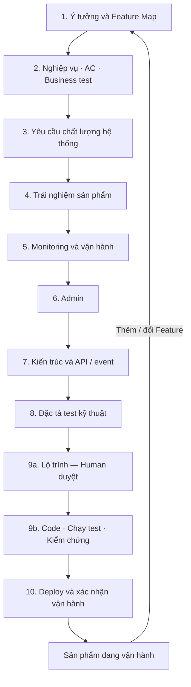

# Kidea — Thiết kế cách hoạt động

Trạng thái: `THIẾT KẾ TỔNG THỂ ĐÃ ĐƯỢC HUMAN ĐỒNG Ý — CHƯA TRIỂN KHAI`

Ngày cập nhật: 2026-09-06

Phạm vi: thiết kế hoạt động Kidea từ ý tưởng đến vận hành và thay đổi. Lộ trình xây dựng chính Kidea được quản lý riêng tại [KIDEA_ROADMAP.md](KIDEA_ROADMAP.md); chưa tạo/cài skill hoặc triển khai code.

Human đã đồng ý với thiết kế tổng thể và các đề xuất bổ sung, gồm giao diện tiến độ, quy tắc code theo môi trường, gate ở bước con, truy xuất xuyên tầng và ba bản đồ liên thông. Bản này hợp nhất các quyết định đó. Định dạng dữ liệu, runtime, bộ công cụ và phạm vi hỗ trợ cụ thể vẫn cần thiết kế, thử nghiệm và Human duyệt theo lộ trình; không coi đồng ý định hướng là duyệt trước mọi chi tiết triển khai.

Tài liệu này là nguồn thiết kế hiện hành. Roadmap là nguồn trạng thái xây dựng Kidea; tài liệu tham khảo là đầu vào để đối chiếu; `answer.md` là bản sao câu trả lời để đọc từ xa, không thay thế thiết kế hoặc roadmap.

<a id="scope"></a>

## 1. Mục tiêu và ranh giới

Kidea là một skill hướng dẫn một người cùng AI biến ý tưởng thành sản phẩm có thể triển khai, vận hành và thay đổi lâu dài. Kết quả cần đạt không phải số lượng tài liệu, mà là sự thống nhất có thể kiểm tra giữa ý định của Human, đặc tả, thiết kế, code, test và sản phẩm đang vận hành.

Kidea dùng file để lưu sự thật về công việc, không dựa vào việc AI còn nhớ cuộc hội thoại. File không loại bỏ hoàn toàn sai sót của AI: cần thêm kiểm tra, bằng chứng thực thi và Human review.

Yêu cầu Human đã nêu:

- Một người + AI, mặc định một việc đang thực hiện tại mỗi thời điểm; không thiết kế quanh nhiều nhánh công việc song song.
- Đi từng bước, cập nhật trạng thái khi làm; mỗi bước lớn có Human approval.
- Quản lý Feature theo `MVP / Future / Idea`.
- Tài liệu rõ, hiện hành, gọn và đầy đủ; thay đổi phải xử lý trọn vẹn các phần liên quan.
- Resume được qua phiên làm việc hoặc máy khác khi có đủ file cần thiết.
- Trong project được Kidea quản lý, không tự commit, push hoặc tạo branch; chỉ thực hiện khi Human yêu cầu rõ.
- Thêm Feature giữa MVP hoặc sau production đều quay lại chốt Feature rồi đi qua các bước tiếp theo.
- Chốt thiết kế hoạt động Kidea trước, sau đó lập kế hoạch và xây dựng skill theo các gate đã duyệt.
- Khi cần, có giao diện tổng quan và chi tiết trạng thái project, các bước/task, MVP hoặc bổ sung Feature cho sản phẩm đã chạy production.
- Có quy tắc code phù hợp ngôn ngữ, thành phần và môi trường chạy; có cách kiểm tra việc tuân thủ và chất lượng thực tế.
- Các bước con quan trọng cũng phải có Human approval, không chỉ bước lớn.
- Tinh gọn, mạnh mẽ, chỉn chu; truy được ảnh hưởng xuyên suốt tài liệu, thiết kế, test, code và vận hành.

Phân biệt hai phạm vi Git: quy tắc không tự thao tác Git ở trên là hành vi của skill trong project được quản lý. Tại repository xây dựng Kidea này, Human yêu cầu tiếp tục lưu toàn bộ câu trả lời cuối vào `answer.md`, commit và push để đọc trên GitHub; quy tắc đó còn hiệu lực đến khi Human yêu cầu dừng. Không đưa ngoại lệ riêng của repo này thành hành vi mặc định của skill.

Thiết kế tổng thể được chấp thuận không có nghĩa skill đã tồn tại, đã được test hoặc đủ tin cậy để quản lý sản phẩm thật. Các tiêu chí kiểm chứng và quyết định triển khai còn mở nằm ở mục 12 và roadmap.

## 2. Nguyên tắc tổ chức quy trình

### 2.1. Làm rõ monitoring/admin trước kiến trúc

Ngay bước chốt Feature phải nhận diện nhu cầu vận hành và quản trị. Những thao tác như khóa tài khoản, tạm dừng nhận đơn hoặc sửa hạn mức là nghiệp vụ: phải có quyền, điều kiện và kết quả ở bước đặc tả nghiệp vụ.

Đặt thiết kế chi tiết monitoring/admin trước kiến trúc để kiến trúc tính đủ dữ liệu, quyền, API và các đường điều khiển. Các bước dashboard xác định cần xem/làm gì, dữ liệu có ý nghĩa gì; kiến trúc mới chốt component, giao thức và cấu trúc request/response.

Nếu thiết kế dashboard phát hiện nghiệp vụ chưa có, quay lại phần nghiệp vụ liên quan để bổ sung và duyệt. Không âm thầm tạo nghiệp vụ chỉ tồn tại trong màn hình hoặc API.

### 2.2. Chuẩn bị triển khai sớm, xác nhận phát hành ở cuối

Môi trường đích, chi phí, nền tảng được hỗ trợ và hạn chế triển khai là đầu vào sớm cho thiết kế. Trong bước code cần dựng sớm build, chạy test tự động và một môi trường kiểm thử có thể tái tạo.

Bước cuối vẫn riêng biệt: kiểm chứng toàn bộ quy trình triển khai, cấu hình, nâng cấp dữ liệu, khôi phục, monitoring và thao tác vận hành. Chạy local được chưa phải sẵn sàng production.

### 2.3. Tách duyệt kế hoạch khỏi thực hiện kế hoạch

Trong bước “lên kế hoạch + code”, Human duyệt lộ trình trước khi AI bắt đầu code theo lộ trình đó. Task/phase có điều kiện hoàn thành rõ; không chờ đến khi viết xong toàn sản phẩm mới kiểm tra chéo.

### 2.4. Mức độ tài liệu theo nhu cầu, không bỏ điều kiện chất lượng

Không mặc định mọi sản phẩm phải có mobile, nhiều service, dashboard tự xây hoặc một cụm triển khai phức tạp. Nếu một hạng mục không áp dụng, ghi lý do và để Human xác nhận; không tạo nội dung giả cho đủ biểu mẫu.

Future giúp nhận diện hướng mở rộng và những quyết định khó đảo ngược; không phải giấy phép xây trước mọi thứ. Với một người, đề xuất ban đầu nên xem xét một ứng dụng chia module rõ trước khi cân nhắc nhiều service, rồi quyết định theo yêu cầu thực tế.

Tinh gọn nghĩa là mỗi file, trường dữ liệu, rule và bước kiểm tra có công dụng rõ, một nơi định nghĩa có hiệu lực; mạnh mẽ nghĩa là có thể kiểm chứng và tiếp tục an toàn khi bị ngắt; chỉn chu nghĩa là thông tin đúng, rõ, đồng bộ và kết quả được kiểm tra. Không lấy việc ít file hoặc ít bước làm thước đo duy nhất của sự đơn giản.

<a id="workflow"></a>

## 3. Quy trình cho mỗi đợt phát triển

“Đợt phát triển” là bản MVP đầu tiên hoặc một gói thay đổi được Human chốt. Bảng này mô tả cách skill sẽ dẫn dắt sản phẩm sử dụng Kidea; không phải kế hoạch task để xây dựng chính skill Kidea.

| Bước | Công việc và đầu ra để Human duyệt |
|---|---|
| 1. Ý tưởng và phạm vi | Mục tiêu, người dùng, vấn đề cần giải quyết, tiêu chí thành công, ràng buộc đã biết; Feature Map `MVP / Future / Idea`, bao gồm nhu cầu admin/vận hành. Từng Feature có quyết định rõ về phạm vi/phân loại. |
| 2. Nghiệp vụ + AC + business test | Cụm Feature đang làm; phần dùng chung và phần riêng; dữ liệu, rule, state, flow, lỗi, dependency; AC; tình huống kiểm tra nghiệp vụ và phạm vi bao phủ. Không còn điểm mơ hồ làm thay đổi kết quả trong phạm vi cần duyệt. |
| 3. Yêu cầu chất lượng hệ thống | Tải, độ trễ, tính sẵn sàng, bảo mật, quyền riêng tư, lưu giữ dữ liệu, mất dữ liệu cho phép, thời gian khôi phục, giới hạn chi phí; cách đo và kịch bản kiểm chứng tương ứng. |
| 4. Trải nghiệm sản phẩm | Web/mobile và nền tảng hỗ trợ; hành trình sử dụng, màn hình, dữ liệu và thao tác; trạng thái đang tải/rỗng/lỗi/thiếu quyền; phác thảo giao diện, yêu cầu khả năng sử dụng và test liên quan. |
| 5. Monitoring và điều khiển vận hành | Cần biết hệ thống đang ra sao, đo ở đâu, dữ liệu mới đến mức nào; dashboard, ngưỡng và kênh cảnh báo, cách xử lý; thao tác vận hành và quyền; kịch bản kiểm tra cả đường thu thập/cảnh báo/điều khiển. |
| 6. Admin | Màn hình và thao tác quản trị, phạm vi quyền, xác nhận thao tác nhạy cảm, ghi nhận ai làm gì, kiểm tra tính đúng và an toàn. Tái sử dụng nghiệp vụ đã chốt, không định nghĩa lại trong UI. |
| 7. Kiến trúc và hợp đồng kỹ thuật | Mapping nghiệp vụ → module/service; công nghệ và lý do; dữ liệu và bên sở hữu; API/event input-output, lỗi, dependency; frontend, dashboard, bảo mật, môi trường triển khai, backup/khôi phục và chiến lược nâng cấp. Chọn và Human duyệt bộ quy tắc code hiệu lực cho từng thành phần/môi trường. |
| 8. Đặc tả kiểm thử kỹ thuật | Cụ thể hóa business/quality/UI/operations tests thành kiểm thử hợp đồng, tích hợp, luồng đầu-cuối, tải, bảo mật, lỗi và khôi phục khi áp dụng. Nêu cái nào chạy được ngay và cái nào phải chờ code/hạ tầng. |
| 9. Lộ trình và triển khai | Human duyệt phase/task trước; sau đó thực hiện từng task, bổ sung test chạy được, chạy và lưu bằng chứng. Bao phủ toàn bộ thành phần trong phạm vi phát hành. Task, phase và toàn bản phát hành có bộ kiểm tra tương ứng. |
| 10. Triển khai và xác nhận vận hành | Kiểm tra môi trường, diễn tập deploy/nâng cấp/khôi phục; Human cho phép triển khai đích cụ thể; kiểm tra sau deploy, cảnh báo, dữ liệu và thao tác vận hành; xác nhận bản thực sự đang chạy. |



Mỗi bước lớn kết thúc bằng Human review và approval, không phải tự động đi qua các mũi tên. Nếu phát hiện đầu vào sai ở bước trước, quay lại bước sớm nhất bị ảnh hưởng, sửa và duyệt lại các phần liên quan. Đây là quy trình có thứ tự nhưng cho phép sửa sai, không ép thực tế đi theo đường thẳng bất chấp bằng chứng.

Trong lúc đang xây MVP, yêu cầu thêm Feature cũng quay về bước 1; lưu điểm công việc bị ngắt trước khi đổi bước. Không tự chuyển yêu cầu mới sang Idea để né việc phân tích, cũng không triển khai ngay vì Human vừa nhắc đến nó: làm rõ Human đang muốn đưa vào đợt hiện tại hay chỉ ghi nhận để sau.

Chốt một Feature vào Future/Idea chỉ là chốt phân loại và mô tả cần thiết, không có nghĩa phải đặc tả đầy đủ hoặc cam kết triển khai nó. Bước 1 hoàn tất khi Human duyệt phạm vi đợt hiện tại và Feature Map, không cần biến mọi Idea thành quyết định xây sản phẩm.

<a id="state-approval"></a>

## 4. Trạng thái, approval và điều kiện dừng

### 4.1. Một việc hiện hành

Mỗi thời điểm có một đợt phát triển hiện hành và một mục công việc đang làm. AI có thể kiểm tra nhiều file liên quan để hoàn thành mục đó; điều này không có nghĩa mở thêm nhiều task triển khai song song.

Khi tạm chuyển sang làm dependency, ghi cả đường đi và điểm quay lại. Nếu có nhiều cấp dependency, lưu danh sách điểm quay lại theo thứ tự, không chỉ nhớ “đang làm Feature nào”.

### 4.2. Trạng thái vừa đủ

- Bước lớn: `PENDING → IN_PROGRESS → IN_REVIEW → APPROVED`.
- Tài liệu: giữ `DRAFT → IN_REVIEW → APPROVED` như phương pháp nghiệp vụ.
- Task thực hiện: `TODO → IN_PROGRESS → DONE`.
- Nếu bị chặn, ghi lý do và điều cần giải quyết bên cạnh trạng thái hiện tại; không coi bị chặn là hoàn thành.
- Bước không áp dụng phải có kết luận `N/A` với lý do được Human xác nhận.

`APPROVED` của tài liệu nghĩa là Human chấp nhận nội dung; không có nghĩa code đã tồn tại hoặc hệ thống đã được test. `DONE` của task nghĩa là đáp ứng điều kiện và có bằng chứng của task; không có nghĩa cả Feature hay bản phát hành hoàn tất.

### 4.3. Approval có phạm vi và căn cứ

AI gửi gói review gồm nội dung cần duyệt, các thay đổi, kết quả kiểm tra, điểm còn thiếu và bước kế tiếp. Human duyệt đúng bước/gói nội dung hiện tại; góp ý hoặc nói “tiếp tục phân tích” không tự động được coi là approval.

Lưu phạm vi, thời điểm, xác nhận của Human và phiên bản nội dung được duyệt. Phiên bản có thể nhận diện bằng dấu vân tay nội dung file; không cần tạo Git commit. Khi đầu vào hoặc nội dung liên quan thay đổi, đánh giá lại hiệu lực approval và bằng chứng test. Không giữ nhãn “đã đạt” chỉ vì từng đạt ở một bản cũ.

Với thay đổi làm sai căn cứ đã duyệt, đưa nội dung đó về nháp và đánh dấu phần phụ thuộc cần kiểm tra lại. Không bắt duyệt lại mọi trang chỉ vì một lỗi chính tả.

Gate bên trong bước 9: Human duyệt kế hoạch; từng task chỉ DONE khi đạt các kiểm tra đã chốt; cuối mỗi phase có gói review và Human duyệt trước phase tiếp. Không yêu cầu thêm một lần approve cho mọi chỉnh sửa nhỏ ngoài các gate đã thống nhất.

#### Gate ở bước con

Không để AI tự quyết định tùy hứng bước nào “đủ quan trọng”. Khi phân rã một bước lớn, AI phải nêu bước con nào cần Human duyệt, duyệt điều gì, dựa trên đầu ra nào và lý do. Human chốt các điểm dừng này trước khi thực hiện phần phụ thuộc vào quyết định đó.

Các nhóm quyết định bắt buộc trình Human, dù nằm ở bước con:

- Thay đổi phạm vi, hành vi nghiệp vụ, rule hoặc thứ tự/ý nghĩa lỗi mà người sử dụng quan sát được.
- Ranh giới nghiệp vụ dùng chung, quyền sở hữu dữ liệu và hợp đồng API/event có ảnh hưởng bên sử dụng.
- Tiêu chí chấp nhận, mức bao phủ test, yêu cầu bảo mật/hiệu năng/khôi phục hoặc đề xuất giảm một kiểm tra bắt buộc.
- Lựa chọn công nghệ, môi trường, chi phí hoặc tối ưu chuyên biệt làm thay đổi khả năng tương thích và độ phức tạp đáng kể.
- Thay đổi bộ quy tắc code đang có hiệu lực hoặc xin ngoại lệ có ảnh hưởng tới chất lượng/kiến trúc.

Chỉnh format, bổ sung test theo đặc tả đã chốt hoặc code theo thiết kế và quyền thực hiện đã được cấp không tự phát sinh một gate mới. Nếu phát hiện quyết định quan trọng chưa nằm trong danh sách gate, AI ghi nhận và dừng đúng nhánh bị phụ thuộc để Human quyết định, không tự bỏ gate hoặc tự nới điều kiện.

Hồ sơ bước con cần nêu phần việc, kết quả kiểm tra và trạng thái Human review riêng. Kiểm tra đạt chưa tự biến thành approval. `$kidea approve <mã-bước-hoặc-gói-review>` phải chỉ rõ mục đang duyệt; duyệt một bước con không tự duyệt bước lớn hoặc những thay đổi khác.

### 4.4. Quyền thao tác không đi kèm approval nội dung

Quy tắc dưới đây áp dụng khi Kidea làm việc trong project được quản lý, không thay thế yêu cầu lưu/push câu trả lời tại repo xây dựng Kidea.

Approve thiết kế, phase hoặc bản sẵn sàng phát hành không mặc nhiên cho phép commit/push/tạo branch, triển khai production, sửa dữ liệu thật hoặc tắt hệ thống. Các thao tác này cần yêu cầu rõ cho đúng phạm vi và môi trường.

Không tự chạy thử phá hỏng hệ thống trên production. Kịch bản sự cố được diễn tập trong môi trường được phép; nếu cần kiểm chứng ở production phải có kế hoạch và quyền riêng.

<a id="files-view"></a>

## 5. Cấu trúc hồ sơ và giao diện tiến độ

```text
.kidea/
├── INDEX.md             # Cửa vào: mục tiêu, các bước, trạng thái và link
├── work.md              # Việc hiện hành, bước con/task, điểm quay lại, impact, review
├── features.md          # MVP / Future / Idea và quyết định phạm vi
├── business/            # Đặc tả nghiệp vụ, AC và business test
├── requirements/        # Yêu cầu chất lượng và cách đo/kiểm chứng
├── experience/          # Nền tảng, luồng màn hình, phác thảo sản phẩm
├── operations/          # Thiết kế monitoring và admin
├── architecture/        # Thiết kế kỹ thuật và mapping
├── tests/               # Đặc tả test kỹ thuật và bảng truy xuất bằng chứng
├── delivery/            # Kế hoạch phát hành, hướng dẫn và bằng chứng triển khai
└── views/               # HTML tiến độ sinh khi cần; không phải nguồn trạng thái
```

Init chỉ cần tạo `INDEX.md`, `work.md`, `features.md`. Thư mục và tài liệu khác chỉ tạo khi đến việc cần chúng. Đây là cấu trúc dự kiến, không phải yêu cầu tạo ngay toàn bộ cây rỗng.

### INDEX.md

Dùng tên `INDEX.md` vì bản thân thư mục `.kidea` đã cho biết ngữ cảnh. File này chứa:

- Mục tiêu, phạm vi đợt phát triển và phiên bản định dạng Kidea.
- Danh sách toàn bộ bước lớn, trạng thái từng bước, đầu ra và gate liên quan.
- Bước đang làm và link chính xác đến công việc đang dở.
- Link đến danh sách bước con đã xong/chưa xong, phase/task khi đã có kế hoạch.
- Bản sản phẩm đang phát triển và bản đang được ghi nhận triển khai, nếu đã có.

Chi tiết trạng thái task chỉ có một nơi quản lý trong `work.md` hoặc file kế hoạch được nó trỏ tới khi kế hoạch lớn. INDEX là điểm điều hướng/tóm tắt, không phải bản chép thứ hai của toàn bộ checklist. Trạng thái tài liệu nằm ở tài liệu nguồn; phần tóm tắt ở INDEX phải được đồng bộ hoặc kiểm tra lại từ nguồn.

### work.md

Chứa mục tiêu hiện hành, bước con, danh sách việc đã xong/còn lại, file cần đọc, quyết định đang có hiệu lực, câu hỏi còn mở, chuỗi điểm quay lại khi xử lý dependency, impact list, gói chờ review và bằng chứng kiểm tra.

Ghi trước một thao tác quan trọng là định làm gì; ghi sau là đã xảy ra gì và kiểm tra bằng cách nào. Khi bị ngắt giữa chừng, trạng thái phải cho phép AI nhận biết “chưa xác nhận kết quả” thay vì tự đoán hoàn thành hoặc chạy lại thao tác có tác dụng phụ.

Không ghi suy nghĩ dài dòng của AI, toàn bộ hội thoại hoặc log thô không cần thiết vào file này. Giữ quyết định hiện hành, căn cứ cần thiết và việc chưa xử lý; thu gọn công việc đã đóng sau khi kết quả cần thiết đã nằm ở đúng tài liệu.

Thu gọn không có nghĩa xóa cây task cần hiển thị: với các task đã xác định trong phạm vi theo dõi hiện hành, kể cả đã hoàn thành, giữ tối thiểu ID, tên, quan hệ cha-con, trạng thái và link kết quả/bằng chứng. Chỉ bỏ log hoặc diễn giải không còn cần, để INDEX và giao diện vẫn liệt kê đúng phần đã làm/chưa làm.

### Ranh giới của .kidea

`.kidea` chứa toàn bộ **hồ sơ do Kidea quản lý**: tài liệu, trạng thái, kế hoạch và chỉ mục bằng chứng. Code sản phẩm, test chạy được, cấu hình build/CI và triển khai nằm ở vị trí chuẩn của project; `.kidea` link đến chúng, không sao chép.

Human đã đồng ý với ranh giới hồ sơ/code trong phản hồi tổng thể: không đặt toàn bộ source code dưới `.kidea`, tránh trộn hồ sơ quy trình với sản phẩm và xung đột cấu trúc mà công cụ của project yêu cầu.

Không lưu mật khẩu, token, dữ liệu cá nhân hoặc log sản xuất nhạy cảm trong hồ sơ public. Bằng chứng lớn/nhạy cảm có thể nằm ở nơi lưu phù hợp; trong `.kidea` chỉ giữ kết luận và vị trí truy cập đã được phép.

### Giao diện trạng thái project

Mục tiêu đã được Human yêu cầu: một flowchart tổng quan các bước lớn, mở được chi tiết tên/trạng thái bước con và task, nhìn rõ đang làm MVP hay bổ sung tính năng nào cho hệ thống đã chạy production.

`$kidea visualize` gọi một script đọc dữ liệu có cấu trúc trong hồ sơ `.kidea`, kiểm tra tính hợp lệ và sinh `.kidea/views/progress.html`. Một file HTML mở trực tiếp bằng trình duyệt, hoạt động offline, không cần server hay tải thư viện từ mạng. Có thể dùng các khối HTML/SVG và mở/thu gọn chi tiết; không cần kéo cả framework frontend vào bản đầu. Chọn Python hoặc Node.js ở bước thiết kế triển khai Kidea dựa trên môi trường cài đặt được hỗ trợ, không buộc sản phẩm sử dụng Kidea phải viết bằng cùng ngôn ngữ.

Đường dữ liệu: hồ sơ nguồn → kiểm tra/đọc cấu trúc → HTML. Không để AI vẽ lại tiến độ theo trí nhớ, không đọc ngược HTML để xác định trạng thái và không thêm bản trạng thái JSON được sửa độc lập với Markdown. Metadata/bảng trạng thái trong các file nguồn cần có định dạng cố định, ID, quan hệ cha-con, nhãn và trạng thái hợp lệ; schema cụ thể sẽ được thiết kế tiếp. Các câu giải thích tự do vẫn là Markdown, không phải đầu vào để script tự suy diễn trạng thái.

Giao diện cần hiển thị:

- Tên project; trạng thái sản phẩm đã phát hành hay chưa, bản production được ghi nhận và thời điểm xác nhận gần nhất nếu có.
- Đợt phát triển hiện hành: MVP hay thay đổi Feature nào; tách khỏi bản đang vận hành.
- Các bước lớn cùng tên/trạng thái; chọn một bước để xem tên, trạng thái bước con/task, kết quả kiểm tra và điểm chờ Human duyệt.
- Việc đang làm, điểm bị chặn và việc kế tiếp đã biết; link tới nguồn tài liệu/gói review/bằng chứng liên quan.
- Thời điểm sinh HTML và nhận diện phiên bản dữ liệu đầu vào. Trạng thái chưa có bằng chứng hoặc dữ liệu mâu thuẫn phải được báo rõ.

Đây là bản chụp tại lúc sinh, không phải màn hình theo dõi trực tiếp. Mở lại HTML cũ không làm dữ liệu mới lên; file offline không tự biết hồ sơ nguồn đã đổi. Muốn xem mới nhất thì sinh lại. Khi sinh, nếu dữ liệu thiếu, sai hoặc thay đổi giữa lượt đọc, phải báo lỗi/không đủ căn cứ, không tự hiện “đã xong”. Không biến tình trạng “đã được ghi nhận chạy production” thành xác nhận sức khỏe production hiện tại.

Không hiển thị một tỷ lệ phần trăm như thể đó là thời gian còn lại. Có thể hiển thị số task đã xong/tổng task đã xác định, ghi rõ phạm vi; bước chưa được phân rã phải ghi “chưa phân rã”, không diễn giải không có task là đã hoàn tất.

Bản đầu chỉ xem: không approve, sửa trạng thái, commit/push, deploy hoặc bật/tắt sản phẩm từ HTML. Đây là giao diện tiến độ Kidea, khác dashboard monitoring/admin của sản phẩm ở bước 5–6. Sinh lại file view chỉ ảnh hưởng đầu ra dẫn xuất, không thay hồ sơ gốc. Script chỉ được ghi đúng file đầu ra do nó quản lý; lỗi sinh không được phá file nguồn hoặc giả báo đã cập nhật view.

Nội dung đọc từ hồ sơ phải được chèn vào HTML như dữ liệu an toàn, không được thực thi thành script. Không tự upload/host giao diện; khi mang riêng HTML sang máy khác vẫn đọc được phần tiến độ đã nhúng, nhưng link tới tài liệu nguồn cần các file tương ứng. Chỉ đưa dữ liệu đã được phép chia sẻ vào file xuất.

<a id="resume"></a>

## 6. Resume qua phiên hoặc máy khác

1. Tìm root project và `.kidea/INDEX.md`; không tự init lại nếu đã có trạng thái.
2. Đọc mục tiêu, phiên bản định dạng, bước hiện hành và `work.md`.
3. Đọc đầy đủ tài liệu nguồn cần cho mục đang xử lý và các dependency; không lấy bản tóm tắt thay cho nội dung cần phân tích.
4. Kiểm tra file có tồn tại, có thay đổi chưa xử lý, approval và bằng chứng còn đúng với bản hiện tại không; kiểm tra repo đang ở đúng vị trí/trạng thái, chỉ đọc, không tự chuyển branch.
5. Với thao tác dang dở, kiểm tra thực tế trước khi thử lại. Nếu trạng thái thiếu hoặc mâu thuẫn, ghi rõ và đối chiếu bằng chứng; không tự chữa bằng cách đánh dấu hoàn thành.
6. Thông báo ngắn đang ở đâu, chờ Human duyệt gì nếu có, và tiếp tục đúng việc chưa hoàn thành được phép làm.

Resume không cần đọc toàn bộ project mỗi lần, nhưng khi phân tích ảnh hưởng vẫn phải tìm đủ nơi liên quan và đọc đầy đủ chúng. Context không đủ thì chia lượt đọc, lưu kết quả có căn cứ và tiếp tục; không kết luận không ảnh hưởng chỉ vì chưa đọc hết.

Sang máy khác cần có cả `.kidea`, đúng source và tài nguyên cần dùng; Kidea cũng phải được cài/khả dụng ở máy đó. Resume không tự đồng bộ file giữa máy, không tự clone/pull/push và không khôi phục được file chưa được chuyển sang. Chuyển qua Git chỉ xảy ra khi Human yêu cầu.

<a id="change"></a>

## 7. Thay đổi và đồng bộ toàn chuỗi

### 7.1. Thêm Feature

Ghi checkpoint công việc cũ → lập gói thay đổi hiện hành → quay về bước 1 → duyệt Feature → đi tiếp qua các gate của đợt thay đổi.

Mỗi bước phía sau phải có kết luận: cần sửa gì hoặc đã kiểm tra và không cần sửa vì sao. Không nhất thiết viết lại toàn bộ tài liệu, nhưng không được bỏ qua một bước chỉ vì đoán rằng thay đổi nhỏ.

Sửa bug đúng theo đặc tả đã duyệt có thể bắt đầu ở bước sớm nhất thực sự bị ảnh hưởng; phải xác minh đây là sửa triển khai lệch đặc tả, không phải thêm/đổi hành vi được ngụy trang thành bugfix. Không dùng đường này để bỏ vòng chốt Feature.

### 7.2. Phân tích ảnh hưởng đến khi xử lý trọn vẹn

Giữ cách đã thống nhất: link đến mục cụ thể và backlink, không thêm loại quan hệ `USES / READS_STATE / CHANGES_STATE`.

Mở rộng việc tìm kiếm từ tài liệu nghiệp vụ sang yêu cầu hệ thống, màn hình, thiết kế, code, test và vận hành. Không cần nhét backlink vào mọi dòng code: hồ sơ mapping trỏ đến module/file/symbol và test tương ứng, hỗ trợ tìm ngược từ đường dẫn đó.

Khi B đổi:

1. Đọc đầy đủ B, nơi B phụ thuộc, mọi nơi phụ thuộc B; tìm thêm theo ID/link và cấu trúc thực tế để bắt cả mapping thiếu.
2. Mỗi nơi phải có kết luận cần sửa hoặc không cần sửa cùng lý do.
3. Nếu hành vi, giả định hoặc căn cứ kiểm chứng của A/C đổi, tiếp tục từ A/C đến các bên liên quan, dù câu chữ hoặc code của A/C không cần sửa. Ví dụ B đổi cách làm tròn, A vẫn ghi “dùng công thức B” nhưng đầu ra đã khác; D sử dụng đầu ra A vẫn phải được kiểm tra. Không dùng việc file có diff hay không làm điều kiện duy nhất để lan truyền ảnh hưởng.
4. Nếu một nơi đã kiểm tra nhưng đầu vào của nó lại thay đổi trong vòng xử lý, đưa nó vào kiểm tra lại. Không dùng “đã đọc một lần” để bỏ qua một phiên bản mới.
5. Dừng khi không còn thay đổi nào chưa được đánh giá, không còn mục cần sửa chưa xử lý và mọi kiểm tra/approval cần thiết đã hoàn tất.

ID chỉ cần đúng nghĩa, duy nhất và nhất quán trong bộ tài liệu hiện hành. Khi thay hoặc bỏ nghiệp vụ, cập nhật/xóa đủ tham chiếu rồi bỏ nội dung cũ; không tạo kho mã cũ bị cấm tái sử dụng.

#### Truy xuất xuyên tầng

Không chỉ truy được “A gọi B” trong tài liệu nghiệp vụ. Một rule/flow/AC cần lần được tới thiết kế, test specification, code và bằng chứng tương ứng khi những phần này đã đến bước được tạo; đồng thời tìm ngược được từ nơi triển khai/test đến căn cứ nguồn.

Ví dụ đổi `ORD-CANCEL` từ “chỉ hủy đơn chưa xử lý” sang “được hủy cả phần chưa xử lý của đơn xử lý một phần” có thể ảnh hưởng state/flow đơn, nghiệp vụ giải phóng tiền, AC/business test, UI, API, service xử lý, test tích hợp và monitoring/admin liên quan. Đây là danh sách cần xác minh từ dependency thực tế, không mặc định tất cả đều phải sửa.

Hồ sơ mapping ghi mục nguồn, mục liên quan, mục đích và vị trí chính xác. Với code dùng file + module/symbol khi phù hợp; không chỉ lưu số dòng dễ thay đổi. Ghi một quan hệ chuẩn ở một nơi; backlink/chỉ mục tổng hợp nếu lặp lại phải là góc nhìn được sinh hoặc kiểm tra đối xứng, không thành nguồn sự thật thứ hai. Mở rộng trên cơ chế link đã thống nhất, chưa cần graph database hoặc file mapping cho từng dòng code.

Script kiểm tra được link đích, ID, mapping thiếu theo danh sách bắt buộc và bằng chứng không khớp phiên bản. Nó không thể chứng minh không còn quan hệ ngầm chỉ bằng việc graph hết lỗi. AI vẫn phải tìm kiếm trong toàn bộ phạm vi hồ sơ và source liên quan, đọc nội dung thực tế và ghi kết luận; có bằng chứng mới làm thay đổi kết luận thì mở lại đánh giá.

Ở đầu dự án, chưa có code/test chạy được không phải lỗi đồng bộ: mapping cần ghi trạng thái “chưa đến bước triển khai” và việc cần tạo. Khi gate tương ứng yêu cầu có thì thiếu mapping hoặc bằng chứng trở thành điều kiện chưa đạt, không được để trống rồi tuyên bố hoàn tất. Giao diện tiến độ chỉ hiển thị các kết luận này, không tự quyết định chúng.

### 7.3. Không nhầm bản đang làm với bản đang chạy

Không thể yêu cầu code luôn đã theo tài liệu mới ngay tại thời điểm đang sửa tài liệu trước code. Điều có thể và phải bảo đảm là **mọi độ lệch tạm thời được nhận diện, có việc xử lý, và không bị công bố là đã đồng bộ**.

Ví dụ: tài liệu của bản kế tiếp cho phép hủy thêm một trạng thái đơn, nhưng production vẫn chạy bản trước. Kidea phải ghi rõ target mới, phần code/test còn thiếu và bản đang triển khai; không nói production đã có hành vi mới.

Giữ một bộ đặc tả làm việc hiện hành, phân biệt trạng thái duyệt nội dung với tình trạng đã triển khai. Bản đang chạy được nhận diện bằng mã bản phát hành và gói triển khai có thể truy xuất, chứa căn cứ cấu hình/đặc tả và bằng chứng của bản đó. Gói này chỉ cần tạo khi thực sự phát hành, không sao chép toàn bộ tài liệu sau mỗi lần sửa và không đòi Kidea tự commit.

Tài liệu làm việc sạch không đồng nghĩa xóa dữ liệu cần khôi phục production. Bản triển khai trước, backup và bằng chứng vận hành có thời hạn giữ được chốt riêng; không trộn chúng thành các rule cũ còn hiệu lực trong tài liệu hiện hành.

<a id="three-maps"></a>

### 7.4. Ba bản đồ liên thông

Kidea tổ chức thông tin thành đúng ba góc nhìn dưới đây, không tạo ba kho phải cập nhật thủ công độc lập. Kiến trúc, dữ liệu, test và vận hành là các phần hoặc bộ lọc bên trong; không cần thêm một hệ thống bản đồ riêng cho mỗi loại.

| Bản đồ | Phạm vi | Nguồn có hiệu lực và cách tạo |
|---|---|---|
| 1. Hồ sơ đặc tả | Feature, rule, state, flow, AC, đặc tả test; yêu cầu chất lượng, UI, thiết kế vận hành, kiến trúc và hợp đồng API/event/dữ liệu | Nội dung hồ sơ được Human duyệt mô tả điều sản phẩm phải đạt. Quan hệ lấy từ ID/link và mục đích liên kết trong tài liệu nguồn. |
| 2. Triển khai | Module, class/struct, hàm, lời gọi, include, dữ liệu dùng chung, API/event thực tế, cấu hình build/deploy và test chạy được | Source/cấu hình mô tả điều thực sự được xây, có thể đang sai đặc tả. Công cụ trích xuất quan hệ khi hỗ trợ; quan hệ còn thiếu được bổ sung có căn cứ hoặc ghi rõ chưa biết. |
| 3. Đối chiếu đặc tả ↔ triển khai | Mục đặc tả được thực hiện ở đâu, test nào kiểm tra yêu cầu nào, chiều ngược từ code/test về căn cứ | Mapping nhiều–nhiều do AI đề xuất, kiểm tra nội dung thực tế và Human review ý nghĩa tại gate liên quan; chỉ mục ngược được sinh hoặc kiểm tra đối xứng. |

Không thêm bản đồ test thứ tư: đặc tả test ở bản đồ 1; test thực thi ở bản đồ 2; quan hệ giữa chúng ở bản đồ 3. Bằng chứng chạy gắn với test thực thi, đúng phiên bản code/cấu hình, đặc tả và môi trường đã kiểm tra.

#### Ranh giới nguồn dữ liệu

- Quan hệ cơ học lấy được từ source không chép tay từng caller/callee vào Markdown. Nếu lưu kết quả sinh hoặc cache thì phải tái tạo được và không được sửa như một nguồn độc lập.
- Mapping trực tiếp tập trung vào nơi mang trách nhiệm nghiệp vụ/kỹ thuật: mục đặc tả, module/file/symbol, contract và test. Không ép mỗi hàm tiện ích có một ID nghiệp vụ riêng; lần qua quan hệ triển khai để tìm bên dùng nó.
- Mỗi quan hệ có một nơi định nghĩa có hiệu lực. Khi cần bổ sung quan hệ event/dữ liệu/cấu hình mà công cụ không lấy được, ghi vị trí và lý do thực tế; không suy ra từ tên gần giống.
- Mỗi bản đồ dẫn xuất cần nhận diện phiên bản hồ sơ/source, phạm vi quét, phiên bản công cụ, cấu hình phân tích và giới hạn. Thiếu công cụ, file sinh, đường dẫn hoặc loại quan hệ không được hỗ trợ phải báo rõ, không biến graph rỗng thành “không có dependency”.
- Di chuyển/đổi tên/xóa symbol hoặc thay cấu hình build phải kiểm tra lại mapping và bằng chứng liên quan. ID tài liệu ổn định theo ý nghĩa; vị trí code dùng file/module/symbol phù hợp, không dựa riêng vào số dòng.

Định dạng lưu và giao diện giữa công cụ trích xuất với Kidea sẽ được chốt theo roadmap. Không cần graph database hoặc một file riêng cho từng quan hệ.

#### Doxygen là một công cụ đầu vào, không phải toàn bộ bản đồ triển khai

Với C++, Doxygen có thể cung cấp cấu trúc class, kế thừa, include, call/caller graph và đầu ra XML máy đọc. Nhưng độ đầy đủ/chính xác của call graph phụ thuộc bộ phân tích, không phải bảo đảm mọi dependency đã được tìm. [Doxygen — Diagrams](https://www.doxygen.nl/manual/diagrams.html), [Call graph](https://www.doxygen.nl/manual/commands.html#cmdcallgraph), [XML output](https://www.doxygen.nl/manual/config.html#cfg_generate_xml).

Chữ ký hàm chỉ cho biết một phần input/output; chưa nói đủ đơn vị, điều kiện, thứ tự lỗi, làm tròn, tác dụng lên state hay invariant. Event giữa hai tiến trình, callback, dữ liệu dùng chung và cấu hình cũng có thể tạo ảnh hưởng ngoài đường gọi hàm trực tiếp. Công cụ theo ngôn ngữ là phần thay được; không bắt mọi project dùng Doxygen hoặc coi một adapter C++ là hỗ trợ mọi ngôn ngữ.

#### Cách dùng ba bản đồ khi thay đổi

1. Từ mục đặc tả đổi, lần quan hệ trong bản đồ 1 để xác định rule/flow/AC/contract/test specification và các yêu cầu khác liên quan.
2. Qua bản đồ 3 đến phần code, cấu hình và test thực thi tương ứng.
3. Qua bản đồ 2 đến bên gọi, bên được gọi, bên nhận event, bên dùng dữ liệu/cấu hình và test liên quan.
4. Quay qua bản đồ 3 để kiểm tra các đặc tả khác mà phần triển khai đó phục vụ; tiếp tục vòng đánh giá theo mục 7.2, kể cả khi không có diff văn bản.
5. Ghi `CẦN SỬA` hoặc `ĐÃ KIỂM TRA — KHÔNG CẦN SỬA` kèm lý do, phiên bản đầu vào và bằng chứng. Chỉ đóng khi toàn bộ ảnh hưởng được xử lý và đủ gate, không chỉ vì đã duyệt hết các cạnh hiện có.

Ví dụ: code hủy đơn phát `OrderCancelled`; một tiến trình khác nhận event để hoàn tiền. Đổi sang hủy phần còn lại của đơn xử lý một phần có thể ảnh hưởng số tiền hoàn dù hai bên không gọi hàm trực tiếp. Phải kiểm tra payload, state, rule, bên nhận và test tích hợp xác nhận số tiền thực tế. Test chỉ gọi hàm hủy rồi kiểm tra “không crash” chưa chứng minh hoàn tiền đúng.

Đi từ code về đặc tả cũng áp dụng cùng cơ chế. Nếu code lệch yêu cầu đã duyệt, sửa code; không tự sửa đặc tả để hợp thức hóa triển khai. Có link đúng chưa chứng minh đúng trách nhiệm; chạy qua code chưa chứng minh test có assertion cho hành vi cần kiểm tra. Bản đồ giúp tìm nơi cần đọc, không thay thế phân tích ngữ nghĩa, tìm kiếm bổ sung hoặc Human quyết định.

<a id="testing"></a>

## 8. Từ yêu cầu đến test và bằng chứng

Mối liên hệ cần truy được hai chiều:

```text
Feature / yêu cầu chất lượng
↔ rule, flow, AC hoặc tiêu chí đo
↔ đặc tả test có input, điều kiện và expected result
↔ module / API / phần triển khai
↔ test chạy được và kết quả trên phiên bản cụ thể
```

Đây không phải quan hệ một-một. Một AC có thể dựa vào nhiều rule; một test có thể kiểm tra nhiều rule/AC. Chi tiết cách sinh AC và chọn test sẽ tiếp tục được làm rõ ở bước nghiệp vụ dựa trên tài liệu tham khảo, không tự coi phần còn đang thảo luận là đã chốt.

Phân biệt ba lớp:

- **Đặc tả test:** mô tả cần kiểm tra điều gì và kết quả đúng là gì.
- **Test thực thi:** code hoặc quy trình cụ thể để thực hiện kiểm tra.
- **Bằng chứng:** đã chạy kiểm tra nào, trên code/cấu hình nào, môi trường nào và kết quả gì.

Ở bước 8, có thể có test cụ thể chạy được với thành phần đã tồn tại. Test chạy trên mô phỏng chỉ chứng minh phần mô phỏng/phạm vi được kiểm tra, không thay cho tích hợp với triển khai thật. Những case còn chờ code/hạ tầng phải có nơi và thời điểm hoàn thiện trong kế hoạch.

Task chỉ DONE khi phạm vi đã chốt được triển khai, tài liệu/mapping đồng bộ và mọi kiểm tra bắt buộc cho task đạt. Cuối phase chạy kiểm tra tích hợp/hồi quy cần thiết; cuối bản phát hành chạy bộ kiểm tra đủ phạm vi phát hành, không chỉ cộng kết quả test của từng task.

Test chưa chạy, thiếu môi trường, thất bại hoặc bị skip không được báo là PASS. Nếu muốn thay đổi tiêu chí chấp nhận, phải đưa tiêu chí về review; không xóa test lỗi chỉ để xanh. Với kiểm tra thủ công, lưu quy trình và kết quả thực tế; chưa có xác nhận thì vẫn chưa đủ bằng chứng.

Ví dụ yêu cầu tải chỉ để minh họa: “Trong môi trường X, với dữ liệu Y, duy trì 200 yêu cầu đặt đơn mỗi giây trong 30 phút; ít nhất 95% phản hồi trong 300 ms; lỗi hệ thống không quá 0,1%; không tạo trùng đơn.” Các giá trị này chưa phải yêu cầu cho bất kỳ sản phẩm nào. Số người đang đăng nhập và số yêu cầu đang được xử lý không phải cùng một đại lượng.

Yêu cầu sự cố cần phân biệt **mất tối đa bao nhiêu dữ liệu** và **mất tối đa bao lâu để phục hồi**. “Có backup” chưa chứng minh khôi phục được: cần diễn tập phục hồi và kiểm tra tính đúng của dữ liệu trong mô hình sự cố đã chốt.

Không cam kết test mọi giá trị/chuỗi vô hạn hoặc phần mềm chắc chắn không còn lỗi. Cam kết kiểm tra đủ mô hình/phạm vi/rủi ro đã thống nhất, chỉ rõ khoảng trống và không giả mạo kết quả.

<a id="business-method"></a>

### 8.1. Tích hợp phương pháp nghiệp vụ

Phương pháp chi tiết được phát triển từ [tài liệu tham khảo nghiệp vụ](references/business-spec/README.md), nhưng phải điều chỉnh theo phạm vi Kidea hiện hành. Các nguyên tắc cần giữ khi hoàn thiện hướng dẫn bước 2:

- Nhìn Feature Map để nhận diện phần có thể dùng chung; chỉ đi sâu cụm MVP/Feature đang được làm. Không đặc tả hết Future hoặc tự tách một module chung chỉ vì đoán có thể tái sử dụng.
- Làm rõ phần dùng chung và quyền sở hữu state trước phần riêng phụ thuộc nó; lưu điểm quay lại khi đi sâu dependency. Thêm một bên dùng mới là dịp kiểm tra ranh giới chung, không tự động tách kiến trúc hoặc đổi nghiệp vụ.
- Mỗi rule/flow/state/đặc tả test cần mục tham chiếu rõ, ID hiện hành duy nhất và link/backlink có mục đích. Không thêm các loại quan hệ `USES / READS_STATE / CHANGES_STATE`; không dùng tham chiếu mơ hồ `ALL / NEXT` thay cho đích cụ thể.
- Nội dung cần đủ dữ liệu đầu vào, đơn vị, điều kiện, kết quả, thay đổi state, lỗi, quy tắc làm tròn/biên và invariant khi áp dụng. Điểm mở có thể làm khác kết quả trong phạm vi đang duyệt phải được giải quyết trước approval.
- Bảng flow là nguồn quy định trình tự; Mermaid chỉ là hình dẫn xuất. Thứ tự trả lỗi phải xuất phát từ hành vi đã chốt, không được AI tự đặt để đơn giản hóa test.
- AC diễn tả kết quả quan sát được cần chấp nhận; business test có trạng thái đầu, input/sự kiện, kết quả mong đợi, trạng thái cuối và invariant. Không sinh AC bằng cách tổ hợp tùy tiện mọi rule.
- Chọn test theo phân lớp giá trị, biên, bảng quyết định, chuyển trạng thái, chuỗi hợp lệ/không hợp lệ, dependency và rủi ro về lặp request, đồng thời hoặc thất bại khi có. Vét cạn chỉ trong mô hình hữu hạn được chốt; các mức bao phủ phải giải thích được và Human duyệt.

Cách phân rã chính xác, mẫu AC, thuật toán chọn tập test và ví dụ đầy đủ còn phải thử ở phase nghiệp vụ. Ví dụ “n điều kiện kiểm tra lần lượt thì n + 1 nhánh” chỉ có ý nghĩa trong flow dừng ở lỗi đầu tiên đã được đặc tả như vậy; không là công thức bao phủ mọi nghiệp vụ.

<a id="operations"></a>

## 9. Monitoring và admin: mapping thế nào?

Nên có mapping đến nguồn nhu cầu, nhưng không ép mọi chỉ số phải thuộc một Feature nghiệp vụ.

| Nguồn nhu cầu | Thứ cần quan sát/điều khiển | Kiểm chứng |
|---|---|---|
| Rule đặt đơn không tạo trùng khi gửi lại | Phát hiện nhiều đơn sinh ra từ cùng một yêu cầu nghiệp vụ; truy vết để điều tra | Gửi lại yêu cầu và kiểm tra cả dữ liệu sản phẩm lẫn tín hiệu quan sát |
| Yêu cầu xử lý đơn đúng thời hạn | Số đơn chưa xử lý và tuổi đơn chờ lâu nhất; cảnh báo vượt ngưỡng đã chốt | Tạo tình huống xử lý bị chậm trong môi trường test, kiểm tra dashboard và cảnh báo |
| Yêu cầu duy trì khả năng ghi dữ liệu | Dung lượng ổ đĩa, lỗi ghi, cảnh báo trước khi hết khả năng phục vụ | Mô phỏng điều kiện giới hạn an toàn và xác nhận cảnh báo tới đúng nơi |
| Chức năng tạm dừng nhận đơn | Quyền thao tác, lý do, trạng thái thật và phản hồi khi thao tác thất bại | Kiểm tra người không đủ quyền, request bị lặp, lỗi giữa chừng và hành vi nhận đơn sau thao tác |

Một thao tác chỉ có một nơi định nghĩa nghiệp vụ, dù được mở từ dashboard admin hay monitoring. Hai dashboard có thể dùng chung giao diện/nền tảng/API nếu phù hợp; không mặc định cần hai ứng dụng hoặc hai service độc lập.

“Ngay lập tức” cần chuyển thành thời gian chấp nhận được: sau sự kiện bao lâu dashboard cập nhật, sau khi vượt ngưỡng bao lâu người vận hành nhận cảnh báo. Dữ liệu phải có thời điểm cập nhật; mất đường thu thập phải hiển thị không biết/lỗi thu thập, không giữ màu xanh như đang khỏe.

Cần kiểm tra cả việc hệ thống hoặc chính dashboard bị lỗi. Đường phát hiện/cảnh báo sự cố quan trọng không nên chỉ phụ thuộc đúng thành phần đang bị theo dõi. Với một người, cảnh báo cần kèm việc có thể làm, tránh quá nhiều thông báo không có hành động rõ.

Nút “tắt hệ thống” phải được định nghĩa cụ thể: dừng nhận việc mới hay dừng tiến trình, xử lý việc đang dở ra sao, bảo toàn dữ liệu thế nào, xác nhận trạng thái thành công từ đâu và làm sao bật lại. Đây không chỉ là một nút UI.

<a id="commands"></a>

## 10. Giao diện gọi skill

Tên hiển thị dự kiến: **Kidea**; tên skill: `kidea`.

Bộ cách gọi mục tiêu gồm sáu hành động:

| Cách gọi dự kiến | Ý nghĩa |
|---|---|
| `$kidea init <ý tưởng>` | Tạo hồ sơ ban đầu nếu chưa có; giữ riêng ý tưởng Human và gợi ý chưa duyệt của AI. |
| `$kidea resume` | Đối chiếu trạng thái/thực tế, tiếp tục công việc được phép đang dở. |
| `$kidea status` | Chỉ đọc và báo đang ở đâu, còn gì, đang chờ gì; không tự sửa hoặc triển khai. |
| `$kidea approve <mã-bước-hoặc-gói-review>` | Duyệt đúng gói review hiện hành của bước lớn/bước con được chỉ định, sau khi kiểm tra điều kiện. |
| `$kidea change <yêu cầu>` | Ghi nhận thay đổi, phân tích phạm vi và dẫn qua quy trình phù hợp. |
| `$kidea visualize` | Đọc hồ sơ, kiểm tra dữ liệu và sinh HTML tiến độ chỉ để xem; không tự thay trạng thái, approve hoặc publish. |

Sau khi init/resume, Human và AI trao đổi bằng ngôn ngữ bình thường; không cần biến mọi phản hồi thành một command. Các args trên do Kidea quy ước, chưa phải lệnh đã cài trong Codex.

Về ký hiệu: tài liệu chính thức mô tả Codex CLI/IDE dùng `$` để nhắc skill hoặc `/skills` để chọn. Vì vậy thiết kế không nên giả định tạo skill tên `kidea` là tự đăng ký được slash command `/kidea`; cần kiểm tra hỗ trợ trên ứng dụng đích khi triển khai. [OpenAI — Build skills](https://learn.chatgpt.com/docs/build-skills).

Không thêm command Git tự động vào luồng. Thiếu args hoặc lệnh không hợp lệ thì giải thích ngắn và yêu cầu thông tin cần thiết; không tự chọn một hành động có tác dụng phụ khác.

<a id="skill-structure"></a>

## 11. Cấu tạo skill: hướng tối giản

Một skill Kidea, không tạo một skill riêng cho mỗi bước:

- `SKILL.md` ngắn: phạm vi, cách gọi, cách đọc trạng thái, một việc hiện hành, gate Human và quy tắc không tự thao tác Git/production.
- Tài liệu hướng dẫn theo bước: chỉ tải phần cần cho công việc hiện tại và quy tắc nền liên quan.
- Template tối thiểu cho hồ sơ khởi đầu; thêm template khi đã thử và thấy hữu ích.
- Script nhỏ cho việc có thể thực hiện xác định được: kiểm tra trạng thái, file/link, phiên bản approval và mục bắt buộc; sinh HTML tiến độ từ hồ sơ hợp lệ. Script không thay Human quyết định đúng sai nghiệp vụ và không thể bảo đảm phát hiện mọi quan hệ bị bỏ sót.

Không cần server Kidea, graph database, hệ thống điều phối nhiều agent hay cơ chế tự chia branch cho bản đầu. Việc kiểm tra bằng script cụ thể đến đâu sẽ chốt khi thiết kế định dạng trạng thái và thử workflow, chưa xây ngay ở lượt này.

Trước khi coi Kidea đáng tin, cần thử một project nhỏ đi hết chu trình; thử resume giữa chừng, reject tại gate, test fail, mất môi trường, thêm Feature giữa MVP và đổi Feature sau một bản đã phát hành. Test helper phải có từ lúc xây helper; thử hành vi của skill trong phiên AI mới để bắt lỗi điều phối mà test script không thấy. Tách bằng chứng kiểm tra chính Kidea khỏi test mà Kidea tạo cho sản phẩm thử nghiệm. Có một project mẫu chưa chứng minh mọi ngôn ngữ/nền tảng đều được hỗ trợ.

<a id="code-rules"></a>

### 11.1. Quy tắc code theo thành phần và môi trường

Yêu cầu Human: Kidea có sẵn hướng dẫn lập trình phù hợp từng ngôn ngữ và nơi chạy code, dùng cho backend/web/mobile; chú trọng hiệu năng, quản lý bộ nhớ/tài nguyên và môi trường đích.

Tổ chức theo các lớp, chỉ đọc phần áp dụng cho task hiện hành:

| Lớp | Nội dung |
|---|---|
| Nguyên tắc chung cần thiết | Cấu trúc trách nhiệm, xử lý lỗi, kiểm tra đầu vào, test, bảo mật và truy xuất tới thiết kế; không chép lại mọi lời khuyên lập trình phổ thông. |
| Ngôn ngữ | Phiên bản, style/formatter, kiểu dữ liệu, quản lý tài nguyên, lỗi, concurrency và công cụ kiểm tra phù hợp. |
| Thành phần/môi trường | Backend, web, mobile; compiler/runtime/framework, hệ điều hành, CPU/thiết bị hỗ trợ, thư viện, cấu hình build và giới hạn tài nguyên. |
| Quyết định của project | Quy tắc thực sự áp dụng, phạm vi đường dẫn/module, mức hiệu năng phải đạt, ngoại lệ được duyệt và cách kiểm chứng. |

Kidea cung cấp bộ rule nền có phạm vi rõ; sau khi chốt công nghệ ở bước 7, AI đối chiếu với quy ước thực tế của project, đề xuất bộ rule hiệu lực cho từng thành phần để Human duyệt trước code. Nếu gặp project đã có quy tắc, không âm thầm áp chuẩn mặc định của Kidea đè lên; nêu xung đột và chốt cách giải quyết. Không tạo một ma trận đầy đủ mọi ngôn ngữ × hệ điều hành × framework ngay từ đầu; hỗ trợ sâu những tổ hợp đã chọn và kiểm chứng, nói rõ tổ hợp nào chưa được hỗ trợ/duyệt.

Hồ sơ hiệu lực nằm trong `.kidea/architecture/` của project, chỉ chứa các rule áp dụng, tham chiếu bộ nền ở phiên bản cố định và quyết định riêng. Nếu quy tắc nền được viện dẫn là thiết yếu để resume, phải bảo đảm máy mới truy được đúng phiên bản đó; có thể lưu phần đã chọn vào gói hồ sơ hiệu lực. Không phụ thuộc ngầm vào bản skill mới nhất hoặc trí nhớ AI. Cấu hình formatter/linter/build/test thực thi nằm ở vị trí chuẩn trong source và được mapping tới hồ sơ, không sao chép hai cấu hình cùng có hiệu lực.

Mỗi rule cần rõ phạm vi, yêu cầu cụ thể, cách kiểm tra tự động hoặc review thủ công và ngoại lệ nếu có. Những lời như “code tốt nhất”, “luôn tối ưu” không đủ để kiểm tra. Rule mới hoặc nâng phiên bản bộ nền không tự áp vào project đang chạy: phân tích ảnh hưởng, Human duyệt và kiểm tra lại code/test/môi trường liên quan.

Ví dụ cho C++ backend, chưa phải bộ rule hoàn chỉnh:

- Chốt phiên bản C++, compiler, cấu trúc module, quy ước kiểu dữ liệu và xử lý lỗi phù hợp contract.
- Quản lý vòng đời tài nguyên bằng RAII: gắn bộ nhớ/file/khóa với đối tượng quản lý để việc giải phóng đi theo vòng đời đối tượng, giảm việc nhớ giải phóng thủ công ở từng nhánh. Làm rõ quyền sở hữu và vòng đời; không coi dùng smart pointer là tự bảo đảm không còn leak hoặc lỗi concurrency. [C++ Core Guidelines — R.1](https://isocpp.github.io/CppCoreGuidelines/CppCoreGuidelines#Rr-raii).
- Formatter và phân tích tĩnh kiểm tra phần có thể tự động hóa; test phát hiện lỗi bộ nhớ và test đồng thời khi áp dụng; có bằng chứng đo bộ nhớ, độ trễ và thông lượng với tải đại diện. Công cụ và cấu hình cụ thể phải phù hợp compiler/môi trường đã chốt.

Ubuntu Server 24.04 LTS chỉ là một phần của môi trường đích; chưa cho biết CPU, compiler, thư viện, workload hoặc yêu cầu khả chuyển. Ví dụ với GCC trên x86, `-march=native` lấy đặc điểm CPU máy build và có thể sinh chương trình không chạy trên CPU máy khác; không được mặc định bật chỉ vì cùng dùng Ubuntu. [GCC — x86 Options](https://gcc.gnu.org/onlinedocs/gcc/x86-Options.html).

Mục tiêu hiệu năng là đáp ứng ngân sách độ trễ/thông lượng/bộ nhớ đã chốt và cải thiện phần quan trọng bằng số đo trên môi trường đại diện. Không có một bộ style/cú pháp tự bảo đảm “tốt nhất” cho mọi tải. Tối ưu phải giữ đúng nghiệp vụ, an toàn và khả năng triển khai; đánh giá trade-off trước khi thêm kỹ thuật chuyên biệt. [C++ Core Guidelines — Per.6](https://isocpp.github.io/CppCoreGuidelines/CppCoreGuidelines#Rper-measure).

Với web/mobile, giữ cùng cơ chế nhưng thay tiêu chí theo nơi chạy: nền tảng hỗ trợ, thời gian tải/phản hồi, tính đúng của state UI, khả năng sử dụng, quản lý tài nguyên; với mobile có thể thêm pin, vòng đời ứng dụng và chế độ mạng khi yêu cầu thực tế cần. Không áp nguyên xi tối ưu của backend vào UI.

Điểm nối quy trình: bước 3 chốt mục tiêu chất lượng → bước 7 chọn và duyệt rule hiệu lực → bước 8 xác định kiểm tra tương ứng → bước 9 áp dụng/chạy kiểm tra cho task và phase → bước 10 xác nhận đúng môi trường/cấu hình phát hành. Task không thể DONE nếu vi phạm một rule bắt buộc chưa được xử lý hoặc chưa có ngoại lệ đã duyệt.

<a id="open-decisions"></a>

## 12. Tài liệu liên quan, quyết định còn mở và lộ trình

Tài liệu về nghiệp vụ được giữ nguyên trong [references/business-spec/](references/business-spec/README.md). Đây là tài sản tham khảo cho bước 2, không phải đặc tả đã duyệt cho toàn Kidea. Không bỏ những quyết định đã được Human thống nhất; khi tích hợp phải đối chiếu với cuộc trao đổi và giải quyết phần chưa chốt.

Những lựa chọn dưới đây còn mở; roadmap xác định nơi phải chốt trước phần triển khai phụ thuộc. Đây không phải thiếu sót được phép bỏ qua khi nghiệm thu.

| Quyết định cần chốt | Nơi xử lý trong roadmap |
|---|---|
| Bản đầu phục vụ ai, host/OS/ngôn ngữ nào; pilot và tiêu chí thành công có thể đo | [P01](KIDEA_ROADMAP.md#p01) |
| Runtime của helper, cách đóng gói/cài; schema Markdown, ID, quyền ghi, approval fingerprint, checkpoint và nâng phiên bản | [P02](KIDEA_ROADMAP.md#p02) |
| Cách phân rã nghiệp vụ, AC và chọn tập business test có thể áp dụng lặp lại | [P04](KIDEA_ROADMAP.md#p04) |
| Hồ sơ coding rules đầu tiên, công cụ kiểm tra và cách mang đúng phiên bản qua máy mới | [P06](KIDEA_ROADMAP.md#p06) |
| Hợp đồng dữ liệu của ba bản đồ, adapter trích xuất đầu tiên, phạm vi hỗ trợ và cách thể hiện thiếu căn cứ | [P07](KIDEA_ROADMAP.md#p07) |
| Chi tiết hàng đợi impact, đóng/mở lại kết luận và tiếp tục sau gián đoạn | [P08](KIDEA_ROADMAP.md#p08) |
| Layout HTML và ma trận trình duyệt cần kiểm tra | [P09](KIDEA_ROADMAP.md#p09) |
| Quy trình phát hành Kidea, tương thích/nâng cấp hồ sơ và phạm vi được tuyên bố hỗ trợ | [P12](KIDEA_ROADMAP.md#p12) |

Lộ trình duy nhất để theo dõi phase/task xây Kidea: [KIDEA_ROADMAP.md](KIDEA_ROADMAP.md). Mỗi phase có đầu ra, kiểm chứng và Human gate; chưa bắt đầu code chỉ vì roadmap đã được viết. Mọi điều chỉnh làm đổi thiết kế phải cập nhật đúng mục nguồn ở đây và đánh giá các phase/task phụ thuộc, không tạo một thiết kế thứ hai ẩn trong roadmap.
