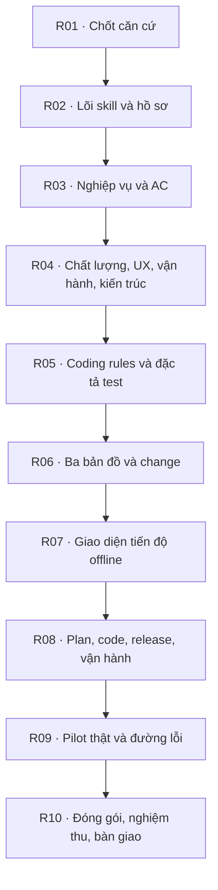

# Kidea — Lộ trình xây dựng, vòng R2

Ngày cập nhật: 2026-09-12.

Lộ trình được chia lại theo yêu cầu Human ngày 2026-09-08: bắt đầu vòng rà soát mới từ đầu, mỗi lần đọc/duyệt chỉ vài đầu mục. **Đã có khung thử skill/helper, chưa có lõi Kidea hoặc code pilot.** R01 đã được duyệt làm căn cứ, R02 triển khai từng lát cắt trong quyền; các phần phụ thuộc chỉ làm sau đúng gate/quyền. Đây là lộ trình xây chính Kidea, không thay mười bước Kidea hướng dẫn trong sản phẩm.

## 1. Chỉ cần đọc phần này ở lượt hiện tại

**Đã khép R02-T03 — hợp đồng approval và 29 mẫu đối chiếu.** Chỉ T04-S01 chờ duyệt cách giữ/nhận diện bản nguồn. Chưa có chức năng approve hoặc snapshot runtime.

### R02-T04-S01-r1 — Làm sao giữ đúng bản bạn đã duyệt? [H]

Task T04 biến nguyên tắc “đối chiếu với bản cũ” thành cách lưu và nhận diện cụ thể. Gói này chỉ chốt bản nguồn; tương thích phiên bản, hồ sơ phát hành và phục hồi lỗi ghi sẽ trình riêng.

**D1 — Giữ bản sao của những file cần làm căn cứ.** Khi trình gói, giữ nguyên nội dung các file liên quan được phép lưu, gắn với đúng gói/bản/phạm vi. Không chụp cả project và không bắt phải commit mới có căn cứ. Ví dụ file đang sửa chưa commit vẫn có bản để so về sau. Bản sao chỉ là lịch sử, không thay tài liệu hiện hành. Đánh đổi là tốn thêm dung lượng; secret/dữ liệu riêng không tự đưa vào hồ sơ hoặc Git. Với nguồn lớn/nhạy cảm, phải có nơi giữ bản được phép; thiếu thì báo thiếu, không giả đã lưu đủ.

**D2 — Dùng mã SHA-256 để nhận ra nội dung khác; AI vẫn đọc để xét ý nghĩa.** Đây là mã tính từ nội dung file. Mã đổi báo cần đối chiếu, không tự kết luận phải duyệt lại: sửa xuống dòng khác với sửa quyền hủy. Phải kiểm tra cả file/đầu vào liên quan và việc nguồn đổi trong lúc đọc; chưa đủ căn cứ thì dừng phần phụ thuộc. Mã không chứng minh Human đã duyệt, không thay kiểm tra quyền hoặc chống người sửa cả hồ sơ.

Bạn duyệt hai lựa chọn này nhé? Bản lưu local chưa chuyển thì máy khác chưa có; đây chưa là backup chống hỏng ổ đĩa. Cách ghi an toàn, lưu giữ/phục hồi và định dạng cuối cùng còn ở gói sau; chưa triển khai cơ chế hoặc chạy pilot.

Nguồn mở thêm: [đề xuất](KIDEA_DESIGN.md#source-version-proposal); [kết quả T03](#r02-t03-result).

## 2. Cách làm mới

### 2.1. Phase → task → subtask

- **Phase:** một nhóm năng lực có thể kiểm chứng tích hợp; cuối phase có Human gate.
- **Task:** một đầu ra cụ thể. **Subtask:** một lát cắt đủ nhỏ để làm, kiểm tra và nếu cần thì duyệt độc lập.
- Gói review tối đa **3 quyết định thực sự độc lập**, thường 2; một quyết định thì chỉ hỏi một. Không giấu sáu lựa chọn trong một dòng “duyệt cả gói”. Mỗi quyết định có đề xuất, hệ quả và link đúng đoạn.
- Theo yêu cầu Human ngày 2026-09-11, mỗi quyết định giải thích dễ hiểu: việc này giải quyết vấn đề gì, đề xuất cách nào, vì sao/lợi ích và đánh đổi, bạn đang duyệt điều gì và điều gì chưa duyệt. Giải nghĩa thuật ngữ bằng lời thường hoặc ví dụ; không dùng mã task hay danh sách từ kỹ thuật thay giải thích.
- Phần bắt buộc Human đọc khoảng 200–350 từ tiếng Việt, tối đa 3 đầu mục quyết định và 3 mục nguồn ngắn. Nếu chưa đủ để hiểu mà phải mở nhiều đoạn dài, chia tiếp trước khi trình; không dùng giới hạn chữ để lược mất rủi ro quan trọng. Nội dung chuyên sâu là phần mở thêm, không là quyết định ngầm.
- AI vẫn đọc đủ nguồn/phụ thuộc, kiểm tra ngữ nghĩa và ảnh hưởng xuyên chuỗi. Bản tóm tắt cho Human không thay đầu vào phân tích của AI.
- Phân rã chi tiết **phase gần nhất**; các phase xa có task/đầu ra/kiểm chứng, subtask ghi **chưa phân rã**, không phải đã hoàn tất. Trước khi mở task ở đó, ghi các subtask, test và gate tại đúng hàng nguồn; không dùng task lớn làm giấy phép thực hiện một lượt.
- Chỉ một subtask triển khai hiện hành. Review độc lập có thể hỗ trợ nhưng không tạo nhiều luồng sửa ngoài kiểm soát. Không cố định số task như cam kết thời gian hoặc phần trăm hoàn thành.

### 2.2. Bắt đầu, review và đóng đơn vị

1. Trước khi bắt đầu hoặc giới thiệu việc kế tiếp: nói rõ task cha giải quyết việc gì, subtask sắp làm tạo đầu ra gì, link đúng mục cần đọc và trạng thái thực tế. Phải phân biệt “chưa bắt đầu”, “đang làm”, “chờ duyệt đầu ra” với “cần quyền thao tác”; nói thẳng Human có cần trả lời ngay không và AI sẽ làm gì tiếp, không chỉ nêu mã S01/S02 rồi dừng mơ hồ. Nếu không cần xác nhận trước thì ghi rõ; nếu cần thì hỏi đúng điều đang thiếu. Kiểm tra dependency, phiên bản, quyền và file dự kiến tác động. Quy tắc được Human làm rõ ngày 2026-09-08.
2. **[H]** là gói dừng chờ Human; **[A]** là thực hiện/kiểm tra trong thiết kế và quyền đã có. Mỗi gói chỉ định ID/r1/r2, nguồn, đề xuất, kết quả/giới hạn và điều chưa duyệt. Góp ý, im lặng hoặc PASS không là approval.
3. Chỉ ghi DONE khi đạt đầu ra/test bắt buộc, đã đồng bộ tài liệu/map/bằng chứng liên quan và dọn tạm. Subtask [H] còn phải có xác nhận Human cho đúng gói hiện hành trước DONE hoặc mở việc phụ thuộc. Task không cần một approval thừa nếu các gate con đã đủ; chỉnh format hoặc test theo đặc tả không tự tạo gate mới.
4. Cuối phase: review tối đa 2 quyết định — chấp nhận kết quả tích hợp/giới hạn và cho mở phase kế theo phạm vi nêu rõ. Không yêu cầu đọc lại từng đoạn đã duyệt; có thay đổi làm sai căn cứ thì chỉ rõ gói bị ảnh hưởng và duyệt lại phần đó.
5. Phát hiện quyết định lớn chưa chốt thì dừng phần phụ thuộc, thêm subtask tại nơi sở hữu và xin Human quyết định trước khi làm. Không hạ chuẩn hoặc đổi scope để làm xanh.

### 2.3. Một nguồn trạng thái và bằng chứng

- Chỉ [sổ công việc](#work-state) giữ trạng thái các subtask đã mở. Subtask đã định nghĩa nhưng chưa có dòng trong sổ mặc định TODO; task chưa phân rã luôn còn việc, không được suy là DONE.
- Trạng thái subtask: TODO → IN_PROGRESS → DONE. Gate có DRAFT/IN_REVIEW/APPROVED và bằng chứng xác nhận riêng trong cùng dòng/đích được dẫn. Có blocker ghi cạnh công việc hiện hành, không đổi thành PASS.
- Trạng thái cha được tính từ con: task chỉ DONE khi mọi con bắt buộc DONE; phase chỉ APPROVED sau kiểm tra tích hợp và xác nhận Human. Không nhập bản sao trạng thái ở từng đoạn mô tả.
- Giữ ID, tên, cha-con và link kết quả của việc đã hoàn thành. Phần “hiện tại” chỉ là con trỏ; review hiện tại là bản trình bày, không là thiết kế hoặc tracker thứ hai.
- Evidence đủ để tái kiểm tra: ID/biến thể, đầu vào thực, bản nguồn/cấu hình/môi trường, quy trình, expected–actual, kết quả và giới hạn. Không xóa log lỗi để giữ riêng lần đạt; không đưa secret/dữ liệu riêng vào repo public.
- Đây là quy ước theo dõi **repo xây Kidea**; schema/runtime và cách Kidea ghi hồ sơ sản phẩm vẫn phải được chốt ở R02.

### 2.4. Dọn file tạm tại mỗi điểm kết thúc

- Khi tạo scratch/cache/bản nháp dùng một lần, ghi **đường dẫn cụ thể + đơn vị sở hữu + mục đích + lúc được xóa** trong bản ghi công việc. Không tạo cả thư mục rỗng để quản lý việc này.
- Trước đóng subtask/task/phase: chuyển kết luận hoặc bằng chứng cần giữ vào nguồn chính thức, kiểm tra không còn link/phụ thuộc hay nhu cầu khôi phục, rồi xóa đúng danh sách file tạm của đơn vị. Dọn cả thư mục chỉ khi đã xác minh đường dẫn và toàn bộ nội dung thuộc danh sách đó.
- Không xóa tài liệu nguồn, test/fixture dùng lại, checkpoint MVP, log lỗi/evidence cần nghiệm thu, bản release/backup còn cần hoặc nội dung do Human tạo chỉ vì đã cũ. Chưa rõ sở hữu/giá trị thì giữ và hỏi, không quét xóa theo tên folder.
- Không tạo bản archive trùng toàn tài liệu sau mỗi review; Git giữ lịch sử, còn bản hiện hành giữ nguồn chuẩn và link bằng chứng cần thiết. Quyền Git không thay đổi vì quy tắc dọn tạm.
- Lần tái lập này đã kiểm tra 15 file tracked và working tree ban đầu sạch: **không có file tạm xác định được để xóa**. `exa-results/`, `references/`, `ideas/` là nguồn/bằng chứng, không phải rác mặc định. `answer.md` tiếp tục latest-only theo yêu cầu riêng của repo.

## 3. Sổ công việc hiện hành

Vòng R2 bắt đầu lại; không chuyển 4 DONE và 1 IN_PROGRESS của vòng cũ sang đây. Các lựa chọn cũ vẫn là căn cứ có lịch sử; chỉ kiểm tra/xác nhận lại đúng phạm vi khi đến lượt, không làm lại nghiên cứu hoặc test không cần thiết.

| Subtask | Trạng thái | Gói/gate | Kết quả, bằng chứng hoặc blocker |
|---|---|---|---|
| R01-T01-S01 | DONE | R01-T01-S01-r1 — APPROVED | Human: “Mình duyệt nhé”; chỉ D1–D2 ở commit 5aa4e5b; [bằng chứng](#r01-t01-result) |
| R01-T01-S02 | DONE | [A] — không có quyết định mới | Đối chiếu DESIGN, danh mục KA và bảng bao phủ; không đổi scope hoặc ngưỡng; [kết quả](#r01-t01-result) |
| R01-T01-S03 | DONE | [A] — không có quyết định mới | Đồng bộ căn cứ approval, kiểm tra tài liệu và dọn tạm; [kết quả](#r01-t01-result) |
| R01-T02-S01 | DONE | R01-T02-S01-r1 — APPROVED | Human: “Tôi duyệt”; chỉ D1–D2 tại b908696; [bằng chứng](#r01-t02-s01-result) |
| R01-T02-S02 | DONE | R01-T02-S02-r1 — APPROVED | Human: “Mình duyệt”; D1–D2 tại 5cf853f; [bằng chứng](#r01-t02-result) |
| R01-T02-S03 | DONE | [A] — không có quyết định mới | Đồng bộ căn cứ/ví dụ, rà case/link/trạng thái và cleanup; [kết quả](#r01-t02-result) |
| R01-T03-S01 | DONE | R01-T03-S01-r1 — APPROVED | Human: “Duyệt nhé”; D1–D2 tại 184c5c1; [bằng chứng](#r01-t03-s01-result) |
| R01-T03-S02 | DONE | R01-T03-S02-r1 — APPROVED | Human: “Duyệt nhé”; D1–D2 tại e138999; [bằng chứng](#r01-t03-s02-result) |
| R01-T03-S03 | DONE | R01-T03-S03-r1 — APPROVED | Human: “Duyệt nhé”; D1–D3 tại 6f2565c; [bằng chứng và khép task](#r01-t03-result) |
| R01-T04-S01 | DONE | R01-T04-S01-r1 — APPROVED | Human: “Duyệt nhé”; D1–D2 tại 4abf90b; [bằng chứng](#r01-t04-s01-result) |
| R01-T04-S02 | DONE | R01-T04-S02-r1 — APPROVED | Human: “Tôi nhất trí.”; D1–D3 tại c8dace9; [bằng chứng](#r01-t04-s02-result) |
| R01-T04-S03 | DONE | R01-T04-S03-r1 — APPROVED | Human: “Duyệt nhé”; D1–D3 tại b0524f5; [bằng chứng và khép task](#r01-t04-result) |
| R01-T05-S01 | DONE | R01-T05-S01-r1 — APPROVED | Human: “Duyệt nhé”; D1–D2 tại 7df435b; [bằng chứng G1](#r01-t05-s01-result) |
| R01-T05-S02 | DONE | R01-T05-S02-r3 — APPROVED | Human “mình nhất trí nhé” sau phần làm rõ tại 17df9e1; G2 và hai nguyên tắc MVP/bugfix, không toàn ma trận Future/G4/G6; [kết quả](#r01-t05-result) |
| R01-T05-S03 | DONE | [A] — đồng bộ phần được duyệt | DESIGN, KA-17/19/24, R06/R08/R09 và giới hạn quyền; [kết quả](#r01-t05-result) |
| R01-T06-S01 | DONE | R01-T06-S01-r3 — APPROVED | Human: “Tôi đồng ý với các đề xuất của bạn nhé” sau answer tại ca8e7faf; chính sách master/local, AI DEV/Human PROD, template theo project và nhánh bảo trì; [kết quả đúng phạm vi](#r01-t06-s01-result) |
| R01-T06-S02 | DONE | R01-T06-S02-r1 — APPROVED | Human “Tôi duyệt nhé” sau giải thích tại a1d8eb8; lưu việc dở theo mốc và phục hồi lỗi ghi local có giới hạn; [kết quả](#r01-t06-result) |
| R01-T06-S03 | DONE | [A] — đồng bộ đúng phần đã duyệt | Đồng bộ DESIGN/caller/case và kiểm tra tài liệu, không thay G2/QUALITY hoặc chạy pilot; [kết quả](#r01-t06-result) |
| R01-T07-S01 | DONE | R01-T07-S01-r1 — APPROVED | Human “Duyệt nhé” sau answer b820a33; cách đánh số sản phẩm và giới hạn đúng gói; [kết quả](#r01-t07-s01-result) |
| R01-T07-S02 | DONE | R01-T07-S02-r1 — APPROVED | Human “Duyệt nhé” sau answer 3ea08d1; D1–D2 về version thành phần/tag, không toàn release; [kết quả](#r01-t07-s02-result) |
| R01-T07-S04 | DONE | R01-T07-S04-r1 — APPROVED | Human “Mình duyệt nhé.” sau answer 76b8a5c; D1–D2 về hồ sơ release/revision và từng lần triển khai; [kết quả](#r01-t07-result) |
| R01-T07-S03 | DONE | [A] — đồng bộ và rà soát | Khép G5/G6, sửa caller/case lệch, kiểm tra toàn chuỗi tài liệu; không đổi ngưỡng hoặc mở task tiếp theo; [kết quả](#r01-t07-result) |
| R01-T08-S01 | DONE | R01-T08-S01-r1 — APPROVED | Human “Duyệt nhé” sau answer 1f67790; đồng bộ đúng phạm vi case/tiêu chí, chưa chạy; [kết quả](#r01-t08-s01-result) |
| R01-T08-S02 | DONE | R01-T08-S02-r1 — APPROVED | Human “à tôi hiểu rồi, duyệt nhé” sau giải thích 7a2381b; phạm vi/cách chấm đã đồng bộ, chưa chạy; [kết quả](#r01-t08-s02-result) |
| R01-T08-S03 | DONE | R01-T08-S03-r1 — APPROVED | Human “tôi duyệt” sau answer b42032c; đủ ba nhóm T08 và đồng bộ, chưa chạy; [kết quả](#r01-t08-result) |
| R01-T09-S01 | DONE | R01-T09-S01-r1 — APPROVED | Human “duyệt nhé” sau answer 6cb8d3b; đồng bộ hồ sơ/hiệu lực, chưa chạy; [kết quả](#r01-t09-s01-result) |
| R01-T09-S02 | DONE | R01-T09-S02-r1 — APPROVED | Human “duyệt” sau answer aabc9ec; đồng bộ chính sách đo/ngưỡng, chưa đo; [kết quả](#r01-t09-s02-result) |
| R01-T09-S03 | DONE | R01-T09-S03-r1 — APPROVED | Human “duyệt nhé” sau giải thích 063bf73; đồng bộ chính sách tổ chức thử, chưa chạy; [kết quả](#r01-t09-result) |
| R01-T10-S01 | DONE | [A] — đồng bộ căn cứ | Đồng bộ bốn nguồn, phân biệt chính sách được duyệt với chi tiết chờ task sở hữu; [kết quả](#r01-t10-check) |
| R01-T10-S02 | DONE | [A] — rà tích hợp tài liệu | Đối chiếu nghĩa vụ/caller, link, trạng thái và cleanup; chưa kiểm chứng skill; [kết quả](#r01-t10-check) |
| R01-T10-S03 | DONE | R01-T10-S03-r1 — APPROVED | Human “Duyệt nhé” sau answer b666308; chấp nhận căn cứ và cho mở R02 từng phần; [kết quả](#r01-result) |
| R02-T01-S01 | DONE | R02-T01-S01-r1 — APPROVED | Human “duyệt” sau answer 485eb46; JavaScript/Node 24 LTS và khung tối giản, chưa cài; [kết quả](#r02-t01-s01-result) |
| R02-T01-S02 | DONE | R02-T01-S02-r1 — APPROVED | Human “duyệt” sau answer fb3bf51; D1–D3 đúng phạm vi; [kết quả](#r02-t01-scaffold-result) |
| R02-T01-S03 | DONE | R02-T01-S03-r1 — APPROVED | PyYAML local/validator đạt và 16 test đạt; Human “Ok nhé” sau answer 8e5f90c chấp nhận giữ hai thư mục rỗng không chặn khép T01; [kết quả](#r02-t01-scaffold-result) |
| R02-T01-S04 | DONE | [A] — kiểm chứng trong phạm vi S02 | Bằng chứng phiên mới nạp/gọi đã có; kiểm tra hash còn khớp, giữ giới hạn thử sơ bộ và ngoại lệ cleanup được Human chấp nhận; [kết quả](#r02-t01-scaffold-result) |
| R02-T02-S01 | DONE | R02-T02-S01-r1 — APPROVED | Human “Duyệt” sau answer 0065415; D1–D2 mã/cây công việc và mức phân rã, đã đồng bộ/đối chiếu; [kết quả](#r02-t02-s01-result) |
| R02-T02-S02 | DONE | R02-T02-S02-r1 — APPROVED | Human “Duyệt nhé” sau giải thích 2264faa; D1–D2 của gói 8d840f0 về định dạng/nơi sở hữu, đã đồng bộ; [kết quả](#r02-t02-s02-result) |
| R02-T02-S05 | DONE | R02-T02-S05-r1 — APPROVED | Human “Duyệt nhé” sau giải thích 0d69201; D1–D2 của gói 4816342, đã đồng bộ bản phát triển/triển khai và dữ liệu thiếu; [kết quả](#r02-t02-s05-result) |
| R02-T02-S06 | DONE | R02-T02-S06-r1 — APPROVED | Human “Duyệt nhé” sau answer 207cb5d; bộ trường/kiểu và xử lý thiếu/sai đã đồng bộ; [kết quả](#r02-t02-result) |
| R02-T02-S03 | DONE | [A] — mẫu theo hợp đồng đã duyệt | 4 file baseline và 41 recipe/expected, tạo biến thể trong bộ nhớ; không chạy validator; [bằng chứng](tests/evidence/r02-t02.md) |
| R02-T02-S04 | DONE | [A] — đối chiếu cấu trúc/nghĩa và caller | Rà mẫu/case, 21 Ref baseline, recipe chỉ đọc và 16 test khung đạt; không tính KA PASS; [kết quả](#r02-t02-result) |
| R02-T03-S01 | DONE | R02-T03-S01-r1 — APPROVED | Human “Duyệt” sau answer 67b13b7; D1–D2 phản hồi đúng gói và N/A có căn cứ, đã đồng bộ; [kết quả](#r02-t03-s01-result) |
| R02-T03-S02 | DONE | R02-T03-S02-r1 — APPROVED | Human “Duyệt” sau answer 39d9344; D1–D2 căn cứ/hiệu lực đã đồng bộ; [kết quả](#r02-t03-result) |
| R02-T03-S03 | DONE | [A] — mẫu theo hợp đồng | 29 tình huống giả trước/sau và expected; dữ liệu review cụ thể hóa, không đổi schema r1; [bằng chứng](tests/evidence/r02-t03.md) |
| R02-T03-S04 | DONE | [A] — đối chiếu tĩnh | Rà KA-05–08/caller/schema, catalog chỉ đọc và 16 test khung đạt; chưa chạy expected bằng Kidea; [kết quả](#r02-t03-result) |
| R02-T04-S01 | IN_PROGRESS | R02-T04-S01-r1 — IN_REVIEW | Chỉ trình cách giữ bản nguồn và mã đối chiếu; chưa triển khai; [gói hiện hành](#review-current) |

R01 đủ 31 subtask DONE và gate phase APPROVED theo [xác nhận](#r01-result). R02-T01 đủ bốn subtask DONE, R02-T02 đủ sáu subtask DONE, T03 đủ bốn subtask DONE; chỉ R02-T04-S01 đang IN_PROGRESS/IN_REVIEW, các subtask R02 khác mặc định TODO. R02 chưa khép phase; R03–R10 chưa mở/chưa phân rã. Không có lõi/pilot mới; kết quả khung không được cộng thành nghiệm thu KA hoặc ổn định AI.

### Kết quả R01-T01 — ngày 2026-09-08

- S01: Human phản hồi “Mình duyệt nhé” ngay sau gói D1–D2 tại [commit 5aa4e5b](https://github.com/Kynderis/kidea/blob/5aa4e5b5a69b9305821e43bb5d4b3151ee2a271d/KIDEA_ROADMAP.md#review-current). Chỉ xác nhận đích bản đầu đầy đủ và ranh giới đã trình; không duyệt công nghệ, pilot, Git G1–G6, QUALITY, runtime/schema hoặc cấp quyền thao tác.
- S02: đối chiếu DESIGN mục 1.1, bảng bao phủ roadmap và danh mục KA: sáu hành động → R02/R06/R07; mười bước → R03–R05/R08/R09; ba bản đồ/change → R06/R09; rules/view/cài/giới hạn → R05/R07/R10. Không phát hiện nghĩa vụ bị cắt; chưa cần sửa case/ngưỡng hoặc nghiên cứu lại nền tảng vì D1–D2 giữ hướng đang có.
- S03: DESIGN dẫn về đúng bằng chứng approval, sổ công việc đóng đủ ba subtask. Kiểm tra link/anchor liên quan và diff; không có file tạm tạo ra hoặc untracked cần xóa. Đây là kiểm chứng tài liệu, không phải test Kidea hoặc đóng phase R01.
- Tại thời điểm đóng R01-T01, việc tiếp theo là R01-T02-S01; trạng thái hiện hành xem sổ công việc, không giữ bản sao trong kết quả lịch sử này.

### Kết quả R01-T02-S01 — ngày 2026-09-08

- Human: “Tôi duyệt”, đối với D1–D2 trong [gói tại b908696](https://github.com/Kynderis/kidea/blob/b908696144e90054738896d0ffc49b8177cc35aa/KIDEA_ROADMAP.md#review-current): tài liệu sản phẩm ngoài .kidea; hồ sơ điều phối/review trong .kidea; cùng một repo.
- DESIGN dẫn về xác nhận này. Nội dung ranh giới không đổi so với đề xuất, nên không cần sửa case hoặc cấu trúc file; kiểm tra anchor/link và diff. Không có file tạm tạo ra hoặc cần xóa, không chuyển file project thật.
- Xác nhận S01 tại thời điểm đó không bao gồm S02/S03, schema, repo pilot hoặc quyền Git/cài/deploy. Tiến trình sau đó nằm ở sổ công việc, không nhập trạng thái hiện hành vào bản ghi lịch sử này.

### Kết quả R01-T02 — ngày 2026-09-08

- S02: Human “Mình duyệt” sau [gói D1–D2 tại 5cf853f](https://github.com/Kynderis/kidea/blob/5cf853fbc678f164f7728ddfba8922a831b3cc3c/KIDEA_ROADMAP.md#review-current): một nguồn có hiệu lực cho từng thông tin; đọc đủ nguồn liên quan và chỉ ghi đúng đích/phạm vi được phép. Không chốt schema/fingerprint hoặc cấp quyền Git/cài/deploy.
- S03: DESIGN mục 5 gắn căn cứ approval và ví dụ rule → review → tiến trình; đối chiếu INDEX/work, init/status/resume/view và README tham khảo. KA-03/07/09/10/12/25/26 đã mô tả đúng nguồn/ghi/stale nên không cần đổi case; KQ-02/06 chỉ được kiểm tra tính nhất quán, không duyệt ngưỡng hoặc toàn bộ QUALITY.
- Kiểm tra Markdown/link/anchor, sáu subtask R01-T01/T02 đã DONE, các task sau chưa mở; không có thay đổi code, schema, dữ liệu pilot hoặc cấu trúc project. Không phát hiện khoảng lệch cần mở lại S01/S02. Đây là kiểm chứng tài liệu, không phải kiểm thử hành vi Kidea.
- Không tạo scratch hoặc file untracked cần dọn; giữ nguyên nguồn tham khảo, báo cáo nghiên cứu và bằng chứng. R01-T02 đủ ba subtask để đóng; phase R01 vẫn chưa được duyệt.

### Kết quả R01-T03-S01 — ngày 2026-09-08

- Human: “Duyệt nhé”, đối với D1–D2 của [gói tại 184c5c1](https://github.com/Kynderis/kidea/blob/184c5c1465a09b8b8c943d16a308a27bf8f2f9d4/KIDEA_ROADMAP.md#review-current): Kidea host Windows 11 x64 local; backend sản phẩm C++20, Ubuntu 24.04 LTS amd64 làm nền kiểm chứng.
- Giữ phân biệt runtime/helper Kidea với ngôn ngữ backend, build/test Linux với xác nhận bản phát hành trên Ubuntu đích. Không duyệt công cụ cụ thể, framework/database, web/mobile hoặc quyền cài/nâng cấp/Git/deploy.
- Đồng bộ căn cứ trong DESIGN, kiểm tra liên kết/trạng thái và không có file tạm cần xóa. Chưa kiểm tra lại phiên bản, chạy build hoặc chứng nhận hỗ trợ thực tế. S01 DONE không đóng R01-T03 hoặc phase R01.

### Kết quả R01-T03-S02 — ngày 2026-09-08

- Human: “Duyệt nhé”, đối với D1–D2 của [gói tại e138999](https://github.com/Kynderis/kidea/blob/e138999214f59f0dfe5553f76b968bfd9c9c0a19/KIDEA_ROADMAP.md#review-current): SvelteKit + TypeScript với prerender/SSR và cập nhật phía trình duyệt; SEO xuyên mười bước, gate thiết kế ở bước 4 và sẵn sàng ở bước 10 trước phát hành công khai.
- Giữ nghiệp vụ ở backend C++, ranh giới nội dung công khai/riêng tư và N/A có Human duyệt; không cam kết index/thứ hạng/AI trích dẫn. Không duyệt phiên bản mới, CDN, ngưỡng hiệu năng, mobile hoặc quyền cài/deploy.
- Đồng bộ căn cứ trong DESIGN, kiểm tra liên kết/trạng thái và diff; không tạo file tạm, chưa chạy build/benchmark hoặc xác minh lại phiên bản. S02 DONE không đóng R01-T03 hoặc phase R01.

### Kết quả R01-T03 — ngày 2026-09-08

- S03: Human “Duyệt nhé” sau [gói D1–D3 tại 6f2565c](https://github.com/Kynderis/kidea/blob/6f2565c300aae37eb9001be73da4c1367fca1f49/KIDEA_ROADMAP.md#review-current): Android Kotlin/Compose và iOS Swift/SwiftUI native, code riêng; kiểm tra tương thích trước chuẩn bị môi trường, Mac/Xcode/iPhone khi đến phần iOS và chọn thiết bị thử trước R09. Không duyệt phiên bản mới, OS tối thiểu, ngưỡng hiệu năng hoặc cấp quyền cài/nâng/mua/signing/deploy.
- Đối chiếu đủ S01–S03 với DESIGN: host Kidea khác runtime sản phẩm; backend giữ nghiệp vụ; web render/SEO giữ ranh giới riêng tư; native và kiểm chứng máy thật không bị cắt. R05-T02–T05, R09 và KA-27/30 giữ nghĩa vụ kiểm chứng tương ứng; chưa có thay đổi cần mở lại các gói đã duyệt.
- Đồng bộ căn cứ mobile trong DESIGN, kiểm tra link/anchor/trạng thái và diff. Ba subtask R01-T03 đủ điều kiện DONE; phase R01 vẫn chưa được duyệt. Không chạy build, xác minh lại phiên bản hoặc chứng nhận tương thích thực tế.
- Không tạo file tạm hoặc có untracked cần dọn. Giữ nguyên nghiên cứu, nguồn và evidence cũ; không thay case/ngưỡng, không tạo repo hoặc code pilot.

### Kết quả R01-T04-S01 — ngày 2026-09-08

- Human “Duyệt nhé” sau [gói D1–D2 tại 4abf90b](https://github.com/Kynderis/kidea/blob/4abf90b31c8c3a8a9b8804433064327554344c15/KIDEA_ROADMAP.md#review-current): bài toán đăng ký workshop và bốn nhóm MVP cùng các biên nghiệp vụ đã trình; native hai màn hình, admin/vận hành trên web, dữ liệu giả. Hai đăng ký toàn hệ thống và hủy khi PAUSED vẫn là bài thử change sau này, không thuộc MVP ban đầu.
- Không duyệt seed cụ thể, cách triển khai event/API/database, nơi giữ hồ sơ hoặc quyền tạo repo/cài/deploy. S02/S03 được rà riêng; không coi approval phạm vi là đã xây ứng dụng.
- Đồng bộ căn cứ trong DESIGN; đối chiếu PIL-F01–F04, R09-T02–T10 và các biên MVP/change, không phát hiện thay đổi cần sửa case. Kiểm tra link/trạng thái/diff; không tạo file tạm hoặc code, chưa chạy kiểm thử pilot. S01 DONE không đóng task R01-T04.

### Kết quả R01-T04-S02 — ngày 2026-09-08

- Human mở đầu “Tôi nhất trí.” sau [gói D1–D3 tại c8dace9](https://github.com/Kynderis/kidea/blob/c8dace973cd878147dbf19bc9d44f32b756f55e9/KIDEA_ROADMAP.md#review-current): chuỗi rule/dữ liệu/event/số chỗ/client/monitoring, các đường lỗi và thứ tự pilot đã trình. Không duyệt database, công cụ event, thuật toán, ngưỡng đo hoặc quyền thực thi.
- Cùng phản hồi, Human hỏi về dùng Thuận Thiên làm pilot. Tại thời điểm đó chỉ ghi đề xuất, chưa chuyển approval workshop sang nghiệp vụ mới hoặc đổi kế hoạch triển khai. Sau đó Human yêu cầu giữ workshop; [trao đổi thay pilot đã đóng](#pilot-workshop-confirmation). Trạng thái S03 xem sổ công việc.
- Đồng bộ căn cứ trong DESIGN, đối chiếu chuỗi và thứ tự R09, kiểm tra link/trạng thái/diff. Không code/chạy pilot, không tạo file tạm. S02 DONE không đóng R01-T04 hoặc phase R01.

### Xác nhận tiếp tục pilot workshop — ngày 2026-09-08

- Human: “Thế thôi dùng tiếp pilot nhé, Thuận thiên để sau đi.”; yêu cầu đồng bộ lại Kidea nếu đã chuyển hướng, đồng thời nói rõ không cập nhật repo Thuận Thiên trên GitHub.
- Đề xuất ở cb56f04 chưa được duyệt hoặc áp dụng: chỉ thêm nội dung trao đổi vào DESIGN/ROADMAP và answer.md. Nay đóng đề xuất, bỏ con trỏ trao đổi hiện hành, giữ workshop là pilot đầy đủ theo S01/S02 đã duyệt; S03 tiếp tục là việc kế tiếp chưa bắt đầu.
- Đối chiếu ma trận nền tảng, R05/R09, ACCEPTANCE và QUALITY: chưa từng chuyển sang Thuận Thiên nên không cần hoàn tác hoặc sửa các phần này. Không đổi công nghệ, nghiệp vụ, case, ngưỡng hoặc quyền đã có; giữ nguyên bằng chứng approval.
- Chỉ cập nhật ba file KIDEA_DESIGN.md, KIDEA_ROADMAP.md và answer.md trong repo Kidea. Không sửa repo Thuận Thiên local/remote, không tạo/xóa file tạm, không triển khai pilot.

### Kết quả R01-T04 — ngày 2026-09-08

- S03: Human “Duyệt nhé” sau [gói D1–D3 tại b0524f5](https://github.com/Kynderis/kidea/blob/b0524f5464e5953d9d01790c54599f69465d546d/KIDEA_ROADMAP.md#review-current): repo workshop riêng ở root local đã trình, docs/.kidea/source cùng repo; lab phi production với dữ liệu giả và giới hạn cô lập/khôi phục; ngân sách phát sinh 0 đồng. Không cấp quyền tạo/ghi repo, Git, cài/nâng hoặc deploy.
- Đối chiếu S01–S03 với DESIGN, R03-T01, R09-T01–T14 và KA-01/04/12/27/28/30: giữ đủ bài toán, chuỗi lỗi, native và ranh giới bằng chứng. Seed cụ thể, máy đích, quyền thực thi và N/A cho index thật vẫn thuộc gói chuẩn bị pilot tương ứng; chưa duyệt kèm hoặc coi đã test.
- Đồng bộ root và căn cứ approval trong DESIGN cùng bảng đối chiếu ở thời điểm đó; kiểm tra liên kết/trạng thái/diff, đủ ba subtask R01-T04 DONE. Phase R01 chưa được duyệt; chưa tạo repo/thư mục pilot, chọn remote, chạy ứng dụng hoặc thay quyền Git. Không cần sửa case/ngưỡng vì các quyết định giữ phạm vi đã trình.
- Không tạo file tạm hoặc untracked cần dọn; giữ nguồn và bằng chứng cũ. Thuận Thiên tiếp tục ngoài công việc hiện hành.

### Kết quả R01-T05-S01 — ngày 2026-09-08

- Human “Duyệt nhé” sau [gói D1–D2 tại 7df435b](https://github.com/Kynderis/kidea/blob/7df435bf59bf82882c04941b73f7169b7e97c6d6/KIDEA_ROADMAP.md#review-current): một nhánh tích hợp và một branch làm việc hiện hành theo thay đổi có phạm vi rõ, không thêm develop/nhánh thường trực; chỉ dùng worktree khi cần giữ bản/thư mục riêng để kiểm tra và sửa. G1 là cách tổ chức, không cấp quyền Git hoặc duyệt G2–G6.
- Đồng bộ G1 trong DESIGN và các con trỏ từng ghi toàn bộ G1–G6 chưa duyệt; giữ nguyên điều kiện quyền ở KA-12 và toàn bộ ngưỡng QUALITY. Chưa tạo/chuyển branch, worktree hoặc repo pilot; không kiểm chứng thao tác Git thực tế trong pilot.
- Kiểm tra liên kết/trạng thái/diff và không có file tạm cần dọn. S01 DONE không đóng R01-T05; S02 tiếp tục rà điều kiện tích hợp.

### Kết quả R01-T05 — ngày 2026-09-08

- Human “mình nhất trí nhé” ngay sau [giải thích tại 17df9e1](https://github.com/Kynderis/kidea/blob/17df9e18a58914e3f82088edb654178779721b4c/answer.md). Khép trao đổi G2-r3: test theo task cộng lượt cuối toàn dự án sau từng Feature, kiểm chứng bản tích hợp/build/bản chạy; xác nhận hai điểm bổ sung về cập nhật cùng kế hoạch MVP và chọn nền/đưa bản vá production về master rồi Feature.
- Không suy thành approval toàn ma trận Future, toàn G3/G4/G5/G6, ngưỡng QUALITY hoặc quyền Git/deploy. Các nguyên tắc vừa chốt là ràng buộc đầu vào cho gói sau, không phải lý do yêu cầu duyệt lại chúng.
- S03: đồng bộ DESIGN mục 7.1, KA-17/19/24, R06-T07, R08-T02 và R09-T04/T09/T10; giữ 30 họ case, bổ sung biến thể kiểm chứng đúng nghĩa đã chốt. Rà liên kết/trạng thái/diff; đây là kiểm chứng tài liệu, chưa chạy các case hoặc pilot.
- Tại thời điểm đó, đủ ba subtask R01-T05 DONE và R01-T06-S01 đang làm. Không tạo hoặc xóa file tạm; không thao tác repo pilot/Thuận Thiên. Phase R01 chưa được duyệt; tiến trình hiện hành xem sổ công việc.

### Bổ sung phạm vi phát hành/vận hành — ngày 2026-09-10

- Human: “Mình nhất trí với đề xuất của bạn, tiếp theo cần làm gì”, ngay sau [đề xuất tại 096ad671](https://github.com/Kynderis/kidea/blob/096ad6719f1c980cefa085c3073ffd16ed90ca02/answer.md). Phê duyệt ba nhóm và thứ tự ưu tiên; nguồn yêu cầu hiện hành là [DESIGN mục 1.1a](KIDEA_DESIGN.md#production-capabilities), không phải bản answer mới nhất hoặc báo cáo nghiên cứu.
- Đã đồng bộ nghĩa vụ vào DESIGN, các task sở hữu R02–R10 và các họ KA hiện có; không thêm tracker, không mở subtask triển khai song song. Tại thời điểm đó, R01-T06-S01 đang IN_PROGRESS / IN_REVIEW, trình r2 về quyền; approval phạm vi này không duyệt G3–G6, schema/công cụ/QUALITY hoặc phase R01. Tiến trình sau đó xem sổ công việc.
- Năng lực cơ bản phải có luồng thực thi và kiểm chứng trên môi trường được phép; phần tự động hóa/adapter/A-B/portal nâng cao mở theo nhu cầu, không tự chứng nhận từ template. Giữ web/native/C++ và G2; pilot vẫn lab dữ liệu giả, ngân sách 0 đồng, chưa tạo/cài/chạy hoặc cấp quyền mới.
- Các biến thể nghiệm thu diễn giải phạm vi đã chốt, chưa chạy hoặc chốt ngưỡng; R01-T07/T08/T09 và gate tại task sở hữu vẫn cụ thể hóa hợp đồng/cách đo trước thực thi. Chỉ cập nhật tài liệu xây Kidea và bản answer theo quyền riêng của repo.
- Tham khảo trước quyết định: [kiến trúc quản lý toàn chuỗi](exa-results/kidea-end-to-end-control-2026-09-08.md), [giải thích rollout/A-B/vận hành](exa-results/kidea-production-rollout-ab-explained-2026-09-08.md). Các đề xuất công cụ/chi tiết khác trong nghiên cứu không tự được duyệt theo phạm vi lần này.

### Kết quả R01-T06-S01 — ngày 2026-09-11

- Human: “Tôi đồng ý với các đề xuất của bạn nhé”, ngay sau [answer tại ca8e7faf](https://github.com/Kynderis/kidea/blob/ca8e7faf5f85b713ca4a3870c44e2febcc0f38f3/answer.md), xác nhận phần tư vấn và hai điểm của `R01-T06-S01-r3`. Phản hồi này khép các điểm còn mở sau lần đồng ý từng phần với [answer 87b3ba7](https://github.com/Kynderis/kidea/blob/87b3ba70eb6083a780a411537fbce5446ae6a777/answer.md); không yêu cầu duyệt lại các nguyên tắc đã chốt.
- Chính sách được duyệt: một master phát triển chính, không branch riêng cho mỗi Feature; kiểm chứng/build được điều khiển từ local bằng bộ lệnh chuẩn, chưa cần dịch vụ CI; quyền kỹ thuật thường lệ theo project, AI deploy DEV và Human trực tiếp chạy PROD với đúng artifact/config/target và bộ script đã xác minh. Local không miễn Ubuntu/Mac/thiết bị đích; giữ nguyên lượt cuối toàn dự án mỗi Feature, Human gate, kiểm soát credential và xác nhận bản thực chạy. Job/cảnh báo cần thiết hoạt động độc lập phiên AI/laptop.
- Template và công cụ tùy project nhưng không bỏ điều kiện chung hoặc tạo nguồn dữ liệu thứ hai. Master phù hợp thì vá master; cần tách phần chưa phát hành thì tạo nhánh bảo trì từ đúng production, kế thừa các patch hợp lệ, không sửa tag đã phát hành. Mỗi fix có kết luận/bằng chứng trên master; hết hỗ trợ mới xét dọn nhánh với quyền phù hợp và vẫn giữ source/tag/artifact/evidence/phục hồi cần thiết.
- Phạm vi đồng bộ: DESIGN G1/G2/G3, resume/change và cấu hình theo project; các task sở hữu trong roadmap và case liên quan. QUALITY chỉ thêm con trỏ tới G2, không đổi ngưỡng hoặc trạng thái chưa duyệt. Chỉ đổi tổ chức/vị trí kiểm chứng, không giảm nghĩa vụ chất lượng G2, sáu năng lực phát hành/vận hành, mười bước, ma trận nền tảng hoặc 30 họ KA. Đây là đồng bộ và kiểm tra tài liệu, không phải test script/skill/pilot.
- Tại thời điểm đó S01 hoàn tất; G4 checkpoint/phục hồi tiếp tục ở S02, S03 chưa DONE; approval S01 không khép toàn G4/G5/G6, QUALITY, ma trận Future hoặc phase R01. Chưa tạo/cài runtime, script/template thực thi hoặc repo pilot; chưa cấp quyền Git/deploy cho project cụ thể, xóa branch, dùng credential hay tác động production. Không tạo/xóa file tạm; lịch sử quyết định G1/G2 trước đây giữ đúng thời điểm, nguồn chính sách hiện hành ở DESIGN.

### Kết quả R01-T06 — ngày 2026-09-11

- Human “Tôi duyệt nhé” ngay sau [giải thích hai điểm tại a1d8eb8](https://github.com/Kynderis/kidea/blob/a1d8eb8b21a5230bea9b8c7be23cd0c9ed3183d8/answer.md), xác nhận D1–D2 của [gói S02-r1 tại b8e5381](https://github.com/Kynderis/kidea/blob/b8e53815e9b99f4cff7b7378a9755fbc8860f7ae/KIDEA_ROADMAP.md#review-current). G4: Kidea lưu file/điểm tiếp tục theo mốc; chỉ tự phục hồi bước ghi lỗi local trong quyền, có bản trước đã xác minh và không đè thay đổi khác. Không mở quyền reset lịch sử, hoàn tác commit chia sẻ, migration/database/production.
- S03: đồng bộ [DESIGN G4](KIDEA_DESIGN.md#git-checkpoint), resume/change/quyền và các con trỏ trạng thái; KA-10/11/12 cùng task sở hữu R02/R06/R09/R10 giữ đúng điều kiện đã duyệt. Giữ 30 họ case; không đổi nghĩa vụ G2, ngưỡng/trạng thái QUALITY, nền tảng hoặc phạm vi pilot.
- Đã đối chiếu liên kết, trạng thái, diff và phạm vi cập nhật; đây là kiểm tra tài liệu, chưa thực thi case hoặc thử khôi phục file. Không tạo/xóa file tạm, không cài skill hoặc thao tác project pilot/Thuận Thiên.
- Đủ S01/S02/S03 của T06 DONE; chuyển sang T07-S01. Schema/cơ chế ghi/backup và kiểm chứng lỗi còn thuộc R02; G5/G6, cách đo/case chi tiết, ma trận Future và phase R01 chưa được duyệt. Nguồn chính sách hiện hành ở DESIGN; kết quả này không cấp quyền thực thi cho một project cụ thể.

### Kết quả R01-T07-S01 — ngày 2026-09-11

- Human “Duyệt nhé” ngay sau [answer tại b820a33](https://github.com/Kynderis/kidea/blob/b820a33a82c411f1ab86ceac10b0619bbbde25d3/answer.md), xác nhận D1 của S01-r1: mặc định ba số lớn.nhỏ.vá cho sản phẩm theo hợp đồng tương thích rõ, cho phép giữ quy ước project phù hợp; 0.x.y không miễn kiểm chứng.
- Đồng bộ [DESIGN](KIDEA_DESIGN.md#product-version), ca version/tương thích tại KA-28 và các task sở hữu. Giữ nguyên số gói thực của thành phần không đổi; không buộc build lại chỉ để cùng số sản phẩm. G2, QUALITY, 30 họ KA, ma trận và quyền pilot giữ nguyên.
- Chỉ kiểm tra tài liệu/link/trạng thái/diff; không tạo version/tag, chạy build/deploy hoặc xóa file tạm. S01 DONE, trình S02 về version từng nền/tag; phần hồ sơ release ở S04 trước S03. Chưa duyệt toàn G5/G6 hoặc phase R01.

### Kết quả R01-T07-S02 — ngày 2026-09-11

- Human “Duyệt nhé” sau [answer tại 3ea08d1](https://github.com/Kynderis/kidea/blob/3ea08d162c2b50d94ac24a135fb6a666ac667f35/answer.md), xác nhận D1–D2 của S02-r1. Thành phần phát hành độc lập có version riêng và nhận diện lần build/gói; native theo quy định nền tảng. Tag sản phẩm mặc định `v<version>`, chỉ tạo với bản Human chọn, đủ kiểm chứng/quyền, không dời tag đã phát hành.
- Đồng bộ [DESIGN](KIDEA_DESIGN.md#component-version-tags), KA-28 và R08; đối chiếu trách nhiệm profile ở R05, không coi tag/version là gói build hoặc trạng thái production. Giữ 30 họ case, G2/QUALITY và ma trận; các case chưa chạy.
- S02 DONE, mở S04 trình tổ chức hồ sơ release; S03 chưa khép. Chỉ kiểm tra tài liệu/link/trạng thái/diff, không tạo tag/branch hoặc chạy build/deploy; không thêm/xóa file tạm hoặc cấp quyền project/pilot. Phần G6, schema và toàn phase R01 chưa được duyệt.

### Kết quả R01-T07 và rà soát tổng quan — ngày 2026-09-11

- Human “Mình duyệt nhé.” sau [answer tại 76b8a5c](https://github.com/Kynderis/kidea/blob/76b8a5c855d59cf01b23d93d3ee29a0fdc488b8a/answer.md), xác nhận D1–D2 của [S04-r1 cùng bản](https://github.com/Kynderis/kidea/blob/76b8a5c855d59cf01b23d93d3ee29a0fdc488b8a/KIDEA_ROADMAP.md#review-current): một hồ sơ gốc/revision cho release và bản ghi mỗi lần triển khai, giữ cả lỗi/chưa xác nhận. [DESIGN G6](KIDEA_DESIGN.md#release-records) là nguồn chính sách hiện hành.
- S03 đối chiếu toàn G5/G6 với G1–G4 và phạm vi vận hành đã duyệt: version/tag, exact artifact/config/schema/script, thứ tự/tương thích, điều kiện dừng, hotfix/rollback/restore, quyền và xác nhận thực tế đã có nơi thiết kế/kiểm chứng. Schema/cơ chế cụ thể vẫn thuộc task sở hữu; không cần approval lặp cho nguyên tắc đã chốt.
- Đọc trọn DESIGN/ROADMAP/ACCEPTANCE/QUALITY, rà nguồn approval và caller. Sửa mô tả MVP dễ gợi luồng pause riêng; làm rõ hồ sơ release lập trước triển khai; sửa KA-19/R09-T10 để bản kết hợp hotfix đổi đầu vào vẫn chạy toàn lượt G2. Làm rõ R05 chưa chứng minh bước triển khai/vận hành thật; bỏ việc đã khép khỏi danh sách quyết định còn mở.
- Đồng bộ nhận diện hồ sơ/revision/từng lần triển khai, retry và dữ liệu chia sẻ vào task/case liên quan; giữ 30 họ KA và toàn bộ nội dung/ngưỡng/trạng thái đề xuất QUALITY. Các case chưa chạy; chuẩn G2 không đổi. [Bảng đối chiếu](#overall-review) chỉ dẫn tới nguồn/owner, không thêm tracker hoặc thiết kế thứ hai.
- Kiểm tra Markdown/link/anchor, task/subtask, trạng thái, Mermaid và diff. Đủ S01/S02/S04/S03 của T07 DONE; không tạo/xóa file tạm, skill/runtime hoặc pilot, không thao tác Thuận Thiên/PROD. Dừng trước T08 theo yêu cầu Human; R01 chưa APPROVED, không tự mở phase kế.

### Kết quả R01-T08-S01

- Human “Duyệt nhé” sau [answer 1f67790](https://github.com/Kynderis/kidea/blob/1f677909935d92bc94c210d32e52bd6e8cd24596/answer.md), xác nhận hai điểm của [gói S01-r1](https://github.com/Kynderis/kidea/blob/1f677909935d92bc94c210d32e52bd6e8cd24596/KIDEA_ROADMAP.md#review-current): phạm vi KA-01–03/05–13, biến thể tự nhận approval và điều kiện đúng/an toàn trong mô hình lỗi đã trình.
- Đồng bộ KA-06, căn cứ DESIGN và [phần tiêu chí đã duyệt](KIDEA_QUALITY.md#control-acceptance-approved). Không suy thành duyệt toàn KQ-01–03/QUALITY, KA-04 đầu–cuối, số lần chạy/ngưỡng, schema hoặc quyền thực thi.
- Kiểm tra link/anchor/trạng thái/diff; giữ 30 họ KA, G2 và các giá trị đo đề xuất. Chưa chạy skill/pilot, không tạo/xóa file tạm. S01 DONE; T08 chưa khép, S02 tiếp tục theo gói riêng.

### Kết quả R01-T08-S02

- Human “à tôi hiểu rồi, duyệt nhé” sau [giải thích 7a2381b](https://github.com/Kynderis/kidea/blob/7a2381b08dc43d1984df0a498f551e5acb30a8da/answer.md), xác nhận hai điểm của [S02-r1 tại 85f8a56](https://github.com/Kynderis/kidea/blob/85f8a560c6d09a3e5492f50d5d577c378905a047/KIDEA_ROADMAP.md#review-current): phạm vi KA-14–22 và cách chấm bằng mẫu hữu hạn được review/đối chiếu độc lập.
- Đồng bộ DESIGN/ACCEPTANCE và phần KQ-04 hiệu lực; không đổi G2, nghiệp vụ MVP/hotfix hoặc 30 họ KA. Không duyệt fixture/adapter/thuật toán, số lần/ngưỡng cycle hay toàn QUALITY; chưa thực thi case.
- Kiểm tra liên kết/trạng thái/diff, không tạo/xóa file tạm hoặc chạy pilot. S02 DONE, T08 còn S03 chờ duyệt; chưa mở T09 hoặc phase R02.

### Kết quả R01-T08

- Human “tôi duyệt” sau [answer b42032c](https://github.com/Kynderis/kidea/blob/b42032c9b860c1adee8387cdd3334b2afac1abf0/answer.md), xác nhận D1–D2 của S03-r1 cùng bản: phạm vi KA-23–30/KA-04 và chuẩn bằng chứng/mô phỏng.
- Đồng bộ DESIGN/ACCEPTANCE/QUALITY, đối chiếu đủ ba nhóm bao phủ 30 họ KA, giữ G2 và quyền theo project. Ba subtask S01–S03 DONE; đây là chốt phạm vi/điều kiện, không phải 30 case đã PASS hoặc toàn QUALITY được duyệt.
- Kiểm tra liên kết/trạng thái/diff; không tạo/xóa file tạm hoặc chạy skill/pilot. T09 tiếp tục bằng chứng/cách đo, fixture/công cụ chi tiết thuộc nơi triển khai; R01 chưa APPROVED và R02 chưa mở.

### Kết quả R01-T09-S01

- Human “duyệt nhé” sau [answer 6cb8d3b](https://github.com/Kynderis/kidea/blob/6cb8d3b67fc2346d68b5ade7282072f955ba40b1/answer.md), xác nhận D1–D2 của S01-r1 cùng bản: hồ sơ mỗi lần kiểm tra và hiệu lực theo đầu vào thực, không tự làm cũ kết quả bởi báo cáo.
- Đồng bộ QUALITY/KQ-10, ACCEPTANCE và DESIGN; giữ nguyên G2, số đo/số lần và giới hạn chưa duyệt. Không coi cùng commit là đủ hoặc dùng báo cáo để miễn thay đổi code/test; schema/fingerprint vẫn thuộc R02.
- Kiểm tra link/trạng thái/diff; chưa chạy test/benchmark, không tạo/xóa file tạm hoặc mở pilot. S01 DONE, T09 còn S02/S03; R01 chưa APPROVED.

### Kết quả R01-T09-S02

- Human “duyệt” sau [answer aabc9ec](https://github.com/Kynderis/kidea/blob/aabc9ec1e63d23f4826d7916f9d52701e924031a/answer.md), xác nhận D1–D2 của S02-r1 cùng bản: đo sớm/chốt ngưỡng trước nghiệm thu và dữ liệu/điều kiện đo đại diện.
- Đồng bộ QUALITY, DESIGN và ACCEPTANCE; R02-T10/R07-T04 là nơi thực hiện và trình số cụ thể. Không duyệt ngầm kích thước mẫu, 2/5/3/10 giây, số lần chạy hoặc sửa số nháp theo kết quả.
- Kiểm tra link/trạng thái/diff, giữ G2; chưa benchmark hoặc chạy pilot, không tạo/xóa file tạm. S02 DONE; S03 còn chờ, R01 chưa APPROVED.

### Kết quả R01-T09

- Human “duyệt nhé” sau [giải thích 063bf73](https://github.com/Kynderis/kidea/blob/063bf73a441f1f684779e3a87c878e85b954278f/answer.md), xác nhận D1–D3 của [S03-r1 tại 93a8eb7](https://github.com/Kynderis/kidea/blob/93a8eb75dc11bb310697d04ab2c88ffd04987072/KIDEA_ROADMAP.md#review-current): danh sách biến thể, thử AI độc lập và dừng thử chu kỳ khi vượt giới hạn đã chốt.
- Đồng bộ [QUALITY](KIDEA_QUALITY.md#trial-policy-approved), DESIGN/ACCEPTANCE và task sở hữu. Chỉ chốt chính sách, không duyệt số lần/giới hạn cụ thể, fixture hoặc quyền chạy; không coi 3 lần/20 lượt là chuẩn đã có hiệu lực. Giữ G2 và bằng chứng lỗi.
- Đủ ba subtask T09 DONE; chưa chạy test/benchmark/skill/pilot. Kiểm tra tài liệu và cleanup; không tạo/xóa file tạm. R01 vẫn cần gate tích hợp T10, chưa mở R02.

### Kết quả rà tích hợp R01-T10-S01/S02

- Đọc toàn bộ DESIGN/ROADMAP/ACCEPTANCE/QUALITY hiện hành, đối chiếu căn cứ và các nơi dùng: sáu hành động → R02/R06/R07; mười bước → R03–R05/R08/R09; ba bản đồ/no-diff/cycle → R06/R09; G1–G6, release/quyền/khôi phục → R02/R05/R06/R08–R10; nền tảng và workshop → R03/R05/R09/R10. Giữ 30 họ KA, 10 nhóm KQ và nghĩa vụ G2; không kết luận case đã PASS.
- Sửa các con trỏ còn ghi phần đã chốt là chờ T08/T09, chuyển chốt giới hạn KA-21 về R06-T09; nhãn rõ 3 lần AI/20 lượt và số benchmark vẫn đề xuất. Chính sách nghiệm thu có nguồn ở QUALITY, case ở ACCEPTANCE, thiết kế ở DESIGN; roadmap chỉ giữ trạng thái và điều hướng.
- Các phần mở không bị bỏ: runtime/schema/fingerprint/ghi/backup ở R02; số đo/lần thử ở R02-T10/R07-T04/R06-T09/R10-T06; phương pháp/Future/ưu tiên ở R03/R06; công cụ/profile/môi trường và thực thi ở task sở hữu. Thứ tự phase và gate sản phẩm riêng giữ nguyên, không tự cấp quyền hoặc sửa phạm vi.
- Kiểm tra link/anchor, cấu trúc Markdown/Mermaid dạng văn bản, mã/cây task, bao phủ và diff; không render sơ đồ hoặc chạy skill/pilot/benchmark. Không tạo file tạm, không có untracked cần dọn; nguồn tham khảo/nghiên cứu/Idea giữ nguyên. S01/S02 đủ đầu ra tài liệu, S03 chờ Human xác nhận kết quả và phạm vi mở R02.

### Kết quả khép R01 và mở R02

- Human: “Duyệt nhé. Nhưng từ sau bạn giải thích thêm các việc cần duyệt dễ hiểu hơn nhé”, ngay sau [answer b666308](https://github.com/Kynderis/kidea/blob/b666308d10b1da4dd1343a458915622ad3dde088/answer.md). Duyệt D1–D2 của R01-T10-S03-r1 cùng bản: chấp nhận kết quả tích hợp/giới hạn R01 và cho mở R02 từng lát cắt.
- Đủ 31 subtask R01 DONE, phase APPROVED; không chuyển số nháp/fixture/runtime/schema/Future còn đề xuất thành quyết định, không coi tài liệu đạt là skill/pilot đã PASS. R03–R10 giữ thứ tự/gate riêng; quyền cài/nâng/chạy pilot/deploy chưa được cấp.
- Ghi yêu cầu giải thích dễ hiểu vào quy tắc review và DESIGN. Phân rã 11 task R02 tại nguồn kế hoạch, mở duy nhất T01-S01 để trình lựa chọn; chưa tạo skill, helper, fixture hoặc thư mục cài.
- Kiểm tra tài liệu/link/trạng thái/diff và cleanup, giữ nguồn tham khảo/QUALITY/case/G2; không có file tạm cần xóa. Phần thiết kế chi tiết được duyệt dần tại task sở hữu, không mở rộng quyền từ gate phase.

### Kết quả R02-T01-S01 — ngày 2026-09-12

- Human “duyệt” ngay sau [answer 485eb46](https://github.com/Kynderis/kidea/blob/485eb46f73cffb47644786163ad6db595c178e93/answer.md), xác nhận D1–D2 của S01-r1 cùng bản: helper JavaScript/Node.js 24 LTS và khung đầu dùng chức năng/test tích hợp, chưa thêm thư viện ngoài.
- Đồng bộ [DESIGN](KIDEA_DESIGN.md#helper-runtime), con trỏ runtime ở ma trận/view và quyết định còn mở. Không đổi công nghệ sản phẩm, schema, tiêu chí/ngưỡng hoặc G2; chưa cấp quyền tải/cài/chạy từ S01.
- Kiểm tra tài liệu/link/trạng thái/diff và đường dẫn dự kiến chỉ đọc; chưa tạo skill/helper/runtime/vùng thử, không có file tạm cần xóa. S02 trình vị trí/quyền riêng; T01 chưa khép.

### Kết quả R02-T01-S02–S04 và khép khung — ngày 2026-09-12

- Human “duyệt” sau [answer fb3bf51](https://github.com/Kynderis/kidea/blob/fb3bf516523c93ee5c3a46e7eaf95b9b807d1bc2/answer.md), xác nhận D1–D3 của S02-r1: nguồn skill repo-local, Node 24.21.0 riêng, tạo/thử khung và lưu nguồn/bằng chứng trong các vùng đã chỉ định. Không mở quyền global/pilot/project khác hoặc lõi chưa chốt.
- Đã tạo [skill](.agents/skills/kidea/SKILL.md), helper không có thao tác file/network, test và fixture dùng lại. Node tải từ nguồn chính thức, SHA-256 khớp trước chạy; Node global vẫn 22.18.0. Helper chỉ có `--help`, sáu hành động sản phẩm đều chưa triển khai và trả mã lỗi; không tạo schema/template giả.
- 16/16 unit test đạt, không skip. Phép thử sơ bộ bằng Codex CLI 0.153.4 trong phiên mới ephemeral/read-only tìm được skill và gọi helper status đúng; 27 file đối chiếu trước/sau không đổi. Đây không phải test UI desktop hoặc chứng nhận ổn định nhiều lần, không tính KA PASS.
- Lỗi đầu `quick_validate.py`: thiếu yaml trên cả Python hệ thống/bundled, đã giữ bằng chứng. Sau Human duyệt S03-r1 tại [answer f5f23ee](https://github.com/Kynderis/kidea/blob/f5f23eea9cd3bb4bdd5f3974574cc34bbd11a1b8/answer.md), đã bổ sung PyYAML 6.0.3 trong `.tools/skill-validation/lib`, xác minh wheel trước dùng; validator trả `Skill is valid!`, exit 0. Python global vẫn không tìm thấy yaml. Khi khép, đối chiếu lại cả bốn hash skill/helper/unit test/smoke script với evidence: khớp. Không chạy thêm phiên AI; chỉ tái dùng kết quả nạp/gọi trong phạm vi khung không đổi, không ngoại suy sang schema hoặc nội dung mới.
- [Hồ sơ bằng chứng](tests/evidence/r02-t01.md) giữ phiên bản, hash, lệnh, expected/actual, lỗi và giới hạn. Đã xóa đúng năm log theo yêu cầu tường minh của Human; lệnh xóa hai thư mục rỗng bị chặn. Human “Ok nhé” sau [answer 8e5f90c](https://github.com/Kynderis/kidea/blob/8e5f90cfdc37a8e56b7a0498e63fc8d572f1dbe0/answer.md) chấp nhận giữ `.test-output/r02-t01-s04/` và `.test-output/` như tồn đọng không chặn, khép T01 và chuẩn bị gói T02-S01. Kiểm tra lại: thư mục con rỗng, cha chỉ có thư mục con; không thử xóa lại. Ngoại lệ chỉ cho hai thư mục này, không nới quy tắc cleanup chung; chỉ xét dọn khi môi trường cho phép và vẫn đúng quyền/phạm vi.
- S03/S04 đủ đầu ra trong phạm vi khung; đóng T01, chưa đóng R02 hoặc nhận nghiệm thu KA. Runtime/SHASUMS/công cụ validator, test/fixture và evidence giữ nguyên. Đã rà nguồn trạng thái, thiết kế và các caller KA-03/09/25, KQ-03/06; không đổi AC/QUALITY/G2. T02-S01 chỉ là đề xuất mới, cần Human duyệt trước phần phụ thuộc.

### Kết quả R02-T02-S01 — ngày 2026-09-12

- Human “Duyệt” ngay sau [answer 0065415](https://github.com/Kynderis/kidea/blob/0065415ec16d3eaec2c16bd37495a8042d02aca8/answer.md), xác nhận D1–D2 của S01-r1 cùng bản: mã độc lập vị trí/cha-con tường minh và phân biệt mức phân rã với hoàn tất. Không đổi mã roadmap hiện có, không lập kho retired-ID, không duyệt định dạng/schema file, approval/release hoặc quyền ghi/chạy.
- Đồng bộ [nguồn thiết kế](KIDEA_DESIGN.md#work-tree-contract), giữ nguyên nghĩa hai quyết định; rà state/gate, nguồn hồ sơ, resume, quy tắc ID/impact và view. Đối chiếu KA-03/09/11/22/25, KQ-03/06: mã trùng, cha sai/vòng, đổi nhóm, việc DONE còn truy được, cây phân rã dở và việc lá không bị suy hoàn tất từ số con. Không sửa tiêu chí hoặc nhận case đã chạy; fixture cụ thể thuộc S03/S04.
- Kiểm tra tài liệu/link/trạng thái và cleanup; không tạo scratch, sửa skill/helper hoặc chạy thêm AI. Hai thư mục rỗng T01 vẫn là ngoại lệ hẹp đã ghi, không thử xóa lại. Khép S01, mở S02 để trình định dạng/nơi sở hữu; tách phần tham chiếu bản phát triển/release thành S05 [H] trước S03/S04. T02 chưa khép; không triển khai schema/parser/pilot.

### Kết quả R02-T02-S02 — ngày 2026-09-12

- Human “Duyệt nhé” sau [giải thích 2264faa](https://github.com/Kynderis/kidea/blob/2264faae7809426086ce6b1373ad18b56152a63e/answer.md), xác nhận D1–D2 của [S02-r1 tại 8d840f0](https://github.com/Kynderis/kidea/blob/8d840f03da277132e62ba5af9c8b1389621444a9/KIDEA_ROADMAP.md#review-current): Markdown có một khối JSON có thẩm quyền và phân chia nguồn INDEX/work/plans/reviews. Không duyệt schema release, parser/dependency, hợp đồng approval/ghi hoặc cấp quyền thực thi.
- Đồng bộ [nguồn thiết kế](KIDEA_DESIGN.md#record-format-contract), giữ nguyên nghĩa định dạng/nguồn; rà khởi tạo tối thiểu, di chuyển cây, trạng thái/gate, resume, view và nguồn sản phẩm ngoài .kidea. Đối chiếu KA-01/02/03/06/09/11/25 cùng KQ-02/03/06: không nguồn trạng thái thứ hai, không init đè, link không là phiên bản/quyền. Không đổi AC/QUALITY/G2 hoặc nhận các case đã chạy.
- Kiểm tra tài liệu/link, một việc hiện hành và cleanup; không tạo scratch, sửa skill/helper, chạy AI hoặc xóa hai thư mục rỗng đã được giữ. Khép S02; S05 trình riêng tham chiếu bản phát triển/release, S06 [H] được tách để hoàn thiện trường/kiểu trước S03/S04. Không chuyển quyết định cấu trúc còn thiếu thành quyền tự chọn khi tạo mẫu; R02-T02 chưa khép.

### Kết quả R02-T02-S05 — ngày 2026-09-12

- Human “Duyệt nhé” sau [giải thích 0d69201](https://github.com/Kynderis/kidea/blob/0d69201cb3dac8e8d29bc54fd84a83f2ef042492/answer.md), xác nhận D1–D2 của [S05-r1 tại 4816342](https://github.com/Kynderis/kidea/blob/48163428fecf690891e25b3d5f41d0ba3adf3717/KIDEA_ROADMAP.md#review-current): tham chiếu riêng mục tiêu/hồ sơ release/revision/lần thực hiện và phân biệt thiếu thông tin với chưa triển khai. Không cấp quyền deploy, duyệt bộ đọc hoặc mọi trường schema.
- Đồng bộ [nguồn thiết kế](KIDEA_DESIGN.md#release-reference-contract), giữ G6 và dữ kiện nguồn vận hành ngoài .kidea. Rà INDEX/work, target version tùy thời điểm, từng môi trường/thành phần, resume khi kết quả chưa rõ và view theo thời điểm; đối chiếu KA-09/13/25/28, KQ-05/06/10. Không đổi AC/QUALITY/G2 hoặc nhận bằng chứng triển khai thật.
- Kiểm tra tài liệu/link/trạng thái và cleanup; không tạo scratch, chạy AI/pilot, sửa skill/helper hoặc xóa thư mục. Khép S05; chỉ mở S06 [H] để trình trường/kiểu và mẫu đủ/sai trước S03/S04. T02 chưa khép; hợp đồng approval/checkpoint/nhận diện bản thuộc T03/T04 trước code phụ thuộc.

### Kết quả R02-T02-S06/S03/S04 và khép task — ngày 2026-09-12

- Human “Duyệt nhé” sau [answer 207cb5d](https://github.com/Kynderis/kidea/blob/207cb5dce8620521f75efee1a393353c9cf6ea24/answer.md), xác nhận D1–D2 của S06-r1 cùng bản: các trường/kiểu tối thiểu, một việc hiện hành nhưng giữ việc dở, không tự sửa/điền dữ liệu thiếu hoặc sai. Đồng bộ [nguồn hợp đồng](KIDEA_DESIGN.md#schema-fields-contract); không duyệt cơ chế approval/N/A/fingerprint/checkpoint/parser hoặc quyền pilot.
- S03: tạo [bộ mẫu](tests/fixtures/r02-t02/README.md) gồm baseline 4 file/5 Item và 41 biến thể tái tạo trong bộ nhớ; manifest giữ expected, lý do và liên kết KA của từng biến thể. Có Unicode/đường dẫn khác mặc định, plan tách không sao chép, thiếu/trùng/sai link, cây dở, việc đang dở có điểm quay lại và giới hạn approval/deploy.
- S04: rà nội dung theo S01/S02/S05/S06 và KA-03/09/11/25 cùng caller review/release; giảm bản phác ôm mười bước thành lát cắt có scope/gate rõ. Kiểm tra 21 Ref baseline đủ file/anchor, 41 recipe dựng được và SHA-256/tập 7 file không đổi trước/sau; 16 test khung cũ đạt. Đây là kiểm tra fixture và hồi quy khung, chưa có 41 actual từ validator. [Bằng chứng](tests/evidence/r02-t02.md) giữ số, hash và giới hạn; không tính KA/KQ PASS hoặc hỗ trợ init toàn quy trình.
- Đã đối chiếu nguồn hồ sơ, current/returnStack, state/gate, view, G6 và nghĩa vụ chất lượng; không đổi AC/QUALITY/G2, không sửa skill/helper, không chạy AI mới/pilot hoặc thêm dependency. Mẫu/script/evidence là nguồn dùng lại, không scratch; không tạo thư mục biến thể trên đĩa hoặc xóa hai thư mục rỗng T01.
- Đủ sáu subtask T02 DONE; R02 chưa khép. Chỉ mở T03-S01 để trình hợp đồng Human review; T03/T04 phải chốt nghĩa/hiệu lực trước T05/T08. Việc có schema/mẫu không cấp quyền tự duyệt nội dung hoặc triển khai.

### Kết quả R02-T03-S01 — ngày 2026-09-12

- Human “Duyệt” sau [answer 67b13b7](https://github.com/Kynderis/kidea/blob/67b13b7fbe8aecd44ad77d1be7358075d7fa1550/answer.md), xác nhận D1–D2 của S01-r1: đúng gói/revision đủ điều kiện, yêu cầu sửa về nháp và giữ phản hồi; giải thích không thành approval; N/A riêng có lý do/Human xác nhận, không DONE hoặc tự bỏ việc vì thiếu tài nguyên.
- Đồng bộ [nguồn thiết kế](KIDEA_DESIGN.md#approval-transitions-contract), giữ luồng ba trạng thái, gate cha và quyền riêng. Đối chiếu state/gate, nguồn review, cây GROUP/LEAF, N/A và KA-05–08/25 cùng KQ-01/05/06: một gói không duyệt cả phase, test PASS không cấp quyền, N/A không xóa nghĩa vụ khác. Không đổi AC/QUALITY/G2 hoặc thực thi approval.
- Kiểm tra link/trạng thái/diff và cleanup; không tạo scratch, sửa helper/skill hoặc chạy AI/pilot. Bộ mẫu T02 giữ nguyên đúng hợp đồng cấu trúc cũ; chưa được tính thành mẫu semantic T03. Trường mục đích/phản hồi/lý do và fixture tương ứng được hoàn thiện ở S03 sau S02; nhận diện bản/checkpoint thuộc T04 trước runtime phụ thuộc.
- Khép S01, chỉ mở S02 để trình căn cứ/hiệu lực khi nguồn đổi; T03 chưa khép, S03/S04 chưa bắt đầu. Hai thư mục rỗng T01 vẫn giữ theo ngoại lệ, không thử xóa lại.

### Kết quả R02-T03-S02/S03/S04 và khép task — ngày 2026-09-12

- Human “Duyệt” sau [answer 39d9344](https://github.com/Kynderis/kidea/blob/39d9344d1973819ffb6c8cf8e9e78053437b9867/answer.md), xác nhận D1–D2 của S02-r1: căn cứ đúng bản/đầu vào, đối chiếu trước–sau để giữ/xét lại hoặc báo chưa xác nhận; giữ lịch sử và dừng đúng phần phụ thuộc. Đồng bộ [nguồn](KIDEA_DESIGN.md#approval-validity-contract); không duyệt fingerprint hoặc cấp quyền project.
- S03: [29 tình huống giả](tests/fixtures/r02-t03/README.md) với before/eventOrAfter/expected/reason; gồm phản hồi/N/A, approval cũ và quyền đủ/thiếu/giả chỉ thị. Cụ thể hóa [nhóm dữ liệu review](KIDEA_DESIGN.md#approval-record-details); không thêm trường vào schemaVersion 1 hoặc sửa bộ mẫu T02. Wire schema/tương thích vẫn là gate T04 trước T05/T08.
- S04: đối chiếu tĩnh KA-05–08, gate cha, nguồn hiện hành/lịch sử, G3/PROD và G2; sửa mapping catalog cho đúng KA-07 approval cũ và KA-08 N/A. Catalog 29 mục đọc được/không đổi byte, 16 test khung đạt. [Evidence](tests/evidence/r02-t03.md) phân biệt expected thiết kế với actual catalog, không tính KA/KQ PASS, không là thử AI/runtime approve.
- Không sửa helper/skill/AC/QUALITY/G2, không cài dependency/chạy pilot hoặc xóa dữ liệu. Nguồn fixture/script/evidence dùng lại, không tạo scratch; ngoại lệ hai thư mục rỗng T01 giữ nguyên.
- Khép bốn subtask T03; chỉ mở T04-S01 [H]. Tách nội dung S01 cũ thành S01 nhận diện nguồn, S05 tương thích và S06 release/lần thực thi để mỗi lượt không quá ba quyết định. Đây là chia nhỏ việc còn TODO, không thêm năng lực hoặc đánh dấu chúng đã được duyệt.

## 4. Tổng quan 10 phase xây Kidea

Lộ trình hiện định nghĩa **83 task**; R01 có **31 subtask**, R02 có **42 subtask**, R03–R10 chưa phân rã. Số lượng chỉ cho biết phạm vi công việc đã biết, không phải ước tính thời gian hoặc phần trăm Kidea hoàn thành. Trạng thái thực xem [sổ công việc](#work-state); không có code/skill/pilot được nghiệm thu chỉ từ approval thiết kế.

Mũi tên chỉ phụ thuộc, không là lệnh tự động bắt đầu: cần đủ đầu ra/kiểm chứng, Human gate và quyền đúng phạm vi. Phát hiện căn cứ sai thì quay về nơi sở hữu, không bỏ kiểm tra để đi tiếp.

| Phase / task | Đầu ra cần đạt | Kiểm chứng ở giai đoạn này |
|---|---|---|
| [R01 — 10](#r01) | Chốt phạm vi, nền tảng/pilot, hồ sơ, Git/deploy/version, case và cách đo | Review gói nhỏ, nhất quán/bao phủ tài liệu; chưa test skill |
| [R02 — 11](#r02) | Lõi một skill: schema, đọc/ghi, init/status/approve/resume, checkpoint | Test helper từng lát cắt, phiên AI mới, thử lỗi và đo đọc/status sớm |
| [R03 — 6](#r03) | Hướng dẫn ý tưởng/Feature Map, nghiệp vụ/rule/flow/AC/business test; hồ sơ workshop | Phiên mới dùng phương pháp; Human duyệt riêng hồ sơ pilot, chưa code pilot |
| [R04 — 6](#r04) | Yêu cầu chất lượng, UX/SEO, monitoring/admin, kiến trúc/API/event/dữ liệu | Diễn tập hồ sơ từng bước/gate; chưa nhận dashboard hoặc hệ thống đã chạy |
| [R05 — 7](#r05) | Coding rules C++/web/Android/iOS, môi trường và đặc tả test kỹ thuật | Mẫu đúng/sai, build nhỏ và toolchain theo quyền; chưa thay pilot thật |
| [R06 — 11](#r06) | Ba bản đồ, adapter, mapping hai chiều, change/impact/resume sâu | Thiếu/sai map, event/data/config, không diff, chu kỳ và nguồn đổi giữa lượt |
| [R07 — 5](#r07) | HTML tiến độ offline, chỉ đọc, lấy từ nguồn có cấu trúc | So trạng thái với nguồn, trình duyệt/offline/an toàn/thao tác và tốc độ |
| [R08 — 6](#r08) | Hướng dẫn và đường thực thi plan/code/build/deploy/release/restore/vận hành | Bộ lệnh/script và diễn tập trên môi trường được phép; chưa mở code/deploy pilot |
| [R09 — 14](#r09) | Workshop thật: backend–web, đổi giữa MVP, event/admin, Android/iOS, release lab và thay đổi sau release | Đi đầu–cuối và thử reject, gián đoạn, hotfix, lỗi một phần, tương thích, khôi phục; dữ liệu giả |
| [R10 — 7](#r10) | Gói cài/nâng cấp/gỡ, ma trận hỗ trợ, hướng dẫn và bản Kidea bàn giao | Hồi quy đúng bản ứng viên, review độc lập và Human nghiệm thu; chỉ công bố phần đã chứng minh |

R01 đã APPROVED và cho mở phần thiết kế R02; cài/chạy/ghi ngoài phạm vi vẫn cần quyền cụ thể. Từ R03 trở đi cần phase trước APPROVED; R09 còn cần gate/quyền pilot riêng. Mặc định task sau cần task trước trong phase; ngoại lệ/quay lại phải ghi rõ. Test helper/phiên AI bắt đầu ngay khi lát cắt làm được, không dồn đến R09.

**Không nhầm hai lộ trình:** đây là 10 phase xây công cụ Kidea. [Mười bước phát triển sản phẩm](KIDEA_DESIGN.md#workflow) là quy trình Kidea sẽ hướng dẫn cho workshop và project sau này; có đối chiếu ở [bảng bao phủ](#coverage).

## R01 — Tái lập căn cứ bằng các gói nhỏ

Bảng dưới là phân rã cụ thể của phase gần nhất. Mã con có dạng `R01-Txx-S01/S02/S03`; mỗi dấu [H] là **một lượt riêng**, không gửi cả hàng cho Human duyệt cùng lúc. Không tự coi khuyến nghị từ audit cũ là quyết định đã duyệt.

| Task / đầu ra | S01 | S02 | S03 |
|---|---|---|---|
| R01-T01 — Đích và ranh giới | [H] Năng lực bắt buộc; ngoài phạm vi | [A] Đối chiếu thiết kế và nghĩa vụ nghiệm thu theo D1/D2 | [A] Đồng bộ nguồn, bằng chứng và dọn tạm |
| R01-T02 — Một repo, hai vùng hồ sơ | [H] Xác nhận nội dung sản phẩm ngoài .kidea; điều phối/review trong .kidea | [H] Nguồn duy nhất và cách đọc/ghi xuyên vùng | [A] Đồng bộ ví dụ/link; không chuyển file project thật |
| R01-T03 — Nền tảng bản đầu | [H] Host Windows và backend Ubuntu | [H] Web/rendering và nhánh SEO đã chọn | [H] Android/iOS native; chính sách kiểm tra thiết bị/toolchain đúng lúc |
| R01-T04 — Pilot và nơi giữ hồ sơ | [H] Bài toán workshop và MVP giới hạn | [H] Chuỗi event/đường lỗi cần chứng minh; thứ tự backend–web rồi native | [H] Nơi giữ tài liệu trước khi ghi; lab/chi phí/quyền (tách tiếp nếu cần lựa chọn môi trường cụ thể) |
| R01-T05 — Git: bản đang làm và bản tích hợp | [H] G1: tổ chức nguồn; mô hình hiện hành được điều chỉnh thành master chính và nhánh bảo trì khi cần theo [S01-r3](#r01-t06-s01-result) | [H] G2: kiểm chứng từng task, toàn dự án mỗi Feature và bản kết hợp; tách master với production | [A] Đồng bộ đúng phần được duyệt; không đổi nghĩa vụ chất lượng hoặc tự cấp quyền project |
| R01-T06 — Git: quyền và checkpoint | [H] G3: quyền thường lệ theo project, điều khiển local, AI DEV/Human PROD và nhánh bảo trì | [H] G4: mốc checkpoint, bảo toàn việc dở và phục hồi ghi local có giới hạn | [A] Đồng bộ hợp đồng và case; không dùng Git để giả undo dữ liệu/tác dụng phụ ngoài repo |
| R01-T07 — Git: version và bản đang chạy | [H] G5: cách đánh số phiên bản sản phẩm | [H] S02: version từng thành phần/tag; S04: hồ sơ release đa thành phần, thứ tự/tương thích, artifact/config/schema/operation và hotfix/restore; chia tiếp nếu quá 3 quyết định | [A] Đồng bộ kế hoạch release/test và nguồn bằng chứng theo phạm vi đã chốt, không tạo tag/deploy |
| R01-T08 — Kịch bản và chuẩn đúng/an toàn | [H] Nhóm điều phối/quyền/ghi/resume: phạm vi case và điều kiện chặn | [H] Nhóm nghiệp vụ/map/change: phạm vi case và giới hạn chứng minh | [H] Nhóm rule/evidence/view/release: phạm vi case và cách dùng mock đúng mức |
| R01-T09 — Bằng chứng và cách chốt số đo | [H] Đầu vào chi phối kết quả; trường bằng chứng và việc ghi output không tự làm cũ kết quả | [H] Chính sách benchmark sớm rồi chốt ngưỡng; fixture đại diện (không duyệt ngầm 2/5/3/10 giây) | [H] Manifest biến thể/lặp AI; watchdog cycle (không duyệt ngầm 3 lần/20 lượt) |
| R01-T10 — Khép căn cứ | [A] Đồng bộ DESIGN/ACCEPTANCE/QUALITY và toàn bộ dependency/gate theo quyết định thực | [A] Rà bao phủ, link, trạng thái và file tạm; chưa chạy skill | [H] Duyệt căn cứ cùng thứ tự/gate R02–R10; cho mở R02 đúng phạm vi, không cấp quyền cài/deploy ngầm |

Riêng R01-T07, thứ tự phụ thuộc là S01 → S02 → S04 → S03: S04 được tách để hồ sơ release có gói review riêng, còn S03 chỉ khép đồng bộ sau đủ các gate. Trạng thái S04 xem sổ công việc; không coi S02 duyệt version/tag là đã duyệt hồ sơ release.

Ở R01-T03, Human không phải duyệt lại từng số phiên bản trong ma trận dài: trình hướng và rủi ro/thay đổi có hệ quả; số phiên bản được kiểm tra lại khi thực hiện theo chính sách đã chốt. Phát hiện thay đổi lớn thì mở gói riêng.

R01-T08/T09 không gom nhiều thay đổi tiêu chí vào hai dòng hình thức: mỗi lần chỉ chốt tối đa 3 quyết định còn mở. Nếu các nhóm trên phát sinh thêm lựa chọn độc lập, tách thêm ID con trước khi trình.

Phần đóng [A] của một subtask [H] gồm đồng bộ đúng quyết định đã duyệt, kiểm tra và cleanup; không cần thêm task cleanup. Các số đề xuất về hiệu năng, số lần chạy và giới hạn cycle vẫn chưa có hiệu lực; thời điểm chốt ngưỡng thực thi sẽ theo quyết định R01-T09, trước nghiệm thu phần liên quan.

## R02 — Lõi Kidea, kiểm chứng theo từng lát cắt

Chốt hợp đồng nhỏ trước phần code phụ thuộc; thử helper và hành vi phiên AI mới ngay khi lát cắt có thể chạy. Không chờ hoàn thiện mọi schema mới thử lõi.

Subtask đã phân rã tại [bảng R02](#r02-subtasks). Phân rã là kế hoạch, không phải đã duyệt trước các hợp đồng hoặc quyền cài/chạy. Trước mỗi [H], trình riêng tối đa 3 quyết định, giải thích dễ hiểu; nếu còn quá rộng thì tách tiếp trước làm.

| Task | Đầu ra hữu hạn | Kiểm chứng bắt buộc |
|---|---|---|
| R02-T01 — Runtime và khung skill | Chọn runtime/dependency, nơi cài thử và quyền; khung một skill, routing và bộ test tối thiểu. | Khả dụng trên Windows được kiểm tra; chưa có quyền thì không cài. |
| R02-T02 — Schema nguồn tối thiểu | INDEX/work/review và link tới tài liệu sản phẩm; ID, cây công việc, target/release, trạng thái chưa phân rã. Tham chiếu [hồ sơ release/revision và từng lần triển khai G6](KIDEA_DESIGN.md#release-records); mong muốn, bản từng thành phần thực tế và thời điểm/nguồn quan sát. | Một nguồn mỗi dữ kiện; mẫu hợp lệ/sai và đường dẫn khác mặc định. |
| R02-T03 — Hợp đồng approval | Chuyển trạng thái, reject/N/A, đúng gói/nội dung và hiệu lực khi đầu vào đổi; đối chiếu quyền thường lệ theo project với bản/phạm vi Human chọn phát hành. | PASS không thành approval; tài liệu/comment không tự cấp quyền. Phân biệt approval Kidea với quyền thực tế; AI có quyền DEV không tự có quyền PROD. |
| R02-T04 — Checkpoint, phiên bản và ghi dở | Quyền ghi, input/output evidence, tương thích skill/schema/profile và phục hồi theo [G4 đã duyệt](KIDEA_DESIGN.md#git-checkpoint). Nhận diện nguồn dở, artifact/config/bộ script và hồ sơ release/revision cố định gắn từng lần thực thi; giữ lần lỗi/chưa xác nhận khi retry, không chọn runner thay sản phẩm. | Diễn tập ghi dở, nguồn đổi, đường dẫn ngoài phạm vi, tác dụng phụ chưa rõ; không lấy trạng thái hoặc tên commit thay nội dung chưa được lưu/chuyển. |
| R02-T05 — Đọc, validator và status | Lát cắt chỉ đọc trên fixture hai vùng .kidea + tài liệu sản phẩm. | Dữ liệu thiếu/sai có vị trí; status không sửa nguồn; thử lệnh sai. |
| R02-T06 — Ghi an toàn | Helper ghi đúng danh sách đích; phục hồi bước ghi local theo G4 và hợp đồng đã duyệt. | Thử có/thiếu bản trước, file bị sửa thêm, sai phạm vi, lỗi giữa cập nhật và lỗi khi phục hồi; không đè nội dung Human hoặc báo đạt khi chưa xác nhận. |
| R02-T07 — Init | Ba file tối thiểu hoặc dùng nguồn cũ đã đối chiếu; tách ý Human/gợi ý AI. | Không init đè; dự án cũ bắt đầu bước 1, không tự chứng nhận từ code. |
| R02-T08 — Approve | Hành động ghi đúng xác nhận Human cho gói đủ điều kiện. | Thử đúng/sai ID, reject, nội dung cũ, gate con khác gate cha. |
| R02-T09 — Resume cơ bản | Đọc đủ nguồn, task, quy ước thực thi và chuỗi điểm quay lại; kiểm tra thực tế trước tiếp tục, gồm kết quả Human chạy phát hành. | Phiên mới không cần kể lại; thiếu docs/công cụ hoặc side effect chưa rõ phải dừng đúng chỗ. Job/cảnh báo đã được phép duy trì độc lập phiên AI/laptop; truy lần triển khai, đúng hồ sơ/revision và bản thực chạy trước retry, không ghi đè lần lỗi. |
| R02-T10 — Đo sớm và thử luồng lõi | Manifest biến thể, benchmark đọc/status và phiên AI mới dùng bản cài thử. | Trình ngưỡng đọc/status, manifest và số lần AI theo chính sách R01 trước chạy nghiệm thu; giữ toàn bộ mẫu, không tự nâng chuẩn để đạt. |
| R02-T11 — Khép lõi | Hồi quy init → status → reject/sửa/approve → ngắt/resume. | Human review tích hợp; change/visualize chưa có phải báo chưa hỗ trợ. |

### Phân rã R02 — kế hoạch theo từng lát cắt

Mỗi ô có mã con đầy đủ, đầu ra và kiểm tra. Trong mỗi task làm S01 → S02 → S03 → S04 nếu có; task sau mặc định phụ thuộc task trước. [H] phải dừng chờ duyệt đúng gói, [A] chỉ thực hiện trong hợp đồng/quyền đã có. Các lựa chọn chưa chốt không biến thành quyền từ bảng này; không có subtask nào mặc nhiên DONE.

| Task | S01 | S02 | S03 | S04 |
|---|---|---|---|---|
| R02-T01 | **R02-T01-S01 [H]** Công cụ chạy helper và dependency tối thiểu; đối chiếu khả dụng/giới hạn | **R02-T01-S02 [H]** Bản runtime, nguồn/vị trí skill và quyền cài thử; kiểm tra đích không đè bản có sẵn | **R02-T01-S03 [A]** Tạo khung một skill/helper tối thiểu theo lựa chọn; kiểm tra metadata, link và lệnh sai, chưa giả có lõi hoàn chỉnh | **R02-T01-S04 [A]** Thử nạp/gọi trong phiên mới trên vùng thử được phép; ghi khả năng thực, giới hạn và cleanup |
| R02-T02 | **R02-T02-S01 [H]** ID/cây công việc và dữ liệu chưa phân rã; ví dụ không nhầm chưa có task với DONE | **R02-T02-S02 [H]** Định dạng và nguồn INDEX/work/review; ví dụ hai vùng, không bản sao dữ kiện. **R02-T02-S05 [H]** Tham chiếu bản phát triển/release/lần triển khai và dữ liệu thiếu. **R02-T02-S06 [H]** Hoàn thiện hợp đồng trường/kiểu tối thiểu trước mẫu; chia tiếp nếu vượt 3 quyết định | **R02-T02-S03 [A]** Mẫu hợp lệ/thiếu/trùng/sai link sau S02/S05/S06 theo schema đã chốt; expected từng mẫu | **R02-T02-S04 [A]** Đối chiếu schema/mẫu với KA-03/09/25 và caller; ghi giới hạn, không nhận validator đã tồn tại |
| R02-T03 | **R02-T03-S01 [H]** Hợp đồng duyệt/reject/N/A và gate con/cha; bảng tình huống đúng/sai phạm vi | **R02-T03-S02 [H]** Căn cứ nội dung/đầu vào và hiệu lực approval; so đổi nghĩa với sửa trình bày | **R02-T03-S03 [A]** Mẫu quyền đủ/thiếu, giả chỉ thị và approval cũ; giữ G3, expected không vượt quyền | **R02-T03-S04 [A]** Diễn tập/đối chiếu hợp đồng với schema và KA-05–08; chưa thay bằng chứng approve thực thi |
| R02-T04 | **R02-T04-S01 [H]** Giữ/nhận diện bản nguồn và đầu vào; **S05 [H]** tương thích skill/schema/profile, nhóm trường review T03; **S06 [H]** nhận diện hồ sơ release/revision/lần thực thi; đủ gate liên quan trước phần phụ thuộc | **R02-T04-S02 [H]** Hợp đồng ghi dở/checkpoint/phục hồi và backup trong mô hình lỗi; quyền/bản trước/nguồn sửa thêm | **R02-T04-S03 [A]** Mẫu trước/giữa/sau ghi, side effect chưa rõ và evidence; đối chiếu G4/G6/KQ-10 | **R02-T04-S04 [A]** Rà đồng bộ schema/approval/case/giới hạn phục hồi; chưa chứng nhận cơ chế ghi an toàn |
| R02-T05 | **R02-T05-S01 [H]** Hợp đồng đọc/validator/status: đầu vào, lỗi/đầu ra và ranh giới chỉ đọc; chốt parser/dependency nếu cần | **R02-T05-S02 [A]** Viết bộ đọc và status cho schema đã chốt; test mẫu hợp lệ/thiếu/sai và lệnh sai | **R02-T05-S03 [A]** Thử UTF-8/CRLF/đường dẫn khác mặc định, nguồn đổi và phiên AI; so file trước/sau, không sửa nguồn | — |
| R02-T06 | **R02-T06-S01 [H]** Thiết kế cơ chế ghi/phục hồi thực thi theo T04; chốt cách phát hiện nguồn đổi và giới hạn | **R02-T06-S02 [A]** Hiện thực từng đường ghi và tiêm lỗi; kiểm tra đích/bản trước/không đè thay đổi | **R02-T06-S03 [A]** Thử lỗi giữa cập nhật/lỗi phục hồi, ngoài quyền và phiên AI; đối chiếu nội dung thật với KA-10 | — |
| R02-T07 | **R02-T07-S01 [H]** Hợp đồng init mới/cũ và template tối thiểu; ví dụ vị trí tài liệu khác mặc định | **R02-T07-S02 [A]** Hiện thực init trên vùng thử; test không ghi đè, nguồn đã có và lỗi giữa tạo hồ sơ | **R02-T07-S03 [A]** Phiên AI mới thử đủ/thiếu quyền, ý Human/gợi ý AI và init lặp; hồi quy đọc/ghi | — |
| R02-T08 | **R02-T08-S01 [H]** Giao diện ghi approval đúng gói/xác nhận và xử lý sai args; không thay ngữ nghĩa T03 | **R02-T08-S02 [A]** Hiện thực approve/reject theo hợp đồng; test sai ID, cũ, thiếu điều kiện, gate con/cha | **R02-T08-S03 [A]** Phiên mới thử giả approval/quyền và lời góp ý; đối chiếu lời báo–record–hành động, hồi quy | — |
| R02-T09 | **R02-T09-S01 [H]** Hợp đồng resume/điểm quay lại và tra tác dụng phụ chưa rõ; mẫu đủ/thiếu căn cứ | **R02-T09-S02 [A]** Hiện thực đọc/checkpoint/đối chiếu; test thiếu file/conflict/khác bản và không replay mù | **R02-T09-S03 [A]** Phiên mới từ hồ sơ dở/nguồn đổi, có và chưa có kết quả operation; giữ bằng chứng lỗi, không diễn tập PROD | — |
| R02-T10 | **R02-T10-S01 [H]** Chốt manifest/fixture, loạt đo thăm dò và số lần AI trọng yếu trước chạy; không lấy số nháp làm chuẩn | **R02-T10-S02 [A]** Đo đọc/status sớm và thử độc lập trên bản cố định được phép; giữ toàn bộ số/lỗi/điều kiện | **R02-T10-S03 [H]** Trình ngưỡng từ nhu cầu/máy/số đo, chốt bộ nghiệm thu trước lượt kết luận | **R02-T10-S04 [A]** Chạy theo chuẩn đã duyệt; nếu sửa thì hồi quy/đo lại, không nâng chuẩn để lấy đạt |
| R02-T11 | **R02-T11-S01 [A]** Kiểm chứng tích hợp lõi trên bản cuối, cả đường lỗi; phân biệt helper/AI và hiệu lực evidence | **R02-T11-S02 [A]** Rà nguồn/schema/skill/giới hạn/cleanup; action chưa xây báo chưa hỗ trợ, không nhận toàn Kidea xong | **R02-T11-S03 [H]** Review kết quả/giới hạn R02 và cho mở R03 đúng phạm vi; quyền hồ sơ pilot riêng | — |

Riêng R02-T02 làm S01 → S02 → S05 → S06 → S03 → S04. S05 tách phần tham chiếu target/release khỏi S02; S06 tách hợp đồng trường/kiểu còn lại để không gom vào hai quyết định của S05. Không bỏ đầu ra gốc hoặc coi phân rã là đã duyệt các gói. Chi tiết trường/kiểu phải đủ rõ trước tạo mẫu phụ thuộc; quyết định mới vượt gói phải chia tiếp, không coi nhiệm vụ tạo mẫu [A] là quyền tự chốt hợp đồng.

Phiên AI ở từng task chỉ chạy sau khi chốt đầu vào/biến thể, quyền và số lần theo T09; T10 tổng hợp không hoãn mọi thử đến cuối. Nếu còn lựa chọn fixture/số lần chưa chốt khi tới [A], bổ sung gói [H] ở chính task đó trước chạy. Không dùng tên [A] để bỏ gate nghiệm thu.

### Căn cứ lựa chọn đầu R02-T01 — kiểm tra ngày 2026-09-11

- Read-only local: `node --version` trả `v22.18.0`, `python --version` trả `Python 3.12.10`; đây chỉ là phiên bản lệnh hiện tại, không quét mọi bản đã cài hoặc chứng minh helper Kidea. Chưa cài/nâng runtime.
- [Node Releases](https://nodejs.org/en/about/previous-releases) ghi dòng 24 là LTS; [trang 24.21.0](https://nodejs.org/en/blog/release/v24.21.0) là bản ứng viên để kiểm tra ở S02, không phải đã được duyệt/cài. [Test runner Node 24](https://nodejs.org/docs/latest-v24.x/api/test.html) có bộ chạy test tích hợp; chọn công nghệ không chứng minh tốc độ hoặc độ an toàn ghi.
- [OpenAI — Build skills](https://learn.chatgpt.com/docs/build-skills) mô tả một thư mục SKILL.md với scripts/references tùy nhu cầu và phân biệt hướng dẫn với mã thực thi. Dùng skill-creator để giữ entrypoint gọn, chỉ thêm helper có tác dụng xác định; chưa tạo plugin/server hoặc gọi API riêng. Nơi nạp thực tế và quyền cài phải xác minh ở S02/S04, không suy từ tài liệu rằng phiên hiện tại đã nhận Kidea.
- So sánh cho phạm vi này: Python cũng phù hợp helper file và đã có trên máy; chọn Node giúp helper và phần view JavaScript sau này không cần hai ngôn ngữ. Đánh đổi: phải chuẩn bị bản Node được chọn và ghi nhận tương thích thực, không dùng bản global cũ làm bằng chứng Node 24. Không tuyên bố Node nhanh hơn Python hoặc đổi ngôn ngữ backend C++/web/native của sản phẩm.

### Kiểm tra trước đề xuất cài thử — ngày 2026-09-12

- Host trả Windows build 26200, x64; lệnh Node hiện tại vẫn 22.18.0. Các đích `.agents/skills/kidea`, `.tools`, `tests`, `.test-output`, `package.json`, `.gitignore` trong repo chưa tồn tại; root repo không là link theo lần kiểm tra. Hai đích người dùng `C:\Users\vuhoa\.codex\skills\kidea` và `C:\Users\vuhoa\.agents\skills\kidea` cũng chưa tồn tại, nhưng không đề xuất ghi vào đó. Đây không là kiểm kê mọi skill trên máy.
- [OpenAI — Build skills](https://learn.chatgpt.com/docs/build-skills) mô tả nạp skill từ `.agents/skills` trong repo. Đề xuất một nguồn tại đây để tránh bản cài trùng/cũ; thử khả năng nhận thực tế tại S04, không nhận docs là bằng chứng app đã nạp. Giữ cơ chế chọn skill thông thường; mô tả trigger/gate không cho tự init hoặc sửa repo. Không đổi cấu hình Codex/global hay tạo plugin.
- [Node 24.21.0](https://nodejs.org/en/blog/release/v24.21.0) có Windows x64 binary; đã đọc [SHASUMS256.txt](https://nodejs.org/dist/v24.21.0/SHASUMS256.txt), mục `win-x64/node.exe`: `ba4e6d110e8c1592a1ecd390f6b05f3da124b13871a5be62b341a07a853c6c32`. Chưa tải binary hoặc xác minh file thực. Tải từ HTTPS chính thức và kiểm tra lại bản/hash trước chạy; hash lệch hoặc có cảnh báo mới ảnh hưởng thì dừng, không tự đổi phiên bản được duyệt. Chỉ cần node.exe cho khung không dependency, chưa chạy npm install.
- Vùng quyền đề xuất đều dưới `D:\Code\kynderis\kidea`: nguồn `.agents/skills/kidea/`; test/fixture và bằng chứng giữ lại `tests/`; runtime cùng thông tin tải/xác minh `.tools/node-v24.21.0-win-x64/`; đầu ra tạm `.test-output/`; cấu hình lệnh/loại trừ tại `package.json`/`.gitignore`. Tài liệu KIDEA_* và answer tiếp tục theo quyền repo đã có. Không tạo toàn bộ cây rỗng, không quét/xóa theo tên; đích xuất hiện hoặc có thay đổi chen vào phải đối chiếu trước ghi.
- S03 kiểm tra cấu trúc skill, routing/lệnh sai và helper khung, các hành động chưa có phải báo chưa hỗ trợ, không ghi hồ sơ thật. S04 là một phép thử nạp/gọi ban đầu trong phiên AI mới với root dữ liệu giả tại vùng thử, kiểm tra không tự init/duyệt hoặc nhận lõi đã xong. Đây không là loạt chứng nhận ổn định AI, số lần/case trọng yếu ở task sở hữu vẫn phải chốt riêng; lỗi giữ bằng chứng trước sửa và kiểm tra lại. Nếu cần quyền/công cụ ngoài gói để mở phiên thì báo thiếu, không tự tạo task của Human hoặc đổi cấu hình máy.
- Kết quả/hồ sơ lỗi cần giữ chuyển vào nguồn bằng chứng trước dọn đúng file tạm của lượt thử; binary và đầu ra sinh không push. Không init `.kidea` ở root repo xây Kidea, không đụng pilot/Thuận Thiên, credential, production hoặc nguồn khác. Nạp skill, test helper và hành vi đúng là ba kết quả riêng; thiếu kết quả nào không nhận đã đủ T01.

## R03 — Phương pháp nghiệp vụ và hồ sơ pilot

Xây hướng dẫn bước 1–2. Phê duyệt phương pháp không tự duyệt nghiệp vụ của pilot; hồ sơ pilot phải có nơi giữ và quyền trước khi ghi.

Subtask: **chưa phân rã**. Trước mở từng task, ghi lát cắt/đầu ra/test và các gói [H] ≤3 quyết định; không dùng một hàng để làm hoặc duyệt cả cụm.

| Task | Đầu ra hữu hạn | Kiểm chứng bắt buộc |
|---|---|---|
| R03-T01 — Nguồn tham khảo và nơi giữ pilot | Đối chiếu phương pháp cũ; xác nhận repo/root tài liệu pilot theo quyết định R01. | Giữ/đổi/chưa chốt có lý do; không sửa nguyên bản tham khảo hoặc tạo repo ngoài quyền. |
| R03-T02 — Feature và phần dùng chung | MVP/Future/Idea, cụm đang làm, shared rule/state và điểm quay lại. Hỏi có cần A/B không; ghi giả thuyết/đơn vị chia nhóm/điểm cần chốt khi áp dụng. | Không đặc tả hết Future; không ép dự án cũ theo code; nhận diện nội dung công khai/riêng tư. |
| R03-T03 — Rule, state, flow và dữ liệu | Mẫu nhỏ đủ input/output, đơn vị, biên, lỗi, invariant và link/backlink. | Bảng flow là nguồn; không ALL/NEXT hoặc thêm loại quan hệ đã loại bỏ. |
| R03-T04 — AC và business test | Mẫu AC và cách chọn test theo biên/nhánh/state/dependency/rủi ro. A/B có nhu cầu: hành vi từng biến thể và tiêu chí đo/dừng có căn cứ trước triển khai phụ thuộc. | Expected result truy về căn cứ; flow lỗi đầu tiên không thành công thức cho mọi flow. |
| R03-T05 — Lát cắt nghiệp vụ pilot | Dùng Kidea trong phiên mới làm từng cụm; review nhỏ từng đầu ra bước 1–2. | Không còn điểm mở làm đổi hành vi đang duyệt; không code pilot. |
| R03-T06 — Khép phương pháp | Tích hợp hướng dẫn, sửa mơ hồ có căn cứ và hồi quy lõi. | Human duyệt phương pháp; gate riêng của tài liệu pilot được giữ. |

## R04 — Chất lượng, trải nghiệm và kiến trúc sản phẩm

Xây bước 3–7 với từng gate riêng. Tài liệu sản phẩm ở nguồn ngoài .kidea; review chỉ tham chiếu.

Subtask: **chưa phân rã**. Trước mở từng task, ghi lát cắt/đầu ra/test và các gói [H] ≤3 quyết định; không dùng một hàng để làm hoặc duyệt cả cụm.

| Task | Đầu ra hữu hạn | Kiểm chứng bắt buộc |
|---|---|---|
| R04-T01 — Yêu cầu chất lượng | Tải/độ trễ, bảo mật/riêng tư, chi phí, mất dữ liệu/thời gian phục hồi và SEO. Mục tiêu dịch vụ, công suất và điều kiện sẵn sàng vận hành đo được. | Từng yêu cầu áp dụng có workload/cách đo; đây khác tiêu chí chất lượng của Kidea. |
| R04-T02 — Trải nghiệm và thiết kế SEO | Luồng/màn hình, loading/rỗng/lỗi/quyền; nội dung/URL/liên kết/metadata. | Giữ Human gate thiết kế SEO trước kiến trúc; N/A cần lý do và xác nhận. |
| R04-T03 — Monitoring và điều khiển | Ý nghĩa/độ mới tín hiệu, ngưỡng/hành động, lỗi thu thập và quyền. Người xử lý sự cố và đường duy trì cảnh báo khi phiên AI đóng. | Mất tín hiệu không xanh giả; giám sát/cảnh báo quan trọng có đường phát hiện phù hợp. |
| R04-T04 — Admin | Mỗi thao tác có nguồn nghiệp vụ, quyền, xác nhận, audit và lỗi. | Không định nghĩa nghiệp vụ mới trong UI; phát hiện thiếu thì quay bước 1–2. |
| R04-T05 — Kiến trúc và hợp đồng | Thành phần/owner dữ liệu, API/event, lỗi, rendering/cache, môi trường và recovery. Phương án deploy từng thành phần, cũ–mới tương thích; quy ước Git/kiểm chứng/quyền theo project và ranh giới hệ thống thực thi; A/B khi cần có danh tính/dữ liệu đo. | Không mặc định microservices; giữ C++ sở hữu rule chung và SEO/riêng tư. Template không bỏ điều kiện lõi; local điều khiển không thay môi trường/thiết bị đích hoặc dịch vụ vận hành độc lập. |
| R04-T06 — Khép thiết kế sản phẩm | Diễn tập bước 3–7 trên hồ sơ pilot và hồi quy hướng dẫn. | Giữ đủ năm gate và gate SEO; tài liệu có thiết kế không đồng nghĩa dashboard đã tồn tại. |

## R05 — Quy tắc code theo nền tảng và đặc tả test

Mỗi profile là một task riêng. Mẫu build nhỏ chỉ kiểm tra khả thi, không thay pilot; đến phần iOS mới kiểm tra/cài/nâng Mac khi có quyền.

Subtask: **chưa phân rã**. Trước mở từng task, ghi lát cắt/đầu ra/test và các gói [H] ≤3 quyết định; không dùng một hàng để làm hoặc duyệt cả cụm.

| Task | Đầu ra hữu hạn | Kiểm chứng bắt buộc |
|---|---|---|
| R05-T01 — Hợp đồng profile | Scope/version/rule/cách kiểm tra/ngoại lệ; ưu tiên quy ước project và cách giải quyết xung đột. Nối bộ lệnh và nơi chạy kiểm tra với quy ước thực thi của project. | Bản nền cố định, hồ sơ hiệu lực ngoài .kidea, config thực thi không bị sao chép. Custom không giảm tiêu chí/gate; không tạo kho profile thứ hai hoặc hỗ trợ giả từ template. |
| R05-T02 — C++ / Ubuntu | Profile C++20, tài nguyên/concurrency, build/test và cấu hình đích. | Mẫu đúng/sai; toolchain thực; không mặc định -march=native; đo khi có yêu cầu. |
| R05-T03 — Web | Profile SvelteKit/TypeScript, SSR/prerender/realtime, state/tài nguyên và SEO. | Mẫu build/test theo tổ hợp thực; quyền riêng tư và HTML kiểm tra được. |
| R05-T04 — Android | Profile Kotlin/Compose, version/build number theo nền tảng và vòng đời/tài nguyên/thiết bị. | Mẫu build đúng toolchain khi được phép; emulator không chứng minh hiệu năng máy thật. |
| R05-T05 — iOS | Profile Swift/SwiftUI, version/build number theo nền tảng, môi trường Mac và vòng đời/tài nguyên. | Kiểm tra toolchain khi đến đây; thiếu quyền/thiết bị là blocker, không tự bỏ iOS. |
| R05-T06 — Technical test specification | Contract/integration/E2E/tải/lỗi/bảo mật/restore khi áp dụng; map về yêu cầu. | Setup/input/assertion/expected rõ; mock đúng phạm vi; test chờ code ghi đúng là chưa chạy. Có ca release một phần, cũ–mới, mất tín hiệu và kết quả operation chưa rõ; mock không chứng nhận rollout/A-B thật. |
| R05-T07 — Khép rule và test | Hồ sơ pilot, bản rule mang sang môi trường sạch; đối chiếu chuỗi yêu cầu → rule → test bằng fixture/build nhỏ đã có. Chưa xác nhận bước code/deploy/vận hành thật, giữ nghĩa vụ tích hợp ở R08/R09. | Human duyệt đúng profile/phạm vi đã chứng minh; không ngoại suy hỗ trợ mọi nền tảng. |

## R06 — Ba bản đồ, change và resume nâng cao

Chứng minh cả quan hệ cơ học lẫn đối chiếu ngữ nghĩa; không coi graph hợp lệ là tìm hết mọi ảnh hưởng.

Kiểm chứng chung cho các task đọc/đối chiếu triển khai: đổi tên/di chuyển/xóa symbol, thay cấu hình build, thiếu file sinh hoặc công cụ; nguồn bổ sung cho event/shared data/config phải có căn cứ. Không chỉ thử mẫu thuận rồi nhận adapter đầy đủ.

Subtask: **chưa phân rã**. Trước mở từng task, ghi lát cắt/đầu ra/test và các gói [H] ≤3 quyết định; không dùng một hàng để làm hoặc duyệt cả cụm.

| Task | Đầu ra hữu hạn | Kiểm chứng bắt buộc |
|---|---|---|
| R06-T01 — Hợp đồng ba bản đồ | Nguồn hồ sơ, triển khai, đối chiếu; bộ đọc ID/link/backlink xuyên vùng, symbol, revision và unknown. Nối script/pipeline/config/artifact/release/operation/incident và kế hoạch experiment với nguồn đặc tả. | Một nguồn mỗi quan hệ; không map test thứ tư hoặc chép tay mọi caller. |
| R06-T02 — Quan hệ triển khai C++ | Chọn và thử adapter/cách trích xuất đầu tiên trên code mẫu. | So với bộ chuẩn; ghi rõ phạm vi, giới hạn và quan hệ không hỗ trợ. |
| R06-T03 — Quan hệ triển khai web | Thử cách đọc module/API/event/config và mapping của web. | Không lấy adapter C++ làm bằng chứng web; thiếu quan hệ phải lộ rõ. |
| R06-T04 — Quan hệ triển khai Android | Thử cách đọc/mapping phần native Android được hỗ trợ. | Bộ mẫu đúng/sai và phiên bản công cụ; không ngầm nhận bao phủ đầy đủ. |
| R06-T05 — Quan hệ triển khai iOS | Thử cách đọc/mapping phần native iOS được hỗ trợ. | Bộ mẫu đúng/sai và giới hạn; không tự cài công cụ ngoài quyền. |
| R06-T06 — Đối chiếu hai chiều | Spec → code/test/assertion và chiều ngược, gồm event/shared data/config. | Phát hiện/đưa review link đúng nhưng sai nghĩa, snapshot cũ, thiếu assertion. Đối chiếu cả đường release/vận hành; không tạo bản trạng thái thực thi nhập tay thứ hai. |
| R06-T07 — Change hay bugfix | Feature giữa MVP/sau release, bugfix giữ đặc tả và ý định chưa rõ. Nhận cả sự cố, đổi cấu hình/luật mở tính năng và kết quả thử nghiệm về đúng change/gate. | Bảo toàn tiến độ, cập nhật cùng kế hoạch MVP; chỉ lưu điểm tiếp tục khi ngắt việc độc lập. Bugfix chọn master phù hợp hoặc nhánh bảo trì đúng production, đối chiếu fix trên master; không đổi rule để hợp thức hóa code hoặc bỏ bước 1 của change. |
| R06-T08 — Hàng đợi impact | Input revision, kết luận có căn cứ, điểm quay lại, đóng/mở lại và tìm ngoài mapping. | Không coi quét hết cạnh là đủ; nguồn đổi phải xét lại kết luận phụ thuộc. |
| R06-T09 — No-diff, chu kỳ và requeue | Mẫu B đổi → A không diff → D vẫn bị ảnh hưởng; cycle và input đổi giữa lượt. | Trình dấu hiệu không tiến triển/giới hạn trước chạy theo chính sách T09; đủ ảnh hưởng, không lặp vô ích/đóng sớm. Chạm giới hạn giữ trạng thái và ghi chưa đạt, không đóng impact. |
| R06-T10 — Di chuyển và resume sâu | Migrate ID/link/symbol giữa docs/source/review; resume qua Git, thiếu bản rule, conflict và đổi master/nhánh bảo trì theo công việc. | Không giữ hai nguồn có hiệu lực hoặc để hồ sơ hotfix ghi đè tiến độ Feature. Quyền Git theo project đã chốt; không replay mù hoặc dọn branch khi còn nghĩa vụ giữ nguồn/bằng chứng. |
| R06-T11 — Khép maps/change | Hồi quy helper và phiên AI mới trên bộ đối chứng cùng hồ sơ pilot. | Map pilot chưa có code vẫn ghi chờ; Human review ngữ nghĩa và giới hạn. |

## R07 — Giao diện tiến độ offline

Giao diện chỉ đọc của Kidea, không phải admin/monitoring sản phẩm.

Subtask: **chưa phân rã**. Trước mở từng task, ghi lát cắt/đầu ra/test và các gói [H] ≤3 quyết định; không dùng một hàng để làm hoặc duyệt cả cụm.

| Task | Đầu ra hữu hạn | Kiểm chứng bắt buộc |
|---|---|---|
| R07-T01 — Layout và ma trận trình duyệt | Tổng quan → chi tiết task/gate/blocker/evidence, MVP/target/release. Tách mong muốn, kết quả từng thành phần/lần triển khai, hồ sơ/revision và thời điểm quan sát. | Review nhỏ trên mẫu; task chưa phân rã khác 0 việc còn lại. |
| R07-T02 — Nguồn dữ liệu view | Đọc/đối chiếu .kidea và tài liệu sản phẩm liên quan; snapshot có phiên bản. | Nguồn thiếu/sai/đổi giữa đọc phải báo; không nhập trạng thái thứ hai. Đối chiếu nhiều lần triển khai/revision từ nguồn G6, không lấy lần cũ hoặc một thành phần đạt làm toàn release đạt. Giữ HTML snapshot chỉ đọc, không thành portal live hoặc tự lấy quyền deploy. |
| R07-T03 — Renderer và visualize | HTML tự chứa, đầu ra quản lý riêng, link nguồn và giới hạn khi mang riêng HTML. | Offline không server/CDN; lỗi ghi không phá nguồn hoặc giả view mới. |
| R07-T04 — An toàn, thao tác và tốc độ | Escape dữ liệu/URL, bàn phím, màn hẹp/rộng, tên dài; đo S/M và pilot. | Không approve/edit/Git/deploy/upload; trình ngưỡng view rồi chạy theo chuẩn đã duyệt. |
| R07-T05 — Khép view | So từng trạng thái với nguồn trên ma trận trình duyệt. | Human review dữ liệu/thao tác, không chỉ ảnh đẹp; snapshot không giả sức khỏe live. |

## R08 — Kế hoạch, code, phát hành và vận hành

Hoàn thiện hướng dẫn bước 9–10; chưa cấp quyền code/deploy pilot.

Subtask: **chưa phân rã**. Trước mở từng task, ghi lát cắt/đầu ra/test và các gói [H] ≤3 quyết định; không dùng một hàng để làm hoặc duyệt cả cụm.

| Task | Đầu ra hữu hạn | Kiểm chứng bắt buộc |
|---|---|---|
| R08-T01 — Phân rã kế hoạch sản phẩm | Phase/task/subtask nhỏ, dependency/output/test/gate và gói review 2–3 quyết định. | Duyệt plan khác bắt đầu code; bao phủ backend/web/native/ops/admin/SEO. |
| R08-T02 — Vòng code và bằng chứng | Tiến độ → code/rule/test → map/evidence → review và dọn tạm; kiểm tra đúng bước trước push/deploy DEV, test cần DEV sau deploy. | Test task/ảnh hưởng trong lúc làm; thêm lượt cuối toàn dự án mỗi Feature theo G2 và chạy lại toàn lượt sau sửa/đổi đầu vào. Thiếu/fail/skip kiểm tra bắt buộc thì chưa DONE; master/WIP không tự là bản đủ điều kiện phát hành. Kiểm chứng bản kết hợp/build/release riêng. |
| R08-T03 — Build/kiểm chứng và môi trường sớm | Bộ lệnh build/test dùng lại, nguồn sạch/công cụ/config/version rõ; điều khiển từ local, chưa cần dịch vụ CI. Một điểm vào deploy gọi script phụ, dùng chung logic cùng cơ chế và tách config DEV/PROD; chọn đường thực thi đầu tiên theo thành phần. | Kiểm chứng Ubuntu/Mac/thiết bị đích theo ma trận, không chỉ Windows; đúng artifact/config/bản script và có đọc lại kết quả. Lab kín không mở index; không đợi code xong mới chuẩn bị deploy hoặc tự xây thư viện template cho mọi nền. |
| R08-T04 — Release và phục hồi | Release đa thành phần theo [G5/G6](KIDEA_DESIGN.md#product-version): số sản phẩm/thành phần/tag, hồ sơ/revision cố định trước triển khai và nhận diện đúng lần build/gói; không buộc build lại thành phần giữ nguyên; migration/rollback/restore, quyền, thứ tự/tương thích/readiness và phương án giảm tác hại. AI DEV trong quyền; Human chọn đúng bản/config/target và trực tiếp chạy bộ script PROD đã xác minh; không bắt buộc tự động canary. | Kiểm soát credential/quyền thực tế, giữ đúng artifact và script phụ/migration; đổi đầu vào phải kiểm chứng lại. Git không khôi phục tác dụng phụ ngoài repo; giữ gate sẵn sàng SEO và điều kiện dừng. |
| R08-T05 — Xác nhận bản đang chạy | Artifact/config/schema thật, smoke, admin/monitor/alert và dữ liệu sau restore; Kidea đọc/đối chiếu bằng chứng được phép, gắn từng lần thực thi với đúng hồ sơ/revision sau khi Human chạy phát hành; giữ các lần lỗi/chưa xác nhận và retry. | Build/tag, mã thành công hay receipt không thay bản thực chạy; thành công một phần không thành toàn release đạt. Có thời điểm/nguồn bằng chứng; mất tín hiệu hoặc chưa có dữ liệu SEO không thành PASS. |
| R08-T06 — Khép hướng dẫn | Diễn tập sai target/quyền/bản script, deploy lỗi và tác dụng phụ chưa rõ; job/cảnh báo độc lập phiên AI/laptop. | Giữ gate plan/code/deploy; Human review, không production thật. Hướng dẫn dọn API/schema/flag và nhánh hết hỗ trợ theo quyền, giữ bằng chứng/phục hồi; khép incident/experiment về nguồn. |

## R09 — Pilot thật, từng lát cắt và từng đường lỗi

Dùng Kidea trong phiên mới; gate của lộ trình này không thay gate từng bước/phase của sản phẩm pilot. Mỗi task code dưới đây phải tách theo kế hoạch pilot được duyệt, không phải một lượt xây cả ứng dụng.

Subtask: **chưa phân rã**. Trước mở từng task, ghi lát cắt/đầu ra/test và các gói [H] ≤3 quyết định; không dùng một hàng để làm hoặc duyệt cả cụm.

| Task | Đầu ra hữu hạn | Kiểm chứng bắt buộc |
|---|---|---|
| R09-T01 — Gói chạy pilot | Đúng repo/source/skill, duyệt lại đầu vào cần thiết, môi trường/quyền/kế hoạch bước 9. | Dữ liệu giả, ngân sách và thiết bị thực; thiếu quyền thì chưa chạy/cài/deploy. |
| R09-T02 — Backend lát cắt đăng ký | Code/test phần backend theo task pilot, rule dùng chung và tranh chỗ cuối. | Build Ubuntu, quyền/atomicity/idempotency có bằng chứng; chưa nhận toàn MVP xong. |
| R09-T03 — Web lát cắt đầu tiên | Intro/list/detail/đăng ký theo task pilot; SSR/prerender và UI tối thiểu. | Test thật, map/assertion; giữ checkpoint MVP còn thiếu admin/event/native cho task kế. |
| R09-T04 — Thêm Feature giữa MVP | Chạy yêu cầu giới hạn 2 đăng ký trên tiến độ MVP còn dở ở task trước. | Rà từ bước 1, giữ phần hợp lệ, cập nhật cùng kế hoạch và tiếp tục task mới hợp lệ; không ép quay task cũ hoặc tạo luồng tạm dừng riêng. Khép Feature phải kiểm tra toàn dự án hiện hành theo G2, không nhận phần MVP chưa xây là xong. |
| R09-T05 — Event, admin và monitoring | Hoàn thiện phạm vi còn lại theo task pilot; bất đồng bộ/số chỗ/realtime/đường điều khiển. | Event lặp/trễ/đảo thứ tự/gián đoạn, đối chiếu dữ liệu và mất tín hiệu; không chỉ call graph. |
| R09-T06 — Android pilot | Từng luồng/màn hình native theo kế hoạch, cùng backend. | Build/test và thiết bị theo ma trận; không dùng emulator thay bằng chứng máy thật bắt buộc. |
| R09-T07 — iOS pilot | Từng luồng/màn hình native theo kế hoạch, cùng backend. | Build/sign/test trên môi trường được phép; thiết bị/phiên bản thực được ghi nhận. |
| R09-T08 — Release lab và restore | Triển khai phi production có quyền, smoke/admin/monitor và khôi phục; diễn tập vai AI DEV/Human chạy phát hành bằng bộ script trên lab thật. | Xác nhận đúng hồ sơ/revision, bản/config/script/dữ liệu; giữ và truy riêng mỗi lần triển khai, gồm lỗi/chưa xác nhận rồi retry; gate SEO giữ nguyên, N/A index cần Human duyệt. Chứng minh gửi lệnh–đọc lại–lỗi một phần–phục hồi và tổ hợp cũ–mới/profile đã chọn; không dùng credential/production thật hoặc buộc store rollout/A-B thật. |
| R09-T09 — Đổi sau release | Cho hủy khi PAUSED; xử lý cả consumer không diff. | Target mới khác bản đang chạy; change/map/test/approval, lượt cuối toàn dự án theo G2 và deploy đúng quyền. Fixture bổ sung cho sự cố/đổi cấu hình không diff code vẫn phải đi qua impact; không tự đổi nghiệp vụ. |
| R09-T10 — Bugfix giữ nguyên đặc tả | Fixture vượt sức chứa cô lập; thử master phù hợp và master có Feature dở cần nhánh bảo trì; hai patch kế tiếp, bản bị thu hồi và hết hỗ trợ. | Tái hiện/test bắt lỗi; không kèm phần chưa chọn phát hành. Full gate từng bản ứng viên khác đầu vào, build/lab; fix có kết luận/bằng chứng trên master, giữ tiến độ Feature và các patch hợp lệ. Tích hợp đổi đầu vào phải chạy toàn lượt G2 trên bản kết hợp, giữ Feature chưa hoàn tất; khi khép vẫn chạy lượt cuối trên chính bản cuối của Feature. Dọn nhánh đúng quyền vẫn giữ tag/source/artifact/evidence; không đổi rule để xanh. |
| R09-T11 — Reject, approval và quyền | Từng case reject/góp ý/im lặng, approval cũ/sai, thiếu quyền và fail/skip; fixture DEV trỏ nhầm PROD hoặc script đổi sau xác minh. | Không vượt gate/báo đạt giả; thử quyền DEV không mở PROD và bảo vệ credential bằng dữ liệu/lab giả. Giữ biến thể tài liệu/comment giả chỉ thị theo gate đã chốt. |
| R09-T12 — Ngắt phiên và pending side effect | Gián đoạn nhiều cấp/thiếu công cụ, kết quả thao tác đã hoặc chưa xảy ra; local mất kết nối sau gửi lệnh. | Phiên mới đối chiếu thực tế trước tiếp tục; không tác giả sửa hộ trạng thái để PASS. Job/cảnh báo cần thiết độc lập phiên AI/laptop; không lặp migration khi resume. Lưu file/điểm tiếp tục theo mốc G4; phục hồi ghi local chỉ khi đúng quyền, có bản trước và không có thay đổi chen vào; thiếu căn cứ phải hỏi. |
| R09-T13 — Git và chuyển môi trường | Chuyển đủ .kidea + tài liệu sản phẩm + code/test/config/quy ước thực thi; thử thiếu/conflict/sai repo hoặc nhầm master/nhánh bảo trì. | Hồ sơ/rule/phiên bản và bộ script còn truy được; không giả có phần WIP chưa chuyển. Chỉ thao tác Git đúng quyền project; không để tiến độ hotfix ghi đè Feature. |
| R09-T14 — Khép pilot và sửa lỗi Kidea | Tổng hợp toàn bộ bằng chứng, lỗi, impact và hồi quy. | Mỗi sửa lỗi tách subtask có phạm vi; Human quyết định quay phase nào, không mở refactor vô hạn. Tổng hợp luồng release/đọc lại/gián đoạn/phục hồi, không thay bằng mẫu hồ sơ. |

## R10 — Đóng gói, tương thích và nghiệm thu

Chỉ công bố mức hỗ trợ đã chứng minh; không lấy pilot xanh làm kết quả của toàn ma trận.

Subtask: **chưa phân rã**. Trước mở từng task, ghi lát cắt/đầu ra/test và các gói [H] ≤3 quyết định; không dùng một hàng để làm hoặc duyệt cả cụm.

| Task | Đầu ra hữu hạn | Kiểm chứng bắt buộc |
|---|---|---|
| R10-T01 — Version và tương thích | Ma trận skill/schema/profile được hỗ trợ, cách nâng cấp và phục hồi. | Schema quá mới phải dừng; đổi hợp đồng nền mở lại nơi sở hữu. |
| R10-T02 — Gói cài và gỡ | Cài sạch/nhận skill/sáu hành động, không đè bản khác; gỡ đúng phạm vi. | Host thực được kiểm tra; gỡ skill không xóa hồ sơ/source sản phẩm. |
| R10-T03 — Nâng cấp và rollback lỗi | Từng đường nâng cấp được hỗ trợ, lỗi giữa chừng và khôi phục. | Bảo toàn nguồn/bằng chứng, chạy kiểm tra sau phục hồi. |
| R10-T04 — Ma trận môi trường cuối | Chia subtask từng host/đích được cam kết, gồm Git/resume, docs khác vị trí mặc định và quy ước thực thi đã chọn. | Máy thật/mô phỏng tách rõ; local điều khiển không miễn nền đích. Thiếu một mục bắt buộc vẫn là khoảng trống; không coi một template là hỗ trợ mọi môi trường. |
| R10-T05 — Hướng dẫn tiếng Việt | Bắt đầu/gate/resume/change/view, xử lý lỗi, backup/giới hạn và SEO; bộ lệnh local, AI DEV/Human PROD, cấu hình/credential, hồ sơ release/từng lần triển khai, nhánh bảo trì và quyền dọn. | Ví dụ/link thực; chỉ nêu đường deploy đã kiểm chứng và cách theo dõi/xử lý khi phiên AI/laptop đóng. SKILL.md gọn, không cần nhớ hội thoại hoặc tự xây thư viện template. |
| R10-T06 — Bản ứng viên và review độc lập | Chạy nghiệm thu đúng bản cố định: helper, AI, map/change/view/install và tích hợp, gồm phương án local/DEV/phát hành do Human và nhánh bảo trì trên lab. | Rà secrets/quyền/link; chốt manifest/số lần nhóm AI trước chạy theo chính sách T09, mọi case áp dụng có kết quả còn hiệu lực, không chọn lần chạy đẹp. Nghiệm thu đầu–cuối và đường lỗi theo toàn phạm vi đã chốt, không dùng template có đủ nội dung thay bằng chứng thực thi. |
| R10-T07 — Bàn giao | Version, phạm vi chứng minh, kết quả/giới hạn và hướng dùng. | Human nghiệm thu; publication/cài thật vẫn cần quyền riêng, không tự mở phạm vi mới. Nêu adapter nào đã chạy, A/B/rollout tự động/online nào chưa triển khai; không ngoại suy mọi hạ tầng. |

## 5. Đối chiếu bao phủ, không phải tracker thứ hai

Toàn bộ 77 task của lộ trình cũ được giữ nghĩa vụ trong bảng dưới; [bản cũ cố định tại ec462eb](https://github.com/Kynderis/kidea/blob/ec462eb/KIDEA_ROADMAP.md) giữ mô tả/approval chi tiết. Mã Pxx là lịch sử, mã Rxx là công việc hiện hành; không dùng bảng này để chuyển trạng thái cũ sang mới.

| Nhóm cũ / số task | Nơi xây mới | Nơi kiểm chứng trọng yếu |
|---|---|---|
| P01-T01–T06 / 6 | R01-T01–T10 | Gate căn cứ R01; ngưỡng chỉ chốt theo chính sách được duyệt, không kế thừa QUALITY cũ |
| P02-T01/T02; P03-T01/T02/T05 / 5 | R02-T01/T02/T05 | Validator/status, cài thử và benchmark sớm R02-T10/T11 |
| P02-T03–T06; P03-T03/T04/T06–T08 / 9 | R02-T03/T04/T06–T09 | Ghi/approval/resume trong phiên mới R02-T11; R09-T11–T13, R10 |
| P04-T01–T06 / 6 | R03 | Hồ sơ/phiên mới R03-T05/T06 và pilot R09 |
| P05-T01–T06 / 6 | R04 | Giữ từng gate bước 3–7 và SEO; thực thi R09 |
| P06-T01–T06 / 6 | R05 | Mẫu đúng/sai từng nền tảng, rule portability; test thật R09/R10 |
| P07-T01–T07 / 7 | R06-T01–T06/T11 | Map thiếu/cũ/sai nghĩa, event/data/config; tích hợp R09 |
| P08-T01–T07 / 7 | R06-T07–T11 | No-diff/cycle/requeue, migration và R09-T04/T09–T13 |
| P09-T01–T06 / 6 | R07 | View/source, offline/an toàn/thao tác/browser/tốc độ; R10 hồi quy |
| P10-T01–T06 / 6 | R08 | Plan trước code, quyền, build/kiểm chứng sớm, release/restore/SEO; R09 |
| P11-T01–T07 / 7 | R09-T01–T14 | Pilot thật, đủ nền tảng và từng lỗi/change; gate sản phẩm riêng |
| P12-T01–T06 / 6 | R10 | Cài/gỡ/nâng cấp/ma trận/RC/review độc lập/bàn giao |

| Nghĩa vụ nguồn | Nơi sở hữu | Nơi xác nhận cuối |
|---|---|---|
| Sáu hành động, state/gate/quyền, KA-01–09; KQ-01 | R02, change R06, visualize R07 | R09/R10, không cộng PASS rời thay KA-04 đầu-cuối |
| Ghi/resume/Git/pending side effect, KA-10–13; KQ-02/03 | R02/R06 | R09-T12/T13, R10-T03/T04 |
| Shared/AC/test, KA-14 | R03 | Hồ sơ được duyệt và pilot thật R09 |
| Ba bản đồ/unknown/no-diff/cycle/di chuyển, KA-15/16/20–22; KQ-04/09 | R06 | R09, cả đường event và consumer không diff |
| Feature giữa MVP/sau release/bugfix, KA-17–19 | R06 | R09-T04/T09/T10; checkpoint và release thực giữ lại |
| Rule/test/evidence, KA-23/24; KQ-05/08/10 | R01/R02/R05/R06/R08 | Phiên mới ngay tại nơi sở hữu và RC R10 |
| View, KA-25/26; KQ-06/07 | R07; đo status ở R02 | R10 trên trình duyệt/phạm vi đã duyệt |
| SEO/ops/release, KA-27/28 | R03–R05/R08 | R09/R10, giữ hai gate SEO và giới hạn index |
| Cài/ma trận/nghiệm thu, KA-29/30 | R02 thử sớm, R10 hoàn thiện | R10 trên bản ứng viên cố định |

Mười bước sản phẩm không bị gộp bởi cách chia phase xây skill: bước 1–2 ở R03, 3–7 ở R04 (rule hiệu lực nối R05), 8 ở R05, 9–10 ở R08; R09 dùng thật và đi đủ gate. Danh mục [KA](KIDEA_ACCEPTANCE.md) và đề xuất [KQ](KIDEA_QUALITY.md) là nguồn tiêu chí; bảng này chỉ điều hướng.

### Rà soát quyết định hiện hành — ngày 2026-09-11

Đã đối chiếu các nguồn bên dưới với task triển khai và case; bảng chỉ điều hướng, không giữ chính sách/trạng thái thứ hai. “Đã có trong thiết kế” không có nghĩa đã xây hoặc case đã PASS; kết quả sửa cụ thể ở [T07](#r01-t07-result).

| Nội dung đã chốt / nguồn chính | Nơi xây hoặc cụ thể hóa | Nơi kiểm chứng |
|---|---|---|
| [Một master, bảo trì khi cần; local, AI DEV/Human PROD](KIDEA_DESIGN.md#git-permissions) | R02-T03; R04-T05; R08-T02–T06 | KA-08/12/23/24/28; R09-T08/T10–T13 |
| [Test từng task và lượt toàn dự án mỗi Feature/bản kết hợp đổi đầu vào](KIDEA_DESIGN.md#git-integration-gate) | R05-T06; R08-T02 | KA-19/24; R09-T10/T14; R10-T06 |
| [Version sản phẩm, thành phần, build và tag](KIDEA_DESIGN.md#product-version) | R02-T02/T04; R05-T04/T05; R08-T04 | KA-28; R09-T08/T10; R10-T06 |
| [Hồ sơ release/revision, từng lần triển khai và exact artifact/config/schema/script](KIDEA_DESIGN.md#release-records) | R02-T02/T04/T09; R07-T01/T02; R08-T03–T05 | KA-13/25/28; R09-T08/T12 |
| [Hotfix đúng nền production, đưa fix về master, bảo toàn Feature dở và dòng bảo trì](KIDEA_DESIGN.md#production-bugfix-flow) | R06-T07/T10; R08-T04/T06 | KA-19/22; R09-T10/T13 |
| [Checkpoint/khôi phục local và resume qua Git đúng quyền](KIDEA_DESIGN.md#git-checkpoint) | R02-T04/T06/T09; R06-T10 | KA-10–13; R09-T12/T13; R10-T03/T04 |
| [Deploy theo thành phần, tương thích cũ–mới, rollback khác restore DB](KIDEA_DESIGN.md#production-capabilities) | R04-T05; R05-T06; R08-T03–T06 | KA-23/28; R09-T08; R10-T04/T06 |
| [Readiness, cảnh báo/job độc lập phiên AI, sự cố và A/B theo nhu cầu](KIDEA_DESIGN.md#production-capabilities) | R03-T02/T04; R04-T01/T03; R06-T07; R08-T04–T06 | KA-13/15/18/23/28/30; R09-T08/T09/T12 |
| [Một nguồn hồ sơ, ba bản đồ và HTML chỉ đọc](KIDEA_DESIGN.md#source-authority-and-write-boundary) | R02; R06; R07 | KA-09/15/16/20–22/25/26; R09/R10 |
| [Nền tảng đã chọn và giới hạn lab workshop](KIDEA_DESIGN.md#platform-matrix) | R03-T01; R05; R09-T01 | KA-04/23/27/29/30; R09/R10; local không miễn Ubuntu/Mac/thiết bị đích |

**Những phần chưa chốt hoặc chưa kiểm chứng có owner rõ:**

| Phần còn lại | Nơi xử lý / giới hạn |
|---|---|
| Fixture, số lần AI, ngưỡng và giới hạn chu kỳ cụ thể | R02-T10/R07-T04/R06-T09/R10-T06; chính sách T08/T09 đã chốt, số nháp chưa duyệt, chưa đo/chạy |
| Schema/fingerprint, runtime, an toàn ghi và liên kết release/lần thực thi | R02; không suy approval G4/G6 thành cơ chế đã triển khai |
| Chi tiết Future/ưu tiên, phương pháp nghiệp vụ, profile/toolchain và cách deploy theo project | R03–R06/R08; giữ các nguyên tắc đã duyệt, không chọn sẵn mọi công cụ/hạ tầng |
| Môi trường/quyền/thiết bị thực và hiệu quả đầu–cuối | Kiểm tra đúng lúc tại R03-T01/R05/R09/R10; workshop lab dữ liệu giả, 0 đồng. Mock/build nhỏ không thay máy thật hoặc release lab; Thuận Thiên ngoài phạm vi |

## 6. Căn cứ vòng trước — giữ lịch sử, không giữ tiến độ cũ

| Căn cứ | Ý nghĩa lịch sử / nguồn cố định |
|---|---|
| Yêu cầu làm lại ngày 2026-09-08 | Human yêu cầu rà toàn bộ, chia phase/task/subtask nhỏ để mỗi lần đọc đủ 2–3 quyết định, gửi đúng mục và xóa file tạm khi kết thúc đơn vị. Không có yêu cầu xóa tài liệu nguồn/lịch sử hoặc tự duyệt lựa chọn mới |
| G-ROADMAP cũ | Lộ trình 12 phase/77 task tại d6dbc20 đã cho bắt đầu vòng cũ; thay bằng vòng R2 này, không tiếp tục P01-T05 |
| P01-T01-SCOPE-r2 | Phạm vi được duyệt ngày 2026-09-07; [bằng chứng scope](https://github.com/Kynderis/kidea/blob/ec462eb/KIDEA_ROADMAP.md#p01-t01-review). Nay là đầu vào R01-T01 |
| P01-T02-PLATFORM-r3 và SEO-WORKFLOW-r1 | Nền tảng/SEO được duyệt ở vòng trước, không phải đã build; [bằng chứng nền tảng](https://github.com/Kynderis/kidea/blob/ec462eb/KIDEA_ROADMAP.md#p01-t02-review). Nay R01-T03; không tự nâng Mac ngay |
| P01-T03-PILOT-r1 | Workshop pilot được duyệt, chưa tạo ứng dụng; [bằng chứng pilot](https://github.com/Kynderis/kidea/blob/ec462eb/KIDEA_ROADMAP.md#p01-t03-review). Nay R01-T04 |
| PROJECT-FILES-r1 | Một repo, tài liệu sản phẩm ngoài .kidea và điều phối trong .kidea đã được duyệt; [bằng chứng ranh giới](https://github.com/Kynderis/kidea/blob/ec462eb/KIDEA_ROADMAP.md#project-files-review). Không phải approval Git/QUALITY; nay R01-T02 |
| ACCEPTANCE-r2 và QUALITY-r2 | Đã có danh mục 30 họ case nhưng chưa chạy; QUALITY chưa duyệt. Nay rà từng nhóm R01-T08/T09, không coi draft hoặc kiểm tra Markdown là PASS hành vi |
| Git G1–G6 | [Đề xuất vòng trước](https://github.com/Kynderis/kidea/blob/b0a825f/answer.md); vòng R2 duyệt từng phần ở R01-T05/T06/T07, xem sổ công việc; không tự áp dụng quyền |
| Nghiên cứu, tham khảo và Idea | Giữ nguồn gốc, báo cáo theo thời điểm, đề xuất nhiều agent vẫn ngoài bản đầu. Không nghiên cứu lại mọi phiên bản trong lần tái lập kế hoạch này |

Không thêm file archive/tracker thứ hai. Các anchor P01 ở đây chỉ giúp liên kết bằng chứng cũ không bị đứt; mọi việc đang làm nằm ở mã Rxx và sổ hiện hành.

## 7. Kiểm chứng lần tái lập

- Đối chiếu đủ 77 task cũ, 30 họ KA và 10 KQ với nơi xử lý/kiểm chứng mới; giữ sáu hành động, mười bước, ba bản đồ và các gate bắt buộc.
- Kiểm tra cấu trúc Markdown, ID/anchor/link nội bộ, tham chiếu task mới, một việc hiện hành và diff. Đây là kiểm tra tài liệu, không phải test skill, benchmark hoặc test pilot.
- Giữ nguyên ba tài liệu tham khảo gốc, năm báo cáo nghiên cứu và file Idea; không cài, tạo repo/branch/worktree/tag, deploy hoặc xóa file nguồn.
