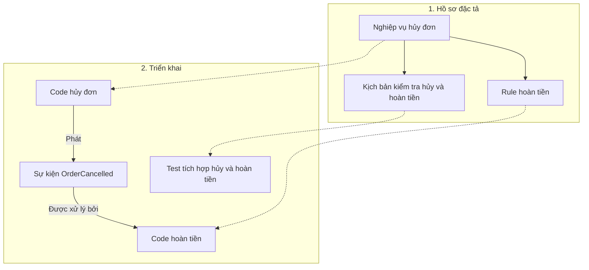

**Mình đề xuất giữ ba bản đồ như bạn nghĩ**, nhưng mở rộng phạm vi một chút. Đây nên là **ba góc nhìn liên thông**, không phải ba kho thông tin phải cập nhật thủ công độc lập.

## 1. Ba bản đồ nên có trách nhiệm gì?

| Bản đồ | Chứa gì? | Trả lời câu hỏi nào? |
|---|---|---|
| **1. Hồ sơ đặc tả** | Nghiệp vụ, rule, state, flow, AC, đặc tả test; thêm yêu cầu hệ thống, UI, kiến trúc, hợp đồng API/event, thiết kế vận hành | Sản phẩm phải hoạt động thế nào? Đổi yêu cầu này thì những phần đặc tả nào liên quan? |
| **2. Triển khai** | Module, class/struct, hàm, lời gọi, dữ liệu dùng chung, API/event thực tế, cấu hình và test chạy được | Hệ thống đang được xây thế nào? Đổi phần triển khai này thì nơi nào có thể bị ảnh hưởng? |
| **3. Đối chiếu đặc tả ↔ triển khai** | Liên kết mục đặc tả với phần triển khai và test tương ứng | Yêu cầu này được thực hiện ở đâu, kiểm tra bằng gì? Đoạn code này phục vụ yêu cầu nào? |

Mình đổi tên bản đồ 1 vì **nghiệp vụ chưa bao trùm toàn bộ yêu cầu**. Ví dụ thay yêu cầu chịu tải hoặc thời gian khôi phục có thể làm kiến trúc, cấu hình và test thay đổi, dù rule nghiệp vụ không đổi.

Tương tự, bản đồ 2 cần rộng hơn code vì cấu hình, dữ liệu và event cũng tạo dependency.

**Không cần thêm bản đồ test thứ tư:** đặc tả test thuộc bản đồ 1, test thực thi thuộc bản đồ 2, quan hệ giữa chúng nằm ở bản đồ 3. Kết quả chạy được gắn vào test thực thi cùng phiên bản và môi trường đã kiểm tra.

## 2. Doxygen hữu ích, nhưng chưa đủ làm toàn bộ bản đồ 2

Bạn hiểu đúng hướng: Doxygen hỗ trợ biểu diễn class/struct, quan hệ kế thừa, include giữa file, hàm gọi đến đâu và được gọi từ đâu. [Doxygen — Graphs and diagrams](https://www.doxygen.nl/manual/diagrams.html).

Tuy nhiên, cần phân biệt:

- **Chữ ký hàm không phải toàn bộ ý nghĩa input/output.** Thấy `amount` có kiểu số chưa cho biết đơn vị tiền, quy tắc làm tròn hay khi lỗi thì state có được thay đổi không. Những điều đó vẫn cần contract và phần mô tả rõ.
- **Call graph không phải mọi dependency.** Hai service có thể liên quan qua event hoặc cùng sử dụng dữ liệu mà không gọi hàm trực tiếp.
- **Đồ thị do công cụ sinh không mặc nhiên đầy đủ.** Chính Doxygen lưu ý độ đầy đủ và chính xác của call/caller graph phụ thuộc bộ phân tích code chưa hoàn hảo. [Doxygen — Call graph](https://www.doxygen.nl/manual/commands.html#cmdcallgraph).

Vì vậy, mình đề xuất **Doxygen là một công cụ cung cấp dữ liệu cho bản đồ triển khai C++**, không phải thứ quyết định toàn bộ thiết kế Kidea. Ngôn ngữ khác dùng công cụ phù hợp; những quan hệ không lấy được tự động phải được bổ sung có căn cứ, không được coi là không tồn tại.

Cũng nên có dữ liệu máy đọc, không chỉ hình cho Human xem. Chẳng hạn Doxygen hỗ trợ xuất cấu trúc code và tài liệu thành XML. [Doxygen — XML output](https://www.doxygen.nl/manual/config.html#cfg_generate_xml).

## 3. Ví dụ ba bản đồ phối hợp

Giả sử một sản phẩm cho phép hủy đơn và hoàn tiền bằng một tiến trình riêng:

**Các đường nét đứt là bản đồ 3:** nối đặc tả với nơi thực hiện/kiểm tra. Hình chỉ minh họa một phần quan hệ; mỗi liên kết phải truy ngược được.

Nếu đổi nghiệp vụ từ “chỉ hủy đơn chưa xử lý” sang “được hủy phần còn lại của đơn đã xử lý một phần”:

1. **Bản đồ 1:** tìm rule hoàn tiền, state, AC, đặc tả test, hợp đồng event và các tài liệu khác liên quan.
2. **Bản đồ 3:** xác định các phần code và test thực thi tương ứng.
3. **Bản đồ 2:** lần tiếp nơi sử dụng chúng, bao gồm bên nhận event để hoàn tiền.
4. **Quay qua bản đồ 3:** kiểm tra các yêu cầu/đặc tả khác mà những phần triển khai bị ảnh hưởng đang phục vụ.
5. Tiếp tục cho đến khi mọi ảnh hưởng có kết luận và được xử lý.

Điểm quan trọng: **bên hủy đơn không gọi trực tiếp hàm hoàn tiền, nhưng thay đổi bên hủy vẫn có thể làm hoàn tiền sai.** Chỉ dựa vào caller/callee sẽ có nguy cơ bỏ sót đường này.

Chiều ngược cũng tương tự: khi code thay đổi, lần ra các nơi sử dụng, test và đặc tả liên quan. Nhưng nếu code đang sai yêu cầu thì phải sửa code; không tự sửa yêu cầu để hợp thức hóa code.

## 4. Có liên kết tới test chưa có nghĩa đã kiểm tra đúng

Ví dụ test gọi hàm hủy đơn nhưng chỉ kiểm tra “không bị crash”. Test đó có liên quan tới hàm, nhưng chưa chứng minh **hoàn đúng số tiền**.

Kidea cần phân biệt:

- Test chạy qua phần code nào.
- Test thực sự kiểm tra rule/kết quả nào.
- Test đã chạy và đạt trên phiên bản, môi trường nào.

Vì vậy, mapping test phải dựa vào **điều mà test kiểm tra và kết quả mong đợi**, không chỉ vào hàm nó gọi. Bản đồ code mô tả triển khai thực tế; bản đồ đặc tả mô tả điều cần đạt. Có đường nối giữa hai bên chưa chứng minh chúng tuân thủ nhau.

## 5. Giữ ba bản đồ này gọn và nhất quán

Mình đề xuất các nguyên tắc sau:

- **Link nghiệp vụ lấy từ tài liệu nguồn**, giữ cách link/backlink đã thống nhất.
- **Quan hệ code lấy tự động từ source/cấu hình khi công cụ làm được**, không chép lại từng lời gọi hàm vào Markdown.
- **Mapping do AI đề xuất và Human review tập trung vào ý nghĩa:** rule/contract nào được thực hiện bởi module/hàm nào, test nào kiểm tra nó. Quan hệ có thể nhiều–nhiều.
- **Không ép mỗi hàm nhỏ phải có ID nghiệp vụ riêng.** Hàm tiện ích có thể được truy qua caller; mapping trực tiếp tập trung vào nơi thực sự mang trách nhiệm nghiệp vụ/kỹ thuật.
- **Mỗi quan hệ có một nơi định nghĩa có hiệu lực.** Backlink, chỉ mục và hình là góc nhìn được sinh hoặc kiểm tra từ đó; không sao chép cả nội dung rule sang code.
- **Bản đồ sinh ra phải gắn với đúng phiên bản source, cấu hình phân tích và hồ sơ.** Đổi/di chuyển code thì kiểm tra lại mapping; phần không phân tích được phải báo rõ.

Cuối cùng, **bản đồ giúp tìm nơi cần đọc, không thay việc đọc và phân tích**. Không thấy đường nối chưa đủ để kết luận không ảnh hưởng; vẫn phải tìm kiếm bổ sung và giữ kết luận có căn cứ như ta đã thống nhất.

**Khuyến nghị chốt: ba bản đồ là đủ ở cấp tổ chức — hồ sơ đặc tả, triển khai và đối chiếu giữa chúng.** Kiến trúc, test, dữ liệu hay vận hành là các phần/góc lọc bên trong, chưa cần biến thành nhiều hệ thống bản đồ độc lập.

Đây vẫn là đề xuất để bạn review; mình chưa sửa thiết kế chính. Câu trả lời đã được lưu và push vào [answer.md](https://github.com/Kynderis/kidea/blob/master/answer.md).

<oai-mem-citation>
<citation_entries>
MEMORY.md:60-64|note=[Preserve current-only documentation, recursive impact review and scoped answer mirroring]
</citation_entries>
<rollout_ids>
01a064b8-dde1-7882-acc1-7d02d6f568c8
</rollout_ids>
</oai-mem-citation>
