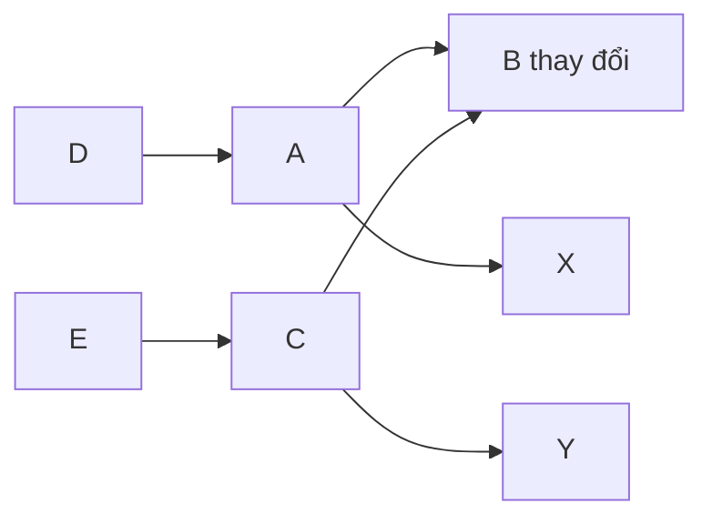

# Kết luận về dependency và impact analysis đệ quy

Mình đồng ý với lập luận của bạn. Với tiêu chuẩn bạn chọn — **mọi caller trực tiếp đều phải được đọc và phân tích đầy đủ, nếu caller thay đổi thì tiếp tục lan truyền đệ quy** — việc chia dependency thành `USES`, `READS_STATE`, `CHANGES_STATE` không tạo đủ giá trị để đáng giữ.

## 1. Vì sao ba loại quan hệ không còn cần thiết?

Ba nhãn đó chủ yếu giúp:

- lọc nhanh nhóm caller có khả năng bị ảnh hưởng;
- ước lượng loại ảnh hưởng trước khi mở tài liệu;
- ưu tiên review nơi thay đổi state.

Nhưng quy trình của chúng ta không cho phép kết luận chỉ từ nhãn. Dù backlink ghi `USES`, `READS_STATE` hay `CHANGES_STATE`, AI vẫn phải:

1. mở tài liệu caller;
2. đọc đầy đủ semantics, flow, state, input/output và dependency;
3. quyết định caller có bị ảnh hưởng hay không;
4. nếu bị ảnh hưởng thì cập nhật và tiếp tục phân tích đệ quy.

Như vậy, nhãn chỉ tiết kiệm một ít công đọc hoặc giúp ưu tiên. Bạn đã xác nhận không cần tối ưu token/công sức theo cách đó và muốn tất cả caller đều được xem xét đầy đủ. Khi ấy ba nhãn trở thành:

- thêm thuật ngữ phải học;
- thêm cột phải duy trì ở hai phía;
- có nguy cơ phân loại sai;
- dễ tạo cảm giác an toàn giả và bỏ qua caller vì “không đúng loại”.

**Kết luận:** bỏ toàn bộ loại quan hệ. Chỉ cần biết chính xác **A phụ thuộc B vì mục đích gì** và **B đang được A sử dụng**.

## 2. Dependency tối giản sẽ được ghi thế nào?

### Tại nơi gọi A

```markdown
### File này sử dụng

| Từ mục | Đến mục | Mục đích |
|---|---|---|
| `A-CALCULATE-TOTAL` | `B-CALCULATE-FEE` | Lấy phí để tính tổng tiền |
```

### Tại nơi được gọi B

```markdown
### Được sử dụng bởi

| Phạm vi trong file này | Nơi gọi | Mục đích |
|---|---|---|
| `B-CALCULATE-FEE` | `A-CALCULATE-TOTAL` | Lấy phí để tính tổng tiền |
```

Không còn cột `Quan hệ`. Tên hai bảng đã thể hiện chiều:

```text
A → B: File này sử dụng
B ← A: Được sử dụng bởi
```

Thông tin “đọc state”, “thay đổi state” hay “dùng phép tính” vẫn nằm trong nội dung contract và flow thực tế. AI phải đọc nội dung đó, không đoán từ một nhãn ngắn.

## 3. Impact analysis đệ quy sẽ hoạt động thế nào?

Giả sử graph ban đầu:



Mũi tên có nghĩa “nơi bên trái phụ thuộc vào nơi bên phải”.

Khi B thay đổi, quy trình không dừng ở A và C:

### Bước 1 — Phân tích chính B

- đọc toàn bộ tài liệu chứa B;
- xác định chính xác semantics nào đổi;
- đọc mọi dependency mà B đang gọi để bảo đảm B mới vẫn tương thích;
- tìm tất cả backlink và tìm kiếm toàn bộ tài liệu theo ID/link của B.

Việc tìm kiếm toàn bộ tài liệu là lớp an toàn bổ sung. Nếu ai đó quên ghi backlink nhưng trong nội dung vẫn có link hoặc ID của B, AI vẫn có cơ hội phát hiện.

### Bước 2 — Đọc đầy đủ A và C

Vì A và C gọi B, AI phải đọc toàn bộ tài liệu của A và C, không chỉ nhìn một dòng backlink.

Với mỗi nơi, AI kết luận một trong hai trạng thái phân tích:

```text
CẦN SỬA
ĐÃ KIỂM TRA — KHÔNG CẦN SỬA
```

Kết luận phải có lý do cụ thể.

Ví dụ:

| Mục | Kết luận | Lý do |
|---|---|---|
| A | `CẦN SỬA` | Output mới của B làm công thức và output của A thay đổi |
| C | `ĐÃ KIỂM TRA — KHÔNG CẦN SỬA` | C chỉ cần điều kiện mà B vẫn giữ nguyên; output/flow của C không đổi |

### Bước 3 — Lan truyền từ A vì A đã thay đổi

Do semantics hoặc contract của A thay đổi, AI coi A là một điểm thay đổi mới:

- đọc các dependency A đang gọi, gồm X và B, để kiểm tra A mới vẫn dùng chúng đúng;
- lần backlink của A tới D;
- đọc toàn bộ D;
- nếu D phải đổi thì tiếp tục làm tương tự với dependency và caller của D.

### Bước 4 — Dừng nhánh C nếu C không đổi

C đã được đọc đầy đủ và có kết luận không thay đổi semantics. Vì vậy không cần lan tiếp tới E chỉ vì E gọi C.

Lý do: contract mà E nhìn thấy từ C vẫn y nguyên. Việc tiếp tục đọc E sẽ không còn căn cứ nghiệp vụ và chỉ biến impact analysis thành quét toàn bộ graph mỗi lần.

Nếu C chỉ sửa câu chữ nội bộ nhưng input/output, behavior, state và contract không đổi thì cũng không lan truyền nghiệp vụ tới E.

### Bước 5 — Lặp đến điểm ổn định

Quy trình tiếp tục cho đến khi một vòng phân tích không tìm thấy mục mới cần sửa:

```text
B thay đổi
├── A cần sửa
│   ├── kiểm tra dependency của A
│   └── D gọi A → đọc D
│       └── nếu D đổi thì tiếp tục đệ quy
└── C đã đọc, không cần sửa
    └── dừng nhánh tại C
```

Đây là điều kiện dừng rõ ràng: **không còn semantics hoặc contract mới nào bị thay đổi để lan truyền tiếp**.

## 4. Phải đi cả hai hướng, không chỉ lần ngược caller

Với mỗi mục X bị thay đổi, AI phải kiểm tra:

| Hướng | Câu hỏi |
|---|---|
| Dependency X đang gọi | Sau khi X đổi, X còn dùng đúng contract của các dependency không? |
| Caller đang gọi X | Thay đổi của X có làm caller đổi behavior, state, flow hoặc output không? |

Ví dụ A thay đổi vì B:

```text
A → B
A → X
D → A
```

Ta không chỉ xem D có bị A ảnh hưởng hay không. Ta còn phải xem phiên bản mới của A có tiếp tục truyền input đúng cho X và xử lý output của X đúng không.

Nhờ vậy change set được kiểm tra cả:

- chiều đi xuống dependency;
- chiều đi ngược lên caller;
- các nhánh phát sinh khi caller tiếp tục thay đổi.

## 5. Impact list phải ghi lại toàn bộ nơi đã xem

Để chứng minh AI không bỏ sót hoặc chỉ nói chung chung, impact list nên có tối thiểu:

| Mục đã đọc | Được tìm thấy từ | Kết luận | Lý do | Có lan truyền tiếp không? |
|---|---|---|---|---|
| B | Yêu cầu thay đổi ban đầu | `CẦN SỬA` | Rule tính phí đổi | Có |
| A | Backlink của B | `CẦN SỬA` | Output và tổng tiền đổi | Có |
| C | Backlink của B | `KHÔNG CẦN SỬA` | Contract C quan sát không đổi | Không |
| X | Dependency của A | `KHÔNG CẦN SỬA` | A vẫn đáp ứng input contract của X | Không |
| D | Backlink của A | `CẦN SỬA` hoặc `KHÔNG CẦN SỬA` | Kết luận sau khi đọc D | Tùy kết quả |

Nếu graph có vòng như A phụ thuộc B và B gián tiếp phụ thuộc A, AI giữ danh sách mục đã đọc cùng phiên bản phân tích để không lặp vô hạn. Nếu một mục tiếp tục thay đổi ở vòng sau, nó được xem lại với semantics mới.

## 6. Khi nào toàn bộ thay đổi được coi là hoàn tất?

Chỉ hoàn tất khi:

1. mọi caller trực tiếp của mục thay đổi đã được đọc;
2. mọi dependency của từng mục thực sự bị sửa đã được kiểm tra lại;
3. mọi caller của mục thực sự bị sửa đã được phân tích đệ quy;
4. mỗi mục trong impact list có kết luận và lý do;
5. nội dung, flow table, Mermaid, AC/test, `INDEX.md`, forward link và backlink đã đồng bộ;
6. không còn link hỏng hoặc quan hệ một chiều;
7. tìm kiếm toàn bộ tài liệu không còn tham chiếu cũ bị bỏ sót;
8. một vòng phân tích mới không phát hiện thêm semantics cần sửa;
9. toàn bộ change set được Human review và approve.

Điều này tạo tính trọn vẹn **trong phạm vi nguồn sự thật hiện có**. Không phương pháp nào có thể bảo đảm một dependency chưa từng được viết ra sẽ tự xuất hiện, nên forward/backlink, tìm kiếm toàn văn và Human review vẫn phải hỗ trợ lẫn nhau.

## 7. Những thay đổi mình đã cập nhật vào tài liệu

Mình đã cập nhật trực tiếp `cach_tao_dac_ta_nghiep_vu_voi_ai.md` theo kết luận trên:

- bỏ toàn bộ `CONTAINS / PART_OF`;
- bỏ `USES / USED_BY`;
- bỏ `READS_STATE / STATE_READ_BY`;
- bỏ `CHANGES_STATE / STATE_CHANGED_BY`;
- bỏ `NEXT / PREVIOUS` khỏi relation map;
- relation map chỉ còn `Từ mục`, `Đến mục`, `Mục đích` và backlink tương ứng;
- bỏ `ALL`, bắt buộc link đến mục cụ thể;
- flow được mô tả bằng bảng; Mermaid dùng thêm cho flow phức tạp;
- bổ sung impact analysis hai hướng và đệ quy đến điểm ổn định;
- bắt buộc đọc toàn bộ caller, ghi cả trường hợp không cần sửa cùng lý do;
- bổ sung tìm kiếm toàn văn để bắt tham chiếu bị thiếu trong relation map;
- cập nhật ví dụ graph để nhãn cạnh chỉ là ID nghiệp vụ được gọi, không còn loại quan hệ.

Đây là hướng mình khuyến nghị: cấu trúc dependency đơn giản hơn nhưng quy trình phân tích nghiêm ngặt và toàn diện hơn. Chi phí AI cao hơn, nhưng phù hợp với ưu tiên chất lượng mà bạn vừa xác nhận.

Các thay đổi và toàn bộ câu trả lời này đã được commit, push lên `origin/master`.
