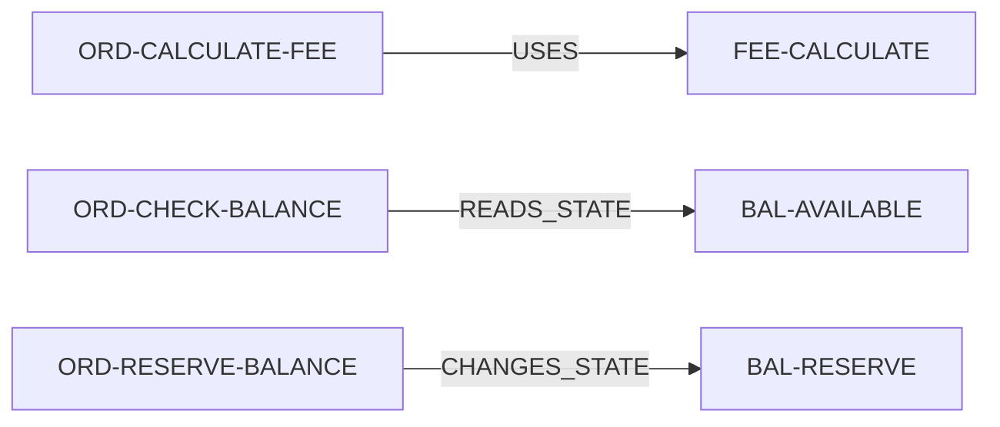
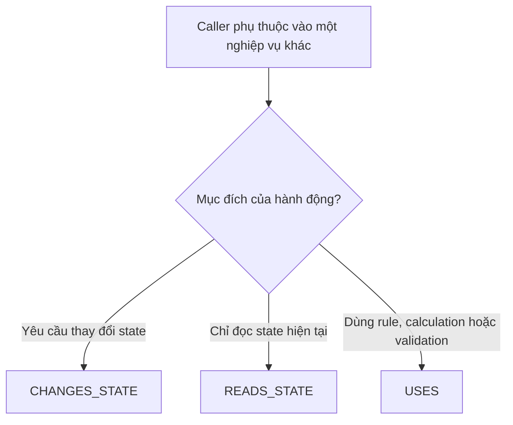

# Ví dụ thực tế cho `USES`, `READS_STATE` và `CHANGES_STATE`

## 1. Cách hiểu của bạn có đúng không?

Gần đúng. Có thể dùng mô hình sau để nhớ:

| Quan hệ | Cách hiểu ngắn |
|---|---|
| `USES` | Dùng một rule, phép tính hoặc validation không làm thay đổi business state |
| `READS_STATE` | Đọc business state do nơi khác sở hữu, không thay đổi nó |
| `CHANGES_STATE` | Yêu cầu nơi sở hữu state thực hiện thay đổi state |

Có hai điểm cần chỉnh nhẹ:

### `USES` không khẳng định code là pure function

Ở cấp tài liệu nghiệp vụ, `USES` nên **có hành vi giống một phép tính/rule không có side effect lên business state**: nhận input, áp dụng rule và trả output.

Ta không dùng quan hệ này để khẳng định implementation bên dưới chắc chắn là pure function hoặc không đọc cache/configuration. Đó là chi tiết kỹ thuật.

### `CHANGES_STATE` có thể đọc state trong quá trình thay đổi

Ví dụ `BAL-RESERVE` phải đọc available balance để kiểm tra có đủ tiền rồi mới thay đổi balance. Nhưng từ phía Feature, mục đích của lời gọi là yêu cầu thay đổi state, nên chỉ ghi `CHANGES_STATE`, không ghi thêm `READS_STATE` và `USES` cho cùng hành động.

## 2. Một Feature sử dụng cả ba loại như thế nào?

Giả sử Feature đặt lệnh có ba bước:



Trong `F-PLACE-ORDER.md`:

```markdown
## RELATION-MAP

### File này sử dụng

| Từ mục | Quan hệ | Đến mục | Mục đích |
|---|---|---|---|
| `ORD-CALCULATE-FEE` | `USES` | `FEE#FEE-CALCULATE` | Tính phí dự kiến |
| `ORD-CHECK-BALANCE` | `READS_STATE` | `BALANCE#BAL-AVAILABLE` | Kiểm tra số dư có thể dùng |
| `ORD-RESERVE-BALANCE` | `CHANGES_STATE` | `BALANCE#BAL-RESERVE` | Giữ số dư cho lệnh |
```

Mỗi tài liệu đích có backlink tương ứng. Ví dụ trong `BALANCE.md`:

```markdown
### Được sử dụng bởi

| Nơi gọi | Quan hệ của nơi gọi | Phạm vi trong file này | Mục đích |
|---|---|---|---|
| `F-PLACE-ORDER#ORD-CHECK-BALANCE` | `READS_STATE` | `BAL-AVAILABLE` | Kiểm tra số dư có thể dùng |
| `F-PLACE-ORDER#ORD-RESERVE-BALANCE` | `CHANGES_STATE` | `BAL-RESERVE` | Giữ số dư cho lệnh |
```

Sau đây là tác dụng thực tế của từng loại khi tài liệu thay đổi.

## 3. Ví dụ `USES`: dùng rule hoặc phép tính

### Nghiệp vụ được gọi

`FEE#FEE-CALCULATE`:

```text
Input: order_value
Rule: fee = order_value × 0.1%
Output: fee
Không sở hữu hoặc thay đổi balance/order state.
```

Các nơi gọi:

```text
F-PLACE-ORDER#ORD-CALCULATE-FEE USES FEE-CALCULATE
F-PREVIEW-ORDER#PREVIEW-CALCULATE-FEE USES FEE-CALCULATE
```

### Khi `FEE-CALCULATE` thay đổi

Giả sử công thức đổi từ phí cố định `0.1%` sang phí theo cấp người dùng.

AI thực hiện:

1. đưa `FEE.md` về `DRAFT`;
2. mở bảng `Được sử dụng bởi` của `FEE-CALCULATE`;
3. tìm được Place Order và Preview Order;
4. phân tích từng caller.

Kết quả impact có thể là:

| Caller | Ảnh hưởng |
|---|---|
| Place Order | Phí thay đổi làm tổng tiền cần reserve thay đổi; phải cập nhật công thức, ví dụ và test |
| Preview Order | Số phí hiển thị thay đổi; phải cập nhật expected output và test |

Từ Place Order, AI còn có thể phát hiện ảnh hưởng tiếp theo:

```text
FEE-CALCULATE thay đổi
→ ORD-CALCULATE-FEE thay đổi
→ amount truyền vào BAL-RESERVE thay đổi
→ test reserve và expected balance phải được xem lại
```

Đây là giá trị của dependency graph: thay đổi ở một rule có thể được lần tới Feature, rồi từ Feature tới dependency tiếp theo.

### Khi nơi gọi thay đổi

Giả sử Preview Order không còn hiển thị phí.

AI đọc `File này sử dụng` của `F-PREVIEW-ORDER.md`, sau đó:

1. xóa link tới `FEE-CALCULATE` trong nội dung Feature;
2. xóa dòng `USES` trong relation map của Feature;
3. xóa backlink Preview Order trong `FEE.md`;
4. cập nhật flow, AC và test của Preview Order;
5. không sửa `FEE-CALCULATE`, vì contract của nó vẫn đúng và còn caller khác sử dụng.

### `USES` giúp gì?

- tìm tất cả Feature phụ thuộc vào một rule/phép tính;
- lần ảnh hưởng khi formula, validation hoặc output thay đổi;
- biết dependency chỉ cung cấp kết quả, không sở hữu state mà Feature đang đọc/ghi trực tiếp.

## 4. Ví dụ `READS_STATE`: đọc state do nơi khác sở hữu

### Nghiệp vụ được gọi

`BALANCE#BAL-AVAILABLE`:

```text
State owner: BALANCE
Output: available balance hiện tại của asset
Không thay đổi balance.
```

Các nơi gọi:

```text
F-VIEW-BALANCE#VIEW-AVAILABLE READS_STATE BAL-AVAILABLE
F-PLACE-ORDER#ORD-CHECK-BALANCE READS_STATE BAL-AVAILABLE
```

### Khi ý nghĩa của `BAL-AVAILABLE` thay đổi

Giả sử trước đây:

```text
available = total - reserved
```

Sau thay đổi:

```text
available = total - reserved - pending_withdrawal
```

AI mở `Được sử dụng bởi` của `BAL-AVAILABLE` và phân tích:

| Caller | Ảnh hưởng có thể có |
|---|---|
| View Balance | Giá trị hiển thị có thể giảm; cần cập nhật mô tả, ví dụ và expected output |
| Place Order | Điều kiện “đủ số dư” có thể cho kết quả khác; cần cập nhật flow từ chối và test boundary |

Có thể sau phân tích Human quyết định:

- View Balance vẫn nên đọc `BAL-AVAILABLE` mới;
- Place Order cần một khái niệm chính xác hơn là `BAL-SPENDABLE`.

Khi đó AI:

1. đổi forward link của `ORD-CHECK-BALANCE` từ `BAL-AVAILABLE` sang `BAL-SPENDABLE`;
2. xóa backlink cũ trong `BAL-AVAILABLE`;
3. thêm backlink mới trong `BAL-SPENDABLE`;
4. cập nhật rule, flow và test của Place Order.

### Khi nơi gọi không còn cần đọc state

Giả sử Place Order bỏ bước đọc trước và gọi thẳng `BAL-RESERVE`; chính `BAL-RESERVE` chịu trách nhiệm từ chối nếu thiếu tiền.

AI sẽ:

1. xóa bước `ORD-CHECK-BALANCE` nếu nó không còn ý nghĩa khác;
2. xóa forward relation `READS_STATE BAL-AVAILABLE`;
3. xóa backlink tương ứng trong `BALANCE.md`;
4. giữ relation `CHANGES_STATE BAL-RESERVE`;
5. cập nhật flow để xử lý output `INSUFFICIENT_BALANCE` từ `BAL-RESERVE`.

### `READS_STATE` giúp gì?

- xác định chính xác ai đang phụ thuộc vào ý nghĩa của một state;
- tìm nơi bị ảnh hưởng khi state definition, đơn vị, phạm vi hoặc độ mới thay đổi;
- chỉ rõ tài liệu nào sở hữu state, tránh mỗi Feature tự định nghĩa balance theo một cách.

## 5. Ví dụ `CHANGES_STATE`: yêu cầu thay đổi state

### Nghiệp vụ được gọi

`BALANCE#BAL-RESERVE`:

```text
Input: asset, amount
Precondition: amount > 0 và available >= amount
Success:
- available giảm amount
- reserved tăng amount
Failure:
- trả lỗi
- balance giữ nguyên
Invariant:
- available và reserved không âm
```

Các nơi gọi:

```text
F-PLACE-ORDER#ORD-RESERVE-BALANCE CHANGES_STATE BAL-RESERVE
F-WITHDRAW#WDR-HOLD-BALANCE CHANGES_STATE BAL-RESERVE
```

### Khi `BAL-RESERVE` thay đổi

Giả sử nghiệp vụ đổi từ “chỉ chấp nhận toàn bộ amount” thành “có thể reserve một phần và trả về actual_reserved”.

AI mở các backlink `CHANGES_STATE` và phát hiện:

| Caller | Câu hỏi impact bắt buộc |
|---|---|
| Place Order | Có chấp nhận đặt lệnh với số tiền reserve một phần không? Order chuyển state nào? |
| Withdraw | Có được tạo yêu cầu rút một phần không hay phải từ chối toàn bộ? |

Hai Feature có thể đưa ra quyết định khác nhau:

- Place Order cho phép giảm quantity theo `actual_reserved`;
- Withdraw vẫn yêu cầu all-or-nothing và từ chối nếu reserve không đủ.

AI phải cập nhật tại từng caller:

- cách gọi contract;
- cách xử lý output;
- flow thành công/từ chối;
- expected final state;
- invariant và test liên quan.

### Khi nơi gọi thay đổi

Giả sử Place Order chuyển sang mô hình không reserve trước mà chỉ debit khi match.

AI đọc `File này sử dụng` của Feature và:

1. xóa bước `ORD-RESERVE-BALANCE`;
2. xóa forward relation `CHANGES_STATE BAL-RESERVE`;
3. xóa backlink Place Order trong `BAL-RESERVE`;
4. thêm relation mới tới nghiệp vụ debit tại bước match nếu cần;
5. cập nhật flow, order state, balance effect, AC và test;
6. không xóa `BAL-RESERVE` nếu Withdraw hoặc Feature khác vẫn dùng.

### `CHANGES_STATE` giúp gì?

- tìm tất cả nơi có khả năng làm thay đổi state được sở hữu tập trung;
- đánh giá ảnh hưởng khi precondition, transition, error hoặc invariant thay đổi;
- phát hiện các Feature đang yêu cầu thay đổi cùng một state;
- hỗ trợ sinh dependency contract test: caller phải gửi input đúng và xử lý đủ success/failure;
- giúp ưu tiên review vì thay đổi state thường có rủi ro cao hơn chỉ đọc state.

## 6. Ba loại quan hệ giúp impact analysis chính xác hơn thế nào?

Giả sử `BALANCE.md` thay đổi:

| Phần thay đổi | Nhóm cần xem trước |
|---|---|
| Công thức tính phí độc lập | Các relation `USES` tới công thức đó |
| Ý nghĩa của available balance | Các relation `READS_STATE` tới state đó; đồng thời xem writer nếu invariant chung bị đổi |
| Rule reserve/release/debit | Các relation `CHANGES_STATE` tới đúng operation bị đổi |
| Invariant cấp toàn bộ Balance | Cả `READS_STATE` và `CHANGES_STATE` liên quan tới phạm vi invariant |

Nếu chỉ có một relation chung là `USES`, AI vẫn có thể phân tích nhưng phải mở tất cả caller rồi tự xác định lại mục đích của từng dependency. Ba loại quan hệ giúp thu hẹp phạm vi và biết ngay lý do phải review.

Tuy nhiên, relation type không thay thế nội dung chi tiết. Mỗi relation vẫn phải trỏ tới đúng section và ghi mục đích; AI vẫn đọc contract thật trước khi kết luận ảnh hưởng.

## 7. Quy tắc phân loại cuối cùng



Quy tắc ưu tiên:

```text
CHANGES_STATE > READS_STATE > USES
```

Nghĩa là nếu một operation vừa phải đọc state để kiểm tra vừa thay đổi state khi thành công, ghi `CHANGES_STATE`. Không ghi ba relation cho cùng một hành động.

Mình vẫn khuyến nghị giữ cả ba loại vì mỗi loại giúp tìm một nhóm ảnh hưởng khác nhau, nhưng chỉ sau khi định nghĩa chúng loại trừ nhau như trên. Lượt này chưa sửa phần relation trong tài liệu để bạn tiếp tục đánh giá trước khi chốt.

Toàn bộ câu trả lời đã được ghi vào `answer.md`, commit và push lên `origin/master`.
