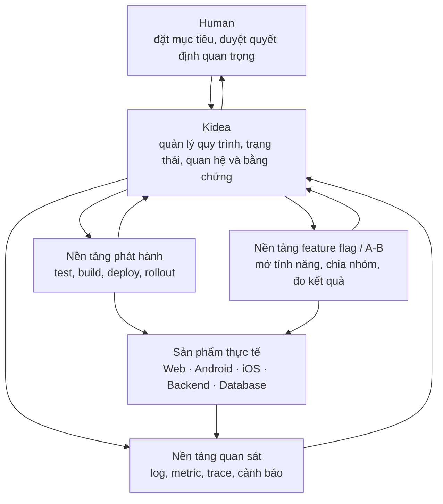

Có. Và mình nói thẳng: phần trước **đúng hướng nhưng đã nén quá nhiều khái niệm vào vài câu**, nên đọc giống một danh sách công nghệ hơn là một hệ thống hoàn chỉnh. Muốn chốt đúng, cần tách ba câu hỏi:

1. **Kidea quản lý cái gì?**
2. **Ai thực sự chạy test, build, deploy, rollout và giám sát?**
3. **Một Feature đi từ ý tưởng tới người dùng như thế nào khi có web, Android, iOS và backend?**

Mình sẽ dùng một ví dụ xuyên suốt: sản phẩm có **luồng onboarding mới** trên web, Android, iOS; backend có API và database liên quan.

## 1. Bức tranh tổng thể: Kidea là “bộ não điều phối”

Câu “đưa vào Kidea nhưng tách nền tảng thực thi” có nghĩa như sau:

### Human làm gì?

Human quyết định những việc mang tính sản phẩm, rủi ro hoặc quyền hạn:

- Tính năng có đúng ý định không?
- Nghiệp vụ, UX và kiến trúc quan trọng có được duyệt không?
- Candidate nào được chốt thành version chính thức?
- Có đưa version đó lên production không?
- Kế hoạch rollout, A/B hoặc rollback nào được phép?
- Có restore database — việc có thể làm mất dữ liệu mới phát sinh — hay không?

### Kidea làm gì?

Kidea giữ toàn bộ mạch suy luận và tiến độ:

- Ý tưởng sinh ra Feature nào.
- Feature có yêu cầu, AC, thiết kế và test gì.
- Code/config/schema/ứng dụng nào bị ảnh hưởng.
- Review và kiểm tra nào đã chạy trên đúng phiên bản.
- Feature đã sẵn sàng tích hợp chưa; đã merge chưa.
- Feature nằm trong candidate/release nào.
- Release đang chạy ở đâu; ai đã được mở tính năng.
- Rollout hoặc A/B đang ở giai đoạn nào.
- Lỗi production liên quan Feature, rule, code, test và release nào.

Nói gọn: **Kidea biết “vì sao, cái gì, đang ở đâu, căn cứ nào và được phép làm gì”.**

### Nền tảng phát hành/vận hành làm gì?

Đây là phần chạy bền vững kể cả khi Codex đã đóng:

- Chạy job test/build.
- Lưu các gói đã build.
- Đưa gói lên dev/prod.
- Điều chỉnh traffic khi rollout.
- Đọc trạng thái thật của máy chủ.
- Thu log, metric, trace.
- Tự dừng rollout khi vi phạm điều kiện an toàn.
- Ghi audit: ai yêu cầu, hệ thống đã làm gì và kết quả ra sao.

Nói gọn: **nền tảng này là “tay chân và máy móc thực thi”.**

Nếu Kidea tự viết luôn CI/CD, kho artifact, Kubernetes controller, feature flag, thống kê A/B và monitoring, ta sẽ tự xây lại nhiều hệ thống khó và nhạy cảm. Kidea sẽ phình to, khó kiểm chứng và trở thành điểm lỗi duy nhất.

Nhưng “tách” **không có nghĩa** hoạt động lẻ tẻ. Kidea vẫn là lớp điều phối chung; giao diện Kidea có thể hiển thị dữ liệu từ các hệ chuyên dụng và phát lệnh qua quyền được kiểm soát.

Ví dụ dễ hình dung:

- Kidea giống **trung tâm điều hành sân bay**.
- Hệ build/deploy giống **đội mặt đất và đường băng**.
- Monitoring giống **radar**.
- Feature flag/A-B giống **hệ thống phân luồng hành khách**.

Ta nhìn và điều khiển qua một trung tâm, nhưng không biến trung tâm đó thành máy bay, radar và đường băng.

## 2. Vậy “đưa vào Kidea” hay “tách riêng”?

Câu trả lời chính xác là:

- **Về trải nghiệm:** nằm trong Kidea; bạn có một nơi để nhìn toàn bộ chuỗi và ra quyết định.
- **Về trách nhiệm kỹ thuật:** tách thành các module/dịch vụ thực thi chuyên dụng.
- **Về triển khai vật lý:** chưa cần quyết định ngay bao nhiêu server, repo hay microservice. Ranh giới logic phải rõ ngay; cách đóng gói có thể đổi theo quy mô.

Có thể gọi phần mở rộng sau này là **Kidea Control** hoặc **Kidea Portal**. Nó thuộc hệ sinh thái Kidea, nhưng không nhét token production vào HTML offline.

Điểm quan trọng: **Kidea hiện mới được thiết kế là một skill chạy theo phiên, lưu trạng thái bằng file và có HTML offline chỉ đọc.** Nó chưa phải server 24/7. Muốn xem production live, bấm deploy, theo dõi rollout nhiều giờ, nhận cảnh báo khi AI đóng và thao tác flag thì phải có thành phần online bền vững. Đây là mở rộng kiến trúc thật sự, không phải sửa nhỏ HTML hiện tại.

## 3. Một Feature đi qua những trạng thái nào?

Phần trước dùng chữ DONE nên dễ hiểu nhầm. Thực tế có nhiều mốc độc lập:

```mermaid
flowchart LR
    A["Ý tưởng"] --> B["Đặc tả được duyệt"]
    B --> C["Đang phát triển"]
    C --> D["Đủ điều kiện tích hợp"]
    D --> E["Đã merge và xác nhận"]
    E --> F["Candidate"]
    F --> G["Đã kiểm chứng trên dev"]
    G --> H["Human chốt version"]
    H --> I["Đã deploy production"]
    I --> J["Đang rollout / mở tính năng"]
    J --> K["Đã xác minh vận hành"]
```

### Đủ điều kiện tích hợp

Nghĩa là Feature hoàn chỉnh theo phạm vi:

- Tài liệu, rule, UX, kiến trúc, code, test, config và mapping liên quan đã cập nhật.
- Human gate bắt buộc đã được duyệt.
- Review không còn lỗi bắt buộc.
- Test cục bộ và tích hợp liên quan đạt.
- **Lượt kiểm tra cuối toàn dự án của Feature này đã chạy đầy đủ**, kể cả phần không có diff.

Theo G2 hiện đã duyệt, lúc này có thể ghi Feature DONE và “đủ điều kiện merge”. Nhưng DONE dễ bị hiểu là “đã lên production”. Mình khuyến nghị giao diện ghi rõ **Sẵn sàng tích hợp**; nếu muốn đổi nghĩa chính thức của DONE thì chốt riêng, không sửa ngầm.

### Đã tích hợp

Thay đổi đã vào master và ta xác nhận đúng đầu vào. Nếu merge gây conflict, có sửa bổ sung hoặc master đổi khiến đầu vào khác bản đã test, kết quả cũ không tự còn hiệu lực; phải chạy lại toàn bộ lượt cuối trên bản kết hợp mới.

### Candidate là gì?

Candidate là **bản ứng viên phát hành**: một bộ đầu vào cụ thể đang được cân nhắc để trở thành version chính thức.

Nó không chỉ là commit. Candidate nên khóa hoặc tham chiếu chính xác:

- Commit của từng codebase.
- Gói build web/backend và dấu vân tay nội dung.
- Build Android/iOS.
- Phiên bản schema và migration.
- Cấu hình ảnh hưởng hành vi.
- Phiên bản rule flag/rollout.
- Kết quả test/review tương ứng.

Ví dụ:

| Candidate `onboarding-2.0-rc.1` | Nội dung |
|---|---|
| Backend | `backend:2.4.0-b120` |
| Web | `web:3.1.0-b88` |
| Android/iOS | build 190 / build 108 |
| Database | schema 14, migration M203 |
| Feature flag | `onboarding-v2`, revision 7 |
| Bằng chứng | full gate F-203, dev check D-91 |

`rc.1` là release candidate số 1. Nếu dev phát hiện lỗi và code/config chi phối hành vi phải sửa, ta tạo `rc.2`. Không thay nội dung trong rc.1 rồi vẫn nói đó là bản đã test.

Candidate có thể đang chờ test, test thất bại, bị loại hoặc đạt và chờ Human chốt. Nó **không phải version chính thức**, càng không có nghĩa production đang chạy nó.

### Version chính thức

Là candidate cụ thể được Human chấp nhận, ví dụ `2.0.0`. Nguyên tắc tốt: **đưa đúng gói đã kiểm chứng đi tiếp**, không build lại tùy tiện từ “master mới nhất”.

### Đã deploy

Nền tảng đã đưa các thành phần tới môi trường đích và ta đã đọc lại trạng thái thực tế. Nút bấm thành công hoặc API trả “accepted” chỉ chứng minh đã nhận lệnh, chưa chứng minh triển khai hoàn tất.

### Đã mở tính năng

Code có thể đã ở production nhưng flag vẫn tắt; người dùng chưa thấy tính năng. Đây là trạng thái khác “đã deploy”.

### Đã xác minh vận hành

Ta đã kiểm tra đúng version/config đang chạy, luồng chính hoạt động và các chỉ số an toàn không xấu. Nó không bảo đảm tuyệt đối không còn bug; nó là bằng chứng trong phạm vi tiêu chí đã định.

## 4. “Tự merge” thế nào mà không bỏ bước?

“Tự merge” chỉ là **tự động hóa thao tác cuối sau khi đủ điều kiện**, không phải AI tự thấy ổn rồi tự duyệt mình.

Cơ chế chặt cần hoạt động như sau:

1. Kidea xác định danh sách nghĩa vụ: tài liệu, mapping, test, review, Human gate và full gate.
2. Mỗi kết quả gắn với đúng commit/config/test suite/môi trường.
3. Kiểm tra bắt buộc bị thiếu, skip, quá cũ hoặc chạy trên commit khác thì là **chưa đủ**, không phải đạt.
4. Review còn vấn đề bắt buộc thì chặn.
5. Thay đổi file CI, danh mục test bắt buộc, quyền bot hoặc gate cần Human xem riêng; AI không được làm yếu hàng rào rồi tự qua.
6. Đủ điều kiện và có quyền merge đúng phạm vi thì hệ thống mới merge.
7. Đọc lại master. Nếu bản tích hợp khác đầu vào đã kiểm chứng thì chạy lại full gate.
8. Sau đó báo riêng: Feature hoàn chỉnh; merge thành công; **chưa phát hành**.

“Toàn bộ kiểm tra” nghĩa là **toàn bộ bộ kiểm tra và nghĩa vụ project đã quy định là bắt buộc**, gồm tài liệu, code, maps, test, config, build và kiểm tra thủ công đã định. Không hệ thống nào chứng minh đã thử mọi tình huống có thể tồn tại. Thiếu máy thật hoặc môi trường thì phải báo thiếu, không đổi thành xanh.

GitHub có trường hợp `skipped` hoặc `neutral` không chặn merge, nên không thể chỉ nhìn dấu xanh. Kidea phải biết **đáng lẽ phải có check nào** và xác minh chúng thực sự chạy. [GitHub status checks](https://docs.github.com/en/pull-requests/reference/status-checks).

## 5. Một release chung cho web/app/backend nghĩa là gì?

Không ép mọi thành phần cùng số version. Ta dùng một **mã release sản phẩm** giống “danh sách hàng trong một chuyến tàu”.

Ví dụ `PRODUCT-R12` gồm:

- Backend 2.4.0
- Web 3.1.0
- Android 1.9.0
- iOS 1.8.0
- Schema 14
- Config production revision 22
- Flag rule revision 7

Nếu Android không đổi ở release sau, release vẫn ghi “Android 1.9.0 được giữ lại”. Nhờ đó ta biết tổ hợp nào được coi là tương thích, không đoán từ version mới nhất.

Release record còn cần:

- Thứ tự triển khai.
- Quan hệ phụ thuộc.
- Old/new version nào cùng tồn tại được.
- Migration nào chạy trước.
- Tính năng mặc định bật hay tắt.
- Điều kiện rollout.
- Một bước lỗi thì dừng, giữ hay quay phần nào.
- Client cũ nào còn được hỗ trợ.

## 6. Ví dụ onboarding mới được phát hành ra sao?

### Bước 1 — chuẩn bị backend/database

Thêm schema/API mới nhưng vẫn tương thích web/app cũ. Chưa xóa API cũ; flag mặc định tắt. Mobile không cập nhật đồng loạt nên nhiều tuần có thể tồn tại Android cũ, iOS mới và web mới cùng lúc.

### Bước 2 — deploy backend mới, chưa mở hành vi mới

Backend mới chạy production nhưng người dùng vẫn dùng onboarding cũ. Ta kiểm tra lỗi, độ trễ và tính đúng dữ liệu.

### Bước 3 — phát hành web/mobile

Web cập nhật nhanh hơn. Android/iOS đi qua store và người dùng nhận dần; hệ thống theo dõi tỷ lệ client đã cập nhật.

### Bước 4 — mở cho nhóm đủ điều kiện

Chỉ người có client tương thích được nhận onboarding mới. Ví dụ 5% tài khoản nội bộ; 5% chỉ là minh họa, chưa phải ngưỡng duyệt.

### Bước 5 — quan sát và mở rộng

Đủ thời gian, đủ dữ liệu và chỉ số an toàn đạt thì nền tảng tăng tới các nấc đã duyệt. Lỗi tăng thì tự pause hoặc tắt flag theo kế hoạch.

### Bước 6 — dọn phần cũ

Chỉ khi client cũ hết thời hạn hỗ trợ và đủ bằng chứng mới xóa API/schema/code/flag cũ.

Vậy “cùng lên một phiên bản” nghĩa là **cùng một kế hoạch phát hành và cam kết tương thích**, không phải mọi thiết bị đổi cùng một giây.

Apple phased release vẫn cho phép người dùng chủ động tải bản mới; dừng rollout Android không hạ version trên máy đã cập nhật. Vì vậy không thể hứa cập nhật hay rollback nguyên tử toàn bộ mobile. [Apple](https://developer.apple.com/help/app-store-connect/update-your-app/release-a-version-update-in-phases/), [Google Play](https://support.google.com/googleplay/android-developer/answer/6346149).

## 7. Deploy, rollout, feature flag và A/B khác nhau ra sao?

### Deploy

Đưa code/gói mới tới môi trường. Ví dụ backend 2.4 đã chạy production.

### Progressive rollout

Đưa **bản triển khai mới** tới tỷ lệ traffic tăng dần để kiểm tra an toàn kỹ thuật. Ví dụ 5% request vào backend 2.4, 95% vẫn vào 2.3; nếu lỗi và latency ổn thì tăng tiếp. Đây thường gọi là canary. [Google SRE](https://sre.google/workbook/canarying-releases/).

### Feature flag

Quyết định **ai được dùng một hành vi** dù code đã deploy. Ví dụ backend 2.4 chạy 100%, nhưng chỉ nhân viên nội bộ thấy onboarding mới.

Flag không phải cơ chế phân quyền bảo mật. Backend vẫn phải xác minh quyền thật; không tin client tự khai “tôi thuộc nhóm B”.

### A/B testing

So sánh tác động của hai phương án nghiệp vụ:

- Nhóm A thấy onboarding cũ.
- Nhóm B thấy onboarding mới.
- Đo tỷ lệ hoàn tất đăng ký.
- Đồng thời theo dõi crash, lỗi thanh toán, latency.

A/B đúng nghĩa không chỉ chia traffic 50/50. Cần:

1. Chốt giả thuyết trước.
2. Xác định ai được tham gia.
3. Chọn đơn vị chia nhóm: user, account hay tenant.
4. Một người ở nhóm ổn định, không nhảy A/B mỗi request.
5. Ghi riêng:
   - **assignment:** được phân vào B;
   - **exposure:** thực sự thấy B;
   - **outcome:** hoàn tất hay bỏ cuộc.
6. Chốt chỉ số chính, chỉ số an toàn, thời gian và dữ liệu tối thiểu.
7. Dữ liệu mất/lệch/chưa đủ thì kết luận **chưa đủ căn cứ**.
8. Human quyết định áp dụng, bỏ hay thử tiếp.
9. Sau kết luận vẫn xác minh flag thực tế và dọn nhánh code cũ.

A/B không phải giấy phép đưa code chưa hoàn thiện lên production. Cả A và B đều phải được duyệt và kiểm thử. [GrowthBook](https://docs.growthbook.io/using/experimenting).

## 8. Ai được tự động làm tới đâu?

| Chủ thể | Trách nhiệm |
|---|---|
| Human | Chốt ý định/đặc tả quan trọng; chọn version; cho phép kế hoạch production; quyết định ngoài kế hoạch, rollback dữ liệu và rủi ro lớn |
| Kidea/AI | Phân tích ảnh hưởng; cập nhật tài liệu/code/test; kiểm tra; review; merge khi được cấp quyền và đủ gate; tạo candidate; deploy dev; đọc log được phép; đề xuất |
| Nền tảng | Chạy job/rollout bền vững; cưỡng chế gate; tự pause/abort theo ngưỡng duyệt; ghi bằng chứng |
| Người vận hành khẩn cấp | Can thiệp khi Kidea/AI không hoạt động, với quyền giới hạn và audit |

Rollout production có hai cách:

- Human bấm từng nấc 5% → 20% → 50% → 100%.
- Human duyệt cả kế hoạch; nền tảng tự tăng khi đủ điều kiện và tự dừng khi sai.

Mình khuyến nghị cách hai cho hệ thống lớn: Human kiểm soát **chính sách và phạm vi**, nền tảng xử lý nhịp vận hành. Thay ngưỡng, bỏ bước hoặc ra ngoài kế hoạch thì hỏi lại. Quyền này chưa được duyệt hiện nay.

## 9. Nếu lỗi hoặc mất kết nối thì sao?

| Tình huống | Hành vi đúng |
|---|---|
| Test bắt buộc bị skip | Chặn tích hợp; không coi là PASS |
| Candidate lỗi ở dev | Loại candidate; sửa và tạo candidate mới |
| Backend mới đã lên nhưng web lỗi | Pause; giữ flag tắt; chỉ giữ tổ hợp nếu đã xác định tương thích |
| Rollout thiếu metric | “Không đủ căn cứ”; không tự tăng tỷ lệ |
| Kidea/Codex đóng | Pipeline, monitoring, rollout đã duyệt vẫn hoạt động; Human có đường vận hành riêng |
| Dịch vụ flag mất kết nối | Dùng cache/fallback trong giới hạn; luồng nhạy cảm có thể từ chối thay vì dùng rule quá cũ |
| Thay đổi thủ công ngoài Kidea | Phát hiện lệch mong muốn/thực tế, ghi audit và đối chiếu |
| Rollback server | Chỉ dùng artifact cũ còn tương thích schema/data |
| “Rollback” mobile | Dừng phát hành thêm hoặc ra bản sửa; không hạ đồng loạt app đã cài |
| Restore database | Gate Human riêng vì có thể mất dữ liệu sau mốc khôi phục |

Rollback ứng dụng, tắt flag và restore database là ba việc khác nhau. Một nút “Undo tất cả” tạo cảm giác an toàn giả.

## 10. Làm sao control thống nhất mà không chép dữ liệu khắp nơi?

“Một nơi để control” không có nghĩa chép mọi dữ liệu vào database Kidea. Nguyên tắc là: **mỗi loại dữ liệu có một nguồn chính; Kidea giữ quan hệ và đọc trạng thái có nguồn/thời điểm.**

| Dữ liệu | Nguồn chính |
|---|---|
| Ý tưởng, nghiệp vụ, thiết kế | Tài liệu project |
| Task, gate, blocker | Hồ sơ Kidea |
| Source/config/test | Git và file chuẩn |
| Gói build | Artifact registry |
| Deploy | Nền tảng phát hành |
| Flag/exposure | Hệ feature flag |
| A/B | Hệ experiment/analytics |
| Log/metric/trace | Observability |

Kidea giữ chuỗi liên kết, chẳng hạn:

> Feature F-203 → rule R-18 → commits → test E-91 → candidate rc.2 → release 2.0.0 → deployment P-44 → flag revision 7 → cohort 20% → incident I-12.

Nhờ vậy:

- Từ yêu cầu, xem nó đang chạy ở version nào.
- Từ lỗi production, truy ngược về Feature, rule và thay đổi gây hành vi.

Giao diện phải tách:

- **desired state:** ta muốn production chạy gì;
- **actual state:** production thực sự chạy gì;
- **freshness:** dữ liệu đọc lúc nào.

Không đọc được live thì hiện **unknown/stale**, không giữ dấu xanh cũ. Ba bản đồ đã thống nhất nên bao phủ thêm pipeline, config, rollout, flags và tín hiệu vận hành; không tạo tracker thứ tư.

## 11. Có cần chọn Kubernetes, Argo hay hệ A/B ngay không?

Cần chốt **kiến trúc** ngay, chưa cần **mua/cài công cụ** ngay.

### Cần chốt ngay

- Ranh giới Kidea/nền tảng.
- Các trạng thái Feature, candidate, release, deployment, exposure.
- Release đa thành phần và compatibility.
- Hợp đồng lệnh, quyền, bằng chứng, retry, audit.
- Quy tắc rollout/A-B và trạng thái thiếu dữ liệu.
- Hành vi khi Kidea hoặc nguồn dữ liệu mất kết nối.

### Chưa cần khóa ngay

- Kubernetes hay không.
- Argo hay giải pháp khác.
- GrowthBook hay LaunchDarkly.
- Portal chạy ở đâu.
- Bao nhiêu microservice.
- Ngưỡng 5% hay 10%.

Khả năng mở rộng đến từ hợp đồng rõ và adapter thay được, không chỉ từ chọn công cụ lớn nhất. Chọn Kubernetes quá sớm có thể thêm chi phí vận hành mà chưa có nhu cầu.

Nếu hạ tầng sau này dùng Kubernetes, Argo CD + Argo Rollouts là ứng viên hợp lý. Nhưng Argo Rollouts không tự hiểu “backend hỏng thì dừng web và không mở flag”; lớp điều phối release vẫn cần ở trên. [Argo FAQ](https://argoproj.github.io/argo-rollouts/FAQ/).

Với flags/A-B:

- GrowthBook đáng xem khi muốn kiểm soát dữ liệu/tự vận hành, nhưng catalog SDK hiện không liệt kê C++.
- LaunchDarkly có C++ server SDK và nhiều SDK client, thuận lợi hơn cho stack đã chọn, nhưng phải đánh giá gói dịch vụ, chi phí và governance.
- Cần thử nhỏ để kiểm chứng C++ integration, identity xuyên web/mobile/backend, exposure events, fallback và quyền trước khi chọn.

## 12. Phương án mình khuyến nghị

Đây là đề xuất, **chưa ghi là đã duyệt**:

1. **Kidea sở hữu toàn bộ chuỗi quản lý/truy xuất** từ ý tưởng tới production và incident.
2. **Một giao diện thống nhất thuộc hệ sinh thái Kidea**, nhưng phần online có quyền deploy là thành phần mới, không phải HTML offline.
3. **Nền tảng thực thi tách trách nhiệm/quyền**, dùng công cụ chuyên dụng và trả trạng thái/bằng chứng về Kidea.
4. **Release là bộ version đa thành phần có compatibility**, không ép web/app/backend cùng số hay cập nhật đồng thời.
5. **Human duyệt kế hoạch và quyết định quan trọng; nền tảng tự chạy trong phạm vi duyệt**, tự dừng khi sai điều kiện.
6. **Deploy, rollout, feature exposure và A/B là bốn quy trình/trạng thái riêng**, liên kết nhưng không nhập thành một DONE.

## 13. Nếu chốt hướng này thì làm tiếp ra sao?

Chưa lao vào cài Argo hay xây portal. Nên duyệt từng gói nhỏ:

1. **Ranh giới:** Kidea/offline view/online portal/nền tảng sở hữu gì; Human, AI, hệ thống có quyền gì.
2. **Trạng thái:** điều kiện chính xác của ready, integrated, candidate, release, deployed, rollout, exposure, verified.
3. **Release đa thành phần:** manifest, compatibility, migration, mobile, rollback, desired/actual.
4. **Rollout/A-B:** điều kiện tự chạy/dừng, dữ liệu tối thiểu, ai kết luận, vòng đời flag.
5. **Tích hợp/bằng chứng:** ID xuyên chuỗi, nguồn chính, audit, retry, stale/unknown, incident loop.
6. Sau khi duyệt các hợp đồng mới chọn profile công cụ và làm một pilot xuyên suốt, thử cả test bị skip, deploy lỗi giữa chừng, thiếu metric, pause/resume và phục hồi.

Mình **không xem yêu cầu giải thích này là approval**. G2 về full gate sau mỗi Feature vẫn giữ nguyên; gói quyền Git G3 và kiến trúc phát hành mới vẫn mở. [Bản nghiên cứu nền](https://github.com/Kynderis/kidea/blob/master/exa-results/kidea-end-to-end-control-2026-09-08.md).

Cô đọng trong một câu: **Kidea là nơi bạn điều khiển và hiểu toàn bộ hành trình; các hệ chuyên dụng làm phần nặng; mọi kết quả quay về cùng một chuỗi bằng chứng, nhưng không trạng thái nào được che lấp trạng thái khác.**
