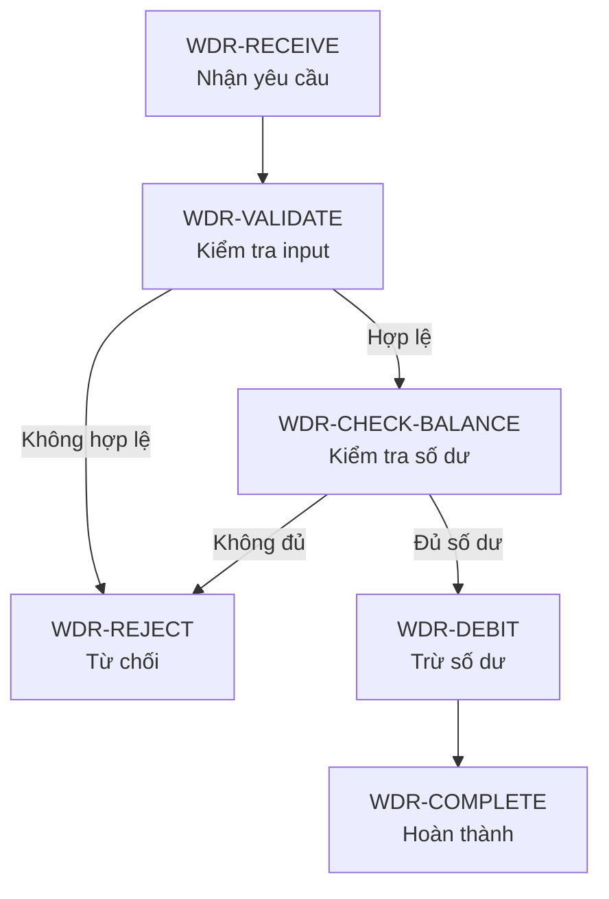
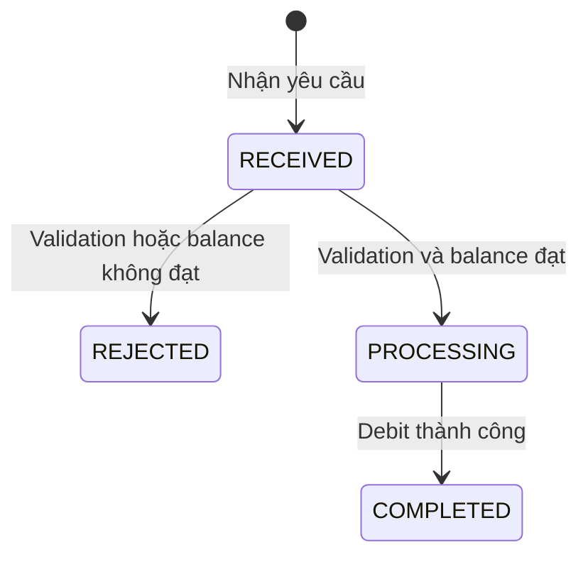

# Trả lời về ID và cách biểu diễn flow

## 1. Xóa hoàn toàn ID và nghiệp vụ cũ

Mình đồng ý với bạn. Tư duy đúng của project này là:

> Bộ tài liệu hiện hành chỉ phản ánh nghiệp vụ mới nhất và đang có hiệu lực. Khi thay đổi, phải cập nhật trọn vẹn mọi nơi liên quan; không giữ lịch sử trong tài liệu hiện hành.

Vì vậy, khi `BAL-RESERVE` không còn được sử dụng:

1. tìm toàn bộ Feature, tài liệu dùng chung, test, forward link và backlink liên quan;
2. với từng nơi, quyết định chuyển sang nghiệp vụ khác hoặc xóa dependency;
3. cập nhật tất cả trong cùng change set;
4. kiểm tra không còn link hoặc tham chiếu sót;
5. xóa hoàn toàn mục `BAL-RESERVE`;
6. không giữ stub `SUPERSEDED`, không giữ danh sách mã cũ trong `INDEX.md`.

Sau này nếu xuất hiện một nghiệp vụ mới thực sự mang nghĩa “reserve balance” thì hoàn toàn có thể dùng lại ID `BAL-RESERVE`.

ID chỉ cần đáp ứng hai điều trong **tài liệu hiện hành**:

- duy nhất, không trùng với mục khác đang tồn tại;
- đúng với ý nghĩa nghiệp vụ hiện tại.

Từ “ổn định” ở đây chỉ nên hiểu là: trong lúc một mục vẫn còn tồn tại, việc đổi câu chữ hoặc tiêu đề trình bày không được làm link đến mục đó bị hỏng. Nó không có nghĩa ID phải được giữ vĩnh viễn sau khi nghiệp vụ đã bị xóa.

Mình đã sửa tài liệu theo đúng nguyên tắc này:

- bỏ danh sách `Mã đã ngừng dùng`;
- bỏ trạng thái `SUPERSEDED`;
- hệ trạng thái tài liệu chỉ còn `DRAFT → IN_REVIEW → APPROVED`;
- quy trình thay đổi bắt buộc cập nhật toàn bộ nơi liên quan rồi xóa sạch nội dung cũ;
- cho phép dùng lại ID đã xóa nếu nó phù hợp với nghiệp vụ hiện hành mới.

## 2. `NEXT / PREVIOUS` có chỉ dùng trong từng Feature không?

Cách hiểu của bạn **gần đúng**: `NEXT / PREVIOUS` mô tả thứ tự các bước trong một **flow nghiệp vụ cụ thể**, và flow đó thường thuộc một Feature.

Tuy nhiên, cần phân biệt hai khái niệm:

| Khái niệm | Câu hỏi nó trả lời |
|---|---|
| Flow step | Sau bước nghiệp vụ này thì thực hiện bước nào? |
| State transition | Khi có sự kiện này, đối tượng chuyển từ trạng thái nào sang trạng thái nào? |

`NEXT / PREVIOUS` nói về **thứ tự bước**, không trực tiếp nói về việc chuyển trạng thái.

### Ví dụ Feature rút tiền



Trong flow này:

```text
WDR-RECEIVE NEXT WDR-VALIDATE
WDR-VALIDATE NEXT WDR-CHECK-BALANCE khi input hợp lệ
WDR-VALIDATE NEXT WDR-REJECT khi input không hợp lệ
WDR-CHECK-BALANCE NEXT WDR-DEBIT khi đủ số dư
WDR-CHECK-BALANCE NEXT WDR-REJECT khi không đủ số dư
```

`PREVIOUS` chỉ là chiều đọc ngược. Ví dụ:

```text
WDR-DEBIT PREVIOUS WDR-CHECK-BALANCE
```

### State transition trong cùng Feature lại là chuyện khác

Flow trên có thể làm trạng thái yêu cầu rút tiền thay đổi:



Ở đây:

- `WDR-VALIDATE → WDR-CHECK-BALANCE` là thứ tự bước trong flow;
- `RECEIVED → PROCESSING` là chuyển trạng thái của yêu cầu rút tiền.

Hai thứ có liên quan nhưng không phải một.

## 3. Flow có thể nằm ngoài Feature không?

Có, nhưng chỉ khi tài liệu dùng chung thực sự **sở hữu một quy trình nghiệp vụ độc lập**.

Ví dụ `IDENTITY-VERIFICATION` là nghiệp vụ dùng chung có flow riêng:

```text
Nhận hồ sơ → Kiểm tra hồ sơ → Yêu cầu bổ sung hoặc Phê duyệt → Hoàn tất
```

Flow này có thể được nhiều Feature sử dụng, nên nó nằm trong tài liệu dùng chung `IDENTITY.md`.

Ngược lại, một chức năng dùng chung đơn lẻ như `BAL-RESERVE` chỉ mô tả:

- input;
- precondition;
- rule;
- output;
- state effect;
- error.

Nó không nên tự ghi rằng bước trước nó là Validate Order hay bước sau nó là Create Order, vì thứ tự đó do từng Feature quyết định.

Quy tắc hợp lý là:

- Feature sở hữu flow thực hiện Feature đó.
- Tài liệu dùng chung chỉ sở hữu flow nếu bản thân nghiệp vụ dùng chung là một quy trình nhiều bước độc lập.
- Một chức năng dùng chung được Feature gọi không tự sở hữu thứ tự trước/sau của Feature.

## 4. Có nên dùng Mermaid cho các flow không?

Có. Mermaid rất phù hợp để Human nhìn nhanh:

- thứ tự các bước;
- các nhánh thành công và từ chối;
- vòng retry;
- điểm gọi sang nghiệp vụ dùng chung;
- trạng thái thay đổi như thế nào.

Nhưng mình không đề xuất dùng Mermaid làm nguồn mô tả duy nhất. Diagram dễ nhìn nhưng không thuận tiện để chứa đầy đủ precondition, guard, input/output và state effect của từng bước.

Cách bố trí tốt nhất là:

### Phần 1 — Bảng flow là nguồn chi tiết

```markdown
| Bước | Nghiệp vụ | Điều kiện vào | Kết quả | Bước tiếp theo | State effect |
|---|---|---|---|---|---|
| `WDR-01` | Nhận yêu cầu | User đã đăng nhập | Ghi nhận yêu cầu | `WDR-02` | Tạo trạng thái `RECEIVED` |
| `WDR-02` | Validate | Có đủ field | Hợp lệ hoặc lỗi validation | `WDR-03` hoặc `WDR-REJECT` | Không đổi balance |
| `WDR-03` | Kiểm tra số dư | Input hợp lệ | Đủ hoặc thiếu số dư | `WDR-04` hoặc `WDR-REJECT` | Không đổi balance |
| `WDR-04` | Dùng `BAL-DEBIT` | Đủ số dư | Debit thành công | `WDR-DONE` | Balance giảm đúng amount |
```

Bảng này phù hợp cho cả AI và Human vì mỗi bước có dữ liệu rõ ràng, có thể tìm kiếm và impact analysis.

### Phần 2 — Mermaid là góc nhìn trực quan

Mermaid được đặt ngay sau bảng để thể hiện cùng flow bằng hình. Nó không được bổ sung rule chỉ có trong hình; mọi rule quan trọng vẫn phải nằm trong bảng hoặc section nghiệp vụ tương ứng.

```text
Bảng flow = nguồn chi tiết có hiệu lực
Mermaid   = góc nhìn trực quan của cùng nội dung
```

Nếu bảng và Mermaid không khớp, phải sửa Mermaid theo bảng.

## 5. Có cần ghi riêng `NEXT / PREVIOUS` nữa không?

Sau khi áp dụng nguyên tắc clean và không lặp dữ liệu không cần thiết, mình thấy **không nên giữ `NEXT / PREVIOUS` như một loại link hai chiều bắt buộc**.

Lý do:

- cột `Bước tiếp theo` trong bảng flow đã thể hiện `NEXT`;
- từ bảng có thể suy ra bước trước, nên ghi thêm `PREVIOUS` là lặp dữ liệu;
- Mermaid cũng được sinh từ cùng thứ tự đó;
- forward/backlink nên tập trung vào dependency giữa các nghiệp vụ, không dùng để lặp lại thứ tự nội bộ của một flow.

Đề xuất đơn giản hơn:

```text
Dependency giữa tài liệu:
CONTAINS / PART_OF
USES / USED_BY
READS_STATE / STATE_READ_BY
CHANGES_STATE / STATE_CHANGED_BY

Thứ tự trong flow:
Bảng flow với “Bước tiếp theo”
+ Mermaid khi flow đủ phức tạp để cần hình
```

Với flow rất đơn giản chỉ có hai hoặc ba bước thẳng, danh sách đánh số hoặc bảng là đủ, không bắt buộc Mermaid. Với flow có nhánh, retry, nhiều state hoặc đi qua nhiều nghiệp vụ dùng chung, nên có Mermaid.

Mình khuyến nghị sửa tài liệu theo hướng này: bỏ `NEXT / PREVIOUS` khỏi bảng quan hệ hai chiều và bổ sung quy ước **bảng flow là nguồn chi tiết, Mermaid là góc nhìn trực quan**. Phần này mình chưa sửa để bạn xác nhận trước.

Thay đổi về việc xóa sạch ID/nghiệp vụ cũ và toàn bộ câu trả lời này đã được commit, push lên `origin/master`.
