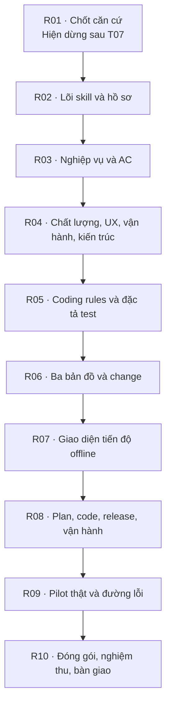

Đã ghi nhận phần bạn vừa duyệt, khép **T07 — version và bản đang chạy**, và rà soát lại thiết kế, roadmap, kịch bản nghiệm thu cùng tiêu chí chất lượng. **Các quyết định deploy/version đã được đưa vào tài liệu và có task phụ trách; chưa phải năng lực đã triển khai.** Mình đã đồng bộ những chỗ còn lệch và chưa mở task tiếp theo.

## 1. Kidea hiện đang ở đâu?

- **R01 đã khép T01–T07**: phạm vi, tổ chức hồ sơ, nền tảng, pilot, Git/quyền/checkpoint và version/release.
- **Còn T08–T10**: chốt nhóm kịch bản, cách kiểm chứng/đo và duyệt khép căn cứ.
- **R02–R10 chưa bắt đầu.** Chưa xây/cài skill, code pilot hoặc chạy bộ nghiệm thu.
- Toàn roadmap có **10 phase, 83 task**. Mới R01 được phân rã thành 31 subtask; số lượng này không thể quy đổi thành phần trăm hoặc thời gian hoàn thành.

Nền đã chọn vẫn giữ nguyên: Kidea trên Windows; backend C++20/Ubuntu; web SvelteKit/TypeScript; Android Kotlin/Compose và iOS Swift/SwiftUI. Pilot vẫn là **đăng ký workshop, lab dữ liệu giả, ngân sách phát sinh 0 đồng**; Thuận Thiên để sau.

## 2. Tổng quan lộ trình xây Kidea

Mỗi mũi tên cần đủ kiểm chứng, Human approval và quyền tương ứng; không tự động chuyển phase.

| Phase | Task | Kết quả chính |
|---|---:|---|
| R01 | 10 | Chốt căn cứ, phạm vi, chính sách và cách nghiệm thu |
| R02 | 11 | Lõi skill: đọc/ghi hồ sơ, init/status/approve/resume, lưu việc dở; thử helper và phiên AI mới ngay từ đây |
| R03 | 6 | Phương pháp Feature Map, nghiệp vụ, rule/flow/AC/business test; áp dụng vào hồ sơ workshop |
| R04 | 6 | Chất lượng, UX/SEO, monitoring/admin, kiến trúc, API/event/dữ liệu |
| R05 | 7 | Quy tắc code từng nền tảng, môi trường và đặc tả test; kiểm tra bằng mẫu/build nhỏ |
| R06 | 11 | Ba bản đồ, liên kết đặc tả–code–test, phân tích ảnh hưởng, change và resume sâu |
| R07 | 5 | HTML tiến độ offline, chỉ đọc; đúng nguồn, an toàn và dùng được |
| R08 | 6 | Hướng dẫn và đường thực thi lập kế hoạch, code, build, deploy, release, khôi phục và vận hành |
| R09 | 14 | Dùng Kidea xây workshop thật; thử thay đổi giữa MVP/sau release, hotfix, gián đoạn và phục hồi |
| R10 | 7 | Đóng gói/cài/nâng cấp/gỡ, kiểm tra ma trận hỗ trợ, hồi quy và bàn giao |

**Không đợi R09 mới test.** Lõi, hướng dẫn, profile, bản đồ và giao diện đều có kiểm chứng ngay tại task xây chúng; R09 chứng minh luồng đầu–cuối trên pilot thật.

Đây là **10 phase xây Kidea**, khác với **10 bước Kidea hướng dẫn phát triển một sản phẩm**. [Roadmap đầy đủ và điều kiện từng phase](https://github.com/Kynderis/kidea/blob/master/KIDEA_ROADMAP.md#phase-overview).

## 3. Các quyết định deploy/version đã được ghi ở đâu?

| Nội dung đã chốt | Cách tài liệu/roadmap giữ quyết định |
|---|---|
| Một master, nhánh bảo trì khi cần | DESIGN G1/G3 và luồng hotfix; R06/R08 xây, R09 thử. Không branch riêng cho từng Feature |
| Điều khiển kiểm tra/build từ local, chưa cần dịch vụ CI | G3 và R08; vẫn giữ bộ lệnh chuẩn, bằng chứng và kiểm chứng Ubuntu/Mac/thiết bị đích |
| AI deploy DEV, Human trực tiếp chạy PROD | G3; quyền theo project, đúng target và bộ script đã xác minh. Credential/quyền thực tế phải được bảo vệ |
| Một điểm vào deploy, dùng đúng gói/config/script | R08: dùng chung cơ chế DEV/PROD cho cùng loại thành phần, khác cấu hình/quyền; không tự lấy master mới nhất rồi build tại PROD |
| Chất lượng sau mỗi Feature | G2: test task trong lúc làm, lượt cuối toàn dự án khi khép Feature; đầu vào đổi phải kiểm chứng lại đúng quy tắc, không thay bằng kết quả Feature cũ |
| Version sản phẩm/thành phần, build và tag | G5: lớn.nhỏ.vá theo tương thích; thành phần không đổi giữ gói cũ; tag phát hành không bị dời, version/tag không thay nhận diện artifact |
| Hồ sơ release và từng lần triển khai | G6 vừa duyệt: cố định tổ hợp được chọn trước deploy; từng lần chạy gắn đúng hồ sơ/revision, giữ lỗi/chưa xác nhận và các lần retry |
| Hotfix, rollback và restore | Vá đúng nền production; mỗi fix phải có kết luận trên master, giữ Feature dở và các patch trước. Rollback ứng dụng không âm thầm phục hồi database |
| Vận hành và triển khai nâng cao | Có readiness, cảnh báo/job độc lập phiên AI, xác nhận bản thực chạy và xử lý sự cố. A/B theo nhu cầu; không mặc định phải xây Kubernetes, canary tự động hoặc portal online |

Bảng truy xuất chi tiết **nguồn chính sách → task triển khai → case kiểm chứng** đã nằm ngay trong [phần rà soát roadmap](https://github.com/Kynderis/kidea/blob/master/KIDEA_ROADMAP.md#overall-review). Không thêm một tài liệu quản lý song song.

## 4. Những chỗ đã sửa sau rà soát

- **Hotfix:** sửa KA-19/R09-T10 để không bị hiểu thành chỉ test vùng ảnh hưởng. Bản kết hợp đổi đầu vào vẫn phải chạy toàn lượt G2; Feature dở chưa được ghi hoàn tất.
- **Release:** làm rõ hồ sơ được lập trước triển khai; bổ sung liên kết revision–lần thực thi, giữ lần lỗi và kiểm tra dữ liệu không được phép chia sẻ.
- **MVP:** bỏ câu dễ gợi một luồng tạm dừng/resume riêng khi chỉ điều chỉnh chính kế hoạch MVP.
- **R05:** mẫu/build nhỏ không được tính là đã kiểm chứng triển khai/vận hành thật.
- **Trạng thái:** bỏ những việc đã chốt khỏi danh sách “còn mở”; khép T07, giữ T08 chưa mở.

Đã kiểm tra 217 liên kết nội bộ của bốn tài liệu chính, cấu trúc bảng/anchor, 83 task, 30 họ kịch bản, trạng thái và source Mermaid. **Giữ nguyên phần kiểm tra cuối G2 và toàn bộ QUALITY**; các ngưỡng QUALITY vẫn chưa duyệt, các case chưa chạy.

Tài liệu và [bản trả lời này](https://github.com/Kynderis/kidea/blob/master/answer.md) đã được đẩy lên GitHub, đối chiếu với bản local. Hiện dừng tại đây để bạn xem tổng quan; chưa cần duyệt thêm gói mới.

<oai-mem-citation>
<citation_entries>
MEMORY.md:50-52|note=[current only documentation full caller audit and scoped answer publication reverified]
</citation_entries>
<rollout_ids>
01a064b8-dde1-7882-acc1-7d02d6f568c8
</rollout_ids>
</oai-mem-citation>
