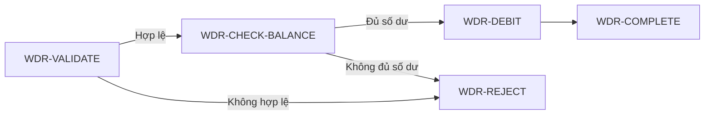

# Trả lời ba điểm còn thắc mắc

## 1. Có nên xóa hẳn nghiệp vụ cũ khỏi tài liệu hiện hành?

Bạn hiểu đúng. Quy tắc trước đó của mình quá cứng khi yêu cầu mặc định giữ nguyên mục cũ dưới trạng thái `SUPERSEDED`.

Điều bắt buộc phải giữ là **khả năng phân tích và cập nhật tất cả nơi đang dùng**, không phải giữ toàn bộ nội dung cũ mãi mãi trong tài liệu hiện hành.

### Trường hợp chỉ cập nhật nghiệp vụ

Nếu mục đích và trách nhiệm vẫn là “reserve số dư”, nhưng ta thay đổi một số rule như:

- thêm điều kiện số tiền phải lớn hơn `0`;
- đổi cách làm tròn;
- bổ sung một mã lỗi;
- điều chỉnh công thức tính số tiền cần reserve;

thì vẫn giữ ID `BAL-RESERVE`.

Quy trình đúng là:

1. đưa tài liệu về `DRAFT` nếu trước đó đã được duyệt;
2. tìm tất cả Feature, tài liệu và test đang dùng `BAL-RESERVE`;
3. phân tích từng nơi xem có cần cập nhật không;
4. cập nhật hoặc ghi rõ “không cần đổi” kèm lý do;
5. Human duyệt lại toàn bộ impact list.

Không cần tạo ID mới chỉ vì rule được cập nhật.

### Trường hợp nghiệp vụ thực sự bị thay bằng một nghiệp vụ khác

Chỉ tạo ID mới khi **ý nghĩa hoặc trách nhiệm đã đổi thành một contract nghiệp vụ khác**.

Ví dụ:

```text
BAL-RESERVE
= chuyển tiền từ available sang reserved ngay lập tức
```

được thay bằng:

```text
BAL-HOLD
= tạo một khoản hold có thời hạn, có thể gia hạn, capture một phần hoặc hết hạn
```

Hai nghiệp vụ này có vòng đời, state và hành vi khác nhau. Khi đó ta tạo `BAL-HOLD`, nhưng vẫn bắt buộc phân tích mọi nơi đang dùng `BAL-RESERVE`:

- nơi nào phù hợp với mô hình mới thì chuyển sang `BAL-HOLD`;
- nơi nào vẫn cần hành vi khác thì chuyển sang dependency phù hợp khác;
- nơi nào không còn cần reserve thì xóa dependency;
- test, forward link, backlink và `INDEX.md` phải được cập nhật cùng lúc.

Sau khi không còn tài liệu hiện hành nào dùng `BAL-RESERVE`, ta có thể xóa toàn bộ nội dung cũ khỏi tài liệu hiện hành.

### Vậy còn `SUPERSEDED` để làm gì?

`SUPERSEDED` chỉ nên dùng tạm thời khi có lý do cụ thể, chẳng hạn:

- đang trong giai đoạn chuyển đổi và chưa thể cập nhật hết các consumer trong cùng một lần;
- có tài liệu hoặc hệ thống bên ngoài repository vẫn đang link đến mã cũ;
- Human cần duy trì song song nghiệp vụ cũ và mới trong một khoảng thời gian.

Nếu đã cập nhật được tất cả nơi dùng thì không cần giữ cả mục cũ làm rác.

Để tránh sau này vô tình lấy `BAL-RESERVE` đặt cho một nghĩa hoàn toàn khác, `INDEX.md` chỉ giữ một dòng rất ngắn:

```markdown
| Mã | Nghĩa cũ | Mã thay thế | Ngừng dùng tại revision |
|---|---|---|---|
| `BAL-RESERVE` | Reserve balance theo mô hình cũ | `BAL-HOLD` | `abc1234` |
```

Đây không phải là giữ lại nghiệp vụ cũ. Nó chỉ là danh sách mã đã ngừng dùng. Nội dung đầy đủ và lý do thay đổi đã có Git history lưu lại.

Quy tắc sau khi chỉnh lại là:

| Tình huống | Xử lý ID |
|---|---|
| Cùng mục đích, chỉ thay rule/điều kiện/output | Giữ ID cũ và impact analysis tất cả consumer |
| Đổi thành trách nhiệm nghiệp vụ khác | Tạo ID mới và di chuyển từng consumer sau phân tích |
| Mã cũ không còn consumer | Xóa nội dung cũ; chỉ ghi một dòng mã đã ngừng dùng |
| Còn giai đoạn chuyển tiếp hoặc tham chiếu ngoài | Tạm giữ mục `SUPERSEDED` và link sang mục mới |

Mình đã cập nhật quy tắc này nhất quán tại mục 2.3, mục 4, mục 5 và mục 7.3 của tài liệu.

## 2. Cách hiểu về AC và Business Test Specification

Cách hiểu của bạn **gần đúng**, nhưng cần sửa phần “đảm bảo với mọi trường hợp”.

### AC

AC là các hành vi hoặc điều kiện lớn mà Feature bắt buộc phải đạt để Human chấp nhận Feature đó.

Ví dụ:

```text
Khi tài khoản hợp lệ và đủ số dư, yêu cầu rút tiền hợp lệ phải được chấp nhận,
đồng thời số dư giảm đúng số tiền rút.
```

### Business Test Specification

Business Test Specification biến AC và các rule chi tiết thành những trường hợp kiểm chứng cụ thể, gồm:

- trường hợp phổ thông;
- ranh giới;
- trường hợp không hợp lệ;
- trường hợp hiếm nhưng có rủi ro hoặc ý nghĩa nghiệp vụ;
- state và chuỗi sự kiện quan trọng;
- kết quả và final state mong đợi.

Tuy nhiên, nó **không cố liệt kê mọi giá trị và mọi chuỗi có thể tồn tại**, vì điều đó thường là vô hạn hoặc quá lớn như mục 2.4 đã giải thích.

Nó phải bảo đảm bao phủ đầy đủ **mô hình hữu hạn và phạm vi test đã được Human duyệt**, chứ không tuyên bố bao phủ toàn bộ không gian thực tế.

Ngoài ra, Business Test Specification mới chỉ xác định:

> Với tình huống này, kết quả đúng phải là gì?

Nó chưa tự chứng minh phần mềm hoạt động đúng. Chỉ khi các test tương ứng được triển khai và chạy thành công thì ta mới có bằng chứng implementation đang đáp ứng đặc tả.

Có thể hiểu ngắn gọn:

| Thành phần | Vai trò |
|---|---|
| AC | Feature phải đạt những hành vi lớn nào? |
| Business Test Specification | Dùng những tình huống cụ thể nào để kiểm chứng AC và rule? |
| Test được triển khai và thực thi | Phần mềm thực tế có cho ra kết quả đã đặc tả không? |

Một câu diễn đạt chính xác hơn cho ý của bạn là:

> Business Test Specification bao phủ trường hợp phổ thông, ranh giới, trường hợp hiếm hoặc khó có ý nghĩa và rủi ro; qua đó kiểm chứng Feature trên phạm vi nghiệp vụ hữu hạn đã được Human chốt.

## 3. `NEXT / PREVIOUS` có tác dụng khi nào?

`NEXT / PREVIOUS` dùng để mô tả **thứ tự giữa các bước trong một flow cụ thể**.

Ví dụ flow rút tiền:



Quan hệ xuôi:

```text
WDR-VALIDATE
    NEXT, khi input hợp lệ
WDR-CHECK-BALANCE
```

Quan hệ ngược tại `WDR-CHECK-BALANCE`:

```text
WDR-CHECK-BALANCE
    PREVIOUS, trong nhánh input hợp lệ
WDR-VALIDATE
```

### Nó hữu ích trong các trường hợp sau

#### 1. Các bước nằm ở nhiều section hoặc nhiều file

Ví dụ validate nằm trong Feature, kiểm tra balance nằm trong tài liệu dùng chung và debit nằm ở tài liệu khác. `NEXT` giúp lần theo flow qua các file mà không phải đoán bước tiếp theo.

#### 2. Flow có nhiều nhánh

Từ `WDR-VALIDATE`:

- hợp lệ thì `NEXT` là `WDR-CHECK-BALANCE`;
- không hợp lệ thì `NEXT` là `WDR-REJECT`.

Vì vậy quan hệ phải đi kèm tên flow hoặc điều kiện nhánh. Nếu chỉ ghi `NEXT` mà không ghi điều kiện thì vẫn mơ hồ.

#### 3. Có retry hoặc vòng lặp hợp lệ

Ví dụ:

```text
PAYMENT-FAILED --[User retry]--> PAYMENT-PROCESSING
```

Quan hệ `NEXT` cho thấy đây là vòng lặp có chủ ý, không phải link nhầm.

#### 4. Khi thay đổi thứ tự flow

Nếu `WDR-CHECK-KYC` được chèn vào giữa Validate và Check Balance, AI có thể phát hiện và cập nhật:

```text
Trước:
WDR-VALIDATE → WDR-CHECK-BALANCE

Sau:
WDR-VALIDATE → WDR-CHECK-KYC → WDR-CHECK-BALANCE
```

Backlink `PREVIOUS` giúp phát hiện `WDR-CHECK-BALANCE` vẫn đang trỏ ngược về bước cũ hay chưa.

### Có cần dùng cho mọi flow không?

Không nên.

Nếu một flow đơn giản, nằm trọn trong một file và đã có bảng hoặc danh sách đánh số rõ ràng:

```text
1. Validate
2. Check balance
3. Debit
4. Complete
```

thì thêm `NEXT / PREVIOUS` cho từng bước chỉ làm tài liệu nặng và lặp thông tin.

Mình đề xuất quy tắc gọn hơn:

- Flow đơn giản trong cùng một section/file: dùng danh sách hoặc bảng thứ tự, không bắt buộc `NEXT / PREVIOUS`.
- Flow đi qua nhiều section/file, có nhánh, retry hoặc bước được tái sử dụng: dùng `NEXT / PREVIOUS`, kèm flow ID và điều kiện nhánh.

Như vậy ta vẫn dựng được flow graph khi thực sự cần nhưng không biến mọi tài liệu đơn giản thành một mạng link rườm rà. Mình chưa sửa phần này trong tài liệu, chờ bạn xác nhận cách giới hạn trên.

Các thay đổi về ID cũ và toàn bộ câu trả lời này đã được commit, push lên `origin/master`.

<oai-mem-citation>
<citation_entries>
MEMORY.md:51-51|note=[avoided carrying over discarded Kidea design decisions]
</citation_entries>
<rollout_ids>
01a0389b-4126-7403-a368-d79d5bac0d69
</rollout_ids>
</oai-mem-citation>
