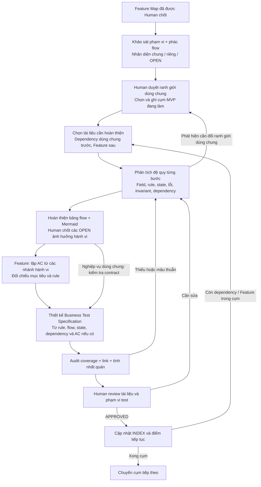

Mình thấy nên **gộp bước xác định Feature với phác flow**, dùng **lỗi đầu tiên theo thứ tự kiểm tra đã chốt**, và quy định cách sinh AC bằng điều kiện logic. Dưới đây là cách cụ thể.

**1. State là thông tin về tình trạng hiện tại của đối tượng nghiệp vụ**

State không chỉ là một nhãn như `ĐANG_GIAO`. Nó gồm những thông tin hiện tại có ảnh hưởng đến kết quả xử lý.

Ví dụ:

| Nghiệp vụ | State trước yêu cầu | Yêu cầu | State sau xử lý |
|---|---|---|---|
| Hủy đơn | O1 thuộc U1, trạng thái chờ xử lý | U1 hủy O1 | Chủ đơn vẫn U1, trạng thái thành đã hủy |
| Hủy đơn | O1 thuộc U1, trạng thái đang giao | U1 hủy O1 | Giữ nguyên |
| Reserve tiền | Available = 100, reserved = 20 | Reserve 30 | Available = 70, reserved = 50 |

Trong ví dụ cuối, `30` là **input của yêu cầu**, còn `100` và `20` là **state trước yêu cầu**. Cùng input reserve 30, nếu available chỉ còn 10 thì kết quả sẽ khác.

“Làm rõ state” nghĩa là xác định **thông tin nào cần xét, ai sở hữu nó, giá trị hợp lệ là gì, khi nào đổi và khi nào phải giữ nguyên**. Chưa cần quyết định lưu ở bảng database nào.

**2. Bạn đúng về việc trả lỗi đầu tiên trong flow**

Nếu flow đã quy định:

1. kiểm tra chủ đơn; sai thì trả `NOT_OWNER` và kết thúc;
2. kiểm tra trạng thái; sai thì trả `INVALID_STATUS` và kết thúc;
3. cả hai đạt thì hủy;

thì trường hợp sai cả hai chắc chắn trả `NOT_OWNER`. **Không cần thêm một rule riêng lặp lại ưu tiên đó.** Cách mình đề xuất thêm R5 trước đây là thừa nếu bảng flow đã mô tả đủ như trên.

Ta chỉ cần thống nhất nguyên tắc: **trả lỗi đầu tiên theo thứ tự kiểm tra trong flow và dừng nhánh xử lý đó**.

“Đầu tiên” là thứ tự nghiệp vụ đã chốt, không phải lỗi nào tình cờ được code phát hiện nhanh nhất. Nếu đổi thứ tự flow, mã lỗi có thể đổi, nên phải phân tích ảnh hưởng tới AC/test.

**3. Xác định Feature và phác flow nên làm cùng nhau**

Bạn nhận xét đúng về việc hai bước đang chồng lấn.

Từ Feature Map, ta có thể nhận diện sơ bộ ứng viên dùng chung: đặt đơn và hủy đơn đều liên quan đến tồn kho chẳng hạn. Nhưng phải phác flow mới biết chính xác mỗi Feature cần đọc, giữ, trừ hay trả tồn kho.

Vì vậy mình đề xuất một bước:

> **Khảo sát mục tiêu/phạm vi và phác flow → nhận diện phần dùng chung, phần riêng, điểm chưa rõ.**

Danh sách dùng chung lúc này là đề xuất. Human duyệt ranh giới trước khi AI đặc tả sâu; khi phân tích sâu phát hiện thêm dependency thì quay lại cập nhật.

**4. Có thể sinh AC theo công thức không? Có, trong phạm vi mô hình đã xác định**

Ta có thể đặt một quy tắc sinh AC rõ ràng cho phương pháp này. Không có công thức tự biến một yêu cầu ngôn ngữ tự nhiên còn mơ hồ thành bộ AC chắc chắn đầy đủ.

Với mỗi **nhánh hành vi khả thi** của flow, viết AC theo dạng:

```text
Điều kiện ban đầu + sự kiện/input
⇒ output mong đợi + state sau xử lý + các điều phải giữ
```

Ví dụ hủy đơn, giả sử người dùng đã đăng nhập và đơn tồn tại:

- `P`: người yêu cầu là chủ đơn.
- `Q`: đơn đang chờ xử lý.
- Flow kiểm tra P trước Q và dừng ở lỗi đầu tiên.

Khi đó suy ra:

| AC | Điều kiện logic | Kết quả bắt buộc |
|---|---|---|
| AC1 | `¬P` | `NOT_OWNER`; state giữ nguyên |
| AC2 | `P ∧ ¬Q` | `INVALID_STATUS`; state giữ nguyên |
| AC3 | `P ∧ Q` | Thành công; trạng thái đơn thành đã hủy, chủ đơn giữ nguyên |

`¬` nghĩa là “không”; `∧` nghĩa là “và”.

Với n điều kiện kiểm tra tuần tự `P1, P2, …, Pn`, sai là dừng:

```text
Nhánh lỗi thứ i:
P1 ∧ P2 ∧ … ∧ P(i−1) ∧ ¬Pi ⇒ lỗi Ei

Nhánh thành công:
P1 ∧ P2 ∧ … ∧ Pn ⇒ thành công
```

Nếu không có nhánh nào khác, ta có **tối đa n + 1 AC cho các nhánh này**, sau khi loại nhánh bất khả thi.

Không cần tạo `2^n` AC. Trong ví dụ hai điều kiện, cả `¬P ∧ Q` và `¬P ∧ ¬Q` đều thuộc AC1. Nhưng test vẫn có thể kiểm tra cả hai để xác nhận ưu tiên lỗi.

Để việc sinh AC có quy luật, mình đề xuất:

1. Liệt kê các nhánh hành vi khả thi cùng điều kiện và kết quả/state.
2. Mỗi nhánh tạo một AC ứng viên.
3. Chỉ gộp các nhánh có cùng nghĩa vụ về output, state và hiệu ứng nghiệp vụ; điều kiện được nối bằng “hoặc”.
4. Kiểm tra mọi tình huống trong phạm vi mô hình đều được xử lý, không có hai AC đòi kết quả mâu thuẫn cho cùng tình huống.
5. Đối chiếu lại yêu cầu gốc và các invariant — điều phải luôn đúng — để bắt yêu cầu chưa được flow thể hiện.

**Công thức n + 1 chỉ áp dụng cho chuỗi kiểm tra dừng ở lỗi đầu tiên.** Flow có vòng lặp, nhiều sự kiện hoặc thay đổi state giữa các bước phải mô tả thêm các chuyển trạng thái và nghĩa vụ tương ứng; không thể lấy n + 1 áp dụng cho mọi Feature.

AC thu được vẫn là **ứng viên để Human review**: suy luận đúng từ flow chưa chứng minh flow đã bao gồm đủ nhu cầu của Human.

**5. Quy trình tổng thể đề xuất**



Trong bước thiết kế test, lựa chọn các lớp phù hợp: **ví dụ chấp nhận; lớp giá trị/ranh giới; tổ hợp điều kiện; chuyển trạng thái/chuỗi sự kiện; invariant; contract dùng chung; flow hoàn chỉnh; retry/lỗi/xen kẽ sự kiện khi liên quan**. Mỗi test ghi input/state ban đầu, sự kiện, output/state cuối và link căn cứ.

Điều kiện hoàn tất là: không còn `OPEN` làm kết quả mơ hồ; coverage đã được đối chiếu với mô hình; tài liệu, AC, test và link khớp nhau; Human duyệt. Khi một phần đã có thay đổi, áp dụng impact analysis đệ quy đã thống nhất để cập nhật toàn bộ phần liên quan.

Những điều chỉnh mình khuyến nghị là **gộp hai bước khảo sát; bỏ rule ưu tiên lỗi bị lặp; dùng cách sinh AC có điều kiện logic như trên**. Nghiệp vụ dùng chung vẫn có test contract đầy đủ, chưa cần ép thêm một bảng AC riêng nếu chỉ lặp lại contract.

Đây là đề xuất quy trình để ta xem xét, chưa sửa tài liệu phương pháp. Câu trả lời đã được lưu vào [answer.md](https://github.com/Kynderis/kidea/blob/master/answer.md) và push lên GitHub.
