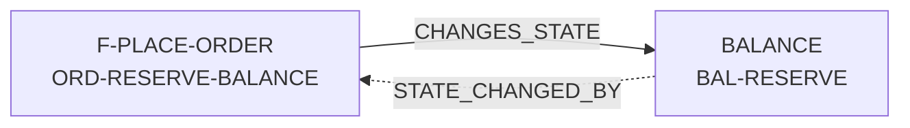

# Giải đáp các câu hỏi về tài liệu nghiệp vụ

Mình đã ghi nhận việc chỉ tập trung vào **cấu trúc, cách bố trí và flow tài liệu**. Phần thiết kế test từ mục 8 trở đi sẽ để lại bàn sau.

Riêng yêu cầu số 3 đã đủ rõ nên mình đã cập nhật trực tiếp vào mục 6.1 của `cach_tao_dac_ta_nghiep_vu_voi_ai.md`. Những phần còn lại dưới đây mới là giải thích và đề xuất, chưa tự ý sửa quy tắc.

## 1. Không xóa hoặc tái sử dụng mã cũ cho nghĩa khác

Hãy hình dung mã như `BAL-RESERVE` là **địa chỉ cố định** của một nghiệp vụ, giống địa chỉ một trang web.

Ví dụ ban đầu:

```text
BAL-RESERVE = chuyển một số tiền từ available sang reserved
```

Sau này ta không còn dùng cách này và thay bằng nghiệp vụ mới `BAL-HOLD`. Ta không được:

- xóa hẳn `BAL-RESERVE`; hoặc
- dùng lại tên `BAL-RESERVE` cho một nghiệp vụ khác, chẳng hạn “khóa toàn bộ tài khoản”.

Nếu làm vậy, các Feature, test hoặc lịch sử thay đổi đang trỏ đến `BAL-RESERVE` sẽ dẫn đến nội dung sai hoặc mất dấu nghiệp vụ cũ.

Cách đúng là giữ mục cũ:

```markdown
## BAL-RESERVE

**Status:** `SUPERSEDED`

Nghiệp vụ này không còn được sử dụng. Được thay thế bởi
[BAL-HOLD](#bal-hold).
```

Nhờ vậy:

- link cũ vẫn mở được;
- người đọc biết nghiệp vụ cũ từng có nghĩa gì;
- biết nó được thay bằng mục nào;
- lịch sử quyết định và test cũ vẫn truy ngược được.

Tóm lại: **một mã đã được cấp thì mã đó gắn vĩnh viễn với một nghĩa nghiệp vụ**. Có thể sửa và duyệt lại nghĩa đó; nhưng nếu thay bằng một khái niệm khác thì tạo mã mới và cho mã cũ trỏ sang mã mới.

## 2. Vì sao không thể test mọi giá trị và mọi chuỗi trạng thái?

### Vấn đề cơ bản

Giả sử nghiệp vụ rút tiền nhận `amount`. Giá trị có thể là `1`, `2`, `2.5`, `99.99`, hàng triệu giá trị khác, thậm chí rất nhiều số thập phân. Ta không thể viết một test cho từng con số.

Nếu nghiệp vụ còn phụ thuộc vào:

- trạng thái tài khoản: `ACTIVE` hoặc `FROZEN`;
- số dư: đủ hoặc thiếu;
- KYC: đạt hoặc chưa đạt;
- loại tiền: VND, USD, EUR;
- sự kiện trước đó: đã rút, đã hoàn tiền, đã retry...

thì số tổ hợp tăng rất nhanh. Ví dụ chỉ với 4 nhóm số tiền × 2 trạng thái tài khoản × 2 trạng thái KYC × 3 loại tiền đã có `4 × 2 × 2 × 3 = 48` tổ hợp. Khi thêm nhiều bước liên tiếp, retry hoặc vòng lặp, số chuỗi có thể gần như không có giới hạn thực tế.

Vì vậy ta không kiểm tra từng giá trị. Ta tạo một **mô hình hữu hạn**, tức là gom không gian rất lớn thành số nhóm hành vi hữu hạn có ý nghĩa nghiệp vụ.

### Các khái niệm

| Khái niệm | Giải thích dễ hiểu | Ví dụ với số dư `100` |
|---|---|---|
| Lớp tương đương | Nhóm các giá trị mà nghiệp vụ xử lý giống nhau; chọn vài đại diện thay vì test tất cả | Mọi `amount < 0` đều không hợp lệ; chọn `-1` làm đại diện |
| Ranh giới | Giá trị ngay dưới, đúng tại và ngay trên điểm đổi hành vi | Với giới hạn `100`: test `99`, `100`, `101` |
| Mô hình hữu hạn | Chuyển vô số giá trị thực thành số trạng thái/nhóm có thể liệt kê | `INVALID`, `WITHIN_BALANCE`, `EXACT_BALANCE`, `OVER_BALANCE` |
| Tích Descartes | Lấy mọi tổ hợp giữa tất cả nhóm đầu vào và trạng thái | 4 nhóm amount × 2 trạng thái account = 8 tổ hợp |
| Exhaustive | Test toàn bộ tổ hợp, nhưng chỉ khả thi khi mô hình nhỏ | Test đủ cả 8 tổ hợp trên nếu cả 8 đều hợp lệ và quan trọng |
| Decision table | Bảng điều kiện nào kết hợp với nhau thì cho kết quả nào | `ACTIVE + đủ tiền → cho rút`; `FROZEN → từ chối` |
| State transition | Kiểm tra một sự kiện làm trạng thái đổi từ đâu sang đâu | `PENDING --approve--> COMPLETED` |
| Sequence test | Kiểm tra nhiều sự kiện theo đúng thứ tự | `request → approve → retry` |
| Property / invariant | Điều phải luôn đúng với nhiều giá trị hoặc sau nhiều bước | Số dư không bao giờ âm |
| Pairwise / 2-way | Chọn test sao cho mọi cặp giá trị giữa hai yếu tố từng xuất hiện cùng nhau ít nhất một lần | Mỗi trạng thái account từng được ghép với mỗi trạng thái KYC |
| t-way | Mở rộng pairwise: bảo đảm mọi tổ hợp của `t` yếu tố từng xuất hiện; `t` càng lớn càng nhiều test | 3-way kiểm tra tương tác của từng bộ ba yếu tố |

### Ví dụ rút tiền

Quy tắc:

```text
Tài khoản phải ACTIVE.
amount phải lớn hơn 0 và không vượt quá available balance.
Thành công thì available balance giảm đúng amount.
Thất bại thì balance giữ nguyên.
Balance không bao giờ âm.
```

Với số dư `100`, ta không test mọi số. Ta ưu tiên:

- `-1`, `0`, `1`: ngay quanh ranh giới hợp lệ thấp nhất;
- `99`, `100`, `101`: ngay quanh số dư hiện có;
- trạng thái `ACTIVE` và `FROZEN`;
- một vài tổ hợp bắt buộc như `FROZEN + amount=1` và `FROZEN + amount=101` để xác nhận tài khoản bị khóa luôn bị từ chối và không đổi số dư.

Pairwise hay `t-way` chỉ là cách giảm số tổ hợp còn lại. Chúng **không thay thế** các test được rule gọi tên, ranh giới quan trọng, transition bắt buộc hoặc rủi ro cao.

Ý chính của mục 2.4 là: không hứa “test mọi trường hợp có thể tồn tại”; thay vào đó phải nói rõ **mô hình nào đã được bao phủ, giá trị đại diện nào được chọn, ranh giới nào đã kiểm tra và phần nào còn rủi ro**.

## 3. Ghi nhớ cụm Feature đang làm

Mình đồng ý và đã bổ sung yêu cầu này vào mục 6.1.

Không cần tạo file mới. Trong `INDEX.md` sẽ có phần `Cụm Feature đang đặc tả`, ví dụ:

```markdown
## Cụm Feature đang đặc tả

| Cụm | Feature | Dùng chung bắt buộc | Đang xử lý | Sau khi xong quay lại |
|---|---|---|---|---|
| `ORDER-MVP-01` | `F-PLACE-ORDER`, `F-CANCEL-ORDER` | `BALANCE`, `ORDER-STATE` | `BALANCE#BAL-RESERVE` | `F-PLACE-ORDER#ORD-RESERVE-BALANCE` |
```

Khi tạm rời Feature để hoàn thiện một phần dùng chung, cột `Sau khi xong quay lại` giữ đúng điểm phải tiếp tục. Mỗi lần chuyển bước, AI phải cập nhật bảng này. Đây chỉ là trạng thái công việc, không thay thế trạng thái duyệt `DRAFT / IN_REVIEW / APPROVED / SUPERSEDED` của tài liệu.

## 4. AC và Business Test Specification khác nhau thế nào?

`AC` là viết tắt của **Acceptance Criteria — tiêu chí chấp nhận**. Nó trả lời:

> Feature phải thỏa những điều kiện lớn nào để Human chấp nhận rằng nghiệp vụ đã được mô tả đúng?

`Business Test Specification` là **đặc tả kiểm thử nghiệp vụ chi tiết**. Nó đưa các rule và AC thành những tình huống có initial state, input, kết quả và final state cụ thể.

Ví dụ Feature “Rút tiền”:

### AC

```text
AC-01: Khi tài khoản ACTIVE và có đủ số dư, yêu cầu rút hợp lệ được chấp nhận
       và số dư giảm đúng số tiền rút.

AC-02: Khi số tiền vượt số dư, yêu cầu bị từ chối và số dư không đổi.

AC-03: Khi tài khoản FROZEN, mọi yêu cầu rút bị từ chối và số dư không đổi.
```

AC mô tả hành vi cần đạt nhưng chưa liệt kê mọi ví dụ số cụ thể.

### Business Test Specification

| Test | Căn cứ | Initial state | Input/event | Expected output | Expected final state |
|---|---|---|---|---|---|
| `BTS-001` | `AC-01` | `ACTIVE`, balance `100` | Rút `40` | Chấp nhận | Balance `60` |
| `BTS-002` | `AC-01` | `ACTIVE`, balance `100` | Rút `100` | Chấp nhận | Balance `0` |
| `BTS-003` | `AC-02` | `ACTIVE`, balance `100` | Rút `101` | Từ chối: không đủ số dư | Balance vẫn `100` |
| `BTS-004` | `AC-03` | `FROZEN`, balance `100` | Rút `40` | Từ chối: tài khoản bị khóa | Balance vẫn `100` |

Quan hệ giữa hai phần:

```text
Một AC lớn
    └── được chứng minh bởi một hoặc nhiều Business Test
```

AC giúp Human đọc nhanh Feature có đúng mong muốn không. Business Test Specification giúp xác định chính xác ví dụ nào chứng minh AC và rule đó. Nó vẫn là tài liệu nghiệp vụ, chưa nói API nào được gọi hay dùng framework test gì.

## 5. Trigger, guard và output/action trong state transition

Một state transition có thể đọc như câu sau:

> Khi đang ở **trạng thái A**, nếu xảy ra **trigger E** và **guard G** đúng, hệ thống tạo **output/action O** rồi chuyển sang **trạng thái B**.

| Thành phần | Nghĩa | Ví dụ đặt lệnh |
|---|---|---|
| State hiện tại | Đối tượng đang ở tình trạng nào | Order đang `DRAFT` |
| Trigger | Sự kiện kích hoạt việc xem xét chuyển trạng thái | User bấm `Submit` |
| Guard | Điều kiện phải đúng để nhánh chuyển trạng thái được phép xảy ra | Symbol đang giao dịch, input hợp lệ và đủ số dư |
| Output | Kết quả nghiệp vụ trả cho actor hoặc phần gọi | Trả về order ID và kết quả chấp nhận |
| Action | Hiệu ứng nghiệp vụ xảy ra | Reserve số dư, ghi nhận lệnh vào order book |
| Next state | Trạng thái sau cùng | Order thành `OPEN` |

Ví dụ đầy đủ:

```text
DRAFT --[trigger: Submit]
      --[guard: symbol tradable && input valid && sufficient balance]
      --[action: reserve balance, accept order]
      --> OPEN
```

Nếu guard không đạt, một transition khác xảy ra:

```text
DRAFT --[Submit + insufficient balance]
      --[output: reject INSUFFICIENT_BALANCE]
      --> DRAFT
```

`Action` ở đây là hiệu ứng nhìn từ nghiệp vụ, không phải chi tiết kỹ thuật như update bảng database hay mở transaction.

## 6. Link hai chiều dùng để làm gì?

Giả sử mục `ORD-RESERVE-BALANCE` trong Feature đặt lệnh cần dùng nghiệp vụ `BAL-RESERVE` trong tài liệu Balance.



### Forward link — nhìn từ nơi gọi

Trong file Feature:

```markdown
## ORD-RESERVE-BALANCE

Sử dụng [BAL-RESERVE](../shared/BALANCE.md#bal-reserve)
để giữ số dư cần cho lệnh.
```

Nó trả lời: **mục này đang phụ thuộc vào nghiệp vụ nào?**

### Backlink — nhìn từ nơi được gọi

Cuối file `BALANCE.md`:

```markdown
| Phạm vi trong file này | Quan hệ | Nơi gọi | Mục đích |
|---|---|---|---|
| `BAL-RESERVE` | `STATE_CHANGED_BY` | `F-PLACE-ORDER#ORD-RESERVE-BALANCE` | Giữ số dư cho lệnh |
```

Nó trả lời: **nếu sửa `BAL-RESERVE`, những nơi nào có thể bị ảnh hưởng?**

### Vì sao quan hệ phải có loại?

| Quan hệ | Cách hiểu đơn giản | Ví dụ |
|---|---|---|
| `CONTAINS / PART_OF` | A chứa B; B là một phần của A | Tài liệu `BALANCE` chứa `BAL-RESERVE` |
| `USES / USED_BY` | A sử dụng contract của B | Feature tính phí dùng nghiệp vụ `FEE-CALCULATE` |
| `READS_STATE / STATE_READ_BY` | A chỉ đọc state do B sở hữu | View Balance đọc available balance |
| `CHANGES_STATE / STATE_CHANGED_BY` | A yêu cầu thay đổi state do B sở hữu | Place Order reserve balance |
| `NEXT / PREVIOUS` | Quan hệ thứ tự trong một flow cụ thể | Validate xong thì đến Reserve |

Nếu chỉ ghi “A liên quan B”, ta không biết A đọc dữ liệu, thay đổi dữ liệu, gọi rule hay chỉ đứng trước B trong flow. Loại quan hệ làm cho graph có ý nghĩa và giúp impact analysis chính xác hơn.

## 7. Đã có forward link trong nội dung, tại sao cuối file còn cần bảng “File này sử dụng”?

Hai phần phục vụ hai cách đọc khác nhau:

- **Forward link trong nội dung** giải thích dependency ngay tại bước nghiệp vụ cụ thể, có đầy đủ ngữ cảnh.
- **Bảng `File này sử dụng`** là mục lục dependency tập trung của cả file, giúp nhìn toàn bộ dependency mà không phải đọc và tìm link trong hàng chục trang nội dung.

Nó hữu ích khi:

1. AI hoặc Human cần biết nhanh file này phụ thuộc những tài liệu nào.
2. Kiểm tra mỗi forward relation có backlink đối xứng ở file đích hay chưa.
3. Một mục bị xóa hoặc không còn dùng dependency: biết phải gỡ backlink tương ứng ở đâu.
4. Review một change set: thấy dependency nào được thêm, bỏ hoặc đổi chỉ bằng một bảng.
5. Thực hiện mục 7.3: rà soát tác động và tính nhất quán của graph.

Vì vậy suy đoán của bạn đúng: **giá trị lớn nhất của bảng này nằm ở việc kiểm tra và cập nhật quan hệ khi tài liệu thay đổi**.

Nhược điểm là dữ liệu bị lặp giữa nội dung và bảng, nên có nguy cơ hai nơi lệch nhau. Khuyến nghị của mình cho pilot là vẫn giữ bảng vì nó giúp Human review và AI impact analysis rõ ràng. Sau pilot, nếu việc duy trì thực sự nặng, ta có thể sinh hoặc kiểm tra bảng từ forward link; chưa cần xây công cụ bây giờ.

Bảng này chỉ là dependency summary, không phải nơi chứa rule nghiệp vụ thứ hai. Rule có hiệu lực vẫn nằm tại section được link.

## 8. Vì sao khi sửa một tài liệu phải quét cả “File này sử dụng”?

Hai phía trả lời hai câu hỏi khác nhau:

| Phía cần đọc | Câu hỏi cần trả lời |
|---|---|
| `Được sử dụng bởi` | Ai đang phụ thuộc vào phần vừa sửa và có thể bị ảnh hưởng? |
| `File này sử dụng` | Sau khi sửa, chính file này còn dùng đúng contract của các dependency không? Có dependency nào cần thêm, đổi hoặc bỏ không? |

Ví dụ `F-CANCEL-ORDER` hiện dùng `BAL-RELEASE` để trả số dư ngay khi hủy lệnh. Sau đó nghiệp vụ đổi thành “việc hủy chỉ tạo yêu cầu; số dư được release khi yêu cầu được xác nhận”.

Khi đó cần kiểm tra phía `File này sử dụng` để phát hiện:

- bước Cancel hiện tại có còn gọi trực tiếp `BAL-RELEASE` không;
- có phải chuyển dependency đó sang bước Confirm hay không;
- forward link cũ có phải bỏ không;
- backlink trong `BALANCE.md` có phải đổi từ Cancel sang Confirm không.

Quét không có nghĩa là mọi dependency đều phải sửa. Kết quả hoàn toàn có thể là:

```text
BAL-RELEASE: cần đổi nơi gọi
ORDER-STATE: vẫn tương thích, không cần đổi
IDENTITY: không bị ảnh hưởng
```

Nếu file này không còn dùng một tài liệu nữa, ta gỡ cả hai đầu của quan hệ:

1. bỏ forward link và dòng tương ứng trong `File này sử dụng`;
2. bỏ backlink của nó trong `Được sử dụng bởi` ở file đích.

Nhưng **không tự động xóa tài liệu được gọi**. Nếu sau thay đổi nó không còn consumer nào, AI chỉ báo đây là tài liệu không còn nơi dùng để Human quyết định:

- vẫn giữ vì sắp có Feature khác dùng;
- giữ nguyên vì nó vẫn là nghiệp vụ hợp lệ độc lập;
- hoặc đánh dấu `SUPERSEDED` nếu nghiệp vụ đó thực sự không còn hiệu lực hay đã được thay thế.

Không có consumer hiện tại chưa đủ để kết luận một tài liệu phải bị xóa.

## Kết luận đề xuất cho phần tài liệu

- Đã bổ sung theo dõi cụm Feature và điểm quay lại ngay trong `INDEX.md`.
- Nên giữ cả forward link tại nơi gọi và dependency summary cuối file trong pilot.
- Khi giải thích mục 7.3 trong tài liệu, nên tách rõ: quét backlink để tìm **ảnh hưởng xuống caller**; quét forward dependency để kiểm tra **tính tương thích và dọn quan hệ của chính file đang sửa**.
- Không tự xóa tài liệu chỉ vì không còn consumer.
- Tạm dừng ở đây, chưa đi sâu vào thiết kế từ mục 8 trở đi như bạn yêu cầu.

Thay đổi ở mục 6.1 và toàn bộ câu trả lời này đã được commit, push lên `origin/master`.
