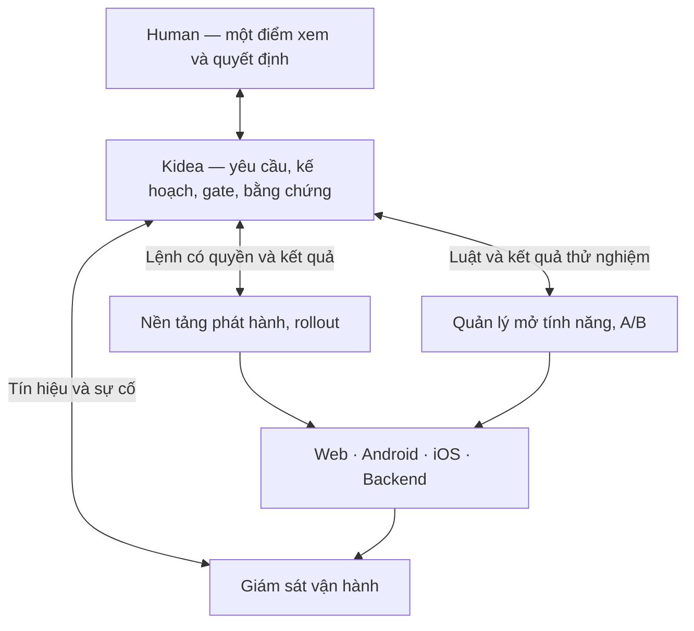

**Mình khuyến nghị: Kidea quản lý xuyên suốt, còn nền tảng phát hành/vận hành tách riêng về trách nhiệm và quyền — nhưng cùng một hệ thống theo dõi, không để thành những công cụ rời rạc.**

Nhận xét “chưa cần” ở câu trước của mình quá thiên về triển khai nhỏ. Với mục tiêu bạn vừa làm rõ, **kiến trúc cho hệ thống lớn phải được thiết kế ngay**; lựa chọn hạ tầng cụ thể cần theo yêu cầu thực tế.

Mình dùng Exa rà thêm 60 kết quả qua 3 hướng, còn 43 URL khác nhau sau bỏ trùng; các kết luận dưới đây dựa trên tài liệu chính thức.

## 1. “Tự merge” không có nghĩa bỏ bất kỳ bước nào

Ở đây chỉ là: **Kidea thực hiện thao tác đưa phần đã hoàn chỉnh vào master, thay cho bạn bấm nút**. Không bắt bạn quan tâm dùng tính năng Auto-merge hay công cụ nào.

Điều kiện giữ nguyên:

- Đủ các bước và xác nhận Human đã quy định.
- Review, xử lý ảnh hưởng, cập nhật tài liệu/code/test đầy đủ.
- **Sau mỗi Feature, chạy lại toàn bộ lượt kiểm tra cuối của toàn dự án, kể cả phần không thay đổi.**
- Thiếu bằng chứng, test chưa chạy/bị skip, review còn lỗi bắt buộc hoặc kết quả không đúng phiên bản thì chưa được thông qua.
- Xác minh bản tích hợp; đầu vào thay đổi thì chạy lại toàn lượt, đạt rồi mới báo đã tích hợp thành công.

Nên hiển thị riêng **“Feature đủ điều kiện tích hợp”**, **“đã tích hợp”** và **“đã phát hành”**, tránh dùng một chữ DONE cho cả ba.

Cần kiểm thử cả cơ chế chặn: chẳng hạn cố tình bỏ một suite hoặc dùng kết quả cũ thì hệ thống phải từ chối. Không thể chỉ nhìn dấu xanh, vì GitHub có trường hợp chấp nhận trạng thái skipped/neutral. [Tài liệu GitHub](https://docs.github.com/en/pull-requests/reference/status-checks).

**Candidate** nghĩa là **bản ứng viên phát hành**: bộ gói ứng dụng cụ thể được đem kiểm chứng trước khi chốt bản chính thức. Ví dụ `v1.3.0-rc.1`. “Ứng viên” không đồng nghĩa “đã đạt”. Hồ sơ phải xác định cả cấu hình/schema/luật liên quan; thay đầu vào chi phối thì cần định danh và kiểm chứng mới, không giữ chứng nhận cũ. Mở rộng rollout đúng kế hoạch đã duyệt chỉ cần ghi nhận thao tác, không tạo release code mới ở mỗi nấc.

Luồng vẫn là: Feature hoàn tất → chuẩn bị/kiểm chứng bản ứng viên trên dev → Human chốt version → triển khai theo quyền → kiểm chứng bản chạy. Một version có thể chứa nhiều Feature; kiểm tra từng Feature không thay kiểm tra bản phát hành và môi trường thực tế.

## 2. Đưa vào Kidea hay tách riêng?

**Đưa vào phạm vi quản lý Kidea; tách phần thực thi chuyên dụng.**

- **Kidea** biết vì sao làm, yêu cầu nào được duyệt, còn thiếu gì, Feature thuộc release nào và kết quả thực tế ở đâu.
- **Nền tảng phát hành** chạy kiểm tra/build/deploy, điều khiển rollout, giữ quyền và nhật ký thao tác.
- **Hệ mở tính năng/A/B** quản lý nhóm người dùng, biến thể và kết quả thử nghiệm.
- **Giám sát vận hành** thu log, số liệu, cảnh báo; Kidea đọc và liên kết chúng về đúng công việc.

Các ranh giới này không bắt buộc thành nhiều repo hoặc microservice. Có thể dùng công cụ có sẵn và một lớp kết nối mỏng. Cách cung cấp nhiều năng lực qua một trải nghiệm thống nhất cũng phù hợp với định hướng platform của CNCF. [CNCF Platforms](https://github.com/cncf/tag-app-delivery/blob/main/platforms-whitepaper/latest/index.md).

Điều quan trọng: **đóng phiên AI thì vận hành, rollout và cảnh báo vẫn được xử lý theo chính sách đã chốt**. Mất nguồn điều khiển phải có cách xử lý an toàn; luồng nhạy cảm có thể cần tạm từ chối thay vì tiếp tục dùng cấu hình cũ. Human vẫn có đường xử lý khẩn cấp được ghi nhận; Kidea không được là cửa duy nhất để cứu production.

Hiện Kidea được thiết kế là skill với HTML offline chỉ đọc. Giao diện điều khiển trực tuyến là **phần mở rộng cần chốt rõ**, không âm thầm nhét quyền deploy vào file HTML đó.

## 3. Web/app/backend cùng lên một phiên bản thế nào?

Nên có **một mã release sản phẩm, chứa bộ phiên bản thành phần tương thích**. Ví dụ minh họa:

| Release sản phẩm R-12 | Phiên bản được chọn |
|---|---|
| Backend | 2.4 |
| Web | 3.1 |
| Android | 1.9 |
| iOS | 1.8 |
| Dữ liệu/cấu hình/luật mở tính năng | Các phiên bản cụ thể đã kiểm chứng |

Không cần ép tất cả cùng mang số 12. Thành phần không đổi vẫn phải xác định đúng bản giữ lại.

Một tính năng xuyên các thành phần có thể ra mắt như sau:

1. Chuẩn bị backend/schema tương thích cả client cũ; chưa mở hành vi mới.
2. Phân phối web và ứng dụng mới theo thứ tự đã định.
3. Xác minh đủ điều kiện rồi mở tính năng cho nhóm có phiên bản phù hợp.
4. Theo dõi, mở rộng hoặc dừng theo kế hoạch.
5. Chỉ bỏ phần cũ sau khi hết nghĩa vụ hỗ trợ.

**“Ra mắt cùng một tính năng” không có nghĩa mọi thiết bị cập nhật cùng một giây.** Dừng rollout mobile không hạ phiên bản trên máy đã nhận; người dùng iOS còn có thể chủ động tải bản mới trong phased release. Vì vậy phải quản lý tương thích và độ phủ phiên bản. [Apple](https://developer.apple.com/help/app-store-connect/update-your-app/release-a-version-update-in-phases/), [Google Play](https://support.google.com/googleplay/android-developer/answer/6346149).

Kế hoạch cũng phải trả lời: backend đã lên nhưng web thất bại thì giữ gì, dừng gì, khôi phục thế nào? Không có một nút “undo toàn hệ thống”, đặc biệt khi dữ liệu đã thay đổi.

## 4. Rollout dần và A/B là hai việc khác nhau

| Việc | Mục đích |
|---|---|
| Deploy | Đưa gói code tới môi trường |
| Rollout dần | Mở rộng bản mới có kiểm soát để hạn chế rủi ro |
| Mở tính năng bằng flag | Quyết định ai thực sự được dùng hành vi mới |
| A/B testing | So sánh tác động của các phương án theo phép đo đã chốt |

**Code đã deploy có thể chưa mở tính năng.** Canary chủ yếu kiểm tra an toàn phát hành; A/B cần đo kết quả nghiệp vụ, không chỉ chia traffic. [Google SRE](https://sre.google/workbook/canarying-releases/), [Unleash](https://docs.getunleash.io/guides/a-b-testing).

Mình đề xuất:

- **Rollout:** Human duyệt các chặng, ngưỡng an toàn, lượng dữ liệu/thời gian quan sát và điều kiện dừng. Nền tảng được tự chạy trong phạm vi đó; vượt phạm vi thì hỏi. Không nhất thiết bạn bấm từng nấc.
- **A/B:** chốt giả thuyết, tiêu chí thành công, đối tượng và quy tắc kết luận trước khi chạy. Web/app/backend dùng cùng cách nhận diện và chia nhóm ổn định.
- Phân biệt người **được phân nhóm**, người **thực sự thấy tính năng**, và **kết quả phát sinh**. Dữ liệu thiếu/sai thì chưa kết luận thắng. [GrowthBook](https://docs.growthbook.io/using/experimenting).
- Mọi biến thể phải được duyệt và kiểm thử; A/B không thay test. Khi kết thúc, xác minh đã dừng phân phối biến thể cần bỏ, cập nhật đặc tả/code/test và dọn flag theo kế hoạch.

## 5. Làm sao không rơi rớt thông tin?

Cần một chuỗi truy xuất hai chiều:

**Yêu cầu ↔ đặc tả/thiết kế ↔ code/test ↔ bằng chứng ↔ gói build ↔ release ↔ bản đang chạy ↔ nhóm đang dùng ↔ kết quả vận hành/sự cố.**

Không cần chép mọi thứ vào Kidea. Cần **mỗi loại thông tin có một nguồn chính, liên kết đúng phiên bản và đọc lại được**. Ba bản đồ đã thống nhất phải bao phủ thêm pipeline, cấu hình, rollout, flag và các mối liên quan; không thêm một tracker để nhập lại bằng tay.

Giao diện nên trả lời ngay:

- Feature này đã hoàn tất chưa, đang ở release nào?
- Dev/prod **thực sự đang chạy gì**, khác bản mong muốn ở đâu?
- Ai đã được mở tính năng? Rollout/A/B đang chạy, dừng hay thiếu dữ liệu?
- Có lỗi thì truy về rule, thay đổi và kết quả kiểm tra nào?

Mỗi thao tác ngoài Kidea phải có đầu vào, quyền, mã thao tác và kết quả xác minh. **Gửi lệnh thành công chưa phải triển khai thành công.** Mất kết nối thì hiện chưa rõ/cũ dữ liệu, không giữ màu xanh cũ; chạy lại phải tránh lặp migration hoặc thao tác đã hoàn tất.

Thay config/flag dù không đổi code vẫn là thay đổi cần kiểm soát. Sự cố phải quay lại luồng sửa đổi và bổ sung kiểm tra phù hợp. Như vậy, “Feature DONE”, “đã deploy”, “đã mở cho người dùng” và “experiment kết thúc” không che lấp nhau.

## 6. Nên làm gì ngay?

**Chốt kiến trúc và các cam kết kiểm chứng trước; chọn công cụ sau, rồi chứng minh bằng một luồng thật xuyên suốt.**

Ba gói thiết kế nên xử lý tiếp, từng gói nhỏ:

1. **Ranh giới và quyền:** Kidea, nền tảng vận hành, giao diện thống nhất; nguồn dữ liệu và hoạt động khi mất kết nối.
2. **Phát hành và thay đổi:** release đa thành phần, tương thích, rollout, A/B, phục hồi và chuỗi bằng chứng.
3. **Công cụ và bài kiểm chứng:** chọn cấu hình cụ thể, thử cả đường thành công lẫn lỗi giữa chừng, thiếu tín hiệu, dừng/tiếp tục và khôi phục.

Về công cụ, hướng cụ thể để đánh giá là:

- **Nếu chọn Kubernetes:** Argo CD + Argo Rollouts là ứng viên phù hợp. Nhưng Argo Rollouts không tự hiểu phụ thuộc giữa nhiều service; vẫn cần điều phối release bên trên và đường phát hành mobile riêng. [Argo FAQ](https://argoproj.github.io/argo-rollouts/FAQ/).
- **Flags/A/B:** GrowthBook hoặc LaunchDarkly đáng đánh giá. Với backend C++, không thể hứa tích hợp ngang nhau: GrowthBook chưa liệt kê C++ trong catalog SDK; LaunchDarkly có C++ server SDK. Cần thử khả năng tích hợp, quyền và chi phí trước khi chọn. [GrowthBook SDK](https://docs.growthbook.io/lib), [LaunchDarkly C++](https://docs.launchdarkly.com/sdk/server-side/c-c--).

**Không nên** tự viết lại toàn bộ CI/CD, rollout và engine A/B; cũng không chọn Kubernetes chỉ vì “sau này lớn”. Nhưng phải xác định ngay yêu cầu quy mô, độ sẵn sàng, phục hồi và chi phí, rồi kiểm chứng trước khi đưa sản phẩm tới quy mô đó. Một pilot nhỏ chỉ chứng minh luồng, không chứng nhận hệ thống lớn.

Đây vẫn là tư vấn, chưa duyệt kiến trúc mới hoặc cấp quyền triển khai. Mình đã lưu [bản phân tích đầy đủ và danh mục ảnh hưởng tới thiết kế/lộ trình](https://github.com/Kynderis/kidea/blob/master/exa-results/kidea-end-to-end-control-2026-09-08.md), gắn con trỏ vào việc đang trao đổi và sửa một dòng trạng thái G2 bị cũ. Chưa thay nguyên tắc đã chốt hay đóng gói quyền Git đang chờ duyệt.
