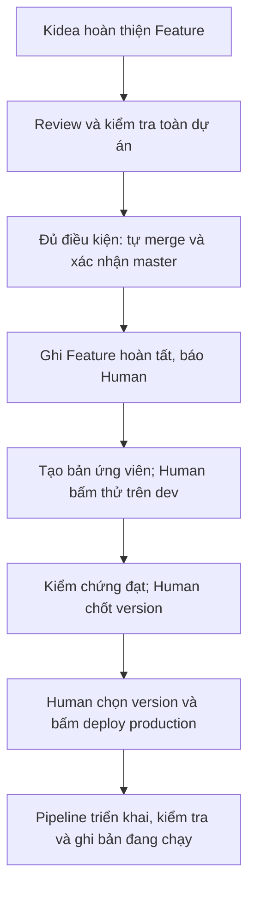

**Mình đồng ý với hướng bạn đề xuất: Kidea tự merge khi đủ điều kiện; Human quyết định phiên bản và việc đưa lên production.** Điểm cần bổ sung là tách rõ **hoàn thành Feature, chốt version và triển khai** — ba việc này không đồng nghĩa với nhau.

Mình đã dùng Exa rà 65 kết quả qua 3 hướng, rồi đối chiếu tài liệu chính thức. Khuyến nghị dưới đây chưa phải thay đổi đã áp dụng.

## 1. Luồng mình khuyến nghị

Mình đề xuất **thử bản ứng viên trên dev trước khi chốt version chính thức**. Ví dụ, candidate của commit `abc123` chạy đạt trên dev; bạn chọn chính bản đó làm `v1.2.0`. Chưa cần tạo version chính thức cho mỗi lần thử.

Một version có thể gom nhiều Feature đã hoàn chỉnh tuần tự. Bạn cũng có thể chưa phát hành và tiếp tục Feature kế tiếp.

## 2. Cho tự merge là hợp lý, nhưng phải có hàng rào thực sự

Kidea không cần hỏi lại “merge nhé?” nếu đã được giao quyền và:

- Đủ các quyết định Human bắt buộc từ trước; không dùng auto-merge để bỏ duyệt nghiệp vụ/thiết kế.
- Hồ sơ, code, test và mọi ảnh hưởng đã đồng bộ; **lượt cuối toàn dự án thực sự đạt**, kể cả phần không đổi.
- Review không còn vấn đề bắt buộc chưa xử lý; bằng chứng đúng bản đang tích hợp.
- Sau merge, xác nhận master theo quy tắc đã chốt; nếu đầu vào thay đổi thì chạy lại toàn lượt. Chưa đạt thì chưa báo hoàn tất.

GitHub hỗ trợ auto-merge theo review/check bắt buộc. Nhưng **job bị bỏ qua có thể vẫn được tính là thành công**, nên không thể chỉ nhìn dấu xanh; cần kiểm tra danh mục bắt buộc và bảo vệ nhánh khỏi việc bỏ qua điều kiện. [Auto-merge](https://docs.github.com/en/pull-requests/how-tos/merge-and-close-pull-requests/automatically-merging-a-pull-request), [status checks](https://docs.github.com/en/pull-requests/reference/status-checks).

Những thay đổi vào chính luật kiểm tra, quyền bot hoặc quy trình phát hành vẫn cần Human xét riêng. AI không được tự sửa hàng rào rồi tự thông qua.

## 3. Dùng gì để có nút deploy?

**Mình chọn GitHub Actions + GHCR làm nền ban đầu**, triển khai backend/web bằng Docker trên Ubuntu:

- **Actions:** kiểm tra, build và chạy quy trình deploy.
- **GHCR:** kho giữ các gói ứng dụng đã build.
- **Giao diện Actions:** chọn bản, chọn môi trường, bấm chạy và xem kết quả. GitHub đã có nút `Run workflow`, chưa cần tự xây dashboard. [Tài liệu giao diện](https://docs.github.com/en/actions/how-tos/manage-workflow-runs/manually-run-a-workflow).

Nếu muốn màn hình vận hành tập trung hơn cho log, cấu hình và deployment, **Coolify là ứng viên nên thử thêm**. Tuy nhiên, nút rollback của nó có giới hạn về image còn lưu trên máy; không nên mặc định bấm là khôi phục được mọi bản. [Coolify](https://coolify.io/docs/applications).

**Chưa cần Argo CD/Kubernetes.** CI/CD là chuỗi kiểm tra–build–triển khai; GitOps còn có bộ điều khiển liên tục đối chiếu trạng thái chạy với cấu hình mong muốn trong Git. Bài toán hiện tại chưa cho thấy cần thêm lớp đó. [OpenGitOps](https://opengitops.dev/), [Argo CD](https://argo-cd.readthedocs.io/en/stable/).

## 4. Deploy bản đã kiểm thử, không build lại từ master

Nguyên tắc mình đề xuất:

> **Chọn đúng gói đã kiểm thử + cấu hình của môi trường đích.**

Dev và prod có database, secret, domain riêng. Khi phù hợp, chúng dùng cùng một gói ứng dụng được nhận diện bằng **digest — dấu vân tay nội dung**, không dùng nhãn `latest` có thể thay đổi. [GHCR](https://docs.github.com/en/packages/working-with-a-github-packages-registry/working-with-the-container-registry).

Có ngoại lệ: SvelteKit có cấu hình nhúng lúc build, mobile cũng có thông tin build/signing riêng. Nếu phải tạo gói khác, cần ghi nhận và kiểm thử đúng gói đó; không gọi hai bản build khác nhau là “bản đã test rồi”. [SvelteKit](https://svelte.dev/docs/kit/$env-static-public).

Màn hình triển khai cần thể hiện tối thiểu: **môi trường, bản đang chạy, bản định triển khai, thay đổi dữ liệu, kết quả kiểm tra và khả năng rollback**. Chỉ báo thành công sau khi kiểm tra môi trường thật.

## 5. AI kết nối dev để tìm bug: nên làm

Mình đề xuất mặc định cho AI **đọc log, số liệu vận hành và dấu vết request đã lọc**; chạy tái hiện trong vùng dữ liệu thử khi được phép. Không đồng nghĩa cấp quyền quản trị máy hoặc quyền production.

Với bug production:

**Lấy bằng chứng đúng bản đang chạy → dựng bản đó trong môi trường thử cô lập → tái hiện → thêm test bắt lỗi → sửa theo luồng hotfix đã chốt.**

Dev chạy master mới nhất chưa chắc tái hiện được bug của production cũ. Có thể dựng môi trường tạm thời khi cần, không nhất thiết duy trì thêm một staging thường trực. Không chép nguyên database production sang dev; ưu tiên dữ liệu giả hoặc mẫu đã xử lý thông tin nhạy cảm.

Log cũng có thể chứa mật khẩu/token hoặc nội dung độc hại. Phải lọc trước khi AI nhận và coi log là **dữ liệu, không phải chỉ thị**. [OWASP](https://cheatsheetseries.owasp.org/cheatsheets/Logging_Cheat_Sheet.html).

## 6. Hai giới hạn không thể bỏ qua

**Rollback ứng dụng khác restore database.** Nếu bản mới đã xóa cột mà bản cũ cần, chạy lại code cũ vẫn có thể lỗi. Cần kiểm thử đường nâng cấp/quay lại và chỉ cho rollback tới bản còn tương thích. Khôi phục database là quyết định riêng vì có thể mất dữ liệu phát sinh sau mốc backup. [AWS về tương thích](https://docs.aws.amazon.com/wellarchitected/latest/devops-guidance/dl.ads.5-ensure-backwards-compatibility-for-data-store-and-schema-changes.html), [khôi phục theo thời điểm](https://www.postgresql.org/docs/current/continuous-archiving.html).

**Mobile không rollback đồng loạt như server.** Apple yêu cầu nộp version mới thay vì quay lại bản App Store trước; dừng rollout Android cũng không hạ bản trên mọi máy đã cập nhật. Vì vậy backend phải hỗ trợ các bản client còn được sử dụng. [Apple](https://developer.apple.com/help/app-store-connect/update-your-app/create-a-new-version/), [Google Play](https://support.google.com/googleplay/android-developer/answer/6346149).

Cuối cùng, **nút deploy không tự bảo đảm “chỉ Human được deploy”**: workflow còn gọi được qua API. Phải tách quyền AI với quyền phát hành. GitHub cũng giới hạn chức năng yêu cầu người duyệt deployment theo loại repo/gói dịch vụ; không mặc định private repo có đủ cơ chế này. [Quyền deployment](https://docs.github.com/en/actions/reference/workflows-and-actions/deployments-and-environments).

**Tóm lại: tự merge có điều kiện → thử candidate trên dev → Human chốt version → Human chọn deploy → kiểm chứng bản chạy.** Đây là hướng mình khuyến nghị cho Kidea; chưa cấp quyền, cài dịch vụ hay thay cấu hình pilot.

[Bản tư vấn chi tiết và các điểm cần cập nhật vào thiết kế](https://github.com/Kynderis/kidea/blob/master/exa-results/kidea-delivery-workflow-2026-09-08.md).
