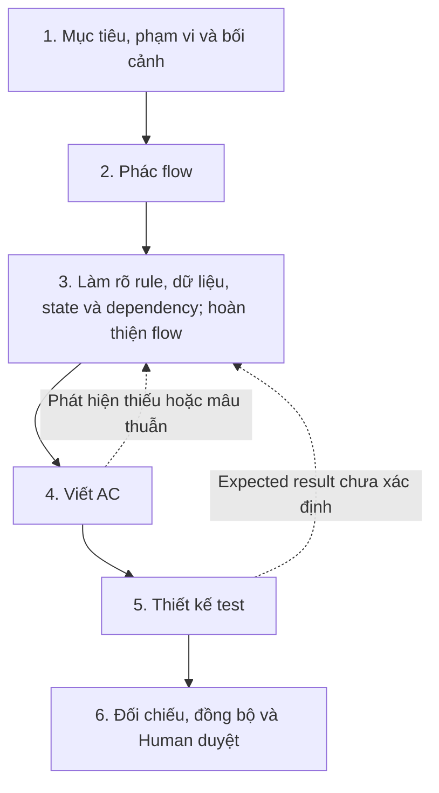

**Flow nghiệp vụ là trình tự xử lý một yêu cầu: bắt đầu từ sự kiện nào, đi qua những bước nào, gặp điều kiện nào thì rẽ nhánh, và kết thúc với kết quả/trạng thái gì.**

Câu “làm rõ rule và flow” trước đó của mình đã gộp quá nhiều việc, nên chưa giúp bạn biết phải bắt đầu ở đâu.

**1. Phân biệt rule và flow bằng ví dụ hủy đơn**

Giả sử ta có các rule:

- R1: Chỉ chủ đơn có quyền hủy.
- R2: Chỉ đơn đang chờ xử lý được hủy.
- R3: Hủy thành công thì đơn chuyển sang đã hủy.
- R4: Từ chối thì trạng thái đơn giữ nguyên.

Những rule này nói **điều gì phải đúng**, nhưng chưa nói hết **thứ tự áp dụng và cách kết thúc từng nhánh**.

Ví dụ, nếu người yêu cầu vừa không phải chủ đơn, vừa hủy đơn đang giao, thì cần quyết định lỗi nào được trả về. Bạn đã đồng ý rằng điểm này phải có rule rõ ràng. Để minh họa tiếp, **giả sử Human chọn ưu tiên lỗi quyền**; đây chưa phải quyết định nghiệp vụ thật của project.

Khi đó bổ sung R5: nếu đồng thời sai quyền và sai trạng thái, trả lỗi không có quyền.

Flow tương ứng, với giả định người dùng đã đăng nhập và đơn tồn tại:

| Bước | Xử lý | Nếu đạt | Nếu không đạt | Rule liên quan |
|---|---|---|---|---|
| F1 | Nhận yêu cầu hủy đơn | Sang F2 | — | — |
| F2 | Kiểm tra người yêu cầu có phải chủ đơn | Sang F3 | Trả lỗi không có quyền, giữ nguyên đơn, kết thúc | R1, R4, R5 |
| F3 | Kiểm tra đơn có đang chờ xử lý | Sang F4 | Trả lỗi trạng thái không cho phép, giữ nguyên đơn, kết thúc | R2, R4 |
| F4 | Hủy đơn | Chuyển sang đã hủy, trả thành công, kết thúc | — | R3 |

**Rule là căn cứ cho các quyết định trong flow. Flow ghép những quyết định và hành động đó thành một quá trình hoàn chỉnh.** Đây là thứ tự nghiệp vụ quan sát được; code không bắt buộc phải tổ chức thành đúng bốn hàm như bảng.

**2. Thứ tự soạn tài liệu mình đề xuất**

Có một thứ tự làm việc rõ ràng, nhưng cần cho phép quay lại bổ sung khi bước sau làm lộ chỗ thiếu:

**Bước 1 — Xác định Feature cần làm gì**

Đầu vào là Feature đã chốt và các quyết định của Human. AI làm rõ:

- Ai thực hiện? Sự kiện nào bắt đầu?
- Muốn đạt kết quả gì?
- Phạm vi và ngoài phạm vi là gì?
- Những dữ liệu, trạng thái và nghiệp vụ dùng chung nào đã có?

Ví dụ: khách hàng yêu cầu hủy đơn của mình; xác định có bao gồm đơn đã thanh toán và hoàn tiền hay không. Chưa rõ phạm vi này thì chưa thể viết flow hủy đơn đầy đủ.

**Bước 2 — Phác flow để biết cần phân tích những phần nào**

Từ mục tiêu và bối cảnh, AI phác:

> Nhận yêu cầu → kiểm tra điều kiện hủy → hủy hoặc từ chối → trả kết quả.

Đây là bản nháp để định hướng phân tích. Chỗ “kiểm tra điều kiện hủy” còn mơ hồ và phải được mở ra ở bước tiếp theo.

**Bước 3 — Phân tích từng bước, viết rule và hoàn thiện flow**

Với từng bước trong bản phác, AI hỏi và làm rõ:

- Input cần những field nào?
- Điều kiện cho phép/từ chối là gì?
- Áp dụng rule nào đã có, rule nào cần Human chốt?
- Trạng thái nào thay đổi hoặc giữ nguyên?
- Lỗi nào được trả? Nếu nhiều lỗi cùng xảy ra thì xử lý ra sao?
- Có gọi nghiệp vụ dùng chung nào không?

Từ đó có R1–R5 và flow F1–F4 trong ví dụ.

**Rule và flow được hoàn thiện cùng nhau.** Có rule trước thì đưa vào flow; nhìn flow thấy thiếu quyết định thì bổ sung rule. AI đề xuất phần chưa rõ, Human chốt ý nghĩa nghiệp vụ.

Nếu gặp dependency dùng chung chưa đủ rõ, ta xử lý nó theo cụm Feature đã đánh dấu, rồi quay lại hoàn thiện flow của Feature.

**Bước 4 — Viết AC từ mục tiêu và nghiệp vụ đã làm rõ**

AC diễn đạt các điều kiện để chấp nhận Feature. Ví dụ:

> Chủ đơn hủy đơn đang chờ xử lý thì nhận kết quả thành công và đơn chuyển sang đã hủy.

AC này dựa trên R1, R2, R3 và nhánh thành công F1 → F2 → F3 → F4.

Đồng thời đối chiếu lại mục tiêu ban đầu: rule và flow có thực sự đáp ứng điều Human muốn không? AC không nên chỉ chép lại một flow có thể đã thiếu yêu cầu.

**Bước 5 — Thiết kế test từ toàn bộ phần trên**

Test lấy dữ liệu cụ thể để kiểm tra rule, nhánh flow, AC và trạng thái.

Ví dụ với giả định ưu tiên lỗi quyền đã nêu:

| Test | Tình huống | Đường đi trong flow | Kết quả |
|---|---|---|---|
| T1 | U1 là chủ đơn; đơn chờ xử lý | F1 → F2 → F3 → F4 | Thành công; đơn thành đã hủy |
| T2 | U2 không phải chủ đơn; đơn đang giao | F1 → F2 → kết thúc | Lỗi không có quyền; đơn vẫn đang giao |

T2 dùng R1, R4, R5 để xác định kết quả. Nếu chưa chốt R5, AI phải quay lại bước 3 làm rõ; không tự chọn mã lỗi cho test.

Có thể viết vài test ví dụ ngay trong bước 3 để phát hiện thiếu sót. Nhưng chỉ hoàn thiện expected result khi các quyết định liên quan đã rõ.

**Bước 6 — Đối chiếu và duyệt**

AI kiểm tra các AC, rule, nhánh flow, state và dependency đã có test phù hợp chưa; các link và nội dung có khớp nhau không. Human review ý nghĩa nghiệp vụ và phạm vi test trước khi approve.

Đây là các bước soạn nội dung, không phải yêu cầu tạo sáu file hoặc thêm sáu lần duyệt mới.

**3. Vậy cái nào được sinh ra từ cái nào?**

| Nội dung | Căn cứ để viết |
|---|---|
| Flow nháp | Mục tiêu, phạm vi, actor, sự kiện và nghiệp vụ đã biết |
| Rule | Yêu cầu/ quyết định nghiệp vụ của Human, rule dùng chung đã có và các câu hỏi phát hiện khi phân tích flow |
| Flow chi tiết | Flow nháp + rule + input/output + state + dependency |
| AC | Mục tiêu Feature + rule/flow đã làm rõ |
| Test | AC + rule + flow + state + dependency |

**Không thể chỉ có danh sách rule rồi tự suy ra duy nhất một flow đúng.** Các quyết định về thứ tự, ưu tiên lỗi và hiệu ứng nghiệp vụ cũng phải được làm rõ. Tương tự, test không được tự tạo thêm hành vi chưa có trong đặc tả.

Mình đề xuất dùng thứ tự trên cho phương pháp của ta. Chưa sửa tài liệu chính ở lượt giải thích này; câu trả lời đã được lưu vào [answer.md](https://github.com/Kynderis/kidea/blob/master/answer.md) và push lên GitHub.
