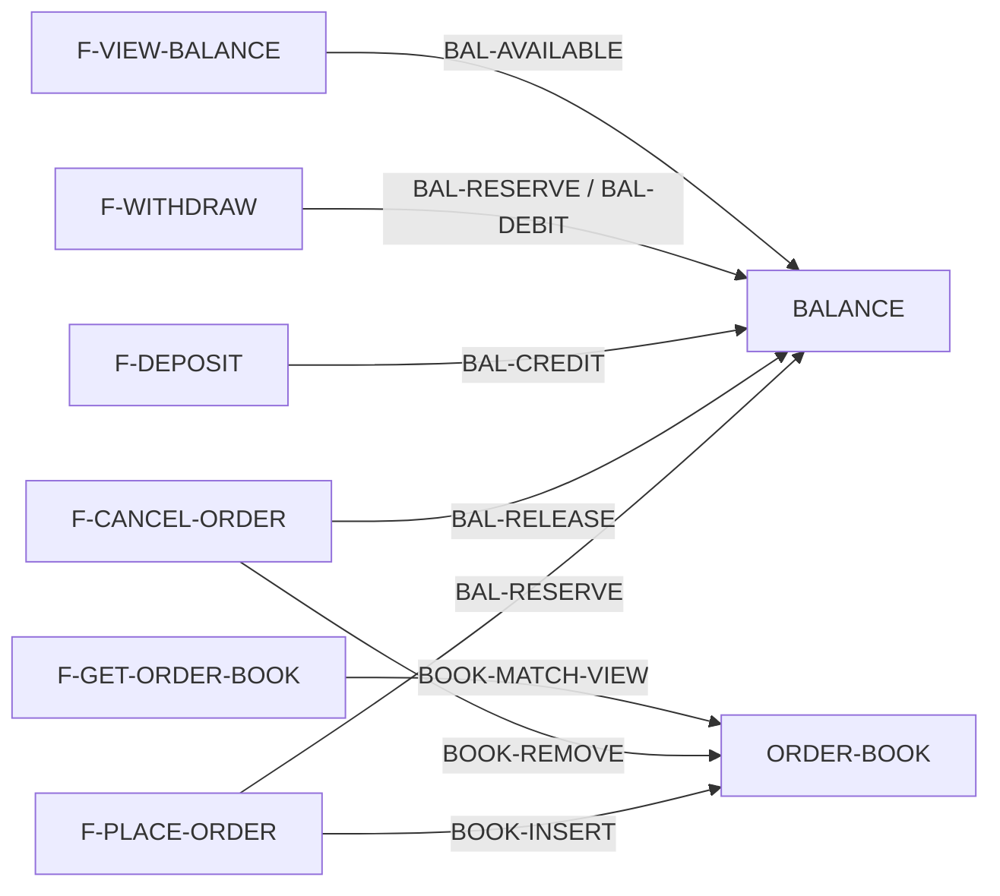

# Hệ thống tài liệu nghiệp vụ liên kết bằng Markdown

**Trạng thái:** PROPOSED v0.2 — chờ Human review và thử trên sản phẩm thật  
**Ngày cập nhật:** 2026-09-03  
**Phạm vi:** từ Feature Map đã chốt đến tài liệu nghiệp vụ và Business Test Specification; chưa bàn thiết kế kỹ thuật, code hay phát hành.

## 1. Kết luận

Cách làm đề xuất:

1. AI đọc toàn bộ Feature `MVP` và đề xuất các **ứng viên nghiệp vụ dùng chung**.
2. Human duyệt danh sách và ranh giới từng nghiệp vụ. Nếu reject, ghi lý do để AI sửa.
3. AI viết từng tài liệu nghiệp vụ chung; Human review và approve từng tài liệu.
4. AI đặc tả đệ quy từng Feature, liên kết đến phần dùng chung đã có và chỉ viết phần riêng.
5. AI sinh Business Test Specification từ rule, state, flow và quan hệ; Human review và approve.
6. Mọi tài liệu tạo thành một graph bằng link hai chiều. Khi sửa, AI lần theo graph để phân tích và cập nhật ảnh hưởng.

Đây là một **document graph được lưu bằng Markdown**. Chưa cần graph database: file mục lục, mã ổn định, link đến đúng mục và backlink đủ tạo bản đồ có thể đọc và kiểm tra.

## 2. Bốn điều chỉnh để cách làm khả thi

### 2.1. Không đặc tả mọi ứng viên dùng chung ngay từ Future/Idea

AI dùng toàn bộ Feature Map để nhận diện khả năng dùng chung, nhưng chỉ viết sâu các nghiệp vụ:

- có ít nhất hai Feature MVP thực sự dùng; hoặc
- sở hữu state/invariant quan trọng cần thống nhất sớm, dù hiện chỉ thấy một nơi dùng.

Feature `Future` và `Idea` được ghi là người dùng tiềm năng, không được dùng làm lý do duy nhất để thiết kế trước một nghiệp vụ lớn chưa cần cho MVP.

Human nên duyệt danh sách và ranh giới ứng viên trên toàn MVP trước, nhưng không cần đợi mọi file dùng chung của toàn MVP hoàn tất mới viết Feature đầu tiên. Chọn một cụm Feature liên quan, hoàn tất các dependency dùng chung của cụm đó rồi đặc tả Feature; cụm sau tái sử dụng hoặc mở rộng qua impact review. Cách này vẫn “phần chung đi trước phần riêng” mà không buộc ta đoán toàn bộ chi tiết trước khi thấy flow thật.

### 2.2. Nơi dùng thứ hai chỉ kích hoạt đề xuất tách

Khi một phần riêng bỗng được Feature/flow thứ hai cần, AI phải so sánh:

- mục đích có thật sự giống nhau không;
- input/output và rule có cùng semantics không;
- state và invariant do cùng một nơi sở hữu không;
- hai nơi có khả năng sớm phát triển khác nhau không.

Nếu cùng nghĩa, AI đề xuất tách thành nghiệp vụ chung và liệt kê tài liệu/test phải sửa. Human approve rồi AI mới tách. Không tự gộp chỉ vì tên giống nhau.

### 2.3. Link hai chiều phải có mã ổn định

Tên heading có thể đổi; mã không đổi. Mục được liên kết dùng heading ASCII chỉ chứa mã:

```markdown
## BAL-RESERVE

**Reserve available balance**
```

Link đến đúng mục:

```markdown
[BAL-RESERVE](../shared/BALANCE.md#bal-reserve)
```

Mã phải ổn định trong tài liệu hiện hành để link không tự hỏng khi tên mô tả hoặc heading trình bày thay đổi.

- Nếu rule, precondition hoặc output thay đổi nhưng mục đích và trách nhiệm nghiệp vụ vẫn là một, giữ nguyên mã, đưa tài liệu về `DRAFT` và phân tích tất cả nơi đang dùng để cập nhật hoặc xác nhận không cần đổi.
- Nếu mục đích hoặc trách nhiệm đổi thành một nghiệp vụ khác, có thể tạo mã phù hợp hơn. Trước khi bỏ mã cũ, phải tìm tất cả forward link, backlink, Feature và test đang dùng nó; từng nơi phải được chuyển sang mã mới, chuyển sang dependency phù hợp khác hoặc xóa dependency.
- Khi mã cũ không còn nơi dùng và nội dung cũ không còn hiệu lực, xóa hoàn toàn mục đó khỏi tài liệu hiện hành. Không giữ stub, danh sách mã cũ hoặc lịch sử nghiệp vụ trong bộ tài liệu hiện hành.
- Một mã đã xóa có thể được dùng lại sau này nếu nó phù hợp với nghiệp vụ hiện hành mới. ID chỉ cần duy nhất và đúng nghĩa trong phiên bản tài liệu hiện hành.

### 2.4. Không thể test mọi giá trị và mọi chuỗi trạng thái thực tế

Số, thời gian và chuỗi sự kiện thường không hữu hạn; tích Descartes của các nhóm input/state tăng rất nhanh. Mục tiêu đúng là:

- bao phủ đầy đủ **mô hình nghiệp vụ hữu hạn đã định nghĩa**;
- dùng đại diện cho các lớp giá trị tương đương;
- kiểm tra chính xác các ranh giới;
- vét cạn tổ hợp nhỏ, quan trọng;
- dùng tổ hợp `t-way`, property/invariant và chuỗi sự kiện theo rủi ro cho phần còn lại.

ISTQB mô tả equivalence partitioning, boundary value, decision table và state transition là các kỹ thuật black-box; chính tài liệu cũng lưu ý số rule của decision table tăng theo cấp số nhân khi có nhiều điều kiện. NIST dùng covering array để đạt mức bao phủ `t-way` mà không cần chạy toàn bộ tích tổ hợp. [ISTQB CTFL v4.0.1](https://istqb.org/wp-content/uploads/2024/11/ISTQB_CTFL_Syllabus_v4.0.1.pdf), [NIST ACTS](https://csrc.nist.gov/Projects/automated-combinatorial-testing-for-software/faqs).

## 3. Cấu trúc tài liệu tối thiểu

Khi có sản phẩm thật, bắt đầu như sau:

```text
docs/business/
├── INDEX.md
├── shared/
│   ├── BALANCE.md
│   ├── IDENTITY.md
│   └── ORDER_BOOK.md
└── features/
    ├── F-PLACE-LIMIT-ORDER.md
    ├── F-CANCEL-ORDER.md
    └── F-VIEW-BALANCE.md
```

- `INDEX.md`: mục lục và bản đồ tra cứu; không chứa toàn bộ rule.
- `shared/`: nghiệp vụ có semantics dùng chung hoặc sở hữu state/invariant chung.
- `features/`: mục tiêu, phần riêng và flow của từng Feature; liên kết sang `shared/`.

`INDEX.md` cố ý lặp lại một ít metadata để tìm kiếm nhanh, nên mọi thay đổi ID, mô tả, chức năng hoặc trạng thái phải cập nhật nó trong cùng change set. Khi số quan hệ đủ lớn khiến kiểm tra tay dễ sai, thêm một script nhỏ để kiểm tra link tồn tại và forward/backlink đối xứng; không cần đợi đến lúc xây một hệ thống graph riêng.

Không tạo một file cho mỗi phép tính hoặc node lá. Một file có thể chứa nhiều chức năng cùng thuộc một trách nhiệm, ví dụ `BALANCE.md` chứa đọc available, reserve, release, credit và debit. Nếu file quá lớn hoặc xuất hiện hai nơi sở hữu khác nhau, Human mới duyệt việc tách.

## 4. Mục lục nghiệp vụ

`INDEX.md` là nơi AI phải đọc đầu tiên. Nó có các bảng tra cứu dưới đây và phần `Cụm Feature đang đặc tả` khi một cụm đang được xử lý.

### Nghiệp vụ dùng chung

```markdown
| ID / Link | Mô tả đủ để tìm đúng | Chức năng chính | Trạng thái |
|---|---|---|---|
| [`BAL`](shared/BALANCE.md) | Quản lý available/reserved balance | `BAL-AVAILABLE`, `BAL-RESERVE`, `BAL-RELEASE`, `BAL-CREDIT`, `BAL-DEBIT` | `APPROVED` |
| [`BOOK`](shared/ORDER_BOOK.md) | Lệnh đang nghỉ và quy tắc sắp xếp/tiêu thụ thanh khoản | `BOOK-INSERT`, `BOOK-REMOVE`, `BOOK-MATCH-VIEW` | `DRAFT` |
```

### Feature

```markdown
| ID / Link | Mô tả Feature | Nghiệp vụ chính được dùng | Trạng thái |
|---|---|---|---|
| [`F-ORDER-LIMIT-BUY`](features/F-PLACE-LIMIT-ORDER.md) | User đặt Limit Buy Spot | `IDENTITY`, `SYMBOL`, `BAL`, `BOOK`, `MATCH`, `ORDER-STATE` | `DRAFT` |
```

Mô tả phải đủ để AI quyết định file nào cần mở. `INDEX.md` giúp tìm kiếm, nhưng file được link mới là nguồn rule có hiệu lực.

## 5. Trạng thái và Human approval

Chỉ cần ba trạng thái:

```text
DRAFT → IN_REVIEW → APPROVED
             │
             └── reject + lý do → DRAFT

APPROVED bị thay đổi semantics → DRAFT
```

Metadata đầu mỗi tài liệu:

```markdown
| Thuộc tính | Giá trị |
|---|---|
| ID | `BAL` |
| Status | `APPROVED` |
| Scope | Balance dùng cho Spot MVP |
| Approved by | [Human/role] |
| Approved at | [ngày + revision] |
```

- AI không tự đặt `APPROVED`.
- Khi Human reject, AI ghi lý do vào phần review, sửa bản nháp rồi gửi lại.
- Feature chỉ được approve khi mọi dependency bắt buộc đã `APPROVED`, hoặc chúng nằm trong cùng một gói đang được Human duyệt.
- Khi sửa semantics của tài liệu đã approve, đổi lại `DRAFT`, lập impact list và duyệt lại thay đổi.

## 6. Quy trình tạo tài liệu

### 6.1. AI đề xuất nghiệp vụ chung

AI tạo bảng:

| Ứng viên | Trách nhiệm dự kiến | Feature MVP sử dụng | State/invariant sở hữu | Lý do nên/không nên tách | Human decision |
|---|---|---|---|---|---|
| `BALANCE` | Đọc và thay đổi available/reserved | Place Order, Cancel Order, Deposit, Withdraw, View Balance | Available/reserved không âm; tổng biến động có căn cứ | Nhiều consumer và state dùng chung | `OPEN` |

Human có thể `APPROVE`, `REJECT` hoặc yêu cầu đổi ranh giới. AI cập nhật danh sách theo lý do; không viết file nghiệp vụ trước khi ranh giới được duyệt.

Sau khi danh sách được duyệt, chọn cụm Feature sẽ đặc tả trước và chỉ hoàn tất các tài liệu dùng chung bắt buộc của cụm đó. Ví dụ với `Place Order` và `Cancel Order`, làm rõ phần cần dùng của `IDENTITY`, `SYMBOL`, `BALANCE`, `ORDER_BOOK` và `ORDER-STATE`; chưa cần hoàn tất nghiệp vụ dùng chung chỉ phục vụ một cụm MVP khác.

Ngay khi chọn cụm, AI phải ghi phần `Cụm Feature đang đặc tả` trong `INDEX.md`, tối thiểu gồm: mã/tên cụm, các Feature thuộc cụm, tài liệu dùng chung bắt buộc, mục đang xử lý và điểm phải quay lại sau khi hoàn tất mục đó. Mỗi lần chuyển sang xử lý một dependency dùng chung hoặc quay lại Feature, AI cập nhật phần này trong cùng change set. Đây là trạng thái theo dõi công việc, không thay thế trạng thái duyệt của tài liệu.

Ví dụ:

```markdown
## Cụm Feature đang đặc tả

| Cụm | Feature | Dùng chung bắt buộc | Đang xử lý | Sau khi xong quay lại |
|---|---|---|---|---|
| `ORDER-MVP-01` | `F-PLACE-ORDER`, `F-CANCEL-ORDER` | `BALANCE`, `ORDER-STATE` | `BALANCE#BAL-RESERVE` | `F-PLACE-ORDER#ORD-RESERVE-BALANCE` |
```

### 6.2. AI viết nghiệp vụ chung

Mỗi file được phân tích đệ quy:

1. mục đích và phạm vi;
2. thuật ngữ, state và nơi sở hữu state;
3. danh sách chức năng nghiệp vụ;
4. với từng chức năng: input/field, output, precondition, rule/công thức, state transition, error/boundary, invariant và ví dụ;
5. các điểm `OPEN` cần Human chốt;
6. Business Test Specification;
7. bản đồ quan hệ hai chiều.

Mỗi file phải được Human review và chuyển sang `APPROVED` mới được coi là hoàn thành.

AI có thể viết ví dụ kiểm chứng trong lúc phân tích để làm lộ chỗ mơ hồ, nhưng chỉ hoàn thiện Business Test Specification khi không còn `OPEN` làm expected result thay đổi. Human duyệt semantics và test specification trong cùng lần approve tài liệu.

### 6.3. AI viết nghiệp vụ riêng của Feature

Với từng Feature:

1. đọc `INDEX.md` và các mô tả liên quan;
2. chốt actor, trigger, kết quả và ngoài phạm vi;
3. dựng cây `NEW / REUSE / OPEN`;
4. link chính xác từng phần `REUSE` đến mục trong file chung;
5. phân tích depth-first phần `NEW` đến khi expected result không còn mơ hồ;
6. viết flow thành bảng có thứ tự bước, điều kiện/nhánh, kết quả, bước tiếp theo và pre/post-state ở mỗi bước quan trọng;
7. sinh AC và Business Test Specification;
8. cập nhật forward link, backlink và `INDEX.md`;
9. AI audit; Human review và approve toàn file.

Bảng flow là nguồn mô tả chi tiết có hiệu lực. Với flow có nhánh, retry, nhiều state hoặc đi qua nhiều nghiệp vụ dùng chung, AI thêm Mermaid ngay sau bảng để Human và AI nhìn nhanh; Mermaid không được chứa rule chỉ có trong hình và phải được cập nhật theo bảng. Flow tuyến tính rất ngắn không bắt buộc có Mermaid.

### 6.4. Điều kiện dừng phân tích đệ quy

Một phần đủ rõ khi:

- mọi thuật ngữ và field có nghĩa, đơn vị, miền hợp lệ;
- có thể lấy input cụ thể và tính được expected output/state;
- công thức nêu precision, rounding và thứ tự tính khi liên quan;
- thành công, từ chối, lỗi và boundary nói rõ dữ liệu đổi hoặc giữ nguyên;
- state transition có trigger, guard, output/action;
- invariant và dependency có contract rõ;
- không còn `OPEN` ảnh hưởng hành vi.

Vòng lặp, cây dữ liệu, transaction, lock hay database thuộc thiết kế kỹ thuật và không phải điều kiện hoàn thành tài liệu nghiệp vụ.

## 7. Quy ước link hai chiều

Không phân loại dependency thành `USES`, `READS_STATE` hay `CHANGES_STATE`. Khi một mục A phụ thuộc vào mục B, chỉ cần:

- forward link từ đúng mục A đến đúng mục B, kèm mục đích;
- backlink tại mục B chỉ về đúng mục A, kèm cùng mục đích.

Khi B thay đổi, AI dùng backlink để tìm mọi caller, sau đó đọc đầy đủ từng tài liệu caller và contract liên quan trước khi quyết định ảnh hưởng. Không được dùng nhãn quan hệ để bỏ qua việc đọc và phân tích.

Quan hệ chứa đã thể hiện qua cấu trúc file/heading và `INDEX.md`; thứ tự bước đã thể hiện trong bảng flow. `RELATION-MAP` chỉ lưu dependency giữa các mục, không lặp lại cấu trúc chứa hoặc thứ tự flow.

### 7.1. Forward link ở nơi gọi

Trong Feature đặt lệnh:

```markdown
## ORD-RESERVE-BALANCE

Sau khi validation đạt, flow sử dụng
[BAL-RESERVE](../shared/BALANCE.md#bal-reserve)
với `asset=USDT` và `amount=max_reserve`.
```

### 7.2. Backlink ở tài liệu được gọi

Mỗi file có một bảng cuối file. Không cần rải backlink khắp nội dung:

```markdown
## RELATION-MAP

### File này sử dụng
| Từ mục | Đến mục | Mục đích |
|---|---|---|

### Được sử dụng bởi
| Phạm vi trong file này | Nơi gọi | Mục đích |
|---|---|---|
| `BAL-RESERVE` | [ORD-RESERVE-BALANCE](../features/F-PLACE-LIMIT-ORDER.md#ord-reserve-balance) | Giữ USDT cho Limit Buy |
| `BAL-AVAILABLE` | [F-VIEW-BALANCE](../features/F-VIEW-BALANCE.md#f-view-balance) | Hiển thị số dư có thể dùng |
```

Không dùng `ALL`. Mỗi dependency phải trỏ tới mục cụ thể. Nếu caller phụ thuộc một invariant áp dụng toàn file, invariant đó cũng phải có ID riêng để link chính xác.

### 7.3. Khi sửa một mục

AI bắt buộc phân tích ảnh hưởng đệ quy đến khi không còn mục mới cần sửa:

1. đổi tài liệu bị sửa sang `DRAFT` nếu semantics thay đổi;
2. đọc toàn bộ tài liệu bị sửa, cả `File này sử dụng` và `Được sử dụng bởi`;
3. tìm kiếm toàn bộ bộ tài liệu theo ID và link của mục bị sửa để bắt cả tham chiếu bị thiếu trong `RELATION-MAP`;
4. kiểm tra mọi dependency mà mục bị sửa đang gọi để bảo đảm contract mới vẫn tương thích;
5. theo mọi backlink và kết quả tìm kiếm đến từng caller, đọc toàn bộ tài liệu caller và các mục được link trước khi kết luận;
6. với mỗi nơi đã đọc, ghi `CẦN SỬA` hoặc `ĐÃ KIỂM TRA — KHÔNG CẦN SỬA` kèm lý do;
7. nếu semantics, input/output, state, flow hoặc dependency của một caller phải sửa, coi caller đó là một mục thay đổi mới và tiếp tục kiểm tra cả dependency lẫn caller của nó;
8. tiếp tục cho đến khi một vòng phân tích không phát hiện thêm mục nào cần sửa; lưu danh sách mục đã đọc để không lặp vô hạn khi graph có vòng;
9. nếu thay thế hoặc loại bỏ mã, chuyển hoặc xóa tất cả tham chiếu hiện hành và test trước khi xóa hoàn toàn nội dung cũ;
10. cập nhật nội dung, bảng flow, Mermaid, forward link, backlink, `INDEX.md` và test trong cùng change set;
11. kiểm tra mọi link tồn tại, forward/backlink đối xứng và mọi mục trong impact list đã có kết luận;
12. gửi toàn bộ change set và impact list để Human approve.

Chỉ lan truyền tiếp từ một caller khi thay đổi làm semantics hoặc contract có thể quan sát của caller thay đổi. Nếu đã đọc đầy đủ và xác nhận caller không đổi hành vi, dừng nhánh đó nhưng vẫn giữ lý do trong impact list. Sửa chính tả hoặc trình bày thuần túy không kích hoạt phân tích đệ quy nghiệp vụ.

Nếu đổi tên mô tả nhưng semantics và mã không đổi, không cần làm toàn bộ vòng duyệt lại; AI vẫn phải kiểm tra link và mục lục.

## 8. Thiết kế Business Test Specification

Business test mô tả **input/state/event và kết quả nghiệp vụ mong đợi**, chưa gắn với API, database hay framework test. Test code và system test sau này được sinh một phần từ đây.

### 8.1. Mô hình test chung

Với mỗi nghiệp vụ, AI lập:

```text
Input dimensions
+ State classes
+ Event/action
+ Business conditions
→ Expected output
+ Expected state transition
+ Invariants phải giữ
```

Mọi test có: ID, căn cứ, initial state, input/event, expected output, expected final state và invariant liên quan.

### 8.2. Nghiệp vụ stateless

1. Chia mỗi input thành **equivalence partitions**: hợp lệ, không hợp lệ và các nhóm có hành vi khác nhau.
2. Với partition có thứ tự, kiểm tra **boundary**: ngay dưới, đúng tại và ngay trên ranh giới khi phù hợp với miền giá trị.
3. Dùng **decision table** nếu kết quả phụ thuộc nhiều điều kiện.
4. Nêu property/công thức phải đúng cho cả lớp input, không chỉ vài ví dụ.
5. Chọn tổ hợp theo quy tắc ở mục 8.5.

Ví dụ validation Limit Buy:

- `price`: âm / zero / đúng tick / sai tick.
- `quantity`: âm / zero / đúng step / sai step.
- `notional`: dưới / đúng / trên `min_notional`.
- `symbol`: trading / paused.

Không nhân tất cả một cách máy móc. Rule nào nói `symbol=paused` luôn từ chối trước khi xét giá thì các tổ hợp giá sau đó là không liên quan cho decision đó.

### 8.3. Nghiệp vụ stateful

1. Lập **state model**: state, event, guard, action/output và next state.
2. Bao phủ mọi state và valid transition trong phạm vi đã chọn.
3. Kiểm tra invalid transition quan trọng và state phải giữ nguyên.
4. Kiểm tra chuỗi transition quan trọng, không chỉ từng bước độc lập.
5. Kết hợp state class với input partition có liên quan.
6. Kiểm tra invariant sau mỗi bước quan trọng và cuối chuỗi.

Với order book, có thể trừu tượng hóa thanh khoản thành:

| State class | Ý nghĩa |
|---|---|
| `EMPTY` | Không có lệnh bán phù hợp |
| `NO_CROSS` | Có ask nhưng giá không thỏa limit |
| `THIN` | Thanh khoản phù hợp nhỏ hơn quantity mua |
| `EXACT` | Thanh khoản phù hợp đúng bằng quantity mua |
| `DEEP` | Thanh khoản phù hợp lớn hơn quantity mua |
| `MULTI_LEVEL` | Phải đi qua nhiều mức giá hợp lệ |

Kết hợp với quan hệ `buy_price` so với best ask, kích thước order so với cumulative eligible liquidity, thứ tự thời gian và trạng thái symbol. Expected result phải nêu trade nào tạo ra, phần còn lại, order state, thay đổi book/balance và invariant.

ISTQB Model-Based Testing xem state, transition, decision, activity/gateway, equivalence partition và boundary là các coverage item có thể dùng để chọn test; coverage phải được chọn theo risk/value, không chỉ số lượng case. [ISTQB CT-MBT v1.1](https://istqb.org/wp-content/uploads/2024/11/ISTQB_CT-MBT_-_Syllabus_Version_v1.1.pdf).

### 8.4. Các lớp Business Test cần có

| Lớp test | Kiểm chứng |
|---|---|
| Example / Acceptance | Ví dụ chính Human dùng để chấp nhận nghiệp vụ |
| Equivalence / Boundary | Các lớp input và ranh giới |
| Decision table | Tổ hợp điều kiện → hành động/kết quả |
| State transition | State + event + guard → output/next state |
| Sequence | Nhiều sự kiện liên tiếp và lịch sử state |
| Property / Invariant | Điều luôn đúng với nhiều input/chuỗi thao tác |
| Dependency contract | Caller cung cấp đúng precondition và xử lý đúng output/error của phần dùng chung |
| Feature flow | Luồng hoàn chỉnh đi qua nhiều tài liệu nghiệp vụ |
| Concurrency / Retry / Failure | Các thứ tự xen kẽ, gửi lại, lỗi giữa chừng có ảnh hưởng business |
| Regression / Impact | Hành vi của mọi caller vẫn đúng khi shared rule đổi |

Không phải nghiệp vụ nào cũng cần mọi lớp. AI phải ghi lớp nào áp dụng, lớp nào không và lý do.

### 8.5. Chọn tổ hợp test

Thứ tự chọn:

1. **Exhaustive** cho bảng hữu hạn nhỏ hoặc logic tiền/quyền cực kỳ quan trọng có thể vét cạn.
2. Loại tổ hợp bất khả thi bằng constraint từ đặc tả.
3. Bắt buộc các tổ hợp được Business Rule/Decision Table gọi tên.
4. Bắt buộc tương tác có rủi ro cao do Human/AI xác định.
5. Với phần còn lại, dùng pairwise hoặc `t-way` phù hợp; không mặc định pairwise luôn đủ.
6. Với stateful, chọn thêm chuỗi sự kiện và interleaving quan trọng. Không chỉ tổ hợp state × input tĩnh.
7. Sau này có thể sinh property-based/model-based test từ property, state model và generator đã được duyệt.

NIST cũng lưu ý không nên mặc định 2-way luôn đủ và input model nên xuất phát từ requirements thay vì chỉ từ use case. Với hệ thống stateful, thứ tự sự kiện cần được xét riêng vì kết quả phụ thuộc state hiện tại và trình tự input. [NIST testing guidance](https://csrc.nist.gov/Projects/automated-combinatorial-testing-for-software/software-testing-methodology/dos-and-don-ts-of-testing), [NIST state-based systems](https://csrc.nist.gov/pubs/cswp/26/ordered-t-way-combinations-for-testing-state-based/final).

### 8.6. Coverage contract để Human review

Trước khi approve test specification, kiểm tra:

- mỗi Rule/Formula có ít nhất một test chứng minh và mỗi nhánh kết quả được bao phủ;
- mỗi equivalence partition và boundary đã chọn có test;
- mỗi decision rule khả thi có test hoặc lý do loại;
- mỗi valid transition và invalid transition quan trọng có test;
- mỗi invariant có test qua success, rejection và các chuỗi/rủi ro liên quan;
- mỗi dependency link có contract test ở điểm gọi;
- mỗi Feature flow chính có scenario;
- concurrency/retry/failure có test nếu chúng có thể đổi kết quả nghiệp vụ;
- mỗi test truy ngược được đến mục tài liệu cụ thể;
- không còn `OPEN` khiến expected result không xác định.

Coverage contract chứng minh phạm vi mô hình đã được kiểm tra; nó không chứng minh hệ thống không thể còn lỗi hoặc đặc tả không thể thiếu nhu cầu.

## 9. Ví dụ graph và impact



Nếu sửa `BAL-RESERVE`, backlink chỉ ra `PLACE` và `WITHDRAW` phải được đọc và impact review. Nếu một trong hai Feature phải đổi semantics, tiếp tục lần dependency và backlink của Feature đó. `DEPOSIT` chỉ được đưa vào khi quá trình đệ quy tìm thấy dependency thực sự liên quan; không suy đoán từ việc cùng nằm trong `BALANCE.md`. Nếu sửa invariant dùng chung của Balance, lần backlink từ đúng mục invariant đến mọi caller của nó.

## 10. Prompt dùng với AI

### Đề xuất nghiệp vụ chung

```text
Đọc Feature Map, chỉ xét các Feature MVP để tạo candidate matrix nghiệp vụ dùng
chung. Với mỗi candidate, nêu trách nhiệm, chức năng, Feature sử dụng, state và
invariant nó sở hữu, dependency, lý do nên/không nên tách và điểm còn OPEN.

Future/Idea chỉ được ghi là consumer tiềm năng. Không tạo file và không coi
candidate là approved. Gom các câu hỏi về ranh giới để Human quyết định.
```

### Viết tài liệu nghiệp vụ chung hoặc Feature

```text
Đọc docs/business/INDEX.md và các mục được liên kết trước. Phân tích depth-first,
đánh dấu NEW / REUSE / OPEN. Với REUSE, link đến đúng #section; không chép rule.
Với NEW, làm rõ field, input/output, rule/formula, state, error/boundary,
invariant, dependency và example đến khi expected result xác định được.

Làm hết phần không bị chặn rồi gom tối đa 5 câu hỏi để Human chốt. Cập nhật cả
forward link, backlink và INDEX trong cùng thay đổi. Không tự đặt APPROVED.
```

### Sinh Business Test Specification

```text
Từ tài liệu nghiệp vụ đã chốt về semantics, lập test model gồm input partitions,
state classes, events, conditions, expected output/state và invariants.

Sinh test theo equivalence/boundary, decision table, state transition/sequence,
property/invariant, dependency contract, Feature flow và concurrency/retry/failure
khi liên quan. Vét cạn phần hữu hạn nhỏ; với không gian lớn, nêu constraint,
tổ hợp bắt buộc, mức t-way đề xuất và lý do theo rủi ro.

Mỗi test phải link tới đúng mục nguồn. Báo coverage gap và OPEN; không tự điền
expected result còn thiếu. Human là người approve test specification.
```

### Cập nhật một mục đã có

```text
Trước khi sửa [DOC-ID#SECTION-ID], đọc toàn bộ forward/backlink trong RELATION-MAP.
Lập impact list đến đúng mục và test; phân biệt chắc chắn bị ảnh hưởng, cần review,
và không ảnh hưởng kèm lý do. Sau đó cập nhật nội dung, link hai chiều, INDEX và
test trong một change set. Đưa tài liệu đổi semantics về DRAFT và gửi Human duyệt.
```

## 11. Có nên tạo Skill ngay không?

Chưa nên đóng cứng ngay. Dùng prompt trên để làm một nghiệp vụ chung và hai Feature thật. Sau đó mới tạo `business-spec` Skill từ những bước đã chứng minh hữu ích.

Skill chỉ giữ phương pháp, quy ước link, trạng thái, checklist và prompt. Rule của sản phẩm vẫn nằm trong `docs/business/`. Khi tạo Skill, một `SKILL.md` ngắn là đủ; chỉ thêm script kiểm tra broken link/backlink hoặc reference template khi công việc lặp lại cho thấy cần.

## 12. Những điểm Human cần quyết định trước pilot

1. Feature MVP cụ thể dùng để lập candidate matrix.
2. Nghiệp vụ chung đầu tiên và ranh giới của nó.
3. Ai có quyền đặt `APPROVED` và cách ghi danh tính/revision duyệt.
4. Mức tổ hợp test cho phần rủi ro cao; không dùng một mức pairwise/t-way cho mọi nơi.
5. Có chấp nhận `RELATION-MAP` cuối mỗi file làm định dạng link hai chiều hay muốn backlink đặt ngay dưới từng mục.

> **AI đề xuất, phân tích, liên kết, kiểm tra ảnh hưởng và sinh test. Human chốt ranh giới, semantics, coverage và approval. Markdown là nguồn sự thật; graph là kết quả tự nhiên của các link hai chiều.**
