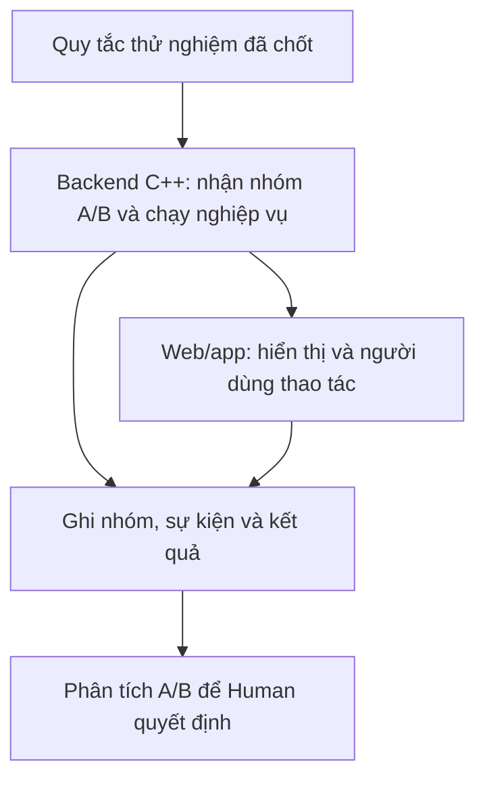

# Kidea — Giải thích vận hành lớn, rollout, A/B và lựa chọn triển khai

Ngày: 2026-09-08.

Trạng thái: TƯ VẤN VÀ GIẢI THÍCH — KHÔNG PHẢI APPROVAL G3/G4/G5/G6 HAY CHỌN NỀN TẢNG.

## Phạm vi và căn cứ

Human hỏi chín nhóm vấn đề: khoảng trống vận hành chuyên nghiệp; ví dụ rollout và A/B kể cả khi lỗi; vai trò thư viện C++; deploy linh hoạt theo sản phẩm/thành phần; đầu vào full gate khi merge; mobile update/rollback; desired/actual/freshness; ranh giới nền tảng thực thi; tích hợp và bằng chứng.

Yêu cầu được ghi nhận: chọn phương án triển khai theo từng sản phẩm và thành phần, có thể hỗn hợp hoặc đổi theo quy mô. Đây là yêu cầu thiết kế cần cụ thể hóa, chưa chốt VM, container, Kubernetes, nhà cung cấp, profile triển khai hoặc cấp quyền cài/deploy. Quy mô lớn cần được xét ngay trong yêu cầu, kiến trúc và hợp đồng; không đồng nghĩa xây trước mọi loại hạ tầng.

Nguồn hiện hành: [thiết kế](../KIDEA_DESIGN.md), [G2 đã duyệt](../KIDEA_DESIGN.md#git-integration-gate), [gate hiện tại](../KIDEA_ROADMAP.md#review-current), [tư vấn kiến trúc trước](kidea-end-to-end-control-2026-09-08.md). Thiết kế đã nêu tải, bảo mật, dữ liệu, monitoring và phục hồi; cần làm chúng thành tiêu chí đo, trách nhiệm, gate và ca kiểm chứng. Không coi các mục đó hoàn toàn vắng mặt. [QUALITY](../KIDEA_QUALITY.md) là tiêu chí của chính Kidea, không thay SLO và yêu cầu của từng sản phẩm.

Giữ nguyên: R01-T06-S01-r1 đang IN_PROGRESS / IN_REVIEW; chưa duyệt phase R01, ngưỡng QUALITY hoặc pilot. G2 cho phép Feature DONE/đủ điều kiện merge sau full gate và đủ Human gate; trạng thái đã tích hợp và đã phát hành là kết quả riêng, không sửa định nghĩa này trong bản tư vấn. Không tạo tracker hoặc bản đồ thứ tư.

## Bản giải thích

Có những phần cần làm rõ thêm để Kidea hướng dẫn vận hành ở quy mô lớn. Phần lớn đã có chỗ trong thiết kế; việc còn thiếu là chuyển chúng thành **điều kiện cụ thể, cách đo, người chịu trách nhiệm và cách xử lý khi không đạt**. Còn mong muốn chọn cách deploy theo từng sản phẩm, từng service của bạn là hợp lý.

Mình đã dùng Exa đối chiếu 60 kết quả tìm kiếm qua 4 hướng nghiên cứu; dùng tài liệu của Google SRE, AWS, Microsoft và các nền tảng liên quan để kiểm chứng. Dưới đây mình giải thích bằng ví dụ; các số liệu ví dụ là giả định, không phải số đo của các công ty đó.

**Về những phần còn thiếu trong quy trình chuyên nghiệp**, ta đã có yêu cầu về tải, bảo mật, dữ liệu, monitoring và phục hồi ở các bước 3, 5, 7, 8 và 10. Vì vậy, cần hoàn thiện các phần sau ngay tại những bước đó:

| Phần cần cụ thể hóa | Câu hỏi sản phẩm phải trả lời được |
|---|---|
| Mục tiêu chất lượng dịch vụ | Thao tác nào phải nhanh và tin cậy đến mức nào? Đo từ phía người dùng hay chỉ đo server? Khi chất lượng giảm thì có tạm dừng phát hành tính năng mới không? |
| Chịu lỗi và phục hồi dữ liệu | Chết một máy, mất một vùng hoặc dữ liệu bị ghi sai thì làm gì? Mất tối đa bao nhiêu dữ liệu và mất bao lâu để phục hồi? Đã diễn tập thành công chưa? |
| Khả năng chịu tải và chi phí | Hệ thống chịu được tải nào, còn bao nhiêu công suất dự phòng? Khi quá tải thì xếp hàng, từ chối bớt hay tăng máy? Tăng đến giới hạn chi phí nào? |
| Bảo mật trong cả vòng đời | Ai được đổi cấu hình, phát hành hoặc xem dữ liệu? Gói đang chạy được tạo từ nguồn nào? Thư viện có lỗ hổng thì cập nhật thế nào? Khóa truy cập được thu hồi, thay mới ra sao? |
| Vận hành và xử lý sự cố | Ai nhận cảnh báo, khi nào phải phản ứng, có hướng dẫn xử lý đã thử chưa? Khi người phụ trách không sẵn sàng thì làm gì? |
| Độ tin cậy của số liệu | Có phát hiện dữ liệu sai, tác vụ bị kẹt, mất log hay mất đường cảnh báo không? Server trả thành công nhưng nghiệp vụ sai có được phát hiện không? |
| Vòng đời dài hạn | Hỗ trợ app/API cũ đến khi nào? Khi nào được xóa flag, API hoặc cột dữ liệu cũ? Sau sự cố có cập nhật test và công việc phòng tái diễn không? |

Ví dụ, **SLO** là mục tiêu chất lượng dịch vụ được đo trong một khoảng thời gian. Nếu chọn “99,9% yêu cầu đăng ký hợp lệ được xử lý thành công trong 30 ngày”, ta phải định nghĩa chính xác yêu cầu nào được tính, lỗi nào được tính và lấy số liệu ở đâu. Sau đó mới chốt chính sách phản ứng khi không đạt. Google gọi phần sai lỗi còn được phép trong mục tiêu đó là *error budget*; đây là cơ sở để cân bằng việc thêm tính năng với việc sửa độ ổn định. [Ví dụ chính sách của Google](https://sre.google/workbook/error-budget-policy/).

Trước lần phát hành quan trọng, nên có một lượt **kiểm tra sẵn sàng vận hành**: không chỉ hỏi “test đã xanh chưa”, mà còn kiểm tra cảnh báo, năng lực phục hồi, tải, người xử lý sự cố và phương án quay lại. Đây là cách Google mô tả việc chuẩn bị đưa dịch vụ vào vận hành. Trong Kidea, nó có thể nằm ở bước 10, dựa trên đầu ra đã chuẩn bị từ trước. [Google Production Readiness Review](https://sre.google/sre-book/evolving-sre-engagement-model/).

Một điểm cần phân biệt: file QUALITY hiện tại đo chất lượng **của chính Kidea**. Mục tiêu tốc độ, độ sẵn sàng và phục hồi **của từng sản phẩm** vẫn phải được chọn riêng.

Để đi vào các ví dụ tiếp theo, trước hết phân biệt bốn từ bạn hỏi bằng cùng một tính năng: **quy trình đăng ký mới gồm 3 bước, thay cho 5 bước hiện tại**.

| Khái niệm | Nghĩa dễ hiểu | Ví dụ |
|---|---|---|
| **Deploy** | Đưa và khởi chạy một gói phần mềm tại môi trường đích | Đưa backend 2.4 lên production; trong đó có code cho cả quy trình cũ và mới |
| **Rollout** | Quyết định đưa thay đổi tới phạm vi nào và mở rộng theo cách nào | Ban đầu chỉ một nhóm nhỏ dùng bản mới; đủ điều kiện mới mở rộng |
| **Feature exposure** | Người dùng thực sự được tiếp xúc với tính năng | Người dùng mở màn hình và thấy quy trình đăng ký 3 bước |
| **A/B testing** | So sánh hai phương án bằng các nhóm được phân có kiểm soát và dữ liệu đo | Nhóm A dùng 5 bước, nhóm B dùng 3 bước; đo tỷ lệ hoàn tất |

Từ “rollout” có thể được dùng cho cả việc phân phối bản ứng dụng lẫn mở rộng một tính năng. Trong hồ sơ Kidea, cần ghi rõ đang rollout **gói phần mềm**, **traffic vào server**, hay **quyền dùng tính năng**. Còn exposure cần phân biệt “được phép dùng” với “đã thực sự nhìn thấy”: người có quyền nhưng chưa mở màn hình chưa tạo ra lần tiếp xúc đó.

**Rollout thực tế diễn ra thế nào?** Google mô tả việc đưa một phần người dùng tới bản mới và so sánh với bản cũ đang chạy cùng thời điểm. AWS công bố cách triển khai qua các đợt nhỏ, có thời gian quan sát và yêu cầu đủ số liệu trước khi đi tiếp. Không có một dãy tỷ lệ duy nhất mà mọi sản phẩm lớn đều phải dùng. [Google Canarying](https://sre.google/workbook/canarying-releases/), [AWS Safe Deployments](https://builder.aws.com/content/3ErTKQOTKc5NIw031UePBPxTQ6I/automating-safe-hands-off-deployments).

Giả sử backend 2.3 đang chạy ổn. Bản 2.4 đã qua kiểm chứng trước phát hành, đã được cho phép triển khai và chứa quy trình đăng ký mới đang tắt.

Trước khi đưa người dùng vào bản 2.4, ta phải biết bản cũ và mới có dùng chung database được không; bản cũ có đọc được dữ liệu bản mới ghi không; có đủ máy để giữ cả hai không; và nếu có lỗi thì chuyển về đâu.

Một lượt rollout minh họa có thể như sau:

| Chặng | Việc thực sự xảy ra | Điều kiện đi tiếp |
|---|---|---|
| Chuẩn bị, 0% người dùng thật | Khởi chạy 2.4 song song với 2.3; kiểm tra kết nối, gói chạy, cấu hình, làm nóng bộ nhớ đệm và đường đo | Bản mới sẵn sàng nhận việc, đủ tài nguyên, kiểm tra ban đầu đạt |
| Nhóm đầu tiên, 1% | Bộ phân phối yêu cầu đưa nhóm nhỏ sang 2.4; phần còn lại vẫn dùng 2.3 | Ví dụ phải quan sát ít nhất 15 phút **và** đủ 1.000 yêu cầu hoàn thành; mọi chỉ số bắt buộc đạt |
| Mở rộng 5% → 25% → 50% | Chuẩn bị thêm công suất trước mỗi lần tăng | Mỗi chặng có đủ thời gian, số liệu và nhóm client cần kiểm tra; lỗi, độ trễ và tính đúng dữ liệu đều đạt |
| Đưa tới 100% | Toàn bộ phạm vi đã chọn dùng bản mới | Đọc lại trạng thái thật; vẫn giữ khả năng phục hồi theo kế hoạch |
| Quan sát sau 100% | Theo dõi lỗi xuất hiện chậm: rò bộ nhớ, tác vụ ban đêm, tải cao | Đủ cửa sổ xác minh rồi mới xác nhận đợt phát hành đạt; monitoring tiếp tục lâu dài |

“15 phút và 1.000 yêu cầu” là ví dụ về **hai điều kiện cùng phải đạt**. Hết 15 phút nhưng mới có 40 yêu cầu thì chưa đủ. Những tác vụ kéo dài nhiều giờ cần cách quan sát khác.

Tỷ lệ cũng phải có đơn vị: 1% người dùng không nhất thiết tạo 1% request; 1 trong 10 máy không chắc nhận đúng 10% tải. Nếu chỉ chia bằng số máy, phân phối thực tế có thể lệch. [Argo về tỷ lệ canary](https://argoproj.github.io/argo-rollouts/features/canary/).

Khi có vấn đề, năm hành động sau khác nhau:

| Hành động | Nó làm gì? |
|---|---|
| **Pause** | Dừng mở rộng ở mức hiện tại. Nhóm đang dùng bản mới có thể vẫn tiếp tục dùng |
| **Abort** | Hủy việc tiếp tục đợt rollout này; thực hiện phương án giảm tác hại đã định |
| **Rollback** | Đưa phần mềm, cấu hình hoặc tuyến traffic về trạng thái trước còn tương thích |
| **Tắt tính năng** | Dùng công tắc phần mềm để ngừng một hành vi; bản code mới có thể vẫn chạy |
| **Phát hành bản sửa** | Đưa một bản mới hơn lên để khắc phục khi quay lại không phù hợp |

Ví dụ ở mức 25%, API trong backend mới làm người dùng Android lỗi khi hoàn tất đăng ký, dù quy trình 3 bước vẫn đang tắt. **Chỉ pause ở 25% chưa giải quyết được lỗi cho nhóm đó.** Hệ thống cần chuyển nhóm bị ảnh hưởng khỏi 2.4 về 2.3 nếu còn tương thích, hoặc chặn đường lỗi và phát hành bản sửa theo kế hoạch. Tắt công tắc của quy trình 3 bước vốn đã tắt không sửa được lỗi này. Sau đó phải xác minh người dùng đã được phục hồi thật.

Các nhóm tình huống chính cần có trong thiết kế là:

| Tình huống | Cách xử lý |
|---|---|
| Bản mới không khởi động khi còn 0% | Chặn rollout, giữ bản cũ, sửa bản ứng viên |
| Chỉ số đang tốt nhưng thiếu mẫu hoặc thiếu thời gian | Giữ mức hiện tại, tiếp tục quan sát trong giới hạn đã chốt |
| Mất số liệu, số liệu chậm hoặc ghi sai nhãn phiên bản | Chưa đủ căn cứ; không coi là “0 lỗi”. Nếu không còn giám sát được an toàn thì đưa về trạng thái an toàn |
| Bản mới lỗi, bản cũ ổn | Ngừng mở rộng, chuyển khỏi bản lỗi hoặc tắt tính năng; xác minh phục hồi |
| Cả bản mới và cũ cùng lỗi | Xử lý sự cố chung; kiểm tra database, cache và dịch vụ phụ thuộc. Không coi bản mới đạt chỉ vì “hai bên như nhau” |
| Chỉ một OS, khu vực hoặc loại tài khoản lỗi | Không để số trung bình che lỗi; cô lập đúng nhóm nếu làm an toàn được, hoặc dừng phạm vi rộng hơn |
| Server trả HTTP 200 nhưng ghi dữ liệu sai | Xử lý như lỗi nghiệp vụ; số lượng request thành công không đủ chứng minh đúng |
| Chỉ quá tải khi tăng từ 5% lên 25% | Giảm phạm vi theo kế hoạch; kiểm tra công suất, kết nối database và dịch vụ phía sau |
| Một thành phần đã lên, thành phần khác thất bại | Dừng bước phụ thuộc; dựa trên khả năng tương thích để quyết định giữ tổ hợp hiện tại hay quay lại |
| Tác vụ nền đang chạy hoặc hàng đợi bị kẹt | Ngừng giao việc mới cho bản lỗi; xử lý việc đang dở bằng cách hoàn thành, lưu điểm tiếp tục hoặc thử lại an toàn |
| Bản mới đã ghi dữ liệu mà bản cũ không đọc được | Không quay lại bản cũ một cách máy móc; có thể phải tắt phần ghi và phát hành bản sửa tương thích |
| Rollback thất bại hoặc lỗi xuất hiện sau 100% | Tiếp tục xử lý như sự cố; chưa được báo phục hồi thành công |
| Đã có dữ liệu sai hoặc tác động bên ngoài | Ngăn phát sinh thêm rồi đối soát, sửa hậu quả riêng; rollback code không tự thu hồi email hoặc hoàn tác dữ liệu |

Đây là các nhóm tình huống cần thiết kế cách phản ứng; lỗi cụ thể còn phụ thuộc sản phẩm. Khi chuyển traffic đi, request đang xử lý cũng cần được kết thúc an toàn trước khi tắt máy. Với dữ liệu, AWS nhấn mạnh phải kiểm cả quá trình cũ–mới cùng tồn tại và đường quay lại, không chỉ kiểm từng phiên bản khi chạy riêng. [AWS Rollback Safety](https://builder.aws.com/content/3F04j2yRAAMBuPSPs50xwXZqg01/ensuring-rollback-safety-during-deployments).

**A/B testing chuyên nghiệp là một vòng công việc riêng**, có thể dùng cùng hạ tầng phân nhóm nhưng giải quyết câu hỏi khác: quy trình đăng ký 3 bước có thực sự tốt hơn 5 bước không?

Nối với ví dụ trên: backend 2.4 đã rollout ổn định, nhưng tính năng mới vẫn tắt. Bây giờ ta mới mở hai trải nghiệm A/B trên cùng bản backend đó. Cách tách này giúp phân biệt lỗi do thay nền phần mềm với kết quả do đổi quy trình đăng ký.

Một ví dụ chi tiết:

1. **Chốt câu hỏi trước.** Giả thuyết là quy trình 3 bước tăng tỷ lệ hoàn tất đăng ký. Chỉ số chính là tỷ lệ hoàn tất; các chỉ số bảo vệ gồm lỗi, thời gian phản hồi và tỷ lệ người đăng ký xong nhưng không sử dụng được sản phẩm.
2. **Chọn người đủ điều kiện.** Chẳng hạn tài khoản mới, app đủ phiên bản và thuộc các thị trường đã hỗ trợ. Không lấy tất cả người dùng làm mẫu bất kể họ có thể sử dụng tính năng hay không.
3. **Kiểm tra hệ thống đo.** Kiểm tra sự kiện được ghi đúng ở cả hai nhánh. Khi cần, chạy A/A: chia hai nhóm nhưng cho cả hai cùng dùng cách cũ, nhằm kiểm tra cơ chế chia nhóm và đo lường.
4. **Chọn phạm vi tham gia.** Giả sử có 10.000 người đủ điều kiện, cho 20% vào thử nghiệm: khoảng 2.000 người. Chia ngẫu nhiên khoảng 1.000 vào A và 1.000 vào B.
5. **Giữ nhóm phù hợp với thiết kế.** Với thử nghiệm theo tài khoản, cùng tài khoản đăng nhập web và app tiếp tục nhận cùng nhóm trong lượt thử đó. Nếu nhiều người trong một công ty cần cùng trải nghiệm, có thể chia theo tổ chức thay vì từng cá nhân.
6. **Ghi hành vi và kết quả.** Người được xếp B chưa chắc đã mở màn hình. Người thấy B chưa chắc hoàn tất. Phải liên kết được việc phân nhóm, tiếp xúc và kết quả, đồng thời phát hiện mất dữ liệu.
7. **Theo dõi an toàn, rồi phân tích đúng kế hoạch.** Thời gian và cỡ mẫu cần được chọn theo mức chênh lệch muốn phát hiện. “Đủ 1.000 người” hoặc “đã chạy một tuần” không tự bảo đảm kết luận đáng tin.
8. **Quyết định và hoàn tất vòng đời.** Nếu B được chọn, mở rộng có kiểm soát, cập nhật hành vi chuẩn trong đặc tả và test; sau thời gian phù hợp mới dọn A và công tắc cũ.

Trong ví dụ này, **8.000 người ngoài thử nghiệm không tự trở thành nhóm đối chứng A**. Nhóm A dùng để so sánh là nhóm được phân ngẫu nhiên cùng quy trình với B. Đây là điểm rất dễ làm sai.

Microsoft, với nền tảng thử nghiệm ExP, nhấn mạnh việc xác định giả thuyết, chỉ số, đơn vị chia nhóm, danh tính ổn định và khả năng phát hiện chênh lệch trước khi chạy. [Microsoft về thiết kế thử nghiệm](https://www.microsoft.com/en-us/research/articles/patterns-of-trustworthy-experimentation-pre-experiment-stage/).

Sau khi A/B chạy, có nhiều kết quả:

| Kết quả quan sát | Quyết định phù hợp |
|---|---|
| B tốt hơn, dữ liệu hợp lệ, chỉ số bảo vệ đạt | Đề xuất chọn B và mở rộng theo quyền đã chốt |
| B có dấu hiệu tốt nhưng dữ liệu chưa đủ | Chưa kết luận; tiếp tục theo kế hoạch hoặc thiết kế lượt thử tiếp |
| Chênh lệch nhỏ, chưa có căn cứ đáng tin | Có thể giữ A; không coi “chưa chứng minh khác biệt” là chứng minh hai cách hoàn toàn bằng nhau |
| B tăng đăng ký nhưng cũng tăng crash hoặc tạo tài khoản lỗi | Không chọn B chỉ nhờ một con số đẹp; giảm tác hại và điều tra |
| Tỷ lệ nhóm lệch bất thường hoặc mất sự kiện | Dữ liệu có thể không hợp lệ; điều tra trước khi diễn giải kết quả |
| B có bug rõ ràng | Dừng B theo kế hoạch, sửa và kiểm chứng; khi đổi nội dung thử nghiệm, ghi lượt/revision mới và đánh giá lại khả năng dùng dữ liệu cũ |

Nếu B gây lỗi nghiêm trọng khi thử nghiệm đang mở cho 20%, ta ngừng phân thêm vào B và đưa người dùng về A khi đường chuyển còn an toàn. Những người đã làm dở B cần cách xử lý riêng; tắt công tắc không tự hoàn tác dữ liệu của họ. Backend 2.4 có thể tiếp tục chạy nếu lỗi chỉ nằm ở B; không nhất thiết rollback cả backend. Sau sửa, phải kiểm chứng lại và xác định lượt thử mới.

Ví dụ A có 40% hoàn tất, B có 42% thì chênh lệch là **2 điểm phần trăm**, tương đương tăng tương đối 5%. Nhưng hai tỷ lệ đó chưa đủ kết luận B thắng: còn số mẫu, cách chọn mẫu, thời gian và chất lượng dữ liệu.

Cũng không nên nhìn số liệu liên tục rồi dừng đúng lúc B vừa đẹp lên. Cần quy tắc thống kê phù hợp với cách theo dõi. **Dừng sớm để bảo vệ người dùng khỏi bug là quyết định khác với tuyên bố phương án B tốt hơn.** [Hướng dẫn kết thúc thử nghiệm](https://docs.growthbook.io/using/experimenting).

Khi sửa B giữa chừng, không mặc định gộp dữ liệu trước và sau sửa thành một kết quả. Tương tự, không so A vào ngày thường với B vào cuối tuần rồi quy mọi chênh lệch cho giao diện. Microsoft có quy trình phát hiện và điều tra dữ liệu lệch nhóm trước khi tin kết quả. [Microsoft về lệch tỷ lệ mẫu](https://www.microsoft.com/en-us/research/articles/diagnosing-sample-ratio-mismatch-in-a-b-testing/).

**Còn C++ có dùng thư viện để làm A/B không? Có thể dùng, nhưng thư viện đảm nhiệm phần kết nối và chọn hành vi.** C++ vẫn thực hiện nghiệp vụ của sản phẩm.

Trong ví dụ đăng ký:

- Code C++ có cách xử lý A và B đã được duyệt, kiểm thử.
- Thư viện hoặc một dịch vụ nội bộ trả về: “Tài khoản 42 thuộc nhóm B của lượt thử E-17”.
- Backend chạy cách B và trả dữ liệu phù hợp cho web/app.
- Các sự kiện thực tế được gửi tới hệ thống đo.
- Hệ thống phân tích so sánh A/B; Human quyết định áp dụng.

Có hai hướng kỹ thuật chính:

| Cách làm | Ý nghĩa |
|---|---|
| Thư viện C++ nằm trong backend | Nhận quy tắc về, lưu và đánh giá tại chỗ; gửi sự kiện về hệ thống phân tích |
| Dịch vụ chọn nhóm dùng chung | Backend hỏi dịch vụ nội bộ hoặc nhận quyết định đã xác định trước; cần xử lý thêm độ trễ, mất kết nối và cách dự phòng |

Ví dụ LaunchDarkly có thư viện C++ phía server; ở chế độ đồng bộ nền, dữ liệu quy tắc được giữ trong bộ nhớ và đánh giá tại backend. Vì vậy không nhất thiết mỗi request người dùng đều phải gọi ra một dịch vụ bên ngoài. Nhưng đó là hành vi của cấu hình cụ thể, không phải lời bảo đảm mọi SDK đều giống nhau. [C++ SDK](https://launchdarkly.com/docs/sdk/server-side/c-c--), [cấu hình đồng bộ dữ liệu](https://launchdarkly.github.io/cpp-sdks/libs/server-sdk/docs/html/classlaunchdarkly_1_1server__side_1_1config_1_1builders_1_1DataSystemBuilder.html).

Thư viện cũng không tự sinh số liệu đúng: sự kiện có thể bị mất, chẳng hạn khi hàng đợi đầy. Phải kiểm tra đường thu thập và đo chi phí thực tế trước khi chọn cho service C++ nhạy hiệu năng. [Cấu hình hàng đợi sự kiện](https://launchdarkly.github.io/cpp-sdks/libs/server-sdk/docs/html/classlaunchdarkly_1_1config_1_1shared_1_1built_1_1Events.html).

Nếu A/B chỉ đổi thuật toán trong backend và giữ nguyên giao diện/API, web/app có thể không cần thư viện A/B riêng. Nếu đổi cả giao diện, các client phải có cách hiển thị tương ứng và nhận quyết định thống nhất. Thư viện, nơi chạy nghiệp vụ và hệ thống phân tích là những phần nối với nhau để hoàn thành thử nghiệm.

**Về deploy theo từng sản phẩm: mình đồng ý với hướng linh hoạt bạn muốn.** Có ba lựa chọn cần tách ra:

- **Đóng gói thế nào:** file chương trình chạy trực tiếp hay container.
- **Chạy trên đâu:** máy ảo, máy vật lý hoặc dịch vụ do nhà cung cấp vận hành.
- **Quản lý việc chạy thế nào:** trình quản lý service, Docker Compose, Kubernetes hoặc nền tảng khác.

Kubernetes cũng thường chạy trên máy ảo. Docker có thể chạy trên một VM mà không có Kubernetes. Vì vậy “chạy trực tiếp → Docker → Kubernetes” là một lộ trình có thể chọn, không phải con đường bắt buộc của mọi sản phẩm.

| Tình huống | Hướng nên đánh giá |
|---|---|
| Sản phẩm nhỏ, ít thành phần | Chạy binary dưới trình quản lý service hoặc Docker/Compose trên VM; chọn theo lợi ích đóng gói, tái tạo môi trường và công vận hành |
| Nhiều bản sao service, cần tăng giảm máy | Kubernetes là một lựa chọn; nhóm VM có tự tăng giảm và bộ chia tải cũng làm được |
| C++ cần độ trễ rất thấp hoặc phần cứng đặc thù | So sánh bằng phép đo: VM chuyên biệt, máy vật lý, container hoặc node Kubernetes được cấu hình riêng |
| Hệ thống hỗn hợp | Web/API thông thường ở cluster; engine chuyên biệt ở VM; database ở dịch vụ riêng, cùng một kế hoạch release |

**Scale ngang** nghĩa là tăng số bản sao chạy đồng thời để chia tải. Khả năng này không bắt buộc Kubernetes; chẳng hạn nhóm VM EC2 Auto Scaling có thể tăng giảm và phối hợp với cân bằng tải. [AWS EC2 Auto Scaling](https://docs.aws.amazon.com/autoscaling/ec2/userguide/what-is-amazon-ec2-auto-scaling.html).

Cũng không nên mặc định “VM nhanh hơn Kubernetes”. Kubernetes có cơ chế dành CPU và sắp xếp tài nguyên cho ứng dụng nhạy hiệu năng. Quyết định cuối cần dựa trên phép đo ở phần cứng và cấu hình thật. [Kubernetes CPU Manager](https://kubernetes.io/docs/tasks/administer-cluster/cpu-management-policies/).

Với Kidea, đề xuất của mình là **mỗi sản phẩm có hồ sơ triển khai, trong đó từng thành phần có cách chạy riêng**. Hồ sơ nêu nơi chạy, cách khởi động/dừng, đo sức khỏe, tăng giảm tải, lưu dữ liệu, deploy và phục hồi. Không cần xây sẵn khả năng hỗ trợ mọi hạ tầng.

Có thể bắt đầu nhỏ, nhưng những giả định quan trọng nên được nhận diện sớm. Ví dụ nếu session đăng nhập chỉ nằm trong bộ nhớ một máy, thêm máy thứ hai có thể làm người dùng bị mất phiên. Nếu file người dùng tải lên chỉ lưu trên ổ máy đầu tiên, request tới máy thứ hai có thể không thấy file. Những vấn đề này thuộc thiết kế ứng dụng; Kubernetes không tự giải quyết thay.

Khi chuyển nền chạy về sau, Kidea phải ghi đây là một thay đổi có ảnh hưởng, cập nhật cấu hình/hướng dẫn và kiểm tra trên nền mới. Gói code cũ đạt test trên VM chưa chứng minh nó đạt khi đổi giới hạn bộ nhớ, mạng, ổ đĩa và cách dừng tiến trình trong container.

**Về “đầu vào đã kiểm chứng” khi merge:** đầu vào là toàn bộ những thứ quyết định kết quả của lượt kiểm tra. Còn *full gate* ở đây gồm toàn bộ review, đối chiếu tài liệu–code–test–ảnh hưởng và các kiểm tra bắt buộc của bản project theo G2, kể cả phần không đổi; không chỉ là thấy vài test xanh.

| Nhóm đầu vào | Ví dụ |
|---|---|
| Yêu cầu và tiêu chí đúng | Phiên bản đặc tả, rule, những nghĩa vụ phải đạt |
| Source và test | Nội dung code, nội dung test, cấu hình pipeline |
| Công cụ và thư viện | Phiên bản compiler C++, dependency và tùy chọn biên dịch |
| Cấu hình, dữ liệu thử | Rule flag, schema, dữ liệu mẫu, thông số ảnh hưởng hành vi |
| Môi trường kiểm tra | Hệ điều hành, database/cache và đặc điểm máy cần cho phép đo |

Giả sử bạn tạm dừng Feature để xử lý một bản vá:

1. Feature F được kiểm tra trên nền master M0, dùng thư viện phiên bản 2.1.
2. Trong lúc đó, bản vá đưa master tới M1 và nâng thư viện lên 2.2.
3. Khi đưa F vào M1, ta có **F + nền mới + thư viện 2.2**.
4. Bộ kết hợp này chưa được chứng minh chỉ bằng kết quả của **F + M0 + thư viện 2.1**.

Hai phần có thể ghép vào mà Git không báo conflict, nhưng hành vi kết hợp vẫn có thể lỗi. “Không conflict” chỉ nói việc ghép nội dung không gặp xung đột mà Git nhận diện được.

Cách chuyên nghiệp là chuẩn bị **bản kết hợp sẽ được merge**, chạy gate trên nó, rồi xác minh master sau merge đúng bản vừa kiểm tra. GitHub merge queue cũng kiểm tra thay đổi cùng bản mới nhất của nhánh đích theo nguyên tắc đó; ta chưa cần chọn dùng merge queue để áp dụng nguyên tắc. [GitHub Merge Queue](https://docs.github.com/repositories/configuring-branches-and-merges-in-your-repository/configuring-pull-request-merges/managing-a-merge-queue).

Có hai trường hợp:

- **Nội dung và mọi đầu vào chi phối vẫn khớp:** có thể dùng lại lượt full gate vừa chạy của chính Feature này, rồi kiểm tra xác nhận bản tích hợp theo G2.
- **Có thay đổi đầu vào hoặc không chứng minh được chúng vẫn khớp:** cần lượt full gate trên bản kết hợp mới. Kết quả cũ được giữ làm lịch sử, không dùng để báo bản mới đã đạt.

Mã commit thay đổi không phải lúc nào cũng đồng nghĩa nội dung chương trình thay đổi; ngược lại cùng commit chưa đủ nếu compiler hoặc dependency đổi. Nếu mã commit được nhúng vào bản build hoặc ảnh hưởng hành vi, nó cũng phải được tính là đầu vào. Việc chỉ ghi thêm giờ và kết quả vào báo cáo cũng không nên tạo vòng lặp “ghi báo cáo rồi phải test lại mãi”. Cần nhận diện đúng dữ liệu chi phối và dữ liệu ghi nhận kết quả. SLSA có mô hình ghi nguồn, tham số và dependency của một lần build nhằm truy lại các đầu vào kiểu này. [SLSA Build Provenance](https://slsa.dev/spec/v1.2/build-provenance).

**Về Apple và Android, cần phân biệt “cho phép nhận bản mới” với “đã cài bản mới”.**

Apple phased release chia việc **cập nhật tự động** theo lịch 7 ngày: **1% → 2% → 5% → 10% → 20% → 50% → 100%**. Người dùng vẫn có thể vào App Store và cập nhật thủ công. Vì vậy, ngày đang ở mức 5% không có nghĩa chắc chắn chỉ 5% người dùng có bản mới. Apple cho tạm dừng phased release với tổng thời gian tạm dừng tối đa 30 ngày. [Apple phased release](https://developer.apple.com/help/app-store-connect/update-your-app/release-a-version-update-in-phases/).

Với Android, lấy ví dụ 10.000 người đủ điều kiện, bản 2.0 được mở cho khoảng 20%. Đến lúc phát hiện lỗi, thực tế 1.350 người đã cài:

- Bấm dừng rollout sẽ ngăn việc phân phối tiếp theo cơ chế của store.
- **1.350 người đã cài vẫn đang có 2.0.**
- Nếu lỗi nằm trong tính năng có công tắc và đường cũ còn hoạt động, ta có thể tắt tính năng khi thiết bị nhận được cấu hình.
- Nếu app crash trước khi đọc công tắc hoặc lỗi nằm ngoài tính năng đó, thường cần phát hành app sửa.

Google hiện còn cho phép dừng cả một số bản đã rollout 100% và đưa bản trước trở lại làm bản phân phối cho người đủ điều kiện chưa ở bản lỗi. **Điều đó vẫn không tự hạ app của những người đã cài bản lỗi.** [Google staged rollout](https://support.google.com/googleplay/android-developer/answer/6346149), [dừng full release](https://support.google.com/googleplay/android-developer/answer/16285429?hl=en).

“Nguyên tử toàn bộ mobile” trong câu trước nghĩa là: tất cả thiết bị cùng đổi phiên bản, hoặc tất cả cùng quay lại như chưa từng đổi. Store không cho ta khả năng đó. Thiết bị có thể offline, chưa cập nhật hoặc đã nhận bản mới.

Hệ quả thiết kế là backend phải phục vụ được các phiên bản app còn hỗ trợ. Công tắc từ xa cũng không được hứa tác dụng tức thì trên điện thoại đang offline.

**Ba khái niệm desired state, actual state và freshness có thể hiểu bằng một màn hình deploy như sau:**

| Trường | Màn hình hiển thị | Ý nghĩa |
|---|---|---|
| **Mong muốn — desired state** | “Chạy backend 2.4 với 4 bản sao” | Lệnh/cấu hình ta đã yêu cầu |
| **Thực tế — actual state** | “2 bản sao 2.4 đang khỏe; 2 bản sao 2.3 vẫn phục vụ; rollout đang pause” | Trạng thái hệ thống đã quan sát được |
| **Độ mới dữ liệu — freshness** | “Đọc lần cuối lúc 09:05; hiện là 09:20; mất kết nối từ 09:06” | Cho biết có thể tin dữ liệu đó là hiện tại đến mức nào |

Nếu mới đọc lúc 09:20 và thấy còn bản cũ, ta biết rollout chưa hoàn tất. Nếu chỉ có dữ liệu lúc 09:05, ta chỉ biết **lúc 09:05 nó như vậy**; chưa biết hiện tại đã hoàn tất, đã lỗi hay đã được người khác xử lý.

Mong muốn khác thực tế là bình thường trong lúc triển khai. Điều cần tránh là hiện “đang chạy 2.4” chỉ vì đã gửi yêu cầu chạy 2.4. Kubernetes cũng tách phần mô tả mong muốn và phần trạng thái quan sát được theo cách này. [Kubernetes objects](https://kubernetes.io/docs/concepts/overview/working-with-objects/).

**Câu “nền tảng thực thi tách trách nhiệm/quyền và trả bằng chứng về Kidea” nói về cách các phần phối hợp với nhau.** Ví dụ bạn đã cho phép đưa release R12 lên production:

1. Kidea xác định đúng R12, môi trường production, kế hoạch triển khai và căn cứ cho phép.
2. Kidea gửi yêu cầu tới hệ thống phát hành.
3. Hệ thống phát hành kiểm tra quyền và các điều kiện bắt buộc, rồi dùng quyền triển khai của nó để thực hiện.
4. Hệ thống trả mã thao tác, tiến độ, kết quả từng bước và trạng thái thật.
5. Kidea đối chiếu kết quả với kế hoạch, hiển thị phần đã xong, phần lỗi hoặc còn chưa rõ.

“Tách quyền” nghĩa là quyền chuẩn bị code, quyền đọc log, quyền deploy dev và quyền đổi production được kiểm soát riêng. Hệ thống phát hành phải kiểm tra quyền bằng cơ chế của nó; một dòng do AI ghi “Human đã duyệt” không tự trở thành quyền triển khai.

“Tách trách nhiệm” nghĩa là Kidea quản lý yêu cầu, kế hoạch và việc đối chiếu; hệ thống phát hành chịu trách nhiệm thực hiện và ghi nhận thao tác. Các công việc đã được phép có thể tiếp tục chạy khi phiên AI đóng. Những engine khác nhau có thể triển khai Kubernetes hoặc VM riêng nhưng vẫn trả kết quả theo cách Kidea hiểu được.

Cuối cùng, **“tích hợp/bằng chứng” ở phần kế hoạch trước là cách kết nối Kidea với các công cụ và chứng minh việc đã xảy ra**. Ở đó, chữ “tích hợp” không chỉ nói tới merge code.

Ví dụ:

| Việc | Bằng chứng cần nhận được |
|---|---|
| Chạy test | Lượt chạy nào, trên bản code/cấu hình nào, chạy những bộ nào, kết quả gì |
| Build | Gói nào được tạo, từ nguồn nào, bằng công cụ nào |
| Deploy | Mã thao tác, môi trường đích, gói được chọn, từng bước thành công/thất bại |
| Xác nhận production | Thực tế chạy phiên bản nào, đọc lúc nào, kết quả kiểm tra sau deploy |
| Mở tính năng/A-B | Luật nào có hiệu lực, nhóm nào được phân, dữ liệu tiếp xúc và kết quả có hợp lệ không |

Ví dụ hồ sơ của một lệnh phải cho bạn đọc được: “DEP-42 triển khai R12 lên production; backend đạt, web thất bại; tính năng mới còn tắt; lần quan sát cuối 09:20”. Như vậy Kidea không báo “R12 đã lên” chỉ vì backend đã xong.

Nếu gửi lệnh rồi mất kết nối, Kidea dùng mã DEP-42 để hỏi lại tình trạng. Không gửi lại mù quáng và vô tình chạy migration hai lần. Bằng chứng cũng cần có nguồn đáng tin và liên kết đúng phiên bản; một file log bất kỳ không đủ chứng minh tất cả kiểm tra đều đạt.

## Nơi cần cụ thể hóa trong lộ trình hiện hành

Các dòng dưới là danh mục ảnh hưởng để chuẩn bị gói quyết định, không tự thêm task đang chạy hoặc xác nhận triển khai.

| Nội dung | Nơi đã sở hữu trách nhiệm | Khi chốt cần làm rõ |
|---|---|---|
| Merge không bỏ gate, quyền và phục hồi khi thao tác lỗi | R01 G3/G4/G5/G6; R02; R08 | Phạm vi quyền, bản đầu vào, nhận diện evidence, phân biệt đủ điều kiện / tích hợp / phát hành |
| Chất lượng dịch vụ, tải, bảo mật, vận hành và phục hồi sản phẩm | R04; profile/test R05; release R08 | Mục tiêu đo, người chịu trách nhiệm, chi phí/tài nguyên, cửa sổ tương thích, kiểm tra sẵn sàng vận hành |
| Deploy linh hoạt theo sản phẩm/thành phần | R04 kiến trúc; R05 môi trường; R08 triển khai | Cách đóng gói/nơi chạy/công cụ điều phối riêng; giao diện triển khai, sức khỏe, scaling, rollback và migration nền chạy |
| Release nhiều thành phần, rollout, flag và A/B | R04; R06 change/map; R08 | Release chung nhận diện các bản thành phần; đơn vị rollout, điều kiện mở rộng/dừng; assignment/exposure/outcome; quyền từng thao tác |
| Bằng chứng và thực tế vận hành | R02; R07 giao diện; R08 | Nguồn đáng tin, thời gian đọc, operation ID, desired/actual/stale/unknown và phát hiện sự khác biệt |
| Học từ lỗi và thử nghiệm | R06; ca lỗi R09; nghiệm thu Kidea R10 | Liên kết sự cố/kết luận A-B về đúng requirement, đặc tả, code, test, vận hành; không chỉ lưu log rời |

Giao diện điều khiển trực tuyến và nền tảng thực thi bền vững vẫn là hướng đề xuất mở rộng cần chốt ranh giới/quyền. Bản tư vấn không biến HTML chỉ đọc đã có trong phạm vi thành cổng điều khiển production được duyệt sẵn.

## Ghi chú kỹ thuật và giới hạn

- Các tỷ lệ và số người/request trong ví dụ là giả định, không phải lịch rollout của Google/AWS và không phải tiêu chí chất lượng được duyệt. Tỷ lệ user, request, instance, client được phép nhận và client đã cài là các đại lượng khác nhau.
- Không dùng trung bình toàn hệ thống che lỗi một nhóm; không coi hai bản cùng hỏng là canary đạt; không coi thiếu dữ liệu là 0 lỗi. Chỉ số và lỗi phân tích của công cụ phải có cách xử lý rõ. Ví dụ Argo có nhánh successful/failed/inconclusive/error và các giá trị dữ liệu rỗng/NaN cần chính sách: [Argo Analysis](https://argo-rollouts.readthedocs.io/en/stable/features/analysis/).
- A/B cần chốt trước đơn vị phân nhóm, danh tính, chỉ số, cỡ mẫu/phương pháp thống kê, thời gian, quyền và quy tắc dừng. Assignment khác exposure; không tự loại người chưa tiếp xúc khỏi mẫu phân tích nếu việc đó phá thiết kế phân nhóm hoặc gây thiên lệch. Đổi biến thể/quy tắc/đường đo phải có revision và quyết định về khả năng dùng dữ liệu cũ.
- Thư viện C++ chỉ là một phần của hệ thống thử nghiệm; ví dụ LaunchDarkly là minh họa được xác minh từ tài liệu, không phải nền tảng đã chọn. Chế độ đồng bộ nền có đánh giá tại chỗ; không khẳng định không có độ trễ hoặc không bao giờ mất sự kiện. Khi mất nguồn quy tắc, phải có hành vi an toàn theo nghiệp vụ, không mặc định mọi luồng đều tiếp tục bằng cấu hình cũ.
- App Store phased release điều khiển cập nhật tự động, không chặn cập nhật thủ công. Google Play dừng phân phối không hạ version của người đã cài; tính năng halt full release có điều kiện và ngoại lệ, không là khôi phục nguyên tử mọi thiết bị. Remote flag không tức thì với thiết bị offline hoặc app crash trước khi đọc flag.
- Quy tắc tương thích schema/API, xử lý dữ liệu sai, hàng đợi, tác động bên ngoài và rollback chính nó bị lỗi cần được kiểm chứng trên từng sản phẩm. Code rollback không tự undo các tác động đó.
- Full gate là nghĩa vụ của chính Feature/bản đầu vào; PASS task, Feature trước hoặc build của nền khác không thay lượt cuối. Cần kiểm bản kết hợp trước merge rồi xác nhận sau merge; gói build và môi trường production có kiểm tra riêng. Việc chỉ ghi báo cáo kết quả không được tạo vòng lặp evidence tự làm cũ chính nó.
- Chưa chạy thử runtime, benchmark C++, rollout thật hoặc A/B trên sản phẩm. Những đề xuất kiến trúc là suy luận từ tài liệu và yêu cầu, không phải năng lực hiện có của Kidea.

## Phương pháp và danh mục phát hiện nguồn

Tổng numResults của các lời gọi Exa trong lượt này: **60**, thuộc **4 hướng**, **58 URL khác nhau sau khử trùng chính xác**. Đây là số kết quả tìm kiếm, không phải 60 bài độc lập đã được đọc toàn văn; một số là bản tài liệu cũ hoặc trùng nội dung. Các nguồn bổ sung được mở trực tiếp để kiểm chứng không cộng vào số này. Chỉ tài liệu chính thức/nguồn tác giả gốc được dùng để làm căn cứ cho kết luận kỹ thuật; blog tổng hợp, podcast, Stack Overflow và các trang chỉ xuất hiện khi tìm kiếm không tự trở thành bằng chứng.

### merge/build inputs — 10 kết quả

- [docs.github.com/repositories/configuring-branches-and-merges-in-your-repository/configuring-pull-request-merges/managing-a-merge-queue](https://docs.github.com/repositories/configuring-branches-and-merges-in-your-repository/configuring-pull-request-merges/managing-a-merge-queue)
- [docs.github.com/en/pull-requests/how-tos/merge-and-close-pull-requests/troubleshooting-required-status-checks](https://docs.github.com/en/pull-requests/how-tos/merge-and-close-pull-requests/troubleshooting-required-status-checks)
- [github.com/github/docs/blob/main/content/repositories/configuring-branches-and-merges-in-your-repository/configuring-pull-request-merges/managing-a-merge-queue.md](https://github.com/github/docs/blob/main/content/repositories/configuring-branches-and-merges-in-your-repository/configuring-pull-request-merges/managing-a-merge-queue.md)
- [docs.github.com/en/pull-requests/collaborating-with-pull-requests/incorporating-changes-from-a-pull-request/merging-a-pull-request-with-a-merge-queue](https://docs.github.com/en/pull-requests/collaborating-with-pull-requests/incorporating-changes-from-a-pull-request/merging-a-pull-request-with-a-merge-queue)
- [docs.github.com/en/pull-requests/how-tos/merge-and-close-pull-requests/merging-a-pull-request-with-a-merge-queue](https://docs.github.com/en/pull-requests/how-tos/merge-and-close-pull-requests/merging-a-pull-request-with-a-merge-queue)
- [slsa.dev/spec/v1.2/build-provenance](https://slsa.dev/spec/v1.2/build-provenance)
- [slsa.dev/spec/draft/build-provenance](https://slsa.dev/spec/draft/build-provenance)
- [slsa.dev/spec/v1.1/provenance](https://slsa.dev/spec/v1.1/provenance)
- [slsa.dev/spec/v1.0/provenance](https://slsa.dev/spec/v1.0/provenance)
- [slsa.dev/spec/v1.2-rc2/build-provenance](https://slsa.dev/spec/v1.2-rc2/build-provenance)

### rollout — 15 kết quả

- [sre.google/workbook/canarying-releases/](https://sre.google/workbook/canarying-releases/)
- [sre.google/sre-book/release-engineering/](https://sre.google/sre-book/release-engineering/)
- [cloud.google.com/blog/products/gcp/how-release-canaries-can-save-your-bacon-cre-life-lessons](https://cloud.google.com/blog/products/gcp/how-release-canaries-can-save-your-bacon-cre-life-lessons)
- [sre.google/resources/book-update/release-engineering/](https://sre.google/resources/book-update/release-engineering/)
- [sre.google/sre-book/service-best-practices/](https://sre.google/sre-book/service-best-practices/)
- [builder.aws.com/content/3ErTKQOTKc5NIw031UePBPxTQ6I/automating-safe-hands-off-deployments](https://builder.aws.com/content/3ErTKQOTKc5NIw031UePBPxTQ6I/automating-safe-hands-off-deployments)
- [builder.aws.com/learn/topics/builders-library](https://builder.aws.com/learn/topics/builders-library)
- [nikcreate.com/2020/11/28/builders-library-notes-1-continuous-delivery/](https://nikcreate.com/2020/11/28/builders-library-notes-1-continuous-delivery/)
- [www.infoq.com/podcasts/clare-liguori-aws-deployments/](https://www.infoq.com/podcasts/clare-liguori-aws-deployments/)
- [www.youtube.com/watch?v=ngnMj1zbMPY](https://www.youtube.com/watch?v=ngnMj1zbMPY)
- [argo-rollouts.readthedocs.io/en/stable/features/analysis/](https://argo-rollouts.readthedocs.io/en/stable/features/analysis/)
- [github.com/argoproj/argo-rollouts/issues/1905](https://github.com/argoproj/argo-rollouts/issues/1905)
- [github.com/argoproj/argo-rollouts/issues/3850](https://github.com/argoproj/argo-rollouts/issues/3850)
- [github.com/argoproj/argo-rollouts/issues/3015](https://github.com/argoproj/argo-rollouts/issues/3015)
- [github.com/argoproj/argo-rollouts/issues/4743](https://github.com/argoproj/argo-rollouts/issues/4743)

### AB C++ mobile — 20 kết quả

- [www.microsoft.com/en-us/research/articles/diagnosing-sample-ratio-mismatch-in-a-b-testing/](https://www.microsoft.com/en-us/research/articles/diagnosing-sample-ratio-mismatch-in-a-b-testing/)
- [exp-platform.com/Documents/IEEE2010ExP.pdf](https://exp-platform.com/Documents/IEEE2010ExP.pdf)
- [www.microsoft.com/en-us/research/articles/alerting-in-microsofts-experimentation-platform-exp/](https://www.microsoft.com/en-us/research/articles/alerting-in-microsofts-experimentation-platform-exp/)
- [exp-platform.com/2017abtestingtutorial/](https://exp-platform.com/2017abtestingtutorial/)
- [exp-platform.com/2018strataabtutorial/](https://exp-platform.com/2018strataabtutorial/)
- [launchdarkly.com/docs/sdk/server-side/c-c--.md](https://launchdarkly.com/docs/sdk/server-side/c-c--.md)
- [launchdarkly.github.io/cpp-sdks/libs/server-sdk/docs/html/classlaunchdarkly_1_1server__side_1_1Client.html](https://launchdarkly.github.io/cpp-sdks/libs/server-sdk/docs/html/classlaunchdarkly_1_1server__side_1_1Client.html)
- [launchdarkly.github.io/cpp-sdks/libs/server-sdk/docs/html/classlaunchdarkly_1_1server__side_1_1config_1_1builders_1_1DataSystemBuilder.html](https://launchdarkly.github.io/cpp-sdks/libs/server-sdk/docs/html/classlaunchdarkly_1_1server__side_1_1config_1_1builders_1_1DataSystemBuilder.html)
- [launchdarkly.github.io/cpp-sdks/libs/server-sdk/docs/html/classlaunchdarkly_1_1config_1_1shared_1_1built_1_1Events.html](https://launchdarkly.github.io/cpp-sdks/libs/server-sdk/docs/html/classlaunchdarkly_1_1config_1_1shared_1_1built_1_1Events.html)
- [launchdarkly.github.io/cpp-sdks/libs/server-sdk/docs/html/classlaunchdarkly_1_1server__side_1_1IClient.html](https://launchdarkly.github.io/cpp-sdks/libs/server-sdk/docs/html/classlaunchdarkly_1_1server__side_1_1IClient.html)
- [developer.apple.com/help/app-store-connect/update-your-app/release-a-version-update-in-phases/](https://developer.apple.com/help/app-store-connect/update-your-app/release-a-version-update-in-phases/)
- [support.google.com/googleplay/android-developer/answer/6346149](https://support.google.com/googleplay/android-developer/answer/6346149)
- [www.susatest.com/blog/phased-rollouts-done-right](https://www.susatest.com/blog/phased-rollouts-done-right)
- [montemagno.com/using-phased-releases-on-google-play-and-app-store-connect/](https://montemagno.com/using-phased-releases-on-google-play-and-app-store-connect/)
- [stackoverflow.com/questions/45073264/what-happens-when-i-do-an-itunes-connect-phased-release](https://stackoverflow.com/questions/45073264/what-happens-when-i-do-an-itunes-connect-phased-release)
- [support.google.com/googleplay/android-developer/answer/16285429?hl=en](https://support.google.com/googleplay/android-developer/answer/16285429?hl=en)
- [android-developers.googleblog.com/2025/05/io-2025-whats-new-in-google-play.html](https://android-developers.googleblog.com/2025/05/io-2025-whats-new-in-google-play.html)
- [support.google.com/googleplay/android-developer/answer/16285429?hl=en-GB](https://support.google.com/googleplay/android-developer/answer/16285429?hl=en-GB)
- [support.google.com/googleplay/android-developer/answer/16285429?hl=en-GB_sg](https://support.google.com/googleplay/android-developer/answer/16285429?hl=en-GB_sg)
- [support.google.com/googleplay/android-developer/answer/6346149](https://support.google.com/googleplay/android-developer/answer/6346149)

### professional operations and deployment — 15 kết quả

- [sre.google/sre-book/launch-checklist/](https://sre.google/sre-book/launch-checklist/)
- [sre.google/sre-book/evolving-sre-engagement-model/](https://sre.google/sre-book/evolving-sre-engagement-model/)
- [sre.google/sre-book/reliable-product-launches/](https://sre.google/sre-book/reliable-product-launches/)
- [sre.google/resources/practices-and-processes/production-launch-planning/](https://sre.google/resources/practices-and-processes/production-launch-planning/)
- [sre.google/sre-book/service-best-practices/](https://sre.google/sre-book/service-best-practices/)
- [docs.aws.amazon.com/wellarchitected/latest/framework/the-pillars-of-the-framework.html](https://docs.aws.amazon.com/wellarchitected/latest/framework/the-pillars-of-the-framework.html)
- [docs.aws.amazon.com/wellarchitected/latest/framework/welcome.html](https://docs.aws.amazon.com/wellarchitected/latest/framework/welcome.html)
- [docs.aws.amazon.com/pdfs/wellarchitected/latest/framework/wellarchitected-framework.pdf](https://docs.aws.amazon.com/pdfs/wellarchitected/latest/framework/wellarchitected-framework.pdf)
- [aws.amazon.com/architecture/well-architected/](https://aws.amazon.com/architecture/well-architected/)
- [docs.aws.amazon.com/wellarchitected/latest/framework/definitions.html](https://docs.aws.amazon.com/wellarchitected/latest/framework/definitions.html)
- [kubernetes.io/docs/tasks/administer-cluster/cpu-management-policies/](https://kubernetes.io/docs/tasks/administer-cluster/cpu-management-policies/)
- [kubernetes.io/docs/concepts/workloads/resource-managers/](https://kubernetes.io/docs/concepts/workloads/resource-managers/)
- [kubernetes.io/docs/concepts/workloads/autoscaling/horizontal-pod-autoscale/](https://kubernetes.io/docs/concepts/workloads/autoscaling/horizontal-pod-autoscale/)
- [kubernetes.io/docs/tasks/administer-cluster/topology-manager/](https://kubernetes.io/docs/tasks/administer-cluster/topology-manager/)
- [v1-36.docs.kubernetes.io/docs/concepts/workloads/autoscaling/horizontal-pod-autoscale/](https://v1-36.docs.kubernetes.io/docs/concepts/workloads/autoscaling/horizontal-pod-autoscale/)
