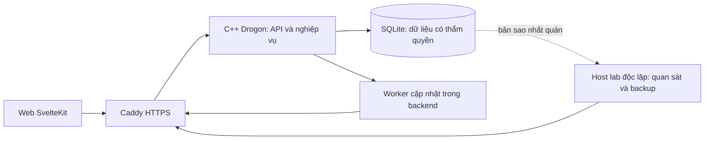

# Kiến trúc pilot — AR-r2 (đề xuất sửa sau review)

**Amendment Web r2, 2026-09-17 — theo quyết định Human:** client hiện hành chỉ Web; app Android/iOS là Future chưa roadmap/thời hạn. Giữ nghiệp vụ, ngưỡng backend/Web, 137 source ID và 20 nhóm TC; A/I/N1/N2 chỉ là biến thể Future, không PASS/N/A mới. Hồ sơ r1 và kết quả lab cũ giữ đúng nguồn; amendment không là nghiệm thu ứng dụng hoặc R05. Nguồn quyết định và snapshot/hash trước–sau: repo Kynderis/kidea, `KIDEA_DESIGN.md#client-web-scope-approved`, `tests/evidence/r05/web-scope-r1/manifest.json`.

Ngày 2026-09-15. **AR-r1/K1–K7 đã duyệt; bản sửa AR-r2/C1–C5 IN_REVIEW, chưa áp dụng**, chưa code/cài/chạy. Đầu vào Q1–Q6, UX1–UX6/SEO, O1–O6 và A1–A6 đã được Human duyệt; các nhãn đề xuất trong bản nguồn là lịch sử tại thời điểm soạn. Đây là bài thử phương pháp Kidea, không phải Kidea đổi thành ứng dụng workshop.

## Gói quyết định đầy đủ

| Mã | Khuyến nghị | Ví dụ, đánh đổi và giới hạn |
|---|---|---|
| K1 | Một backend C++20/Drogon trên Ubuntu; SQLite trên ổ cục bộ; Web SvelteKit/TypeScript; Android Kotlin/Compose, iOS Swift/SwiftUI Future chưa roadmap | Ít thành phần phải vận hành; chưa phân tán/nhiều máy ghi. Chưa chứng minh đạt tải Q |
| K2 | Ghi nghiệp vụ, kết quả yêu cầu, dấu admin và nghĩa vụ cập nhật trong cùng transaction; worker cập nhật nằm trong backend | Sập sau lưu nhưng trước phát tin: khởi động lại vẫn biết việc phải phát; không thêm Redis/broker |
| K3 | Mỗi ý định admin có mã riêng để đọc đúng kết quả; server chống thực thi trùng cùng mã, client không tự gửi lại mutation | Tạo workshop mất phản hồi thì tra theo mã, không tìm theo tên. Không đủ chứng cứ vẫn báo chưa xác nhận; không hứa mọi unknown tự hết |
| K4 | Chỉ gửi các trường admin thực sự sửa; server xử lý tuần tự, cùng trường thì lần xử lý sau thắng | Hai tab đổi tiêu đề A/B: kết quả sau là B nếu B được xử lý sau. Không khóa form hoặc thêm điều kiện version khiến đăng ký làm hỏng sửa nội dung |
| K5 | HTTPS cùng origin cho web/API, Caddy làm cổng; phiên giả do server cấp, không tin role client; WebSocket chỉ cập nhật/đối chiếu | Không lộ token trong URL; backend quyết định quyền. Thêm một cổng cấu hình nhưng tránh tự viết TLS/proxy; không tự cài chứng chỉ tin cậy |
| K6 | Backup nhất quán mỗi 5 phút sang máy/ổ thuộc miền lỗi độc lập; restore đổi mã thế hệ dữ liệu | Máy chủ hỏng vẫn còn bản sao; request cũ không tự phát lại sau phục hồi. Cần xác nhận máy đích ở phiên triển khai, không dựng VM trên ổ C bây giờ |
| K7 | Một bộ quan sát chỉ đọc và màn dự phòng riêng thuộc lab, chạy trên host độc lập backend; chỉ hoạt động trong phiên thử đã xác nhận | Backend và dashboard chính hỏng vẫn có đường thấy cảnh báo. Không SaaS, email/SMS/push, automation Codex hay trực 24/7 |

K3 đã được duyệt ở AR-r1, không viện R-RETRY để tự cấp retry admin. K4 công khai khả năng thay thế giá trị khi tranh chấp; nếu muốn từ chối mọi bản sửa cũ, phải chốt thay đổi nghiệp vụ/AC ở nguồn trước, không thêm ngầm vào code. Approval AR-r1 không cấp cài thư viện, sửa bảo mật, tạo ứng dụng, deploy hoặc nghiệm thu ngưỡng.

### C1–C5 — Phần sửa sau review độc lập

C1 sửa phạm vi mã đăng ký theo actor, giữ admin K3 riêng. C2 chọn hợp nhất lịch sử cá nhân theo actor/epoch/workshop/audience và version. C3 bổ sung lifecycle/drain. C4 bổ sung giới hạn nhận tải và ca quá tải. C5 bổ sung các cạnh nguồn/case/backlink bị thiếu. K1–K7 còn lại giữ nguyên; đây không là miễn lỗi hoặc kết quả đã được áp dụng.

## Thành phần, chủ dữ liệu và hướng phụ thuộc

Nguồn: [phạm vi admin](admin.md#scope), [các màn](experience.md#screens), [quyền](../business/shared/workshop.md#access), [workload](quality.md#workload).

Trình duyệt nhận HTML từ SvelteKit Node qua cùng cổng; server SSR gọi API C++ qua địa chỉ nội bộ cố định. Sơ đồ gộp đường HTML để dễ đọc. C++ sở hữu mọi rule, quyền và kết quả mutation; Web chỉ kiểm nhập sớm và hiển thị. Không client hoặc monitor ghi thẳng DB. C++ tách module transport/auth, domain, SQLite repository, outbox và telemetry trong một tiến trình; không phải microservices. Dùng SQLite C API với transaction tường minh cho đường ghi, không để ORM tự chia commit.

Caddy proxy HTTP/WebSocket; Node chạy adapter-node cho SSR. Không Redis, broker, container orchestrator hoặc database server riêng. Drogon có HTTP/WebSocket và hỗ trợ C++20 theo [tài liệu dự án](https://github.com/drogonframework/drogon); [adapter-node](https://svelte.dev/docs/kit/adapter-node) và [Caddy reverse proxy](https://caddyserver.com/docs/caddyfile/directives/reverse_proxy) là căn cứ khả năng, không bằng chứng tương thích/hiệu năng tổ hợp này.

## Ghi nguyên khối và khôi phục công việc

Nguồn: [retry](../business/shared/registration.md#retry), [invariant](../business/shared/registration.md#invariant), [thứ tự tranh chấp](../business/shared/registration.md#serial), [thứ tự từ chối](../business/shared/registration.md#new), [nghĩa vụ xuất bản](../business/shared/availability.md#publish), [audit](admin.md#audit), [phục hồi](quality.md#recovery).

SQLite WAL, synchronous=FULL, foreign_keys=ON; kiểm giá trị thực khi mở connection, không chỉ gửi PRAGMA. Một hàng ghi có giới hạn trong RAM, một writer connection dùng BEGIN IMMEDIATE; read connection đọc snapshot ngắn. Hàng RAM không là bằng chứng đã nhận/lưu yêu cầu. Bận/đầy/lỗi I/O không tự chuyển thành từ chối nghiệp vụ. Transaction chưa chắc rollback/commit phải được đối chiếu bằng mã, không gửi kết quả cuối phỏng đoán. Không chạy SQL blocking trên event loop mạng.

Mô hình logic (DDL/index chi tiết ở bước code, không phải schema .kidea):

| Nhóm dữ liệu | Chủ và ràng buộc |
|---|---|
| workshop | ID ổn định, nội dung/lịch/timezone/C/state, version; trạng thái/miền đúng W-DATA/W-STATE |
| registration | ID, actor, workshop, ACTIVE/CANCELLED; unique có điều kiện cho một ACTIVE/actor/workshop; không xóa lịch sử |
| request_result | Đăng ký/hủy: unique (epoch, actor đã xác thực, namespace registration, requestID), lookup cùng khóa; hai actor có cùng literal mã là hai ý định độc lập. Admin: unique (epoch, namespace admin, intentID), ràng buộc actor/content theo K3; khác actor không đọc hoặc dùng lại ý định admin đó. Cả hai giữ canonical content và kết quả |
| outbox | nghĩa vụ bền vững theo workshop/version/audience, trạng thái xử lý và lỗi; dữ liệu riêng không nằm trong public snapshot |
| admin_audit | correlation và các trường cho phép ở A-AUDIT, ghi cùng mutation; không endpoint đọc audit mới |
| metadata / session | schema version, epoch, mốc backup và fake actor/quyền/phiên; bí mật không đưa vào bằng chứng công khai |

N lấy từ đếm ACTIVE có index trong transaction, không có một bộ đếm cache thứ hai quyết định nhận chỗ. Writer kiểm đúng thứ tự R-NEW trên trạng thái hiện hành; unique/check/foreign key là lớp bảo vệ thêm. Vi phạm invariant phát hiện sau đọc có thẩm quyền là sự cố, không tự sửa dữ liệu. Không ưu tiên admin hoặc công bằng theo thời điểm bấm.

Trong một commit: thay đổi domain thật + kết quả cuối + audit admin nếu có + outbox. No-op/từ chối giữ kết quả đúng hợp đồng nhưng không tăng version/phát domain event. FULL/WAL là lựa chọn để bảo vệ commit trước sự cố nguồn điện trên storage tuân thủ flush, không thay thử mất điện/ổ lỗi. SQLite chỉ có một writer đồng thời; xem [transaction](https://www.sqlite.org/lang_transaction.html), [WAL](https://www.sqlite.org/wal.html) và [synchronous](https://www.sqlite.org/pragma.html#pragma_synchronous).

Worker đọc nghĩa vụ đã commit, dựng snapshot nhất quán có version, ghi trạng thái projection/phát; khởi động lại quét nghĩa vụ chưa hoàn tất. Crash giữa phát và đánh dấu có thể phát trùng: receiver bỏ bản cũ, không áp phép cộng/trừ lặp. Đánh dấu nghĩa vụ xử lý không chứng minh từng client đã thấy; đo delivery coverage riêng. Không xóa outbox/audit/result tự động trong vòng đời lab.

## Đối chiếu ý định admin và sửa đồng thời

Nguồn: [lệnh admin](admin.md#commands), [xác nhận](admin.md#confirm), [unknown](admin.md#errors), [sửa nội dung](../business/shared/workshop.md#edit), [trạng thái](../business/shared/workshop.md#state), [retry đăng ký](../business/shared/registration.md#retry).

K3: client sinh UUID ngẫu nhiên cho mỗi ý định admin, giữ mã và nội dung gốc trước gửi trong vùng local dành đúng actor; không lưu token cùng payload. Gửi một POST, UI khóa double click. Server kiểm quyền hiện tại, ràng buộc mã với actor + loại lệnh + workshop (nếu có) + nội dung canonical + epoch. Hai bản sao cùng mã cùng nội dung chỉ có tối đa một kết quả thực thi; khác nội dung/actor báo không thể dùng mã, không trả dữ liệu của người khác. Giữ kết quả trong vòng đời lab. Đây không là cơ chế tự chạy lại hành động.

Sau timeout chỉ GET trạng thái cùng mã: FINAL trả kết quả lịch sử, UNKNOWN không chứng minh chưa thực hiện. Nếu lệnh còn trong hàng chưa commit hoặc không tìm thấy mã, vẫn UNKNOWN; không kết luận tạo mới an toàn. Nếu server xác nhận rollback chưa lưu gì nhưng không có kết quả bền vững, cũng không bịa final. Không dùng title trùng, state bằng đích hoặc list hiện tại để nhận thành công lịch sử. Tạo thành công trả workshopID từ chính result. Client reload chỉ khôi phục đối chiếu sau xác thực đúng actor, không POST lại, không tạo mã mới thay unknown. Muốn bỏ một unknown rồi thực hiện ý định thay thế cần xử lý/chốt riêng, không có nút retry tự động mới trong gói này. Đăng ký/hủy giữ nguyên R-RETRY, không bị chính sách admin thay thế.

K4: edit gửi patch các trường thực sự sửa, nhưng server ghép với bản hiện hành rồi validate toàn đối tượng. Lịch gồm start/end/timezone gửi như một nhóm; không ghép nửa lịch từ hai lần sửa. Đặt state là lệnh riêng; create gửi đầy đủ trường, không kèm publish. Form theo dõi version, thấy thay đổi thì giữ bản nhập, tải bản mới và yêu cầu xem lại như A4. Không áp expectedVersion như một điều kiện từ chối server mới. Nếu thay đổi đến sau xác nhận, thứ tự xử lý có thẩm quyền quyết định: cùng trường lần sau thắng nếu hợp lệ; khác trường không gửi giá trị cũ đè trường người dùng không sửa. K4 không hứa chống mọi lost update, khóa dialog hay ưu tiên sửa C trước đăng ký. Ví dụ C10/N9: đăng ký trước khiến giảm C9 bị từ chối; giảm trước khiến đăng ký hết chỗ.

## Hợp đồng API và quyền

Nguồn: [retry](../business/shared/registration.md#retry), [miền dữ liệu](../business/shared/workshop.md#data), [quyền](../business/shared/workshop.md#access), [danh sách](../business/shared/workshop.md#lists), [riêng tư](quality.md#privacy), [UX lỗi](experience.md#error).

HTTPS JSON UTF-8 `/api/v1`. IDs là chuỗi đục; version 64-bit truyền chuỗi thập phân để không mất chính xác trên JavaScript. Mutation có epoch + requestId/intentId + action/payload, không nhận role/actor như căn cứ quyền từ body. Canonical content dùng đối tượng typed sau chuẩn hóa miền; không so raw JSON khác thứ tự key, không bỏ qua field có ý nghĩa. Từ chối duplicate key, kiểu sai, field lạ, Unicode không hợp lệ. Giới hạn body đề xuất 128 KiB đủ cho miền nội dung đã chốt kể cả JSON escape; không nới/cắt ngắn miền business. C++ phải có kiểm grammar plain text cho HTML/Markdown, không cấm mọi dấu câu; bộ vector cụ thể chốt ở quy tắc code trước triển khai.

| Endpoint nhóm | Nội dung và audience |
|---|---|
| GET /workshops, /workshops/{id} | Snapshot public OPEN/PAUSED; DRAFT và không tồn tại cùng lỗi không thể truy cập |
| GET /me/registrations | Lịch sử chính chủ ACTIVE/CANCELLED, không participant list của admin |
| POST /registrations, /registrations/{id}/cancel | R-NEW/R-RETRY; actor từ auth, hủy đúng registrationID |
| GET /requests/{id} | Kết quả đăng ký/hủy của đúng actor, kiểm quyền hiện tại |
| GET /admin/workshops, /admin/workshops/{id} | Nội dung admin gồm DRAFT và N tổng hợp |
| POST /admin/intents; GET /admin/intents/{id} | Create/edit/state theo K3; GET chỉ đối chiếu, không audit browser mới |
| GET /operations | M1–M9 có observedAt, tuổi dữ liệu, trạng thái valid/unknown; chỉ admin |
| WSS /updates | Snapshot/heartbeat/subscription có quyền; không mutation qua socket |

Kết quả mutation phân biệt FINAL(APPLIED/NO_CHANGE/REJECTED, stable domain code), UNKNOWN và lỗi transport. HTTP 200 cho kết quả domain cuối; 202 cho còn chưa xác nhận; 400 cú pháp, 401 chưa xác thực, 404 generic đối tượng/mã ngoài phạm vi hoặc không có, 409 mã/nội dung hay epoch không tương thích, 503 không phục vụ. Không diễn giải 404 của truy vấn mã unknown thành bằng chứng chưa từng thực thi. Mỗi endpoint ghi rõ loại lỗi trong OpenAPI ở bước triển khai; không tạo khác biệt 403/404 làm lộ đối tượng kín. HTTP lỗi/timeout sau gửi không phủ định commit. Không đưa stack trace/secret vào lỗi.

Phiên giả được bootstrap ngoài UI ở phiên thử được phép, server lưu mapping quyền; không account management/OAuth mới. Web cookie HttpOnly/Secure/SameSite, chống CSRF với token và kiểm Origin cho mutation/handshake; thiết kế token native trong secure storage của OS, không URL, giữ lịch sử Future. Logout/đổi actor xóa dữ liệu hiển thị và khóa kho ý định của actor trước; không đưa payload của actor cũ cho phiên mới. Kiểm quyền mỗi request và trước mỗi phát dữ liệu socket, đóng subscription khi thu hồi. Session có hạn trong cửa sổ lab và bị thu hồi khi kết thúc/restore; credential/bootstrap cụ thể chưa được tạo. Nguyên tắc tham khảo [OWASP session management](https://cheatsheetseries.owasp.org/cheatsheets/Session_Management_Cheat_Sheet.html), phải kiểm thực tế từng platform.

## Cập nhật, cache, rendering và mất tín hiệu

Nguồn: [quyền/audience](../business/shared/workshop.md#access), [xuất bản](../business/shared/availability.md#publish), [đối chiếu](../business/shared/availability.md#reconcile), [stale](../business/shared/availability.md#stale), [độ tươi](quality.md#freshness), [SEO](experience.md#seo), [thao tác](experience.md#action).

Public snapshot chứa epoch/workshopID/version và trường public nhất quán; không actor, registrationID/requestID. Private registration snapshot có cùng phạm vi actor đã xác thực, không broadcast public. HTTP /me/registrations và socket cùng dùng các nhóm (actor, epoch, workshopID), mỗi nhóm có workshopVersion và toàn bộ lịch sử registration của chính actor trong workshop đó tại cùng snapshot DB. Client giữ high-water riêng theo nhóm và audience (public/admin/private), không so version giữa hai workshop hoặc lấy version public loại bản private hợp lệ. Collection HTTP được hợp nhất từng nhóm, không replace toàn danh sách; thiếu nhóm trong response cũ không xóa nhóm client đã biết. Trong epoch hiện hành không xóa lịch sử theo R03, nên hợp nhất như vậy không mất tombstone. Cùng nhóm: mới hơn thay toàn nhóm, cũ/lặp bỏ, cùng version khác nội dung đánh dấu unknown và đối chiếu. GET ACTIVE đến muộn sau socket CANCELLED không được hồi sinh ACTIVE; cancel/rebook giữ hai ID. Đổi actor/epoch hủy mọi response đang chờ của thế hệ cũ và xóa derived cache trước tải lại, không so số version qua epoch. [R-RETRY](../business/shared/registration.md#retry) và [lịch sử](../business/shared/workshop.md#lists) vẫn là nguồn nghĩa, không thêm global revision. Đọc HTTP snapshot thẳng authoritative transaction; không read replica hoặc cache nhận chỗ. SSR list/detail dùng snapshot có quyền, URL ID không đổi theo tên; trang giới thiệu prerender, private HTML và API dùng no-store. Public pilot cũng không cache server/CDN lâu: no-store đơn giản, chưa tối ưu cache. Không Event structured data, mở indexing hoặc phát hành Internet; giữ technical SEO/metadata và noindex lab đã duyệt.

Socket heartbeat 2 giây, gồm chứng cứ kết nối sống, không giả có domain event. Snapshot version mới thay trọn trạng thái, bỏ bản cũ; cùng version khác nội dung phải đánh dấu chưa chắc và GET đối chiếu. Snapshot mới hơn có thể phủ các version bỏ lỡ; không replay mutation. Đăng ký socket trước rồi GET snapshot, buffer/bỏ version cũ trong lúc hợp nhất để tránh khe subscribe/read. Reconnect thực hiện lại theo epoch và tải snapshot/history có quyền. Giới hạn queue phía socket theo [admission](#admission), client chậm bị ngắt và reconcile, không chặn writer. Timer stale chạy cục bộ: biết mất kết nối ≤1 giây; không có chứng cứ sống >5 giây thì unknown. Các ngưỡng Q vẫn phải đo, không lấy heartbeat thay số đo cập nhật domain.

## C4 — Chống lạm dụng và giới hạn nhận tải (đề xuất)

Nguồn: [QS](quality.md#privacy), [workload](quality.md#workload), [QR](quality.md#response), [retry](../business/shared/registration.md#retry), [unknown admin](admin.md#errors). Không thêm service; thực thi tại transport/admission của backend, trước đưa vào hàng nghiệp vụ. HTTP và WebSocket dùng chung số đếm đã xác thực, không tin actor/IP proxy client tự khai; chỉ nhận forwarded address từ cổng đã xác nhận.

Profile lab khuyến nghị: HTTP tối đa 128 yêu cầu đang xử lý toàn backend, hàng ghi tối đa 64; token bucket 100 request/giây toàn cổng với burst 200, 20/giây mỗi actor với burst 40, khách ẩn danh 20/giây mỗi địa chỉ nguồn với burst 40. Socket tối đa 128 toàn backend, 8/actor hoặc 16/địa chỉ khách; hàng outbound mỗi socket tối đa 8 thông điệp và 1 MiB (chạm điều kiện nào trước thì đóng kết nối và đối chiếu). Frame client tối đa 8 KiB, 5 frame/giây/socket với burst 10; heartbeat do server phát riêng. Body HTTP 128 KiB như hợp đồng API. Đây là giới hạn lab đề xuất để có hành vi hữu hạn, không số đo chịu tải: R05 kiểm profile/giá trị, R09 kiểm WQ1/WQ2 và có thể đề xuất đổi qua gate, không tự tăng để test xanh. Không xem IP là danh tính; các tài khoản có thể dùng chung mạng.

Quá rate/count/queue trước admission: trả 429 hoặc 503 kèm lỗi kỹ thuật chưa nhận thêm lần gửi này, không lưu FINAL(REJECTED) nghiệp vụ, không tạo domain event. Việc lần gửi này chưa được nhận không phủ định một lần trước cùng mã đã commit. Sau admission/commit mà mất phản hồi vẫn UNKNOWN cho client cho đến đối chiếu. Retry-After chỉ là thời điểm có thể thử kênh, không cấp quyền tự POST admin hay đổi mã đăng ký. Đóng socket do tràn phải kích hoạt stale/reconcile, không replay mutation. Theo [định nghĩa tín hiệu](operations.md#signals), 429/503 thuộc mẫu WQ phải tính là lỗi kỹ thuật M7 trong nhóm đọc/ghi và cửa sổ đã chốt, không loại khỏi phép đo. M2 chỉ ghi lỗi xử lý/đối chiếu còn mở theo đúng định nghĩa OP; một lần rate-limit bình thường không tự tạo incident M2. Queue/connection count chỉ là bộ đếm nội bộ phục vụ admission, không thêm chỉ số/màn monitoring; muốn công bố chúng phải duyệt thay đổi OP riêng. Không log payload/secret hoặc thêm màn điều khiển.

## Backup, restore và dung lượng

Nguồn: [QD](quality.md#recovery), [ngân sách](quality.md#resources), [M8/M9](operations.md#signals), [audit](admin.md#audit).

Backend tạo bản sao bằng SQLite online backup API, không copy riêng file .db đang chạy WAL. Mỗi 5 phút trong cửa sổ thử, tạo watermark bền vững ngay trước snapshot; watermark biểu thị mốc toàn bộ commit trước đó được bao phủ, không phải giờ thay đổi workshop cuối. Nếu backup bị restart do ghi đồng thời, mốc cũ vẫn là lower bound bảo thủ. Snapshot bao gồm domain/result/audit/outbox/actor cùng một recovery point. Chuyển tới host độc lập qua kênh mã hóa xác thực; chỉ đánh dấu VERIFIED khi đích ghi bền, hash/manifest khớp và kiểm DB đọc được/integrity, không chỉ exit 0. [SQLite backup API](https://www.sqlite.org/backup.html) là căn cứ cách lấy snapshot, không chứng minh thời gian phục hồi.

Không có host độc lập/backup verified thì M9 unknown hoặc quá hạn, không báo sẵn sàng chạy. Ổ C/D trên cùng ổ vật lý hoặc backup trong chính VM/host bị mất không đáp ứng. Tổng DB+WAL+log+outbox+audit+backup và bản tạm trên các nơi tính chung 2 GiB; không tự xóa bản cũ khi đầy. Kiểm headroom trước backup/run, cảnh báo 80%, dừng bài tải theo QB khi hết khả năng an toàn. SDK/toolchain/build không nằm trong 2 GiB và chưa được cài.

Crash với ổ còn nguyên: mở DB/recovery transaction, quét outbox; không mất kết quả đã xác nhận, mục tiêu ≤5 phút. Mất ổ: restore thủ công theo quyền phiên triển khai, chỉ từ điểm verified, chấp nhận ngoại lệ QD mất ≤15 phút và mục tiêu ≤60 phút. Trước phục vụ trở lại sinh epoch mới không lấy nguyên epoch trong backup, thu hồi toàn session và đóng socket; client phải đăng nhập/tải lại, cache cũ không trộn vào dữ liệu mới. Mutation epoch cũ bị chặn trước domain. Kết quả còn trong bản sao chỉ được đọc lịch sử theo đúng actor/quyền hiện tại; ý định nằm sau recovery point vẫn chưa xác nhận, không tự replay từ local/audit. Không gọi restore là rollback phần mềm.

## Quan sát độc lập và trách nhiệm phiên thử

Nguồn: [M1–M9](operations.md#signals), [đường hiển thị](operations.md#display), [ngưỡng/cảnh báo](operations.md#alerts), [xử lý](operations.md#response), [riêng tư](operations.md#privacy).

Backend xuất số đo có thời điểm lấy mẫu thật và metadata lỗi còn mở. Bộ quan sát Node nhỏ trên host lab độc lập dùng probe 5 giây/timeout 2 giây, giữ metadata incident bền vững và phục vụ màn dự phòng riêng; đây là thành phần chỉ đọc của lab, không một SaaS hay job do phiên AI giữ sống. Không chạy cùng backendhost làm phương án fallback. Observer đọc M1–M7 mỗi 2 giây, M8/M9 mỗi 30 giây và giữ toàn bộ quy tắc freshness/unknown/recovery/gom cảnh báo của OP, không đổi ngưỡng cho thuận triển khai. Backend hỏng không ngăn observer render cảnh báo từ probe; browser dự phòng phải còn hoạt động trong cửa sổ Human đã nhận.

Lag domain đo commit-to-cover bằng ID/version và collector thời gian có kiểm sai số đồng hồ; R09 chốt bố trí đo, độ lệch clock và thu đủ observer, không lấy timestamp client chưa đồng bộ trừ server rồi báo đạt. HTTP probe tốt không chứng minh writer/backup tốt. Dữ liệu ops và backup không public, endpoint/credential chỉ quyền đọc cần thiết. Observer cũng có heartbeat trên màn dự phòng; mất chính observer phải hiện unknown từ client, không giữ xanh cũ. Chưa có dự phòng thứ ba hoặc cam kết chống mọi lỗi đồng thời.

Human chỉ là người nhận/xử lý trong cửa sổ xác nhận, không nhận trực nền. Không thêm nút ack/mute/replay/restart/restore. Việc dừng bài tải, sửa nguyên nhân hoặc phục hồi thực hiện ngoài màn giám sát theo quyền cụ thể; không dùng một cảnh báo để tự cấp quyền sửa máy.

## Môi trường, phát hành, tương thích và điều kiện còn mở

Nguồn: [môi trường/latency](quality.md#client-seo), [tài nguyên](quality.md#resources), [phục hồi](quality.md#recovery), [vận hành](operations.md#response), [tín hiệu](operations.md#signals), [UX kiểm](experience.md#cases).

Đề xuất Ubuntu host cho C++/SQLite + SvelteKit Node + Caddy; host thứ hai cho observer/backup; Android/iOS build/native Future chưa roadmap. Máy tải độc lập backend, manifest phần cứng/mạng theo Q phải xác nhận R09. Không yêu cầu dựng VM trên máy hiện tại. Không hứa có sẵn Ubuntu/Mac/host thứ hai hoặc đủ ổ đĩa. Địa chỉ/port/firewall/chứng chỉ, đường dữ liệu trên D hoặc host được cấp, tài khoản dịch vụ/secret, retention và lịch chạy thực chốt trong gói môi trường, chưa thao tác máy.

Caddy chỉ dùng cert lab đã được cấp hoặc local CA cấu hình không tự cài trust; không public ACME. Tài liệu [automatic HTTPS](https://caddyserver.com/docs/automatic-https) nêu việc tự cài trust có thể xảy ra mặc định: phải tắt bằng skip_install_trust khi dùng local CA; cấp trust cho client là thao tác riêng cần quyền. Không hạ kiểm TLS/trust Web để làm test xanh.

### C3 — Lifecycle từng thành phần (đề xuất, chưa chạy)

| Thành phần / artifact | Chủ tiến trình, readiness/config | Start/stop và in-flight |
|---|---|---|
| Backend C++ + SQLite | Binary và manifest/config tách secret; một tiến trình dưới tài khoản được cấp, SQLite không service riêng. Health tách live/read-ready/write-ready; schema/epoch/quyền đường DB và worker phục hồi hợp lệ mới read-ready | Người vận hành phiên mở backend ở trạng thái chưa nhận mutation, phục hồi DB/outbox; không auto sửa schema/restore. Dừng nhận mới trước drain, không ACK phần còn hàng RAM |
| SvelteKit Node | Build bundle + runtime/config cố định; tiến trình riêng do người vận hành quản lý; backend read-ready, SSR/private/no-store và health đúng mới sẵn sàng | Mở sau backend; dừng ingress/workload trước đóng Node, response bị cắt không được đổi nghĩa mutation |
| Caddy | Binary/config/cert đã cấp, tiến trình riêng; kiểm cấu hình/TLS/route health; không cài trust tự động | Là cổng chặn nhận mới khi bảo trì; chỉ mở mutation route khi backend write-ready. Khi dừng, giữ đường đọc/probe nếu còn an toàn cho đến drain xong |
| Observer + backup nhận | Bundle Node/config/quyền đọc và nơi backup riêng; tiến trình độc lập host/backend/AI, người vận hành khởi động và kiểm màn fallback | Mở đầu tiên, chạy đến cuối cửa sổ để quan sát drain và shutdown; chỉ dừng sau Human kết thúc phiên. Không tắt incident/mute ngầm khi bảo trì |
| Web client | Web artifact đúng manifest; Android/iOS package Future; phiên auth/epoch hiện hành, API tương thích và dữ liệu đủ mới | Chưa write-ready thì báo dịch vụ chưa sẵn sàng; khi server drain chỉ đối chiếu, không tự phát lại ý định. App đóng không là server rollback |

Lệnh, service manager phù hợp từng host, tài khoản và đường cụ thể thuộc profile R05/môi trường R09; R04 chọn quản lý tiến trình độc lập có lifecycle rõ, không tự cài system service. Mỗi phiên có một người vận hành đã xác nhận; không giao AI session giữ dịch vụ sống. Thứ tự: observer → backend read-ready/khôi phục → web/cổng đọc → backup verified còn trong ngưỡng và kênh quan sát hoạt động → Human mở cửa sổ thử → backend write-ready/cổng mutation. Thiếu schema/config/backup/observer thì không nhận phiên thử sẵn sàng; báo 503 kỹ thuật, không từ chối nghiệp vụ. Trong phiên, ngưỡng sự cố/hành động theo OP, không tự thêm điều khiển hoặc thay chính sách dừng từ cảnh báo.

Dừng có kế hoạch: người vận hành ngừng bài tải và đóng admission mutation, giữ quan sát/đọc nếu an toàn, drain tối đa 30 giây các request đã nhận. Đã commit thì giữ result/audit/outbox; chưa xác định thì response bị ngắt là UNKNOWN, không bịa rollback hay ghi FINAL thất bại. Hết drain mà còn việc thì ghi sự cố và dừng theo quyền tiến trình của phiên, lần mở lại dùng recovery đã chốt; queue RAM không tự replay. Đóng web/backend/cổng sau drain, observer dừng cuối khi kết thúc cửa sổ. Ngưỡng 30 giây là đề xuất lifecycle, không nới mục tiêu QR/QD.

R05 chốt phiên bản chính xác/compiler/CMake/Drogon/SQLite/Node/SvelteKit/Caddy và lock/hash/license/security (Android/iOS Future) trước install. Quy tắc code: warning/error policy, format/lint/typecheck, C++ sanitizer và test domain/transaction, contract backend/Web; biến thể native Future. Chưa pin version bằng trí nhớ hoặc dùng Node tạo bằng chứng hiện tại như version runtime sản phẩm đã chốt.

Release manifest tách backend/Web/schema/API; phần native Future; `/api/v1` cho version giao thức, epoch là thế hệ dữ liệu, workshop version là thứ tự thay đổi, không trộn ba loại. Thay đổi tương thích ưu tiên thêm trường optional; client bỏ trường response lạ nhưng từ chối schema major không hỗ trợ và chặn mutation, không crash/đoán nghĩa. Kiểm cũ-client/mới-server và mới-client/cũ-server; thay đổi bắt buộc phải có cửa sổ tương thích hoặc kế hoạch nâng có gate. Migration schema có backup và preflight, không tự drop/data rewrite; rollback binary chỉ khi schema còn tương thích, restore DB là sự kiện riêng có ngoại lệ mất dữ liệu.

Quyền Git/release/dev/prod lấy từ project khi thực thi, không suy quyền push repo Kidea thành quyền pilot. Kiểm tích hợp cuối phải chạy bộ đầy đủ đã xác định cho release và review toàn thay đổi; không chỉ test file vừa sửa. Chưa tạo repo/code/CI hoặc deploy tại pilot. A/B N/A vì không có yêu cầu thử biến thể.

## Ma trận kiểm chứng hữu hạn — tất cả NOT_RUN

Nguồn: [quality coverage](quality.md#coverage), [admin cases](admin.md#cases), [operations cases](operations.md#cases), [retry](../business/shared/registration.md#retry), [lịch sử](../business/shared/workshop.md#lists), [đối chiếu](../business/shared/availability.md#reconcile). Test tài liệu không thay các ca dưới đây.

| Ca | Thực thi/quan sát cần có | Điều kiện đạt |
|---|---|---|
| AR-T01 | Hợp đồng cùng vector qua Web; Android/iOS Future | C++ là authority, không lệch miền/quyền |
| AR-T02 | Hai người tranh chỗ cuối, cùng actor hai mã | Một ACTIVE, 0≤N≤C |
| AR-T03 | C/state cùng đăng ký/hủy, hai thứ tự | Đúng R-SERIAL/R-NEW, không ưu tiên admin |
| AR-T04 | Crash trước/sau commit, trước/sau phát | Result/audit/outbox nguyên khối, không mất ACK với ổ nguyên |
| AR-T05 | Double packet admin, đổi payload/actor cùng mã | Không hai create, không rò kết quả, mismatch không thực thi |
| AR-T06 | Create mất phản hồi/reload/GET không tìm thấy | Không tìm tên, không POST lại, unknown đúng nghĩa |
| AR-T07 | Hai form cùng/khác field và thay đổi sau confirm | K4, không mất field không sửa; không hứa lock |
| AR-T08 | No-op/reject, log/audit I/O lỗi | Không event giả, mutation không final nếu lưu chưa rõ |
| AR-T09 | Socket trùng/đảo/gap/same-version khác content | Snapshot reconcile, không mutation replay |
| AR-T10 | Blackout 30 giây, heartbeat im/lỗi, subscribe race | QF và không giữ xanh/dữ liệu riêng sai actor |
| AR-T11 | Thu hồi quyền, ID DRAFT/khác actor, CSRF, token URL | Không lộ/bypass, cả HTTP/SSR/socket; native Future |
| AR-T12 | SSR không JS, metadata/URL và cache riêng | Đúng UX/SEO, noindex lab, không Event markup |
| AR-T13 | WAL đang ghi và backup chuyển bị gián đoạn | Chỉ snapshot verified thành recovery point |
| AR-T14 | Restore trên host đích, client còn mã/epoch cũ | QD, revoke phiên, không replay/lẫn thế hệ |
| AR-T15 | Hỏng backend/dashboard/AI; restart collector | Màn độc lập cảnh báo theo OP, giữ incident mở |
| AR-T16 | Hết dung lượng, mất số đo/backup quá hạn | QB/OP đúng, không xóa tự động/unknown thành xanh |
| AR-T17 | WQ1/WQ2 đủ lặp, clock và máy đo ghi manifest | QR/QF/QC đúng phương pháp, không loại timeout |
| AR-T18 | Cặp client/server cũ–mới và rollback/migration | Không mất nghĩa API/schema/data, restore khác rollback |
| AR-T19 | U và V đủ quyền đăng ký cùng literal requestID X; sau đó V tra kết quả | Hai ý định trong namespace actor riêng; V không nhận dữ liệu U; cùng actor đổi content vẫn xung đột theo R-RETRY |
| AR-T20 | GET history ACTIVE chậm sau socket CANCELLED/rebook; hai workshop cùng version; đổi actor/epoch giữa request | Merge đúng nhóm/audience/version, giữ ID lịch sử, response thế hệ cũ không áp vào cache mới |
| AR-T21 | Start thiếu DB/backup/observer, stop lúc RAM pending và ngay sau commit; hết drain | Không mở ghi sớm, không ACK hàng RAM hoặc phủ định commit; khôi phục đối chiếu, observer còn tới cuối |
| AR-T22 | Vượt từng ngưỡng rate/HTTP/queue/socket/frame, response mất sau gửi, client chậm | Hữu hạn, lỗi kỹ thuật không final domain, không rò dữ liệu hoặc replay; tải WQ không bị tự loại mẫu để đạt |

Kết luận tác giả: kiến trúc đề xuất phủ các đầu vào đã duyệt nhưng chưa chứng minh performance/security/durability hoặc khả năng bố trí host. C1–C5 là bản sửa đang chờ Human, không áp vào pilot trước gate. Các ca runtime phải đợi code/môi trường/quyền riêng.

## LP-01 — Điều chỉnh môi trường đã duyệt ngày 2026-09-16

Căn cứ Human đồng ý sau answer f8b47b9 và yêu cầu làm trọn gói; [hợp đồng hiện hành](https://github.com/Kynderis/kidea/blob/master/KIDEA_DESIGN.md#docker-local-cloud), [phạm vi/kiểm chứng LP-01](https://github.com/Kynderis/kidea/blob/master/proposals/local-portability-r1.md). Nội dung phía trên được giữ nguyên từ bản R04 đã nghiệm thu sau a72e3a1, kể cả nhãn đề xuất tại thời điểm soạn; các nhãn đó không mở lại approval. Phụ lục này chỉ thay phương án host/build tại K1 và mục delivery, không đổi K2–K7, C1–C5, nghiệp vụ, API, schema hoặc ngưỡng.

- Backend C++20/Drogon vẫn chạy với Ubuntu 24.04 LTS userspace, nay build/chạy/kiểm chức năng thường ngày trong **Docker local**. Không yêu cầu Ubuntu host hoặc VM riêng do Human tự quản lý; Docker Desktop trên Windows/macOS vẫn dùng lớp Linux và tiêu thụ RAM/đĩa. Một Dockerfile, chỉ thêm Compose khi cần phối hợp backend/web/Caddy; không thêm orchestrator/cluster.
- Local ưu tiên binary/image cùng kiến trúc máy: Intel `amd64`, Apple Silicon `arm64` khi dependency hỗ trợ. Giữ một source/Dockerfile, không ép giả lập Intel trên ARM. Toolchain/image được ghi theo phiên bản thực khi build; release và test hiệu năng phải đúng kiến trúc/config/máy đích, không lấy số đo giả lập hoặc laptop làm bằng chứng máy chủ.
- SQLite DB/WAL và dữ liệu bền vững ở volume local ngoài vòng đời container, đúng quyền và ngân sách QB; thay container không xóa dữ liệu. Volume **không phải backup**. K6, snapshot SQLite nhất quán mỗi 5 phút, recovery point verified, epoch/revoke session sau restore và backup thuộc miền lỗi độc lập giữ nguyên. Container/volume thứ hai cùng laptop không chứng minh chịu mất laptop/ổ nguồn.
- Đóng gói container không đổi lifecycle: đóng admission, giữ đọc/quan sát khi an toàn và **drain tối đa 30 giây** theo delivery; cấu hình stop/grace phải cho thực thi hợp đồng này, không bị mặc định kill sớm. Commit vẫn có result/audit/outbox, chưa rõ vẫn UNKNOWN, không replay RAM queue hoặc giả rollback. Observer/backup độc lập, readiness và thứ tự mở/dừng giữ nguyên; observer không được đặt cùng laptop backend để nhận bài kiểm mất host đã đạt.
- Khi Human cấp máy cloud và gói quyền, AI dùng SSH/Docker cùng lệnh project để test nặng/đo performance, không xây dịch vụ điều khiển từ xa. Gói phải chỉ rõ host/credential/quyền, image/kiến trúc, workload, dữ liệu giả, thời hạn/chi phí/giới hạn tải và điều kiện dừng; secret ngoài repo/log. Mất kết nối phải tra lần chạy trước retry. Chưa thuê/cấp máy, cài Docker, build hoặc chạy SSH từ amendment này.

AR-T01–22 giữ nghĩa vụ. Bài chức năng local không chứng nhận WQ/E1, mất host, restore hoặc cảnh báo độc lập; các bài đó chỉ chạy khi đủ bố trí/quyền đã chốt. Mac/toolchain native Future; các ca ứng dụng đầy đủ vẫn **NOT_RUN**, khác với mẫu lab hữu hạn đã có evidence; không có source/config ứng dụng được tạo qua phụ lục.

## R05 — Quy tắc và cách kiểm, bản đề xuất

[Quy tắc chung và hai profile hiện hành, hai Future](../engineering/rules.md#contract) · [Đặc tả kiểm kỹ thuật](../engineering/tests.md#protocol). Nội dung r1 có approval lịch sử; amendment Web r2 theo quyết định scope, không là build hoặc kết quả runtime. Snapshot trước/sau và hash giữ trong repo Kidea.
